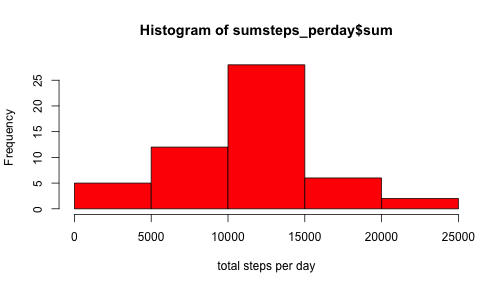
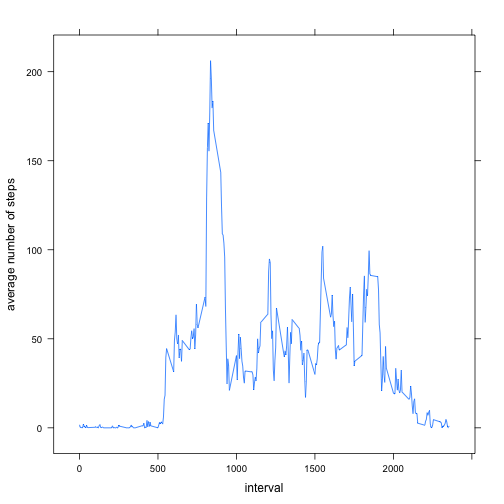
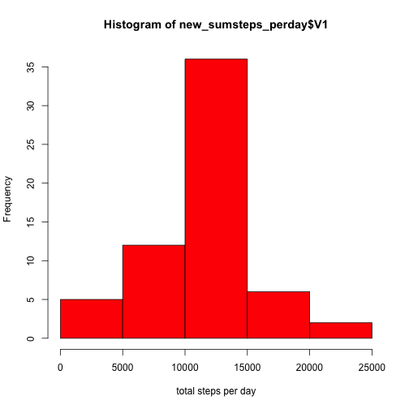

THis file contains the data processing and analysis required in peer assignment 1  
========================================================================================

The data we are processing is of that of a activity monitoring device of an anonymous individual over a period  
two months

### loading and processing the data

THe data is in the csv format we use to following code to read the data


```r
activity_data <- read.csv("activity.csv")
summary(activity_data)
```

```
##      steps               date          interval   
##  Min.   :  0.0   2012-10-01:  288   Min.   :   0  
##  1st Qu.:  0.0   2012-10-02:  288   1st Qu.: 589  
##  Median :  0.0   2012-10-03:  288   Median :1178  
##  Mean   : 37.4   2012-10-04:  288   Mean   :1178  
##  3rd Qu.: 12.0   2012-10-05:  288   3rd Qu.:1766  
##  Max.   :806.0   2012-10-06:  288   Max.   :2355  
##  NA's   :2304    (Other)   :15840
```


### Mean of total number of steps taken per day
for this we shall ignore the NAs in the dataset and consider only the complete cases

```r
complete_cases <- activity_data[complete.cases(activity_data), ]
```


we shall use the data table package to find out the mean and median of total steps per day and also draw the histogram of total steps taken per day


```r
install.packages("data.table")
```

```
## Error: trying to use CRAN without setting a mirror
```

```r
library(data.table)
dt <- data.table(complete_cases)
sumsteps_perday <- dt[, list(sum = sum(steps)), by = date]
hist(sumsteps_perday$sum, col = "red", xlab = "total steps per day")
```

 

```r
meansteps_perday <- dt[, list(mean = mean(steps), median = median(steps)), by = date]
summary(meansteps_perday)
```

```
##          date         mean           median 
##  2012-10-02: 1   Min.   : 0.14   Min.   :0  
##  2012-10-03: 1   1st Qu.:30.70   1st Qu.:0  
##  2012-10-04: 1   Median :37.38   Median :0  
##  2012-10-05: 1   Mean   :37.38   Mean   :0  
##  2012-10-06: 1   3rd Qu.:46.16   3rd Qu.:0  
##  2012-10-07: 1   Max.   :73.59   Max.   :0  
##  (Other)   :47
```


### plot of time intervel and average number of steps


```r
library(lattice)
dt <- data.table(complete_cases)
averagesetps_perintervel <- dt[, mean(steps), by = interval]
attach(averagesetps_perintervel)
xyplot(V1 ~ interval, type = "l", ylab = "average number of steps")
```

 


## Inputing missing values
### Calculate and report the total number of missing values in the dataset (i.e. the total number of rows with NAs)
The number of rows with missing values is:


```r
incomplete_cases <- activity_data[!complete.cases(activity_data), ]
dim(incomplete_cases)[1]
```

```
## [1] 2304
```

### Devise a strategy for filling in all of the missing values in the dataset. The strategy does not need to be sophisticated. For example, you could use the mean/median for that day, or the mean for that 5-minute interval, etc.
The NAs are replaced by mean steps of that intervel

```r
processed_data <- activity_data
for (i in 1:nrow(processed_data)) {
    row <- processed_data[i, ]
    if (is.na(row$steps)) {
        processed_data[i, "steps"] <- averagesetps_perintervel[averagesetps_perintervel$interval == 
            row$interval, V1]
    }
    i <- i + 1
}
```

### now it can be checked that every row is a complete case  

```r
incomplete_cases <- activity_data[!complete.cases(activity_data), ]
dim(incomplete_cases)[1]
```

```
## [1] 2304
```


### Make a histogram of the total number of steps taken each day  

```r
library(data.table)
dt <- data.table(processed_data)
new_sumsteps_perday <- dt[, sum(steps), by = date]
hist(new_sumsteps_perday$V1, col = "red", xlab = "total steps per day")
```

 


###Calculate and report the mean and median total number of steps taken per day


```r
new_meansteps_perday <- dt[, list(mean = mean(steps), median = median(steps)), 
    by = date]
summary(new_meansteps_perday)
```

```
##          date         mean           median     
##  2012-10-01: 1   Min.   : 0.14   Min.   : 0.00  
##  2012-10-02: 1   1st Qu.:34.09   1st Qu.: 0.00  
##  2012-10-03: 1   Median :37.38   Median : 0.00  
##  2012-10-04: 1   Mean   :37.38   Mean   : 4.47  
##  2012-10-05: 1   3rd Qu.:44.48   3rd Qu.: 0.00  
##  2012-10-06: 1   Max.   :73.59   Max.   :34.11  
##  (Other)   :55
```

### the impace seems to be very minimal. THe median values are always coming as Zeros irrespective of processing

```r
processed_data$weekday <- "weekday"
for (i in 1:nrow(processed_data)) {
    row <- processed_data[i, ]
    if (weekdays(as.Date(row$date)) %in% c("Saturday", "Sunday")) {
        processed_data[i, "weekday"] <- "weekend"
    }
    i <- i + 1
}
processed_data
```

```
##           steps       date interval weekday
## 1       1.71698 2012-10-01        0 weekday
## 2       0.33962 2012-10-01        5 weekday
## 3       0.13208 2012-10-01       10 weekday
## 4       0.15094 2012-10-01       15 weekday
## 5       0.07547 2012-10-01       20 weekday
## 6       2.09434 2012-10-01       25 weekday
## 7       0.52830 2012-10-01       30 weekday
## 8       0.86792 2012-10-01       35 weekday
## 9       0.00000 2012-10-01       40 weekday
## 10      1.47170 2012-10-01       45 weekday
## 11      0.30189 2012-10-01       50 weekday
## 12      0.13208 2012-10-01       55 weekday
## 13      0.32075 2012-10-01      100 weekday
## 14      0.67925 2012-10-01      105 weekday
## 15      0.15094 2012-10-01      110 weekday
## 16      0.33962 2012-10-01      115 weekday
## 17      0.00000 2012-10-01      120 weekday
## 18      1.11321 2012-10-01      125 weekday
## 19      1.83019 2012-10-01      130 weekday
## 20      0.16981 2012-10-01      135 weekday
## 21      0.16981 2012-10-01      140 weekday
## 22      0.37736 2012-10-01      145 weekday
## 23      0.26415 2012-10-01      150 weekday
## 24      0.00000 2012-10-01      155 weekday
## 25      0.00000 2012-10-01      200 weekday
## 26      0.00000 2012-10-01      205 weekday
## 27      1.13208 2012-10-01      210 weekday
## 28      0.00000 2012-10-01      215 weekday
## 29      0.00000 2012-10-01      220 weekday
## 30      0.13208 2012-10-01      225 weekday
## 31      0.00000 2012-10-01      230 weekday
## 32      0.22642 2012-10-01      235 weekday
## 33      0.00000 2012-10-01      240 weekday
## 34      0.00000 2012-10-01      245 weekday
## 35      1.54717 2012-10-01      250 weekday
## 36      0.94340 2012-10-01      255 weekday
## 37      0.00000 2012-10-01      300 weekday
## 38      0.00000 2012-10-01      305 weekday
## 39      0.00000 2012-10-01      310 weekday
## 40      0.00000 2012-10-01      315 weekday
## 41      0.20755 2012-10-01      320 weekday
## 42      0.62264 2012-10-01      325 weekday
## 43      1.62264 2012-10-01      330 weekday
## 44      0.58491 2012-10-01      335 weekday
## 45      0.49057 2012-10-01      340 weekday
## 46      0.07547 2012-10-01      345 weekday
## 47      0.00000 2012-10-01      350 weekday
## 48      0.00000 2012-10-01      355 weekday
## 49      1.18868 2012-10-01      400 weekday
## 50      0.94340 2012-10-01      405 weekday
## 51      2.56604 2012-10-01      410 weekday
## 52      0.00000 2012-10-01      415 weekday
## 53      0.33962 2012-10-01      420 weekday
## 54      0.35849 2012-10-01      425 weekday
## 55      4.11321 2012-10-01      430 weekday
## 56      0.66038 2012-10-01      435 weekday
## 57      3.49057 2012-10-01      440 weekday
## 58      0.83019 2012-10-01      445 weekday
## 59      3.11321 2012-10-01      450 weekday
## 60      1.11321 2012-10-01      455 weekday
## 61      0.00000 2012-10-01      500 weekday
## 62      1.56604 2012-10-01      505 weekday
## 63      3.00000 2012-10-01      510 weekday
## 64      2.24528 2012-10-01      515 weekday
## 65      3.32075 2012-10-01      520 weekday
## 66      2.96226 2012-10-01      525 weekday
## 67      2.09434 2012-10-01      530 weekday
## 68      6.05660 2012-10-01      535 weekday
## 69     16.01887 2012-10-01      540 weekday
## 70     18.33962 2012-10-01      545 weekday
## 71     39.45283 2012-10-01      550 weekday
## 72     44.49057 2012-10-01      555 weekday
## 73     31.49057 2012-10-01      600 weekday
## 74     49.26415 2012-10-01      605 weekday
## 75     53.77358 2012-10-01      610 weekday
## 76     63.45283 2012-10-01      615 weekday
## 77     49.96226 2012-10-01      620 weekday
## 78     47.07547 2012-10-01      625 weekday
## 79     52.15094 2012-10-01      630 weekday
## 80     39.33962 2012-10-01      635 weekday
## 81     44.01887 2012-10-01      640 weekday
## 82     44.16981 2012-10-01      645 weekday
## 83     37.35849 2012-10-01      650 weekday
## 84     49.03774 2012-10-01      655 weekday
## 85     43.81132 2012-10-01      700 weekday
## 86     44.37736 2012-10-01      705 weekday
## 87     50.50943 2012-10-01      710 weekday
## 88     54.50943 2012-10-01      715 weekday
## 89     49.92453 2012-10-01      720 weekday
## 90     50.98113 2012-10-01      725 weekday
## 91     55.67925 2012-10-01      730 weekday
## 92     44.32075 2012-10-01      735 weekday
## 93     52.26415 2012-10-01      740 weekday
## 94     69.54717 2012-10-01      745 weekday
## 95     57.84906 2012-10-01      750 weekday
## 96     56.15094 2012-10-01      755 weekday
## 97     73.37736 2012-10-01      800 weekday
## 98     68.20755 2012-10-01      805 weekday
## 99    129.43396 2012-10-01      810 weekday
## 100   157.52830 2012-10-01      815 weekday
## 101   171.15094 2012-10-01      820 weekday
## 102   155.39623 2012-10-01      825 weekday
## 103   177.30189 2012-10-01      830 weekday
## 104   206.16981 2012-10-01      835 weekday
## 105   195.92453 2012-10-01      840 weekday
## 106   179.56604 2012-10-01      845 weekday
## 107   183.39623 2012-10-01      850 weekday
## 108   167.01887 2012-10-01      855 weekday
## 109   143.45283 2012-10-01      900 weekday
## 110   124.03774 2012-10-01      905 weekday
## 111   109.11321 2012-10-01      910 weekday
## 112   108.11321 2012-10-01      915 weekday
## 113   103.71698 2012-10-01      920 weekday
## 114    95.96226 2012-10-01      925 weekday
## 115    66.20755 2012-10-01      930 weekday
## 116    45.22642 2012-10-01      935 weekday
## 117    24.79245 2012-10-01      940 weekday
## 118    38.75472 2012-10-01      945 weekday
## 119    34.98113 2012-10-01      950 weekday
## 120    21.05660 2012-10-01      955 weekday
## 121    40.56604 2012-10-01     1000 weekday
## 122    26.98113 2012-10-01     1005 weekday
## 123    42.41509 2012-10-01     1010 weekday
## 124    52.66038 2012-10-01     1015 weekday
## 125    38.92453 2012-10-01     1020 weekday
## 126    50.79245 2012-10-01     1025 weekday
## 127    44.28302 2012-10-01     1030 weekday
## 128    37.41509 2012-10-01     1035 weekday
## 129    34.69811 2012-10-01     1040 weekday
## 130    28.33962 2012-10-01     1045 weekday
## 131    25.09434 2012-10-01     1050 weekday
## 132    31.94340 2012-10-01     1055 weekday
## 133    31.35849 2012-10-01     1100 weekday
## 134    29.67925 2012-10-01     1105 weekday
## 135    21.32075 2012-10-01     1110 weekday
## 136    25.54717 2012-10-01     1115 weekday
## 137    28.37736 2012-10-01     1120 weekday
## 138    26.47170 2012-10-01     1125 weekday
## 139    33.43396 2012-10-01     1130 weekday
## 140    49.98113 2012-10-01     1135 weekday
## 141    42.03774 2012-10-01     1140 weekday
## 142    44.60377 2012-10-01     1145 weekday
## 143    46.03774 2012-10-01     1150 weekday
## 144    59.18868 2012-10-01     1155 weekday
## 145    63.86792 2012-10-01     1200 weekday
## 146    87.69811 2012-10-01     1205 weekday
## 147    94.84906 2012-10-01     1210 weekday
## 148    92.77358 2012-10-01     1215 weekday
## 149    63.39623 2012-10-01     1220 weekday
## 150    50.16981 2012-10-01     1225 weekday
## 151    54.47170 2012-10-01     1230 weekday
## 152    32.41509 2012-10-01     1235 weekday
## 153    26.52830 2012-10-01     1240 weekday
## 154    37.73585 2012-10-01     1245 weekday
## 155    45.05660 2012-10-01     1250 weekday
## 156    67.28302 2012-10-01     1255 weekday
## 157    42.33962 2012-10-01     1300 weekday
## 158    39.88679 2012-10-01     1305 weekday
## 159    43.26415 2012-10-01     1310 weekday
## 160    40.98113 2012-10-01     1315 weekday
## 161    46.24528 2012-10-01     1320 weekday
## 162    56.43396 2012-10-01     1325 weekday
## 163    42.75472 2012-10-01     1330 weekday
## 164    25.13208 2012-10-01     1335 weekday
## 165    39.96226 2012-10-01     1340 weekday
## 166    53.54717 2012-10-01     1345 weekday
## 167    47.32075 2012-10-01     1350 weekday
## 168    60.81132 2012-10-01     1355 weekday
## 169    55.75472 2012-10-01     1400 weekday
## 170    51.96226 2012-10-01     1405 weekday
## 171    43.58491 2012-10-01     1410 weekday
## 172    48.69811 2012-10-01     1415 weekday
## 173    35.47170 2012-10-01     1420 weekday
## 174    37.54717 2012-10-01     1425 weekday
## 175    41.84906 2012-10-01     1430 weekday
## 176    27.50943 2012-10-01     1435 weekday
## 177    17.11321 2012-10-01     1440 weekday
## 178    26.07547 2012-10-01     1445 weekday
## 179    43.62264 2012-10-01     1450 weekday
## 180    43.77358 2012-10-01     1455 weekday
## 181    30.01887 2012-10-01     1500 weekday
## 182    36.07547 2012-10-01     1505 weekday
## 183    35.49057 2012-10-01     1510 weekday
## 184    38.84906 2012-10-01     1515 weekday
## 185    45.96226 2012-10-01     1520 weekday
## 186    47.75472 2012-10-01     1525 weekday
## 187    48.13208 2012-10-01     1530 weekday
## 188    65.32075 2012-10-01     1535 weekday
## 189    82.90566 2012-10-01     1540 weekday
## 190    98.66038 2012-10-01     1545 weekday
## 191   102.11321 2012-10-01     1550 weekday
## 192    83.96226 2012-10-01     1555 weekday
## 193    62.13208 2012-10-01     1600 weekday
## 194    64.13208 2012-10-01     1605 weekday
## 195    74.54717 2012-10-01     1610 weekday
## 196    63.16981 2012-10-01     1615 weekday
## 197    56.90566 2012-10-01     1620 weekday
## 198    59.77358 2012-10-01     1625 weekday
## 199    43.86792 2012-10-01     1630 weekday
## 200    38.56604 2012-10-01     1635 weekday
## 201    44.66038 2012-10-01     1640 weekday
## 202    45.45283 2012-10-01     1645 weekday
## 203    46.20755 2012-10-01     1650 weekday
## 204    43.67925 2012-10-01     1655 weekday
## 205    46.62264 2012-10-01     1700 weekday
## 206    56.30189 2012-10-01     1705 weekday
## 207    50.71698 2012-10-01     1710 weekday
## 208    61.22642 2012-10-01     1715 weekday
## 209    72.71698 2012-10-01     1720 weekday
## 210    78.94340 2012-10-01     1725 weekday
## 211    68.94340 2012-10-01     1730 weekday
## 212    59.66038 2012-10-01     1735 weekday
## 213    75.09434 2012-10-01     1740 weekday
## 214    56.50943 2012-10-01     1745 weekday
## 215    34.77358 2012-10-01     1750 weekday
## 216    37.45283 2012-10-01     1755 weekday
## 217    40.67925 2012-10-01     1800 weekday
## 218    58.01887 2012-10-01     1805 weekday
## 219    74.69811 2012-10-01     1810 weekday
## 220    85.32075 2012-10-01     1815 weekday
## 221    59.26415 2012-10-01     1820 weekday
## 222    67.77358 2012-10-01     1825 weekday
## 223    77.69811 2012-10-01     1830 weekday
## 224    74.24528 2012-10-01     1835 weekday
## 225    85.33962 2012-10-01     1840 weekday
## 226    99.45283 2012-10-01     1845 weekday
## 227    86.58491 2012-10-01     1850 weekday
## 228    85.60377 2012-10-01     1855 weekday
## 229    84.86792 2012-10-01     1900 weekday
## 230    77.83019 2012-10-01     1905 weekday
## 231    58.03774 2012-10-01     1910 weekday
## 232    53.35849 2012-10-01     1915 weekday
## 233    36.32075 2012-10-01     1920 weekday
## 234    20.71698 2012-10-01     1925 weekday
## 235    27.39623 2012-10-01     1930 weekday
## 236    40.01887 2012-10-01     1935 weekday
## 237    30.20755 2012-10-01     1940 weekday
## 238    25.54717 2012-10-01     1945 weekday
## 239    45.66038 2012-10-01     1950 weekday
## 240    33.52830 2012-10-01     1955 weekday
## 241    19.62264 2012-10-01     2000 weekday
## 242    19.01887 2012-10-01     2005 weekday
## 243    19.33962 2012-10-01     2010 weekday
## 244    33.33962 2012-10-01     2015 weekday
## 245    26.81132 2012-10-01     2020 weekday
## 246    21.16981 2012-10-01     2025 weekday
## 247    27.30189 2012-10-01     2030 weekday
## 248    21.33962 2012-10-01     2035 weekday
## 249    19.54717 2012-10-01     2040 weekday
## 250    21.32075 2012-10-01     2045 weekday
## 251    32.30189 2012-10-01     2050 weekday
## 252    20.15094 2012-10-01     2055 weekday
## 253    15.94340 2012-10-01     2100 weekday
## 254    17.22642 2012-10-01     2105 weekday
## 255    23.45283 2012-10-01     2110 weekday
## 256    19.24528 2012-10-01     2115 weekday
## 257    12.45283 2012-10-01     2120 weekday
## 258     8.01887 2012-10-01     2125 weekday
## 259    14.66038 2012-10-01     2130 weekday
## 260    16.30189 2012-10-01     2135 weekday
## 261     8.67925 2012-10-01     2140 weekday
## 262     7.79245 2012-10-01     2145 weekday
## 263     8.13208 2012-10-01     2150 weekday
## 264     2.62264 2012-10-01     2155 weekday
## 265     1.45283 2012-10-01     2200 weekday
## 266     3.67925 2012-10-01     2205 weekday
## 267     4.81132 2012-10-01     2210 weekday
## 268     8.50943 2012-10-01     2215 weekday
## 269     7.07547 2012-10-01     2220 weekday
## 270     8.69811 2012-10-01     2225 weekday
## 271     9.75472 2012-10-01     2230 weekday
## 272     2.20755 2012-10-01     2235 weekday
## 273     0.32075 2012-10-01     2240 weekday
## 274     0.11321 2012-10-01     2245 weekday
## 275     1.60377 2012-10-01     2250 weekday
## 276     4.60377 2012-10-01     2255 weekday
## 277     3.30189 2012-10-01     2300 weekday
## 278     2.84906 2012-10-01     2305 weekday
## 279     0.00000 2012-10-01     2310 weekday
## 280     0.83019 2012-10-01     2315 weekday
## 281     0.96226 2012-10-01     2320 weekday
## 282     1.58491 2012-10-01     2325 weekday
## 283     2.60377 2012-10-01     2330 weekday
## 284     4.69811 2012-10-01     2335 weekday
## 285     3.30189 2012-10-01     2340 weekday
## 286     0.64151 2012-10-01     2345 weekday
## 287     0.22642 2012-10-01     2350 weekday
## 288     1.07547 2012-10-01     2355 weekday
## 289     0.00000 2012-10-02        0 weekday
## 290     0.00000 2012-10-02        5 weekday
## 291     0.00000 2012-10-02       10 weekday
## 292     0.00000 2012-10-02       15 weekday
## 293     0.00000 2012-10-02       20 weekday
## 294     0.00000 2012-10-02       25 weekday
## 295     0.00000 2012-10-02       30 weekday
## 296     0.00000 2012-10-02       35 weekday
## 297     0.00000 2012-10-02       40 weekday
## 298     0.00000 2012-10-02       45 weekday
## 299     0.00000 2012-10-02       50 weekday
## 300     0.00000 2012-10-02       55 weekday
## 301     0.00000 2012-10-02      100 weekday
## 302     0.00000 2012-10-02      105 weekday
## 303     0.00000 2012-10-02      110 weekday
## 304     0.00000 2012-10-02      115 weekday
## 305     0.00000 2012-10-02      120 weekday
## 306     0.00000 2012-10-02      125 weekday
## 307     0.00000 2012-10-02      130 weekday
## 308     0.00000 2012-10-02      135 weekday
## 309     0.00000 2012-10-02      140 weekday
## 310     0.00000 2012-10-02      145 weekday
## 311     0.00000 2012-10-02      150 weekday
## 312     0.00000 2012-10-02      155 weekday
## 313     0.00000 2012-10-02      200 weekday
## 314     0.00000 2012-10-02      205 weekday
## 315     0.00000 2012-10-02      210 weekday
## 316     0.00000 2012-10-02      215 weekday
## 317     0.00000 2012-10-02      220 weekday
## 318     0.00000 2012-10-02      225 weekday
## 319     0.00000 2012-10-02      230 weekday
## 320     0.00000 2012-10-02      235 weekday
## 321     0.00000 2012-10-02      240 weekday
## 322     0.00000 2012-10-02      245 weekday
## 323     0.00000 2012-10-02      250 weekday
## 324     0.00000 2012-10-02      255 weekday
## 325     0.00000 2012-10-02      300 weekday
## 326     0.00000 2012-10-02      305 weekday
## 327     0.00000 2012-10-02      310 weekday
## 328     0.00000 2012-10-02      315 weekday
## 329     0.00000 2012-10-02      320 weekday
## 330     0.00000 2012-10-02      325 weekday
## 331     0.00000 2012-10-02      330 weekday
## 332     0.00000 2012-10-02      335 weekday
## 333     0.00000 2012-10-02      340 weekday
## 334     0.00000 2012-10-02      345 weekday
## 335     0.00000 2012-10-02      350 weekday
## 336     0.00000 2012-10-02      355 weekday
## 337     0.00000 2012-10-02      400 weekday
## 338     0.00000 2012-10-02      405 weekday
## 339     0.00000 2012-10-02      410 weekday
## 340     0.00000 2012-10-02      415 weekday
## 341     0.00000 2012-10-02      420 weekday
## 342     0.00000 2012-10-02      425 weekday
## 343     0.00000 2012-10-02      430 weekday
## 344     0.00000 2012-10-02      435 weekday
## 345     0.00000 2012-10-02      440 weekday
## 346     0.00000 2012-10-02      445 weekday
## 347     0.00000 2012-10-02      450 weekday
## 348     0.00000 2012-10-02      455 weekday
## 349     0.00000 2012-10-02      500 weekday
## 350     0.00000 2012-10-02      505 weekday
## 351     0.00000 2012-10-02      510 weekday
## 352     0.00000 2012-10-02      515 weekday
## 353     0.00000 2012-10-02      520 weekday
## 354     0.00000 2012-10-02      525 weekday
## 355     0.00000 2012-10-02      530 weekday
## 356     0.00000 2012-10-02      535 weekday
## 357     0.00000 2012-10-02      540 weekday
## 358     0.00000 2012-10-02      545 weekday
## 359     0.00000 2012-10-02      550 weekday
## 360     0.00000 2012-10-02      555 weekday
## 361     0.00000 2012-10-02      600 weekday
## 362     0.00000 2012-10-02      605 weekday
## 363     0.00000 2012-10-02      610 weekday
## 364     0.00000 2012-10-02      615 weekday
## 365     0.00000 2012-10-02      620 weekday
## 366     0.00000 2012-10-02      625 weekday
## 367     0.00000 2012-10-02      630 weekday
## 368     0.00000 2012-10-02      635 weekday
## 369     0.00000 2012-10-02      640 weekday
## 370     0.00000 2012-10-02      645 weekday
## 371     0.00000 2012-10-02      650 weekday
## 372     0.00000 2012-10-02      655 weekday
## 373     0.00000 2012-10-02      700 weekday
## 374     0.00000 2012-10-02      705 weekday
## 375     0.00000 2012-10-02      710 weekday
## 376     0.00000 2012-10-02      715 weekday
## 377     0.00000 2012-10-02      720 weekday
## 378     0.00000 2012-10-02      725 weekday
## 379     0.00000 2012-10-02      730 weekday
## 380     0.00000 2012-10-02      735 weekday
## 381     0.00000 2012-10-02      740 weekday
## 382     0.00000 2012-10-02      745 weekday
## 383     0.00000 2012-10-02      750 weekday
## 384     0.00000 2012-10-02      755 weekday
## 385     0.00000 2012-10-02      800 weekday
## 386     0.00000 2012-10-02      805 weekday
## 387     0.00000 2012-10-02      810 weekday
## 388     0.00000 2012-10-02      815 weekday
## 389     0.00000 2012-10-02      820 weekday
## 390     0.00000 2012-10-02      825 weekday
## 391     0.00000 2012-10-02      830 weekday
## 392     0.00000 2012-10-02      835 weekday
## 393     0.00000 2012-10-02      840 weekday
## 394     0.00000 2012-10-02      845 weekday
## 395     0.00000 2012-10-02      850 weekday
## 396     0.00000 2012-10-02      855 weekday
## 397     0.00000 2012-10-02      900 weekday
## 398     0.00000 2012-10-02      905 weekday
## 399     0.00000 2012-10-02      910 weekday
## 400     0.00000 2012-10-02      915 weekday
## 401     0.00000 2012-10-02      920 weekday
## 402     0.00000 2012-10-02      925 weekday
## 403     0.00000 2012-10-02      930 weekday
## 404     0.00000 2012-10-02      935 weekday
## 405     0.00000 2012-10-02      940 weekday
## 406     0.00000 2012-10-02      945 weekday
## 407     0.00000 2012-10-02      950 weekday
## 408     0.00000 2012-10-02      955 weekday
## 409     0.00000 2012-10-02     1000 weekday
## 410     0.00000 2012-10-02     1005 weekday
## 411     0.00000 2012-10-02     1010 weekday
## 412     0.00000 2012-10-02     1015 weekday
## 413     0.00000 2012-10-02     1020 weekday
## 414     0.00000 2012-10-02     1025 weekday
## 415     0.00000 2012-10-02     1030 weekday
## 416     0.00000 2012-10-02     1035 weekday
## 417     0.00000 2012-10-02     1040 weekday
## 418     0.00000 2012-10-02     1045 weekday
## 419     0.00000 2012-10-02     1050 weekday
## 420     0.00000 2012-10-02     1055 weekday
## 421     0.00000 2012-10-02     1100 weekday
## 422     0.00000 2012-10-02     1105 weekday
## 423     0.00000 2012-10-02     1110 weekday
## 424     0.00000 2012-10-02     1115 weekday
## 425     0.00000 2012-10-02     1120 weekday
## 426     0.00000 2012-10-02     1125 weekday
## 427     0.00000 2012-10-02     1130 weekday
## 428     0.00000 2012-10-02     1135 weekday
## 429     0.00000 2012-10-02     1140 weekday
## 430     0.00000 2012-10-02     1145 weekday
## 431     0.00000 2012-10-02     1150 weekday
## 432     0.00000 2012-10-02     1155 weekday
## 433     0.00000 2012-10-02     1200 weekday
## 434     0.00000 2012-10-02     1205 weekday
## 435     0.00000 2012-10-02     1210 weekday
## 436     0.00000 2012-10-02     1215 weekday
## 437     0.00000 2012-10-02     1220 weekday
## 438     0.00000 2012-10-02     1225 weekday
## 439     0.00000 2012-10-02     1230 weekday
## 440     0.00000 2012-10-02     1235 weekday
## 441     0.00000 2012-10-02     1240 weekday
## 442     0.00000 2012-10-02     1245 weekday
## 443     0.00000 2012-10-02     1250 weekday
## 444     0.00000 2012-10-02     1255 weekday
## 445     0.00000 2012-10-02     1300 weekday
## 446     0.00000 2012-10-02     1305 weekday
## 447     0.00000 2012-10-02     1310 weekday
## 448     0.00000 2012-10-02     1315 weekday
## 449     0.00000 2012-10-02     1320 weekday
## 450     0.00000 2012-10-02     1325 weekday
## 451     0.00000 2012-10-02     1330 weekday
## 452     0.00000 2012-10-02     1335 weekday
## 453     0.00000 2012-10-02     1340 weekday
## 454     0.00000 2012-10-02     1345 weekday
## 455     0.00000 2012-10-02     1350 weekday
## 456     0.00000 2012-10-02     1355 weekday
## 457     0.00000 2012-10-02     1400 weekday
## 458     0.00000 2012-10-02     1405 weekday
## 459     0.00000 2012-10-02     1410 weekday
## 460     0.00000 2012-10-02     1415 weekday
## 461     0.00000 2012-10-02     1420 weekday
## 462     0.00000 2012-10-02     1425 weekday
## 463     0.00000 2012-10-02     1430 weekday
## 464     0.00000 2012-10-02     1435 weekday
## 465     0.00000 2012-10-02     1440 weekday
## 466     0.00000 2012-10-02     1445 weekday
## 467     0.00000 2012-10-02     1450 weekday
## 468     0.00000 2012-10-02     1455 weekday
## 469     0.00000 2012-10-02     1500 weekday
## 470     0.00000 2012-10-02     1505 weekday
## 471     0.00000 2012-10-02     1510 weekday
## 472     0.00000 2012-10-02     1515 weekday
## 473     0.00000 2012-10-02     1520 weekday
## 474     0.00000 2012-10-02     1525 weekday
## 475     0.00000 2012-10-02     1530 weekday
## 476     0.00000 2012-10-02     1535 weekday
## 477     0.00000 2012-10-02     1540 weekday
## 478     0.00000 2012-10-02     1545 weekday
## 479     0.00000 2012-10-02     1550 weekday
## 480     0.00000 2012-10-02     1555 weekday
## 481     0.00000 2012-10-02     1600 weekday
## 482     0.00000 2012-10-02     1605 weekday
## 483     0.00000 2012-10-02     1610 weekday
## 484     0.00000 2012-10-02     1615 weekday
## 485     0.00000 2012-10-02     1620 weekday
## 486     0.00000 2012-10-02     1625 weekday
## 487     0.00000 2012-10-02     1630 weekday
## 488     0.00000 2012-10-02     1635 weekday
## 489     0.00000 2012-10-02     1640 weekday
## 490     0.00000 2012-10-02     1645 weekday
## 491     0.00000 2012-10-02     1650 weekday
## 492     0.00000 2012-10-02     1655 weekday
## 493     0.00000 2012-10-02     1700 weekday
## 494     0.00000 2012-10-02     1705 weekday
## 495     0.00000 2012-10-02     1710 weekday
## 496     0.00000 2012-10-02     1715 weekday
## 497     0.00000 2012-10-02     1720 weekday
## 498     0.00000 2012-10-02     1725 weekday
## 499     0.00000 2012-10-02     1730 weekday
## 500     0.00000 2012-10-02     1735 weekday
## 501     0.00000 2012-10-02     1740 weekday
## 502     0.00000 2012-10-02     1745 weekday
## 503     0.00000 2012-10-02     1750 weekday
## 504     0.00000 2012-10-02     1755 weekday
## 505     0.00000 2012-10-02     1800 weekday
## 506     0.00000 2012-10-02     1805 weekday
## 507     0.00000 2012-10-02     1810 weekday
## 508     0.00000 2012-10-02     1815 weekday
## 509     0.00000 2012-10-02     1820 weekday
## 510     0.00000 2012-10-02     1825 weekday
## 511     0.00000 2012-10-02     1830 weekday
## 512     0.00000 2012-10-02     1835 weekday
## 513     0.00000 2012-10-02     1840 weekday
## 514     0.00000 2012-10-02     1845 weekday
## 515     0.00000 2012-10-02     1850 weekday
## 516     0.00000 2012-10-02     1855 weekday
## 517     0.00000 2012-10-02     1900 weekday
## 518     0.00000 2012-10-02     1905 weekday
## 519     0.00000 2012-10-02     1910 weekday
## 520     0.00000 2012-10-02     1915 weekday
## 521     0.00000 2012-10-02     1920 weekday
## 522     0.00000 2012-10-02     1925 weekday
## 523     0.00000 2012-10-02     1930 weekday
## 524     0.00000 2012-10-02     1935 weekday
## 525     0.00000 2012-10-02     1940 weekday
## 526     0.00000 2012-10-02     1945 weekday
## 527     0.00000 2012-10-02     1950 weekday
## 528     0.00000 2012-10-02     1955 weekday
## 529     0.00000 2012-10-02     2000 weekday
## 530     0.00000 2012-10-02     2005 weekday
## 531     0.00000 2012-10-02     2010 weekday
## 532     0.00000 2012-10-02     2015 weekday
## 533     0.00000 2012-10-02     2020 weekday
## 534     0.00000 2012-10-02     2025 weekday
## 535     0.00000 2012-10-02     2030 weekday
## 536     0.00000 2012-10-02     2035 weekday
## 537     0.00000 2012-10-02     2040 weekday
## 538     0.00000 2012-10-02     2045 weekday
## 539     0.00000 2012-10-02     2050 weekday
## 540     0.00000 2012-10-02     2055 weekday
## 541     0.00000 2012-10-02     2100 weekday
## 542     0.00000 2012-10-02     2105 weekday
## 543     0.00000 2012-10-02     2110 weekday
## 544     0.00000 2012-10-02     2115 weekday
## 545     0.00000 2012-10-02     2120 weekday
## 546     0.00000 2012-10-02     2125 weekday
## 547     0.00000 2012-10-02     2130 weekday
## 548     0.00000 2012-10-02     2135 weekday
## 549     0.00000 2012-10-02     2140 weekday
## 550     0.00000 2012-10-02     2145 weekday
## 551     0.00000 2012-10-02     2150 weekday
## 552     0.00000 2012-10-02     2155 weekday
## 553     0.00000 2012-10-02     2200 weekday
## 554     0.00000 2012-10-02     2205 weekday
## 555   117.00000 2012-10-02     2210 weekday
## 556     9.00000 2012-10-02     2215 weekday
## 557     0.00000 2012-10-02     2220 weekday
## 558     0.00000 2012-10-02     2225 weekday
## 559     0.00000 2012-10-02     2230 weekday
## 560     0.00000 2012-10-02     2235 weekday
## 561     0.00000 2012-10-02     2240 weekday
## 562     0.00000 2012-10-02     2245 weekday
## 563     0.00000 2012-10-02     2250 weekday
## 564     0.00000 2012-10-02     2255 weekday
## 565     0.00000 2012-10-02     2300 weekday
## 566     0.00000 2012-10-02     2305 weekday
## 567     0.00000 2012-10-02     2310 weekday
## 568     0.00000 2012-10-02     2315 weekday
## 569     0.00000 2012-10-02     2320 weekday
## 570     0.00000 2012-10-02     2325 weekday
## 571     0.00000 2012-10-02     2330 weekday
## 572     0.00000 2012-10-02     2335 weekday
## 573     0.00000 2012-10-02     2340 weekday
## 574     0.00000 2012-10-02     2345 weekday
## 575     0.00000 2012-10-02     2350 weekday
## 576     0.00000 2012-10-02     2355 weekday
## 577     0.00000 2012-10-03        0 weekday
## 578     0.00000 2012-10-03        5 weekday
## 579     0.00000 2012-10-03       10 weekday
## 580     0.00000 2012-10-03       15 weekday
## 581     0.00000 2012-10-03       20 weekday
## 582     0.00000 2012-10-03       25 weekday
## 583     0.00000 2012-10-03       30 weekday
## 584     0.00000 2012-10-03       35 weekday
## 585     0.00000 2012-10-03       40 weekday
## 586     0.00000 2012-10-03       45 weekday
## 587     0.00000 2012-10-03       50 weekday
## 588     0.00000 2012-10-03       55 weekday
## 589     0.00000 2012-10-03      100 weekday
## 590     0.00000 2012-10-03      105 weekday
## 591     0.00000 2012-10-03      110 weekday
## 592     0.00000 2012-10-03      115 weekday
## 593     0.00000 2012-10-03      120 weekday
## 594     0.00000 2012-10-03      125 weekday
## 595     0.00000 2012-10-03      130 weekday
## 596     0.00000 2012-10-03      135 weekday
## 597     0.00000 2012-10-03      140 weekday
## 598     0.00000 2012-10-03      145 weekday
## 599     0.00000 2012-10-03      150 weekday
## 600     0.00000 2012-10-03      155 weekday
## 601     0.00000 2012-10-03      200 weekday
## 602     0.00000 2012-10-03      205 weekday
## 603     0.00000 2012-10-03      210 weekday
## 604     0.00000 2012-10-03      215 weekday
## 605     0.00000 2012-10-03      220 weekday
## 606     0.00000 2012-10-03      225 weekday
## 607     0.00000 2012-10-03      230 weekday
## 608     0.00000 2012-10-03      235 weekday
## 609     0.00000 2012-10-03      240 weekday
## 610     0.00000 2012-10-03      245 weekday
## 611     0.00000 2012-10-03      250 weekday
## 612     0.00000 2012-10-03      255 weekday
## 613     0.00000 2012-10-03      300 weekday
## 614     0.00000 2012-10-03      305 weekday
## 615     0.00000 2012-10-03      310 weekday
## 616     0.00000 2012-10-03      315 weekday
## 617     0.00000 2012-10-03      320 weekday
## 618     0.00000 2012-10-03      325 weekday
## 619     0.00000 2012-10-03      330 weekday
## 620     0.00000 2012-10-03      335 weekday
## 621     0.00000 2012-10-03      340 weekday
## 622     0.00000 2012-10-03      345 weekday
## 623     0.00000 2012-10-03      350 weekday
## 624     0.00000 2012-10-03      355 weekday
## 625     0.00000 2012-10-03      400 weekday
## 626     0.00000 2012-10-03      405 weekday
## 627     4.00000 2012-10-03      410 weekday
## 628     0.00000 2012-10-03      415 weekday
## 629     0.00000 2012-10-03      420 weekday
## 630     0.00000 2012-10-03      425 weekday
## 631    36.00000 2012-10-03      430 weekday
## 632     0.00000 2012-10-03      435 weekday
## 633     0.00000 2012-10-03      440 weekday
## 634     0.00000 2012-10-03      445 weekday
## 635     0.00000 2012-10-03      450 weekday
## 636     0.00000 2012-10-03      455 weekday
## 637     0.00000 2012-10-03      500 weekday
## 638     0.00000 2012-10-03      505 weekday
## 639     0.00000 2012-10-03      510 weekday
## 640     0.00000 2012-10-03      515 weekday
## 641     0.00000 2012-10-03      520 weekday
## 642     0.00000 2012-10-03      525 weekday
## 643     0.00000 2012-10-03      530 weekday
## 644    25.00000 2012-10-03      535 weekday
## 645     0.00000 2012-10-03      540 weekday
## 646     0.00000 2012-10-03      545 weekday
## 647    90.00000 2012-10-03      550 weekday
## 648   411.00000 2012-10-03      555 weekday
## 649   413.00000 2012-10-03      600 weekday
## 650   415.00000 2012-10-03      605 weekday
## 651   519.00000 2012-10-03      610 weekday
## 652   529.00000 2012-10-03      615 weekday
## 653   613.00000 2012-10-03      620 weekday
## 654   562.00000 2012-10-03      625 weekday
## 655   612.00000 2012-10-03      630 weekday
## 656   534.00000 2012-10-03      635 weekday
## 657   323.00000 2012-10-03      640 weekday
## 658   600.00000 2012-10-03      645 weekday
## 659   533.00000 2012-10-03      650 weekday
## 660   251.00000 2012-10-03      655 weekday
## 661    56.00000 2012-10-03      700 weekday
## 662     0.00000 2012-10-03      705 weekday
## 663    32.00000 2012-10-03      710 weekday
## 664    80.00000 2012-10-03      715 weekday
## 665    10.00000 2012-10-03      720 weekday
## 666     9.00000 2012-10-03      725 weekday
## 667   145.00000 2012-10-03      730 weekday
## 668    46.00000 2012-10-03      735 weekday
## 669     0.00000 2012-10-03      740 weekday
## 670    44.00000 2012-10-03      745 weekday
## 671   126.00000 2012-10-03      750 weekday
## 672    42.00000 2012-10-03      755 weekday
## 673   138.00000 2012-10-03      800 weekday
## 674    53.00000 2012-10-03      805 weekday
## 675     0.00000 2012-10-03      810 weekday
## 676     0.00000 2012-10-03      815 weekday
## 677    22.00000 2012-10-03      820 weekday
## 678    57.00000 2012-10-03      825 weekday
## 679   161.00000 2012-10-03      830 weekday
## 680    19.00000 2012-10-03      835 weekday
## 681    15.00000 2012-10-03      840 weekday
## 682     0.00000 2012-10-03      845 weekday
## 683    16.00000 2012-10-03      850 weekday
## 684     0.00000 2012-10-03      855 weekday
## 685     0.00000 2012-10-03      900 weekday
## 686     8.00000 2012-10-03      905 weekday
## 687     0.00000 2012-10-03      910 weekday
## 688    51.00000 2012-10-03      915 weekday
## 689   516.00000 2012-10-03      920 weekday
## 690   245.00000 2012-10-03      925 weekday
## 691     0.00000 2012-10-03      930 weekday
## 692   161.00000 2012-10-03      935 weekday
## 693     7.00000 2012-10-03      940 weekday
## 694     0.00000 2012-10-03      945 weekday
## 695     0.00000 2012-10-03      950 weekday
## 696     0.00000 2012-10-03      955 weekday
## 697     0.00000 2012-10-03     1000 weekday
## 698     0.00000 2012-10-03     1005 weekday
## 699     0.00000 2012-10-03     1010 weekday
## 700     0.00000 2012-10-03     1015 weekday
## 701     0.00000 2012-10-03     1020 weekday
## 702     0.00000 2012-10-03     1025 weekday
## 703     0.00000 2012-10-03     1030 weekday
## 704     0.00000 2012-10-03     1035 weekday
## 705     0.00000 2012-10-03     1040 weekday
## 706     0.00000 2012-10-03     1045 weekday
## 707     0.00000 2012-10-03     1050 weekday
## 708     0.00000 2012-10-03     1055 weekday
## 709     0.00000 2012-10-03     1100 weekday
## 710     0.00000 2012-10-03     1105 weekday
## 711     0.00000 2012-10-03     1110 weekday
## 712     0.00000 2012-10-03     1115 weekday
## 713     0.00000 2012-10-03     1120 weekday
## 714     0.00000 2012-10-03     1125 weekday
## 715     0.00000 2012-10-03     1130 weekday
## 716    72.00000 2012-10-03     1135 weekday
## 717    73.00000 2012-10-03     1140 weekday
## 718     0.00000 2012-10-03     1145 weekday
## 719     0.00000 2012-10-03     1150 weekday
## 720   116.00000 2012-10-03     1155 weekday
## 721    97.00000 2012-10-03     1200 weekday
## 722     0.00000 2012-10-03     1205 weekday
## 723     0.00000 2012-10-03     1210 weekday
## 724     0.00000 2012-10-03     1215 weekday
## 725     0.00000 2012-10-03     1220 weekday
## 726     0.00000 2012-10-03     1225 weekday
## 727    15.00000 2012-10-03     1230 weekday
## 728     0.00000 2012-10-03     1235 weekday
## 729     0.00000 2012-10-03     1240 weekday
## 730     0.00000 2012-10-03     1245 weekday
## 731     0.00000 2012-10-03     1250 weekday
## 732     0.00000 2012-10-03     1255 weekday
## 733    80.00000 2012-10-03     1300 weekday
## 734    69.00000 2012-10-03     1305 weekday
## 735     0.00000 2012-10-03     1310 weekday
## 736     0.00000 2012-10-03     1315 weekday
## 737     0.00000 2012-10-03     1320 weekday
## 738     0.00000 2012-10-03     1325 weekday
## 739     0.00000 2012-10-03     1330 weekday
## 740     0.00000 2012-10-03     1335 weekday
## 741     0.00000 2012-10-03     1340 weekday
## 742    99.00000 2012-10-03     1345 weekday
## 743   100.00000 2012-10-03     1350 weekday
## 744     0.00000 2012-10-03     1355 weekday
## 745     0.00000 2012-10-03     1400 weekday
## 746    33.00000 2012-10-03     1405 weekday
## 747     0.00000 2012-10-03     1410 weekday
## 748     0.00000 2012-10-03     1415 weekday
## 749     7.00000 2012-10-03     1420 weekday
## 750     0.00000 2012-10-03     1425 weekday
## 751     0.00000 2012-10-03     1430 weekday
## 752     0.00000 2012-10-03     1435 weekday
## 753     0.00000 2012-10-03     1440 weekday
## 754     0.00000 2012-10-03     1445 weekday
## 755     0.00000 2012-10-03     1450 weekday
## 756     0.00000 2012-10-03     1455 weekday
## 757     0.00000 2012-10-03     1500 weekday
## 758     0.00000 2012-10-03     1505 weekday
## 759     0.00000 2012-10-03     1510 weekday
## 760     0.00000 2012-10-03     1515 weekday
## 761     0.00000 2012-10-03     1520 weekday
## 762     0.00000 2012-10-03     1525 weekday
## 763     0.00000 2012-10-03     1530 weekday
## 764     0.00000 2012-10-03     1535 weekday
## 765     0.00000 2012-10-03     1540 weekday
## 766    88.00000 2012-10-03     1545 weekday
## 767   154.00000 2012-10-03     1550 weekday
## 768     0.00000 2012-10-03     1555 weekday
## 769    20.00000 2012-10-03     1600 weekday
## 770     0.00000 2012-10-03     1605 weekday
## 771     0.00000 2012-10-03     1610 weekday
## 772     0.00000 2012-10-03     1615 weekday
## 773     0.00000 2012-10-03     1620 weekday
## 774     0.00000 2012-10-03     1625 weekday
## 775     0.00000 2012-10-03     1630 weekday
## 776     0.00000 2012-10-03     1635 weekday
## 777     0.00000 2012-10-03     1640 weekday
## 778     0.00000 2012-10-03     1645 weekday
## 779     0.00000 2012-10-03     1650 weekday
## 780     0.00000 2012-10-03     1655 weekday
## 781     0.00000 2012-10-03     1700 weekday
## 782     0.00000 2012-10-03     1705 weekday
## 783   198.00000 2012-10-03     1710 weekday
## 784    61.00000 2012-10-03     1715 weekday
## 785    75.00000 2012-10-03     1720 weekday
## 786     0.00000 2012-10-03     1725 weekday
## 787     0.00000 2012-10-03     1730 weekday
## 788   193.00000 2012-10-03     1735 weekday
## 789   298.00000 2012-10-03     1740 weekday
## 790     0.00000 2012-10-03     1745 weekday
## 791    15.00000 2012-10-03     1750 weekday
## 792    21.00000 2012-10-03     1755 weekday
## 793     0.00000 2012-10-03     1800 weekday
## 794     0.00000 2012-10-03     1805 weekday
## 795     0.00000 2012-10-03     1810 weekday
## 796     0.00000 2012-10-03     1815 weekday
## 797    51.00000 2012-10-03     1820 weekday
## 798    36.00000 2012-10-03     1825 weekday
## 799     0.00000 2012-10-03     1830 weekday
## 800    26.00000 2012-10-03     1835 weekday
## 801    22.00000 2012-10-03     1840 weekday
## 802     0.00000 2012-10-03     1845 weekday
## 803    39.00000 2012-10-03     1850 weekday
## 804    52.00000 2012-10-03     1855 weekday
## 805    15.00000 2012-10-03     1900 weekday
## 806    41.00000 2012-10-03     1905 weekday
## 807     0.00000 2012-10-03     1910 weekday
## 808    42.00000 2012-10-03     1915 weekday
## 809     0.00000 2012-10-03     1920 weekday
## 810     0.00000 2012-10-03     1925 weekday
## 811   159.00000 2012-10-03     1930 weekday
## 812    32.00000 2012-10-03     1935 weekday
## 813     0.00000 2012-10-03     1940 weekday
## 814     0.00000 2012-10-03     1945 weekday
## 815     0.00000 2012-10-03     1950 weekday
## 816     0.00000 2012-10-03     1955 weekday
## 817    34.00000 2012-10-03     2000 weekday
## 818     0.00000 2012-10-03     2005 weekday
## 819     0.00000 2012-10-03     2010 weekday
## 820     0.00000 2012-10-03     2015 weekday
## 821     0.00000 2012-10-03     2020 weekday
## 822    36.00000 2012-10-03     2025 weekday
## 823    73.00000 2012-10-03     2030 weekday
## 824     9.00000 2012-10-03     2035 weekday
## 825     0.00000 2012-10-03     2040 weekday
## 826     0.00000 2012-10-03     2045 weekday
## 827     0.00000 2012-10-03     2050 weekday
## 828     0.00000 2012-10-03     2055 weekday
## 829     0.00000 2012-10-03     2100 weekday
## 830     0.00000 2012-10-03     2105 weekday
## 831     0.00000 2012-10-03     2110 weekday
## 832     0.00000 2012-10-03     2115 weekday
## 833     0.00000 2012-10-03     2120 weekday
## 834     0.00000 2012-10-03     2125 weekday
## 835    90.00000 2012-10-03     2130 weekday
## 836   128.00000 2012-10-03     2135 weekday
## 837    46.00000 2012-10-03     2140 weekday
## 838     0.00000 2012-10-03     2145 weekday
## 839     0.00000 2012-10-03     2150 weekday
## 840     0.00000 2012-10-03     2155 weekday
## 841     0.00000 2012-10-03     2200 weekday
## 842     0.00000 2012-10-03     2205 weekday
## 843     0.00000 2012-10-03     2210 weekday
## 844     0.00000 2012-10-03     2215 weekday
## 845     0.00000 2012-10-03     2220 weekday
## 846     0.00000 2012-10-03     2225 weekday
## 847     0.00000 2012-10-03     2230 weekday
## 848     0.00000 2012-10-03     2235 weekday
## 849     0.00000 2012-10-03     2240 weekday
## 850     0.00000 2012-10-03     2245 weekday
## 851     0.00000 2012-10-03     2250 weekday
## 852     0.00000 2012-10-03     2255 weekday
## 853     0.00000 2012-10-03     2300 weekday
## 854     0.00000 2012-10-03     2305 weekday
## 855     0.00000 2012-10-03     2310 weekday
## 856     0.00000 2012-10-03     2315 weekday
## 857     0.00000 2012-10-03     2320 weekday
## 858     0.00000 2012-10-03     2325 weekday
## 859     0.00000 2012-10-03     2330 weekday
## 860     0.00000 2012-10-03     2335 weekday
## 861     0.00000 2012-10-03     2340 weekday
## 862     8.00000 2012-10-03     2345 weekday
## 863     0.00000 2012-10-03     2350 weekday
## 864     0.00000 2012-10-03     2355 weekday
## 865    47.00000 2012-10-04        0 weekday
## 866     0.00000 2012-10-04        5 weekday
## 867     0.00000 2012-10-04       10 weekday
## 868     0.00000 2012-10-04       15 weekday
## 869     0.00000 2012-10-04       20 weekday
## 870     0.00000 2012-10-04       25 weekday
## 871     0.00000 2012-10-04       30 weekday
## 872     0.00000 2012-10-04       35 weekday
## 873     0.00000 2012-10-04       40 weekday
## 874     0.00000 2012-10-04       45 weekday
## 875     0.00000 2012-10-04       50 weekday
## 876     0.00000 2012-10-04       55 weekday
## 877     0.00000 2012-10-04      100 weekday
## 878     0.00000 2012-10-04      105 weekday
## 879     0.00000 2012-10-04      110 weekday
## 880     0.00000 2012-10-04      115 weekday
## 881     0.00000 2012-10-04      120 weekday
## 882     0.00000 2012-10-04      125 weekday
## 883     0.00000 2012-10-04      130 weekday
## 884     0.00000 2012-10-04      135 weekday
## 885     0.00000 2012-10-04      140 weekday
## 886     0.00000 2012-10-04      145 weekday
## 887     0.00000 2012-10-04      150 weekday
## 888     0.00000 2012-10-04      155 weekday
## 889     0.00000 2012-10-04      200 weekday
## 890     0.00000 2012-10-04      205 weekday
## 891     0.00000 2012-10-04      210 weekday
## 892     0.00000 2012-10-04      215 weekday
## 893     0.00000 2012-10-04      220 weekday
## 894     0.00000 2012-10-04      225 weekday
## 895     0.00000 2012-10-04      230 weekday
## 896     0.00000 2012-10-04      235 weekday
## 897     0.00000 2012-10-04      240 weekday
## 898     0.00000 2012-10-04      245 weekday
## 899     0.00000 2012-10-04      250 weekday
## 900     0.00000 2012-10-04      255 weekday
## 901     0.00000 2012-10-04      300 weekday
## 902     0.00000 2012-10-04      305 weekday
## 903     0.00000 2012-10-04      310 weekday
## 904     0.00000 2012-10-04      315 weekday
## 905     0.00000 2012-10-04      320 weekday
## 906     0.00000 2012-10-04      325 weekday
## 907     0.00000 2012-10-04      330 weekday
## 908     0.00000 2012-10-04      335 weekday
## 909     0.00000 2012-10-04      340 weekday
## 910     0.00000 2012-10-04      345 weekday
## 911     0.00000 2012-10-04      350 weekday
## 912     0.00000 2012-10-04      355 weekday
## 913     0.00000 2012-10-04      400 weekday
## 914     0.00000 2012-10-04      405 weekday
## 915     0.00000 2012-10-04      410 weekday
## 916     0.00000 2012-10-04      415 weekday
## 917     0.00000 2012-10-04      420 weekday
## 918     0.00000 2012-10-04      425 weekday
## 919     0.00000 2012-10-04      430 weekday
## 920     0.00000 2012-10-04      435 weekday
## 921     0.00000 2012-10-04      440 weekday
## 922     0.00000 2012-10-04      445 weekday
## 923     0.00000 2012-10-04      450 weekday
## 924     0.00000 2012-10-04      455 weekday
## 925     0.00000 2012-10-04      500 weekday
## 926     0.00000 2012-10-04      505 weekday
## 927     7.00000 2012-10-04      510 weekday
## 928    18.00000 2012-10-04      515 weekday
## 929    57.00000 2012-10-04      520 weekday
## 930    40.00000 2012-10-04      525 weekday
## 931     0.00000 2012-10-04      530 weekday
## 932     0.00000 2012-10-04      535 weekday
## 933     0.00000 2012-10-04      540 weekday
## 934     0.00000 2012-10-04      545 weekday
## 935    16.00000 2012-10-04      550 weekday
## 936     1.00000 2012-10-04      555 weekday
## 937     0.00000 2012-10-04      600 weekday
## 938    18.00000 2012-10-04      605 weekday
## 939    20.00000 2012-10-04      610 weekday
## 940    40.00000 2012-10-04      615 weekday
## 941    36.00000 2012-10-04      620 weekday
## 942    17.00000 2012-10-04      625 weekday
## 943    49.00000 2012-10-04      630 weekday
## 944    86.00000 2012-10-04      635 weekday
## 945    49.00000 2012-10-04      640 weekday
## 946     0.00000 2012-10-04      645 weekday
## 947    29.00000 2012-10-04      650 weekday
## 948    59.00000 2012-10-04      655 weekday
## 949     7.00000 2012-10-04      700 weekday
## 950    25.00000 2012-10-04      705 weekday
## 951    30.00000 2012-10-04      710 weekday
## 952    31.00000 2012-10-04      715 weekday
## 953     7.00000 2012-10-04      720 weekday
## 954    18.00000 2012-10-04      725 weekday
## 955   113.00000 2012-10-04      730 weekday
## 956   181.00000 2012-10-04      735 weekday
## 957    87.00000 2012-10-04      740 weekday
## 958     0.00000 2012-10-04      745 weekday
## 959     0.00000 2012-10-04      750 weekday
## 960     0.00000 2012-10-04      755 weekday
## 961    57.00000 2012-10-04      800 weekday
## 962    99.00000 2012-10-04      805 weekday
## 963   507.00000 2012-10-04      810 weekday
## 964   522.00000 2012-10-04      815 weekday
## 965   510.00000 2012-10-04      820 weekday
## 966   519.00000 2012-10-04      825 weekday
## 967   508.00000 2012-10-04      830 weekday
## 968   423.00000 2012-10-04      835 weekday
## 969   499.00000 2012-10-04      840 weekday
## 970   259.00000 2012-10-04      845 weekday
## 971    31.00000 2012-10-04      850 weekday
## 972    17.00000 2012-10-04      855 weekday
## 973     0.00000 2012-10-04      900 weekday
## 974     0.00000 2012-10-04      905 weekday
## 975     0.00000 2012-10-04      910 weekday
## 976     0.00000 2012-10-04      915 weekday
## 977     0.00000 2012-10-04      920 weekday
## 978    17.00000 2012-10-04      925 weekday
## 979     0.00000 2012-10-04      930 weekday
## 980   145.00000 2012-10-04      935 weekday
## 981   453.00000 2012-10-04      940 weekday
## 982   229.00000 2012-10-04      945 weekday
## 983   144.00000 2012-10-04      950 weekday
## 984     0.00000 2012-10-04      955 weekday
## 985     0.00000 2012-10-04     1000 weekday
## 986     0.00000 2012-10-04     1005 weekday
## 987    82.00000 2012-10-04     1010 weekday
## 988     0.00000 2012-10-04     1015 weekday
## 989     0.00000 2012-10-04     1020 weekday
## 990     0.00000 2012-10-04     1025 weekday
## 991     0.00000 2012-10-04     1030 weekday
## 992     0.00000 2012-10-04     1035 weekday
## 993     0.00000 2012-10-04     1040 weekday
## 994     0.00000 2012-10-04     1045 weekday
## 995     0.00000 2012-10-04     1050 weekday
## 996     0.00000 2012-10-04     1055 weekday
## 997     0.00000 2012-10-04     1100 weekday
## 998     0.00000 2012-10-04     1105 weekday
## 999     0.00000 2012-10-04     1110 weekday
## 1000    0.00000 2012-10-04     1115 weekday
## 1001    0.00000 2012-10-04     1120 weekday
## 1002  180.00000 2012-10-04     1125 weekday
## 1003   21.00000 2012-10-04     1130 weekday
## 1004    0.00000 2012-10-04     1135 weekday
## 1005    0.00000 2012-10-04     1140 weekday
## 1006    0.00000 2012-10-04     1145 weekday
## 1007    0.00000 2012-10-04     1150 weekday
## 1008    0.00000 2012-10-04     1155 weekday
## 1009  160.00000 2012-10-04     1200 weekday
## 1010   79.00000 2012-10-04     1205 weekday
## 1011    0.00000 2012-10-04     1210 weekday
## 1012    0.00000 2012-10-04     1215 weekday
## 1013    0.00000 2012-10-04     1220 weekday
## 1014   46.00000 2012-10-04     1225 weekday
## 1015   66.00000 2012-10-04     1230 weekday
## 1016  127.00000 2012-10-04     1235 weekday
## 1017    0.00000 2012-10-04     1240 weekday
## 1018    0.00000 2012-10-04     1245 weekday
## 1019    0.00000 2012-10-04     1250 weekday
## 1020    0.00000 2012-10-04     1255 weekday
## 1021    0.00000 2012-10-04     1300 weekday
## 1022    0.00000 2012-10-04     1305 weekday
## 1023   31.00000 2012-10-04     1310 weekday
## 1024    0.00000 2012-10-04     1315 weekday
## 1025    0.00000 2012-10-04     1320 weekday
## 1026    0.00000 2012-10-04     1325 weekday
## 1027    0.00000 2012-10-04     1330 weekday
## 1028    0.00000 2012-10-04     1335 weekday
## 1029   28.00000 2012-10-04     1340 weekday
## 1030  496.00000 2012-10-04     1345 weekday
## 1031   78.00000 2012-10-04     1350 weekday
## 1032    0.00000 2012-10-04     1355 weekday
## 1033    0.00000 2012-10-04     1400 weekday
## 1034    0.00000 2012-10-04     1405 weekday
## 1035    0.00000 2012-10-04     1410 weekday
## 1036    0.00000 2012-10-04     1415 weekday
## 1037    0.00000 2012-10-04     1420 weekday
## 1038    0.00000 2012-10-04     1425 weekday
## 1039    0.00000 2012-10-04     1430 weekday
## 1040   77.00000 2012-10-04     1435 weekday
## 1041   20.00000 2012-10-04     1440 weekday
## 1042    7.00000 2012-10-04     1445 weekday
## 1043    1.00000 2012-10-04     1450 weekday
## 1044  128.00000 2012-10-04     1455 weekday
## 1045  354.00000 2012-10-04     1500 weekday
## 1046  310.00000 2012-10-04     1505 weekday
## 1047    0.00000 2012-10-04     1510 weekday
## 1048    0.00000 2012-10-04     1515 weekday
## 1049   25.00000 2012-10-04     1520 weekday
## 1050   15.00000 2012-10-04     1525 weekday
## 1051    0.00000 2012-10-04     1530 weekday
## 1052    0.00000 2012-10-04     1535 weekday
## 1053    0.00000 2012-10-04     1540 weekday
## 1054    0.00000 2012-10-04     1545 weekday
## 1055   33.00000 2012-10-04     1550 weekday
## 1056   33.00000 2012-10-04     1555 weekday
## 1057   32.00000 2012-10-04     1600 weekday
## 1058   66.00000 2012-10-04     1605 weekday
## 1059   77.00000 2012-10-04     1610 weekday
## 1060    0.00000 2012-10-04     1615 weekday
## 1061   44.00000 2012-10-04     1620 weekday
## 1062    0.00000 2012-10-04     1625 weekday
## 1063    0.00000 2012-10-04     1630 weekday
## 1064    0.00000 2012-10-04     1635 weekday
## 1065    0.00000 2012-10-04     1640 weekday
## 1066    0.00000 2012-10-04     1645 weekday
## 1067    0.00000 2012-10-04     1650 weekday
## 1068    0.00000 2012-10-04     1655 weekday
## 1069    0.00000 2012-10-04     1700 weekday
## 1070    0.00000 2012-10-04     1705 weekday
## 1071    0.00000 2012-10-04     1710 weekday
## 1072    0.00000 2012-10-04     1715 weekday
## 1073    0.00000 2012-10-04     1720 weekday
## 1074   40.00000 2012-10-04     1725 weekday
## 1075    0.00000 2012-10-04     1730 weekday
## 1076   37.00000 2012-10-04     1735 weekday
## 1077   90.00000 2012-10-04     1740 weekday
## 1078   53.00000 2012-10-04     1745 weekday
## 1079   73.00000 2012-10-04     1750 weekday
## 1080   92.00000 2012-10-04     1755 weekday
## 1081  285.00000 2012-10-04     1800 weekday
## 1082  527.00000 2012-10-04     1805 weekday
## 1083  531.00000 2012-10-04     1810 weekday
## 1084  547.00000 2012-10-04     1815 weekday
## 1085  175.00000 2012-10-04     1820 weekday
## 1086  114.00000 2012-10-04     1825 weekday
## 1087   62.00000 2012-10-04     1830 weekday
## 1088    0.00000 2012-10-04     1835 weekday
## 1089   59.00000 2012-10-04     1840 weekday
## 1090   65.00000 2012-10-04     1845 weekday
## 1091    0.00000 2012-10-04     1850 weekday
## 1092  101.00000 2012-10-04     1855 weekday
## 1093   43.00000 2012-10-04     1900 weekday
## 1094    0.00000 2012-10-04     1905 weekday
## 1095    0.00000 2012-10-04     1910 weekday
## 1096    0.00000 2012-10-04     1915 weekday
## 1097   49.00000 2012-10-04     1920 weekday
## 1098   21.00000 2012-10-04     1925 weekday
## 1099    0.00000 2012-10-04     1930 weekday
## 1100   16.00000 2012-10-04     1935 weekday
## 1101   56.00000 2012-10-04     1940 weekday
## 1102    0.00000 2012-10-04     1945 weekday
## 1103    0.00000 2012-10-04     1950 weekday
## 1104    0.00000 2012-10-04     1955 weekday
## 1105    0.00000 2012-10-04     2000 weekday
## 1106    0.00000 2012-10-04     2005 weekday
## 1107    0.00000 2012-10-04     2010 weekday
## 1108    0.00000 2012-10-04     2015 weekday
## 1109    0.00000 2012-10-04     2020 weekday
## 1110    0.00000 2012-10-04     2025 weekday
## 1111    0.00000 2012-10-04     2030 weekday
## 1112    0.00000 2012-10-04     2035 weekday
## 1113   17.00000 2012-10-04     2040 weekday
## 1114   15.00000 2012-10-04     2045 weekday
## 1115    0.00000 2012-10-04     2050 weekday
## 1116    0.00000 2012-10-04     2055 weekday
## 1117   27.00000 2012-10-04     2100 weekday
## 1118  106.00000 2012-10-04     2105 weekday
## 1119  122.00000 2012-10-04     2110 weekday
## 1120   41.00000 2012-10-04     2115 weekday
## 1121   35.00000 2012-10-04     2120 weekday
## 1122    6.00000 2012-10-04     2125 weekday
## 1123    0.00000 2012-10-04     2130 weekday
## 1124    0.00000 2012-10-04     2135 weekday
## 1125   68.00000 2012-10-04     2140 weekday
## 1126    0.00000 2012-10-04     2145 weekday
## 1127    0.00000 2012-10-04     2150 weekday
## 1128    0.00000 2012-10-04     2155 weekday
## 1129    0.00000 2012-10-04     2200 weekday
## 1130    0.00000 2012-10-04     2205 weekday
## 1131    0.00000 2012-10-04     2210 weekday
## 1132    0.00000 2012-10-04     2215 weekday
## 1133    0.00000 2012-10-04     2220 weekday
## 1134    0.00000 2012-10-04     2225 weekday
## 1135    0.00000 2012-10-04     2230 weekday
## 1136    0.00000 2012-10-04     2235 weekday
## 1137    0.00000 2012-10-04     2240 weekday
## 1138    0.00000 2012-10-04     2245 weekday
## 1139    0.00000 2012-10-04     2250 weekday
## 1140    0.00000 2012-10-04     2255 weekday
## 1141    0.00000 2012-10-04     2300 weekday
## 1142    0.00000 2012-10-04     2305 weekday
## 1143    0.00000 2012-10-04     2310 weekday
## 1144    0.00000 2012-10-04     2315 weekday
## 1145    0.00000 2012-10-04     2320 weekday
## 1146    0.00000 2012-10-04     2325 weekday
## 1147    0.00000 2012-10-04     2330 weekday
## 1148    0.00000 2012-10-04     2335 weekday
## 1149    0.00000 2012-10-04     2340 weekday
## 1150    0.00000 2012-10-04     2345 weekday
## 1151    0.00000 2012-10-04     2350 weekday
## 1152    0.00000 2012-10-04     2355 weekday
## 1153    0.00000 2012-10-05        0 weekday
## 1154    0.00000 2012-10-05        5 weekday
## 1155    0.00000 2012-10-05       10 weekday
## 1156    0.00000 2012-10-05       15 weekday
## 1157    0.00000 2012-10-05       20 weekday
## 1158    0.00000 2012-10-05       25 weekday
## 1159    0.00000 2012-10-05       30 weekday
## 1160    0.00000 2012-10-05       35 weekday
## 1161    0.00000 2012-10-05       40 weekday
## 1162    0.00000 2012-10-05       45 weekday
## 1163    0.00000 2012-10-05       50 weekday
## 1164    0.00000 2012-10-05       55 weekday
## 1165    0.00000 2012-10-05      100 weekday
## 1166    0.00000 2012-10-05      105 weekday
## 1167    0.00000 2012-10-05      110 weekday
## 1168    0.00000 2012-10-05      115 weekday
## 1169    0.00000 2012-10-05      120 weekday
## 1170    0.00000 2012-10-05      125 weekday
## 1171    0.00000 2012-10-05      130 weekday
## 1172    0.00000 2012-10-05      135 weekday
## 1173    0.00000 2012-10-05      140 weekday
## 1174    9.00000 2012-10-05      145 weekday
## 1175   14.00000 2012-10-05      150 weekday
## 1176    0.00000 2012-10-05      155 weekday
## 1177    0.00000 2012-10-05      200 weekday
## 1178    0.00000 2012-10-05      205 weekday
## 1179    0.00000 2012-10-05      210 weekday
## 1180    0.00000 2012-10-05      215 weekday
## 1181    0.00000 2012-10-05      220 weekday
## 1182    7.00000 2012-10-05      225 weekday
## 1183    0.00000 2012-10-05      230 weekday
## 1184    0.00000 2012-10-05      235 weekday
## 1185    0.00000 2012-10-05      240 weekday
## 1186    0.00000 2012-10-05      245 weekday
## 1187   27.00000 2012-10-05      250 weekday
## 1188    0.00000 2012-10-05      255 weekday
## 1189    0.00000 2012-10-05      300 weekday
## 1190    0.00000 2012-10-05      305 weekday
## 1191    0.00000 2012-10-05      310 weekday
## 1192    0.00000 2012-10-05      315 weekday
## 1193    0.00000 2012-10-05      320 weekday
## 1194    0.00000 2012-10-05      325 weekday
## 1195    0.00000 2012-10-05      330 weekday
## 1196    0.00000 2012-10-05      335 weekday
## 1197    0.00000 2012-10-05      340 weekday
## 1198    0.00000 2012-10-05      345 weekday
## 1199    0.00000 2012-10-05      350 weekday
## 1200    0.00000 2012-10-05      355 weekday
## 1201    0.00000 2012-10-05      400 weekday
## 1202   39.00000 2012-10-05      405 weekday
## 1203    0.00000 2012-10-05      410 weekday
## 1204    0.00000 2012-10-05      415 weekday
## 1205    0.00000 2012-10-05      420 weekday
## 1206    0.00000 2012-10-05      425 weekday
## 1207    0.00000 2012-10-05      430 weekday
## 1208    0.00000 2012-10-05      435 weekday
## 1209    0.00000 2012-10-05      440 weekday
## 1210    0.00000 2012-10-05      445 weekday
## 1211    0.00000 2012-10-05      450 weekday
## 1212    0.00000 2012-10-05      455 weekday
## 1213    0.00000 2012-10-05      500 weekday
## 1214   27.00000 2012-10-05      505 weekday
## 1215    0.00000 2012-10-05      510 weekday
## 1216    0.00000 2012-10-05      515 weekday
## 1217    0.00000 2012-10-05      520 weekday
## 1218    0.00000 2012-10-05      525 weekday
## 1219    0.00000 2012-10-05      530 weekday
## 1220    0.00000 2012-10-05      535 weekday
## 1221    0.00000 2012-10-05      540 weekday
## 1222    0.00000 2012-10-05      545 weekday
## 1223    0.00000 2012-10-05      550 weekday
## 1224   52.00000 2012-10-05      555 weekday
## 1225   36.00000 2012-10-05      600 weekday
## 1226    0.00000 2012-10-05      605 weekday
## 1227    0.00000 2012-10-05      610 weekday
## 1228   28.00000 2012-10-05      615 weekday
## 1229   67.00000 2012-10-05      620 weekday
## 1230  119.00000 2012-10-05      625 weekday
## 1231    7.00000 2012-10-05      630 weekday
## 1232   21.00000 2012-10-05      635 weekday
## 1233   29.00000 2012-10-05      640 weekday
## 1234   68.00000 2012-10-05      645 weekday
## 1235   29.00000 2012-10-05      650 weekday
## 1236    0.00000 2012-10-05      655 weekday
## 1237   11.00000 2012-10-05      700 weekday
## 1238   19.00000 2012-10-05      705 weekday
## 1239   84.00000 2012-10-05      710 weekday
## 1240   50.00000 2012-10-05      715 weekday
## 1241    2.00000 2012-10-05      720 weekday
## 1242   43.00000 2012-10-05      725 weekday
## 1243  126.00000 2012-10-05      730 weekday
## 1244   30.00000 2012-10-05      735 weekday
## 1245   19.00000 2012-10-05      740 weekday
## 1246    8.00000 2012-10-05      745 weekday
## 1247  171.00000 2012-10-05      750 weekday
## 1248   68.00000 2012-10-05      755 weekday
## 1249  114.00000 2012-10-05      800 weekday
## 1250    0.00000 2012-10-05      805 weekday
## 1251    9.00000 2012-10-05      810 weekday
## 1252  122.00000 2012-10-05      815 weekday
## 1253  400.00000 2012-10-05      820 weekday
## 1254  451.00000 2012-10-05      825 weekday
## 1255  371.00000 2012-10-05      830 weekday
## 1256  470.00000 2012-10-05      835 weekday
## 1257  473.00000 2012-10-05      840 weekday
## 1258  512.00000 2012-10-05      845 weekday
## 1259  449.00000 2012-10-05      850 weekday
## 1260  496.00000 2012-10-05      855 weekday
## 1261  530.00000 2012-10-05      900 weekday
## 1262  509.00000 2012-10-05      905 weekday
## 1263  252.00000 2012-10-05      910 weekday
## 1264   84.00000 2012-10-05      915 weekday
## 1265   16.00000 2012-10-05      920 weekday
## 1266    0.00000 2012-10-05      925 weekday
## 1267    6.00000 2012-10-05      930 weekday
## 1268   46.00000 2012-10-05      935 weekday
## 1269   39.00000 2012-10-05      940 weekday
## 1270    0.00000 2012-10-05      945 weekday
## 1271    0.00000 2012-10-05      950 weekday
## 1272    0.00000 2012-10-05      955 weekday
## 1273    0.00000 2012-10-05     1000 weekday
## 1274    0.00000 2012-10-05     1005 weekday
## 1275    0.00000 2012-10-05     1010 weekday
## 1276    0.00000 2012-10-05     1015 weekday
## 1277    0.00000 2012-10-05     1020 weekday
## 1278    0.00000 2012-10-05     1025 weekday
## 1279    0.00000 2012-10-05     1030 weekday
## 1280    0.00000 2012-10-05     1035 weekday
## 1281    0.00000 2012-10-05     1040 weekday
## 1282    0.00000 2012-10-05     1045 weekday
## 1283    0.00000 2012-10-05     1050 weekday
## 1284    0.00000 2012-10-05     1055 weekday
## 1285    0.00000 2012-10-05     1100 weekday
## 1286    0.00000 2012-10-05     1105 weekday
## 1287    0.00000 2012-10-05     1110 weekday
## 1288    0.00000 2012-10-05     1115 weekday
## 1289    0.00000 2012-10-05     1120 weekday
## 1290    0.00000 2012-10-05     1125 weekday
## 1291    0.00000 2012-10-05     1130 weekday
## 1292    0.00000 2012-10-05     1135 weekday
## 1293    0.00000 2012-10-05     1140 weekday
## 1294    0.00000 2012-10-05     1145 weekday
## 1295    0.00000 2012-10-05     1150 weekday
## 1296    0.00000 2012-10-05     1155 weekday
## 1297  138.00000 2012-10-05     1200 weekday
## 1298  541.00000 2012-10-05     1205 weekday
## 1299  555.00000 2012-10-05     1210 weekday
## 1300  345.00000 2012-10-05     1215 weekday
## 1301  345.00000 2012-10-05     1220 weekday
## 1302   10.00000 2012-10-05     1225 weekday
## 1303  485.00000 2012-10-05     1230 weekday
## 1304  515.00000 2012-10-05     1235 weekday
## 1305  168.00000 2012-10-05     1240 weekday
## 1306    0.00000 2012-10-05     1245 weekday
## 1307    0.00000 2012-10-05     1250 weekday
## 1308    0.00000 2012-10-05     1255 weekday
## 1309    0.00000 2012-10-05     1300 weekday
## 1310    0.00000 2012-10-05     1305 weekday
## 1311    0.00000 2012-10-05     1310 weekday
## 1312    0.00000 2012-10-05     1315 weekday
## 1313  349.00000 2012-10-05     1320 weekday
## 1314  341.00000 2012-10-05     1325 weekday
## 1315    0.00000 2012-10-05     1330 weekday
## 1316    0.00000 2012-10-05     1335 weekday
## 1317    0.00000 2012-10-05     1340 weekday
## 1318    0.00000 2012-10-05     1345 weekday
## 1319    0.00000 2012-10-05     1350 weekday
## 1320  158.00000 2012-10-05     1355 weekday
## 1321  545.00000 2012-10-05     1400 weekday
## 1322   82.00000 2012-10-05     1405 weekday
## 1323    0.00000 2012-10-05     1410 weekday
## 1324  105.00000 2012-10-05     1415 weekday
## 1325    0.00000 2012-10-05     1420 weekday
## 1326    0.00000 2012-10-05     1425 weekday
## 1327    0.00000 2012-10-05     1430 weekday
## 1328    0.00000 2012-10-05     1435 weekday
## 1329    0.00000 2012-10-05     1440 weekday
## 1330    0.00000 2012-10-05     1445 weekday
## 1331    0.00000 2012-10-05     1450 weekday
## 1332    0.00000 2012-10-05     1455 weekday
## 1333    0.00000 2012-10-05     1500 weekday
## 1334    0.00000 2012-10-05     1505 weekday
## 1335    0.00000 2012-10-05     1510 weekday
## 1336    0.00000 2012-10-05     1515 weekday
## 1337    0.00000 2012-10-05     1520 weekday
## 1338    0.00000 2012-10-05     1525 weekday
## 1339    0.00000 2012-10-05     1530 weekday
## 1340    0.00000 2012-10-05     1535 weekday
## 1341  326.00000 2012-10-05     1540 weekday
## 1342  172.00000 2012-10-05     1545 weekday
## 1343  332.00000 2012-10-05     1550 weekday
## 1344  402.00000 2012-10-05     1555 weekday
## 1345   70.00000 2012-10-05     1600 weekday
## 1346    0.00000 2012-10-05     1605 weekday
## 1347    0.00000 2012-10-05     1610 weekday
## 1348    0.00000 2012-10-05     1615 weekday
## 1349    0.00000 2012-10-05     1620 weekday
## 1350    0.00000 2012-10-05     1625 weekday
## 1351    0.00000 2012-10-05     1630 weekday
## 1352    0.00000 2012-10-05     1635 weekday
## 1353    0.00000 2012-10-05     1640 weekday
## 1354    0.00000 2012-10-05     1645 weekday
## 1355    0.00000 2012-10-05     1650 weekday
## 1356    0.00000 2012-10-05     1655 weekday
## 1357    0.00000 2012-10-05     1700 weekday
## 1358    0.00000 2012-10-05     1705 weekday
## 1359    0.00000 2012-10-05     1710 weekday
## 1360   53.00000 2012-10-05     1715 weekday
## 1361    0.00000 2012-10-05     1720 weekday
## 1362    0.00000 2012-10-05     1725 weekday
## 1363    0.00000 2012-10-05     1730 weekday
## 1364    0.00000 2012-10-05     1735 weekday
## 1365    0.00000 2012-10-05     1740 weekday
## 1366    0.00000 2012-10-05     1745 weekday
## 1367    7.00000 2012-10-05     1750 weekday
## 1368   10.00000 2012-10-05     1755 weekday
## 1369   65.00000 2012-10-05     1800 weekday
## 1370   40.00000 2012-10-05     1805 weekday
## 1371   15.00000 2012-10-05     1810 weekday
## 1372   29.00000 2012-10-05     1815 weekday
## 1373    0.00000 2012-10-05     1820 weekday
## 1374   20.00000 2012-10-05     1825 weekday
## 1375   35.00000 2012-10-05     1830 weekday
## 1376   69.00000 2012-10-05     1835 weekday
## 1377   25.00000 2012-10-05     1840 weekday
## 1378   46.00000 2012-10-05     1845 weekday
## 1379   15.00000 2012-10-05     1850 weekday
## 1380   26.00000 2012-10-05     1855 weekday
## 1381   33.00000 2012-10-05     1900 weekday
## 1382   58.00000 2012-10-05     1905 weekday
## 1383   75.00000 2012-10-05     1910 weekday
## 1384   59.00000 2012-10-05     1915 weekday
## 1385    0.00000 2012-10-05     1920 weekday
## 1386    0.00000 2012-10-05     1925 weekday
## 1387    0.00000 2012-10-05     1930 weekday
## 1388    0.00000 2012-10-05     1935 weekday
## 1389    0.00000 2012-10-05     1940 weekday
## 1390    0.00000 2012-10-05     1945 weekday
## 1391    0.00000 2012-10-05     1950 weekday
## 1392    0.00000 2012-10-05     1955 weekday
## 1393    0.00000 2012-10-05     2000 weekday
## 1394    0.00000 2012-10-05     2005 weekday
## 1395    0.00000 2012-10-05     2010 weekday
## 1396    0.00000 2012-10-05     2015 weekday
## 1397    0.00000 2012-10-05     2020 weekday
## 1398    0.00000 2012-10-05     2025 weekday
## 1399    0.00000 2012-10-05     2030 weekday
## 1400   71.00000 2012-10-05     2035 weekday
## 1401    0.00000 2012-10-05     2040 weekday
## 1402    0.00000 2012-10-05     2045 weekday
## 1403    0.00000 2012-10-05     2050 weekday
## 1404    0.00000 2012-10-05     2055 weekday
## 1405    0.00000 2012-10-05     2100 weekday
## 1406    0.00000 2012-10-05     2105 weekday
## 1407    0.00000 2012-10-05     2110 weekday
## 1408    0.00000 2012-10-05     2115 weekday
## 1409    0.00000 2012-10-05     2120 weekday
## 1410    0.00000 2012-10-05     2125 weekday
## 1411    0.00000 2012-10-05     2130 weekday
## 1412    0.00000 2012-10-05     2135 weekday
## 1413    0.00000 2012-10-05     2140 weekday
## 1414    0.00000 2012-10-05     2145 weekday
## 1415    0.00000 2012-10-05     2150 weekday
## 1416    0.00000 2012-10-05     2155 weekday
## 1417    0.00000 2012-10-05     2200 weekday
## 1418    0.00000 2012-10-05     2205 weekday
## 1419    0.00000 2012-10-05     2210 weekday
## 1420    0.00000 2012-10-05     2215 weekday
## 1421    0.00000 2012-10-05     2220 weekday
## 1422    0.00000 2012-10-05     2225 weekday
## 1423    0.00000 2012-10-05     2230 weekday
## 1424    0.00000 2012-10-05     2235 weekday
## 1425    0.00000 2012-10-05     2240 weekday
## 1426    0.00000 2012-10-05     2245 weekday
## 1427    0.00000 2012-10-05     2250 weekday
## 1428    0.00000 2012-10-05     2255 weekday
## 1429    0.00000 2012-10-05     2300 weekday
## 1430    0.00000 2012-10-05     2305 weekday
## 1431    0.00000 2012-10-05     2310 weekday
## 1432    0.00000 2012-10-05     2315 weekday
## 1433    0.00000 2012-10-05     2320 weekday
## 1434    0.00000 2012-10-05     2325 weekday
## 1435    0.00000 2012-10-05     2330 weekday
## 1436    0.00000 2012-10-05     2335 weekday
## 1437    0.00000 2012-10-05     2340 weekday
## 1438    0.00000 2012-10-05     2345 weekday
## 1439    0.00000 2012-10-05     2350 weekday
## 1440    0.00000 2012-10-05     2355 weekday
## 1441    0.00000 2012-10-06        0 weekend
## 1442    0.00000 2012-10-06        5 weekend
## 1443    0.00000 2012-10-06       10 weekend
## 1444    0.00000 2012-10-06       15 weekend
## 1445    0.00000 2012-10-06       20 weekend
## 1446    0.00000 2012-10-06       25 weekend
## 1447    0.00000 2012-10-06       30 weekend
## 1448    0.00000 2012-10-06       35 weekend
## 1449    0.00000 2012-10-06       40 weekend
## 1450    0.00000 2012-10-06       45 weekend
## 1451    0.00000 2012-10-06       50 weekend
## 1452    0.00000 2012-10-06       55 weekend
## 1453    0.00000 2012-10-06      100 weekend
## 1454    0.00000 2012-10-06      105 weekend
## 1455    0.00000 2012-10-06      110 weekend
## 1456    0.00000 2012-10-06      115 weekend
## 1457    0.00000 2012-10-06      120 weekend
## 1458    0.00000 2012-10-06      125 weekend
## 1459    0.00000 2012-10-06      130 weekend
## 1460    0.00000 2012-10-06      135 weekend
## 1461    0.00000 2012-10-06      140 weekend
## 1462    0.00000 2012-10-06      145 weekend
## 1463    0.00000 2012-10-06      150 weekend
## 1464    0.00000 2012-10-06      155 weekend
## 1465    0.00000 2012-10-06      200 weekend
## 1466    0.00000 2012-10-06      205 weekend
## 1467    0.00000 2012-10-06      210 weekend
## 1468    0.00000 2012-10-06      215 weekend
## 1469    0.00000 2012-10-06      220 weekend
## 1470    0.00000 2012-10-06      225 weekend
## 1471    0.00000 2012-10-06      230 weekend
## 1472    0.00000 2012-10-06      235 weekend
## 1473    0.00000 2012-10-06      240 weekend
## 1474    0.00000 2012-10-06      245 weekend
## 1475    0.00000 2012-10-06      250 weekend
## 1476    0.00000 2012-10-06      255 weekend
## 1477    0.00000 2012-10-06      300 weekend
## 1478    0.00000 2012-10-06      305 weekend
## 1479    0.00000 2012-10-06      310 weekend
## 1480    0.00000 2012-10-06      315 weekend
## 1481    0.00000 2012-10-06      320 weekend
## 1482    0.00000 2012-10-06      325 weekend
## 1483   40.00000 2012-10-06      330 weekend
## 1484   11.00000 2012-10-06      335 weekend
## 1485    0.00000 2012-10-06      340 weekend
## 1486    0.00000 2012-10-06      345 weekend
## 1487    0.00000 2012-10-06      350 weekend
## 1488    0.00000 2012-10-06      355 weekend
## 1489    0.00000 2012-10-06      400 weekend
## 1490    0.00000 2012-10-06      405 weekend
## 1491    0.00000 2012-10-06      410 weekend
## 1492    0.00000 2012-10-06      415 weekend
## 1493    0.00000 2012-10-06      420 weekend
## 1494   19.00000 2012-10-06      425 weekend
## 1495   67.00000 2012-10-06      430 weekend
## 1496    0.00000 2012-10-06      435 weekend
## 1497    0.00000 2012-10-06      440 weekend
## 1498    0.00000 2012-10-06      445 weekend
## 1499    0.00000 2012-10-06      450 weekend
## 1500    0.00000 2012-10-06      455 weekend
## 1501    0.00000 2012-10-06      500 weekend
## 1502    0.00000 2012-10-06      505 weekend
## 1503    0.00000 2012-10-06      510 weekend
## 1504    0.00000 2012-10-06      515 weekend
## 1505    0.00000 2012-10-06      520 weekend
## 1506    0.00000 2012-10-06      525 weekend
## 1507    0.00000 2012-10-06      530 weekend
## 1508    0.00000 2012-10-06      535 weekend
## 1509   27.00000 2012-10-06      540 weekend
## 1510    0.00000 2012-10-06      545 weekend
## 1511    0.00000 2012-10-06      550 weekend
## 1512    0.00000 2012-10-06      555 weekend
## 1513    0.00000 2012-10-06      600 weekend
## 1514    0.00000 2012-10-06      605 weekend
## 1515    0.00000 2012-10-06      610 weekend
## 1516   36.00000 2012-10-06      615 weekend
## 1517   50.00000 2012-10-06      620 weekend
## 1518   38.00000 2012-10-06      625 weekend
## 1519    0.00000 2012-10-06      630 weekend
## 1520    4.00000 2012-10-06      635 weekend
## 1521   42.00000 2012-10-06      640 weekend
## 1522   14.00000 2012-10-06      645 weekend
## 1523    8.00000 2012-10-06      650 weekend
## 1524  135.00000 2012-10-06      655 weekend
## 1525  172.00000 2012-10-06      700 weekend
## 1526  124.00000 2012-10-06      705 weekend
## 1527   31.00000 2012-10-06      710 weekend
## 1528   52.00000 2012-10-06      715 weekend
## 1529    0.00000 2012-10-06      720 weekend
## 1530  104.00000 2012-10-06      725 weekend
## 1531  170.00000 2012-10-06      730 weekend
## 1532   58.00000 2012-10-06      735 weekend
## 1533    0.00000 2012-10-06      740 weekend
## 1534    0.00000 2012-10-06      745 weekend
## 1535   75.00000 2012-10-06      750 weekend
## 1536    0.00000 2012-10-06      755 weekend
## 1537    0.00000 2012-10-06      800 weekend
## 1538  211.00000 2012-10-06      805 weekend
## 1539  321.00000 2012-10-06      810 weekend
## 1540  149.00000 2012-10-06      815 weekend
## 1541    0.00000 2012-10-06      820 weekend
## 1542   82.00000 2012-10-06      825 weekend
## 1543   94.00000 2012-10-06      830 weekend
## 1544  225.00000 2012-10-06      835 weekend
## 1545  216.00000 2012-10-06      840 weekend
## 1546  199.00000 2012-10-06      845 weekend
## 1547   50.00000 2012-10-06      850 weekend
## 1548  187.00000 2012-10-06      855 weekend
## 1549   30.00000 2012-10-06      900 weekend
## 1550    0.00000 2012-10-06      905 weekend
## 1551   65.00000 2012-10-06      910 weekend
## 1552  173.00000 2012-10-06      915 weekend
## 1553   43.00000 2012-10-06      920 weekend
## 1554    0.00000 2012-10-06      925 weekend
## 1555    0.00000 2012-10-06      930 weekend
## 1556    0.00000 2012-10-06      935 weekend
## 1557    0.00000 2012-10-06      940 weekend
## 1558    0.00000 2012-10-06      945 weekend
## 1559    0.00000 2012-10-06      950 weekend
## 1560    0.00000 2012-10-06      955 weekend
## 1561   16.00000 2012-10-06     1000 weekend
## 1562   26.00000 2012-10-06     1005 weekend
## 1563    0.00000 2012-10-06     1010 weekend
## 1564    0.00000 2012-10-06     1015 weekend
## 1565    0.00000 2012-10-06     1020 weekend
## 1566    0.00000 2012-10-06     1025 weekend
## 1567    0.00000 2012-10-06     1030 weekend
## 1568    0.00000 2012-10-06     1035 weekend
## 1569    0.00000 2012-10-06     1040 weekend
## 1570    0.00000 2012-10-06     1045 weekend
## 1571    0.00000 2012-10-06     1050 weekend
## 1572    0.00000 2012-10-06     1055 weekend
## 1573    0.00000 2012-10-06     1100 weekend
## 1574    0.00000 2012-10-06     1105 weekend
## 1575    0.00000 2012-10-06     1110 weekend
## 1576    0.00000 2012-10-06     1115 weekend
## 1577    0.00000 2012-10-06     1120 weekend
## 1578    0.00000 2012-10-06     1125 weekend
## 1579    0.00000 2012-10-06     1130 weekend
## 1580   95.00000 2012-10-06     1135 weekend
## 1581   64.00000 2012-10-06     1140 weekend
## 1582    7.00000 2012-10-06     1145 weekend
## 1583   33.00000 2012-10-06     1150 weekend
## 1584   72.00000 2012-10-06     1155 weekend
## 1585  221.00000 2012-10-06     1200 weekend
## 1586  439.00000 2012-10-06     1205 weekend
## 1587  519.00000 2012-10-06     1210 weekend
## 1588  440.00000 2012-10-06     1215 weekend
## 1589  394.00000 2012-10-06     1220 weekend
## 1590   97.00000 2012-10-06     1225 weekend
## 1591   71.00000 2012-10-06     1230 weekend
## 1592   10.00000 2012-10-06     1235 weekend
## 1593   87.00000 2012-10-06     1240 weekend
## 1594  443.00000 2012-10-06     1245 weekend
## 1595  500.00000 2012-10-06     1250 weekend
## 1596  465.00000 2012-10-06     1255 weekend
## 1597  485.00000 2012-10-06     1300 weekend
## 1598  351.00000 2012-10-06     1305 weekend
## 1599  515.00000 2012-10-06     1310 weekend
## 1600  511.00000 2012-10-06     1315 weekend
## 1601  506.00000 2012-10-06     1320 weekend
## 1602  486.00000 2012-10-06     1325 weekend
## 1603  171.00000 2012-10-06     1330 weekend
## 1604   12.00000 2012-10-06     1335 weekend
## 1605   24.00000 2012-10-06     1340 weekend
## 1606   42.00000 2012-10-06     1345 weekend
## 1607  140.00000 2012-10-06     1350 weekend
## 1608   15.00000 2012-10-06     1355 weekend
## 1609    0.00000 2012-10-06     1400 weekend
## 1610   43.00000 2012-10-06     1405 weekend
## 1611   67.00000 2012-10-06     1410 weekend
## 1612   48.00000 2012-10-06     1415 weekend
## 1613    0.00000 2012-10-06     1420 weekend
## 1614    0.00000 2012-10-06     1425 weekend
## 1615    9.00000 2012-10-06     1430 weekend
## 1616   31.00000 2012-10-06     1435 weekend
## 1617   30.00000 2012-10-06     1440 weekend
## 1618   64.00000 2012-10-06     1445 weekend
## 1619  115.00000 2012-10-06     1450 weekend
## 1620   25.00000 2012-10-06     1455 weekend
## 1621    0.00000 2012-10-06     1500 weekend
## 1622   27.00000 2012-10-06     1505 weekend
## 1623    0.00000 2012-10-06     1510 weekend
## 1624    0.00000 2012-10-06     1515 weekend
## 1625    0.00000 2012-10-06     1520 weekend
## 1626    0.00000 2012-10-06     1525 weekend
## 1627    0.00000 2012-10-06     1530 weekend
## 1628    0.00000 2012-10-06     1535 weekend
## 1629    0.00000 2012-10-06     1540 weekend
## 1630    0.00000 2012-10-06     1545 weekend
## 1631    0.00000 2012-10-06     1550 weekend
## 1632    0.00000 2012-10-06     1555 weekend
## 1633   27.00000 2012-10-06     1600 weekend
## 1634   27.00000 2012-10-06     1605 weekend
## 1635    0.00000 2012-10-06     1610 weekend
## 1636    0.00000 2012-10-06     1615 weekend
## 1637    9.00000 2012-10-06     1620 weekend
## 1638    0.00000 2012-10-06     1625 weekend
## 1639    0.00000 2012-10-06     1630 weekend
## 1640   54.00000 2012-10-06     1635 weekend
## 1641   35.00000 2012-10-06     1640 weekend
## 1642    0.00000 2012-10-06     1645 weekend
## 1643   49.00000 2012-10-06     1650 weekend
## 1644    0.00000 2012-10-06     1655 weekend
## 1645    0.00000 2012-10-06     1700 weekend
## 1646    0.00000 2012-10-06     1705 weekend
## 1647    0.00000 2012-10-06     1710 weekend
## 1648   93.00000 2012-10-06     1715 weekend
## 1649    0.00000 2012-10-06     1720 weekend
## 1650    0.00000 2012-10-06     1725 weekend
## 1651   13.00000 2012-10-06     1730 weekend
## 1652    0.00000 2012-10-06     1735 weekend
## 1653    6.00000 2012-10-06     1740 weekend
## 1654   12.00000 2012-10-06     1745 weekend
## 1655    0.00000 2012-10-06     1750 weekend
## 1656    0.00000 2012-10-06     1755 weekend
## 1657   34.00000 2012-10-06     1800 weekend
## 1658   77.00000 2012-10-06     1805 weekend
## 1659  173.00000 2012-10-06     1810 weekend
## 1660  370.00000 2012-10-06     1815 weekend
## 1661  402.00000 2012-10-06     1820 weekend
## 1662  504.00000 2012-10-06     1825 weekend
## 1663  485.00000 2012-10-06     1830 weekend
## 1664  437.00000 2012-10-06     1835 weekend
## 1665  526.00000 2012-10-06     1840 weekend
## 1666  264.00000 2012-10-06     1845 weekend
## 1667    0.00000 2012-10-06     1850 weekend
## 1668   35.00000 2012-10-06     1855 weekend
## 1669  124.00000 2012-10-06     1900 weekend
## 1670   93.00000 2012-10-06     1905 weekend
## 1671    0.00000 2012-10-06     1910 weekend
## 1672    0.00000 2012-10-06     1915 weekend
## 1673    0.00000 2012-10-06     1920 weekend
## 1674    0.00000 2012-10-06     1925 weekend
## 1675    0.00000 2012-10-06     1930 weekend
## 1676    0.00000 2012-10-06     1935 weekend
## 1677    0.00000 2012-10-06     1940 weekend
## 1678    0.00000 2012-10-06     1945 weekend
## 1679    0.00000 2012-10-06     1950 weekend
## 1680    0.00000 2012-10-06     1955 weekend
## 1681    0.00000 2012-10-06     2000 weekend
## 1682    0.00000 2012-10-06     2005 weekend
## 1683   33.00000 2012-10-06     2010 weekend
## 1684  118.00000 2012-10-06     2015 weekend
## 1685    0.00000 2012-10-06     2020 weekend
## 1686    6.00000 2012-10-06     2025 weekend
## 1687    0.00000 2012-10-06     2030 weekend
## 1688  262.00000 2012-10-06     2035 weekend
## 1689   33.00000 2012-10-06     2040 weekend
## 1690   46.00000 2012-10-06     2045 weekend
## 1691   35.00000 2012-10-06     2050 weekend
## 1692    0.00000 2012-10-06     2055 weekend
## 1693    0.00000 2012-10-06     2100 weekend
## 1694    0.00000 2012-10-06     2105 weekend
## 1695    0.00000 2012-10-06     2110 weekend
## 1696    0.00000 2012-10-06     2115 weekend
## 1697    0.00000 2012-10-06     2120 weekend
## 1698    0.00000 2012-10-06     2125 weekend
## 1699    0.00000 2012-10-06     2130 weekend
## 1700    0.00000 2012-10-06     2135 weekend
## 1701    0.00000 2012-10-06     2140 weekend
## 1702    0.00000 2012-10-06     2145 weekend
## 1703    0.00000 2012-10-06     2150 weekend
## 1704    0.00000 2012-10-06     2155 weekend
## 1705    0.00000 2012-10-06     2200 weekend
## 1706    0.00000 2012-10-06     2205 weekend
## 1707    0.00000 2012-10-06     2210 weekend
## 1708    0.00000 2012-10-06     2215 weekend
## 1709    0.00000 2012-10-06     2220 weekend
## 1710    0.00000 2012-10-06     2225 weekend
## 1711    0.00000 2012-10-06     2230 weekend
## 1712    0.00000 2012-10-06     2235 weekend
## 1713    0.00000 2012-10-06     2240 weekend
## 1714    0.00000 2012-10-06     2245 weekend
## 1715    0.00000 2012-10-06     2250 weekend
## 1716    0.00000 2012-10-06     2255 weekend
## 1717    0.00000 2012-10-06     2300 weekend
## 1718    0.00000 2012-10-06     2305 weekend
## 1719    0.00000 2012-10-06     2310 weekend
## 1720    0.00000 2012-10-06     2315 weekend
## 1721    0.00000 2012-10-06     2320 weekend
## 1722    0.00000 2012-10-06     2325 weekend
## 1723    0.00000 2012-10-06     2330 weekend
## 1724    0.00000 2012-10-06     2335 weekend
## 1725    0.00000 2012-10-06     2340 weekend
## 1726    0.00000 2012-10-06     2345 weekend
## 1727    0.00000 2012-10-06     2350 weekend
## 1728    0.00000 2012-10-06     2355 weekend
## 1729    0.00000 2012-10-07        0 weekend
## 1730    0.00000 2012-10-07        5 weekend
## 1731    0.00000 2012-10-07       10 weekend
## 1732    0.00000 2012-10-07       15 weekend
## 1733    0.00000 2012-10-07       20 weekend
## 1734    0.00000 2012-10-07       25 weekend
## 1735    0.00000 2012-10-07       30 weekend
## 1736    0.00000 2012-10-07       35 weekend
## 1737    0.00000 2012-10-07       40 weekend
## 1738    0.00000 2012-10-07       45 weekend
## 1739    0.00000 2012-10-07       50 weekend
## 1740    7.00000 2012-10-07       55 weekend
## 1741    0.00000 2012-10-07      100 weekend
## 1742   36.00000 2012-10-07      105 weekend
## 1743    0.00000 2012-10-07      110 weekend
## 1744    0.00000 2012-10-07      115 weekend
## 1745    0.00000 2012-10-07      120 weekend
## 1746    0.00000 2012-10-07      125 weekend
## 1747    8.00000 2012-10-07      130 weekend
## 1748    0.00000 2012-10-07      135 weekend
## 1749    0.00000 2012-10-07      140 weekend
## 1750   11.00000 2012-10-07      145 weekend
## 1751    0.00000 2012-10-07      150 weekend
## 1752    0.00000 2012-10-07      155 weekend
## 1753    0.00000 2012-10-07      200 weekend
## 1754    0.00000 2012-10-07      205 weekend
## 1755    0.00000 2012-10-07      210 weekend
## 1756    0.00000 2012-10-07      215 weekend
## 1757    0.00000 2012-10-07      220 weekend
## 1758    0.00000 2012-10-07      225 weekend
## 1759    0.00000 2012-10-07      230 weekend
## 1760    0.00000 2012-10-07      235 weekend
## 1761    0.00000 2012-10-07      240 weekend
## 1762    0.00000 2012-10-07      245 weekend
## 1763    0.00000 2012-10-07      250 weekend
## 1764    0.00000 2012-10-07      255 weekend
## 1765    0.00000 2012-10-07      300 weekend
## 1766    0.00000 2012-10-07      305 weekend
## 1767    0.00000 2012-10-07      310 weekend
## 1768    0.00000 2012-10-07      315 weekend
## 1769    0.00000 2012-10-07      320 weekend
## 1770    0.00000 2012-10-07      325 weekend
## 1771    0.00000 2012-10-07      330 weekend
## 1772    0.00000 2012-10-07      335 weekend
## 1773    0.00000 2012-10-07      340 weekend
## 1774    0.00000 2012-10-07      345 weekend
## 1775    0.00000 2012-10-07      350 weekend
## 1776    0.00000 2012-10-07      355 weekend
## 1777    0.00000 2012-10-07      400 weekend
## 1778    0.00000 2012-10-07      405 weekend
## 1779    0.00000 2012-10-07      410 weekend
## 1780    0.00000 2012-10-07      415 weekend
## 1781    0.00000 2012-10-07      420 weekend
## 1782    0.00000 2012-10-07      425 weekend
## 1783    0.00000 2012-10-07      430 weekend
## 1784    0.00000 2012-10-07      435 weekend
## 1785   36.00000 2012-10-07      440 weekend
## 1786    0.00000 2012-10-07      445 weekend
## 1787    0.00000 2012-10-07      450 weekend
## 1788    0.00000 2012-10-07      455 weekend
## 1789    0.00000 2012-10-07      500 weekend
## 1790    0.00000 2012-10-07      505 weekend
## 1791    0.00000 2012-10-07      510 weekend
## 1792    0.00000 2012-10-07      515 weekend
## 1793    0.00000 2012-10-07      520 weekend
## 1794    0.00000 2012-10-07      525 weekend
## 1795    0.00000 2012-10-07      530 weekend
## 1796    0.00000 2012-10-07      535 weekend
## 1797    0.00000 2012-10-07      540 weekend
## 1798    0.00000 2012-10-07      545 weekend
## 1799    0.00000 2012-10-07      550 weekend
## 1800    0.00000 2012-10-07      555 weekend
## 1801    0.00000 2012-10-07      600 weekend
## 1802    0.00000 2012-10-07      605 weekend
## 1803    0.00000 2012-10-07      610 weekend
## 1804   34.00000 2012-10-07      615 weekend
## 1805   13.00000 2012-10-07      620 weekend
## 1806    7.00000 2012-10-07      625 weekend
## 1807   71.00000 2012-10-07      630 weekend
## 1808    0.00000 2012-10-07      635 weekend
## 1809    0.00000 2012-10-07      640 weekend
## 1810   10.00000 2012-10-07      645 weekend
## 1811   29.00000 2012-10-07      650 weekend
## 1812   19.00000 2012-10-07      655 weekend
## 1813   30.00000 2012-10-07      700 weekend
## 1814    0.00000 2012-10-07      705 weekend
## 1815   43.00000 2012-10-07      710 weekend
## 1816    0.00000 2012-10-07      715 weekend
## 1817   99.00000 2012-10-07      720 weekend
## 1818   66.00000 2012-10-07      725 weekend
## 1819    0.00000 2012-10-07      730 weekend
## 1820    0.00000 2012-10-07      735 weekend
## 1821   43.00000 2012-10-07      740 weekend
## 1822   40.00000 2012-10-07      745 weekend
## 1823   19.00000 2012-10-07      750 weekend
## 1824   74.00000 2012-10-07      755 weekend
## 1825  121.00000 2012-10-07      800 weekend
## 1826   73.00000 2012-10-07      805 weekend
## 1827    0.00000 2012-10-07      810 weekend
## 1828   27.00000 2012-10-07      815 weekend
## 1829   99.00000 2012-10-07      820 weekend
## 1830   58.00000 2012-10-07      825 weekend
## 1831   62.00000 2012-10-07      830 weekend
## 1832    0.00000 2012-10-07      835 weekend
## 1833    0.00000 2012-10-07      840 weekend
## 1834    0.00000 2012-10-07      845 weekend
## 1835    0.00000 2012-10-07      850 weekend
## 1836    0.00000 2012-10-07      855 weekend
## 1837   23.00000 2012-10-07      900 weekend
## 1838    0.00000 2012-10-07      905 weekend
## 1839  223.00000 2012-10-07      910 weekend
## 1840  312.00000 2012-10-07      915 weekend
## 1841  106.00000 2012-10-07      920 weekend
## 1842  284.00000 2012-10-07      925 weekend
## 1843   88.00000 2012-10-07      930 weekend
## 1844  124.00000 2012-10-07      935 weekend
## 1845  102.00000 2012-10-07      940 weekend
## 1846  230.00000 2012-10-07      945 weekend
## 1847   78.00000 2012-10-07      950 weekend
## 1848  207.00000 2012-10-07      955 weekend
## 1849  281.00000 2012-10-07     1000 weekend
## 1850  247.00000 2012-10-07     1005 weekend
## 1851  235.00000 2012-10-07     1010 weekend
## 1852  334.00000 2012-10-07     1015 weekend
## 1853  389.00000 2012-10-07     1020 weekend
## 1854  414.00000 2012-10-07     1025 weekend
## 1855   88.00000 2012-10-07     1030 weekend
## 1856    0.00000 2012-10-07     1035 weekend
## 1857    0.00000 2012-10-07     1040 weekend
## 1858    0.00000 2012-10-07     1045 weekend
## 1859    0.00000 2012-10-07     1050 weekend
## 1860   19.00000 2012-10-07     1055 weekend
## 1861    0.00000 2012-10-07     1100 weekend
## 1862   16.00000 2012-10-07     1105 weekend
## 1863    0.00000 2012-10-07     1110 weekend
## 1864    0.00000 2012-10-07     1115 weekend
## 1865    0.00000 2012-10-07     1120 weekend
## 1866   68.00000 2012-10-07     1125 weekend
## 1867   64.00000 2012-10-07     1130 weekend
## 1868    0.00000 2012-10-07     1135 weekend
## 1869  118.00000 2012-10-07     1140 weekend
## 1870   26.00000 2012-10-07     1145 weekend
## 1871    0.00000 2012-10-07     1150 weekend
## 1872   34.00000 2012-10-07     1155 weekend
## 1873   18.00000 2012-10-07     1200 weekend
## 1874   34.00000 2012-10-07     1205 weekend
## 1875   28.00000 2012-10-07     1210 weekend
## 1876    0.00000 2012-10-07     1215 weekend
## 1877    0.00000 2012-10-07     1220 weekend
## 1878    0.00000 2012-10-07     1225 weekend
## 1879   37.00000 2012-10-07     1230 weekend
## 1880   40.00000 2012-10-07     1235 weekend
## 1881   35.00000 2012-10-07     1240 weekend
## 1882   53.00000 2012-10-07     1245 weekend
## 1883   15.00000 2012-10-07     1250 weekend
## 1884   12.00000 2012-10-07     1255 weekend
## 1885    0.00000 2012-10-07     1300 weekend
## 1886    0.00000 2012-10-07     1305 weekend
## 1887   16.00000 2012-10-07     1310 weekend
## 1888    0.00000 2012-10-07     1315 weekend
## 1889    0.00000 2012-10-07     1320 weekend
## 1890    0.00000 2012-10-07     1325 weekend
## 1891   44.00000 2012-10-07     1330 weekend
## 1892    0.00000 2012-10-07     1335 weekend
## 1893    0.00000 2012-10-07     1340 weekend
## 1894    0.00000 2012-10-07     1345 weekend
## 1895    0.00000 2012-10-07     1350 weekend
## 1896    0.00000 2012-10-07     1355 weekend
## 1897    0.00000 2012-10-07     1400 weekend
## 1898    0.00000 2012-10-07     1405 weekend
## 1899    0.00000 2012-10-07     1410 weekend
## 1900    0.00000 2012-10-07     1415 weekend
## 1901    0.00000 2012-10-07     1420 weekend
## 1902   11.00000 2012-10-07     1425 weekend
## 1903   11.00000 2012-10-07     1430 weekend
## 1904    0.00000 2012-10-07     1435 weekend
## 1905    0.00000 2012-10-07     1440 weekend
## 1906    0.00000 2012-10-07     1445 weekend
## 1907    0.00000 2012-10-07     1450 weekend
## 1908    0.00000 2012-10-07     1455 weekend
## 1909    0.00000 2012-10-07     1500 weekend
## 1910    0.00000 2012-10-07     1505 weekend
## 1911    0.00000 2012-10-07     1510 weekend
## 1912    0.00000 2012-10-07     1515 weekend
## 1913    0.00000 2012-10-07     1520 weekend
## 1914    0.00000 2012-10-07     1525 weekend
## 1915    0.00000 2012-10-07     1530 weekend
## 1916    0.00000 2012-10-07     1535 weekend
## 1917    0.00000 2012-10-07     1540 weekend
## 1918   80.00000 2012-10-07     1545 weekend
## 1919    0.00000 2012-10-07     1550 weekend
## 1920    0.00000 2012-10-07     1555 weekend
## 1921    0.00000 2012-10-07     1600 weekend
## 1922    0.00000 2012-10-07     1605 weekend
## 1923   12.00000 2012-10-07     1610 weekend
## 1924   25.00000 2012-10-07     1615 weekend
## 1925   30.00000 2012-10-07     1620 weekend
## 1926   50.00000 2012-10-07     1625 weekend
## 1927    0.00000 2012-10-07     1630 weekend
## 1928   83.00000 2012-10-07     1635 weekend
## 1929   13.00000 2012-10-07     1640 weekend
## 1930  146.00000 2012-10-07     1645 weekend
## 1931  422.00000 2012-10-07     1650 weekend
## 1932  453.00000 2012-10-07     1655 weekend
## 1933  411.00000 2012-10-07     1700 weekend
## 1934  439.00000 2012-10-07     1705 weekend
## 1935  523.00000 2012-10-07     1710 weekend
## 1936  413.00000 2012-10-07     1715 weekend
## 1937   13.00000 2012-10-07     1720 weekend
## 1938  165.00000 2012-10-07     1725 weekend
## 1939    0.00000 2012-10-07     1730 weekend
## 1940   79.00000 2012-10-07     1735 weekend
## 1941    7.00000 2012-10-07     1740 weekend
## 1942  142.00000 2012-10-07     1745 weekend
## 1943  107.00000 2012-10-07     1750 weekend
## 1944    0.00000 2012-10-07     1755 weekend
## 1945   90.00000 2012-10-07     1800 weekend
## 1946   17.00000 2012-10-07     1805 weekend
## 1947   18.00000 2012-10-07     1810 weekend
## 1948   61.00000 2012-10-07     1815 weekend
## 1949    0.00000 2012-10-07     1820 weekend
## 1950    0.00000 2012-10-07     1825 weekend
## 1951    0.00000 2012-10-07     1830 weekend
## 1952   80.00000 2012-10-07     1835 weekend
## 1953  190.00000 2012-10-07     1840 weekend
## 1954   82.00000 2012-10-07     1845 weekend
## 1955   51.00000 2012-10-07     1850 weekend
## 1956   30.00000 2012-10-07     1855 weekend
## 1957   23.00000 2012-10-07     1900 weekend
## 1958   51.00000 2012-10-07     1905 weekend
## 1959   31.00000 2012-10-07     1910 weekend
## 1960    0.00000 2012-10-07     1915 weekend
## 1961    7.00000 2012-10-07     1920 weekend
## 1962   49.00000 2012-10-07     1925 weekend
## 1963    0.00000 2012-10-07     1930 weekend
## 1964    0.00000 2012-10-07     1935 weekend
## 1965    0.00000 2012-10-07     1940 weekend
## 1966    0.00000 2012-10-07     1945 weekend
## 1967    0.00000 2012-10-07     1950 weekend
## 1968    0.00000 2012-10-07     1955 weekend
## 1969    0.00000 2012-10-07     2000 weekend
## 1970    0.00000 2012-10-07     2005 weekend
## 1971   42.00000 2012-10-07     2010 weekend
## 1972  175.00000 2012-10-07     2015 weekend
## 1973  170.00000 2012-10-07     2020 weekend
## 1974    0.00000 2012-10-07     2025 weekend
## 1975  290.00000 2012-10-07     2030 weekend
## 1976    0.00000 2012-10-07     2035 weekend
## 1977    0.00000 2012-10-07     2040 weekend
## 1978    0.00000 2012-10-07     2045 weekend
## 1979   36.00000 2012-10-07     2050 weekend
## 1980    0.00000 2012-10-07     2055 weekend
## 1981  117.00000 2012-10-07     2100 weekend
## 1982   72.00000 2012-10-07     2105 weekend
## 1983   52.00000 2012-10-07     2110 weekend
## 1984    8.00000 2012-10-07     2115 weekend
## 1985    0.00000 2012-10-07     2120 weekend
## 1986    0.00000 2012-10-07     2125 weekend
## 1987    0.00000 2012-10-07     2130 weekend
## 1988    0.00000 2012-10-07     2135 weekend
## 1989    0.00000 2012-10-07     2140 weekend
## 1990   61.00000 2012-10-07     2145 weekend
## 1991    0.00000 2012-10-07     2150 weekend
## 1992    0.00000 2012-10-07     2155 weekend
## 1993    0.00000 2012-10-07     2200 weekend
## 1994    0.00000 2012-10-07     2205 weekend
## 1995    0.00000 2012-10-07     2210 weekend
## 1996    0.00000 2012-10-07     2215 weekend
## 1997    0.00000 2012-10-07     2220 weekend
## 1998    0.00000 2012-10-07     2225 weekend
## 1999    0.00000 2012-10-07     2230 weekend
## 2000    0.00000 2012-10-07     2235 weekend
## 2001    0.00000 2012-10-07     2240 weekend
## 2002    0.00000 2012-10-07     2245 weekend
## 2003    0.00000 2012-10-07     2250 weekend
## 2004    0.00000 2012-10-07     2255 weekend
## 2005    0.00000 2012-10-07     2300 weekend
## 2006    0.00000 2012-10-07     2305 weekend
## 2007    0.00000 2012-10-07     2310 weekend
## 2008    0.00000 2012-10-07     2315 weekend
## 2009    0.00000 2012-10-07     2320 weekend
## 2010    0.00000 2012-10-07     2325 weekend
## 2011    0.00000 2012-10-07     2330 weekend
## 2012    0.00000 2012-10-07     2335 weekend
## 2013    0.00000 2012-10-07     2340 weekend
## 2014    0.00000 2012-10-07     2345 weekend
## 2015    0.00000 2012-10-07     2350 weekend
## 2016    0.00000 2012-10-07     2355 weekend
## 2017    1.71698 2012-10-08        0 weekday
## 2018    0.33962 2012-10-08        5 weekday
## 2019    0.13208 2012-10-08       10 weekday
## 2020    0.15094 2012-10-08       15 weekday
## 2021    0.07547 2012-10-08       20 weekday
## 2022    2.09434 2012-10-08       25 weekday
## 2023    0.52830 2012-10-08       30 weekday
## 2024    0.86792 2012-10-08       35 weekday
## 2025    0.00000 2012-10-08       40 weekday
## 2026    1.47170 2012-10-08       45 weekday
## 2027    0.30189 2012-10-08       50 weekday
## 2028    0.13208 2012-10-08       55 weekday
## 2029    0.32075 2012-10-08      100 weekday
## 2030    0.67925 2012-10-08      105 weekday
## 2031    0.15094 2012-10-08      110 weekday
## 2032    0.33962 2012-10-08      115 weekday
## 2033    0.00000 2012-10-08      120 weekday
## 2034    1.11321 2012-10-08      125 weekday
## 2035    1.83019 2012-10-08      130 weekday
## 2036    0.16981 2012-10-08      135 weekday
## 2037    0.16981 2012-10-08      140 weekday
## 2038    0.37736 2012-10-08      145 weekday
## 2039    0.26415 2012-10-08      150 weekday
## 2040    0.00000 2012-10-08      155 weekday
## 2041    0.00000 2012-10-08      200 weekday
## 2042    0.00000 2012-10-08      205 weekday
## 2043    1.13208 2012-10-08      210 weekday
## 2044    0.00000 2012-10-08      215 weekday
## 2045    0.00000 2012-10-08      220 weekday
## 2046    0.13208 2012-10-08      225 weekday
## 2047    0.00000 2012-10-08      230 weekday
## 2048    0.22642 2012-10-08      235 weekday
## 2049    0.00000 2012-10-08      240 weekday
## 2050    0.00000 2012-10-08      245 weekday
## 2051    1.54717 2012-10-08      250 weekday
## 2052    0.94340 2012-10-08      255 weekday
## 2053    0.00000 2012-10-08      300 weekday
## 2054    0.00000 2012-10-08      305 weekday
## 2055    0.00000 2012-10-08      310 weekday
## 2056    0.00000 2012-10-08      315 weekday
## 2057    0.20755 2012-10-08      320 weekday
## 2058    0.62264 2012-10-08      325 weekday
## 2059    1.62264 2012-10-08      330 weekday
## 2060    0.58491 2012-10-08      335 weekday
## 2061    0.49057 2012-10-08      340 weekday
## 2062    0.07547 2012-10-08      345 weekday
## 2063    0.00000 2012-10-08      350 weekday
## 2064    0.00000 2012-10-08      355 weekday
## 2065    1.18868 2012-10-08      400 weekday
## 2066    0.94340 2012-10-08      405 weekday
## 2067    2.56604 2012-10-08      410 weekday
## 2068    0.00000 2012-10-08      415 weekday
## 2069    0.33962 2012-10-08      420 weekday
## 2070    0.35849 2012-10-08      425 weekday
## 2071    4.11321 2012-10-08      430 weekday
## 2072    0.66038 2012-10-08      435 weekday
## 2073    3.49057 2012-10-08      440 weekday
## 2074    0.83019 2012-10-08      445 weekday
## 2075    3.11321 2012-10-08      450 weekday
## 2076    1.11321 2012-10-08      455 weekday
## 2077    0.00000 2012-10-08      500 weekday
## 2078    1.56604 2012-10-08      505 weekday
## 2079    3.00000 2012-10-08      510 weekday
## 2080    2.24528 2012-10-08      515 weekday
## 2081    3.32075 2012-10-08      520 weekday
## 2082    2.96226 2012-10-08      525 weekday
## 2083    2.09434 2012-10-08      530 weekday
## 2084    6.05660 2012-10-08      535 weekday
## 2085   16.01887 2012-10-08      540 weekday
## 2086   18.33962 2012-10-08      545 weekday
## 2087   39.45283 2012-10-08      550 weekday
## 2088   44.49057 2012-10-08      555 weekday
## 2089   31.49057 2012-10-08      600 weekday
## 2090   49.26415 2012-10-08      605 weekday
## 2091   53.77358 2012-10-08      610 weekday
## 2092   63.45283 2012-10-08      615 weekday
## 2093   49.96226 2012-10-08      620 weekday
## 2094   47.07547 2012-10-08      625 weekday
## 2095   52.15094 2012-10-08      630 weekday
## 2096   39.33962 2012-10-08      635 weekday
## 2097   44.01887 2012-10-08      640 weekday
## 2098   44.16981 2012-10-08      645 weekday
## 2099   37.35849 2012-10-08      650 weekday
## 2100   49.03774 2012-10-08      655 weekday
## 2101   43.81132 2012-10-08      700 weekday
## 2102   44.37736 2012-10-08      705 weekday
## 2103   50.50943 2012-10-08      710 weekday
## 2104   54.50943 2012-10-08      715 weekday
## 2105   49.92453 2012-10-08      720 weekday
## 2106   50.98113 2012-10-08      725 weekday
## 2107   55.67925 2012-10-08      730 weekday
## 2108   44.32075 2012-10-08      735 weekday
## 2109   52.26415 2012-10-08      740 weekday
## 2110   69.54717 2012-10-08      745 weekday
## 2111   57.84906 2012-10-08      750 weekday
## 2112   56.15094 2012-10-08      755 weekday
## 2113   73.37736 2012-10-08      800 weekday
## 2114   68.20755 2012-10-08      805 weekday
## 2115  129.43396 2012-10-08      810 weekday
## 2116  157.52830 2012-10-08      815 weekday
## 2117  171.15094 2012-10-08      820 weekday
## 2118  155.39623 2012-10-08      825 weekday
## 2119  177.30189 2012-10-08      830 weekday
## 2120  206.16981 2012-10-08      835 weekday
## 2121  195.92453 2012-10-08      840 weekday
## 2122  179.56604 2012-10-08      845 weekday
## 2123  183.39623 2012-10-08      850 weekday
## 2124  167.01887 2012-10-08      855 weekday
## 2125  143.45283 2012-10-08      900 weekday
## 2126  124.03774 2012-10-08      905 weekday
## 2127  109.11321 2012-10-08      910 weekday
## 2128  108.11321 2012-10-08      915 weekday
## 2129  103.71698 2012-10-08      920 weekday
## 2130   95.96226 2012-10-08      925 weekday
## 2131   66.20755 2012-10-08      930 weekday
## 2132   45.22642 2012-10-08      935 weekday
## 2133   24.79245 2012-10-08      940 weekday
## 2134   38.75472 2012-10-08      945 weekday
## 2135   34.98113 2012-10-08      950 weekday
## 2136   21.05660 2012-10-08      955 weekday
## 2137   40.56604 2012-10-08     1000 weekday
## 2138   26.98113 2012-10-08     1005 weekday
## 2139   42.41509 2012-10-08     1010 weekday
## 2140   52.66038 2012-10-08     1015 weekday
## 2141   38.92453 2012-10-08     1020 weekday
## 2142   50.79245 2012-10-08     1025 weekday
## 2143   44.28302 2012-10-08     1030 weekday
## 2144   37.41509 2012-10-08     1035 weekday
## 2145   34.69811 2012-10-08     1040 weekday
## 2146   28.33962 2012-10-08     1045 weekday
## 2147   25.09434 2012-10-08     1050 weekday
## 2148   31.94340 2012-10-08     1055 weekday
## 2149   31.35849 2012-10-08     1100 weekday
## 2150   29.67925 2012-10-08     1105 weekday
## 2151   21.32075 2012-10-08     1110 weekday
## 2152   25.54717 2012-10-08     1115 weekday
## 2153   28.37736 2012-10-08     1120 weekday
## 2154   26.47170 2012-10-08     1125 weekday
## 2155   33.43396 2012-10-08     1130 weekday
## 2156   49.98113 2012-10-08     1135 weekday
## 2157   42.03774 2012-10-08     1140 weekday
## 2158   44.60377 2012-10-08     1145 weekday
## 2159   46.03774 2012-10-08     1150 weekday
## 2160   59.18868 2012-10-08     1155 weekday
## 2161   63.86792 2012-10-08     1200 weekday
## 2162   87.69811 2012-10-08     1205 weekday
## 2163   94.84906 2012-10-08     1210 weekday
## 2164   92.77358 2012-10-08     1215 weekday
## 2165   63.39623 2012-10-08     1220 weekday
## 2166   50.16981 2012-10-08     1225 weekday
## 2167   54.47170 2012-10-08     1230 weekday
## 2168   32.41509 2012-10-08     1235 weekday
## 2169   26.52830 2012-10-08     1240 weekday
## 2170   37.73585 2012-10-08     1245 weekday
## 2171   45.05660 2012-10-08     1250 weekday
## 2172   67.28302 2012-10-08     1255 weekday
## 2173   42.33962 2012-10-08     1300 weekday
## 2174   39.88679 2012-10-08     1305 weekday
## 2175   43.26415 2012-10-08     1310 weekday
## 2176   40.98113 2012-10-08     1315 weekday
## 2177   46.24528 2012-10-08     1320 weekday
## 2178   56.43396 2012-10-08     1325 weekday
## 2179   42.75472 2012-10-08     1330 weekday
## 2180   25.13208 2012-10-08     1335 weekday
## 2181   39.96226 2012-10-08     1340 weekday
## 2182   53.54717 2012-10-08     1345 weekday
## 2183   47.32075 2012-10-08     1350 weekday
## 2184   60.81132 2012-10-08     1355 weekday
## 2185   55.75472 2012-10-08     1400 weekday
## 2186   51.96226 2012-10-08     1405 weekday
## 2187   43.58491 2012-10-08     1410 weekday
## 2188   48.69811 2012-10-08     1415 weekday
## 2189   35.47170 2012-10-08     1420 weekday
## 2190   37.54717 2012-10-08     1425 weekday
## 2191   41.84906 2012-10-08     1430 weekday
## 2192   27.50943 2012-10-08     1435 weekday
## 2193   17.11321 2012-10-08     1440 weekday
## 2194   26.07547 2012-10-08     1445 weekday
## 2195   43.62264 2012-10-08     1450 weekday
## 2196   43.77358 2012-10-08     1455 weekday
## 2197   30.01887 2012-10-08     1500 weekday
## 2198   36.07547 2012-10-08     1505 weekday
## 2199   35.49057 2012-10-08     1510 weekday
## 2200   38.84906 2012-10-08     1515 weekday
## 2201   45.96226 2012-10-08     1520 weekday
## 2202   47.75472 2012-10-08     1525 weekday
## 2203   48.13208 2012-10-08     1530 weekday
## 2204   65.32075 2012-10-08     1535 weekday
## 2205   82.90566 2012-10-08     1540 weekday
## 2206   98.66038 2012-10-08     1545 weekday
## 2207  102.11321 2012-10-08     1550 weekday
## 2208   83.96226 2012-10-08     1555 weekday
## 2209   62.13208 2012-10-08     1600 weekday
## 2210   64.13208 2012-10-08     1605 weekday
## 2211   74.54717 2012-10-08     1610 weekday
## 2212   63.16981 2012-10-08     1615 weekday
## 2213   56.90566 2012-10-08     1620 weekday
## 2214   59.77358 2012-10-08     1625 weekday
## 2215   43.86792 2012-10-08     1630 weekday
## 2216   38.56604 2012-10-08     1635 weekday
## 2217   44.66038 2012-10-08     1640 weekday
## 2218   45.45283 2012-10-08     1645 weekday
## 2219   46.20755 2012-10-08     1650 weekday
## 2220   43.67925 2012-10-08     1655 weekday
## 2221   46.62264 2012-10-08     1700 weekday
## 2222   56.30189 2012-10-08     1705 weekday
## 2223   50.71698 2012-10-08     1710 weekday
## 2224   61.22642 2012-10-08     1715 weekday
## 2225   72.71698 2012-10-08     1720 weekday
## 2226   78.94340 2012-10-08     1725 weekday
## 2227   68.94340 2012-10-08     1730 weekday
## 2228   59.66038 2012-10-08     1735 weekday
## 2229   75.09434 2012-10-08     1740 weekday
## 2230   56.50943 2012-10-08     1745 weekday
## 2231   34.77358 2012-10-08     1750 weekday
## 2232   37.45283 2012-10-08     1755 weekday
## 2233   40.67925 2012-10-08     1800 weekday
## 2234   58.01887 2012-10-08     1805 weekday
## 2235   74.69811 2012-10-08     1810 weekday
## 2236   85.32075 2012-10-08     1815 weekday
## 2237   59.26415 2012-10-08     1820 weekday
## 2238   67.77358 2012-10-08     1825 weekday
## 2239   77.69811 2012-10-08     1830 weekday
## 2240   74.24528 2012-10-08     1835 weekday
## 2241   85.33962 2012-10-08     1840 weekday
## 2242   99.45283 2012-10-08     1845 weekday
## 2243   86.58491 2012-10-08     1850 weekday
## 2244   85.60377 2012-10-08     1855 weekday
## 2245   84.86792 2012-10-08     1900 weekday
## 2246   77.83019 2012-10-08     1905 weekday
## 2247   58.03774 2012-10-08     1910 weekday
## 2248   53.35849 2012-10-08     1915 weekday
## 2249   36.32075 2012-10-08     1920 weekday
## 2250   20.71698 2012-10-08     1925 weekday
## 2251   27.39623 2012-10-08     1930 weekday
## 2252   40.01887 2012-10-08     1935 weekday
## 2253   30.20755 2012-10-08     1940 weekday
## 2254   25.54717 2012-10-08     1945 weekday
## 2255   45.66038 2012-10-08     1950 weekday
## 2256   33.52830 2012-10-08     1955 weekday
## 2257   19.62264 2012-10-08     2000 weekday
## 2258   19.01887 2012-10-08     2005 weekday
## 2259   19.33962 2012-10-08     2010 weekday
## 2260   33.33962 2012-10-08     2015 weekday
## 2261   26.81132 2012-10-08     2020 weekday
## 2262   21.16981 2012-10-08     2025 weekday
## 2263   27.30189 2012-10-08     2030 weekday
## 2264   21.33962 2012-10-08     2035 weekday
## 2265   19.54717 2012-10-08     2040 weekday
## 2266   21.32075 2012-10-08     2045 weekday
## 2267   32.30189 2012-10-08     2050 weekday
## 2268   20.15094 2012-10-08     2055 weekday
## 2269   15.94340 2012-10-08     2100 weekday
## 2270   17.22642 2012-10-08     2105 weekday
## 2271   23.45283 2012-10-08     2110 weekday
## 2272   19.24528 2012-10-08     2115 weekday
## 2273   12.45283 2012-10-08     2120 weekday
## 2274    8.01887 2012-10-08     2125 weekday
## 2275   14.66038 2012-10-08     2130 weekday
## 2276   16.30189 2012-10-08     2135 weekday
## 2277    8.67925 2012-10-08     2140 weekday
## 2278    7.79245 2012-10-08     2145 weekday
## 2279    8.13208 2012-10-08     2150 weekday
## 2280    2.62264 2012-10-08     2155 weekday
## 2281    1.45283 2012-10-08     2200 weekday
## 2282    3.67925 2012-10-08     2205 weekday
## 2283    4.81132 2012-10-08     2210 weekday
## 2284    8.50943 2012-10-08     2215 weekday
## 2285    7.07547 2012-10-08     2220 weekday
## 2286    8.69811 2012-10-08     2225 weekday
## 2287    9.75472 2012-10-08     2230 weekday
## 2288    2.20755 2012-10-08     2235 weekday
## 2289    0.32075 2012-10-08     2240 weekday
## 2290    0.11321 2012-10-08     2245 weekday
## 2291    1.60377 2012-10-08     2250 weekday
## 2292    4.60377 2012-10-08     2255 weekday
## 2293    3.30189 2012-10-08     2300 weekday
## 2294    2.84906 2012-10-08     2305 weekday
## 2295    0.00000 2012-10-08     2310 weekday
## 2296    0.83019 2012-10-08     2315 weekday
## 2297    0.96226 2012-10-08     2320 weekday
## 2298    1.58491 2012-10-08     2325 weekday
## 2299    2.60377 2012-10-08     2330 weekday
## 2300    4.69811 2012-10-08     2335 weekday
## 2301    3.30189 2012-10-08     2340 weekday
## 2302    0.64151 2012-10-08     2345 weekday
## 2303    0.22642 2012-10-08     2350 weekday
## 2304    1.07547 2012-10-08     2355 weekday
## 2305    0.00000 2012-10-09        0 weekday
## 2306    0.00000 2012-10-09        5 weekday
## 2307    0.00000 2012-10-09       10 weekday
## 2308    0.00000 2012-10-09       15 weekday
## 2309    0.00000 2012-10-09       20 weekday
## 2310   13.00000 2012-10-09       25 weekday
## 2311   28.00000 2012-10-09       30 weekday
## 2312    0.00000 2012-10-09       35 weekday
## 2313    0.00000 2012-10-09       40 weekday
## 2314    0.00000 2012-10-09       45 weekday
## 2315    0.00000 2012-10-09       50 weekday
## 2316    0.00000 2012-10-09       55 weekday
## 2317    0.00000 2012-10-09      100 weekday
## 2318    0.00000 2012-10-09      105 weekday
## 2319    0.00000 2012-10-09      110 weekday
## 2320    0.00000 2012-10-09      115 weekday
## 2321    0.00000 2012-10-09      120 weekday
## 2322    0.00000 2012-10-09      125 weekday
## 2323    0.00000 2012-10-09      130 weekday
## 2324    0.00000 2012-10-09      135 weekday
## 2325    0.00000 2012-10-09      140 weekday
## 2326    0.00000 2012-10-09      145 weekday
## 2327    0.00000 2012-10-09      150 weekday
## 2328    0.00000 2012-10-09      155 weekday
## 2329    0.00000 2012-10-09      200 weekday
## 2330    0.00000 2012-10-09      205 weekday
## 2331   56.00000 2012-10-09      210 weekday
## 2332    0.00000 2012-10-09      215 weekday
## 2333    0.00000 2012-10-09      220 weekday
## 2334    0.00000 2012-10-09      225 weekday
## 2335    0.00000 2012-10-09      230 weekday
## 2336    0.00000 2012-10-09      235 weekday
## 2337    0.00000 2012-10-09      240 weekday
## 2338    0.00000 2012-10-09      245 weekday
## 2339    0.00000 2012-10-09      250 weekday
## 2340   50.00000 2012-10-09      255 weekday
## 2341    0.00000 2012-10-09      300 weekday
## 2342    0.00000 2012-10-09      305 weekday
## 2343    0.00000 2012-10-09      310 weekday
## 2344    0.00000 2012-10-09      315 weekday
## 2345    0.00000 2012-10-09      320 weekday
## 2346    0.00000 2012-10-09      325 weekday
## 2347    0.00000 2012-10-09      330 weekday
## 2348    0.00000 2012-10-09      335 weekday
## 2349    0.00000 2012-10-09      340 weekday
## 2350    0.00000 2012-10-09      345 weekday
## 2351    0.00000 2012-10-09      350 weekday
## 2352    0.00000 2012-10-09      355 weekday
## 2353    0.00000 2012-10-09      400 weekday
## 2354    0.00000 2012-10-09      405 weekday
## 2355   57.00000 2012-10-09      410 weekday
## 2356    0.00000 2012-10-09      415 weekday
## 2357    0.00000 2012-10-09      420 weekday
## 2358    0.00000 2012-10-09      425 weekday
## 2359    0.00000 2012-10-09      430 weekday
## 2360    0.00000 2012-10-09      435 weekday
## 2361    0.00000 2012-10-09      440 weekday
## 2362    0.00000 2012-10-09      445 weekday
## 2363    0.00000 2012-10-09      450 weekday
## 2364    0.00000 2012-10-09      455 weekday
## 2365    0.00000 2012-10-09      500 weekday
## 2366    0.00000 2012-10-09      505 weekday
## 2367    0.00000 2012-10-09      510 weekday
## 2368    0.00000 2012-10-09      515 weekday
## 2369    0.00000 2012-10-09      520 weekday
## 2370    0.00000 2012-10-09      525 weekday
## 2371    0.00000 2012-10-09      530 weekday
## 2372    0.00000 2012-10-09      535 weekday
## 2373    0.00000 2012-10-09      540 weekday
## 2374    4.00000 2012-10-09      545 weekday
## 2375    0.00000 2012-10-09      550 weekday
## 2376    0.00000 2012-10-09      555 weekday
## 2377    0.00000 2012-10-09      600 weekday
## 2378    0.00000 2012-10-09      605 weekday
## 2379    0.00000 2012-10-09      610 weekday
## 2380    8.00000 2012-10-09      615 weekday
## 2381    0.00000 2012-10-09      620 weekday
## 2382   13.00000 2012-10-09      625 weekday
## 2383   45.00000 2012-10-09      630 weekday
## 2384   25.00000 2012-10-09      635 weekday
## 2385   28.00000 2012-10-09      640 weekday
## 2386   15.00000 2012-10-09      645 weekday
## 2387   34.00000 2012-10-09      650 weekday
## 2388   63.00000 2012-10-09      655 weekday
## 2389   18.00000 2012-10-09      700 weekday
## 2390   62.00000 2012-10-09      705 weekday
## 2391   22.00000 2012-10-09      710 weekday
## 2392    0.00000 2012-10-09      715 weekday
## 2393   26.00000 2012-10-09      720 weekday
## 2394   19.00000 2012-10-09      725 weekday
## 2395    0.00000 2012-10-09      730 weekday
## 2396   10.00000 2012-10-09      735 weekday
## 2397   22.00000 2012-10-09      740 weekday
## 2398   18.00000 2012-10-09      745 weekday
## 2399  161.00000 2012-10-09      750 weekday
## 2400  146.00000 2012-10-09      755 weekday
## 2401   26.00000 2012-10-09      800 weekday
## 2402  257.00000 2012-10-09      805 weekday
## 2403  748.00000 2012-10-09      810 weekday
## 2404  743.00000 2012-10-09      815 weekday
## 2405  727.00000 2012-10-09      820 weekday
## 2406  393.00000 2012-10-09      825 weekday
## 2407  667.00000 2012-10-09      830 weekday
## 2408  635.00000 2012-10-09      835 weekday
## 2409  732.00000 2012-10-09      840 weekday
## 2410  613.00000 2012-10-09      845 weekday
## 2411  530.00000 2012-10-09      850 weekday
## 2412  655.00000 2012-10-09      855 weekday
## 2413  134.00000 2012-10-09      900 weekday
## 2414    0.00000 2012-10-09      905 weekday
## 2415    0.00000 2012-10-09      910 weekday
## 2416   32.00000 2012-10-09      915 weekday
## 2417   75.00000 2012-10-09      920 weekday
## 2418  182.00000 2012-10-09      925 weekday
## 2419    0.00000 2012-10-09      930 weekday
## 2420    6.00000 2012-10-09      935 weekday
## 2421    0.00000 2012-10-09      940 weekday
## 2422   41.00000 2012-10-09      945 weekday
## 2423    0.00000 2012-10-09      950 weekday
## 2424    0.00000 2012-10-09      955 weekday
## 2425   23.00000 2012-10-09     1000 weekday
## 2426    0.00000 2012-10-09     1005 weekday
## 2427   35.00000 2012-10-09     1010 weekday
## 2428  526.00000 2012-10-09     1015 weekday
## 2429    0.00000 2012-10-09     1020 weekday
## 2430    0.00000 2012-10-09     1025 weekday
## 2431  133.00000 2012-10-09     1030 weekday
## 2432   45.00000 2012-10-09     1035 weekday
## 2433    0.00000 2012-10-09     1040 weekday
## 2434    0.00000 2012-10-09     1045 weekday
## 2435    0.00000 2012-10-09     1050 weekday
## 2436   57.00000 2012-10-09     1055 weekday
## 2437    0.00000 2012-10-09     1100 weekday
## 2438    0.00000 2012-10-09     1105 weekday
## 2439    0.00000 2012-10-09     1110 weekday
## 2440    0.00000 2012-10-09     1115 weekday
## 2441    0.00000 2012-10-09     1120 weekday
## 2442    0.00000 2012-10-09     1125 weekday
## 2443    0.00000 2012-10-09     1130 weekday
## 2444    0.00000 2012-10-09     1135 weekday
## 2445    0.00000 2012-10-09     1140 weekday
## 2446    0.00000 2012-10-09     1145 weekday
## 2447    0.00000 2012-10-09     1150 weekday
## 2448   38.00000 2012-10-09     1155 weekday
## 2449  211.00000 2012-10-09     1200 weekday
## 2450  279.00000 2012-10-09     1205 weekday
## 2451   19.00000 2012-10-09     1210 weekday
## 2452   20.00000 2012-10-09     1215 weekday
## 2453   19.00000 2012-10-09     1220 weekday
## 2454    0.00000 2012-10-09     1225 weekday
## 2455    0.00000 2012-10-09     1230 weekday
## 2456    0.00000 2012-10-09     1235 weekday
## 2457    0.00000 2012-10-09     1240 weekday
## 2458    0.00000 2012-10-09     1245 weekday
## 2459    0.00000 2012-10-09     1250 weekday
## 2460    0.00000 2012-10-09     1255 weekday
## 2461    0.00000 2012-10-09     1300 weekday
## 2462    0.00000 2012-10-09     1305 weekday
## 2463    0.00000 2012-10-09     1310 weekday
## 2464    0.00000 2012-10-09     1315 weekday
## 2465    0.00000 2012-10-09     1320 weekday
## 2466    0.00000 2012-10-09     1325 weekday
## 2467  247.00000 2012-10-09     1330 weekday
## 2468  196.00000 2012-10-09     1335 weekday
## 2469  108.00000 2012-10-09     1340 weekday
## 2470  137.00000 2012-10-09     1345 weekday
## 2471    0.00000 2012-10-09     1350 weekday
## 2472    0.00000 2012-10-09     1355 weekday
## 2473    0.00000 2012-10-09     1400 weekday
## 2474   10.00000 2012-10-09     1405 weekday
## 2475    0.00000 2012-10-09     1410 weekday
## 2476    0.00000 2012-10-09     1415 weekday
## 2477    0.00000 2012-10-09     1420 weekday
## 2478    0.00000 2012-10-09     1425 weekday
## 2479    0.00000 2012-10-09     1430 weekday
## 2480    0.00000 2012-10-09     1435 weekday
## 2481    0.00000 2012-10-09     1440 weekday
## 2482    0.00000 2012-10-09     1445 weekday
## 2483    0.00000 2012-10-09     1450 weekday
## 2484    0.00000 2012-10-09     1455 weekday
## 2485    0.00000 2012-10-09     1500 weekday
## 2486    0.00000 2012-10-09     1505 weekday
## 2487    0.00000 2012-10-09     1510 weekday
## 2488    0.00000 2012-10-09     1515 weekday
## 2489    0.00000 2012-10-09     1520 weekday
## 2490    0.00000 2012-10-09     1525 weekday
## 2491    0.00000 2012-10-09     1530 weekday
## 2492    0.00000 2012-10-09     1535 weekday
## 2493    0.00000 2012-10-09     1540 weekday
## 2494   76.00000 2012-10-09     1545 weekday
## 2495    0.00000 2012-10-09     1550 weekday
## 2496    0.00000 2012-10-09     1555 weekday
## 2497    0.00000 2012-10-09     1600 weekday
## 2498   61.00000 2012-10-09     1605 weekday
## 2499   58.00000 2012-10-09     1610 weekday
## 2500    0.00000 2012-10-09     1615 weekday
## 2501    0.00000 2012-10-09     1620 weekday
## 2502    0.00000 2012-10-09     1625 weekday
## 2503    0.00000 2012-10-09     1630 weekday
## 2504    0.00000 2012-10-09     1635 weekday
## 2505    0.00000 2012-10-09     1640 weekday
## 2506    0.00000 2012-10-09     1645 weekday
## 2507   43.00000 2012-10-09     1650 weekday
## 2508    3.00000 2012-10-09     1655 weekday
## 2509    0.00000 2012-10-09     1700 weekday
## 2510    7.00000 2012-10-09     1705 weekday
## 2511   34.00000 2012-10-09     1710 weekday
## 2512   46.00000 2012-10-09     1715 weekday
## 2513  336.00000 2012-10-09     1720 weekday
## 2514  283.00000 2012-10-09     1725 weekday
## 2515    0.00000 2012-10-09     1730 weekday
## 2516    7.00000 2012-10-09     1735 weekday
## 2517    0.00000 2012-10-09     1740 weekday
## 2518    0.00000 2012-10-09     1745 weekday
## 2519    0.00000 2012-10-09     1750 weekday
## 2520    0.00000 2012-10-09     1755 weekday
## 2521    0.00000 2012-10-09     1800 weekday
## 2522    0.00000 2012-10-09     1805 weekday
## 2523   75.00000 2012-10-09     1810 weekday
## 2524   82.00000 2012-10-09     1815 weekday
## 2525    0.00000 2012-10-09     1820 weekday
## 2526   33.00000 2012-10-09     1825 weekday
## 2527   24.00000 2012-10-09     1830 weekday
## 2528   61.00000 2012-10-09     1835 weekday
## 2529   16.00000 2012-10-09     1840 weekday
## 2530   76.00000 2012-10-09     1845 weekday
## 2531   33.00000 2012-10-09     1850 weekday
## 2532    0.00000 2012-10-09     1855 weekday
## 2533    0.00000 2012-10-09     1900 weekday
## 2534   57.00000 2012-10-09     1905 weekday
## 2535    0.00000 2012-10-09     1910 weekday
## 2536    0.00000 2012-10-09     1915 weekday
## 2537    0.00000 2012-10-09     1920 weekday
## 2538    0.00000 2012-10-09     1925 weekday
## 2539    0.00000 2012-10-09     1930 weekday
## 2540    0.00000 2012-10-09     1935 weekday
## 2541    0.00000 2012-10-09     1940 weekday
## 2542    0.00000 2012-10-09     1945 weekday
## 2543    0.00000 2012-10-09     1950 weekday
## 2544    0.00000 2012-10-09     1955 weekday
## 2545    0.00000 2012-10-09     2000 weekday
## 2546    0.00000 2012-10-09     2005 weekday
## 2547    0.00000 2012-10-09     2010 weekday
## 2548   81.00000 2012-10-09     2015 weekday
## 2549   48.00000 2012-10-09     2020 weekday
## 2550    0.00000 2012-10-09     2025 weekday
## 2551    0.00000 2012-10-09     2030 weekday
## 2552    0.00000 2012-10-09     2035 weekday
## 2553    0.00000 2012-10-09     2040 weekday
## 2554    0.00000 2012-10-09     2045 weekday
## 2555    0.00000 2012-10-09     2050 weekday
## 2556    0.00000 2012-10-09     2055 weekday
## 2557   31.00000 2012-10-09     2100 weekday
## 2558   15.00000 2012-10-09     2105 weekday
## 2559  138.00000 2012-10-09     2110 weekday
## 2560   88.00000 2012-10-09     2115 weekday
## 2561    0.00000 2012-10-09     2120 weekday
## 2562   14.00000 2012-10-09     2125 weekday
## 2563   36.00000 2012-10-09     2130 weekday
## 2564  102.00000 2012-10-09     2135 weekday
## 2565   14.00000 2012-10-09     2140 weekday
## 2566  279.00000 2012-10-09     2145 weekday
## 2567  153.00000 2012-10-09     2150 weekday
## 2568    0.00000 2012-10-09     2155 weekday
## 2569    0.00000 2012-10-09     2200 weekday
## 2570  109.00000 2012-10-09     2205 weekday
## 2571    0.00000 2012-10-09     2210 weekday
## 2572    0.00000 2012-10-09     2215 weekday
## 2573    0.00000 2012-10-09     2220 weekday
## 2574   14.00000 2012-10-09     2225 weekday
## 2575   16.00000 2012-10-09     2230 weekday
## 2576    0.00000 2012-10-09     2235 weekday
## 2577    0.00000 2012-10-09     2240 weekday
## 2578    0.00000 2012-10-09     2245 weekday
## 2579    0.00000 2012-10-09     2250 weekday
## 2580    0.00000 2012-10-09     2255 weekday
## 2581    0.00000 2012-10-09     2300 weekday
## 2582    0.00000 2012-10-09     2305 weekday
## 2583    0.00000 2012-10-09     2310 weekday
## 2584    0.00000 2012-10-09     2315 weekday
## 2585    0.00000 2012-10-09     2320 weekday
## 2586    0.00000 2012-10-09     2325 weekday
## 2587    0.00000 2012-10-09     2330 weekday
## 2588    0.00000 2012-10-09     2335 weekday
## 2589    0.00000 2012-10-09     2340 weekday
## 2590    0.00000 2012-10-09     2345 weekday
## 2591    0.00000 2012-10-09     2350 weekday
## 2592   20.00000 2012-10-09     2355 weekday
## 2593   34.00000 2012-10-10        0 weekday
## 2594   18.00000 2012-10-10        5 weekday
## 2595    7.00000 2012-10-10       10 weekday
## 2596    0.00000 2012-10-10       15 weekday
## 2597    0.00000 2012-10-10       20 weekday
## 2598    0.00000 2012-10-10       25 weekday
## 2599    0.00000 2012-10-10       30 weekday
## 2600    0.00000 2012-10-10       35 weekday
## 2601    0.00000 2012-10-10       40 weekday
## 2602    0.00000 2012-10-10       45 weekday
## 2603    0.00000 2012-10-10       50 weekday
## 2604    0.00000 2012-10-10       55 weekday
## 2605    0.00000 2012-10-10      100 weekday
## 2606    0.00000 2012-10-10      105 weekday
## 2607    0.00000 2012-10-10      110 weekday
## 2608    0.00000 2012-10-10      115 weekday
## 2609    0.00000 2012-10-10      120 weekday
## 2610    0.00000 2012-10-10      125 weekday
## 2611    0.00000 2012-10-10      130 weekday
## 2612    0.00000 2012-10-10      135 weekday
## 2613    0.00000 2012-10-10      140 weekday
## 2614    0.00000 2012-10-10      145 weekday
## 2615    0.00000 2012-10-10      150 weekday
## 2616    0.00000 2012-10-10      155 weekday
## 2617    0.00000 2012-10-10      200 weekday
## 2618    0.00000 2012-10-10      205 weekday
## 2619    0.00000 2012-10-10      210 weekday
## 2620    0.00000 2012-10-10      215 weekday
## 2621    0.00000 2012-10-10      220 weekday
## 2622    0.00000 2012-10-10      225 weekday
## 2623    0.00000 2012-10-10      230 weekday
## 2624    0.00000 2012-10-10      235 weekday
## 2625    0.00000 2012-10-10      240 weekday
## 2626    0.00000 2012-10-10      245 weekday
## 2627    0.00000 2012-10-10      250 weekday
## 2628    0.00000 2012-10-10      255 weekday
## 2629    0.00000 2012-10-10      300 weekday
## 2630    0.00000 2012-10-10      305 weekday
## 2631    0.00000 2012-10-10      310 weekday
## 2632    0.00000 2012-10-10      315 weekday
## 2633    0.00000 2012-10-10      320 weekday
## 2634    0.00000 2012-10-10      325 weekday
## 2635    0.00000 2012-10-10      330 weekday
## 2636    0.00000 2012-10-10      335 weekday
## 2637    0.00000 2012-10-10      340 weekday
## 2638    0.00000 2012-10-10      345 weekday
## 2639    0.00000 2012-10-10      350 weekday
## 2640    0.00000 2012-10-10      355 weekday
## 2641    0.00000 2012-10-10      400 weekday
## 2642    0.00000 2012-10-10      405 weekday
## 2643    0.00000 2012-10-10      410 weekday
## 2644    0.00000 2012-10-10      415 weekday
## 2645    0.00000 2012-10-10      420 weekday
## 2646    0.00000 2012-10-10      425 weekday
## 2647    0.00000 2012-10-10      430 weekday
## 2648    0.00000 2012-10-10      435 weekday
## 2649    0.00000 2012-10-10      440 weekday
## 2650    0.00000 2012-10-10      445 weekday
## 2651    0.00000 2012-10-10      450 weekday
## 2652    0.00000 2012-10-10      455 weekday
## 2653    0.00000 2012-10-10      500 weekday
## 2654   34.00000 2012-10-10      505 weekday
## 2655    0.00000 2012-10-10      510 weekday
## 2656    0.00000 2012-10-10      515 weekday
## 2657    0.00000 2012-10-10      520 weekday
## 2658    0.00000 2012-10-10      525 weekday
## 2659    0.00000 2012-10-10      530 weekday
## 2660    0.00000 2012-10-10      535 weekday
## 2661    0.00000 2012-10-10      540 weekday
## 2662    0.00000 2012-10-10      545 weekday
## 2663    0.00000 2012-10-10      550 weekday
## 2664    0.00000 2012-10-10      555 weekday
## 2665    0.00000 2012-10-10      600 weekday
## 2666    7.00000 2012-10-10      605 weekday
## 2667    9.00000 2012-10-10      610 weekday
## 2668   36.00000 2012-10-10      615 weekday
## 2669    0.00000 2012-10-10      620 weekday
## 2670   47.00000 2012-10-10      625 weekday
## 2671   67.00000 2012-10-10      630 weekday
## 2672    0.00000 2012-10-10      635 weekday
## 2673   49.00000 2012-10-10      640 weekday
## 2674   23.00000 2012-10-10      645 weekday
## 2675   15.00000 2012-10-10      650 weekday
## 2676   29.00000 2012-10-10      655 weekday
## 2677   42.00000 2012-10-10      700 weekday
## 2678   49.00000 2012-10-10      705 weekday
## 2679   92.00000 2012-10-10      710 weekday
## 2680   28.00000 2012-10-10      715 weekday
## 2681   33.00000 2012-10-10      720 weekday
## 2682   63.00000 2012-10-10      725 weekday
## 2683   97.00000 2012-10-10      730 weekday
## 2684   90.00000 2012-10-10      735 weekday
## 2685  101.00000 2012-10-10      740 weekday
## 2686   55.00000 2012-10-10      745 weekday
## 2687   75.00000 2012-10-10      750 weekday
## 2688   40.00000 2012-10-10      755 weekday
## 2689   47.00000 2012-10-10      800 weekday
## 2690   22.00000 2012-10-10      805 weekday
## 2691   61.00000 2012-10-10      810 weekday
## 2692    0.00000 2012-10-10      815 weekday
## 2693    0.00000 2012-10-10      820 weekday
## 2694    0.00000 2012-10-10      825 weekday
## 2695    0.00000 2012-10-10      830 weekday
## 2696    0.00000 2012-10-10      835 weekday
## 2697    0.00000 2012-10-10      840 weekday
## 2698   60.00000 2012-10-10      845 weekday
## 2699   54.00000 2012-10-10      850 weekday
## 2700   16.00000 2012-10-10      855 weekday
## 2701  135.00000 2012-10-10      900 weekday
## 2702   61.00000 2012-10-10      905 weekday
## 2703   69.00000 2012-10-10      910 weekday
## 2704   32.00000 2012-10-10      915 weekday
## 2705    0.00000 2012-10-10      920 weekday
## 2706    0.00000 2012-10-10      925 weekday
## 2707   17.00000 2012-10-10      930 weekday
## 2708    0.00000 2012-10-10      935 weekday
## 2709    0.00000 2012-10-10      940 weekday
## 2710   69.00000 2012-10-10      945 weekday
## 2711    0.00000 2012-10-10      950 weekday
## 2712   20.00000 2012-10-10      955 weekday
## 2713  400.00000 2012-10-10     1000 weekday
## 2714  105.00000 2012-10-10     1005 weekday
## 2715  292.00000 2012-10-10     1010 weekday
## 2716  291.00000 2012-10-10     1015 weekday
## 2717   30.00000 2012-10-10     1020 weekday
## 2718    0.00000 2012-10-10     1025 weekday
## 2719    0.00000 2012-10-10     1030 weekday
## 2720   40.00000 2012-10-10     1035 weekday
## 2721   38.00000 2012-10-10     1040 weekday
## 2722    0.00000 2012-10-10     1045 weekday
## 2723    0.00000 2012-10-10     1050 weekday
## 2724    0.00000 2012-10-10     1055 weekday
## 2725    0.00000 2012-10-10     1100 weekday
## 2726    0.00000 2012-10-10     1105 weekday
## 2727    0.00000 2012-10-10     1110 weekday
## 2728   72.00000 2012-10-10     1115 weekday
## 2729   37.00000 2012-10-10     1120 weekday
## 2730    0.00000 2012-10-10     1125 weekday
## 2731    0.00000 2012-10-10     1130 weekday
## 2732   25.00000 2012-10-10     1135 weekday
## 2733   17.00000 2012-10-10     1140 weekday
## 2734    0.00000 2012-10-10     1145 weekday
## 2735    0.00000 2012-10-10     1150 weekday
## 2736   88.00000 2012-10-10     1155 weekday
## 2737    7.00000 2012-10-10     1200 weekday
## 2738  413.00000 2012-10-10     1205 weekday
## 2739  326.00000 2012-10-10     1210 weekday
## 2740   93.00000 2012-10-10     1215 weekday
## 2741  334.00000 2012-10-10     1220 weekday
## 2742  317.00000 2012-10-10     1225 weekday
## 2743    0.00000 2012-10-10     1230 weekday
## 2744    0.00000 2012-10-10     1235 weekday
## 2745    0.00000 2012-10-10     1240 weekday
## 2746    0.00000 2012-10-10     1245 weekday
## 2747   68.00000 2012-10-10     1250 weekday
## 2748  129.00000 2012-10-10     1255 weekday
## 2749    0.00000 2012-10-10     1300 weekday
## 2750    0.00000 2012-10-10     1305 weekday
## 2751    0.00000 2012-10-10     1310 weekday
## 2752    0.00000 2012-10-10     1315 weekday
## 2753    0.00000 2012-10-10     1320 weekday
## 2754    0.00000 2012-10-10     1325 weekday
## 2755    0.00000 2012-10-10     1330 weekday
## 2756    0.00000 2012-10-10     1335 weekday
## 2757    0.00000 2012-10-10     1340 weekday
## 2758    0.00000 2012-10-10     1345 weekday
## 2759    0.00000 2012-10-10     1350 weekday
## 2760    0.00000 2012-10-10     1355 weekday
## 2761    0.00000 2012-10-10     1400 weekday
## 2762    0.00000 2012-10-10     1405 weekday
## 2763  103.00000 2012-10-10     1410 weekday
## 2764  119.00000 2012-10-10     1415 weekday
## 2765    0.00000 2012-10-10     1420 weekday
## 2766    0.00000 2012-10-10     1425 weekday
## 2767    0.00000 2012-10-10     1430 weekday
## 2768   70.00000 2012-10-10     1435 weekday
## 2769  125.00000 2012-10-10     1440 weekday
## 2770    0.00000 2012-10-10     1445 weekday
## 2771    0.00000 2012-10-10     1450 weekday
## 2772    0.00000 2012-10-10     1455 weekday
## 2773    0.00000 2012-10-10     1500 weekday
## 2774    0.00000 2012-10-10     1505 weekday
## 2775    0.00000 2012-10-10     1510 weekday
## 2776    0.00000 2012-10-10     1515 weekday
## 2777    0.00000 2012-10-10     1520 weekday
## 2778    0.00000 2012-10-10     1525 weekday
## 2779  176.00000 2012-10-10     1530 weekday
## 2780   71.00000 2012-10-10     1535 weekday
## 2781   43.00000 2012-10-10     1540 weekday
## 2782  340.00000 2012-10-10     1545 weekday
## 2783    7.00000 2012-10-10     1550 weekday
## 2784   13.00000 2012-10-10     1555 weekday
## 2785   15.00000 2012-10-10     1600 weekday
## 2786    0.00000 2012-10-10     1605 weekday
## 2787    0.00000 2012-10-10     1610 weekday
## 2788    0.00000 2012-10-10     1615 weekday
## 2789    0.00000 2012-10-10     1620 weekday
## 2790    0.00000 2012-10-10     1625 weekday
## 2791    0.00000 2012-10-10     1630 weekday
## 2792    0.00000 2012-10-10     1635 weekday
## 2793    0.00000 2012-10-10     1640 weekday
## 2794    0.00000 2012-10-10     1645 weekday
## 2795    0.00000 2012-10-10     1650 weekday
## 2796   15.00000 2012-10-10     1655 weekday
## 2797   50.00000 2012-10-10     1700 weekday
## 2798  271.00000 2012-10-10     1705 weekday
## 2799  106.00000 2012-10-10     1710 weekday
## 2800  272.00000 2012-10-10     1715 weekday
## 2801  308.00000 2012-10-10     1720 weekday
## 2802    0.00000 2012-10-10     1725 weekday
## 2803    0.00000 2012-10-10     1730 weekday
## 2804  111.00000 2012-10-10     1735 weekday
## 2805  281.00000 2012-10-10     1740 weekday
## 2806   11.00000 2012-10-10     1745 weekday
## 2807  139.00000 2012-10-10     1750 weekday
## 2808   36.00000 2012-10-10     1755 weekday
## 2809    0.00000 2012-10-10     1800 weekday
## 2810    0.00000 2012-10-10     1805 weekday
## 2811    0.00000 2012-10-10     1810 weekday
## 2812    0.00000 2012-10-10     1815 weekday
## 2813    0.00000 2012-10-10     1820 weekday
## 2814    0.00000 2012-10-10     1825 weekday
## 2815   58.00000 2012-10-10     1830 weekday
## 2816   63.00000 2012-10-10     1835 weekday
## 2817  260.00000 2012-10-10     1840 weekday
## 2818   82.00000 2012-10-10     1845 weekday
## 2819  310.00000 2012-10-10     1850 weekday
## 2820    0.00000 2012-10-10     1855 weekday
## 2821    0.00000 2012-10-10     1900 weekday
## 2822    0.00000 2012-10-10     1905 weekday
## 2823    8.00000 2012-10-10     1910 weekday
## 2824   12.00000 2012-10-10     1915 weekday
## 2825  364.00000 2012-10-10     1920 weekday
## 2826  219.00000 2012-10-10     1925 weekday
## 2827    0.00000 2012-10-10     1930 weekday
## 2828    0.00000 2012-10-10     1935 weekday
## 2829    0.00000 2012-10-10     1940 weekday
## 2830  174.00000 2012-10-10     1945 weekday
## 2831  205.00000 2012-10-10     1950 weekday
## 2832   12.00000 2012-10-10     1955 weekday
## 2833    0.00000 2012-10-10     2000 weekday
## 2834    0.00000 2012-10-10     2005 weekday
## 2835   11.00000 2012-10-10     2010 weekday
## 2836   17.00000 2012-10-10     2015 weekday
## 2837    0.00000 2012-10-10     2020 weekday
## 2838    0.00000 2012-10-10     2025 weekday
## 2839   37.00000 2012-10-10     2030 weekday
## 2840    0.00000 2012-10-10     2035 weekday
## 2841    0.00000 2012-10-10     2040 weekday
## 2842  105.00000 2012-10-10     2045 weekday
## 2843   34.00000 2012-10-10     2050 weekday
## 2844    0.00000 2012-10-10     2055 weekday
## 2845  152.00000 2012-10-10     2100 weekday
## 2846    0.00000 2012-10-10     2105 weekday
## 2847    0.00000 2012-10-10     2110 weekday
## 2848    0.00000 2012-10-10     2115 weekday
## 2849    0.00000 2012-10-10     2120 weekday
## 2850    0.00000 2012-10-10     2125 weekday
## 2851    0.00000 2012-10-10     2130 weekday
## 2852    0.00000 2012-10-10     2135 weekday
## 2853    0.00000 2012-10-10     2140 weekday
## 2854    0.00000 2012-10-10     2145 weekday
## 2855    0.00000 2012-10-10     2150 weekday
## 2856    0.00000 2012-10-10     2155 weekday
## 2857    0.00000 2012-10-10     2200 weekday
## 2858    0.00000 2012-10-10     2205 weekday
## 2859    0.00000 2012-10-10     2210 weekday
## 2860  112.00000 2012-10-10     2215 weekday
## 2861   23.00000 2012-10-10     2220 weekday
## 2862   12.00000 2012-10-10     2225 weekday
## 2863    8.00000 2012-10-10     2230 weekday
## 2864    0.00000 2012-10-10     2235 weekday
## 2865    0.00000 2012-10-10     2240 weekday
## 2866    0.00000 2012-10-10     2245 weekday
## 2867    0.00000 2012-10-10     2250 weekday
## 2868    0.00000 2012-10-10     2255 weekday
## 2869    7.00000 2012-10-10     2300 weekday
## 2870    0.00000 2012-10-10     2305 weekday
## 2871    0.00000 2012-10-10     2310 weekday
## 2872    0.00000 2012-10-10     2315 weekday
## 2873    0.00000 2012-10-10     2320 weekday
## 2874    0.00000 2012-10-10     2325 weekday
## 2875    0.00000 2012-10-10     2330 weekday
## 2876    0.00000 2012-10-10     2335 weekday
## 2877    0.00000 2012-10-10     2340 weekday
## 2878    0.00000 2012-10-10     2345 weekday
## 2879    8.00000 2012-10-10     2350 weekday
## 2880    0.00000 2012-10-10     2355 weekday
## 2881    0.00000 2012-10-11        0 weekday
## 2882    0.00000 2012-10-11        5 weekday
## 2883    0.00000 2012-10-11       10 weekday
## 2884    8.00000 2012-10-11       15 weekday
## 2885    0.00000 2012-10-11       20 weekday
## 2886    0.00000 2012-10-11       25 weekday
## 2887    0.00000 2012-10-11       30 weekday
## 2888    0.00000 2012-10-11       35 weekday
## 2889    0.00000 2012-10-11       40 weekday
## 2890    0.00000 2012-10-11       45 weekday
## 2891    0.00000 2012-10-11       50 weekday
## 2892    0.00000 2012-10-11       55 weekday
## 2893    0.00000 2012-10-11      100 weekday
## 2894    0.00000 2012-10-11      105 weekday
## 2895    8.00000 2012-10-11      110 weekday
## 2896    0.00000 2012-10-11      115 weekday
## 2897    0.00000 2012-10-11      120 weekday
## 2898    0.00000 2012-10-11      125 weekday
## 2899    0.00000 2012-10-11      130 weekday
## 2900    0.00000 2012-10-11      135 weekday
## 2901    0.00000 2012-10-11      140 weekday
## 2902    0.00000 2012-10-11      145 weekday
## 2903    0.00000 2012-10-11      150 weekday
## 2904    0.00000 2012-10-11      155 weekday
## 2905    0.00000 2012-10-11      200 weekday
## 2906    0.00000 2012-10-11      205 weekday
## 2907    0.00000 2012-10-11      210 weekday
## 2908    0.00000 2012-10-11      215 weekday
## 2909    0.00000 2012-10-11      220 weekday
## 2910    0.00000 2012-10-11      225 weekday
## 2911    0.00000 2012-10-11      230 weekday
## 2912    0.00000 2012-10-11      235 weekday
## 2913    0.00000 2012-10-11      240 weekday
## 2914    0.00000 2012-10-11      245 weekday
## 2915    0.00000 2012-10-11      250 weekday
## 2916    0.00000 2012-10-11      255 weekday
## 2917    0.00000 2012-10-11      300 weekday
## 2918    0.00000 2012-10-11      305 weekday
## 2919    0.00000 2012-10-11      310 weekday
## 2920    0.00000 2012-10-11      315 weekday
## 2921    0.00000 2012-10-11      320 weekday
## 2922    0.00000 2012-10-11      325 weekday
## 2923    0.00000 2012-10-11      330 weekday
## 2924    0.00000 2012-10-11      335 weekday
## 2925    0.00000 2012-10-11      340 weekday
## 2926    0.00000 2012-10-11      345 weekday
## 2927    0.00000 2012-10-11      350 weekday
## 2928    0.00000 2012-10-11      355 weekday
## 2929    0.00000 2012-10-11      400 weekday
## 2930    0.00000 2012-10-11      405 weekday
## 2931    0.00000 2012-10-11      410 weekday
## 2932    0.00000 2012-10-11      415 weekday
## 2933    0.00000 2012-10-11      420 weekday
## 2934    0.00000 2012-10-11      425 weekday
## 2935    0.00000 2012-10-11      430 weekday
## 2936    0.00000 2012-10-11      435 weekday
## 2937  139.00000 2012-10-11      440 weekday
## 2938   15.00000 2012-10-11      445 weekday
## 2939    0.00000 2012-10-11      450 weekday
## 2940    0.00000 2012-10-11      455 weekday
## 2941    0.00000 2012-10-11      500 weekday
## 2942    0.00000 2012-10-11      505 weekday
## 2943    0.00000 2012-10-11      510 weekday
## 2944    0.00000 2012-10-11      515 weekday
## 2945    0.00000 2012-10-11      520 weekday
## 2946    0.00000 2012-10-11      525 weekday
## 2947    0.00000 2012-10-11      530 weekday
## 2948    0.00000 2012-10-11      535 weekday
## 2949    0.00000 2012-10-11      540 weekday
## 2950    0.00000 2012-10-11      545 weekday
## 2951    0.00000 2012-10-11      550 weekday
## 2952   11.00000 2012-10-11      555 weekday
## 2953    0.00000 2012-10-11      600 weekday
## 2954   10.00000 2012-10-11      605 weekday
## 2955   40.00000 2012-10-11      610 weekday
## 2956    0.00000 2012-10-11      615 weekday
## 2957    0.00000 2012-10-11      620 weekday
## 2958   32.00000 2012-10-11      625 weekday
## 2959   34.00000 2012-10-11      630 weekday
## 2960  105.00000 2012-10-11      635 weekday
## 2961   33.00000 2012-10-11      640 weekday
## 2962    8.00000 2012-10-11      645 weekday
## 2963   16.00000 2012-10-11      650 weekday
## 2964   18.00000 2012-10-11      655 weekday
## 2965    0.00000 2012-10-11      700 weekday
## 2966    9.00000 2012-10-11      705 weekday
## 2967    0.00000 2012-10-11      710 weekday
## 2968    0.00000 2012-10-11      715 weekday
## 2969   27.00000 2012-10-11      720 weekday
## 2970   22.00000 2012-10-11      725 weekday
## 2971    0.00000 2012-10-11      730 weekday
## 2972   50.00000 2012-10-11      735 weekday
## 2973    0.00000 2012-10-11      740 weekday
## 2974    0.00000 2012-10-11      745 weekday
## 2975    0.00000 2012-10-11      750 weekday
## 2976   23.00000 2012-10-11      755 weekday
## 2977   43.00000 2012-10-11      800 weekday
## 2978   70.00000 2012-10-11      805 weekday
## 2979  619.00000 2012-10-11      810 weekday
## 2980  743.00000 2012-10-11      815 weekday
## 2981  446.00000 2012-10-11      820 weekday
## 2982  748.00000 2012-10-11      825 weekday
## 2983  424.00000 2012-10-11      830 weekday
## 2984  747.00000 2012-10-11      835 weekday
## 2985  739.00000 2012-10-11      840 weekday
## 2986  741.00000 2012-10-11      845 weekday
## 2987  726.00000 2012-10-11      850 weekday
## 2988  166.00000 2012-10-11      855 weekday
## 2989  548.00000 2012-10-11      900 weekday
## 2990  343.00000 2012-10-11      905 weekday
## 2991   13.00000 2012-10-11      910 weekday
## 2992   26.00000 2012-10-11      915 weekday
## 2993   64.00000 2012-10-11      920 weekday
## 2994    0.00000 2012-10-11      925 weekday
## 2995    0.00000 2012-10-11      930 weekday
## 2996    0.00000 2012-10-11      935 weekday
## 2997    0.00000 2012-10-11      940 weekday
## 2998    0.00000 2012-10-11      945 weekday
## 2999    0.00000 2012-10-11      950 weekday
## 3000    0.00000 2012-10-11      955 weekday
## 3001    0.00000 2012-10-11     1000 weekday
## 3002    0.00000 2012-10-11     1005 weekday
## 3003    0.00000 2012-10-11     1010 weekday
## 3004    0.00000 2012-10-11     1015 weekday
## 3005    0.00000 2012-10-11     1020 weekday
## 3006    0.00000 2012-10-11     1025 weekday
## 3007    0.00000 2012-10-11     1030 weekday
## 3008    0.00000 2012-10-11     1035 weekday
## 3009    0.00000 2012-10-11     1040 weekday
## 3010    0.00000 2012-10-11     1045 weekday
## 3011    0.00000 2012-10-11     1050 weekday
## 3012    0.00000 2012-10-11     1055 weekday
## 3013    0.00000 2012-10-11     1100 weekday
## 3014    0.00000 2012-10-11     1105 weekday
## 3015    0.00000 2012-10-11     1110 weekday
## 3016    0.00000 2012-10-11     1115 weekday
## 3017    0.00000 2012-10-11     1120 weekday
## 3018    7.00000 2012-10-11     1125 weekday
## 3019   46.00000 2012-10-11     1130 weekday
## 3020    0.00000 2012-10-11     1135 weekday
## 3021    0.00000 2012-10-11     1140 weekday
## 3022    0.00000 2012-10-11     1145 weekday
## 3023    0.00000 2012-10-11     1150 weekday
## 3024    0.00000 2012-10-11     1155 weekday
## 3025    0.00000 2012-10-11     1200 weekday
## 3026    0.00000 2012-10-11     1205 weekday
## 3027    0.00000 2012-10-11     1210 weekday
## 3028   31.00000 2012-10-11     1215 weekday
## 3029   45.00000 2012-10-11     1220 weekday
## 3030    0.00000 2012-10-11     1225 weekday
## 3031    0.00000 2012-10-11     1230 weekday
## 3032    0.00000 2012-10-11     1235 weekday
## 3033    0.00000 2012-10-11     1240 weekday
## 3034    0.00000 2012-10-11     1245 weekday
## 3035    0.00000 2012-10-11     1250 weekday
## 3036    0.00000 2012-10-11     1255 weekday
## 3037    0.00000 2012-10-11     1300 weekday
## 3038    0.00000 2012-10-11     1305 weekday
## 3039    0.00000 2012-10-11     1310 weekday
## 3040    0.00000 2012-10-11     1315 weekday
## 3041    0.00000 2012-10-11     1320 weekday
## 3042    0.00000 2012-10-11     1325 weekday
## 3043    0.00000 2012-10-11     1330 weekday
## 3044    0.00000 2012-10-11     1335 weekday
## 3045    0.00000 2012-10-11     1340 weekday
## 3046    0.00000 2012-10-11     1345 weekday
## 3047    0.00000 2012-10-11     1350 weekday
## 3048    0.00000 2012-10-11     1355 weekday
## 3049    0.00000 2012-10-11     1400 weekday
## 3050    0.00000 2012-10-11     1405 weekday
## 3051    0.00000 2012-10-11     1410 weekday
## 3052    0.00000 2012-10-11     1415 weekday
## 3053    0.00000 2012-10-11     1420 weekday
## 3054    0.00000 2012-10-11     1425 weekday
## 3055   22.00000 2012-10-11     1430 weekday
## 3056   27.00000 2012-10-11     1435 weekday
## 3057    0.00000 2012-10-11     1440 weekday
## 3058    0.00000 2012-10-11     1445 weekday
## 3059    0.00000 2012-10-11     1450 weekday
## 3060    0.00000 2012-10-11     1455 weekday
## 3061    0.00000 2012-10-11     1500 weekday
## 3062    0.00000 2012-10-11     1505 weekday
## 3063    0.00000 2012-10-11     1510 weekday
## 3064    0.00000 2012-10-11     1515 weekday
## 3065    0.00000 2012-10-11     1520 weekday
## 3066    0.00000 2012-10-11     1525 weekday
## 3067   75.00000 2012-10-11     1530 weekday
## 3068  119.00000 2012-10-11     1535 weekday
## 3069  395.00000 2012-10-11     1540 weekday
## 3070   78.00000 2012-10-11     1545 weekday
## 3071  292.00000 2012-10-11     1550 weekday
## 3072  416.00000 2012-10-11     1555 weekday
## 3073   35.00000 2012-10-11     1600 weekday
## 3074    0.00000 2012-10-11     1605 weekday
## 3075    0.00000 2012-10-11     1610 weekday
## 3076   27.00000 2012-10-11     1615 weekday
## 3077   32.00000 2012-10-11     1620 weekday
## 3078    0.00000 2012-10-11     1625 weekday
## 3079    0.00000 2012-10-11     1630 weekday
## 3080    0.00000 2012-10-11     1635 weekday
## 3081    0.00000 2012-10-11     1640 weekday
## 3082    0.00000 2012-10-11     1645 weekday
## 3083   49.00000 2012-10-11     1650 weekday
## 3084   57.00000 2012-10-11     1655 weekday
## 3085   34.00000 2012-10-11     1700 weekday
## 3086    0.00000 2012-10-11     1705 weekday
## 3087    0.00000 2012-10-11     1710 weekday
## 3088    0.00000 2012-10-11     1715 weekday
## 3089    0.00000 2012-10-11     1720 weekday
## 3090    0.00000 2012-10-11     1725 weekday
## 3091   39.00000 2012-10-11     1730 weekday
## 3092   30.00000 2012-10-11     1735 weekday
## 3093    9.00000 2012-10-11     1740 weekday
## 3094   41.00000 2012-10-11     1745 weekday
## 3095    7.00000 2012-10-11     1750 weekday
## 3096    0.00000 2012-10-11     1755 weekday
## 3097    0.00000 2012-10-11     1800 weekday
## 3098   40.00000 2012-10-11     1805 weekday
## 3099   22.00000 2012-10-11     1810 weekday
## 3100   31.00000 2012-10-11     1815 weekday
## 3101   19.00000 2012-10-11     1820 weekday
## 3102    0.00000 2012-10-11     1825 weekday
## 3103    8.00000 2012-10-11     1830 weekday
## 3104   22.00000 2012-10-11     1835 weekday
## 3105   62.00000 2012-10-11     1840 weekday
## 3106   60.00000 2012-10-11     1845 weekday
## 3107    0.00000 2012-10-11     1850 weekday
## 3108    0.00000 2012-10-11     1855 weekday
## 3109    0.00000 2012-10-11     1900 weekday
## 3110    0.00000 2012-10-11     1905 weekday
## 3111    0.00000 2012-10-11     1910 weekday
## 3112    0.00000 2012-10-11     1915 weekday
## 3113    0.00000 2012-10-11     1920 weekday
## 3114    0.00000 2012-10-11     1925 weekday
## 3115    0.00000 2012-10-11     1930 weekday
## 3116    0.00000 2012-10-11     1935 weekday
## 3117    0.00000 2012-10-11     1940 weekday
## 3118    0.00000 2012-10-11     1945 weekday
## 3119    0.00000 2012-10-11     1950 weekday
## 3120    0.00000 2012-10-11     1955 weekday
## 3121    0.00000 2012-10-11     2000 weekday
## 3122    0.00000 2012-10-11     2005 weekday
## 3123    0.00000 2012-10-11     2010 weekday
## 3124    0.00000 2012-10-11     2015 weekday
## 3125    0.00000 2012-10-11     2020 weekday
## 3126    0.00000 2012-10-11     2025 weekday
## 3127    0.00000 2012-10-11     2030 weekday
## 3128    0.00000 2012-10-11     2035 weekday
## 3129    0.00000 2012-10-11     2040 weekday
## 3130    0.00000 2012-10-11     2045 weekday
## 3131    0.00000 2012-10-11     2050 weekday
## 3132    0.00000 2012-10-11     2055 weekday
## 3133    0.00000 2012-10-11     2100 weekday
## 3134    0.00000 2012-10-11     2105 weekday
## 3135   95.00000 2012-10-11     2110 weekday
## 3136    0.00000 2012-10-11     2115 weekday
## 3137   91.00000 2012-10-11     2120 weekday
## 3138   50.00000 2012-10-11     2125 weekday
## 3139   31.00000 2012-10-11     2130 weekday
## 3140    0.00000 2012-10-11     2135 weekday
## 3141    0.00000 2012-10-11     2140 weekday
## 3142    0.00000 2012-10-11     2145 weekday
## 3143   20.00000 2012-10-11     2150 weekday
## 3144   11.00000 2012-10-11     2155 weekday
## 3145    0.00000 2012-10-11     2200 weekday
## 3146    0.00000 2012-10-11     2205 weekday
## 3147    0.00000 2012-10-11     2210 weekday
## 3148    0.00000 2012-10-11     2215 weekday
## 3149    0.00000 2012-10-11     2220 weekday
## 3150    0.00000 2012-10-11     2225 weekday
## 3151    0.00000 2012-10-11     2230 weekday
## 3152    0.00000 2012-10-11     2235 weekday
## 3153    0.00000 2012-10-11     2240 weekday
## 3154    0.00000 2012-10-11     2245 weekday
## 3155    0.00000 2012-10-11     2250 weekday
## 3156    0.00000 2012-10-11     2255 weekday
## 3157   11.00000 2012-10-11     2300 weekday
## 3158    0.00000 2012-10-11     2305 weekday
## 3159    0.00000 2012-10-11     2310 weekday
## 3160    0.00000 2012-10-11     2315 weekday
## 3161    0.00000 2012-10-11     2320 weekday
## 3162    4.00000 2012-10-11     2325 weekday
## 3163    0.00000 2012-10-11     2330 weekday
## 3164    0.00000 2012-10-11     2335 weekday
## 3165    0.00000 2012-10-11     2340 weekday
## 3166    0.00000 2012-10-11     2345 weekday
## 3167    0.00000 2012-10-11     2350 weekday
## 3168    0.00000 2012-10-11     2355 weekday
## 3169    0.00000 2012-10-12        0 weekday
## 3170    0.00000 2012-10-12        5 weekday
## 3171    0.00000 2012-10-12       10 weekday
## 3172    0.00000 2012-10-12       15 weekday
## 3173    0.00000 2012-10-12       20 weekday
## 3174    0.00000 2012-10-12       25 weekday
## 3175    0.00000 2012-10-12       30 weekday
## 3176    0.00000 2012-10-12       35 weekday
## 3177    0.00000 2012-10-12       40 weekday
## 3178    0.00000 2012-10-12       45 weekday
## 3179    0.00000 2012-10-12       50 weekday
## 3180    0.00000 2012-10-12       55 weekday
## 3181    0.00000 2012-10-12      100 weekday
## 3182    0.00000 2012-10-12      105 weekday
## 3183    0.00000 2012-10-12      110 weekday
## 3184    0.00000 2012-10-12      115 weekday
## 3185    0.00000 2012-10-12      120 weekday
## 3186    0.00000 2012-10-12      125 weekday
## 3187   38.00000 2012-10-12      130 weekday
## 3188    0.00000 2012-10-12      135 weekday
## 3189    0.00000 2012-10-12      140 weekday
## 3190    0.00000 2012-10-12      145 weekday
## 3191    0.00000 2012-10-12      150 weekday
## 3192    0.00000 2012-10-12      155 weekday
## 3193    0.00000 2012-10-12      200 weekday
## 3194    0.00000 2012-10-12      205 weekday
## 3195    0.00000 2012-10-12      210 weekday
## 3196    0.00000 2012-10-12      215 weekday
## 3197    0.00000 2012-10-12      220 weekday
## 3198    0.00000 2012-10-12      225 weekday
## 3199    0.00000 2012-10-12      230 weekday
## 3200    0.00000 2012-10-12      235 weekday
## 3201    0.00000 2012-10-12      240 weekday
## 3202    0.00000 2012-10-12      245 weekday
## 3203    7.00000 2012-10-12      250 weekday
## 3204    0.00000 2012-10-12      255 weekday
## 3205    0.00000 2012-10-12      300 weekday
## 3206    0.00000 2012-10-12      305 weekday
## 3207    0.00000 2012-10-12      310 weekday
## 3208    0.00000 2012-10-12      315 weekday
## 3209    0.00000 2012-10-12      320 weekday
## 3210    0.00000 2012-10-12      325 weekday
## 3211    0.00000 2012-10-12      330 weekday
## 3212    0.00000 2012-10-12      335 weekday
## 3213    0.00000 2012-10-12      340 weekday
## 3214    0.00000 2012-10-12      345 weekday
## 3215    0.00000 2012-10-12      350 weekday
## 3216    0.00000 2012-10-12      355 weekday
## 3217    0.00000 2012-10-12      400 weekday
## 3218    0.00000 2012-10-12      405 weekday
## 3219    0.00000 2012-10-12      410 weekday
## 3220    0.00000 2012-10-12      415 weekday
## 3221    0.00000 2012-10-12      420 weekday
## 3222    0.00000 2012-10-12      425 weekday
## 3223   48.00000 2012-10-12      430 weekday
## 3224    0.00000 2012-10-12      435 weekday
## 3225    0.00000 2012-10-12      440 weekday
## 3226    0.00000 2012-10-12      445 weekday
## 3227    0.00000 2012-10-12      450 weekday
## 3228    0.00000 2012-10-12      455 weekday
## 3229    0.00000 2012-10-12      500 weekday
## 3230    0.00000 2012-10-12      505 weekday
## 3231    0.00000 2012-10-12      510 weekday
## 3232    0.00000 2012-10-12      515 weekday
## 3233    0.00000 2012-10-12      520 weekday
## 3234    0.00000 2012-10-12      525 weekday
## 3235    0.00000 2012-10-12      530 weekday
## 3236    0.00000 2012-10-12      535 weekday
## 3237   30.00000 2012-10-12      540 weekday
## 3238   92.00000 2012-10-12      545 weekday
## 3239    0.00000 2012-10-12      550 weekday
## 3240   11.00000 2012-10-12      555 weekday
## 3241    0.00000 2012-10-12      600 weekday
## 3242   10.00000 2012-10-12      605 weekday
## 3243   19.00000 2012-10-12      610 weekday
## 3244  111.00000 2012-10-12      615 weekday
## 3245   38.00000 2012-10-12      620 weekday
## 3246   16.00000 2012-10-12      625 weekday
## 3247   29.00000 2012-10-12      630 weekday
## 3248    9.00000 2012-10-12      635 weekday
## 3249   45.00000 2012-10-12      640 weekday
## 3250   35.00000 2012-10-12      645 weekday
## 3251   53.00000 2012-10-12      650 weekday
## 3252   43.00000 2012-10-12      655 weekday
## 3253    8.00000 2012-10-12      700 weekday
## 3254   40.00000 2012-10-12      705 weekday
## 3255    0.00000 2012-10-12      710 weekday
## 3256   32.00000 2012-10-12      715 weekday
## 3257   57.00000 2012-10-12      720 weekday
## 3258   35.00000 2012-10-12      725 weekday
## 3259  117.00000 2012-10-12      730 weekday
## 3260  117.00000 2012-10-12      735 weekday
## 3261   25.00000 2012-10-12      740 weekday
## 3262   95.00000 2012-10-12      745 weekday
## 3263   29.00000 2012-10-12      750 weekday
## 3264  141.00000 2012-10-12      755 weekday
## 3265   51.00000 2012-10-12      800 weekday
## 3266  123.00000 2012-10-12      805 weekday
## 3267  440.00000 2012-10-12      810 weekday
## 3268  687.00000 2012-10-12      815 weekday
## 3269  614.00000 2012-10-12      820 weekday
## 3270  474.00000 2012-10-12      825 weekday
## 3271  750.00000 2012-10-12      830 weekday
## 3272  742.00000 2012-10-12      835 weekday
## 3273  770.00000 2012-10-12      840 weekday
## 3274  735.00000 2012-10-12      845 weekday
## 3275  746.00000 2012-10-12      850 weekday
## 3276  748.00000 2012-10-12      855 weekday
## 3277  802.00000 2012-10-12      900 weekday
## 3278  280.00000 2012-10-12      905 weekday
## 3279   31.00000 2012-10-12      910 weekday
## 3280    0.00000 2012-10-12      915 weekday
## 3281    0.00000 2012-10-12      920 weekday
## 3282    0.00000 2012-10-12      925 weekday
## 3283    0.00000 2012-10-12      930 weekday
## 3284    0.00000 2012-10-12      935 weekday
## 3285    0.00000 2012-10-12      940 weekday
## 3286    7.00000 2012-10-12      945 weekday
## 3287   92.00000 2012-10-12      950 weekday
## 3288    0.00000 2012-10-12      955 weekday
## 3289    0.00000 2012-10-12     1000 weekday
## 3290    0.00000 2012-10-12     1005 weekday
## 3291    0.00000 2012-10-12     1010 weekday
## 3292    0.00000 2012-10-12     1015 weekday
## 3293   46.00000 2012-10-12     1020 weekday
## 3294    7.00000 2012-10-12     1025 weekday
## 3295    0.00000 2012-10-12     1030 weekday
## 3296  328.00000 2012-10-12     1035 weekday
## 3297  156.00000 2012-10-12     1040 weekday
## 3298    0.00000 2012-10-12     1045 weekday
## 3299    0.00000 2012-10-12     1050 weekday
## 3300    0.00000 2012-10-12     1055 weekday
## 3301  129.00000 2012-10-12     1100 weekday
## 3302  339.00000 2012-10-12     1105 weekday
## 3303  150.00000 2012-10-12     1110 weekday
## 3304    0.00000 2012-10-12     1115 weekday
## 3305    0.00000 2012-10-12     1120 weekday
## 3306    0.00000 2012-10-12     1125 weekday
## 3307   70.00000 2012-10-12     1130 weekday
## 3308    0.00000 2012-10-12     1135 weekday
## 3309    9.00000 2012-10-12     1140 weekday
## 3310    0.00000 2012-10-12     1145 weekday
## 3311    0.00000 2012-10-12     1150 weekday
## 3312    0.00000 2012-10-12     1155 weekday
## 3313   70.00000 2012-10-12     1200 weekday
## 3314    0.00000 2012-10-12     1205 weekday
## 3315    0.00000 2012-10-12     1210 weekday
## 3316    0.00000 2012-10-12     1215 weekday
## 3317    0.00000 2012-10-12     1220 weekday
## 3318    0.00000 2012-10-12     1225 weekday
## 3319    0.00000 2012-10-12     1230 weekday
## 3320    0.00000 2012-10-12     1235 weekday
## 3321   18.00000 2012-10-12     1240 weekday
## 3322   91.00000 2012-10-12     1245 weekday
## 3323    0.00000 2012-10-12     1250 weekday
## 3324    0.00000 2012-10-12     1255 weekday
## 3325    0.00000 2012-10-12     1300 weekday
## 3326   75.00000 2012-10-12     1305 weekday
## 3327    0.00000 2012-10-12     1310 weekday
## 3328    0.00000 2012-10-12     1315 weekday
## 3329    0.00000 2012-10-12     1320 weekday
## 3330    0.00000 2012-10-12     1325 weekday
## 3331   99.00000 2012-10-12     1330 weekday
## 3332    0.00000 2012-10-12     1335 weekday
## 3333    0.00000 2012-10-12     1340 weekday
## 3334    0.00000 2012-10-12     1345 weekday
## 3335    0.00000 2012-10-12     1350 weekday
## 3336   96.00000 2012-10-12     1355 weekday
## 3337   16.00000 2012-10-12     1400 weekday
## 3338   20.00000 2012-10-12     1405 weekday
## 3339  144.00000 2012-10-12     1410 weekday
## 3340  321.00000 2012-10-12     1415 weekday
## 3341  267.00000 2012-10-12     1420 weekday
## 3342    0.00000 2012-10-12     1425 weekday
## 3343    0.00000 2012-10-12     1430 weekday
## 3344    0.00000 2012-10-12     1435 weekday
## 3345    0.00000 2012-10-12     1440 weekday
## 3346    0.00000 2012-10-12     1445 weekday
## 3347    9.00000 2012-10-12     1450 weekday
## 3348    0.00000 2012-10-12     1455 weekday
## 3349    0.00000 2012-10-12     1500 weekday
## 3350   24.00000 2012-10-12     1505 weekday
## 3351   78.00000 2012-10-12     1510 weekday
## 3352    0.00000 2012-10-12     1515 weekday
## 3353   26.00000 2012-10-12     1520 weekday
## 3354   35.00000 2012-10-12     1525 weekday
## 3355    0.00000 2012-10-12     1530 weekday
## 3356    0.00000 2012-10-12     1535 weekday
## 3357    0.00000 2012-10-12     1540 weekday
## 3358  365.00000 2012-10-12     1545 weekday
## 3359   90.00000 2012-10-12     1550 weekday
## 3360  432.00000 2012-10-12     1555 weekday
## 3361  275.00000 2012-10-12     1600 weekday
## 3362   34.00000 2012-10-12     1605 weekday
## 3363    0.00000 2012-10-12     1610 weekday
## 3364   92.00000 2012-10-12     1615 weekday
## 3365   15.00000 2012-10-12     1620 weekday
## 3366    0.00000 2012-10-12     1625 weekday
## 3367    0.00000 2012-10-12     1630 weekday
## 3368    0.00000 2012-10-12     1635 weekday
## 3369    0.00000 2012-10-12     1640 weekday
## 3370   20.00000 2012-10-12     1645 weekday
## 3371   10.00000 2012-10-12     1650 weekday
## 3372    9.00000 2012-10-12     1655 weekday
## 3373    0.00000 2012-10-12     1700 weekday
## 3374    0.00000 2012-10-12     1705 weekday
## 3375   32.00000 2012-10-12     1710 weekday
## 3376   24.00000 2012-10-12     1715 weekday
## 3377    0.00000 2012-10-12     1720 weekday
## 3378    0.00000 2012-10-12     1725 weekday
## 3379   38.00000 2012-10-12     1730 weekday
## 3380   40.00000 2012-10-12     1735 weekday
## 3381   19.00000 2012-10-12     1740 weekday
## 3382   71.00000 2012-10-12     1745 weekday
## 3383    2.00000 2012-10-12     1750 weekday
## 3384   21.00000 2012-10-12     1755 weekday
## 3385    0.00000 2012-10-12     1800 weekday
## 3386  433.00000 2012-10-12     1805 weekday
## 3387  463.00000 2012-10-12     1810 weekday
## 3388  511.00000 2012-10-12     1815 weekday
## 3389  298.00000 2012-10-12     1820 weekday
## 3390  500.00000 2012-10-12     1825 weekday
## 3391  473.00000 2012-10-12     1830 weekday
## 3392  506.00000 2012-10-12     1835 weekday
## 3393   24.00000 2012-10-12     1840 weekday
## 3394   35.00000 2012-10-12     1845 weekday
## 3395   41.00000 2012-10-12     1850 weekday
## 3396   46.00000 2012-10-12     1855 weekday
## 3397    0.00000 2012-10-12     1900 weekday
## 3398    0.00000 2012-10-12     1905 weekday
## 3399    0.00000 2012-10-12     1910 weekday
## 3400   16.00000 2012-10-12     1915 weekday
## 3401   23.00000 2012-10-12     1920 weekday
## 3402    0.00000 2012-10-12     1925 weekday
## 3403    0.00000 2012-10-12     1930 weekday
## 3404    0.00000 2012-10-12     1935 weekday
## 3405   18.00000 2012-10-12     1940 weekday
## 3406   54.00000 2012-10-12     1945 weekday
## 3407   36.00000 2012-10-12     1950 weekday
## 3408    0.00000 2012-10-12     1955 weekday
## 3409    0.00000 2012-10-12     2000 weekday
## 3410    0.00000 2012-10-12     2005 weekday
## 3411    0.00000 2012-10-12     2010 weekday
## 3412    0.00000 2012-10-12     2015 weekday
## 3413    0.00000 2012-10-12     2020 weekday
## 3414    0.00000 2012-10-12     2025 weekday
## 3415    0.00000 2012-10-12     2030 weekday
## 3416    0.00000 2012-10-12     2035 weekday
## 3417    0.00000 2012-10-12     2040 weekday
## 3418   18.00000 2012-10-12     2045 weekday
## 3419   30.00000 2012-10-12     2050 weekday
## 3420   23.00000 2012-10-12     2055 weekday
## 3421   70.00000 2012-10-12     2100 weekday
## 3422  113.00000 2012-10-12     2105 weekday
## 3423    0.00000 2012-10-12     2110 weekday
## 3424    0.00000 2012-10-12     2115 weekday
## 3425    0.00000 2012-10-12     2120 weekday
## 3426    0.00000 2012-10-12     2125 weekday
## 3427    0.00000 2012-10-12     2130 weekday
## 3428    0.00000 2012-10-12     2135 weekday
## 3429    0.00000 2012-10-12     2140 weekday
## 3430    0.00000 2012-10-12     2145 weekday
## 3431    0.00000 2012-10-12     2150 weekday
## 3432    0.00000 2012-10-12     2155 weekday
## 3433    0.00000 2012-10-12     2200 weekday
## 3434    0.00000 2012-10-12     2205 weekday
## 3435    0.00000 2012-10-12     2210 weekday
## 3436    9.00000 2012-10-12     2215 weekday
## 3437    0.00000 2012-10-12     2220 weekday
## 3438    0.00000 2012-10-12     2225 weekday
## 3439    8.00000 2012-10-12     2230 weekday
## 3440    0.00000 2012-10-12     2235 weekday
## 3441    0.00000 2012-10-12     2240 weekday
## 3442    0.00000 2012-10-12     2245 weekday
## 3443    0.00000 2012-10-12     2250 weekday
## 3444    0.00000 2012-10-12     2255 weekday
## 3445    0.00000 2012-10-12     2300 weekday
## 3446    0.00000 2012-10-12     2305 weekday
## 3447    0.00000 2012-10-12     2310 weekday
## 3448    0.00000 2012-10-12     2315 weekday
## 3449    0.00000 2012-10-12     2320 weekday
## 3450    0.00000 2012-10-12     2325 weekday
## 3451    0.00000 2012-10-12     2330 weekday
## 3452    0.00000 2012-10-12     2335 weekday
## 3453    0.00000 2012-10-12     2340 weekday
## 3454    0.00000 2012-10-12     2345 weekday
## 3455    0.00000 2012-10-12     2350 weekday
## 3456    0.00000 2012-10-12     2355 weekday
## 3457    0.00000 2012-10-13        0 weekend
## 3458    0.00000 2012-10-13        5 weekend
## 3459    0.00000 2012-10-13       10 weekend
## 3460    0.00000 2012-10-13       15 weekend
## 3461    0.00000 2012-10-13       20 weekend
## 3462    0.00000 2012-10-13       25 weekend
## 3463    0.00000 2012-10-13       30 weekend
## 3464    0.00000 2012-10-13       35 weekend
## 3465    0.00000 2012-10-13       40 weekend
## 3466    0.00000 2012-10-13       45 weekend
## 3467    0.00000 2012-10-13       50 weekend
## 3468    0.00000 2012-10-13       55 weekend
## 3469    0.00000 2012-10-13      100 weekend
## 3470    0.00000 2012-10-13      105 weekend
## 3471    0.00000 2012-10-13      110 weekend
## 3472    0.00000 2012-10-13      115 weekend
## 3473    0.00000 2012-10-13      120 weekend
## 3474    0.00000 2012-10-13      125 weekend
## 3475    0.00000 2012-10-13      130 weekend
## 3476    0.00000 2012-10-13      135 weekend
## 3477    0.00000 2012-10-13      140 weekend
## 3478    0.00000 2012-10-13      145 weekend
## 3479    0.00000 2012-10-13      150 weekend
## 3480    0.00000 2012-10-13      155 weekend
## 3481    0.00000 2012-10-13      200 weekend
## 3482    0.00000 2012-10-13      205 weekend
## 3483    0.00000 2012-10-13      210 weekend
## 3484    0.00000 2012-10-13      215 weekend
## 3485    0.00000 2012-10-13      220 weekend
## 3486    0.00000 2012-10-13      225 weekend
## 3487    0.00000 2012-10-13      230 weekend
## 3488    0.00000 2012-10-13      235 weekend
## 3489    0.00000 2012-10-13      240 weekend
## 3490    0.00000 2012-10-13      245 weekend
## 3491    0.00000 2012-10-13      250 weekend
## 3492    0.00000 2012-10-13      255 weekend
## 3493    0.00000 2012-10-13      300 weekend
## 3494    0.00000 2012-10-13      305 weekend
## 3495    0.00000 2012-10-13      310 weekend
## 3496    0.00000 2012-10-13      315 weekend
## 3497    0.00000 2012-10-13      320 weekend
## 3498    0.00000 2012-10-13      325 weekend
## 3499    0.00000 2012-10-13      330 weekend
## 3500    0.00000 2012-10-13      335 weekend
## 3501   10.00000 2012-10-13      340 weekend
## 3502    0.00000 2012-10-13      345 weekend
## 3503    0.00000 2012-10-13      350 weekend
## 3504    0.00000 2012-10-13      355 weekend
## 3505    0.00000 2012-10-13      400 weekend
## 3506    0.00000 2012-10-13      405 weekend
## 3507    0.00000 2012-10-13      410 weekend
## 3508    0.00000 2012-10-13      415 weekend
## 3509    0.00000 2012-10-13      420 weekend
## 3510    0.00000 2012-10-13      425 weekend
## 3511   24.00000 2012-10-13      430 weekend
## 3512   29.00000 2012-10-13      435 weekend
## 3513    0.00000 2012-10-13      440 weekend
## 3514    9.00000 2012-10-13      445 weekend
## 3515   33.00000 2012-10-13      450 weekend
## 3516    0.00000 2012-10-13      455 weekend
## 3517    0.00000 2012-10-13      500 weekend
## 3518    0.00000 2012-10-13      505 weekend
## 3519    0.00000 2012-10-13      510 weekend
## 3520    0.00000 2012-10-13      515 weekend
## 3521    0.00000 2012-10-13      520 weekend
## 3522    0.00000 2012-10-13      525 weekend
## 3523    0.00000 2012-10-13      530 weekend
## 3524    0.00000 2012-10-13      535 weekend
## 3525    0.00000 2012-10-13      540 weekend
## 3526    0.00000 2012-10-13      545 weekend
## 3527    0.00000 2012-10-13      550 weekend
## 3528   39.00000 2012-10-13      555 weekend
## 3529    0.00000 2012-10-13      600 weekend
## 3530    0.00000 2012-10-13      605 weekend
## 3531    0.00000 2012-10-13      610 weekend
## 3532   55.00000 2012-10-13      615 weekend
## 3533    0.00000 2012-10-13      620 weekend
## 3534    0.00000 2012-10-13      625 weekend
## 3535    0.00000 2012-10-13      630 weekend
## 3536   69.00000 2012-10-13      635 weekend
## 3537   26.00000 2012-10-13      640 weekend
## 3538   12.00000 2012-10-13      645 weekend
## 3539   28.00000 2012-10-13      650 weekend
## 3540    0.00000 2012-10-13      655 weekend
## 3541    0.00000 2012-10-13      700 weekend
## 3542    0.00000 2012-10-13      705 weekend
## 3543   32.00000 2012-10-13      710 weekend
## 3544    0.00000 2012-10-13      715 weekend
## 3545    0.00000 2012-10-13      720 weekend
## 3546    6.00000 2012-10-13      725 weekend
## 3547   52.00000 2012-10-13      730 weekend
## 3548   32.00000 2012-10-13      735 weekend
## 3549    8.00000 2012-10-13      740 weekend
## 3550   88.00000 2012-10-13      745 weekend
## 3551    0.00000 2012-10-13      750 weekend
## 3552    0.00000 2012-10-13      755 weekend
## 3553   73.00000 2012-10-13      800 weekend
## 3554    0.00000 2012-10-13      805 weekend
## 3555    7.00000 2012-10-13      810 weekend
## 3556    0.00000 2012-10-13      815 weekend
## 3557   24.00000 2012-10-13      820 weekend
## 3558  103.00000 2012-10-13      825 weekend
## 3559   23.00000 2012-10-13      830 weekend
## 3560   67.00000 2012-10-13      835 weekend
## 3561  248.00000 2012-10-13      840 weekend
## 3562  512.00000 2012-10-13      845 weekend
## 3563  542.00000 2012-10-13      850 weekend
## 3564  265.00000 2012-10-13      855 weekend
## 3565   18.00000 2012-10-13      900 weekend
## 3566  497.00000 2012-10-13      905 weekend
## 3567  476.00000 2012-10-13      910 weekend
## 3568  479.00000 2012-10-13      915 weekend
## 3569  491.00000 2012-10-13      920 weekend
## 3570  504.00000 2012-10-13      925 weekend
## 3571  488.00000 2012-10-13      930 weekend
## 3572  498.00000 2012-10-13      935 weekend
## 3573   55.00000 2012-10-13      940 weekend
## 3574  120.00000 2012-10-13      945 weekend
## 3575   57.00000 2012-10-13      950 weekend
## 3576    0.00000 2012-10-13      955 weekend
## 3577    0.00000 2012-10-13     1000 weekend
## 3578    0.00000 2012-10-13     1005 weekend
## 3579    0.00000 2012-10-13     1010 weekend
## 3580    0.00000 2012-10-13     1015 weekend
## 3581   15.00000 2012-10-13     1020 weekend
## 3582   29.00000 2012-10-13     1025 weekend
## 3583   88.00000 2012-10-13     1030 weekend
## 3584    0.00000 2012-10-13     1035 weekend
## 3585    0.00000 2012-10-13     1040 weekend
## 3586   22.00000 2012-10-13     1045 weekend
## 3587    0.00000 2012-10-13     1050 weekend
## 3588   69.00000 2012-10-13     1055 weekend
## 3589   22.00000 2012-10-13     1100 weekend
## 3590    0.00000 2012-10-13     1105 weekend
## 3591   20.00000 2012-10-13     1110 weekend
## 3592   80.00000 2012-10-13     1115 weekend
## 3593    6.00000 2012-10-13     1120 weekend
## 3594   79.00000 2012-10-13     1125 weekend
## 3595    6.00000 2012-10-13     1130 weekend
## 3596   79.00000 2012-10-13     1135 weekend
## 3597    0.00000 2012-10-13     1140 weekend
## 3598    0.00000 2012-10-13     1145 weekend
## 3599    0.00000 2012-10-13     1150 weekend
## 3600    0.00000 2012-10-13     1155 weekend
## 3601   23.00000 2012-10-13     1200 weekend
## 3602   74.00000 2012-10-13     1205 weekend
## 3603  335.00000 2012-10-13     1210 weekend
## 3604  429.00000 2012-10-13     1215 weekend
## 3605   64.00000 2012-10-13     1220 weekend
## 3606    0.00000 2012-10-13     1225 weekend
## 3607    0.00000 2012-10-13     1230 weekend
## 3608    0.00000 2012-10-13     1235 weekend
## 3609    0.00000 2012-10-13     1240 weekend
## 3610   81.00000 2012-10-13     1245 weekend
## 3611   38.00000 2012-10-13     1250 weekend
## 3612    9.00000 2012-10-13     1255 weekend
## 3613    0.00000 2012-10-13     1300 weekend
## 3614    0.00000 2012-10-13     1305 weekend
## 3615    0.00000 2012-10-13     1310 weekend
## 3616    0.00000 2012-10-13     1315 weekend
## 3617    0.00000 2012-10-13     1320 weekend
## 3618    0.00000 2012-10-13     1325 weekend
## 3619    0.00000 2012-10-13     1330 weekend
## 3620   11.00000 2012-10-13     1335 weekend
## 3621   38.00000 2012-10-13     1340 weekend
## 3622  139.00000 2012-10-13     1345 weekend
## 3623  532.00000 2012-10-13     1350 weekend
## 3624  507.00000 2012-10-13     1355 weekend
## 3625  210.00000 2012-10-13     1400 weekend
## 3626  276.00000 2012-10-13     1405 weekend
## 3627  518.00000 2012-10-13     1410 weekend
## 3628  495.00000 2012-10-13     1415 weekend
## 3629  214.00000 2012-10-13     1420 weekend
## 3630   98.00000 2012-10-13     1425 weekend
## 3631  161.00000 2012-10-13     1430 weekend
## 3632    0.00000 2012-10-13     1435 weekend
## 3633    0.00000 2012-10-13     1440 weekend
## 3634    0.00000 2012-10-13     1445 weekend
## 3635   12.00000 2012-10-13     1450 weekend
## 3636  120.00000 2012-10-13     1455 weekend
## 3637  194.00000 2012-10-13     1500 weekend
## 3638    0.00000 2012-10-13     1505 weekend
## 3639    0.00000 2012-10-13     1510 weekend
## 3640  114.00000 2012-10-13     1515 weekend
## 3641    7.00000 2012-10-13     1520 weekend
## 3642    0.00000 2012-10-13     1525 weekend
## 3643   34.00000 2012-10-13     1530 weekend
## 3644    0.00000 2012-10-13     1535 weekend
## 3645    0.00000 2012-10-13     1540 weekend
## 3646   18.00000 2012-10-13     1545 weekend
## 3647   31.00000 2012-10-13     1550 weekend
## 3648   15.00000 2012-10-13     1555 weekend
## 3649    0.00000 2012-10-13     1600 weekend
## 3650    0.00000 2012-10-13     1605 weekend
## 3651   18.00000 2012-10-13     1610 weekend
## 3652   39.00000 2012-10-13     1615 weekend
## 3653   66.00000 2012-10-13     1620 weekend
## 3654  111.00000 2012-10-13     1625 weekend
## 3655    7.00000 2012-10-13     1630 weekend
## 3656    0.00000 2012-10-13     1635 weekend
## 3657    0.00000 2012-10-13     1640 weekend
## 3658   71.00000 2012-10-13     1645 weekend
## 3659   41.00000 2012-10-13     1650 weekend
## 3660    0.00000 2012-10-13     1655 weekend
## 3661    0.00000 2012-10-13     1700 weekend
## 3662    0.00000 2012-10-13     1705 weekend
## 3663    0.00000 2012-10-13     1710 weekend
## 3664    0.00000 2012-10-13     1715 weekend
## 3665    0.00000 2012-10-13     1720 weekend
## 3666    0.00000 2012-10-13     1725 weekend
## 3667    0.00000 2012-10-13     1730 weekend
## 3668    0.00000 2012-10-13     1735 weekend
## 3669    0.00000 2012-10-13     1740 weekend
## 3670    0.00000 2012-10-13     1745 weekend
## 3671    0.00000 2012-10-13     1750 weekend
## 3672   20.00000 2012-10-13     1755 weekend
## 3673   43.00000 2012-10-13     1800 weekend
## 3674   23.00000 2012-10-13     1805 weekend
## 3675    0.00000 2012-10-13     1810 weekend
## 3676   25.00000 2012-10-13     1815 weekend
## 3677   54.00000 2012-10-13     1820 weekend
## 3678    0.00000 2012-10-13     1825 weekend
## 3679   19.00000 2012-10-13     1830 weekend
## 3680    0.00000 2012-10-13     1835 weekend
## 3681    0.00000 2012-10-13     1840 weekend
## 3682    0.00000 2012-10-13     1845 weekend
## 3683    0.00000 2012-10-13     1850 weekend
## 3684    0.00000 2012-10-13     1855 weekend
## 3685    9.00000 2012-10-13     1900 weekend
## 3686   28.00000 2012-10-13     1905 weekend
## 3687    8.00000 2012-10-13     1910 weekend
## 3688    0.00000 2012-10-13     1915 weekend
## 3689   48.00000 2012-10-13     1920 weekend
## 3690   64.00000 2012-10-13     1925 weekend
## 3691    0.00000 2012-10-13     1930 weekend
## 3692    0.00000 2012-10-13     1935 weekend
## 3693   67.00000 2012-10-13     1940 weekend
## 3694   29.00000 2012-10-13     1945 weekend
## 3695    0.00000 2012-10-13     1950 weekend
## 3696    0.00000 2012-10-13     1955 weekend
## 3697    0.00000 2012-10-13     2000 weekend
## 3698    0.00000 2012-10-13     2005 weekend
## 3699    0.00000 2012-10-13     2010 weekend
## 3700   36.00000 2012-10-13     2015 weekend
## 3701   22.00000 2012-10-13     2020 weekend
## 3702    0.00000 2012-10-13     2025 weekend
## 3703    9.00000 2012-10-13     2030 weekend
## 3704    0.00000 2012-10-13     2035 weekend
## 3705    0.00000 2012-10-13     2040 weekend
## 3706    0.00000 2012-10-13     2045 weekend
## 3707   29.00000 2012-10-13     2050 weekend
## 3708  129.00000 2012-10-13     2055 weekend
## 3709    0.00000 2012-10-13     2100 weekend
## 3710    0.00000 2012-10-13     2105 weekend
## 3711    0.00000 2012-10-13     2110 weekend
## 3712    0.00000 2012-10-13     2115 weekend
## 3713    0.00000 2012-10-13     2120 weekend
## 3714    0.00000 2012-10-13     2125 weekend
## 3715    0.00000 2012-10-13     2130 weekend
## 3716    0.00000 2012-10-13     2135 weekend
## 3717    0.00000 2012-10-13     2140 weekend
## 3718    0.00000 2012-10-13     2145 weekend
## 3719    0.00000 2012-10-13     2150 weekend
## 3720    0.00000 2012-10-13     2155 weekend
## 3721    0.00000 2012-10-13     2200 weekend
## 3722    0.00000 2012-10-13     2205 weekend
## 3723    0.00000 2012-10-13     2210 weekend
## 3724    0.00000 2012-10-13     2215 weekend
## 3725    0.00000 2012-10-13     2220 weekend
## 3726    0.00000 2012-10-13     2225 weekend
## 3727    0.00000 2012-10-13     2230 weekend
## 3728    0.00000 2012-10-13     2235 weekend
## 3729    0.00000 2012-10-13     2240 weekend
## 3730    0.00000 2012-10-13     2245 weekend
## 3731    0.00000 2012-10-13     2250 weekend
## 3732    0.00000 2012-10-13     2255 weekend
## 3733    0.00000 2012-10-13     2300 weekend
## 3734    0.00000 2012-10-13     2305 weekend
## 3735    0.00000 2012-10-13     2310 weekend
## 3736    0.00000 2012-10-13     2315 weekend
## 3737    0.00000 2012-10-13     2320 weekend
## 3738    0.00000 2012-10-13     2325 weekend
## 3739    0.00000 2012-10-13     2330 weekend
## 3740    0.00000 2012-10-13     2335 weekend
## 3741    0.00000 2012-10-13     2340 weekend
## 3742    0.00000 2012-10-13     2345 weekend
## 3743    0.00000 2012-10-13     2350 weekend
## 3744    0.00000 2012-10-13     2355 weekend
## 3745    0.00000 2012-10-14        0 weekend
## 3746    0.00000 2012-10-14        5 weekend
## 3747    0.00000 2012-10-14       10 weekend
## 3748    0.00000 2012-10-14       15 weekend
## 3749    0.00000 2012-10-14       20 weekend
## 3750   52.00000 2012-10-14       25 weekend
## 3751    0.00000 2012-10-14       30 weekend
## 3752    0.00000 2012-10-14       35 weekend
## 3753    0.00000 2012-10-14       40 weekend
## 3754    0.00000 2012-10-14       45 weekend
## 3755    0.00000 2012-10-14       50 weekend
## 3756    0.00000 2012-10-14       55 weekend
## 3757    0.00000 2012-10-14      100 weekend
## 3758    0.00000 2012-10-14      105 weekend
## 3759    0.00000 2012-10-14      110 weekend
## 3760    0.00000 2012-10-14      115 weekend
## 3761    0.00000 2012-10-14      120 weekend
## 3762    0.00000 2012-10-14      125 weekend
## 3763    0.00000 2012-10-14      130 weekend
## 3764    9.00000 2012-10-14      135 weekend
## 3765    0.00000 2012-10-14      140 weekend
## 3766    0.00000 2012-10-14      145 weekend
## 3767    0.00000 2012-10-14      150 weekend
## 3768    0.00000 2012-10-14      155 weekend
## 3769    0.00000 2012-10-14      200 weekend
## 3770    0.00000 2012-10-14      205 weekend
## 3771    4.00000 2012-10-14      210 weekend
## 3772    0.00000 2012-10-14      215 weekend
## 3773    0.00000 2012-10-14      220 weekend
## 3774    0.00000 2012-10-14      225 weekend
## 3775    0.00000 2012-10-14      230 weekend
## 3776    0.00000 2012-10-14      235 weekend
## 3777    0.00000 2012-10-14      240 weekend
## 3778    0.00000 2012-10-14      245 weekend
## 3779    0.00000 2012-10-14      250 weekend
## 3780    0.00000 2012-10-14      255 weekend
## 3781    0.00000 2012-10-14      300 weekend
## 3782    0.00000 2012-10-14      305 weekend
## 3783    0.00000 2012-10-14      310 weekend
## 3784    0.00000 2012-10-14      315 weekend
## 3785    0.00000 2012-10-14      320 weekend
## 3786    0.00000 2012-10-14      325 weekend
## 3787    0.00000 2012-10-14      330 weekend
## 3788    0.00000 2012-10-14      335 weekend
## 3789    0.00000 2012-10-14      340 weekend
## 3790    0.00000 2012-10-14      345 weekend
## 3791    0.00000 2012-10-14      350 weekend
## 3792    0.00000 2012-10-14      355 weekend
## 3793    0.00000 2012-10-14      400 weekend
## 3794    0.00000 2012-10-14      405 weekend
## 3795    0.00000 2012-10-14      410 weekend
## 3796    0.00000 2012-10-14      415 weekend
## 3797    0.00000 2012-10-14      420 weekend
## 3798    0.00000 2012-10-14      425 weekend
## 3799    0.00000 2012-10-14      430 weekend
## 3800    0.00000 2012-10-14      435 weekend
## 3801    0.00000 2012-10-14      440 weekend
## 3802    0.00000 2012-10-14      445 weekend
## 3803   45.00000 2012-10-14      450 weekend
## 3804    0.00000 2012-10-14      455 weekend
## 3805    0.00000 2012-10-14      500 weekend
## 3806    0.00000 2012-10-14      505 weekend
## 3807    0.00000 2012-10-14      510 weekend
## 3808    0.00000 2012-10-14      515 weekend
## 3809    0.00000 2012-10-14      520 weekend
## 3810    0.00000 2012-10-14      525 weekend
## 3811    0.00000 2012-10-14      530 weekend
## 3812    0.00000 2012-10-14      535 weekend
## 3813    0.00000 2012-10-14      540 weekend
## 3814    0.00000 2012-10-14      545 weekend
## 3815   18.00000 2012-10-14      550 weekend
## 3816   41.00000 2012-10-14      555 weekend
## 3817    0.00000 2012-10-14      600 weekend
## 3818    0.00000 2012-10-14      605 weekend
## 3819    0.00000 2012-10-14      610 weekend
## 3820    0.00000 2012-10-14      615 weekend
## 3821    0.00000 2012-10-14      620 weekend
## 3822   20.00000 2012-10-14      625 weekend
## 3823   16.00000 2012-10-14      630 weekend
## 3824   37.00000 2012-10-14      635 weekend
## 3825    0.00000 2012-10-14      640 weekend
## 3826    0.00000 2012-10-14      645 weekend
## 3827    0.00000 2012-10-14      650 weekend
## 3828   13.00000 2012-10-14      655 weekend
## 3829    0.00000 2012-10-14      700 weekend
## 3830    0.00000 2012-10-14      705 weekend
## 3831   14.00000 2012-10-14      710 weekend
## 3832   21.00000 2012-10-14      715 weekend
## 3833    0.00000 2012-10-14      720 weekend
## 3834   59.00000 2012-10-14      725 weekend
## 3835    0.00000 2012-10-14      730 weekend
## 3836   28.00000 2012-10-14      735 weekend
## 3837   62.00000 2012-10-14      740 weekend
## 3838   28.00000 2012-10-14      745 weekend
## 3839   15.00000 2012-10-14      750 weekend
## 3840    0.00000 2012-10-14      755 weekend
## 3841    0.00000 2012-10-14      800 weekend
## 3842    0.00000 2012-10-14      805 weekend
## 3843    0.00000 2012-10-14      810 weekend
## 3844   25.00000 2012-10-14      815 weekend
## 3845   63.00000 2012-10-14      820 weekend
## 3846    0.00000 2012-10-14      825 weekend
## 3847    0.00000 2012-10-14      830 weekend
## 3848   52.00000 2012-10-14      835 weekend
## 3849   23.00000 2012-10-14      840 weekend
## 3850    0.00000 2012-10-14      845 weekend
## 3851    0.00000 2012-10-14      850 weekend
## 3852   87.00000 2012-10-14      855 weekend
## 3853   15.00000 2012-10-14      900 weekend
## 3854    0.00000 2012-10-14      905 weekend
## 3855   59.00000 2012-10-14      910 weekend
## 3856   15.00000 2012-10-14      915 weekend
## 3857    0.00000 2012-10-14      920 weekend
## 3858    0.00000 2012-10-14      925 weekend
## 3859    0.00000 2012-10-14      930 weekend
## 3860   19.00000 2012-10-14      935 weekend
## 3861    0.00000 2012-10-14      940 weekend
## 3862   59.00000 2012-10-14      945 weekend
## 3863   78.00000 2012-10-14      950 weekend
## 3864  221.00000 2012-10-14      955 weekend
## 3865  392.00000 2012-10-14     1000 weekend
## 3866  468.00000 2012-10-14     1005 weekend
## 3867  475.00000 2012-10-14     1010 weekend
## 3868  524.00000 2012-10-14     1015 weekend
## 3869  507.00000 2012-10-14     1020 weekend
## 3870  528.00000 2012-10-14     1025 weekend
## 3871  533.00000 2012-10-14     1030 weekend
## 3872  540.00000 2012-10-14     1035 weekend
## 3873  540.00000 2012-10-14     1040 weekend
## 3874   65.00000 2012-10-14     1045 weekend
## 3875   48.00000 2012-10-14     1050 weekend
## 3876   46.00000 2012-10-14     1055 weekend
## 3877  143.00000 2012-10-14     1100 weekend
## 3878    0.00000 2012-10-14     1105 weekend
## 3879   79.00000 2012-10-14     1110 weekend
## 3880    0.00000 2012-10-14     1115 weekend
## 3881    0.00000 2012-10-14     1120 weekend
## 3882    0.00000 2012-10-14     1125 weekend
## 3883    0.00000 2012-10-14     1130 weekend
## 3884    0.00000 2012-10-14     1135 weekend
## 3885    0.00000 2012-10-14     1140 weekend
## 3886    0.00000 2012-10-14     1145 weekend
## 3887    0.00000 2012-10-14     1150 weekend
## 3888    0.00000 2012-10-14     1155 weekend
## 3889    0.00000 2012-10-14     1200 weekend
## 3890    0.00000 2012-10-14     1205 weekend
## 3891    0.00000 2012-10-14     1210 weekend
## 3892    0.00000 2012-10-14     1215 weekend
## 3893    0.00000 2012-10-14     1220 weekend
## 3894    0.00000 2012-10-14     1225 weekend
## 3895    0.00000 2012-10-14     1230 weekend
## 3896    0.00000 2012-10-14     1235 weekend
## 3897    0.00000 2012-10-14     1240 weekend
## 3898    0.00000 2012-10-14     1245 weekend
## 3899    0.00000 2012-10-14     1250 weekend
## 3900    0.00000 2012-10-14     1255 weekend
## 3901   17.00000 2012-10-14     1300 weekend
## 3902    0.00000 2012-10-14     1305 weekend
## 3903    0.00000 2012-10-14     1310 weekend
## 3904    0.00000 2012-10-14     1315 weekend
## 3905    0.00000 2012-10-14     1320 weekend
## 3906    0.00000 2012-10-14     1325 weekend
## 3907    0.00000 2012-10-14     1330 weekend
## 3908    0.00000 2012-10-14     1335 weekend
## 3909    0.00000 2012-10-14     1340 weekend
## 3910    0.00000 2012-10-14     1345 weekend
## 3911    0.00000 2012-10-14     1350 weekend
## 3912    0.00000 2012-10-14     1355 weekend
## 3913   44.00000 2012-10-14     1400 weekend
## 3914   32.00000 2012-10-14     1405 weekend
## 3915    0.00000 2012-10-14     1410 weekend
## 3916    0.00000 2012-10-14     1415 weekend
## 3917   38.00000 2012-10-14     1420 weekend
## 3918   17.00000 2012-10-14     1425 weekend
## 3919    4.00000 2012-10-14     1430 weekend
## 3920   59.00000 2012-10-14     1435 weekend
## 3921   78.00000 2012-10-14     1440 weekend
## 3922    0.00000 2012-10-14     1445 weekend
## 3923    0.00000 2012-10-14     1450 weekend
## 3924    8.00000 2012-10-14     1455 weekend
## 3925   10.00000 2012-10-14     1500 weekend
## 3926   82.00000 2012-10-14     1505 weekend
## 3927  120.00000 2012-10-14     1510 weekend
## 3928  232.00000 2012-10-14     1515 weekend
## 3929  505.00000 2012-10-14     1520 weekend
## 3930  498.00000 2012-10-14     1525 weekend
## 3931  298.00000 2012-10-14     1530 weekend
## 3932  330.00000 2012-10-14     1535 weekend
## 3933  486.00000 2012-10-14     1540 weekend
## 3934  533.00000 2012-10-14     1545 weekend
## 3935  298.00000 2012-10-14     1550 weekend
## 3936  285.00000 2012-10-14     1555 weekend
## 3937  250.00000 2012-10-14     1600 weekend
## 3938  223.00000 2012-10-14     1605 weekend
## 3939  302.00000 2012-10-14     1610 weekend
## 3940  465.00000 2012-10-14     1615 weekend
## 3941  520.00000 2012-10-14     1620 weekend
## 3942  526.00000 2012-10-14     1625 weekend
## 3943  535.00000 2012-10-14     1630 weekend
## 3944  247.00000 2012-10-14     1635 weekend
## 3945  400.00000 2012-10-14     1640 weekend
## 3946   72.00000 2012-10-14     1645 weekend
## 3947    0.00000 2012-10-14     1650 weekend
## 3948    0.00000 2012-10-14     1655 weekend
## 3949    0.00000 2012-10-14     1700 weekend
## 3950    0.00000 2012-10-14     1705 weekend
## 3951    0.00000 2012-10-14     1710 weekend
## 3952    0.00000 2012-10-14     1715 weekend
## 3953  432.00000 2012-10-14     1720 weekend
## 3954   85.00000 2012-10-14     1725 weekend
## 3955   39.00000 2012-10-14     1730 weekend
## 3956   55.00000 2012-10-14     1735 weekend
## 3957    0.00000 2012-10-14     1740 weekend
## 3958   17.00000 2012-10-14     1745 weekend
## 3959   30.00000 2012-10-14     1750 weekend
## 3960   43.00000 2012-10-14     1755 weekend
## 3961    0.00000 2012-10-14     1800 weekend
## 3962    0.00000 2012-10-14     1805 weekend
## 3963    0.00000 2012-10-14     1810 weekend
## 3964    0.00000 2012-10-14     1815 weekend
## 3965   63.00000 2012-10-14     1820 weekend
## 3966   58.00000 2012-10-14     1825 weekend
## 3967   49.00000 2012-10-14     1830 weekend
## 3968   16.00000 2012-10-14     1835 weekend
## 3969    0.00000 2012-10-14     1840 weekend
## 3970   65.00000 2012-10-14     1845 weekend
## 3971    0.00000 2012-10-14     1850 weekend
## 3972  153.00000 2012-10-14     1855 weekend
## 3973   73.00000 2012-10-14     1900 weekend
## 3974    1.00000 2012-10-14     1905 weekend
## 3975    0.00000 2012-10-14     1910 weekend
## 3976    0.00000 2012-10-14     1915 weekend
## 3977    0.00000 2012-10-14     1920 weekend
## 3978    0.00000 2012-10-14     1925 weekend
## 3979    0.00000 2012-10-14     1930 weekend
## 3980    0.00000 2012-10-14     1935 weekend
## 3981    0.00000 2012-10-14     1940 weekend
## 3982    0.00000 2012-10-14     1945 weekend
## 3983    0.00000 2012-10-14     1950 weekend
## 3984    0.00000 2012-10-14     1955 weekend
## 3985    0.00000 2012-10-14     2000 weekend
## 3986    0.00000 2012-10-14     2005 weekend
## 3987    0.00000 2012-10-14     2010 weekend
## 3988    0.00000 2012-10-14     2015 weekend
## 3989    0.00000 2012-10-14     2020 weekend
## 3990    0.00000 2012-10-14     2025 weekend
## 3991    0.00000 2012-10-14     2030 weekend
## 3992    0.00000 2012-10-14     2035 weekend
## 3993    0.00000 2012-10-14     2040 weekend
## 3994    0.00000 2012-10-14     2045 weekend
## 3995    8.00000 2012-10-14     2050 weekend
## 3996   95.00000 2012-10-14     2055 weekend
## 3997  157.00000 2012-10-14     2100 weekend
## 3998   22.00000 2012-10-14     2105 weekend
## 3999    0.00000 2012-10-14     2110 weekend
## 4000    0.00000 2012-10-14     2115 weekend
## 4001    0.00000 2012-10-14     2120 weekend
## 4002    0.00000 2012-10-14     2125 weekend
## 4003   37.00000 2012-10-14     2130 weekend
## 4004    0.00000 2012-10-14     2135 weekend
## 4005    0.00000 2012-10-14     2140 weekend
## 4006    0.00000 2012-10-14     2145 weekend
## 4007    0.00000 2012-10-14     2150 weekend
## 4008    0.00000 2012-10-14     2155 weekend
## 4009    0.00000 2012-10-14     2200 weekend
## 4010    0.00000 2012-10-14     2205 weekend
## 4011    0.00000 2012-10-14     2210 weekend
## 4012    0.00000 2012-10-14     2215 weekend
## 4013    0.00000 2012-10-14     2220 weekend
## 4014    0.00000 2012-10-14     2225 weekend
## 4015    0.00000 2012-10-14     2230 weekend
## 4016    0.00000 2012-10-14     2235 weekend
## 4017    0.00000 2012-10-14     2240 weekend
## 4018    0.00000 2012-10-14     2245 weekend
## 4019    0.00000 2012-10-14     2250 weekend
## 4020    0.00000 2012-10-14     2255 weekend
## 4021    0.00000 2012-10-14     2300 weekend
## 4022    0.00000 2012-10-14     2305 weekend
## 4023    0.00000 2012-10-14     2310 weekend
## 4024    0.00000 2012-10-14     2315 weekend
## 4025    0.00000 2012-10-14     2320 weekend
## 4026    0.00000 2012-10-14     2325 weekend
## 4027    0.00000 2012-10-14     2330 weekend
## 4028    0.00000 2012-10-14     2335 weekend
## 4029    0.00000 2012-10-14     2340 weekend
## 4030    0.00000 2012-10-14     2345 weekend
## 4031    0.00000 2012-10-14     2350 weekend
## 4032    0.00000 2012-10-14     2355 weekend
## 4033    0.00000 2012-10-15        0 weekday
## 4034    0.00000 2012-10-15        5 weekday
## 4035    0.00000 2012-10-15       10 weekday
## 4036    0.00000 2012-10-15       15 weekday
## 4037    0.00000 2012-10-15       20 weekday
## 4038   35.00000 2012-10-15       25 weekday
## 4039    0.00000 2012-10-15       30 weekday
## 4040    0.00000 2012-10-15       35 weekday
## 4041    0.00000 2012-10-15       40 weekday
## 4042    0.00000 2012-10-15       45 weekday
## 4043    0.00000 2012-10-15       50 weekday
## 4044    0.00000 2012-10-15       55 weekday
## 4045    0.00000 2012-10-15      100 weekday
## 4046    0.00000 2012-10-15      105 weekday
## 4047    0.00000 2012-10-15      110 weekday
## 4048    0.00000 2012-10-15      115 weekday
## 4049    0.00000 2012-10-15      120 weekday
## 4050    0.00000 2012-10-15      125 weekday
## 4051    0.00000 2012-10-15      130 weekday
## 4052    0.00000 2012-10-15      135 weekday
## 4053    0.00000 2012-10-15      140 weekday
## 4054    0.00000 2012-10-15      145 weekday
## 4055    0.00000 2012-10-15      150 weekday
## 4056    0.00000 2012-10-15      155 weekday
## 4057    0.00000 2012-10-15      200 weekday
## 4058    0.00000 2012-10-15      205 weekday
## 4059    0.00000 2012-10-15      210 weekday
## 4060    0.00000 2012-10-15      215 weekday
## 4061    0.00000 2012-10-15      220 weekday
## 4062    0.00000 2012-10-15      225 weekday
## 4063    0.00000 2012-10-15      230 weekday
## 4064    0.00000 2012-10-15      235 weekday
## 4065    0.00000 2012-10-15      240 weekday
## 4066    0.00000 2012-10-15      245 weekday
## 4067    0.00000 2012-10-15      250 weekday
## 4068    0.00000 2012-10-15      255 weekday
## 4069    0.00000 2012-10-15      300 weekday
## 4070    0.00000 2012-10-15      305 weekday
## 4071    0.00000 2012-10-15      310 weekday
## 4072    0.00000 2012-10-15      315 weekday
## 4073    0.00000 2012-10-15      320 weekday
## 4074    0.00000 2012-10-15      325 weekday
## 4075    0.00000 2012-10-15      330 weekday
## 4076    0.00000 2012-10-15      335 weekday
## 4077   16.00000 2012-10-15      340 weekday
## 4078    0.00000 2012-10-15      345 weekday
## 4079    0.00000 2012-10-15      350 weekday
## 4080    0.00000 2012-10-15      355 weekday
## 4081    0.00000 2012-10-15      400 weekday
## 4082   11.00000 2012-10-15      405 weekday
## 4083   24.00000 2012-10-15      410 weekday
## 4084    0.00000 2012-10-15      415 weekday
## 4085    0.00000 2012-10-15      420 weekday
## 4086    0.00000 2012-10-15      425 weekday
## 4087    0.00000 2012-10-15      430 weekday
## 4088    0.00000 2012-10-15      435 weekday
## 4089    0.00000 2012-10-15      440 weekday
## 4090    0.00000 2012-10-15      445 weekday
## 4091    0.00000 2012-10-15      450 weekday
## 4092    0.00000 2012-10-15      455 weekday
## 4093    0.00000 2012-10-15      500 weekday
## 4094    0.00000 2012-10-15      505 weekday
## 4095    0.00000 2012-10-15      510 weekday
## 4096    0.00000 2012-10-15      515 weekday
## 4097    0.00000 2012-10-15      520 weekday
## 4098    0.00000 2012-10-15      525 weekday
## 4099    0.00000 2012-10-15      530 weekday
## 4100    0.00000 2012-10-15      535 weekday
## 4101    0.00000 2012-10-15      540 weekday
## 4102    0.00000 2012-10-15      545 weekday
## 4103    0.00000 2012-10-15      550 weekday
## 4104    0.00000 2012-10-15      555 weekday
## 4105   10.00000 2012-10-15      600 weekday
## 4106    0.00000 2012-10-15      605 weekday
## 4107    0.00000 2012-10-15      610 weekday
## 4108    0.00000 2012-10-15      615 weekday
## 4109   54.00000 2012-10-15      620 weekday
## 4110    0.00000 2012-10-15      625 weekday
## 4111   20.00000 2012-10-15      630 weekday
## 4112    0.00000 2012-10-15      635 weekday
## 4113   90.00000 2012-10-15      640 weekday
## 4114    0.00000 2012-10-15      645 weekday
## 4115    7.00000 2012-10-15      650 weekday
## 4116    0.00000 2012-10-15      655 weekday
## 4117   54.00000 2012-10-15      700 weekday
## 4118   20.00000 2012-10-15      705 weekday
## 4119    0.00000 2012-10-15      710 weekday
## 4120    0.00000 2012-10-15      715 weekday
## 4121    0.00000 2012-10-15      720 weekday
## 4122   64.00000 2012-10-15      725 weekday
## 4123   24.00000 2012-10-15      730 weekday
## 4124    0.00000 2012-10-15      735 weekday
## 4125   68.00000 2012-10-15      740 weekday
## 4126   43.00000 2012-10-15      745 weekday
## 4127   43.00000 2012-10-15      750 weekday
## 4128   81.00000 2012-10-15      755 weekday
## 4129   35.00000 2012-10-15      800 weekday
## 4130  133.00000 2012-10-15      805 weekday
## 4131   99.00000 2012-10-15      810 weekday
## 4132   22.00000 2012-10-15      815 weekday
## 4133   75.00000 2012-10-15      820 weekday
## 4134   72.00000 2012-10-15      825 weekday
## 4135  224.00000 2012-10-15      830 weekday
## 4136  786.00000 2012-10-15      835 weekday
## 4137  315.00000 2012-10-15      840 weekday
## 4138  264.00000 2012-10-15      845 weekday
## 4139  781.00000 2012-10-15      850 weekday
## 4140  757.00000 2012-10-15      855 weekday
## 4141  732.00000 2012-10-15      900 weekday
## 4142  686.00000 2012-10-15      905 weekday
## 4143  592.00000 2012-10-15      910 weekday
## 4144  119.00000 2012-10-15      915 weekday
## 4145  127.00000 2012-10-15      920 weekday
## 4146   21.00000 2012-10-15      925 weekday
## 4147   35.00000 2012-10-15      930 weekday
## 4148    0.00000 2012-10-15      935 weekday
## 4149    0.00000 2012-10-15      940 weekday
## 4150   78.00000 2012-10-15      945 weekday
## 4151    2.00000 2012-10-15      950 weekday
## 4152    0.00000 2012-10-15      955 weekday
## 4153    0.00000 2012-10-15     1000 weekday
## 4154    0.00000 2012-10-15     1005 weekday
## 4155    0.00000 2012-10-15     1010 weekday
## 4156    0.00000 2012-10-15     1015 weekday
## 4157    0.00000 2012-10-15     1020 weekday
## 4158    0.00000 2012-10-15     1025 weekday
## 4159    0.00000 2012-10-15     1030 weekday
## 4160    0.00000 2012-10-15     1035 weekday
## 4161    0.00000 2012-10-15     1040 weekday
## 4162    0.00000 2012-10-15     1045 weekday
## 4163    0.00000 2012-10-15     1050 weekday
## 4164    0.00000 2012-10-15     1055 weekday
## 4165    0.00000 2012-10-15     1100 weekday
## 4166    0.00000 2012-10-15     1105 weekday
## 4167    0.00000 2012-10-15     1110 weekday
## 4168    0.00000 2012-10-15     1115 weekday
## 4169    0.00000 2012-10-15     1120 weekday
## 4170    0.00000 2012-10-15     1125 weekday
## 4171    0.00000 2012-10-15     1130 weekday
## 4172   38.00000 2012-10-15     1135 weekday
## 4173   37.00000 2012-10-15     1140 weekday
## 4174  193.00000 2012-10-15     1145 weekday
## 4175   25.00000 2012-10-15     1150 weekday
## 4176    0.00000 2012-10-15     1155 weekday
## 4177    0.00000 2012-10-15     1200 weekday
## 4178    0.00000 2012-10-15     1205 weekday
## 4179   29.00000 2012-10-15     1210 weekday
## 4180   71.00000 2012-10-15     1215 weekday
## 4181   73.00000 2012-10-15     1220 weekday
## 4182    8.00000 2012-10-15     1225 weekday
## 4183    6.00000 2012-10-15     1230 weekday
## 4184   38.00000 2012-10-15     1235 weekday
## 4185    0.00000 2012-10-15     1240 weekday
## 4186    0.00000 2012-10-15     1245 weekday
## 4187    0.00000 2012-10-15     1250 weekday
## 4188    0.00000 2012-10-15     1255 weekday
## 4189    0.00000 2012-10-15     1300 weekday
## 4190    0.00000 2012-10-15     1305 weekday
## 4191    0.00000 2012-10-15     1310 weekday
## 4192    0.00000 2012-10-15     1315 weekday
## 4193    0.00000 2012-10-15     1320 weekday
## 4194    0.00000 2012-10-15     1325 weekday
## 4195    0.00000 2012-10-15     1330 weekday
## 4196    0.00000 2012-10-15     1335 weekday
## 4197    0.00000 2012-10-15     1340 weekday
## 4198    0.00000 2012-10-15     1345 weekday
## 4199    0.00000 2012-10-15     1350 weekday
## 4200    0.00000 2012-10-15     1355 weekday
## 4201    0.00000 2012-10-15     1400 weekday
## 4202    0.00000 2012-10-15     1405 weekday
## 4203    0.00000 2012-10-15     1410 weekday
## 4204    0.00000 2012-10-15     1415 weekday
## 4205    0.00000 2012-10-15     1420 weekday
## 4206    0.00000 2012-10-15     1425 weekday
## 4207    0.00000 2012-10-15     1430 weekday
## 4208    0.00000 2012-10-15     1435 weekday
## 4209    0.00000 2012-10-15     1440 weekday
## 4210    0.00000 2012-10-15     1445 weekday
## 4211    0.00000 2012-10-15     1450 weekday
## 4212    0.00000 2012-10-15     1455 weekday
## 4213    0.00000 2012-10-15     1500 weekday
## 4214   64.00000 2012-10-15     1505 weekday
## 4215   82.00000 2012-10-15     1510 weekday
## 4216    0.00000 2012-10-15     1515 weekday
## 4217    0.00000 2012-10-15     1520 weekday
## 4218    4.00000 2012-10-15     1525 weekday
## 4219    0.00000 2012-10-15     1530 weekday
## 4220    0.00000 2012-10-15     1535 weekday
## 4221    0.00000 2012-10-15     1540 weekday
## 4222    0.00000 2012-10-15     1545 weekday
## 4223    0.00000 2012-10-15     1550 weekday
## 4224   19.00000 2012-10-15     1555 weekday
## 4225    0.00000 2012-10-15     1600 weekday
## 4226    0.00000 2012-10-15     1605 weekday
## 4227   58.00000 2012-10-15     1610 weekday
## 4228   94.00000 2012-10-15     1615 weekday
## 4229    0.00000 2012-10-15     1620 weekday
## 4230    0.00000 2012-10-15     1625 weekday
## 4231    0.00000 2012-10-15     1630 weekday
## 4232    0.00000 2012-10-15     1635 weekday
## 4233    0.00000 2012-10-15     1640 weekday
## 4234    0.00000 2012-10-15     1645 weekday
## 4235    0.00000 2012-10-15     1650 weekday
## 4236    0.00000 2012-10-15     1655 weekday
## 4237    0.00000 2012-10-15     1700 weekday
## 4238    0.00000 2012-10-15     1705 weekday
## 4239    0.00000 2012-10-15     1710 weekday
## 4240    0.00000 2012-10-15     1715 weekday
## 4241    0.00000 2012-10-15     1720 weekday
## 4242    0.00000 2012-10-15     1725 weekday
## 4243    0.00000 2012-10-15     1730 weekday
## 4244    0.00000 2012-10-15     1735 weekday
## 4245    0.00000 2012-10-15     1740 weekday
## 4246    4.00000 2012-10-15     1745 weekday
## 4247    0.00000 2012-10-15     1750 weekday
## 4248    0.00000 2012-10-15     1755 weekday
## 4249   30.00000 2012-10-15     1800 weekday
## 4250    0.00000 2012-10-15     1805 weekday
## 4251    7.00000 2012-10-15     1810 weekday
## 4252    0.00000 2012-10-15     1815 weekday
## 4253   32.00000 2012-10-15     1820 weekday
## 4254   54.00000 2012-10-15     1825 weekday
## 4255   83.00000 2012-10-15     1830 weekday
## 4256    0.00000 2012-10-15     1835 weekday
## 4257  203.00000 2012-10-15     1840 weekday
## 4258  581.00000 2012-10-15     1845 weekday
## 4259   55.00000 2012-10-15     1850 weekday
## 4260  310.00000 2012-10-15     1855 weekday
## 4261  437.00000 2012-10-15     1900 weekday
## 4262    0.00000 2012-10-15     1905 weekday
## 4263   46.00000 2012-10-15     1910 weekday
## 4264    0.00000 2012-10-15     1915 weekday
## 4265    0.00000 2012-10-15     1920 weekday
## 4266   50.00000 2012-10-15     1925 weekday
## 4267    0.00000 2012-10-15     1930 weekday
## 4268    0.00000 2012-10-15     1935 weekday
## 4269    0.00000 2012-10-15     1940 weekday
## 4270    0.00000 2012-10-15     1945 weekday
## 4271    0.00000 2012-10-15     1950 weekday
## 4272    0.00000 2012-10-15     1955 weekday
## 4273    0.00000 2012-10-15     2000 weekday
## 4274    0.00000 2012-10-15     2005 weekday
## 4275    0.00000 2012-10-15     2010 weekday
## 4276   65.00000 2012-10-15     2015 weekday
## 4277    0.00000 2012-10-15     2020 weekday
## 4278    0.00000 2012-10-15     2025 weekday
## 4279    0.00000 2012-10-15     2030 weekday
## 4280    0.00000 2012-10-15     2035 weekday
## 4281    0.00000 2012-10-15     2040 weekday
## 4282    0.00000 2012-10-15     2045 weekday
## 4283    0.00000 2012-10-15     2050 weekday
## 4284    0.00000 2012-10-15     2055 weekday
## 4285   22.00000 2012-10-15     2100 weekday
## 4286    8.00000 2012-10-15     2105 weekday
## 4287    0.00000 2012-10-15     2110 weekday
## 4288    9.00000 2012-10-15     2115 weekday
## 4289    0.00000 2012-10-15     2120 weekday
## 4290    0.00000 2012-10-15     2125 weekday
## 4291  152.00000 2012-10-15     2130 weekday
## 4292  406.00000 2012-10-15     2135 weekday
## 4293   86.00000 2012-10-15     2140 weekday
## 4294    0.00000 2012-10-15     2145 weekday
## 4295    8.00000 2012-10-15     2150 weekday
## 4296   17.00000 2012-10-15     2155 weekday
## 4297    0.00000 2012-10-15     2200 weekday
## 4298    0.00000 2012-10-15     2205 weekday
## 4299    0.00000 2012-10-15     2210 weekday
## 4300    0.00000 2012-10-15     2215 weekday
## 4301    0.00000 2012-10-15     2220 weekday
## 4302    0.00000 2012-10-15     2225 weekday
## 4303    0.00000 2012-10-15     2230 weekday
## 4304    0.00000 2012-10-15     2235 weekday
## 4305    0.00000 2012-10-15     2240 weekday
## 4306    0.00000 2012-10-15     2245 weekday
## 4307    0.00000 2012-10-15     2250 weekday
## 4308    0.00000 2012-10-15     2255 weekday
## 4309    0.00000 2012-10-15     2300 weekday
## 4310   16.00000 2012-10-15     2305 weekday
## 4311    0.00000 2012-10-15     2310 weekday
## 4312    0.00000 2012-10-15     2315 weekday
## 4313    0.00000 2012-10-15     2320 weekday
## 4314    0.00000 2012-10-15     2325 weekday
## 4315    0.00000 2012-10-15     2330 weekday
## 4316    0.00000 2012-10-15     2335 weekday
## 4317    0.00000 2012-10-15     2340 weekday
## 4318    0.00000 2012-10-15     2345 weekday
## 4319    0.00000 2012-10-15     2350 weekday
## 4320    0.00000 2012-10-15     2355 weekday
## 4321    0.00000 2012-10-16        0 weekday
## 4322    0.00000 2012-10-16        5 weekday
## 4323    0.00000 2012-10-16       10 weekday
## 4324    0.00000 2012-10-16       15 weekday
## 4325    0.00000 2012-10-16       20 weekday
## 4326    0.00000 2012-10-16       25 weekday
## 4327    0.00000 2012-10-16       30 weekday
## 4328    0.00000 2012-10-16       35 weekday
## 4329    0.00000 2012-10-16       40 weekday
## 4330    0.00000 2012-10-16       45 weekday
## 4331    0.00000 2012-10-16       50 weekday
## 4332    0.00000 2012-10-16       55 weekday
## 4333    0.00000 2012-10-16      100 weekday
## 4334    0.00000 2012-10-16      105 weekday
## 4335    0.00000 2012-10-16      110 weekday
## 4336    0.00000 2012-10-16      115 weekday
## 4337    0.00000 2012-10-16      120 weekday
## 4338    0.00000 2012-10-16      125 weekday
## 4339    0.00000 2012-10-16      130 weekday
## 4340    0.00000 2012-10-16      135 weekday
## 4341    4.00000 2012-10-16      140 weekday
## 4342    0.00000 2012-10-16      145 weekday
## 4343    0.00000 2012-10-16      150 weekday
## 4344    0.00000 2012-10-16      155 weekday
## 4345    0.00000 2012-10-16      200 weekday
## 4346    0.00000 2012-10-16      205 weekday
## 4347    0.00000 2012-10-16      210 weekday
## 4348    0.00000 2012-10-16      215 weekday
## 4349    0.00000 2012-10-16      220 weekday
## 4350    0.00000 2012-10-16      225 weekday
## 4351    0.00000 2012-10-16      230 weekday
## 4352   12.00000 2012-10-16      235 weekday
## 4353    0.00000 2012-10-16      240 weekday
## 4354    0.00000 2012-10-16      245 weekday
## 4355    0.00000 2012-10-16      250 weekday
## 4356    0.00000 2012-10-16      255 weekday
## 4357    0.00000 2012-10-16      300 weekday
## 4358    0.00000 2012-10-16      305 weekday
## 4359    0.00000 2012-10-16      310 weekday
## 4360    0.00000 2012-10-16      315 weekday
## 4361    0.00000 2012-10-16      320 weekday
## 4362    0.00000 2012-10-16      325 weekday
## 4363    0.00000 2012-10-16      330 weekday
## 4364    0.00000 2012-10-16      335 weekday
## 4365    0.00000 2012-10-16      340 weekday
## 4366    0.00000 2012-10-16      345 weekday
## 4367    0.00000 2012-10-16      350 weekday
## 4368    0.00000 2012-10-16      355 weekday
## 4369    0.00000 2012-10-16      400 weekday
## 4370    0.00000 2012-10-16      405 weekday
## 4371    0.00000 2012-10-16      410 weekday
## 4372    0.00000 2012-10-16      415 weekday
## 4373    0.00000 2012-10-16      420 weekday
## 4374    0.00000 2012-10-16      425 weekday
## 4375    0.00000 2012-10-16      430 weekday
## 4376    0.00000 2012-10-16      435 weekday
## 4377    0.00000 2012-10-16      440 weekday
## 4378    0.00000 2012-10-16      445 weekday
## 4379    0.00000 2012-10-16      450 weekday
## 4380    0.00000 2012-10-16      455 weekday
## 4381    0.00000 2012-10-16      500 weekday
## 4382    0.00000 2012-10-16      505 weekday
## 4383   12.00000 2012-10-16      510 weekday
## 4384    0.00000 2012-10-16      515 weekday
## 4385    0.00000 2012-10-16      520 weekday
## 4386    0.00000 2012-10-16      525 weekday
## 4387    0.00000 2012-10-16      530 weekday
## 4388    0.00000 2012-10-16      535 weekday
## 4389    0.00000 2012-10-16      540 weekday
## 4390    0.00000 2012-10-16      545 weekday
## 4391   12.00000 2012-10-16      550 weekday
## 4392    0.00000 2012-10-16      555 weekday
## 4393    0.00000 2012-10-16      600 weekday
## 4394   17.00000 2012-10-16      605 weekday
## 4395    0.00000 2012-10-16      610 weekday
## 4396    0.00000 2012-10-16      615 weekday
## 4397    0.00000 2012-10-16      620 weekday
## 4398    0.00000 2012-10-16      625 weekday
## 4399   58.00000 2012-10-16      630 weekday
## 4400  178.00000 2012-10-16      635 weekday
## 4401   15.00000 2012-10-16      640 weekday
## 4402   55.00000 2012-10-16      645 weekday
## 4403   55.00000 2012-10-16      650 weekday
## 4404   83.00000 2012-10-16      655 weekday
## 4405   29.00000 2012-10-16      700 weekday
## 4406   57.00000 2012-10-16      705 weekday
## 4407   13.00000 2012-10-16      710 weekday
## 4408   38.00000 2012-10-16      715 weekday
## 4409  166.00000 2012-10-16      720 weekday
## 4410   65.00000 2012-10-16      725 weekday
## 4411   86.00000 2012-10-16      730 weekday
## 4412   58.00000 2012-10-16      735 weekday
## 4413  135.00000 2012-10-16      740 weekday
## 4414  119.00000 2012-10-16      745 weekday
## 4415    0.00000 2012-10-16      750 weekday
## 4416   80.00000 2012-10-16      755 weekday
## 4417  146.00000 2012-10-16      800 weekday
## 4418   89.00000 2012-10-16      805 weekday
## 4419  317.00000 2012-10-16      810 weekday
## 4420  758.00000 2012-10-16      815 weekday
## 4421  750.00000 2012-10-16      820 weekday
## 4422  721.00000 2012-10-16      825 weekday
## 4423  697.00000 2012-10-16      830 weekday
## 4424  743.00000 2012-10-16      835 weekday
## 4425  755.00000 2012-10-16      840 weekday
## 4426  737.00000 2012-10-16      845 weekday
## 4427  495.00000 2012-10-16      850 weekday
## 4428  385.00000 2012-10-16      855 weekday
## 4429   36.00000 2012-10-16      900 weekday
## 4430   31.00000 2012-10-16      905 weekday
## 4431   71.00000 2012-10-16      910 weekday
## 4432    0.00000 2012-10-16      915 weekday
## 4433   56.00000 2012-10-16      920 weekday
## 4434  100.00000 2012-10-16      925 weekday
## 4435    0.00000 2012-10-16      930 weekday
## 4436    0.00000 2012-10-16      935 weekday
## 4437    0.00000 2012-10-16      940 weekday
## 4438   29.00000 2012-10-16      945 weekday
## 4439    0.00000 2012-10-16      950 weekday
## 4440    0.00000 2012-10-16      955 weekday
## 4441    0.00000 2012-10-16     1000 weekday
## 4442    0.00000 2012-10-16     1005 weekday
## 4443   16.00000 2012-10-16     1010 weekday
## 4444  433.00000 2012-10-16     1015 weekday
## 4445  143.00000 2012-10-16     1020 weekday
## 4446    7.00000 2012-10-16     1025 weekday
## 4447  232.00000 2012-10-16     1030 weekday
## 4448    0.00000 2012-10-16     1035 weekday
## 4449    0.00000 2012-10-16     1040 weekday
## 4450    0.00000 2012-10-16     1045 weekday
## 4451    0.00000 2012-10-16     1050 weekday
## 4452   46.00000 2012-10-16     1055 weekday
## 4453    0.00000 2012-10-16     1100 weekday
## 4454    0.00000 2012-10-16     1105 weekday
## 4455    0.00000 2012-10-16     1110 weekday
## 4456    0.00000 2012-10-16     1115 weekday
## 4457    0.00000 2012-10-16     1120 weekday
## 4458    0.00000 2012-10-16     1125 weekday
## 4459    0.00000 2012-10-16     1130 weekday
## 4460    0.00000 2012-10-16     1135 weekday
## 4461    0.00000 2012-10-16     1140 weekday
## 4462    0.00000 2012-10-16     1145 weekday
## 4463    0.00000 2012-10-16     1150 weekday
## 4464    0.00000 2012-10-16     1155 weekday
## 4465    0.00000 2012-10-16     1200 weekday
## 4466    0.00000 2012-10-16     1205 weekday
## 4467   36.00000 2012-10-16     1210 weekday
## 4468    0.00000 2012-10-16     1215 weekday
## 4469   16.00000 2012-10-16     1220 weekday
## 4470   92.00000 2012-10-16     1225 weekday
## 4471   96.00000 2012-10-16     1230 weekday
## 4472    0.00000 2012-10-16     1235 weekday
## 4473   56.00000 2012-10-16     1240 weekday
## 4474    0.00000 2012-10-16     1245 weekday
## 4475   21.00000 2012-10-16     1250 weekday
## 4476  308.00000 2012-10-16     1255 weekday
## 4477  120.00000 2012-10-16     1300 weekday
## 4478    0.00000 2012-10-16     1305 weekday
## 4479    0.00000 2012-10-16     1310 weekday
## 4480    0.00000 2012-10-16     1315 weekday
## 4481    0.00000 2012-10-16     1320 weekday
## 4482   81.00000 2012-10-16     1325 weekday
## 4483   11.00000 2012-10-16     1330 weekday
## 4484   57.00000 2012-10-16     1335 weekday
## 4485    0.00000 2012-10-16     1340 weekday
## 4486    0.00000 2012-10-16     1345 weekday
## 4487    0.00000 2012-10-16     1350 weekday
## 4488    0.00000 2012-10-16     1355 weekday
## 4489    0.00000 2012-10-16     1400 weekday
## 4490    0.00000 2012-10-16     1405 weekday
## 4491   28.00000 2012-10-16     1410 weekday
## 4492   41.00000 2012-10-16     1415 weekday
## 4493  179.00000 2012-10-16     1420 weekday
## 4494  143.00000 2012-10-16     1425 weekday
## 4495   13.00000 2012-10-16     1430 weekday
## 4496    0.00000 2012-10-16     1435 weekday
## 4497    0.00000 2012-10-16     1440 weekday
## 4498    0.00000 2012-10-16     1445 weekday
## 4499    0.00000 2012-10-16     1450 weekday
## 4500    0.00000 2012-10-16     1455 weekday
## 4501    0.00000 2012-10-16     1500 weekday
## 4502  211.00000 2012-10-16     1505 weekday
## 4503    0.00000 2012-10-16     1510 weekday
## 4504  168.00000 2012-10-16     1515 weekday
## 4505    0.00000 2012-10-16     1520 weekday
## 4506    8.00000 2012-10-16     1525 weekday
## 4507    0.00000 2012-10-16     1530 weekday
## 4508    0.00000 2012-10-16     1535 weekday
## 4509    0.00000 2012-10-16     1540 weekday
## 4510    0.00000 2012-10-16     1545 weekday
## 4511    0.00000 2012-10-16     1550 weekday
## 4512    0.00000 2012-10-16     1555 weekday
## 4513    0.00000 2012-10-16     1600 weekday
## 4514    0.00000 2012-10-16     1605 weekday
## 4515    0.00000 2012-10-16     1610 weekday
## 4516    0.00000 2012-10-16     1615 weekday
## 4517    0.00000 2012-10-16     1620 weekday
## 4518    0.00000 2012-10-16     1625 weekday
## 4519    0.00000 2012-10-16     1630 weekday
## 4520    0.00000 2012-10-16     1635 weekday
## 4521   10.00000 2012-10-16     1640 weekday
## 4522    0.00000 2012-10-16     1645 weekday
## 4523    0.00000 2012-10-16     1650 weekday
## 4524    0.00000 2012-10-16     1655 weekday
## 4525  260.00000 2012-10-16     1700 weekday
## 4526  464.00000 2012-10-16     1705 weekday
## 4527    0.00000 2012-10-16     1710 weekday
## 4528   15.00000 2012-10-16     1715 weekday
## 4529    7.00000 2012-10-16     1720 weekday
## 4530   20.00000 2012-10-16     1725 weekday
## 4531    0.00000 2012-10-16     1730 weekday
## 4532    0.00000 2012-10-16     1735 weekday
## 4533   15.00000 2012-10-16     1740 weekday
## 4534    0.00000 2012-10-16     1745 weekday
## 4535    0.00000 2012-10-16     1750 weekday
## 4536    0.00000 2012-10-16     1755 weekday
## 4537   86.00000 2012-10-16     1800 weekday
## 4538   24.00000 2012-10-16     1805 weekday
## 4539   26.00000 2012-10-16     1810 weekday
## 4540   19.00000 2012-10-16     1815 weekday
## 4541   17.00000 2012-10-16     1820 weekday
## 4542    0.00000 2012-10-16     1825 weekday
## 4543   26.00000 2012-10-16     1830 weekday
## 4544  107.00000 2012-10-16     1835 weekday
## 4545  513.00000 2012-10-16     1840 weekday
## 4546  318.00000 2012-10-16     1845 weekday
## 4547  325.00000 2012-10-16     1850 weekday
## 4548  467.00000 2012-10-16     1855 weekday
## 4549  494.00000 2012-10-16     1900 weekday
## 4550  426.00000 2012-10-16     1905 weekday
## 4551   70.00000 2012-10-16     1910 weekday
## 4552   67.00000 2012-10-16     1915 weekday
## 4553   45.00000 2012-10-16     1920 weekday
## 4554   39.00000 2012-10-16     1925 weekday
## 4555   60.00000 2012-10-16     1930 weekday
## 4556   19.00000 2012-10-16     1935 weekday
## 4557   63.00000 2012-10-16     1940 weekday
## 4558   39.00000 2012-10-16     1945 weekday
## 4559    0.00000 2012-10-16     1950 weekday
## 4560    0.00000 2012-10-16     1955 weekday
## 4561    0.00000 2012-10-16     2000 weekday
## 4562    0.00000 2012-10-16     2005 weekday
## 4563    0.00000 2012-10-16     2010 weekday
## 4564    0.00000 2012-10-16     2015 weekday
## 4565    0.00000 2012-10-16     2020 weekday
## 4566    0.00000 2012-10-16     2025 weekday
## 4567    0.00000 2012-10-16     2030 weekday
## 4568    0.00000 2012-10-16     2035 weekday
## 4569    0.00000 2012-10-16     2040 weekday
## 4570    0.00000 2012-10-16     2045 weekday
## 4571   88.00000 2012-10-16     2050 weekday
## 4572    0.00000 2012-10-16     2055 weekday
## 4573    0.00000 2012-10-16     2100 weekday
## 4574    0.00000 2012-10-16     2105 weekday
## 4575    0.00000 2012-10-16     2110 weekday
## 4576    0.00000 2012-10-16     2115 weekday
## 4577    0.00000 2012-10-16     2120 weekday
## 4578    0.00000 2012-10-16     2125 weekday
## 4579    0.00000 2012-10-16     2130 weekday
## 4580    0.00000 2012-10-16     2135 weekday
## 4581    0.00000 2012-10-16     2140 weekday
## 4582    0.00000 2012-10-16     2145 weekday
## 4583    0.00000 2012-10-16     2150 weekday
## 4584    0.00000 2012-10-16     2155 weekday
## 4585    0.00000 2012-10-16     2200 weekday
## 4586    0.00000 2012-10-16     2205 weekday
## 4587    0.00000 2012-10-16     2210 weekday
## 4588    0.00000 2012-10-16     2215 weekday
## 4589   74.00000 2012-10-16     2220 weekday
## 4590    0.00000 2012-10-16     2225 weekday
## 4591    0.00000 2012-10-16     2230 weekday
## 4592    0.00000 2012-10-16     2235 weekday
## 4593    0.00000 2012-10-16     2240 weekday
## 4594    0.00000 2012-10-16     2245 weekday
## 4595    0.00000 2012-10-16     2250 weekday
## 4596    0.00000 2012-10-16     2255 weekday
## 4597    0.00000 2012-10-16     2300 weekday
## 4598    0.00000 2012-10-16     2305 weekday
## 4599    0.00000 2012-10-16     2310 weekday
## 4600    0.00000 2012-10-16     2315 weekday
## 4601    0.00000 2012-10-16     2320 weekday
## 4602    0.00000 2012-10-16     2325 weekday
## 4603   56.00000 2012-10-16     2330 weekday
## 4604    0.00000 2012-10-16     2335 weekday
## 4605    0.00000 2012-10-16     2340 weekday
## 4606    0.00000 2012-10-16     2345 weekday
## 4607    0.00000 2012-10-16     2350 weekday
## 4608    0.00000 2012-10-16     2355 weekday
## 4609    0.00000 2012-10-17        0 weekday
## 4610    0.00000 2012-10-17        5 weekday
## 4611    0.00000 2012-10-17       10 weekday
## 4612    0.00000 2012-10-17       15 weekday
## 4613    0.00000 2012-10-17       20 weekday
## 4614    0.00000 2012-10-17       25 weekday
## 4615    0.00000 2012-10-17       30 weekday
## 4616    0.00000 2012-10-17       35 weekday
## 4617    0.00000 2012-10-17       40 weekday
## 4618   72.00000 2012-10-17       45 weekday
## 4619    8.00000 2012-10-17       50 weekday
## 4620    0.00000 2012-10-17       55 weekday
## 4621   17.00000 2012-10-17      100 weekday
## 4622    0.00000 2012-10-17      105 weekday
## 4623    0.00000 2012-10-17      110 weekday
## 4624    0.00000 2012-10-17      115 weekday
## 4625    0.00000 2012-10-17      120 weekday
## 4626    0.00000 2012-10-17      125 weekday
## 4627    0.00000 2012-10-17      130 weekday
## 4628    0.00000 2012-10-17      135 weekday
## 4629    0.00000 2012-10-17      140 weekday
## 4630    0.00000 2012-10-17      145 weekday
## 4631    0.00000 2012-10-17      150 weekday
## 4632    0.00000 2012-10-17      155 weekday
## 4633    0.00000 2012-10-17      200 weekday
## 4634    0.00000 2012-10-17      205 weekday
## 4635    0.00000 2012-10-17      210 weekday
## 4636    0.00000 2012-10-17      215 weekday
## 4637    0.00000 2012-10-17      220 weekday
## 4638    0.00000 2012-10-17      225 weekday
## 4639    0.00000 2012-10-17      230 weekday
## 4640    0.00000 2012-10-17      235 weekday
## 4641    0.00000 2012-10-17      240 weekday
## 4642    0.00000 2012-10-17      245 weekday
## 4643    0.00000 2012-10-17      250 weekday
## 4644    0.00000 2012-10-17      255 weekday
## 4645    0.00000 2012-10-17      300 weekday
## 4646    0.00000 2012-10-17      305 weekday
## 4647    0.00000 2012-10-17      310 weekday
## 4648    0.00000 2012-10-17      315 weekday
## 4649    0.00000 2012-10-17      320 weekday
## 4650    0.00000 2012-10-17      325 weekday
## 4651    0.00000 2012-10-17      330 weekday
## 4652    8.00000 2012-10-17      335 weekday
## 4653    0.00000 2012-10-17      340 weekday
## 4654    4.00000 2012-10-17      345 weekday
## 4655    0.00000 2012-10-17      350 weekday
## 4656    0.00000 2012-10-17      355 weekday
## 4657    5.00000 2012-10-17      400 weekday
## 4658    0.00000 2012-10-17      405 weekday
## 4659    0.00000 2012-10-17      410 weekday
## 4660    0.00000 2012-10-17      415 weekday
## 4661    0.00000 2012-10-17      420 weekday
## 4662    0.00000 2012-10-17      425 weekday
## 4663   43.00000 2012-10-17      430 weekday
## 4664    0.00000 2012-10-17      435 weekday
## 4665    0.00000 2012-10-17      440 weekday
## 4666    0.00000 2012-10-17      445 weekday
## 4667    0.00000 2012-10-17      450 weekday
## 4668    0.00000 2012-10-17      455 weekday
## 4669    0.00000 2012-10-17      500 weekday
## 4670    9.00000 2012-10-17      505 weekday
## 4671   39.00000 2012-10-17      510 weekday
## 4672    0.00000 2012-10-17      515 weekday
## 4673    0.00000 2012-10-17      520 weekday
## 4674    0.00000 2012-10-17      525 weekday
## 4675    0.00000 2012-10-17      530 weekday
## 4676    0.00000 2012-10-17      535 weekday
## 4677    0.00000 2012-10-17      540 weekday
## 4678    0.00000 2012-10-17      545 weekday
## 4679    0.00000 2012-10-17      550 weekday
## 4680    0.00000 2012-10-17      555 weekday
## 4681    0.00000 2012-10-17      600 weekday
## 4682    0.00000 2012-10-17      605 weekday
## 4683    0.00000 2012-10-17      610 weekday
## 4684    8.00000 2012-10-17      615 weekday
## 4685   43.00000 2012-10-17      620 weekday
## 4686    0.00000 2012-10-17      625 weekday
## 4687    0.00000 2012-10-17      630 weekday
## 4688    0.00000 2012-10-17      635 weekday
## 4689   33.00000 2012-10-17      640 weekday
## 4690    0.00000 2012-10-17      645 weekday
## 4691   17.00000 2012-10-17      650 weekday
## 4692   31.00000 2012-10-17      655 weekday
## 4693   45.00000 2012-10-17      700 weekday
## 4694   23.00000 2012-10-17      705 weekday
## 4695   35.00000 2012-10-17      710 weekday
## 4696    0.00000 2012-10-17      715 weekday
## 4697   37.00000 2012-10-17      720 weekday
## 4698  127.00000 2012-10-17      725 weekday
## 4699    7.00000 2012-10-17      730 weekday
## 4700   10.00000 2012-10-17      735 weekday
## 4701    0.00000 2012-10-17      740 weekday
## 4702   26.00000 2012-10-17      745 weekday
## 4703   66.00000 2012-10-17      750 weekday
## 4704   74.00000 2012-10-17      755 weekday
## 4705  540.00000 2012-10-17      800 weekday
## 4706  364.00000 2012-10-17      805 weekday
## 4707  344.00000 2012-10-17      810 weekday
## 4708  652.00000 2012-10-17      815 weekday
## 4709  680.00000 2012-10-17      820 weekday
## 4710  680.00000 2012-10-17      825 weekday
## 4711  744.00000 2012-10-17      830 weekday
## 4712  720.00000 2012-10-17      835 weekday
## 4713  701.00000 2012-10-17      840 weekday
## 4714  266.00000 2012-10-17      845 weekday
## 4715    0.00000 2012-10-17      850 weekday
## 4716  103.00000 2012-10-17      855 weekday
## 4717  668.00000 2012-10-17      900 weekday
## 4718  101.00000 2012-10-17      905 weekday
## 4719    0.00000 2012-10-17      910 weekday
## 4720    0.00000 2012-10-17      915 weekday
## 4721    0.00000 2012-10-17      920 weekday
## 4722    0.00000 2012-10-17      925 weekday
## 4723    0.00000 2012-10-17      930 weekday
## 4724    0.00000 2012-10-17      935 weekday
## 4725    0.00000 2012-10-17      940 weekday
## 4726    0.00000 2012-10-17      945 weekday
## 4727    0.00000 2012-10-17      950 weekday
## 4728    0.00000 2012-10-17      955 weekday
## 4729   92.00000 2012-10-17     1000 weekday
## 4730    0.00000 2012-10-17     1005 weekday
## 4731    0.00000 2012-10-17     1010 weekday
## 4732    0.00000 2012-10-17     1015 weekday
## 4733    0.00000 2012-10-17     1020 weekday
## 4734   16.00000 2012-10-17     1025 weekday
## 4735    0.00000 2012-10-17     1030 weekday
## 4736    0.00000 2012-10-17     1035 weekday
## 4737    0.00000 2012-10-17     1040 weekday
## 4738    0.00000 2012-10-17     1045 weekday
## 4739    0.00000 2012-10-17     1050 weekday
## 4740    0.00000 2012-10-17     1055 weekday
## 4741    0.00000 2012-10-17     1100 weekday
## 4742   16.00000 2012-10-17     1105 weekday
## 4743   17.00000 2012-10-17     1110 weekday
## 4744  199.00000 2012-10-17     1115 weekday
## 4745  429.00000 2012-10-17     1120 weekday
## 4746    0.00000 2012-10-17     1125 weekday
## 4747  186.00000 2012-10-17     1130 weekday
## 4748  160.00000 2012-10-17     1135 weekday
## 4749    0.00000 2012-10-17     1140 weekday
## 4750    0.00000 2012-10-17     1145 weekday
## 4751    0.00000 2012-10-17     1150 weekday
## 4752    0.00000 2012-10-17     1155 weekday
## 4753    0.00000 2012-10-17     1200 weekday
## 4754    0.00000 2012-10-17     1205 weekday
## 4755    0.00000 2012-10-17     1210 weekday
## 4756    0.00000 2012-10-17     1215 weekday
## 4757    0.00000 2012-10-17     1220 weekday
## 4758  143.00000 2012-10-17     1225 weekday
## 4759   86.00000 2012-10-17     1230 weekday
## 4760    0.00000 2012-10-17     1235 weekday
## 4761    0.00000 2012-10-17     1240 weekday
## 4762    0.00000 2012-10-17     1245 weekday
## 4763    0.00000 2012-10-17     1250 weekday
## 4764    0.00000 2012-10-17     1255 weekday
## 4765   30.00000 2012-10-17     1300 weekday
## 4766    0.00000 2012-10-17     1305 weekday
## 4767    0.00000 2012-10-17     1310 weekday
## 4768    8.00000 2012-10-17     1315 weekday
## 4769    0.00000 2012-10-17     1320 weekday
## 4770  285.00000 2012-10-17     1325 weekday
## 4771  146.00000 2012-10-17     1330 weekday
## 4772    3.00000 2012-10-17     1335 weekday
## 4773    0.00000 2012-10-17     1340 weekday
## 4774    0.00000 2012-10-17     1345 weekday
## 4775    0.00000 2012-10-17     1350 weekday
## 4776    0.00000 2012-10-17     1355 weekday
## 4777    0.00000 2012-10-17     1400 weekday
## 4778    0.00000 2012-10-17     1405 weekday
## 4779    0.00000 2012-10-17     1410 weekday
## 4780    0.00000 2012-10-17     1415 weekday
## 4781    0.00000 2012-10-17     1420 weekday
## 4782    0.00000 2012-10-17     1425 weekday
## 4783    0.00000 2012-10-17     1430 weekday
## 4784    0.00000 2012-10-17     1435 weekday
## 4785    0.00000 2012-10-17     1440 weekday
## 4786    0.00000 2012-10-17     1445 weekday
## 4787  241.00000 2012-10-17     1450 weekday
## 4788   11.00000 2012-10-17     1455 weekday
## 4789    0.00000 2012-10-17     1500 weekday
## 4790    0.00000 2012-10-17     1505 weekday
## 4791    0.00000 2012-10-17     1510 weekday
## 4792    0.00000 2012-10-17     1515 weekday
## 4793    0.00000 2012-10-17     1520 weekday
## 4794   80.00000 2012-10-17     1525 weekday
## 4795    0.00000 2012-10-17     1530 weekday
## 4796    0.00000 2012-10-17     1535 weekday
## 4797    0.00000 2012-10-17     1540 weekday
## 4798    0.00000 2012-10-17     1545 weekday
## 4799   86.00000 2012-10-17     1550 weekday
## 4800   48.00000 2012-10-17     1555 weekday
## 4801   28.00000 2012-10-17     1600 weekday
## 4802    0.00000 2012-10-17     1605 weekday
## 4803    0.00000 2012-10-17     1610 weekday
## 4804    0.00000 2012-10-17     1615 weekday
## 4805    0.00000 2012-10-17     1620 weekday
## 4806    0.00000 2012-10-17     1625 weekday
## 4807    0.00000 2012-10-17     1630 weekday
## 4808    0.00000 2012-10-17     1635 weekday
## 4809    0.00000 2012-10-17     1640 weekday
## 4810    0.00000 2012-10-17     1645 weekday
## 4811    0.00000 2012-10-17     1650 weekday
## 4812  137.00000 2012-10-17     1655 weekday
## 4813   40.00000 2012-10-17     1700 weekday
## 4814    0.00000 2012-10-17     1705 weekday
## 4815    0.00000 2012-10-17     1710 weekday
## 4816   63.00000 2012-10-17     1715 weekday
## 4817  163.00000 2012-10-17     1720 weekday
## 4818  408.00000 2012-10-17     1725 weekday
## 4819  153.00000 2012-10-17     1730 weekday
## 4820    0.00000 2012-10-17     1735 weekday
## 4821   12.00000 2012-10-17     1740 weekday
## 4822    0.00000 2012-10-17     1745 weekday
## 4823    8.00000 2012-10-17     1750 weekday
## 4824    0.00000 2012-10-17     1755 weekday
## 4825    0.00000 2012-10-17     1800 weekday
## 4826    0.00000 2012-10-17     1805 weekday
## 4827    0.00000 2012-10-17     1810 weekday
## 4828  115.00000 2012-10-17     1815 weekday
## 4829   31.00000 2012-10-17     1820 weekday
## 4830   52.00000 2012-10-17     1825 weekday
## 4831   60.00000 2012-10-17     1830 weekday
## 4832    0.00000 2012-10-17     1835 weekday
## 4833    0.00000 2012-10-17     1840 weekday
## 4834   42.00000 2012-10-17     1845 weekday
## 4835  178.00000 2012-10-17     1850 weekday
## 4836  479.00000 2012-10-17     1855 weekday
## 4837  297.00000 2012-10-17     1900 weekday
## 4838  371.00000 2012-10-17     1905 weekday
## 4839  483.00000 2012-10-17     1910 weekday
## 4840  319.00000 2012-10-17     1915 weekday
## 4841   26.00000 2012-10-17     1920 weekday
## 4842   14.00000 2012-10-17     1925 weekday
## 4843   79.00000 2012-10-17     1930 weekday
## 4844    0.00000 2012-10-17     1935 weekday
## 4845    0.00000 2012-10-17     1940 weekday
## 4846    0.00000 2012-10-17     1945 weekday
## 4847   47.00000 2012-10-17     1950 weekday
## 4848    0.00000 2012-10-17     1955 weekday
## 4849    0.00000 2012-10-17     2000 weekday
## 4850    0.00000 2012-10-17     2005 weekday
## 4851    0.00000 2012-10-17     2010 weekday
## 4852    0.00000 2012-10-17     2015 weekday
## 4853    0.00000 2012-10-17     2020 weekday
## 4854    0.00000 2012-10-17     2025 weekday
## 4855    0.00000 2012-10-17     2030 weekday
## 4856    0.00000 2012-10-17     2035 weekday
## 4857    0.00000 2012-10-17     2040 weekday
## 4858    0.00000 2012-10-17     2045 weekday
## 4859    0.00000 2012-10-17     2050 weekday
## 4860    0.00000 2012-10-17     2055 weekday
## 4861    0.00000 2012-10-17     2100 weekday
## 4862   88.00000 2012-10-17     2105 weekday
## 4863   68.00000 2012-10-17     2110 weekday
## 4864    6.00000 2012-10-17     2115 weekday
## 4865    0.00000 2012-10-17     2120 weekday
## 4866    0.00000 2012-10-17     2125 weekday
## 4867    0.00000 2012-10-17     2130 weekday
## 4868    0.00000 2012-10-17     2135 weekday
## 4869    0.00000 2012-10-17     2140 weekday
## 4870    8.00000 2012-10-17     2145 weekday
## 4871    0.00000 2012-10-17     2150 weekday
## 4872    0.00000 2012-10-17     2155 weekday
## 4873    0.00000 2012-10-17     2200 weekday
## 4874    0.00000 2012-10-17     2205 weekday
## 4875    0.00000 2012-10-17     2210 weekday
## 4876    0.00000 2012-10-17     2215 weekday
## 4877    8.00000 2012-10-17     2220 weekday
## 4878    0.00000 2012-10-17     2225 weekday
## 4879    8.00000 2012-10-17     2230 weekday
## 4880    0.00000 2012-10-17     2235 weekday
## 4881    0.00000 2012-10-17     2240 weekday
## 4882    0.00000 2012-10-17     2245 weekday
## 4883    0.00000 2012-10-17     2250 weekday
## 4884    0.00000 2012-10-17     2255 weekday
## 4885    0.00000 2012-10-17     2300 weekday
## 4886    0.00000 2012-10-17     2305 weekday
## 4887    0.00000 2012-10-17     2310 weekday
## 4888    0.00000 2012-10-17     2315 weekday
## 4889    0.00000 2012-10-17     2320 weekday
## 4890    0.00000 2012-10-17     2325 weekday
## 4891    0.00000 2012-10-17     2330 weekday
## 4892    0.00000 2012-10-17     2335 weekday
## 4893    0.00000 2012-10-17     2340 weekday
## 4894    0.00000 2012-10-17     2345 weekday
## 4895    0.00000 2012-10-17     2350 weekday
## 4896   29.00000 2012-10-17     2355 weekday
## 4897    0.00000 2012-10-18        0 weekday
## 4898    0.00000 2012-10-18        5 weekday
## 4899    0.00000 2012-10-18       10 weekday
## 4900    0.00000 2012-10-18       15 weekday
## 4901    0.00000 2012-10-18       20 weekday
## 4902   11.00000 2012-10-18       25 weekday
## 4903    0.00000 2012-10-18       30 weekday
## 4904    0.00000 2012-10-18       35 weekday
## 4905    0.00000 2012-10-18       40 weekday
## 4906    0.00000 2012-10-18       45 weekday
## 4907    0.00000 2012-10-18       50 weekday
## 4908    0.00000 2012-10-18       55 weekday
## 4909    0.00000 2012-10-18      100 weekday
## 4910    0.00000 2012-10-18      105 weekday
## 4911    0.00000 2012-10-18      110 weekday
## 4912    0.00000 2012-10-18      115 weekday
## 4913    0.00000 2012-10-18      120 weekday
## 4914    0.00000 2012-10-18      125 weekday
## 4915   42.00000 2012-10-18      130 weekday
## 4916    0.00000 2012-10-18      135 weekday
## 4917    0.00000 2012-10-18      140 weekday
## 4918    0.00000 2012-10-18      145 weekday
## 4919    0.00000 2012-10-18      150 weekday
## 4920    0.00000 2012-10-18      155 weekday
## 4921    0.00000 2012-10-18      200 weekday
## 4922    0.00000 2012-10-18      205 weekday
## 4923    0.00000 2012-10-18      210 weekday
## 4924    0.00000 2012-10-18      215 weekday
## 4925    0.00000 2012-10-18      220 weekday
## 4926    0.00000 2012-10-18      225 weekday
## 4927    0.00000 2012-10-18      230 weekday
## 4928    0.00000 2012-10-18      235 weekday
## 4929    0.00000 2012-10-18      240 weekday
## 4930    0.00000 2012-10-18      245 weekday
## 4931    0.00000 2012-10-18      250 weekday
## 4932    0.00000 2012-10-18      255 weekday
## 4933    0.00000 2012-10-18      300 weekday
## 4934    0.00000 2012-10-18      305 weekday
## 4935    0.00000 2012-10-18      310 weekday
## 4936    0.00000 2012-10-18      315 weekday
## 4937    0.00000 2012-10-18      320 weekday
## 4938    0.00000 2012-10-18      325 weekday
## 4939    0.00000 2012-10-18      330 weekday
## 4940   12.00000 2012-10-18      335 weekday
## 4941    0.00000 2012-10-18      340 weekday
## 4942    0.00000 2012-10-18      345 weekday
## 4943    0.00000 2012-10-18      350 weekday
## 4944    0.00000 2012-10-18      355 weekday
## 4945    0.00000 2012-10-18      400 weekday
## 4946    0.00000 2012-10-18      405 weekday
## 4947    0.00000 2012-10-18      410 weekday
## 4948    0.00000 2012-10-18      415 weekday
## 4949    9.00000 2012-10-18      420 weekday
## 4950    0.00000 2012-10-18      425 weekday
## 4951    0.00000 2012-10-18      430 weekday
## 4952    0.00000 2012-10-18      435 weekday
## 4953    0.00000 2012-10-18      440 weekday
## 4954    0.00000 2012-10-18      445 weekday
## 4955   68.00000 2012-10-18      450 weekday
## 4956    0.00000 2012-10-18      455 weekday
## 4957    0.00000 2012-10-18      500 weekday
## 4958    0.00000 2012-10-18      505 weekday
## 4959    0.00000 2012-10-18      510 weekday
## 4960    0.00000 2012-10-18      515 weekday
## 4961    0.00000 2012-10-18      520 weekday
## 4962    8.00000 2012-10-18      525 weekday
## 4963    0.00000 2012-10-18      530 weekday
## 4964    0.00000 2012-10-18      535 weekday
## 4965    0.00000 2012-10-18      540 weekday
## 4966    0.00000 2012-10-18      545 weekday
## 4967    0.00000 2012-10-18      550 weekday
## 4968   11.00000 2012-10-18      555 weekday
## 4969    0.00000 2012-10-18      600 weekday
## 4970    0.00000 2012-10-18      605 weekday
## 4971    0.00000 2012-10-18      610 weekday
## 4972   20.00000 2012-10-18      615 weekday
## 4973    0.00000 2012-10-18      620 weekday
## 4974   65.00000 2012-10-18      625 weekday
## 4975   22.00000 2012-10-18      630 weekday
## 4976    0.00000 2012-10-18      635 weekday
## 4977    0.00000 2012-10-18      640 weekday
## 4978   33.00000 2012-10-18      645 weekday
## 4979   32.00000 2012-10-18      650 weekday
## 4980   81.00000 2012-10-18      655 weekday
## 4981   62.00000 2012-10-18      700 weekday
## 4982    0.00000 2012-10-18      705 weekday
## 4983   12.00000 2012-10-18      710 weekday
## 4984   68.00000 2012-10-18      715 weekday
## 4985    0.00000 2012-10-18      720 weekday
## 4986    0.00000 2012-10-18      725 weekday
## 4987  114.00000 2012-10-18      730 weekday
## 4988   20.00000 2012-10-18      735 weekday
## 4989    0.00000 2012-10-18      740 weekday
## 4990    0.00000 2012-10-18      745 weekday
## 4991    0.00000 2012-10-18      750 weekday
## 4992    0.00000 2012-10-18      755 weekday
## 4993  105.00000 2012-10-18      800 weekday
## 4994   48.00000 2012-10-18      805 weekday
## 4995  619.00000 2012-10-18      810 weekday
## 4996  759.00000 2012-10-18      815 weekday
## 4997  735.00000 2012-10-18      820 weekday
## 4998  618.00000 2012-10-18      825 weekday
## 4999  446.00000 2012-10-18      830 weekday
## 5000  757.00000 2012-10-18      835 weekday
## 5001  608.00000 2012-10-18      840 weekday
## 5002  568.00000 2012-10-18      845 weekday
## 5003  571.00000 2012-10-18      850 weekday
## 5004  355.00000 2012-10-18      855 weekday
## 5005   55.00000 2012-10-18      900 weekday
## 5006   32.00000 2012-10-18      905 weekday
## 5007   79.00000 2012-10-18      910 weekday
## 5008   49.00000 2012-10-18      915 weekday
## 5009    0.00000 2012-10-18      920 weekday
## 5010    0.00000 2012-10-18      925 weekday
## 5011    0.00000 2012-10-18      930 weekday
## 5012    0.00000 2012-10-18      935 weekday
## 5013    0.00000 2012-10-18      940 weekday
## 5014    0.00000 2012-10-18      945 weekday
## 5015    0.00000 2012-10-18      950 weekday
## 5016    0.00000 2012-10-18      955 weekday
## 5017    0.00000 2012-10-18     1000 weekday
## 5018    0.00000 2012-10-18     1005 weekday
## 5019    0.00000 2012-10-18     1010 weekday
## 5020    0.00000 2012-10-18     1015 weekday
## 5021    0.00000 2012-10-18     1020 weekday
## 5022    0.00000 2012-10-18     1025 weekday
## 5023    0.00000 2012-10-18     1030 weekday
## 5024    0.00000 2012-10-18     1035 weekday
## 5025    0.00000 2012-10-18     1040 weekday
## 5026    0.00000 2012-10-18     1045 weekday
## 5027    0.00000 2012-10-18     1050 weekday
## 5028    0.00000 2012-10-18     1055 weekday
## 5029    0.00000 2012-10-18     1100 weekday
## 5030    0.00000 2012-10-18     1105 weekday
## 5031    0.00000 2012-10-18     1110 weekday
## 5032    0.00000 2012-10-18     1115 weekday
## 5033    0.00000 2012-10-18     1120 weekday
## 5034    0.00000 2012-10-18     1125 weekday
## 5035    0.00000 2012-10-18     1130 weekday
## 5036    0.00000 2012-10-18     1135 weekday
## 5037    0.00000 2012-10-18     1140 weekday
## 5038    0.00000 2012-10-18     1145 weekday
## 5039    0.00000 2012-10-18     1150 weekday
## 5040    0.00000 2012-10-18     1155 weekday
## 5041    0.00000 2012-10-18     1200 weekday
## 5042    0.00000 2012-10-18     1205 weekday
## 5043    0.00000 2012-10-18     1210 weekday
## 5044  193.00000 2012-10-18     1215 weekday
## 5045   37.00000 2012-10-18     1220 weekday
## 5046    0.00000 2012-10-18     1225 weekday
## 5047    0.00000 2012-10-18     1230 weekday
## 5048    0.00000 2012-10-18     1235 weekday
## 5049    0.00000 2012-10-18     1240 weekday
## 5050    0.00000 2012-10-18     1245 weekday
## 5051    0.00000 2012-10-18     1250 weekday
## 5052    0.00000 2012-10-18     1255 weekday
## 5053    0.00000 2012-10-18     1300 weekday
## 5054    0.00000 2012-10-18     1305 weekday
## 5055    0.00000 2012-10-18     1310 weekday
## 5056    0.00000 2012-10-18     1315 weekday
## 5057    0.00000 2012-10-18     1320 weekday
## 5058    0.00000 2012-10-18     1325 weekday
## 5059    0.00000 2012-10-18     1330 weekday
## 5060    0.00000 2012-10-18     1335 weekday
## 5061    0.00000 2012-10-18     1340 weekday
## 5062    0.00000 2012-10-18     1345 weekday
## 5063    0.00000 2012-10-18     1350 weekday
## 5064    0.00000 2012-10-18     1355 weekday
## 5065    0.00000 2012-10-18     1400 weekday
## 5066    0.00000 2012-10-18     1405 weekday
## 5067    0.00000 2012-10-18     1410 weekday
## 5068    0.00000 2012-10-18     1415 weekday
## 5069    0.00000 2012-10-18     1420 weekday
## 5070    0.00000 2012-10-18     1425 weekday
## 5071    0.00000 2012-10-18     1430 weekday
## 5072   63.00000 2012-10-18     1435 weekday
## 5073    4.00000 2012-10-18     1440 weekday
## 5074    0.00000 2012-10-18     1445 weekday
## 5075    0.00000 2012-10-18     1450 weekday
## 5076    0.00000 2012-10-18     1455 weekday
## 5077    0.00000 2012-10-18     1500 weekday
## 5078    0.00000 2012-10-18     1505 weekday
## 5079    0.00000 2012-10-18     1510 weekday
## 5080    0.00000 2012-10-18     1515 weekday
## 5081    0.00000 2012-10-18     1520 weekday
## 5082    0.00000 2012-10-18     1525 weekday
## 5083    0.00000 2012-10-18     1530 weekday
## 5084   64.00000 2012-10-18     1535 weekday
## 5085  468.00000 2012-10-18     1540 weekday
## 5086  127.00000 2012-10-18     1545 weekday
## 5087  504.00000 2012-10-18     1550 weekday
## 5088  286.00000 2012-10-18     1555 weekday
## 5089   44.00000 2012-10-18     1600 weekday
## 5090   61.00000 2012-10-18     1605 weekday
## 5091   27.00000 2012-10-18     1610 weekday
## 5092    0.00000 2012-10-18     1615 weekday
## 5093    0.00000 2012-10-18     1620 weekday
## 5094    0.00000 2012-10-18     1625 weekday
## 5095    0.00000 2012-10-18     1630 weekday
## 5096    0.00000 2012-10-18     1635 weekday
## 5097    0.00000 2012-10-18     1640 weekday
## 5098    0.00000 2012-10-18     1645 weekday
## 5099    0.00000 2012-10-18     1650 weekday
## 5100    0.00000 2012-10-18     1655 weekday
## 5101    0.00000 2012-10-18     1700 weekday
## 5102    0.00000 2012-10-18     1705 weekday
## 5103    0.00000 2012-10-18     1710 weekday
## 5104    0.00000 2012-10-18     1715 weekday
## 5105    0.00000 2012-10-18     1720 weekday
## 5106    0.00000 2012-10-18     1725 weekday
## 5107    0.00000 2012-10-18     1730 weekday
## 5108    0.00000 2012-10-18     1735 weekday
## 5109    0.00000 2012-10-18     1740 weekday
## 5110   21.00000 2012-10-18     1745 weekday
## 5111  106.00000 2012-10-18     1750 weekday
## 5112    0.00000 2012-10-18     1755 weekday
## 5113    0.00000 2012-10-18     1800 weekday
## 5114  163.00000 2012-10-18     1805 weekday
## 5115    0.00000 2012-10-18     1810 weekday
## 5116  168.00000 2012-10-18     1815 weekday
## 5117    0.00000 2012-10-18     1820 weekday
## 5118  111.00000 2012-10-18     1825 weekday
## 5119    8.00000 2012-10-18     1830 weekday
## 5120    8.00000 2012-10-18     1835 weekday
## 5121   26.00000 2012-10-18     1840 weekday
## 5122   20.00000 2012-10-18     1845 weekday
## 5123    0.00000 2012-10-18     1850 weekday
## 5124   21.00000 2012-10-18     1855 weekday
## 5125    0.00000 2012-10-18     1900 weekday
## 5126  168.00000 2012-10-18     1905 weekday
## 5127   42.00000 2012-10-18     1910 weekday
## 5128    0.00000 2012-10-18     1915 weekday
## 5129    0.00000 2012-10-18     1920 weekday
## 5130    0.00000 2012-10-18     1925 weekday
## 5131    0.00000 2012-10-18     1930 weekday
## 5132    0.00000 2012-10-18     1935 weekday
## 5133    5.00000 2012-10-18     1940 weekday
## 5134    0.00000 2012-10-18     1945 weekday
## 5135   62.00000 2012-10-18     1950 weekday
## 5136   17.00000 2012-10-18     1955 weekday
## 5137    0.00000 2012-10-18     2000 weekday
## 5138    0.00000 2012-10-18     2005 weekday
## 5139    0.00000 2012-10-18     2010 weekday
## 5140    0.00000 2012-10-18     2015 weekday
## 5141    0.00000 2012-10-18     2020 weekday
## 5142    0.00000 2012-10-18     2025 weekday
## 5143    0.00000 2012-10-18     2030 weekday
## 5144    0.00000 2012-10-18     2035 weekday
## 5145    0.00000 2012-10-18     2040 weekday
## 5146    0.00000 2012-10-18     2045 weekday
## 5147    0.00000 2012-10-18     2050 weekday
## 5148    0.00000 2012-10-18     2055 weekday
## 5149    0.00000 2012-10-18     2100 weekday
## 5150    0.00000 2012-10-18     2105 weekday
## 5151    0.00000 2012-10-18     2110 weekday
## 5152    0.00000 2012-10-18     2115 weekday
## 5153    0.00000 2012-10-18     2120 weekday
## 5154   23.00000 2012-10-18     2125 weekday
## 5155   43.00000 2012-10-18     2130 weekday
## 5156    0.00000 2012-10-18     2135 weekday
## 5157    0.00000 2012-10-18     2140 weekday
## 5158    0.00000 2012-10-18     2145 weekday
## 5159    0.00000 2012-10-18     2150 weekday
## 5160    0.00000 2012-10-18     2155 weekday
## 5161   50.00000 2012-10-18     2200 weekday
## 5162    0.00000 2012-10-18     2205 weekday
## 5163   17.00000 2012-10-18     2210 weekday
## 5164    5.00000 2012-10-18     2215 weekday
## 5165    0.00000 2012-10-18     2220 weekday
## 5166    0.00000 2012-10-18     2225 weekday
## 5167    0.00000 2012-10-18     2230 weekday
## 5168    0.00000 2012-10-18     2235 weekday
## 5169    0.00000 2012-10-18     2240 weekday
## 5170    0.00000 2012-10-18     2245 weekday
## 5171    0.00000 2012-10-18     2250 weekday
## 5172    0.00000 2012-10-18     2255 weekday
## 5173    0.00000 2012-10-18     2300 weekday
## 5174    0.00000 2012-10-18     2305 weekday
## 5175    0.00000 2012-10-18     2310 weekday
## 5176    0.00000 2012-10-18     2315 weekday
## 5177    0.00000 2012-10-18     2320 weekday
## 5178    0.00000 2012-10-18     2325 weekday
## 5179    0.00000 2012-10-18     2330 weekday
## 5180    0.00000 2012-10-18     2335 weekday
## 5181    0.00000 2012-10-18     2340 weekday
## 5182    0.00000 2012-10-18     2345 weekday
## 5183    0.00000 2012-10-18     2350 weekday
## 5184    0.00000 2012-10-18     2355 weekday
## 5185    0.00000 2012-10-19        0 weekday
## 5186    0.00000 2012-10-19        5 weekday
## 5187    0.00000 2012-10-19       10 weekday
## 5188    0.00000 2012-10-19       15 weekday
## 5189    0.00000 2012-10-19       20 weekday
## 5190    0.00000 2012-10-19       25 weekday
## 5191    0.00000 2012-10-19       30 weekday
## 5192    0.00000 2012-10-19       35 weekday
## 5193    0.00000 2012-10-19       40 weekday
## 5194    0.00000 2012-10-19       45 weekday
## 5195    8.00000 2012-10-19       50 weekday
## 5196    0.00000 2012-10-19       55 weekday
## 5197    0.00000 2012-10-19      100 weekday
## 5198    0.00000 2012-10-19      105 weekday
## 5199    0.00000 2012-10-19      110 weekday
## 5200    0.00000 2012-10-19      115 weekday
## 5201    0.00000 2012-10-19      120 weekday
## 5202    0.00000 2012-10-19      125 weekday
## 5203    0.00000 2012-10-19      130 weekday
## 5204    0.00000 2012-10-19      135 weekday
## 5205    0.00000 2012-10-19      140 weekday
## 5206    0.00000 2012-10-19      145 weekday
## 5207    0.00000 2012-10-19      150 weekday
## 5208    0.00000 2012-10-19      155 weekday
## 5209    0.00000 2012-10-19      200 weekday
## 5210    0.00000 2012-10-19      205 weekday
## 5211    0.00000 2012-10-19      210 weekday
## 5212    0.00000 2012-10-19      215 weekday
## 5213    0.00000 2012-10-19      220 weekday
## 5214    0.00000 2012-10-19      225 weekday
## 5215    0.00000 2012-10-19      230 weekday
## 5216    0.00000 2012-10-19      235 weekday
## 5217    0.00000 2012-10-19      240 weekday
## 5218    0.00000 2012-10-19      245 weekday
## 5219    0.00000 2012-10-19      250 weekday
## 5220    0.00000 2012-10-19      255 weekday
## 5221    0.00000 2012-10-19      300 weekday
## 5222    0.00000 2012-10-19      305 weekday
## 5223    0.00000 2012-10-19      310 weekday
## 5224    0.00000 2012-10-19      315 weekday
## 5225    0.00000 2012-10-19      320 weekday
## 5226    0.00000 2012-10-19      325 weekday
## 5227    0.00000 2012-10-19      330 weekday
## 5228    0.00000 2012-10-19      335 weekday
## 5229    0.00000 2012-10-19      340 weekday
## 5230    0.00000 2012-10-19      345 weekday
## 5231    0.00000 2012-10-19      350 weekday
## 5232    0.00000 2012-10-19      355 weekday
## 5233    0.00000 2012-10-19      400 weekday
## 5234    0.00000 2012-10-19      405 weekday
## 5235    0.00000 2012-10-19      410 weekday
## 5236    0.00000 2012-10-19      415 weekday
## 5237    9.00000 2012-10-19      420 weekday
## 5238    0.00000 2012-10-19      425 weekday
## 5239    0.00000 2012-10-19      430 weekday
## 5240    0.00000 2012-10-19      435 weekday
## 5241    0.00000 2012-10-19      440 weekday
## 5242    0.00000 2012-10-19      445 weekday
## 5243    5.00000 2012-10-19      450 weekday
## 5244    7.00000 2012-10-19      455 weekday
## 5245    0.00000 2012-10-19      500 weekday
## 5246    0.00000 2012-10-19      505 weekday
## 5247    0.00000 2012-10-19      510 weekday
## 5248    0.00000 2012-10-19      515 weekday
## 5249    0.00000 2012-10-19      520 weekday
## 5250    0.00000 2012-10-19      525 weekday
## 5251    0.00000 2012-10-19      530 weekday
## 5252    0.00000 2012-10-19      535 weekday
## 5253    0.00000 2012-10-19      540 weekday
## 5254    0.00000 2012-10-19      545 weekday
## 5255    0.00000 2012-10-19      550 weekday
## 5256    0.00000 2012-10-19      555 weekday
## 5257    0.00000 2012-10-19      600 weekday
## 5258    0.00000 2012-10-19      605 weekday
## 5259   20.00000 2012-10-19      610 weekday
## 5260    0.00000 2012-10-19      615 weekday
## 5261    0.00000 2012-10-19      620 weekday
## 5262    0.00000 2012-10-19      625 weekday
## 5263   16.00000 2012-10-19      630 weekday
## 5264    0.00000 2012-10-19      635 weekday
## 5265  149.00000 2012-10-19      640 weekday
## 5266    0.00000 2012-10-19      645 weekday
## 5267    0.00000 2012-10-19      650 weekday
## 5268   31.00000 2012-10-19      655 weekday
## 5269   17.00000 2012-10-19      700 weekday
## 5270    0.00000 2012-10-19      705 weekday
## 5271    0.00000 2012-10-19      710 weekday
## 5272    0.00000 2012-10-19      715 weekday
## 5273   20.00000 2012-10-19      720 weekday
## 5274    0.00000 2012-10-19      725 weekday
## 5275    0.00000 2012-10-19      730 weekday
## 5276   62.00000 2012-10-19      735 weekday
## 5277  182.00000 2012-10-19      740 weekday
## 5278   15.00000 2012-10-19      745 weekday
## 5279   54.00000 2012-10-19      750 weekday
## 5280    6.00000 2012-10-19      755 weekday
## 5281   66.00000 2012-10-19      800 weekday
## 5282   12.00000 2012-10-19      805 weekday
## 5283  156.00000 2012-10-19      810 weekday
## 5284    0.00000 2012-10-19      815 weekday
## 5285   32.00000 2012-10-19      820 weekday
## 5286  158.00000 2012-10-19      825 weekday
## 5287   33.00000 2012-10-19      830 weekday
## 5288    0.00000 2012-10-19      835 weekday
## 5289    0.00000 2012-10-19      840 weekday
## 5290    0.00000 2012-10-19      845 weekday
## 5291    0.00000 2012-10-19      850 weekday
## 5292    0.00000 2012-10-19      855 weekday
## 5293   15.00000 2012-10-19      900 weekday
## 5294    0.00000 2012-10-19      905 weekday
## 5295   95.00000 2012-10-19      910 weekday
## 5296  511.00000 2012-10-19      915 weekday
## 5297  186.00000 2012-10-19      920 weekday
## 5298    0.00000 2012-10-19      925 weekday
## 5299    0.00000 2012-10-19      930 weekday
## 5300    0.00000 2012-10-19      935 weekday
## 5301    0.00000 2012-10-19      940 weekday
## 5302  193.00000 2012-10-19      945 weekday
## 5303  108.00000 2012-10-19      950 weekday
## 5304    0.00000 2012-10-19      955 weekday
## 5305    0.00000 2012-10-19     1000 weekday
## 5306    0.00000 2012-10-19     1005 weekday
## 5307    0.00000 2012-10-19     1010 weekday
## 5308    0.00000 2012-10-19     1015 weekday
## 5309    0.00000 2012-10-19     1020 weekday
## 5310    0.00000 2012-10-19     1025 weekday
## 5311    0.00000 2012-10-19     1030 weekday
## 5312    0.00000 2012-10-19     1035 weekday
## 5313  160.00000 2012-10-19     1040 weekday
## 5314   43.00000 2012-10-19     1045 weekday
## 5315  257.00000 2012-10-19     1050 weekday
## 5316   31.00000 2012-10-19     1055 weekday
## 5317    0.00000 2012-10-19     1100 weekday
## 5318    0.00000 2012-10-19     1105 weekday
## 5319    0.00000 2012-10-19     1110 weekday
## 5320    0.00000 2012-10-19     1115 weekday
## 5321  152.00000 2012-10-19     1120 weekday
## 5322  362.00000 2012-10-19     1125 weekday
## 5323  167.00000 2012-10-19     1130 weekday
## 5324  290.00000 2012-10-19     1135 weekday
## 5325    0.00000 2012-10-19     1140 weekday
## 5326    0.00000 2012-10-19     1145 weekday
## 5327    0.00000 2012-10-19     1150 weekday
## 5328    0.00000 2012-10-19     1155 weekday
## 5329    0.00000 2012-10-19     1200 weekday
## 5330  121.00000 2012-10-19     1205 weekday
## 5331  303.00000 2012-10-19     1210 weekday
## 5332   52.00000 2012-10-19     1215 weekday
## 5333   11.00000 2012-10-19     1220 weekday
## 5334  260.00000 2012-10-19     1225 weekday
## 5335   77.00000 2012-10-19     1230 weekday
## 5336    0.00000 2012-10-19     1235 weekday
## 5337    0.00000 2012-10-19     1240 weekday
## 5338   77.00000 2012-10-19     1245 weekday
## 5339  137.00000 2012-10-19     1250 weekday
## 5340    0.00000 2012-10-19     1255 weekday
## 5341    0.00000 2012-10-19     1300 weekday
## 5342    0.00000 2012-10-19     1305 weekday
## 5343    0.00000 2012-10-19     1310 weekday
## 5344    0.00000 2012-10-19     1315 weekday
## 5345  146.00000 2012-10-19     1320 weekday
## 5346  428.00000 2012-10-19     1325 weekday
## 5347    0.00000 2012-10-19     1330 weekday
## 5348    0.00000 2012-10-19     1335 weekday
## 5349    0.00000 2012-10-19     1340 weekday
## 5350  143.00000 2012-10-19     1345 weekday
## 5351    0.00000 2012-10-19     1350 weekday
## 5352   74.00000 2012-10-19     1355 weekday
## 5353    0.00000 2012-10-19     1400 weekday
## 5354    0.00000 2012-10-19     1405 weekday
## 5355    0.00000 2012-10-19     1410 weekday
## 5356    0.00000 2012-10-19     1415 weekday
## 5357    0.00000 2012-10-19     1420 weekday
## 5358    0.00000 2012-10-19     1425 weekday
## 5359    0.00000 2012-10-19     1430 weekday
## 5360    0.00000 2012-10-19     1435 weekday
## 5361    0.00000 2012-10-19     1440 weekday
## 5362    0.00000 2012-10-19     1445 weekday
## 5363    0.00000 2012-10-19     1450 weekday
## 5364    0.00000 2012-10-19     1455 weekday
## 5365    0.00000 2012-10-19     1500 weekday
## 5366    0.00000 2012-10-19     1505 weekday
## 5367    0.00000 2012-10-19     1510 weekday
## 5368   86.00000 2012-10-19     1515 weekday
## 5369    0.00000 2012-10-19     1520 weekday
## 5370    0.00000 2012-10-19     1525 weekday
## 5371  351.00000 2012-10-19     1530 weekday
## 5372  236.00000 2012-10-19     1535 weekday
## 5373  128.00000 2012-10-19     1540 weekday
## 5374   80.00000 2012-10-19     1545 weekday
## 5375    0.00000 2012-10-19     1550 weekday
## 5376   62.00000 2012-10-19     1555 weekday
## 5377    0.00000 2012-10-19     1600 weekday
## 5378  258.00000 2012-10-19     1605 weekday
## 5379  311.00000 2012-10-19     1610 weekday
## 5380    0.00000 2012-10-19     1615 weekday
## 5381    0.00000 2012-10-19     1620 weekday
## 5382    0.00000 2012-10-19     1625 weekday
## 5383   30.00000 2012-10-19     1630 weekday
## 5384    9.00000 2012-10-19     1635 weekday
## 5385  282.00000 2012-10-19     1640 weekday
## 5386  476.00000 2012-10-19     1645 weekday
## 5387  168.00000 2012-10-19     1650 weekday
## 5388  415.00000 2012-10-19     1655 weekday
## 5389   88.00000 2012-10-19     1700 weekday
## 5390    0.00000 2012-10-19     1705 weekday
## 5391   19.00000 2012-10-19     1710 weekday
## 5392    0.00000 2012-10-19     1715 weekday
## 5393    0.00000 2012-10-19     1720 weekday
## 5394    0.00000 2012-10-19     1725 weekday
## 5395    0.00000 2012-10-19     1730 weekday
## 5396    0.00000 2012-10-19     1735 weekday
## 5397   85.00000 2012-10-19     1740 weekday
## 5398    0.00000 2012-10-19     1745 weekday
## 5399   28.00000 2012-10-19     1750 weekday
## 5400   71.00000 2012-10-19     1755 weekday
## 5401   28.00000 2012-10-19     1800 weekday
## 5402   19.00000 2012-10-19     1805 weekday
## 5403  391.00000 2012-10-19     1810 weekday
## 5404  494.00000 2012-10-19     1815 weekday
## 5405  299.00000 2012-10-19     1820 weekday
## 5406  512.00000 2012-10-19     1825 weekday
## 5407  482.00000 2012-10-19     1830 weekday
## 5408   74.00000 2012-10-19     1835 weekday
## 5409   56.00000 2012-10-19     1840 weekday
## 5410    0.00000 2012-10-19     1845 weekday
## 5411    9.00000 2012-10-19     1850 weekday
## 5412    0.00000 2012-10-19     1855 weekday
## 5413    7.00000 2012-10-19     1900 weekday
## 5414   25.00000 2012-10-19     1905 weekday
## 5415    0.00000 2012-10-19     1910 weekday
## 5416    0.00000 2012-10-19     1915 weekday
## 5417    0.00000 2012-10-19     1920 weekday
## 5418    0.00000 2012-10-19     1925 weekday
## 5419   46.00000 2012-10-19     1930 weekday
## 5420   66.00000 2012-10-19     1935 weekday
## 5421   62.00000 2012-10-19     1940 weekday
## 5422    1.00000 2012-10-19     1945 weekday
## 5423  200.00000 2012-10-19     1950 weekday
## 5424   86.00000 2012-10-19     1955 weekday
## 5425   51.00000 2012-10-19     2000 weekday
## 5426   58.00000 2012-10-19     2005 weekday
## 5427    0.00000 2012-10-19     2010 weekday
## 5428    0.00000 2012-10-19     2015 weekday
## 5429   24.00000 2012-10-19     2020 weekday
## 5430    0.00000 2012-10-19     2025 weekday
## 5431   33.00000 2012-10-19     2030 weekday
## 5432    0.00000 2012-10-19     2035 weekday
## 5433    0.00000 2012-10-19     2040 weekday
## 5434    0.00000 2012-10-19     2045 weekday
## 5435    0.00000 2012-10-19     2050 weekday
## 5436    0.00000 2012-10-19     2055 weekday
## 5437    0.00000 2012-10-19     2100 weekday
## 5438    0.00000 2012-10-19     2105 weekday
## 5439    0.00000 2012-10-19     2110 weekday
## 5440    0.00000 2012-10-19     2115 weekday
## 5441    0.00000 2012-10-19     2120 weekday
## 5442    0.00000 2012-10-19     2125 weekday
## 5443    0.00000 2012-10-19     2130 weekday
## 5444    0.00000 2012-10-19     2135 weekday
## 5445    0.00000 2012-10-19     2140 weekday
## 5446    0.00000 2012-10-19     2145 weekday
## 5447    0.00000 2012-10-19     2150 weekday
## 5448    0.00000 2012-10-19     2155 weekday
## 5449   10.00000 2012-10-19     2200 weekday
## 5450   30.00000 2012-10-19     2205 weekday
## 5451   97.00000 2012-10-19     2210 weekday
## 5452    0.00000 2012-10-19     2215 weekday
## 5453    0.00000 2012-10-19     2220 weekday
## 5454   21.00000 2012-10-19     2225 weekday
## 5455    0.00000 2012-10-19     2230 weekday
## 5456    0.00000 2012-10-19     2235 weekday
## 5457    0.00000 2012-10-19     2240 weekday
## 5458    0.00000 2012-10-19     2245 weekday
## 5459    0.00000 2012-10-19     2250 weekday
## 5460    0.00000 2012-10-19     2255 weekday
## 5461    0.00000 2012-10-19     2300 weekday
## 5462    0.00000 2012-10-19     2305 weekday
## 5463    0.00000 2012-10-19     2310 weekday
## 5464    0.00000 2012-10-19     2315 weekday
## 5465    0.00000 2012-10-19     2320 weekday
## 5466    0.00000 2012-10-19     2325 weekday
## 5467    0.00000 2012-10-19     2330 weekday
## 5468    0.00000 2012-10-19     2335 weekday
## 5469    0.00000 2012-10-19     2340 weekday
## 5470    0.00000 2012-10-19     2345 weekday
## 5471    0.00000 2012-10-19     2350 weekday
## 5472    8.00000 2012-10-19     2355 weekday
## 5473    0.00000 2012-10-20        0 weekend
## 5474    0.00000 2012-10-20        5 weekend
## 5475    0.00000 2012-10-20       10 weekend
## 5476    0.00000 2012-10-20       15 weekend
## 5477    0.00000 2012-10-20       20 weekend
## 5478    0.00000 2012-10-20       25 weekend
## 5479    0.00000 2012-10-20       30 weekend
## 5480    0.00000 2012-10-20       35 weekend
## 5481    0.00000 2012-10-20       40 weekend
## 5482    6.00000 2012-10-20       45 weekend
## 5483    0.00000 2012-10-20       50 weekend
## 5484    0.00000 2012-10-20       55 weekend
## 5485    0.00000 2012-10-20      100 weekend
## 5486    0.00000 2012-10-20      105 weekend
## 5487    0.00000 2012-10-20      110 weekend
## 5488    0.00000 2012-10-20      115 weekend
## 5489    0.00000 2012-10-20      120 weekend
## 5490    0.00000 2012-10-20      125 weekend
## 5491    0.00000 2012-10-20      130 weekend
## 5492    0.00000 2012-10-20      135 weekend
## 5493    0.00000 2012-10-20      140 weekend
## 5494    0.00000 2012-10-20      145 weekend
## 5495    0.00000 2012-10-20      150 weekend
## 5496    0.00000 2012-10-20      155 weekend
## 5497    0.00000 2012-10-20      200 weekend
## 5498    0.00000 2012-10-20      205 weekend
## 5499    0.00000 2012-10-20      210 weekend
## 5500    0.00000 2012-10-20      215 weekend
## 5501    0.00000 2012-10-20      220 weekend
## 5502    0.00000 2012-10-20      225 weekend
## 5503    0.00000 2012-10-20      230 weekend
## 5504    0.00000 2012-10-20      235 weekend
## 5505    0.00000 2012-10-20      240 weekend
## 5506    0.00000 2012-10-20      245 weekend
## 5507    0.00000 2012-10-20      250 weekend
## 5508    0.00000 2012-10-20      255 weekend
## 5509    0.00000 2012-10-20      300 weekend
## 5510    0.00000 2012-10-20      305 weekend
## 5511    0.00000 2012-10-20      310 weekend
## 5512    0.00000 2012-10-20      315 weekend
## 5513    0.00000 2012-10-20      320 weekend
## 5514    0.00000 2012-10-20      325 weekend
## 5515    0.00000 2012-10-20      330 weekend
## 5516    0.00000 2012-10-20      335 weekend
## 5517    0.00000 2012-10-20      340 weekend
## 5518    0.00000 2012-10-20      345 weekend
## 5519    0.00000 2012-10-20      350 weekend
## 5520    0.00000 2012-10-20      355 weekend
## 5521    0.00000 2012-10-20      400 weekend
## 5522    0.00000 2012-10-20      405 weekend
## 5523   51.00000 2012-10-20      410 weekend
## 5524    0.00000 2012-10-20      415 weekend
## 5525    0.00000 2012-10-20      420 weekend
## 5526    0.00000 2012-10-20      425 weekend
## 5527    0.00000 2012-10-20      430 weekend
## 5528    0.00000 2012-10-20      435 weekend
## 5529    0.00000 2012-10-20      440 weekend
## 5530    0.00000 2012-10-20      445 weekend
## 5531    0.00000 2012-10-20      450 weekend
## 5532    9.00000 2012-10-20      455 weekend
## 5533    0.00000 2012-10-20      500 weekend
## 5534    0.00000 2012-10-20      505 weekend
## 5535    0.00000 2012-10-20      510 weekend
## 5536    0.00000 2012-10-20      515 weekend
## 5537    0.00000 2012-10-20      520 weekend
## 5538   53.00000 2012-10-20      525 weekend
## 5539    0.00000 2012-10-20      530 weekend
## 5540    0.00000 2012-10-20      535 weekend
## 5541    0.00000 2012-10-20      540 weekend
## 5542    0.00000 2012-10-20      545 weekend
## 5543    0.00000 2012-10-20      550 weekend
## 5544    7.00000 2012-10-20      555 weekend
## 5545    0.00000 2012-10-20      600 weekend
## 5546    0.00000 2012-10-20      605 weekend
## 5547    0.00000 2012-10-20      610 weekend
## 5548   73.00000 2012-10-20      615 weekend
## 5549    7.00000 2012-10-20      620 weekend
## 5550    0.00000 2012-10-20      625 weekend
## 5551    0.00000 2012-10-20      630 weekend
## 5552    4.00000 2012-10-20      635 weekend
## 5553    0.00000 2012-10-20      640 weekend
## 5554    0.00000 2012-10-20      645 weekend
## 5555    0.00000 2012-10-20      650 weekend
## 5556    0.00000 2012-10-20      655 weekend
## 5557    0.00000 2012-10-20      700 weekend
## 5558    0.00000 2012-10-20      705 weekend
## 5559    0.00000 2012-10-20      710 weekend
## 5560    0.00000 2012-10-20      715 weekend
## 5561    0.00000 2012-10-20      720 weekend
## 5562    0.00000 2012-10-20      725 weekend
## 5563    0.00000 2012-10-20      730 weekend
## 5564    0.00000 2012-10-20      735 weekend
## 5565    0.00000 2012-10-20      740 weekend
## 5566    0.00000 2012-10-20      745 weekend
## 5567    0.00000 2012-10-20      750 weekend
## 5568    0.00000 2012-10-20      755 weekend
## 5569    0.00000 2012-10-20      800 weekend
## 5570    0.00000 2012-10-20      805 weekend
## 5571    0.00000 2012-10-20      810 weekend
## 5572    0.00000 2012-10-20      815 weekend
## 5573    0.00000 2012-10-20      820 weekend
## 5574    0.00000 2012-10-20      825 weekend
## 5575    0.00000 2012-10-20      830 weekend
## 5576    0.00000 2012-10-20      835 weekend
## 5577    0.00000 2012-10-20      840 weekend
## 5578    0.00000 2012-10-20      845 weekend
## 5579    0.00000 2012-10-20      850 weekend
## 5580    0.00000 2012-10-20      855 weekend
## 5581    0.00000 2012-10-20      900 weekend
## 5582    0.00000 2012-10-20      905 weekend
## 5583   33.00000 2012-10-20      910 weekend
## 5584   61.00000 2012-10-20      915 weekend
## 5585    0.00000 2012-10-20      920 weekend
## 5586    0.00000 2012-10-20      925 weekend
## 5587   24.00000 2012-10-20      930 weekend
## 5588   48.00000 2012-10-20      935 weekend
## 5589    0.00000 2012-10-20      940 weekend
## 5590    0.00000 2012-10-20      945 weekend
## 5591   42.00000 2012-10-20      950 weekend
## 5592   21.00000 2012-10-20      955 weekend
## 5593    0.00000 2012-10-20     1000 weekend
## 5594    0.00000 2012-10-20     1005 weekend
## 5595    0.00000 2012-10-20     1010 weekend
## 5596    0.00000 2012-10-20     1015 weekend
## 5597    0.00000 2012-10-20     1020 weekend
## 5598    0.00000 2012-10-20     1025 weekend
## 5599    0.00000 2012-10-20     1030 weekend
## 5600    0.00000 2012-10-20     1035 weekend
## 5601   85.00000 2012-10-20     1040 weekend
## 5602   30.00000 2012-10-20     1045 weekend
## 5603    0.00000 2012-10-20     1050 weekend
## 5604    0.00000 2012-10-20     1055 weekend
## 5605    0.00000 2012-10-20     1100 weekend
## 5606   13.00000 2012-10-20     1105 weekend
## 5607    0.00000 2012-10-20     1110 weekend
## 5608    0.00000 2012-10-20     1115 weekend
## 5609   22.00000 2012-10-20     1120 weekend
## 5610   11.00000 2012-10-20     1125 weekend
## 5611    0.00000 2012-10-20     1130 weekend
## 5612   69.00000 2012-10-20     1135 weekend
## 5613   75.00000 2012-10-20     1140 weekend
## 5614  128.00000 2012-10-20     1145 weekend
## 5615    6.00000 2012-10-20     1150 weekend
## 5616    0.00000 2012-10-20     1155 weekend
## 5617    0.00000 2012-10-20     1200 weekend
## 5618    0.00000 2012-10-20     1205 weekend
## 5619    0.00000 2012-10-20     1210 weekend
## 5620  129.00000 2012-10-20     1215 weekend
## 5621   63.00000 2012-10-20     1220 weekend
## 5622  133.00000 2012-10-20     1225 weekend
## 5623   49.00000 2012-10-20     1230 weekend
## 5624   13.00000 2012-10-20     1235 weekend
## 5625    0.00000 2012-10-20     1240 weekend
## 5626    0.00000 2012-10-20     1245 weekend
## 5627    0.00000 2012-10-20     1250 weekend
## 5628   53.00000 2012-10-20     1255 weekend
## 5629   21.00000 2012-10-20     1300 weekend
## 5630    0.00000 2012-10-20     1305 weekend
## 5631    0.00000 2012-10-20     1310 weekend
## 5632    0.00000 2012-10-20     1315 weekend
## 5633    0.00000 2012-10-20     1320 weekend
## 5634   19.00000 2012-10-20     1325 weekend
## 5635   71.00000 2012-10-20     1330 weekend
## 5636    0.00000 2012-10-20     1335 weekend
## 5637    0.00000 2012-10-20     1340 weekend
## 5638    0.00000 2012-10-20     1345 weekend
## 5639    0.00000 2012-10-20     1350 weekend
## 5640    0.00000 2012-10-20     1355 weekend
## 5641    0.00000 2012-10-20     1400 weekend
## 5642    0.00000 2012-10-20     1405 weekend
## 5643    0.00000 2012-10-20     1410 weekend
## 5644   44.00000 2012-10-20     1415 weekend
## 5645   35.00000 2012-10-20     1420 weekend
## 5646   44.00000 2012-10-20     1425 weekend
## 5647    0.00000 2012-10-20     1430 weekend
## 5648  137.00000 2012-10-20     1435 weekend
## 5649    0.00000 2012-10-20     1440 weekend
## 5650    0.00000 2012-10-20     1445 weekend
## 5651    0.00000 2012-10-20     1450 weekend
## 5652    0.00000 2012-10-20     1455 weekend
## 5653    0.00000 2012-10-20     1500 weekend
## 5654    0.00000 2012-10-20     1505 weekend
## 5655    0.00000 2012-10-20     1510 weekend
## 5656    0.00000 2012-10-20     1515 weekend
## 5657    0.00000 2012-10-20     1520 weekend
## 5658    0.00000 2012-10-20     1525 weekend
## 5659    0.00000 2012-10-20     1530 weekend
## 5660    0.00000 2012-10-20     1535 weekend
## 5661    0.00000 2012-10-20     1540 weekend
## 5662    0.00000 2012-10-20     1545 weekend
## 5663   28.00000 2012-10-20     1550 weekend
## 5664   87.00000 2012-10-20     1555 weekend
## 5665   53.00000 2012-10-20     1600 weekend
## 5666    0.00000 2012-10-20     1605 weekend
## 5667    0.00000 2012-10-20     1610 weekend
## 5668   32.00000 2012-10-20     1615 weekend
## 5669   26.00000 2012-10-20     1620 weekend
## 5670    0.00000 2012-10-20     1625 weekend
## 5671    5.00000 2012-10-20     1630 weekend
## 5672   30.00000 2012-10-20     1635 weekend
## 5673  122.00000 2012-10-20     1640 weekend
## 5674   92.00000 2012-10-20     1645 weekend
## 5675    0.00000 2012-10-20     1650 weekend
## 5676   19.00000 2012-10-20     1655 weekend
## 5677    0.00000 2012-10-20     1700 weekend
## 5678    0.00000 2012-10-20     1705 weekend
## 5679    0.00000 2012-10-20     1710 weekend
## 5680    0.00000 2012-10-20     1715 weekend
## 5681    0.00000 2012-10-20     1720 weekend
## 5682    0.00000 2012-10-20     1725 weekend
## 5683    0.00000 2012-10-20     1730 weekend
## 5684    0.00000 2012-10-20     1735 weekend
## 5685   38.00000 2012-10-20     1740 weekend
## 5686    0.00000 2012-10-20     1745 weekend
## 5687    0.00000 2012-10-20     1750 weekend
## 5688    0.00000 2012-10-20     1755 weekend
## 5689    0.00000 2012-10-20     1800 weekend
## 5690  135.00000 2012-10-20     1805 weekend
## 5691  142.00000 2012-10-20     1810 weekend
## 5692   16.00000 2012-10-20     1815 weekend
## 5693    0.00000 2012-10-20     1820 weekend
## 5694    0.00000 2012-10-20     1825 weekend
## 5695   16.00000 2012-10-20     1830 weekend
## 5696   38.00000 2012-10-20     1835 weekend
## 5697   78.00000 2012-10-20     1840 weekend
## 5698   12.00000 2012-10-20     1845 weekend
## 5699   75.00000 2012-10-20     1850 weekend
## 5700   34.00000 2012-10-20     1855 weekend
## 5701  112.00000 2012-10-20     1900 weekend
## 5702  119.00000 2012-10-20     1905 weekend
## 5703   43.00000 2012-10-20     1910 weekend
## 5704    0.00000 2012-10-20     1915 weekend
## 5705   53.00000 2012-10-20     1920 weekend
## 5706   36.00000 2012-10-20     1925 weekend
## 5707   19.00000 2012-10-20     1930 weekend
## 5708    0.00000 2012-10-20     1935 weekend
## 5709   32.00000 2012-10-20     1940 weekend
## 5710  508.00000 2012-10-20     1945 weekend
## 5711  439.00000 2012-10-20     1950 weekend
## 5712  529.00000 2012-10-20     1955 weekend
## 5713  489.00000 2012-10-20     2000 weekend
## 5714  528.00000 2012-10-20     2005 weekend
## 5715  473.00000 2012-10-20     2010 weekend
## 5716  516.00000 2012-10-20     2015 weekend
## 5717  480.00000 2012-10-20     2020 weekend
## 5718  532.00000 2012-10-20     2025 weekend
## 5719  529.00000 2012-10-20     2030 weekend
## 5720  529.00000 2012-10-20     2035 weekend
## 5721  517.00000 2012-10-20     2040 weekend
## 5722  489.00000 2012-10-20     2045 weekend
## 5723  453.00000 2012-10-20     2050 weekend
## 5724   56.00000 2012-10-20     2055 weekend
## 5725   38.00000 2012-10-20     2100 weekend
## 5726   52.00000 2012-10-20     2105 weekend
## 5727    0.00000 2012-10-20     2110 weekend
## 5728    0.00000 2012-10-20     2115 weekend
## 5729    0.00000 2012-10-20     2120 weekend
## 5730    0.00000 2012-10-20     2125 weekend
## 5731    0.00000 2012-10-20     2130 weekend
## 5732   23.00000 2012-10-20     2135 weekend
## 5733    9.00000 2012-10-20     2140 weekend
## 5734    0.00000 2012-10-20     2145 weekend
## 5735    0.00000 2012-10-20     2150 weekend
## 5736    0.00000 2012-10-20     2155 weekend
## 5737    0.00000 2012-10-20     2200 weekend
## 5738    0.00000 2012-10-20     2205 weekend
## 5739    0.00000 2012-10-20     2210 weekend
## 5740    0.00000 2012-10-20     2215 weekend
## 5741    0.00000 2012-10-20     2220 weekend
## 5742   25.00000 2012-10-20     2225 weekend
## 5743    0.00000 2012-10-20     2230 weekend
## 5744    0.00000 2012-10-20     2235 weekend
## 5745    0.00000 2012-10-20     2240 weekend
## 5746    0.00000 2012-10-20     2245 weekend
## 5747    0.00000 2012-10-20     2250 weekend
## 5748    0.00000 2012-10-20     2255 weekend
## 5749    0.00000 2012-10-20     2300 weekend
## 5750    0.00000 2012-10-20     2305 weekend
## 5751    0.00000 2012-10-20     2310 weekend
## 5752    0.00000 2012-10-20     2315 weekend
## 5753    0.00000 2012-10-20     2320 weekend
## 5754    0.00000 2012-10-20     2325 weekend
## 5755    0.00000 2012-10-20     2330 weekend
## 5756    0.00000 2012-10-20     2335 weekend
## 5757    0.00000 2012-10-20     2340 weekend
## 5758    0.00000 2012-10-20     2345 weekend
## 5759    0.00000 2012-10-20     2350 weekend
## 5760    0.00000 2012-10-20     2355 weekend
## 5761    0.00000 2012-10-21        0 weekend
## 5762    0.00000 2012-10-21        5 weekend
## 5763    0.00000 2012-10-21       10 weekend
## 5764    0.00000 2012-10-21       15 weekend
## 5765    0.00000 2012-10-21       20 weekend
## 5766    0.00000 2012-10-21       25 weekend
## 5767    0.00000 2012-10-21       30 weekend
## 5768    0.00000 2012-10-21       35 weekend
## 5769    0.00000 2012-10-21       40 weekend
## 5770    0.00000 2012-10-21       45 weekend
## 5771    0.00000 2012-10-21       50 weekend
## 5772    0.00000 2012-10-21       55 weekend
## 5773    0.00000 2012-10-21      100 weekend
## 5774    0.00000 2012-10-21      105 weekend
## 5775    0.00000 2012-10-21      110 weekend
## 5776    0.00000 2012-10-21      115 weekend
## 5777    0.00000 2012-10-21      120 weekend
## 5778    0.00000 2012-10-21      125 weekend
## 5779    0.00000 2012-10-21      130 weekend
## 5780    0.00000 2012-10-21      135 weekend
## 5781    0.00000 2012-10-21      140 weekend
## 5782    0.00000 2012-10-21      145 weekend
## 5783    0.00000 2012-10-21      150 weekend
## 5784    0.00000 2012-10-21      155 weekend
## 5785    0.00000 2012-10-21      200 weekend
## 5786    0.00000 2012-10-21      205 weekend
## 5787    0.00000 2012-10-21      210 weekend
## 5788    0.00000 2012-10-21      215 weekend
## 5789    0.00000 2012-10-21      220 weekend
## 5790    0.00000 2012-10-21      225 weekend
## 5791    0.00000 2012-10-21      230 weekend
## 5792    0.00000 2012-10-21      235 weekend
## 5793    0.00000 2012-10-21      240 weekend
## 5794    0.00000 2012-10-21      245 weekend
## 5795    0.00000 2012-10-21      250 weekend
## 5796    0.00000 2012-10-21      255 weekend
## 5797    0.00000 2012-10-21      300 weekend
## 5798    0.00000 2012-10-21      305 weekend
## 5799    0.00000 2012-10-21      310 weekend
## 5800    0.00000 2012-10-21      315 weekend
## 5801    0.00000 2012-10-21      320 weekend
## 5802    0.00000 2012-10-21      325 weekend
## 5803    0.00000 2012-10-21      330 weekend
## 5804    0.00000 2012-10-21      335 weekend
## 5805    0.00000 2012-10-21      340 weekend
## 5806    0.00000 2012-10-21      345 weekend
## 5807    0.00000 2012-10-21      350 weekend
## 5808    0.00000 2012-10-21      355 weekend
## 5809   58.00000 2012-10-21      400 weekend
## 5810    0.00000 2012-10-21      405 weekend
## 5811    0.00000 2012-10-21      410 weekend
## 5812    0.00000 2012-10-21      415 weekend
## 5813    0.00000 2012-10-21      420 weekend
## 5814    0.00000 2012-10-21      425 weekend
## 5815    0.00000 2012-10-21      430 weekend
## 5816    0.00000 2012-10-21      435 weekend
## 5817    0.00000 2012-10-21      440 weekend
## 5818    0.00000 2012-10-21      445 weekend
## 5819    0.00000 2012-10-21      450 weekend
## 5820    8.00000 2012-10-21      455 weekend
## 5821    0.00000 2012-10-21      500 weekend
## 5822    0.00000 2012-10-21      505 weekend
## 5823    0.00000 2012-10-21      510 weekend
## 5824   34.00000 2012-10-21      515 weekend
## 5825    0.00000 2012-10-21      520 weekend
## 5826    0.00000 2012-10-21      525 weekend
## 5827    0.00000 2012-10-21      530 weekend
## 5828    0.00000 2012-10-21      535 weekend
## 5829    0.00000 2012-10-21      540 weekend
## 5830    0.00000 2012-10-21      545 weekend
## 5831    0.00000 2012-10-21      550 weekend
## 5832    0.00000 2012-10-21      555 weekend
## 5833    0.00000 2012-10-21      600 weekend
## 5834    0.00000 2012-10-21      605 weekend
## 5835   19.00000 2012-10-21      610 weekend
## 5836   74.00000 2012-10-21      615 weekend
## 5837    1.00000 2012-10-21      620 weekend
## 5838   11.00000 2012-10-21      625 weekend
## 5839    0.00000 2012-10-21      630 weekend
## 5840   48.00000 2012-10-21      635 weekend
## 5841   24.00000 2012-10-21      640 weekend
## 5842   16.00000 2012-10-21      645 weekend
## 5843    0.00000 2012-10-21      650 weekend
## 5844    7.00000 2012-10-21      655 weekend
## 5845   15.00000 2012-10-21      700 weekend
## 5846   77.00000 2012-10-21      705 weekend
## 5847   52.00000 2012-10-21      710 weekend
## 5848   23.00000 2012-10-21      715 weekend
## 5849    0.00000 2012-10-21      720 weekend
## 5850   49.00000 2012-10-21      725 weekend
## 5851    0.00000 2012-10-21      730 weekend
## 5852   51.00000 2012-10-21      735 weekend
## 5853    0.00000 2012-10-21      740 weekend
## 5854    0.00000 2012-10-21      745 weekend
## 5855    0.00000 2012-10-21      750 weekend
## 5856    0.00000 2012-10-21      755 weekend
## 5857    0.00000 2012-10-21      800 weekend
## 5858    0.00000 2012-10-21      805 weekend
## 5859    0.00000 2012-10-21      810 weekend
## 5860    0.00000 2012-10-21      815 weekend
## 5861   25.00000 2012-10-21      820 weekend
## 5862    8.00000 2012-10-21      825 weekend
## 5863   32.00000 2012-10-21      830 weekend
## 5864   14.00000 2012-10-21      835 weekend
## 5865   85.00000 2012-10-21      840 weekend
## 5866    0.00000 2012-10-21      845 weekend
## 5867   21.00000 2012-10-21      850 weekend
## 5868    0.00000 2012-10-21      855 weekend
## 5869    0.00000 2012-10-21      900 weekend
## 5870    0.00000 2012-10-21      905 weekend
## 5871    0.00000 2012-10-21      910 weekend
## 5872    0.00000 2012-10-21      915 weekend
## 5873   75.00000 2012-10-21      920 weekend
## 5874   56.00000 2012-10-21      925 weekend
## 5875  132.00000 2012-10-21      930 weekend
## 5876    0.00000 2012-10-21      935 weekend
## 5877    0.00000 2012-10-21      940 weekend
## 5878    0.00000 2012-10-21      945 weekend
## 5879    0.00000 2012-10-21      950 weekend
## 5880    0.00000 2012-10-21      955 weekend
## 5881    0.00000 2012-10-21     1000 weekend
## 5882    0.00000 2012-10-21     1005 weekend
## 5883    0.00000 2012-10-21     1010 weekend
## 5884    0.00000 2012-10-21     1015 weekend
## 5885    0.00000 2012-10-21     1020 weekend
## 5886    0.00000 2012-10-21     1025 weekend
## 5887    0.00000 2012-10-21     1030 weekend
## 5888    0.00000 2012-10-21     1035 weekend
## 5889    0.00000 2012-10-21     1040 weekend
## 5890    0.00000 2012-10-21     1045 weekend
## 5891   49.00000 2012-10-21     1050 weekend
## 5892   17.00000 2012-10-21     1055 weekend
## 5893   98.00000 2012-10-21     1100 weekend
## 5894  122.00000 2012-10-21     1105 weekend
## 5895   35.00000 2012-10-21     1110 weekend
## 5896   59.00000 2012-10-21     1115 weekend
## 5897  179.00000 2012-10-21     1120 weekend
## 5898  203.00000 2012-10-21     1125 weekend
## 5899  117.00000 2012-10-21     1130 weekend
## 5900    0.00000 2012-10-21     1135 weekend
## 5901   43.00000 2012-10-21     1140 weekend
## 5902    6.00000 2012-10-21     1145 weekend
## 5903   91.00000 2012-10-21     1150 weekend
## 5904   88.00000 2012-10-21     1155 weekend
## 5905   61.00000 2012-10-21     1200 weekend
## 5906   64.00000 2012-10-21     1205 weekend
## 5907   18.00000 2012-10-21     1210 weekend
## 5908    0.00000 2012-10-21     1215 weekend
## 5909    0.00000 2012-10-21     1220 weekend
## 5910    0.00000 2012-10-21     1225 weekend
## 5911    0.00000 2012-10-21     1230 weekend
## 5912   54.00000 2012-10-21     1235 weekend
## 5913    0.00000 2012-10-21     1240 weekend
## 5914   46.00000 2012-10-21     1245 weekend
## 5915  184.00000 2012-10-21     1250 weekend
## 5916    0.00000 2012-10-21     1255 weekend
## 5917    0.00000 2012-10-21     1300 weekend
## 5918    0.00000 2012-10-21     1305 weekend
## 5919    0.00000 2012-10-21     1310 weekend
## 5920    0.00000 2012-10-21     1315 weekend
## 5921   36.00000 2012-10-21     1320 weekend
## 5922    0.00000 2012-10-21     1325 weekend
## 5923    0.00000 2012-10-21     1330 weekend
## 5924    0.00000 2012-10-21     1335 weekend
## 5925    0.00000 2012-10-21     1340 weekend
## 5926   18.00000 2012-10-21     1345 weekend
## 5927   14.00000 2012-10-21     1350 weekend
## 5928  309.00000 2012-10-21     1355 weekend
## 5929  119.00000 2012-10-21     1400 weekend
## 5930    0.00000 2012-10-21     1405 weekend
## 5931    0.00000 2012-10-21     1410 weekend
## 5932    0.00000 2012-10-21     1415 weekend
## 5933    0.00000 2012-10-21     1420 weekend
## 5934    0.00000 2012-10-21     1425 weekend
## 5935    0.00000 2012-10-21     1430 weekend
## 5936    0.00000 2012-10-21     1435 weekend
## 5937    0.00000 2012-10-21     1440 weekend
## 5938  188.00000 2012-10-21     1445 weekend
## 5939  361.00000 2012-10-21     1450 weekend
## 5940    0.00000 2012-10-21     1455 weekend
## 5941   19.00000 2012-10-21     1500 weekend
## 5942  305.00000 2012-10-21     1505 weekend
## 5943  462.00000 2012-10-21     1510 weekend
## 5944  384.00000 2012-10-21     1515 weekend
## 5945  395.00000 2012-10-21     1520 weekend
## 5946  451.00000 2012-10-21     1525 weekend
## 5947  223.00000 2012-10-21     1530 weekend
## 5948  260.00000 2012-10-21     1535 weekend
## 5949   14.00000 2012-10-21     1540 weekend
## 5950    0.00000 2012-10-21     1545 weekend
## 5951    0.00000 2012-10-21     1550 weekend
## 5952    0.00000 2012-10-21     1555 weekend
## 5953   30.00000 2012-10-21     1600 weekend
## 5954    7.00000 2012-10-21     1605 weekend
## 5955    0.00000 2012-10-21     1610 weekend
## 5956    0.00000 2012-10-21     1615 weekend
## 5957    0.00000 2012-10-21     1620 weekend
## 5958    0.00000 2012-10-21     1625 weekend
## 5959   16.00000 2012-10-21     1630 weekend
## 5960    0.00000 2012-10-21     1635 weekend
## 5961    0.00000 2012-10-21     1640 weekend
## 5962    0.00000 2012-10-21     1645 weekend
## 5963   74.00000 2012-10-21     1650 weekend
## 5964   22.00000 2012-10-21     1655 weekend
## 5965  110.00000 2012-10-21     1700 weekend
## 5966    7.00000 2012-10-21     1705 weekend
## 5967    0.00000 2012-10-21     1710 weekend
## 5968    0.00000 2012-10-21     1715 weekend
## 5969   25.00000 2012-10-21     1720 weekend
## 5970   48.00000 2012-10-21     1725 weekend
## 5971   69.00000 2012-10-21     1730 weekend
## 5972   62.00000 2012-10-21     1735 weekend
## 5973   40.00000 2012-10-21     1740 weekend
## 5974    0.00000 2012-10-21     1745 weekend
## 5975    0.00000 2012-10-21     1750 weekend
## 5976    0.00000 2012-10-21     1755 weekend
## 5977    0.00000 2012-10-21     1800 weekend
## 5978   31.00000 2012-10-21     1805 weekend
## 5979    0.00000 2012-10-21     1810 weekend
## 5980   51.00000 2012-10-21     1815 weekend
## 5981   24.00000 2012-10-21     1820 weekend
## 5982   33.00000 2012-10-21     1825 weekend
## 5983    0.00000 2012-10-21     1830 weekend
## 5984   41.00000 2012-10-21     1835 weekend
## 5985    0.00000 2012-10-21     1840 weekend
## 5986    0.00000 2012-10-21     1845 weekend
## 5987    0.00000 2012-10-21     1850 weekend
## 5988    0.00000 2012-10-21     1855 weekend
## 5989    0.00000 2012-10-21     1900 weekend
## 5990    0.00000 2012-10-21     1905 weekend
## 5991    0.00000 2012-10-21     1910 weekend
## 5992    0.00000 2012-10-21     1915 weekend
## 5993    0.00000 2012-10-21     1920 weekend
## 5994    0.00000 2012-10-21     1925 weekend
## 5995    0.00000 2012-10-21     1930 weekend
## 5996    0.00000 2012-10-21     1935 weekend
## 5997    0.00000 2012-10-21     1940 weekend
## 5998    0.00000 2012-10-21     1945 weekend
## 5999    0.00000 2012-10-21     1950 weekend
## 6000    6.00000 2012-10-21     1955 weekend
## 6001   12.00000 2012-10-21     2000 weekend
## 6002  219.00000 2012-10-21     2005 weekend
## 6003   94.00000 2012-10-21     2010 weekend
## 6004  457.00000 2012-10-21     2015 weekend
## 6005  501.00000 2012-10-21     2020 weekend
## 6006  454.00000 2012-10-21     2025 weekend
## 6007  184.00000 2012-10-21     2030 weekend
## 6008   20.00000 2012-10-21     2035 weekend
## 6009   35.00000 2012-10-21     2040 weekend
## 6010   18.00000 2012-10-21     2045 weekend
## 6011   15.00000 2012-10-21     2050 weekend
## 6012    0.00000 2012-10-21     2055 weekend
## 6013    0.00000 2012-10-21     2100 weekend
## 6014    0.00000 2012-10-21     2105 weekend
## 6015    0.00000 2012-10-21     2110 weekend
## 6016    0.00000 2012-10-21     2115 weekend
## 6017    0.00000 2012-10-21     2120 weekend
## 6018    0.00000 2012-10-21     2125 weekend
## 6019    0.00000 2012-10-21     2130 weekend
## 6020    0.00000 2012-10-21     2135 weekend
## 6021    0.00000 2012-10-21     2140 weekend
## 6022    0.00000 2012-10-21     2145 weekend
## 6023    0.00000 2012-10-21     2150 weekend
## 6024    0.00000 2012-10-21     2155 weekend
## 6025    0.00000 2012-10-21     2200 weekend
## 6026    0.00000 2012-10-21     2205 weekend
## 6027    0.00000 2012-10-21     2210 weekend
## 6028    0.00000 2012-10-21     2215 weekend
## 6029    0.00000 2012-10-21     2220 weekend
## 6030    0.00000 2012-10-21     2225 weekend
## 6031    0.00000 2012-10-21     2230 weekend
## 6032    0.00000 2012-10-21     2235 weekend
## 6033    0.00000 2012-10-21     2240 weekend
## 6034    0.00000 2012-10-21     2245 weekend
## 6035    0.00000 2012-10-21     2250 weekend
## 6036    0.00000 2012-10-21     2255 weekend
## 6037    0.00000 2012-10-21     2300 weekend
## 6038    0.00000 2012-10-21     2305 weekend
## 6039    0.00000 2012-10-21     2310 weekend
## 6040    0.00000 2012-10-21     2315 weekend
## 6041    0.00000 2012-10-21     2320 weekend
## 6042    9.00000 2012-10-21     2325 weekend
## 6043    0.00000 2012-10-21     2330 weekend
## 6044    0.00000 2012-10-21     2335 weekend
## 6045    0.00000 2012-10-21     2340 weekend
## 6046    0.00000 2012-10-21     2345 weekend
## 6047    0.00000 2012-10-21     2350 weekend
## 6048    0.00000 2012-10-21     2355 weekend
## 6049   10.00000 2012-10-22        0 weekday
## 6050    0.00000 2012-10-22        5 weekday
## 6051    0.00000 2012-10-22       10 weekday
## 6052    0.00000 2012-10-22       15 weekday
## 6053    0.00000 2012-10-22       20 weekday
## 6054    0.00000 2012-10-22       25 weekday
## 6055    0.00000 2012-10-22       30 weekday
## 6056    0.00000 2012-10-22       35 weekday
## 6057    0.00000 2012-10-22       40 weekday
## 6058    0.00000 2012-10-22       45 weekday
## 6059    0.00000 2012-10-22       50 weekday
## 6060    0.00000 2012-10-22       55 weekday
## 6061    0.00000 2012-10-22      100 weekday
## 6062    0.00000 2012-10-22      105 weekday
## 6063    0.00000 2012-10-22      110 weekday
## 6064    0.00000 2012-10-22      115 weekday
## 6065    0.00000 2012-10-22      120 weekday
## 6066    0.00000 2012-10-22      125 weekday
## 6067    0.00000 2012-10-22      130 weekday
## 6068    0.00000 2012-10-22      135 weekday
## 6069    0.00000 2012-10-22      140 weekday
## 6070    0.00000 2012-10-22      145 weekday
## 6071    0.00000 2012-10-22      150 weekday
## 6072    0.00000 2012-10-22      155 weekday
## 6073    0.00000 2012-10-22      200 weekday
## 6074    0.00000 2012-10-22      205 weekday
## 6075    0.00000 2012-10-22      210 weekday
## 6076    0.00000 2012-10-22      215 weekday
## 6077    0.00000 2012-10-22      220 weekday
## 6078    0.00000 2012-10-22      225 weekday
## 6079    0.00000 2012-10-22      230 weekday
## 6080    0.00000 2012-10-22      235 weekday
## 6081    0.00000 2012-10-22      240 weekday
## 6082    0.00000 2012-10-22      245 weekday
## 6083   38.00000 2012-10-22      250 weekday
## 6084    0.00000 2012-10-22      255 weekday
## 6085    0.00000 2012-10-22      300 weekday
## 6086    0.00000 2012-10-22      305 weekday
## 6087    0.00000 2012-10-22      310 weekday
## 6088    0.00000 2012-10-22      315 weekday
## 6089    0.00000 2012-10-22      320 weekday
## 6090    0.00000 2012-10-22      325 weekday
## 6091   38.00000 2012-10-22      330 weekday
## 6092    0.00000 2012-10-22      335 weekday
## 6093    0.00000 2012-10-22      340 weekday
## 6094    0.00000 2012-10-22      345 weekday
## 6095    0.00000 2012-10-22      350 weekday
## 6096    0.00000 2012-10-22      355 weekday
## 6097    0.00000 2012-10-22      400 weekday
## 6098    0.00000 2012-10-22      405 weekday
## 6099    0.00000 2012-10-22      410 weekday
## 6100    0.00000 2012-10-22      415 weekday
## 6101    0.00000 2012-10-22      420 weekday
## 6102    0.00000 2012-10-22      425 weekday
## 6103    0.00000 2012-10-22      430 weekday
## 6104    0.00000 2012-10-22      435 weekday
## 6105    0.00000 2012-10-22      440 weekday
## 6106    0.00000 2012-10-22      445 weekday
## 6107    0.00000 2012-10-22      450 weekday
## 6108    0.00000 2012-10-22      455 weekday
## 6109    0.00000 2012-10-22      500 weekday
## 6110    0.00000 2012-10-22      505 weekday
## 6111    0.00000 2012-10-22      510 weekday
## 6112    0.00000 2012-10-22      515 weekday
## 6113    0.00000 2012-10-22      520 weekday
## 6114    0.00000 2012-10-22      525 weekday
## 6115   13.00000 2012-10-22      530 weekday
## 6116    0.00000 2012-10-22      535 weekday
## 6117    0.00000 2012-10-22      540 weekday
## 6118    0.00000 2012-10-22      545 weekday
## 6119    0.00000 2012-10-22      550 weekday
## 6120   70.00000 2012-10-22      555 weekday
## 6121   19.00000 2012-10-22      600 weekday
## 6122    0.00000 2012-10-22      605 weekday
## 6123    0.00000 2012-10-22      610 weekday
## 6124   32.00000 2012-10-22      615 weekday
## 6125  102.00000 2012-10-22      620 weekday
## 6126    0.00000 2012-10-22      625 weekday
## 6127    0.00000 2012-10-22      630 weekday
## 6128    0.00000 2012-10-22      635 weekday
## 6129   38.00000 2012-10-22      640 weekday
## 6130    0.00000 2012-10-22      645 weekday
## 6131   76.00000 2012-10-22      650 weekday
## 6132   43.00000 2012-10-22      655 weekday
## 6133    0.00000 2012-10-22      700 weekday
## 6134   14.00000 2012-10-22      705 weekday
## 6135   33.00000 2012-10-22      710 weekday
## 6136   16.00000 2012-10-22      715 weekday
## 6137   23.00000 2012-10-22      720 weekday
## 6138    8.00000 2012-10-22      725 weekday
## 6139   16.00000 2012-10-22      730 weekday
## 6140    0.00000 2012-10-22      735 weekday
## 6141    0.00000 2012-10-22      740 weekday
## 6142   49.00000 2012-10-22      745 weekday
## 6143   34.00000 2012-10-22      750 weekday
## 6144   29.00000 2012-10-22      755 weekday
## 6145   48.00000 2012-10-22      800 weekday
## 6146   47.00000 2012-10-22      805 weekday
## 6147  122.00000 2012-10-22      810 weekday
## 6148   13.00000 2012-10-22      815 weekday
## 6149  255.00000 2012-10-22      820 weekday
## 6150    0.00000 2012-10-22      825 weekday
## 6151   64.00000 2012-10-22      830 weekday
## 6152   25.00000 2012-10-22      835 weekday
## 6153  162.00000 2012-10-22      840 weekday
## 6154   31.00000 2012-10-22      845 weekday
## 6155   63.00000 2012-10-22      850 weekday
## 6156    0.00000 2012-10-22      855 weekday
## 6157   71.00000 2012-10-22      900 weekday
## 6158    3.00000 2012-10-22      905 weekday
## 6159    0.00000 2012-10-22      910 weekday
## 6160    0.00000 2012-10-22      915 weekday
## 6161   18.00000 2012-10-22      920 weekday
## 6162  540.00000 2012-10-22      925 weekday
## 6163   38.00000 2012-10-22      930 weekday
## 6164    0.00000 2012-10-22      935 weekday
## 6165    0.00000 2012-10-22      940 weekday
## 6166    0.00000 2012-10-22      945 weekday
## 6167    0.00000 2012-10-22      950 weekday
## 6168    0.00000 2012-10-22      955 weekday
## 6169    0.00000 2012-10-22     1000 weekday
## 6170    0.00000 2012-10-22     1005 weekday
## 6171    0.00000 2012-10-22     1010 weekday
## 6172    0.00000 2012-10-22     1015 weekday
## 6173    0.00000 2012-10-22     1020 weekday
## 6174    0.00000 2012-10-22     1025 weekday
## 6175    0.00000 2012-10-22     1030 weekday
## 6176    0.00000 2012-10-22     1035 weekday
## 6177    0.00000 2012-10-22     1040 weekday
## 6178    0.00000 2012-10-22     1045 weekday
## 6179    0.00000 2012-10-22     1050 weekday
## 6180    0.00000 2012-10-22     1055 weekday
## 6181   95.00000 2012-10-22     1100 weekday
## 6182   29.00000 2012-10-22     1105 weekday
## 6183   96.00000 2012-10-22     1110 weekday
## 6184  107.00000 2012-10-22     1115 weekday
## 6185   45.00000 2012-10-22     1120 weekday
## 6186   52.00000 2012-10-22     1125 weekday
## 6187  527.00000 2012-10-22     1130 weekday
## 6188  729.00000 2012-10-22     1135 weekday
## 6189  783.00000 2012-10-22     1140 weekday
## 6190  756.00000 2012-10-22     1145 weekday
## 6191  715.00000 2012-10-22     1150 weekday
## 6192  713.00000 2012-10-22     1155 weekday
## 6193  283.00000 2012-10-22     1200 weekday
## 6194   81.00000 2012-10-22     1205 weekday
## 6195   85.00000 2012-10-22     1210 weekday
## 6196  489.00000 2012-10-22     1215 weekday
## 6197  136.00000 2012-10-22     1220 weekday
## 6198  141.00000 2012-10-22     1225 weekday
## 6199  519.00000 2012-10-22     1230 weekday
## 6200    7.00000 2012-10-22     1235 weekday
## 6201    8.00000 2012-10-22     1240 weekday
## 6202  109.00000 2012-10-22     1245 weekday
## 6203    0.00000 2012-10-22     1250 weekday
## 6204    0.00000 2012-10-22     1255 weekday
## 6205    0.00000 2012-10-22     1300 weekday
## 6206    0.00000 2012-10-22     1305 weekday
## 6207    0.00000 2012-10-22     1310 weekday
## 6208    0.00000 2012-10-22     1315 weekday
## 6209    0.00000 2012-10-22     1320 weekday
## 6210    0.00000 2012-10-22     1325 weekday
## 6211    0.00000 2012-10-22     1330 weekday
## 6212    0.00000 2012-10-22     1335 weekday
## 6213    0.00000 2012-10-22     1340 weekday
## 6214    0.00000 2012-10-22     1345 weekday
## 6215    0.00000 2012-10-22     1350 weekday
## 6216    0.00000 2012-10-22     1355 weekday
## 6217    0.00000 2012-10-22     1400 weekday
## 6218    0.00000 2012-10-22     1405 weekday
## 6219    0.00000 2012-10-22     1410 weekday
## 6220    0.00000 2012-10-22     1415 weekday
## 6221    0.00000 2012-10-22     1420 weekday
## 6222    0.00000 2012-10-22     1425 weekday
## 6223    0.00000 2012-10-22     1430 weekday
## 6224    0.00000 2012-10-22     1435 weekday
## 6225    0.00000 2012-10-22     1440 weekday
## 6226    0.00000 2012-10-22     1445 weekday
## 6227    0.00000 2012-10-22     1450 weekday
## 6228    0.00000 2012-10-22     1455 weekday
## 6229    0.00000 2012-10-22     1500 weekday
## 6230    0.00000 2012-10-22     1505 weekday
## 6231    0.00000 2012-10-22     1510 weekday
## 6232    0.00000 2012-10-22     1515 weekday
## 6233    0.00000 2012-10-22     1520 weekday
## 6234    0.00000 2012-10-22     1525 weekday
## 6235    0.00000 2012-10-22     1530 weekday
## 6236    0.00000 2012-10-22     1535 weekday
## 6237    0.00000 2012-10-22     1540 weekday
## 6238    0.00000 2012-10-22     1545 weekday
## 6239    0.00000 2012-10-22     1550 weekday
## 6240    0.00000 2012-10-22     1555 weekday
## 6241    0.00000 2012-10-22     1600 weekday
## 6242    0.00000 2012-10-22     1605 weekday
## 6243    0.00000 2012-10-22     1610 weekday
## 6244    0.00000 2012-10-22     1615 weekday
## 6245    0.00000 2012-10-22     1620 weekday
## 6246    0.00000 2012-10-22     1625 weekday
## 6247    0.00000 2012-10-22     1630 weekday
## 6248    0.00000 2012-10-22     1635 weekday
## 6249    0.00000 2012-10-22     1640 weekday
## 6250    0.00000 2012-10-22     1645 weekday
## 6251    0.00000 2012-10-22     1650 weekday
## 6252    0.00000 2012-10-22     1655 weekday
## 6253    0.00000 2012-10-22     1700 weekday
## 6254    0.00000 2012-10-22     1705 weekday
## 6255    7.00000 2012-10-22     1710 weekday
## 6256   80.00000 2012-10-22     1715 weekday
## 6257  160.00000 2012-10-22     1720 weekday
## 6258  403.00000 2012-10-22     1725 weekday
## 6259  263.00000 2012-10-22     1730 weekday
## 6260  411.00000 2012-10-22     1735 weekday
## 6261  375.00000 2012-10-22     1740 weekday
## 6262  465.00000 2012-10-22     1745 weekday
## 6263  472.00000 2012-10-22     1750 weekday
## 6264  487.00000 2012-10-22     1755 weekday
## 6265   27.00000 2012-10-22     1800 weekday
## 6266    0.00000 2012-10-22     1805 weekday
## 6267    0.00000 2012-10-22     1810 weekday
## 6268   39.00000 2012-10-22     1815 weekday
## 6269   24.00000 2012-10-22     1820 weekday
## 6270    0.00000 2012-10-22     1825 weekday
## 6271   33.00000 2012-10-22     1830 weekday
## 6272   32.00000 2012-10-22     1835 weekday
## 6273   33.00000 2012-10-22     1840 weekday
## 6274   10.00000 2012-10-22     1845 weekday
## 6275  136.00000 2012-10-22     1850 weekday
## 6276   38.00000 2012-10-22     1855 weekday
## 6277    0.00000 2012-10-22     1900 weekday
## 6278    0.00000 2012-10-22     1905 weekday
## 6279   14.00000 2012-10-22     1910 weekday
## 6280   41.00000 2012-10-22     1915 weekday
## 6281    0.00000 2012-10-22     1920 weekday
## 6282    0.00000 2012-10-22     1925 weekday
## 6283    0.00000 2012-10-22     1930 weekday
## 6284    0.00000 2012-10-22     1935 weekday
## 6285    0.00000 2012-10-22     1940 weekday
## 6286    0.00000 2012-10-22     1945 weekday
## 6287    0.00000 2012-10-22     1950 weekday
## 6288   19.00000 2012-10-22     1955 weekday
## 6289   23.00000 2012-10-22     2000 weekday
## 6290    0.00000 2012-10-22     2005 weekday
## 6291    0.00000 2012-10-22     2010 weekday
## 6292    0.00000 2012-10-22     2015 weekday
## 6293    0.00000 2012-10-22     2020 weekday
## 6294    0.00000 2012-10-22     2025 weekday
## 6295    0.00000 2012-10-22     2030 weekday
## 6296    0.00000 2012-10-22     2035 weekday
## 6297    0.00000 2012-10-22     2040 weekday
## 6298    0.00000 2012-10-22     2045 weekday
## 6299    0.00000 2012-10-22     2050 weekday
## 6300    0.00000 2012-10-22     2055 weekday
## 6301    0.00000 2012-10-22     2100 weekday
## 6302    0.00000 2012-10-22     2105 weekday
## 6303    0.00000 2012-10-22     2110 weekday
## 6304    0.00000 2012-10-22     2115 weekday
## 6305    0.00000 2012-10-22     2120 weekday
## 6306    0.00000 2012-10-22     2125 weekday
## 6307    0.00000 2012-10-22     2130 weekday
## 6308    0.00000 2012-10-22     2135 weekday
## 6309    0.00000 2012-10-22     2140 weekday
## 6310    0.00000 2012-10-22     2145 weekday
## 6311    0.00000 2012-10-22     2150 weekday
## 6312    0.00000 2012-10-22     2155 weekday
## 6313    0.00000 2012-10-22     2200 weekday
## 6314    0.00000 2012-10-22     2205 weekday
## 6315    0.00000 2012-10-22     2210 weekday
## 6316   77.00000 2012-10-22     2215 weekday
## 6317  174.00000 2012-10-22     2220 weekday
## 6318  389.00000 2012-10-22     2225 weekday
## 6319  396.00000 2012-10-22     2230 weekday
## 6320   62.00000 2012-10-22     2235 weekday
## 6321    0.00000 2012-10-22     2240 weekday
## 6322    6.00000 2012-10-22     2245 weekday
## 6323   58.00000 2012-10-22     2250 weekday
## 6324    0.00000 2012-10-22     2255 weekday
## 6325    0.00000 2012-10-22     2300 weekday
## 6326    0.00000 2012-10-22     2305 weekday
## 6327    0.00000 2012-10-22     2310 weekday
## 6328    0.00000 2012-10-22     2315 weekday
## 6329    0.00000 2012-10-22     2320 weekday
## 6330    0.00000 2012-10-22     2325 weekday
## 6331    0.00000 2012-10-22     2330 weekday
## 6332    0.00000 2012-10-22     2335 weekday
## 6333    0.00000 2012-10-22     2340 weekday
## 6334    0.00000 2012-10-22     2345 weekday
## 6335    0.00000 2012-10-22     2350 weekday
## 6336    0.00000 2012-10-22     2355 weekday
## 6337    0.00000 2012-10-23        0 weekday
## 6338    0.00000 2012-10-23        5 weekday
## 6339    0.00000 2012-10-23       10 weekday
## 6340    0.00000 2012-10-23       15 weekday
## 6341    4.00000 2012-10-23       20 weekday
## 6342    0.00000 2012-10-23       25 weekday
## 6343    0.00000 2012-10-23       30 weekday
## 6344    0.00000 2012-10-23       35 weekday
## 6345    0.00000 2012-10-23       40 weekday
## 6346    0.00000 2012-10-23       45 weekday
## 6347    0.00000 2012-10-23       50 weekday
## 6348    0.00000 2012-10-23       55 weekday
## 6349    0.00000 2012-10-23      100 weekday
## 6350    0.00000 2012-10-23      105 weekday
## 6351    0.00000 2012-10-23      110 weekday
## 6352    0.00000 2012-10-23      115 weekday
## 6353    0.00000 2012-10-23      120 weekday
## 6354    0.00000 2012-10-23      125 weekday
## 6355    0.00000 2012-10-23      130 weekday
## 6356    0.00000 2012-10-23      135 weekday
## 6357    5.00000 2012-10-23      140 weekday
## 6358    0.00000 2012-10-23      145 weekday
## 6359    0.00000 2012-10-23      150 weekday
## 6360    0.00000 2012-10-23      155 weekday
## 6361    0.00000 2012-10-23      200 weekday
## 6362    0.00000 2012-10-23      205 weekday
## 6363    0.00000 2012-10-23      210 weekday
## 6364    0.00000 2012-10-23      215 weekday
## 6365    0.00000 2012-10-23      220 weekday
## 6366    0.00000 2012-10-23      225 weekday
## 6367    0.00000 2012-10-23      230 weekday
## 6368    0.00000 2012-10-23      235 weekday
## 6369    0.00000 2012-10-23      240 weekday
## 6370    0.00000 2012-10-23      245 weekday
## 6371   10.00000 2012-10-23      250 weekday
## 6372    0.00000 2012-10-23      255 weekday
## 6373    0.00000 2012-10-23      300 weekday
## 6374    0.00000 2012-10-23      305 weekday
## 6375    0.00000 2012-10-23      310 weekday
## 6376    0.00000 2012-10-23      315 weekday
## 6377    0.00000 2012-10-23      320 weekday
## 6378    0.00000 2012-10-23      325 weekday
## 6379    0.00000 2012-10-23      330 weekday
## 6380    0.00000 2012-10-23      335 weekday
## 6381    0.00000 2012-10-23      340 weekday
## 6382    0.00000 2012-10-23      345 weekday
## 6383    0.00000 2012-10-23      350 weekday
## 6384    0.00000 2012-10-23      355 weekday
## 6385    0.00000 2012-10-23      400 weekday
## 6386    0.00000 2012-10-23      405 weekday
## 6387    0.00000 2012-10-23      410 weekday
## 6388    0.00000 2012-10-23      415 weekday
## 6389    0.00000 2012-10-23      420 weekday
## 6390    0.00000 2012-10-23      425 weekday
## 6391    0.00000 2012-10-23      430 weekday
## 6392    0.00000 2012-10-23      435 weekday
## 6393    0.00000 2012-10-23      440 weekday
## 6394    0.00000 2012-10-23      445 weekday
## 6395    0.00000 2012-10-23      450 weekday
## 6396    0.00000 2012-10-23      455 weekday
## 6397    0.00000 2012-10-23      500 weekday
## 6398    0.00000 2012-10-23      505 weekday
## 6399    0.00000 2012-10-23      510 weekday
## 6400    0.00000 2012-10-23      515 weekday
## 6401    0.00000 2012-10-23      520 weekday
## 6402    0.00000 2012-10-23      525 weekday
## 6403    0.00000 2012-10-23      530 weekday
## 6404    0.00000 2012-10-23      535 weekday
## 6405    0.00000 2012-10-23      540 weekday
## 6406    0.00000 2012-10-23      545 weekday
## 6407    0.00000 2012-10-23      550 weekday
## 6408    0.00000 2012-10-23      555 weekday
## 6409    7.00000 2012-10-23      600 weekday
## 6410    0.00000 2012-10-23      605 weekday
## 6411    0.00000 2012-10-23      610 weekday
## 6412    0.00000 2012-10-23      615 weekday
## 6413    0.00000 2012-10-23      620 weekday
## 6414    0.00000 2012-10-23      625 weekday
## 6415    0.00000 2012-10-23      630 weekday
## 6416    0.00000 2012-10-23      635 weekday
## 6417    0.00000 2012-10-23      640 weekday
## 6418    0.00000 2012-10-23      645 weekday
## 6419   10.00000 2012-10-23      650 weekday
## 6420   12.00000 2012-10-23      655 weekday
## 6421   38.00000 2012-10-23      700 weekday
## 6422    0.00000 2012-10-23      705 weekday
## 6423   27.00000 2012-10-23      710 weekday
## 6424   18.00000 2012-10-23      715 weekday
## 6425   56.00000 2012-10-23      720 weekday
## 6426   12.00000 2012-10-23      725 weekday
## 6427   96.00000 2012-10-23      730 weekday
## 6428    7.00000 2012-10-23      735 weekday
## 6429   27.00000 2012-10-23      740 weekday
## 6430    4.00000 2012-10-23      745 weekday
## 6431   40.00000 2012-10-23      750 weekday
## 6432   84.00000 2012-10-23      755 weekday
## 6433    0.00000 2012-10-23      800 weekday
## 6434  190.00000 2012-10-23      805 weekday
## 6435   79.00000 2012-10-23      810 weekday
## 6436   15.00000 2012-10-23      815 weekday
## 6437    0.00000 2012-10-23      820 weekday
## 6438    0.00000 2012-10-23      825 weekday
## 6439   19.00000 2012-10-23      830 weekday
## 6440    0.00000 2012-10-23      835 weekday
## 6441   28.00000 2012-10-23      840 weekday
## 6442   20.00000 2012-10-23      845 weekday
## 6443    0.00000 2012-10-23      850 weekday
## 6444   62.00000 2012-10-23      855 weekday
## 6445  400.00000 2012-10-23      900 weekday
## 6446  189.00000 2012-10-23      905 weekday
## 6447    9.00000 2012-10-23      910 weekday
## 6448  192.00000 2012-10-23      915 weekday
## 6449   42.00000 2012-10-23      920 weekday
## 6450    0.00000 2012-10-23      925 weekday
## 6451    0.00000 2012-10-23      930 weekday
## 6452    0.00000 2012-10-23      935 weekday
## 6453    0.00000 2012-10-23      940 weekday
## 6454   27.00000 2012-10-23      945 weekday
## 6455   70.00000 2012-10-23      950 weekday
## 6456    0.00000 2012-10-23      955 weekday
## 6457    0.00000 2012-10-23     1000 weekday
## 6458    0.00000 2012-10-23     1005 weekday
## 6459    0.00000 2012-10-23     1010 weekday
## 6460    0.00000 2012-10-23     1015 weekday
## 6461    0.00000 2012-10-23     1020 weekday
## 6462    0.00000 2012-10-23     1025 weekday
## 6463    0.00000 2012-10-23     1030 weekday
## 6464    0.00000 2012-10-23     1035 weekday
## 6465    0.00000 2012-10-23     1040 weekday
## 6466    0.00000 2012-10-23     1045 weekday
## 6467    0.00000 2012-10-23     1050 weekday
## 6468    0.00000 2012-10-23     1055 weekday
## 6469  260.00000 2012-10-23     1100 weekday
## 6470  182.00000 2012-10-23     1105 weekday
## 6471    8.00000 2012-10-23     1110 weekday
## 6472   66.00000 2012-10-23     1115 weekday
## 6473    0.00000 2012-10-23     1120 weekday
## 6474    0.00000 2012-10-23     1125 weekday
## 6475   62.00000 2012-10-23     1130 weekday
## 6476  114.00000 2012-10-23     1135 weekday
## 6477   20.00000 2012-10-23     1140 weekday
## 6478   19.00000 2012-10-23     1145 weekday
## 6479    0.00000 2012-10-23     1150 weekday
## 6480  156.00000 2012-10-23     1155 weekday
## 6481  499.00000 2012-10-23     1200 weekday
## 6482   64.00000 2012-10-23     1205 weekday
## 6483  376.00000 2012-10-23     1210 weekday
## 6484  209.00000 2012-10-23     1215 weekday
## 6485    0.00000 2012-10-23     1220 weekday
## 6486    0.00000 2012-10-23     1225 weekday
## 6487    0.00000 2012-10-23     1230 weekday
## 6488    0.00000 2012-10-23     1235 weekday
## 6489    0.00000 2012-10-23     1240 weekday
## 6490    0.00000 2012-10-23     1245 weekday
## 6491   13.00000 2012-10-23     1250 weekday
## 6492  346.00000 2012-10-23     1255 weekday
## 6493   50.00000 2012-10-23     1300 weekday
## 6494   40.00000 2012-10-23     1305 weekday
## 6495    0.00000 2012-10-23     1310 weekday
## 6496    0.00000 2012-10-23     1315 weekday
## 6497    0.00000 2012-10-23     1320 weekday
## 6498    0.00000 2012-10-23     1325 weekday
## 6499   17.00000 2012-10-23     1330 weekday
## 6500    7.00000 2012-10-23     1335 weekday
## 6501    0.00000 2012-10-23     1340 weekday
## 6502    0.00000 2012-10-23     1345 weekday
## 6503   79.00000 2012-10-23     1350 weekday
## 6504   95.00000 2012-10-23     1355 weekday
## 6505   50.00000 2012-10-23     1400 weekday
## 6506   71.00000 2012-10-23     1405 weekday
## 6507    0.00000 2012-10-23     1410 weekday
## 6508    0.00000 2012-10-23     1415 weekday
## 6509    0.00000 2012-10-23     1420 weekday
## 6510    0.00000 2012-10-23     1425 weekday
## 6511    0.00000 2012-10-23     1430 weekday
## 6512   16.00000 2012-10-23     1435 weekday
## 6513  124.00000 2012-10-23     1440 weekday
## 6514    0.00000 2012-10-23     1445 weekday
## 6515    0.00000 2012-10-23     1450 weekday
## 6516    0.00000 2012-10-23     1455 weekday
## 6517  109.00000 2012-10-23     1500 weekday
## 6518    0.00000 2012-10-23     1505 weekday
## 6519    0.00000 2012-10-23     1510 weekday
## 6520    0.00000 2012-10-23     1515 weekday
## 6521  139.00000 2012-10-23     1520 weekday
## 6522   56.00000 2012-10-23     1525 weekday
## 6523  110.00000 2012-10-23     1530 weekday
## 6524    0.00000 2012-10-23     1535 weekday
## 6525   75.00000 2012-10-23     1540 weekday
## 6526  276.00000 2012-10-23     1545 weekday
## 6527    0.00000 2012-10-23     1550 weekday
## 6528    0.00000 2012-10-23     1555 weekday
## 6529  154.00000 2012-10-23     1600 weekday
## 6530    0.00000 2012-10-23     1605 weekday
## 6531    0.00000 2012-10-23     1610 weekday
## 6532    0.00000 2012-10-23     1615 weekday
## 6533    0.00000 2012-10-23     1620 weekday
## 6534    0.00000 2012-10-23     1625 weekday
## 6535    0.00000 2012-10-23     1630 weekday
## 6536    0.00000 2012-10-23     1635 weekday
## 6537    0.00000 2012-10-23     1640 weekday
## 6538    0.00000 2012-10-23     1645 weekday
## 6539   36.00000 2012-10-23     1650 weekday
## 6540  116.00000 2012-10-23     1655 weekday
## 6541   11.00000 2012-10-23     1700 weekday
## 6542    0.00000 2012-10-23     1705 weekday
## 6543    8.00000 2012-10-23     1710 weekday
## 6544  120.00000 2012-10-23     1715 weekday
## 6545    0.00000 2012-10-23     1720 weekday
## 6546    0.00000 2012-10-23     1725 weekday
## 6547  237.00000 2012-10-23     1730 weekday
## 6548  198.00000 2012-10-23     1735 weekday
## 6549  304.00000 2012-10-23     1740 weekday
## 6550    0.00000 2012-10-23     1745 weekday
## 6551    0.00000 2012-10-23     1750 weekday
## 6552  154.00000 2012-10-23     1755 weekday
## 6553    0.00000 2012-10-23     1800 weekday
## 6554    0.00000 2012-10-23     1805 weekday
## 6555    0.00000 2012-10-23     1810 weekday
## 6556    0.00000 2012-10-23     1815 weekday
## 6557    0.00000 2012-10-23     1820 weekday
## 6558    0.00000 2012-10-23     1825 weekday
## 6559    0.00000 2012-10-23     1830 weekday
## 6560    0.00000 2012-10-23     1835 weekday
## 6561    0.00000 2012-10-23     1840 weekday
## 6562    0.00000 2012-10-23     1845 weekday
## 6563    0.00000 2012-10-23     1850 weekday
## 6564    0.00000 2012-10-23     1855 weekday
## 6565    0.00000 2012-10-23     1900 weekday
## 6566    0.00000 2012-10-23     1905 weekday
## 6567    0.00000 2012-10-23     1910 weekday
## 6568    0.00000 2012-10-23     1915 weekday
## 6569    0.00000 2012-10-23     1920 weekday
## 6570    0.00000 2012-10-23     1925 weekday
## 6571   33.00000 2012-10-23     1930 weekday
## 6572  451.00000 2012-10-23     1935 weekday
## 6573  432.00000 2012-10-23     1940 weekday
## 6574  146.00000 2012-10-23     1945 weekday
## 6575  483.00000 2012-10-23     1950 weekday
## 6576  201.00000 2012-10-23     1955 weekday
## 6577    0.00000 2012-10-23     2000 weekday
## 6578    0.00000 2012-10-23     2005 weekday
## 6579   46.00000 2012-10-23     2010 weekday
## 6580    7.00000 2012-10-23     2015 weekday
## 6581    0.00000 2012-10-23     2020 weekday
## 6582    0.00000 2012-10-23     2025 weekday
## 6583    0.00000 2012-10-23     2030 weekday
## 6584   17.00000 2012-10-23     2035 weekday
## 6585   61.00000 2012-10-23     2040 weekday
## 6586    0.00000 2012-10-23     2045 weekday
## 6587    0.00000 2012-10-23     2050 weekday
## 6588    0.00000 2012-10-23     2055 weekday
## 6589    0.00000 2012-10-23     2100 weekday
## 6590    0.00000 2012-10-23     2105 weekday
## 6591   62.00000 2012-10-23     2110 weekday
## 6592   28.00000 2012-10-23     2115 weekday
## 6593    0.00000 2012-10-23     2120 weekday
## 6594    0.00000 2012-10-23     2125 weekday
## 6595    0.00000 2012-10-23     2130 weekday
## 6596    0.00000 2012-10-23     2135 weekday
## 6597    0.00000 2012-10-23     2140 weekday
## 6598    0.00000 2012-10-23     2145 weekday
## 6599    0.00000 2012-10-23     2150 weekday
## 6600    0.00000 2012-10-23     2155 weekday
## 6601    0.00000 2012-10-23     2200 weekday
## 6602    0.00000 2012-10-23     2205 weekday
## 6603    0.00000 2012-10-23     2210 weekday
## 6604    0.00000 2012-10-23     2215 weekday
## 6605   18.00000 2012-10-23     2220 weekday
## 6606    0.00000 2012-10-23     2225 weekday
## 6607   26.00000 2012-10-23     2230 weekday
## 6608   55.00000 2012-10-23     2235 weekday
## 6609    0.00000 2012-10-23     2240 weekday
## 6610    0.00000 2012-10-23     2245 weekday
## 6611    0.00000 2012-10-23     2250 weekday
## 6612    0.00000 2012-10-23     2255 weekday
## 6613    7.00000 2012-10-23     2300 weekday
## 6614    0.00000 2012-10-23     2305 weekday
## 6615    0.00000 2012-10-23     2310 weekday
## 6616    0.00000 2012-10-23     2315 weekday
## 6617    0.00000 2012-10-23     2320 weekday
## 6618    0.00000 2012-10-23     2325 weekday
## 6619    0.00000 2012-10-23     2330 weekday
## 6620    0.00000 2012-10-23     2335 weekday
## 6621    0.00000 2012-10-23     2340 weekday
## 6622    0.00000 2012-10-23     2345 weekday
## 6623    0.00000 2012-10-23     2350 weekday
## 6624    0.00000 2012-10-23     2355 weekday
## 6625    0.00000 2012-10-24        0 weekday
## 6626    0.00000 2012-10-24        5 weekday
## 6627    0.00000 2012-10-24       10 weekday
## 6628    0.00000 2012-10-24       15 weekday
## 6629    0.00000 2012-10-24       20 weekday
## 6630    0.00000 2012-10-24       25 weekday
## 6631    0.00000 2012-10-24       30 weekday
## 6632    0.00000 2012-10-24       35 weekday
## 6633    0.00000 2012-10-24       40 weekday
## 6634    0.00000 2012-10-24       45 weekday
## 6635    0.00000 2012-10-24       50 weekday
## 6636    0.00000 2012-10-24       55 weekday
## 6637    0.00000 2012-10-24      100 weekday
## 6638    0.00000 2012-10-24      105 weekday
## 6639    0.00000 2012-10-24      110 weekday
## 6640    0.00000 2012-10-24      115 weekday
## 6641    0.00000 2012-10-24      120 weekday
## 6642    0.00000 2012-10-24      125 weekday
## 6643    0.00000 2012-10-24      130 weekday
## 6644    0.00000 2012-10-24      135 weekday
## 6645    0.00000 2012-10-24      140 weekday
## 6646    0.00000 2012-10-24      145 weekday
## 6647    0.00000 2012-10-24      150 weekday
## 6648    0.00000 2012-10-24      155 weekday
## 6649    0.00000 2012-10-24      200 weekday
## 6650    0.00000 2012-10-24      205 weekday
## 6651    0.00000 2012-10-24      210 weekday
## 6652    0.00000 2012-10-24      215 weekday
## 6653    0.00000 2012-10-24      220 weekday
## 6654    0.00000 2012-10-24      225 weekday
## 6655    0.00000 2012-10-24      230 weekday
## 6656    0.00000 2012-10-24      235 weekday
## 6657    0.00000 2012-10-24      240 weekday
## 6658    0.00000 2012-10-24      245 weekday
## 6659    0.00000 2012-10-24      250 weekday
## 6660    0.00000 2012-10-24      255 weekday
## 6661    0.00000 2012-10-24      300 weekday
## 6662    0.00000 2012-10-24      305 weekday
## 6663    0.00000 2012-10-24      310 weekday
## 6664    0.00000 2012-10-24      315 weekday
## 6665    0.00000 2012-10-24      320 weekday
## 6666    0.00000 2012-10-24      325 weekday
## 6667    0.00000 2012-10-24      330 weekday
## 6668    0.00000 2012-10-24      335 weekday
## 6669    0.00000 2012-10-24      340 weekday
## 6670    0.00000 2012-10-24      345 weekday
## 6671    0.00000 2012-10-24      350 weekday
## 6672    0.00000 2012-10-24      355 weekday
## 6673    0.00000 2012-10-24      400 weekday
## 6674    0.00000 2012-10-24      405 weekday
## 6675    0.00000 2012-10-24      410 weekday
## 6676    0.00000 2012-10-24      415 weekday
## 6677    0.00000 2012-10-24      420 weekday
## 6678    0.00000 2012-10-24      425 weekday
## 6679    0.00000 2012-10-24      430 weekday
## 6680    0.00000 2012-10-24      435 weekday
## 6681    0.00000 2012-10-24      440 weekday
## 6682    0.00000 2012-10-24      445 weekday
## 6683    0.00000 2012-10-24      450 weekday
## 6684    0.00000 2012-10-24      455 weekday
## 6685    0.00000 2012-10-24      500 weekday
## 6686    0.00000 2012-10-24      505 weekday
## 6687    0.00000 2012-10-24      510 weekday
## 6688    0.00000 2012-10-24      515 weekday
## 6689    0.00000 2012-10-24      520 weekday
## 6690    0.00000 2012-10-24      525 weekday
## 6691    0.00000 2012-10-24      530 weekday
## 6692    0.00000 2012-10-24      535 weekday
## 6693    0.00000 2012-10-24      540 weekday
## 6694    0.00000 2012-10-24      545 weekday
## 6695    0.00000 2012-10-24      550 weekday
## 6696    0.00000 2012-10-24      555 weekday
## 6697    0.00000 2012-10-24      600 weekday
## 6698    0.00000 2012-10-24      605 weekday
## 6699    0.00000 2012-10-24      610 weekday
## 6700    0.00000 2012-10-24      615 weekday
## 6701    0.00000 2012-10-24      620 weekday
## 6702    0.00000 2012-10-24      625 weekday
## 6703    0.00000 2012-10-24      630 weekday
## 6704    0.00000 2012-10-24      635 weekday
## 6705    0.00000 2012-10-24      640 weekday
## 6706    0.00000 2012-10-24      645 weekday
## 6707    0.00000 2012-10-24      650 weekday
## 6708   83.00000 2012-10-24      655 weekday
## 6709    0.00000 2012-10-24      700 weekday
## 6710   32.00000 2012-10-24      705 weekday
## 6711   18.00000 2012-10-24      710 weekday
## 6712    0.00000 2012-10-24      715 weekday
## 6713   60.00000 2012-10-24      720 weekday
## 6714    0.00000 2012-10-24      725 weekday
## 6715    0.00000 2012-10-24      730 weekday
## 6716    0.00000 2012-10-24      735 weekday
## 6717  105.00000 2012-10-24      740 weekday
## 6718   29.00000 2012-10-24      745 weekday
## 6719   15.00000 2012-10-24      750 weekday
## 6720   49.00000 2012-10-24      755 weekday
## 6721   43.00000 2012-10-24      800 weekday
## 6722    4.00000 2012-10-24      805 weekday
## 6723  111.00000 2012-10-24      810 weekday
## 6724    0.00000 2012-10-24      815 weekday
## 6725    0.00000 2012-10-24      820 weekday
## 6726    0.00000 2012-10-24      825 weekday
## 6727    0.00000 2012-10-24      830 weekday
## 6728    0.00000 2012-10-24      835 weekday
## 6729    0.00000 2012-10-24      840 weekday
## 6730    0.00000 2012-10-24      845 weekday
## 6731    0.00000 2012-10-24      850 weekday
## 6732    0.00000 2012-10-24      855 weekday
## 6733    0.00000 2012-10-24      900 weekday
## 6734    0.00000 2012-10-24      905 weekday
## 6735   90.00000 2012-10-24      910 weekday
## 6736   18.00000 2012-10-24      915 weekday
## 6737    0.00000 2012-10-24      920 weekday
## 6738    0.00000 2012-10-24      925 weekday
## 6739   19.00000 2012-10-24      930 weekday
## 6740   16.00000 2012-10-24      935 weekday
## 6741    0.00000 2012-10-24      940 weekday
## 6742    0.00000 2012-10-24      945 weekday
## 6743   14.00000 2012-10-24      950 weekday
## 6744    0.00000 2012-10-24      955 weekday
## 6745    0.00000 2012-10-24     1000 weekday
## 6746    0.00000 2012-10-24     1005 weekday
## 6747    0.00000 2012-10-24     1010 weekday
## 6748    0.00000 2012-10-24     1015 weekday
## 6749  137.00000 2012-10-24     1020 weekday
## 6750  323.00000 2012-10-24     1025 weekday
## 6751  286.00000 2012-10-24     1030 weekday
## 6752    0.00000 2012-10-24     1035 weekday
## 6753    0.00000 2012-10-24     1040 weekday
## 6754  171.00000 2012-10-24     1045 weekday
## 6755  173.00000 2012-10-24     1050 weekday
## 6756   84.00000 2012-10-24     1055 weekday
## 6757    5.00000 2012-10-24     1100 weekday
## 6758    0.00000 2012-10-24     1105 weekday
## 6759    0.00000 2012-10-24     1110 weekday
## 6760    0.00000 2012-10-24     1115 weekday
## 6761    0.00000 2012-10-24     1120 weekday
## 6762    0.00000 2012-10-24     1125 weekday
## 6763    0.00000 2012-10-24     1130 weekday
## 6764    0.00000 2012-10-24     1135 weekday
## 6765    0.00000 2012-10-24     1140 weekday
## 6766    0.00000 2012-10-24     1145 weekday
## 6767    7.00000 2012-10-24     1150 weekday
## 6768    0.00000 2012-10-24     1155 weekday
## 6769    0.00000 2012-10-24     1200 weekday
## 6770  124.00000 2012-10-24     1205 weekday
## 6771  135.00000 2012-10-24     1210 weekday
## 6772    0.00000 2012-10-24     1215 weekday
## 6773    0.00000 2012-10-24     1220 weekday
## 6774    0.00000 2012-10-24     1225 weekday
## 6775    0.00000 2012-10-24     1230 weekday
## 6776    0.00000 2012-10-24     1235 weekday
## 6777    0.00000 2012-10-24     1240 weekday
## 6778    0.00000 2012-10-24     1245 weekday
## 6779    7.00000 2012-10-24     1250 weekday
## 6780  261.00000 2012-10-24     1255 weekday
## 6781    0.00000 2012-10-24     1300 weekday
## 6782    0.00000 2012-10-24     1305 weekday
## 6783    0.00000 2012-10-24     1310 weekday
## 6784    0.00000 2012-10-24     1315 weekday
## 6785    8.00000 2012-10-24     1320 weekday
## 6786    0.00000 2012-10-24     1325 weekday
## 6787    0.00000 2012-10-24     1330 weekday
## 6788    0.00000 2012-10-24     1335 weekday
## 6789    0.00000 2012-10-24     1340 weekday
## 6790    0.00000 2012-10-24     1345 weekday
## 6791    0.00000 2012-10-24     1350 weekday
## 6792    0.00000 2012-10-24     1355 weekday
## 6793    0.00000 2012-10-24     1400 weekday
## 6794    0.00000 2012-10-24     1405 weekday
## 6795  159.00000 2012-10-24     1410 weekday
## 6796    0.00000 2012-10-24     1415 weekday
## 6797   26.00000 2012-10-24     1420 weekday
## 6798  350.00000 2012-10-24     1425 weekday
## 6799  274.00000 2012-10-24     1430 weekday
## 6800    0.00000 2012-10-24     1435 weekday
## 6801    0.00000 2012-10-24     1440 weekday
## 6802   19.00000 2012-10-24     1445 weekday
## 6803   82.00000 2012-10-24     1450 weekday
## 6804    0.00000 2012-10-24     1455 weekday
## 6805    9.00000 2012-10-24     1500 weekday
## 6806    0.00000 2012-10-24     1505 weekday
## 6807    0.00000 2012-10-24     1510 weekday
## 6808   52.00000 2012-10-24     1515 weekday
## 6809   51.00000 2012-10-24     1520 weekday
## 6810    0.00000 2012-10-24     1525 weekday
## 6811   20.00000 2012-10-24     1530 weekday
## 6812  130.00000 2012-10-24     1535 weekday
## 6813  334.00000 2012-10-24     1540 weekday
## 6814  156.00000 2012-10-24     1545 weekday
## 6815  506.00000 2012-10-24     1550 weekday
## 6816   59.00000 2012-10-24     1555 weekday
## 6817    0.00000 2012-10-24     1600 weekday
## 6818    0.00000 2012-10-24     1605 weekday
## 6819    0.00000 2012-10-24     1610 weekday
## 6820   25.00000 2012-10-24     1615 weekday
## 6821   21.00000 2012-10-24     1620 weekday
## 6822    0.00000 2012-10-24     1625 weekday
## 6823    0.00000 2012-10-24     1630 weekday
## 6824    0.00000 2012-10-24     1635 weekday
## 6825    0.00000 2012-10-24     1640 weekday
## 6826    0.00000 2012-10-24     1645 weekday
## 6827    0.00000 2012-10-24     1650 weekday
## 6828  117.00000 2012-10-24     1655 weekday
## 6829    0.00000 2012-10-24     1700 weekday
## 6830    0.00000 2012-10-24     1705 weekday
## 6831   18.00000 2012-10-24     1710 weekday
## 6832   26.00000 2012-10-24     1715 weekday
## 6833    0.00000 2012-10-24     1720 weekday
## 6834    0.00000 2012-10-24     1725 weekday
## 6835    0.00000 2012-10-24     1730 weekday
## 6836    0.00000 2012-10-24     1735 weekday
## 6837    0.00000 2012-10-24     1740 weekday
## 6838    0.00000 2012-10-24     1745 weekday
## 6839    9.00000 2012-10-24     1750 weekday
## 6840   42.00000 2012-10-24     1755 weekday
## 6841   42.00000 2012-10-24     1800 weekday
## 6842   44.00000 2012-10-24     1805 weekday
## 6843   94.00000 2012-10-24     1810 weekday
## 6844   80.00000 2012-10-24     1815 weekday
## 6845    0.00000 2012-10-24     1820 weekday
## 6846   53.00000 2012-10-24     1825 weekday
## 6847  103.00000 2012-10-24     1830 weekday
## 6848   70.00000 2012-10-24     1835 weekday
## 6849   93.00000 2012-10-24     1840 weekday
## 6850  413.00000 2012-10-24     1845 weekday
## 6851  524.00000 2012-10-24     1850 weekday
## 6852  410.00000 2012-10-24     1855 weekday
## 6853  533.00000 2012-10-24     1900 weekday
## 6854  311.00000 2012-10-24     1905 weekday
## 6855   38.00000 2012-10-24     1910 weekday
## 6856   46.00000 2012-10-24     1915 weekday
## 6857   77.00000 2012-10-24     1920 weekday
## 6858   58.00000 2012-10-24     1925 weekday
## 6859    0.00000 2012-10-24     1930 weekday
## 6860    0.00000 2012-10-24     1935 weekday
## 6861   48.00000 2012-10-24     1940 weekday
## 6862    0.00000 2012-10-24     1945 weekday
## 6863   38.00000 2012-10-24     1950 weekday
## 6864    0.00000 2012-10-24     1955 weekday
## 6865   40.00000 2012-10-24     2000 weekday
## 6866   15.00000 2012-10-24     2005 weekday
## 6867    0.00000 2012-10-24     2010 weekday
## 6868   37.00000 2012-10-24     2015 weekday
## 6869    0.00000 2012-10-24     2020 weekday
## 6870    0.00000 2012-10-24     2025 weekday
## 6871    0.00000 2012-10-24     2030 weekday
## 6872    0.00000 2012-10-24     2035 weekday
## 6873    0.00000 2012-10-24     2040 weekday
## 6874    0.00000 2012-10-24     2045 weekday
## 6875    0.00000 2012-10-24     2050 weekday
## 6876    0.00000 2012-10-24     2055 weekday
## 6877    0.00000 2012-10-24     2100 weekday
## 6878   42.00000 2012-10-24     2105 weekday
## 6879   23.00000 2012-10-24     2110 weekday
## 6880   74.00000 2012-10-24     2115 weekday
## 6881    0.00000 2012-10-24     2120 weekday
## 6882    0.00000 2012-10-24     2125 weekday
## 6883   21.00000 2012-10-24     2130 weekday
## 6884    0.00000 2012-10-24     2135 weekday
## 6885    0.00000 2012-10-24     2140 weekday
## 6886    0.00000 2012-10-24     2145 weekday
## 6887    0.00000 2012-10-24     2150 weekday
## 6888    0.00000 2012-10-24     2155 weekday
## 6889    0.00000 2012-10-24     2200 weekday
## 6890    0.00000 2012-10-24     2205 weekday
## 6891    0.00000 2012-10-24     2210 weekday
## 6892   62.00000 2012-10-24     2215 weekday
## 6893    0.00000 2012-10-24     2220 weekday
## 6894    0.00000 2012-10-24     2225 weekday
## 6895    0.00000 2012-10-24     2230 weekday
## 6896    0.00000 2012-10-24     2235 weekday
## 6897    0.00000 2012-10-24     2240 weekday
## 6898    0.00000 2012-10-24     2245 weekday
## 6899    0.00000 2012-10-24     2250 weekday
## 6900    0.00000 2012-10-24     2255 weekday
## 6901    0.00000 2012-10-24     2300 weekday
## 6902    0.00000 2012-10-24     2305 weekday
## 6903    0.00000 2012-10-24     2310 weekday
## 6904    0.00000 2012-10-24     2315 weekday
## 6905    0.00000 2012-10-24     2320 weekday
## 6906    0.00000 2012-10-24     2325 weekday
## 6907   27.00000 2012-10-24     2330 weekday
## 6908   27.00000 2012-10-24     2335 weekday
## 6909    0.00000 2012-10-24     2340 weekday
## 6910    0.00000 2012-10-24     2345 weekday
## 6911    0.00000 2012-10-24     2350 weekday
## 6912    0.00000 2012-10-24     2355 weekday
## 6913    0.00000 2012-10-25        0 weekday
## 6914    0.00000 2012-10-25        5 weekday
## 6915    0.00000 2012-10-25       10 weekday
## 6916    0.00000 2012-10-25       15 weekday
## 6917    0.00000 2012-10-25       20 weekday
## 6918    0.00000 2012-10-25       25 weekday
## 6919    0.00000 2012-10-25       30 weekday
## 6920   46.00000 2012-10-25       35 weekday
## 6921    0.00000 2012-10-25       40 weekday
## 6922    0.00000 2012-10-25       45 weekday
## 6923    0.00000 2012-10-25       50 weekday
## 6924    0.00000 2012-10-25       55 weekday
## 6925    0.00000 2012-10-25      100 weekday
## 6926    0.00000 2012-10-25      105 weekday
## 6927    0.00000 2012-10-25      110 weekday
## 6928    0.00000 2012-10-25      115 weekday
## 6929    0.00000 2012-10-25      120 weekday
## 6930   59.00000 2012-10-25      125 weekday
## 6931    9.00000 2012-10-25      130 weekday
## 6932    0.00000 2012-10-25      135 weekday
## 6933    0.00000 2012-10-25      140 weekday
## 6934    0.00000 2012-10-25      145 weekday
## 6935    0.00000 2012-10-25      150 weekday
## 6936    0.00000 2012-10-25      155 weekday
## 6937    0.00000 2012-10-25      200 weekday
## 6938    0.00000 2012-10-25      205 weekday
## 6939    0.00000 2012-10-25      210 weekday
## 6940    0.00000 2012-10-25      215 weekday
## 6941    0.00000 2012-10-25      220 weekday
## 6942    0.00000 2012-10-25      225 weekday
## 6943    0.00000 2012-10-25      230 weekday
## 6944    0.00000 2012-10-25      235 weekday
## 6945    0.00000 2012-10-25      240 weekday
## 6946    0.00000 2012-10-25      245 weekday
## 6947    0.00000 2012-10-25      250 weekday
## 6948    0.00000 2012-10-25      255 weekday
## 6949    0.00000 2012-10-25      300 weekday
## 6950    0.00000 2012-10-25      305 weekday
## 6951    0.00000 2012-10-25      310 weekday
## 6952    0.00000 2012-10-25      315 weekday
## 6953    0.00000 2012-10-25      320 weekday
## 6954    0.00000 2012-10-25      325 weekday
## 6955    0.00000 2012-10-25      330 weekday
## 6956    0.00000 2012-10-25      335 weekday
## 6957    0.00000 2012-10-25      340 weekday
## 6958    0.00000 2012-10-25      345 weekday
## 6959    0.00000 2012-10-25      350 weekday
## 6960    0.00000 2012-10-25      355 weekday
## 6961    0.00000 2012-10-25      400 weekday
## 6962    0.00000 2012-10-25      405 weekday
## 6963    0.00000 2012-10-25      410 weekday
## 6964    0.00000 2012-10-25      415 weekday
## 6965    0.00000 2012-10-25      420 weekday
## 6966    0.00000 2012-10-25      425 weekday
## 6967    0.00000 2012-10-25      430 weekday
## 6968    0.00000 2012-10-25      435 weekday
## 6969    0.00000 2012-10-25      440 weekday
## 6970    0.00000 2012-10-25      445 weekday
## 6971    0.00000 2012-10-25      450 weekday
## 6972    0.00000 2012-10-25      455 weekday
## 6973    0.00000 2012-10-25      500 weekday
## 6974    0.00000 2012-10-25      505 weekday
## 6975    0.00000 2012-10-25      510 weekday
## 6976    0.00000 2012-10-25      515 weekday
## 6977    0.00000 2012-10-25      520 weekday
## 6978    0.00000 2012-10-25      525 weekday
## 6979    0.00000 2012-10-25      530 weekday
## 6980    0.00000 2012-10-25      535 weekday
## 6981    0.00000 2012-10-25      540 weekday
## 6982    0.00000 2012-10-25      545 weekday
## 6983    0.00000 2012-10-25      550 weekday
## 6984    0.00000 2012-10-25      555 weekday
## 6985    0.00000 2012-10-25      600 weekday
## 6986    0.00000 2012-10-25      605 weekday
## 6987    0.00000 2012-10-25      610 weekday
## 6988    0.00000 2012-10-25      615 weekday
## 6989    0.00000 2012-10-25      620 weekday
## 6990    0.00000 2012-10-25      625 weekday
## 6991    0.00000 2012-10-25      630 weekday
## 6992    0.00000 2012-10-25      635 weekday
## 6993    0.00000 2012-10-25      640 weekday
## 6994    0.00000 2012-10-25      645 weekday
## 6995    0.00000 2012-10-25      650 weekday
## 6996    0.00000 2012-10-25      655 weekday
## 6997    0.00000 2012-10-25      700 weekday
## 6998    0.00000 2012-10-25      705 weekday
## 6999    0.00000 2012-10-25      710 weekday
## 7000    0.00000 2012-10-25      715 weekday
## 7001    0.00000 2012-10-25      720 weekday
## 7002    0.00000 2012-10-25      725 weekday
## 7003    0.00000 2012-10-25      730 weekday
## 7004    0.00000 2012-10-25      735 weekday
## 7005    0.00000 2012-10-25      740 weekday
## 7006   11.00000 2012-10-25      745 weekday
## 7007  109.00000 2012-10-25      750 weekday
## 7008   25.00000 2012-10-25      755 weekday
## 7009    0.00000 2012-10-25      800 weekday
## 7010    0.00000 2012-10-25      805 weekday
## 7011    0.00000 2012-10-25      810 weekday
## 7012    0.00000 2012-10-25      815 weekday
## 7013   78.00000 2012-10-25      820 weekday
## 7014    8.00000 2012-10-25      825 weekday
## 7015    0.00000 2012-10-25      830 weekday
## 7016    0.00000 2012-10-25      835 weekday
## 7017    4.00000 2012-10-25      840 weekday
## 7018    0.00000 2012-10-25      845 weekday
## 7019    0.00000 2012-10-25      850 weekday
## 7020    0.00000 2012-10-25      855 weekday
## 7021    0.00000 2012-10-25      900 weekday
## 7022    0.00000 2012-10-25      905 weekday
## 7023    0.00000 2012-10-25      910 weekday
## 7024    0.00000 2012-10-25      915 weekday
## 7025    0.00000 2012-10-25      920 weekday
## 7026    0.00000 2012-10-25      925 weekday
## 7027    0.00000 2012-10-25      930 weekday
## 7028    0.00000 2012-10-25      935 weekday
## 7029    0.00000 2012-10-25      940 weekday
## 7030    0.00000 2012-10-25      945 weekday
## 7031    0.00000 2012-10-25      950 weekday
## 7032    0.00000 2012-10-25      955 weekday
## 7033    0.00000 2012-10-25     1000 weekday
## 7034    0.00000 2012-10-25     1005 weekday
## 7035    0.00000 2012-10-25     1010 weekday
## 7036    0.00000 2012-10-25     1015 weekday
## 7037    0.00000 2012-10-25     1020 weekday
## 7038   48.00000 2012-10-25     1025 weekday
## 7039    0.00000 2012-10-25     1030 weekday
## 7040    0.00000 2012-10-25     1035 weekday
## 7041    0.00000 2012-10-25     1040 weekday
## 7042    0.00000 2012-10-25     1045 weekday
## 7043    0.00000 2012-10-25     1050 weekday
## 7044    0.00000 2012-10-25     1055 weekday
## 7045    7.00000 2012-10-25     1100 weekday
## 7046    0.00000 2012-10-25     1105 weekday
## 7047   51.00000 2012-10-25     1110 weekday
## 7048    0.00000 2012-10-25     1115 weekday
## 7049   52.00000 2012-10-25     1120 weekday
## 7050    0.00000 2012-10-25     1125 weekday
## 7051    0.00000 2012-10-25     1130 weekday
## 7052    0.00000 2012-10-25     1135 weekday
## 7053    0.00000 2012-10-25     1140 weekday
## 7054    0.00000 2012-10-25     1145 weekday
## 7055    0.00000 2012-10-25     1150 weekday
## 7056    0.00000 2012-10-25     1155 weekday
## 7057    0.00000 2012-10-25     1200 weekday
## 7058    0.00000 2012-10-25     1205 weekday
## 7059    0.00000 2012-10-25     1210 weekday
## 7060    0.00000 2012-10-25     1215 weekday
## 7061    0.00000 2012-10-25     1220 weekday
## 7062    0.00000 2012-10-25     1225 weekday
## 7063    0.00000 2012-10-25     1230 weekday
## 7064    0.00000 2012-10-25     1235 weekday
## 7065    0.00000 2012-10-25     1240 weekday
## 7066    0.00000 2012-10-25     1245 weekday
## 7067    0.00000 2012-10-25     1250 weekday
## 7068    0.00000 2012-10-25     1255 weekday
## 7069    0.00000 2012-10-25     1300 weekday
## 7070    0.00000 2012-10-25     1305 weekday
## 7071    0.00000 2012-10-25     1310 weekday
## 7072    0.00000 2012-10-25     1315 weekday
## 7073  103.00000 2012-10-25     1320 weekday
## 7074    0.00000 2012-10-25     1325 weekday
## 7075    0.00000 2012-10-25     1330 weekday
## 7076    0.00000 2012-10-25     1335 weekday
## 7077   59.00000 2012-10-25     1340 weekday
## 7078   26.00000 2012-10-25     1345 weekday
## 7079    0.00000 2012-10-25     1350 weekday
## 7080    0.00000 2012-10-25     1355 weekday
## 7081    0.00000 2012-10-25     1400 weekday
## 7082    0.00000 2012-10-25     1405 weekday
## 7083    0.00000 2012-10-25     1410 weekday
## 7084    0.00000 2012-10-25     1415 weekday
## 7085    0.00000 2012-10-25     1420 weekday
## 7086    0.00000 2012-10-25     1425 weekday
## 7087    0.00000 2012-10-25     1430 weekday
## 7088    0.00000 2012-10-25     1435 weekday
## 7089    0.00000 2012-10-25     1440 weekday
## 7090    0.00000 2012-10-25     1445 weekday
## 7091    0.00000 2012-10-25     1450 weekday
## 7092    0.00000 2012-10-25     1455 weekday
## 7093    0.00000 2012-10-25     1500 weekday
## 7094    0.00000 2012-10-25     1505 weekday
## 7095    0.00000 2012-10-25     1510 weekday
## 7096    0.00000 2012-10-25     1515 weekday
## 7097    0.00000 2012-10-25     1520 weekday
## 7098    0.00000 2012-10-25     1525 weekday
## 7099    0.00000 2012-10-25     1530 weekday
## 7100    0.00000 2012-10-25     1535 weekday
## 7101    0.00000 2012-10-25     1540 weekday
## 7102    0.00000 2012-10-25     1545 weekday
## 7103    0.00000 2012-10-25     1550 weekday
## 7104    0.00000 2012-10-25     1555 weekday
## 7105    0.00000 2012-10-25     1600 weekday
## 7106    0.00000 2012-10-25     1605 weekday
## 7107    0.00000 2012-10-25     1610 weekday
## 7108    0.00000 2012-10-25     1615 weekday
## 7109   31.00000 2012-10-25     1620 weekday
## 7110   25.00000 2012-10-25     1625 weekday
## 7111   31.00000 2012-10-25     1630 weekday
## 7112    0.00000 2012-10-25     1635 weekday
## 7113    0.00000 2012-10-25     1640 weekday
## 7114    0.00000 2012-10-25     1645 weekday
## 7115    0.00000 2012-10-25     1650 weekday
## 7116    0.00000 2012-10-25     1655 weekday
## 7117    0.00000 2012-10-25     1700 weekday
## 7118    0.00000 2012-10-25     1705 weekday
## 7119    0.00000 2012-10-25     1710 weekday
## 7120    0.00000 2012-10-25     1715 weekday
## 7121    0.00000 2012-10-25     1720 weekday
## 7122    0.00000 2012-10-25     1725 weekday
## 7123    0.00000 2012-10-25     1730 weekday
## 7124    0.00000 2012-10-25     1735 weekday
## 7125    0.00000 2012-10-25     1740 weekday
## 7126   21.00000 2012-10-25     1745 weekday
## 7127    0.00000 2012-10-25     1750 weekday
## 7128   10.00000 2012-10-25     1755 weekday
## 7129    0.00000 2012-10-25     1800 weekday
## 7130    0.00000 2012-10-25     1805 weekday
## 7131    0.00000 2012-10-25     1810 weekday
## 7132    0.00000 2012-10-25     1815 weekday
## 7133    0.00000 2012-10-25     1820 weekday
## 7134    0.00000 2012-10-25     1825 weekday
## 7135   39.00000 2012-10-25     1830 weekday
## 7136    0.00000 2012-10-25     1835 weekday
## 7137   81.00000 2012-10-25     1840 weekday
## 7138   76.00000 2012-10-25     1845 weekday
## 7139   24.00000 2012-10-25     1850 weekday
## 7140   45.00000 2012-10-25     1855 weekday
## 7141   47.00000 2012-10-25     1900 weekday
## 7142   28.00000 2012-10-25     1905 weekday
## 7143    9.00000 2012-10-25     1910 weekday
## 7144    0.00000 2012-10-25     1915 weekday
## 7145   20.00000 2012-10-25     1920 weekday
## 7146   52.00000 2012-10-25     1925 weekday
## 7147   18.00000 2012-10-25     1930 weekday
## 7148    0.00000 2012-10-25     1935 weekday
## 7149    0.00000 2012-10-25     1940 weekday
## 7150   54.00000 2012-10-25     1945 weekday
## 7151  443.00000 2012-10-25     1950 weekday
## 7152  399.00000 2012-10-25     1955 weekday
## 7153   22.00000 2012-10-25     2000 weekday
## 7154    0.00000 2012-10-25     2005 weekday
## 7155    0.00000 2012-10-25     2010 weekday
## 7156   41.00000 2012-10-25     2015 weekday
## 7157    0.00000 2012-10-25     2020 weekday
## 7158    0.00000 2012-10-25     2025 weekday
## 7159   68.00000 2012-10-25     2030 weekday
## 7160    0.00000 2012-10-25     2035 weekday
## 7161    0.00000 2012-10-25     2040 weekday
## 7162    0.00000 2012-10-25     2045 weekday
## 7163    0.00000 2012-10-25     2050 weekday
## 7164    0.00000 2012-10-25     2055 weekday
## 7165    0.00000 2012-10-25     2100 weekday
## 7166    0.00000 2012-10-25     2105 weekday
## 7167    0.00000 2012-10-25     2110 weekday
## 7168    0.00000 2012-10-25     2115 weekday
## 7169    0.00000 2012-10-25     2120 weekday
## 7170    0.00000 2012-10-25     2125 weekday
## 7171    0.00000 2012-10-25     2130 weekday
## 7172    0.00000 2012-10-25     2135 weekday
## 7173    0.00000 2012-10-25     2140 weekday
## 7174    0.00000 2012-10-25     2145 weekday
## 7175    0.00000 2012-10-25     2150 weekday
## 7176    0.00000 2012-10-25     2155 weekday
## 7177    0.00000 2012-10-25     2200 weekday
## 7178    0.00000 2012-10-25     2205 weekday
## 7179    0.00000 2012-10-25     2210 weekday
## 7180    0.00000 2012-10-25     2215 weekday
## 7181    0.00000 2012-10-25     2220 weekday
## 7182    0.00000 2012-10-25     2225 weekday
## 7183    0.00000 2012-10-25     2230 weekday
## 7184    0.00000 2012-10-25     2235 weekday
## 7185    0.00000 2012-10-25     2240 weekday
## 7186    0.00000 2012-10-25     2245 weekday
## 7187    0.00000 2012-10-25     2250 weekday
## 7188    0.00000 2012-10-25     2255 weekday
## 7189    0.00000 2012-10-25     2300 weekday
## 7190  101.00000 2012-10-25     2305 weekday
## 7191    0.00000 2012-10-25     2310 weekday
## 7192   24.00000 2012-10-25     2315 weekday
## 7193   51.00000 2012-10-25     2320 weekday
## 7194   16.00000 2012-10-25     2325 weekday
## 7195    0.00000 2012-10-25     2330 weekday
## 7196    0.00000 2012-10-25     2335 weekday
## 7197   17.00000 2012-10-25     2340 weekday
## 7198    0.00000 2012-10-25     2345 weekday
## 7199    4.00000 2012-10-25     2350 weekday
## 7200    0.00000 2012-10-25     2355 weekday
## 7201    0.00000 2012-10-26        0 weekday
## 7202    0.00000 2012-10-26        5 weekday
## 7203    0.00000 2012-10-26       10 weekday
## 7204    0.00000 2012-10-26       15 weekday
## 7205    0.00000 2012-10-26       20 weekday
## 7206    0.00000 2012-10-26       25 weekday
## 7207    0.00000 2012-10-26       30 weekday
## 7208    0.00000 2012-10-26       35 weekday
## 7209    0.00000 2012-10-26       40 weekday
## 7210    0.00000 2012-10-26       45 weekday
## 7211    0.00000 2012-10-26       50 weekday
## 7212    0.00000 2012-10-26       55 weekday
## 7213    0.00000 2012-10-26      100 weekday
## 7214    0.00000 2012-10-26      105 weekday
## 7215    0.00000 2012-10-26      110 weekday
## 7216    0.00000 2012-10-26      115 weekday
## 7217    0.00000 2012-10-26      120 weekday
## 7218    0.00000 2012-10-26      125 weekday
## 7219    0.00000 2012-10-26      130 weekday
## 7220    0.00000 2012-10-26      135 weekday
## 7221    0.00000 2012-10-26      140 weekday
## 7222    0.00000 2012-10-26      145 weekday
## 7223    0.00000 2012-10-26      150 weekday
## 7224    0.00000 2012-10-26      155 weekday
## 7225    0.00000 2012-10-26      200 weekday
## 7226    0.00000 2012-10-26      205 weekday
## 7227    0.00000 2012-10-26      210 weekday
## 7228    0.00000 2012-10-26      215 weekday
## 7229    0.00000 2012-10-26      220 weekday
## 7230    0.00000 2012-10-26      225 weekday
## 7231    0.00000 2012-10-26      230 weekday
## 7232    0.00000 2012-10-26      235 weekday
## 7233    0.00000 2012-10-26      240 weekday
## 7234    0.00000 2012-10-26      245 weekday
## 7235    0.00000 2012-10-26      250 weekday
## 7236    0.00000 2012-10-26      255 weekday
## 7237    0.00000 2012-10-26      300 weekday
## 7238    0.00000 2012-10-26      305 weekday
## 7239    0.00000 2012-10-26      310 weekday
## 7240    0.00000 2012-10-26      315 weekday
## 7241    0.00000 2012-10-26      320 weekday
## 7242    0.00000 2012-10-26      325 weekday
## 7243    0.00000 2012-10-26      330 weekday
## 7244    0.00000 2012-10-26      335 weekday
## 7245    0.00000 2012-10-26      340 weekday
## 7246    0.00000 2012-10-26      345 weekday
## 7247    0.00000 2012-10-26      350 weekday
## 7248    0.00000 2012-10-26      355 weekday
## 7249    0.00000 2012-10-26      400 weekday
## 7250    0.00000 2012-10-26      405 weekday
## 7251    0.00000 2012-10-26      410 weekday
## 7252    0.00000 2012-10-26      415 weekday
## 7253    0.00000 2012-10-26      420 weekday
## 7254    0.00000 2012-10-26      425 weekday
## 7255    0.00000 2012-10-26      430 weekday
## 7256    6.00000 2012-10-26      435 weekday
## 7257   10.00000 2012-10-26      440 weekday
## 7258   20.00000 2012-10-26      445 weekday
## 7259   14.00000 2012-10-26      450 weekday
## 7260    0.00000 2012-10-26      455 weekday
## 7261    0.00000 2012-10-26      500 weekday
## 7262   13.00000 2012-10-26      505 weekday
## 7263  101.00000 2012-10-26      510 weekday
## 7264   67.00000 2012-10-26      515 weekday
## 7265   37.00000 2012-10-26      520 weekday
## 7266    0.00000 2012-10-26      525 weekday
## 7267    0.00000 2012-10-26      530 weekday
## 7268   15.00000 2012-10-26      535 weekday
## 7269   27.00000 2012-10-26      540 weekday
## 7270   40.00000 2012-10-26      545 weekday
## 7271    0.00000 2012-10-26      550 weekday
## 7272    0.00000 2012-10-26      555 weekday
## 7273   55.00000 2012-10-26      600 weekday
## 7274   23.00000 2012-10-26      605 weekday
## 7275   69.00000 2012-10-26      610 weekday
## 7276   30.00000 2012-10-26      615 weekday
## 7277    0.00000 2012-10-26      620 weekday
## 7278    0.00000 2012-10-26      625 weekday
## 7279   10.00000 2012-10-26      630 weekday
## 7280    0.00000 2012-10-26      635 weekday
## 7281    0.00000 2012-10-26      640 weekday
## 7282   32.00000 2012-10-26      645 weekday
## 7283   14.00000 2012-10-26      650 weekday
## 7284   54.00000 2012-10-26      655 weekday
## 7285    0.00000 2012-10-26      700 weekday
## 7286   14.00000 2012-10-26      705 weekday
## 7287   12.00000 2012-10-26      710 weekday
## 7288   11.00000 2012-10-26      715 weekday
## 7289    0.00000 2012-10-26      720 weekday
## 7290    0.00000 2012-10-26      725 weekday
## 7291    0.00000 2012-10-26      730 weekday
## 7292    0.00000 2012-10-26      735 weekday
## 7293  134.00000 2012-10-26      740 weekday
## 7294  170.00000 2012-10-26      745 weekday
## 7295  153.00000 2012-10-26      750 weekday
## 7296  167.00000 2012-10-26      755 weekday
## 7297   78.00000 2012-10-26      800 weekday
## 7298   34.00000 2012-10-26      805 weekday
## 7299    0.00000 2012-10-26      810 weekday
## 7300    0.00000 2012-10-26      815 weekday
## 7301    8.00000 2012-10-26      820 weekday
## 7302   13.00000 2012-10-26      825 weekday
## 7303   15.00000 2012-10-26      830 weekday
## 7304   34.00000 2012-10-26      835 weekday
## 7305   16.00000 2012-10-26      840 weekday
## 7306  203.00000 2012-10-26      845 weekday
## 7307  440.00000 2012-10-26      850 weekday
## 7308   56.00000 2012-10-26      855 weekday
## 7309  164.00000 2012-10-26      900 weekday
## 7310  159.00000 2012-10-26      905 weekday
## 7311    0.00000 2012-10-26      910 weekday
## 7312    0.00000 2012-10-26      915 weekday
## 7313    0.00000 2012-10-26      920 weekday
## 7314    0.00000 2012-10-26      925 weekday
## 7315    0.00000 2012-10-26      930 weekday
## 7316    0.00000 2012-10-26      935 weekday
## 7317    0.00000 2012-10-26      940 weekday
## 7318    0.00000 2012-10-26      945 weekday
## 7319    0.00000 2012-10-26      950 weekday
## 7320    0.00000 2012-10-26      955 weekday
## 7321    0.00000 2012-10-26     1000 weekday
## 7322    0.00000 2012-10-26     1005 weekday
## 7323    0.00000 2012-10-26     1010 weekday
## 7324   55.00000 2012-10-26     1015 weekday
## 7325   22.00000 2012-10-26     1020 weekday
## 7326    0.00000 2012-10-26     1025 weekday
## 7327    0.00000 2012-10-26     1030 weekday
## 7328    0.00000 2012-10-26     1035 weekday
## 7329    0.00000 2012-10-26     1040 weekday
## 7330   41.00000 2012-10-26     1045 weekday
## 7331   17.00000 2012-10-26     1050 weekday
## 7332  306.00000 2012-10-26     1055 weekday
## 7333    0.00000 2012-10-26     1100 weekday
## 7334    0.00000 2012-10-26     1105 weekday
## 7335    0.00000 2012-10-26     1110 weekday
## 7336    0.00000 2012-10-26     1115 weekday
## 7337    0.00000 2012-10-26     1120 weekday
## 7338    0.00000 2012-10-26     1125 weekday
## 7339   46.00000 2012-10-26     1130 weekday
## 7340  313.00000 2012-10-26     1135 weekday
## 7341   20.00000 2012-10-26     1140 weekday
## 7342    0.00000 2012-10-26     1145 weekday
## 7343    0.00000 2012-10-26     1150 weekday
## 7344    0.00000 2012-10-26     1155 weekday
## 7345    0.00000 2012-10-26     1200 weekday
## 7346    0.00000 2012-10-26     1205 weekday
## 7347   28.00000 2012-10-26     1210 weekday
## 7348  225.00000 2012-10-26     1215 weekday
## 7349    0.00000 2012-10-26     1220 weekday
## 7350    0.00000 2012-10-26     1225 weekday
## 7351    0.00000 2012-10-26     1230 weekday
## 7352   21.00000 2012-10-26     1235 weekday
## 7353    0.00000 2012-10-26     1240 weekday
## 7354    0.00000 2012-10-26     1245 weekday
## 7355    0.00000 2012-10-26     1250 weekday
## 7356    0.00000 2012-10-26     1255 weekday
## 7357    0.00000 2012-10-26     1300 weekday
## 7358    0.00000 2012-10-26     1305 weekday
## 7359    0.00000 2012-10-26     1310 weekday
## 7360   11.00000 2012-10-26     1315 weekday
## 7361    0.00000 2012-10-26     1320 weekday
## 7362    0.00000 2012-10-26     1325 weekday
## 7363  131.00000 2012-10-26     1330 weekday
## 7364   80.00000 2012-10-26     1335 weekday
## 7365   39.00000 2012-10-26     1340 weekday
## 7366    0.00000 2012-10-26     1345 weekday
## 7367   77.00000 2012-10-26     1350 weekday
## 7368  111.00000 2012-10-26     1355 weekday
## 7369  412.00000 2012-10-26     1400 weekday
## 7370  194.00000 2012-10-26     1405 weekday
## 7371    0.00000 2012-10-26     1410 weekday
## 7372   15.00000 2012-10-26     1415 weekday
## 7373   17.00000 2012-10-26     1420 weekday
## 7374    0.00000 2012-10-26     1425 weekday
## 7375   22.00000 2012-10-26     1430 weekday
## 7376    0.00000 2012-10-26     1435 weekday
## 7377    0.00000 2012-10-26     1440 weekday
## 7378  242.00000 2012-10-26     1445 weekday
## 7379  128.00000 2012-10-26     1450 weekday
## 7380    0.00000 2012-10-26     1455 weekday
## 7381  110.00000 2012-10-26     1500 weekday
## 7382   39.00000 2012-10-26     1505 weekday
## 7383    0.00000 2012-10-26     1510 weekday
## 7384   31.00000 2012-10-26     1515 weekday
## 7385  105.00000 2012-10-26     1520 weekday
## 7386    0.00000 2012-10-26     1525 weekday
## 7387    0.00000 2012-10-26     1530 weekday
## 7388    0.00000 2012-10-26     1535 weekday
## 7389    0.00000 2012-10-26     1540 weekday
## 7390    0.00000 2012-10-26     1545 weekday
## 7391    0.00000 2012-10-26     1550 weekday
## 7392    0.00000 2012-10-26     1555 weekday
## 7393    0.00000 2012-10-26     1600 weekday
## 7394   19.00000 2012-10-26     1605 weekday
## 7395    0.00000 2012-10-26     1610 weekday
## 7396    0.00000 2012-10-26     1615 weekday
## 7397    0.00000 2012-10-26     1620 weekday
## 7398    0.00000 2012-10-26     1625 weekday
## 7399    0.00000 2012-10-26     1630 weekday
## 7400    0.00000 2012-10-26     1635 weekday
## 7401    0.00000 2012-10-26     1640 weekday
## 7402    0.00000 2012-10-26     1645 weekday
## 7403    0.00000 2012-10-26     1650 weekday
## 7404    0.00000 2012-10-26     1655 weekday
## 7405    0.00000 2012-10-26     1700 weekday
## 7406    0.00000 2012-10-26     1705 weekday
## 7407    0.00000 2012-10-26     1710 weekday
## 7408    0.00000 2012-10-26     1715 weekday
## 7409    0.00000 2012-10-26     1720 weekday
## 7410    0.00000 2012-10-26     1725 weekday
## 7411   25.00000 2012-10-26     1730 weekday
## 7412    0.00000 2012-10-26     1735 weekday
## 7413    0.00000 2012-10-26     1740 weekday
## 7414    0.00000 2012-10-26     1745 weekday
## 7415    0.00000 2012-10-26     1750 weekday
## 7416    0.00000 2012-10-26     1755 weekday
## 7417    0.00000 2012-10-26     1800 weekday
## 7418    0.00000 2012-10-26     1805 weekday
## 7419   28.00000 2012-10-26     1810 weekday
## 7420   19.00000 2012-10-26     1815 weekday
## 7421   51.00000 2012-10-26     1820 weekday
## 7422    9.00000 2012-10-26     1825 weekday
## 7423    0.00000 2012-10-26     1830 weekday
## 7424  257.00000 2012-10-26     1835 weekday
## 7425  112.00000 2012-10-26     1840 weekday
## 7426  357.00000 2012-10-26     1845 weekday
## 7427   60.00000 2012-10-26     1850 weekday
## 7428   15.00000 2012-10-26     1855 weekday
## 7429   74.00000 2012-10-26     1900 weekday
## 7430   76.00000 2012-10-26     1905 weekday
## 7431    0.00000 2012-10-26     1910 weekday
## 7432   35.00000 2012-10-26     1915 weekday
## 7433   32.00000 2012-10-26     1920 weekday
## 7434   29.00000 2012-10-26     1925 weekday
## 7435    0.00000 2012-10-26     1930 weekday
## 7436    0.00000 2012-10-26     1935 weekday
## 7437    0.00000 2012-10-26     1940 weekday
## 7438    0.00000 2012-10-26     1945 weekday
## 7439    0.00000 2012-10-26     1950 weekday
## 7440    0.00000 2012-10-26     1955 weekday
## 7441   36.00000 2012-10-26     2000 weekday
## 7442    0.00000 2012-10-26     2005 weekday
## 7443    7.00000 2012-10-26     2010 weekday
## 7444   65.00000 2012-10-26     2015 weekday
## 7445    0.00000 2012-10-26     2020 weekday
## 7446    0.00000 2012-10-26     2025 weekday
## 7447    0.00000 2012-10-26     2030 weekday
## 7448    0.00000 2012-10-26     2035 weekday
## 7449    0.00000 2012-10-26     2040 weekday
## 7450    0.00000 2012-10-26     2045 weekday
## 7451    0.00000 2012-10-26     2050 weekday
## 7452    0.00000 2012-10-26     2055 weekday
## 7453    0.00000 2012-10-26     2100 weekday
## 7454    0.00000 2012-10-26     2105 weekday
## 7455    0.00000 2012-10-26     2110 weekday
## 7456    0.00000 2012-10-26     2115 weekday
## 7457    0.00000 2012-10-26     2120 weekday
## 7458    0.00000 2012-10-26     2125 weekday
## 7459    0.00000 2012-10-26     2130 weekday
## 7460    0.00000 2012-10-26     2135 weekday
## 7461    0.00000 2012-10-26     2140 weekday
## 7462    0.00000 2012-10-26     2145 weekday
## 7463    0.00000 2012-10-26     2150 weekday
## 7464    0.00000 2012-10-26     2155 weekday
## 7465    0.00000 2012-10-26     2200 weekday
## 7466    0.00000 2012-10-26     2205 weekday
## 7467    0.00000 2012-10-26     2210 weekday
## 7468    0.00000 2012-10-26     2215 weekday
## 7469    0.00000 2012-10-26     2220 weekday
## 7470    0.00000 2012-10-26     2225 weekday
## 7471    0.00000 2012-10-26     2230 weekday
## 7472    0.00000 2012-10-26     2235 weekday
## 7473    0.00000 2012-10-26     2240 weekday
## 7474    0.00000 2012-10-26     2245 weekday
## 7475   18.00000 2012-10-26     2250 weekday
## 7476   63.00000 2012-10-26     2255 weekday
## 7477   15.00000 2012-10-26     2300 weekday
## 7478    0.00000 2012-10-26     2305 weekday
## 7479    0.00000 2012-10-26     2310 weekday
## 7480    0.00000 2012-10-26     2315 weekday
## 7481    0.00000 2012-10-26     2320 weekday
## 7482    0.00000 2012-10-26     2325 weekday
## 7483    0.00000 2012-10-26     2330 weekday
## 7484    0.00000 2012-10-26     2335 weekday
## 7485    0.00000 2012-10-26     2340 weekday
## 7486    0.00000 2012-10-26     2345 weekday
## 7487    0.00000 2012-10-26     2350 weekday
## 7488    0.00000 2012-10-26     2355 weekday
## 7489    0.00000 2012-10-27        0 weekend
## 7490    0.00000 2012-10-27        5 weekend
## 7491    0.00000 2012-10-27       10 weekend
## 7492    0.00000 2012-10-27       15 weekend
## 7493    0.00000 2012-10-27       20 weekend
## 7494    0.00000 2012-10-27       25 weekend
## 7495    0.00000 2012-10-27       30 weekend
## 7496    0.00000 2012-10-27       35 weekend
## 7497    0.00000 2012-10-27       40 weekend
## 7498    0.00000 2012-10-27       45 weekend
## 7499    0.00000 2012-10-27       50 weekend
## 7500    0.00000 2012-10-27       55 weekend
## 7501    0.00000 2012-10-27      100 weekend
## 7502    0.00000 2012-10-27      105 weekend
## 7503    0.00000 2012-10-27      110 weekend
## 7504    0.00000 2012-10-27      115 weekend
## 7505    0.00000 2012-10-27      120 weekend
## 7506    0.00000 2012-10-27      125 weekend
## 7507    0.00000 2012-10-27      130 weekend
## 7508    0.00000 2012-10-27      135 weekend
## 7509    0.00000 2012-10-27      140 weekend
## 7510    0.00000 2012-10-27      145 weekend
## 7511    0.00000 2012-10-27      150 weekend
## 7512    0.00000 2012-10-27      155 weekend
## 7513    0.00000 2012-10-27      200 weekend
## 7514    0.00000 2012-10-27      205 weekend
## 7515    0.00000 2012-10-27      210 weekend
## 7516    0.00000 2012-10-27      215 weekend
## 7517    0.00000 2012-10-27      220 weekend
## 7518    0.00000 2012-10-27      225 weekend
## 7519    0.00000 2012-10-27      230 weekend
## 7520    0.00000 2012-10-27      235 weekend
## 7521    0.00000 2012-10-27      240 weekend
## 7522    0.00000 2012-10-27      245 weekend
## 7523    0.00000 2012-10-27      250 weekend
## 7524    0.00000 2012-10-27      255 weekend
## 7525    0.00000 2012-10-27      300 weekend
## 7526    0.00000 2012-10-27      305 weekend
## 7527    0.00000 2012-10-27      310 weekend
## 7528    0.00000 2012-10-27      315 weekend
## 7529   11.00000 2012-10-27      320 weekend
## 7530    0.00000 2012-10-27      325 weekend
## 7531    0.00000 2012-10-27      330 weekend
## 7532    0.00000 2012-10-27      335 weekend
## 7533    0.00000 2012-10-27      340 weekend
## 7534    0.00000 2012-10-27      345 weekend
## 7535    0.00000 2012-10-27      350 weekend
## 7536    0.00000 2012-10-27      355 weekend
## 7537    0.00000 2012-10-27      400 weekend
## 7538    0.00000 2012-10-27      405 weekend
## 7539    0.00000 2012-10-27      410 weekend
## 7540    0.00000 2012-10-27      415 weekend
## 7541    0.00000 2012-10-27      420 weekend
## 7542    0.00000 2012-10-27      425 weekend
## 7543    0.00000 2012-10-27      430 weekend
## 7544    0.00000 2012-10-27      435 weekend
## 7545    0.00000 2012-10-27      440 weekend
## 7546    0.00000 2012-10-27      445 weekend
## 7547    0.00000 2012-10-27      450 weekend
## 7548   16.00000 2012-10-27      455 weekend
## 7549    0.00000 2012-10-27      500 weekend
## 7550    0.00000 2012-10-27      505 weekend
## 7551    0.00000 2012-10-27      510 weekend
## 7552    0.00000 2012-10-27      515 weekend
## 7553    6.00000 2012-10-27      520 weekend
## 7554    0.00000 2012-10-27      525 weekend
## 7555    0.00000 2012-10-27      530 weekend
## 7556    0.00000 2012-10-27      535 weekend
## 7557    0.00000 2012-10-27      540 weekend
## 7558    0.00000 2012-10-27      545 weekend
## 7559    0.00000 2012-10-27      550 weekend
## 7560    0.00000 2012-10-27      555 weekend
## 7561    0.00000 2012-10-27      600 weekend
## 7562    0.00000 2012-10-27      605 weekend
## 7563    0.00000 2012-10-27      610 weekend
## 7564    0.00000 2012-10-27      615 weekend
## 7565    0.00000 2012-10-27      620 weekend
## 7566    0.00000 2012-10-27      625 weekend
## 7567    0.00000 2012-10-27      630 weekend
## 7568    0.00000 2012-10-27      635 weekend
## 7569    0.00000 2012-10-27      640 weekend
## 7570    0.00000 2012-10-27      645 weekend
## 7571    0.00000 2012-10-27      650 weekend
## 7572    0.00000 2012-10-27      655 weekend
## 7573    0.00000 2012-10-27      700 weekend
## 7574    0.00000 2012-10-27      705 weekend
## 7575    0.00000 2012-10-27      710 weekend
## 7576    0.00000 2012-10-27      715 weekend
## 7577    0.00000 2012-10-27      720 weekend
## 7578    0.00000 2012-10-27      725 weekend
## 7579    0.00000 2012-10-27      730 weekend
## 7580    0.00000 2012-10-27      735 weekend
## 7581    0.00000 2012-10-27      740 weekend
## 7582   19.00000 2012-10-27      745 weekend
## 7583   50.00000 2012-10-27      750 weekend
## 7584   11.00000 2012-10-27      755 weekend
## 7585   56.00000 2012-10-27      800 weekend
## 7586    0.00000 2012-10-27      805 weekend
## 7587    0.00000 2012-10-27      810 weekend
## 7588   62.00000 2012-10-27      815 weekend
## 7589   40.00000 2012-10-27      820 weekend
## 7590  132.00000 2012-10-27      825 weekend
## 7591  505.00000 2012-10-27      830 weekend
## 7592  544.00000 2012-10-27      835 weekend
## 7593  345.00000 2012-10-27      840 weekend
## 7594  446.00000 2012-10-27      845 weekend
## 7595  366.00000 2012-10-27      850 weekend
## 7596  527.00000 2012-10-27      855 weekend
## 7597  519.00000 2012-10-27      900 weekend
## 7598  489.00000 2012-10-27      905 weekend
## 7599  549.00000 2012-10-27      910 weekend
## 7600  555.00000 2012-10-27      915 weekend
## 7601  179.00000 2012-10-27      920 weekend
## 7602    0.00000 2012-10-27      925 weekend
## 7603    0.00000 2012-10-27      930 weekend
## 7604    0.00000 2012-10-27      935 weekend
## 7605   10.00000 2012-10-27      940 weekend
## 7606   19.00000 2012-10-27      945 weekend
## 7607    2.00000 2012-10-27      950 weekend
## 7608    0.00000 2012-10-27      955 weekend
## 7609    0.00000 2012-10-27     1000 weekend
## 7610   31.00000 2012-10-27     1005 weekend
## 7611    0.00000 2012-10-27     1010 weekend
## 7612    0.00000 2012-10-27     1015 weekend
## 7613    0.00000 2012-10-27     1020 weekend
## 7614    0.00000 2012-10-27     1025 weekend
## 7615    0.00000 2012-10-27     1030 weekend
## 7616    0.00000 2012-10-27     1035 weekend
## 7617    0.00000 2012-10-27     1040 weekend
## 7618    0.00000 2012-10-27     1045 weekend
## 7619    0.00000 2012-10-27     1050 weekend
## 7620    0.00000 2012-10-27     1055 weekend
## 7621    0.00000 2012-10-27     1100 weekend
## 7622    0.00000 2012-10-27     1105 weekend
## 7623    0.00000 2012-10-27     1110 weekend
## 7624    0.00000 2012-10-27     1115 weekend
## 7625   39.00000 2012-10-27     1120 weekend
## 7626    0.00000 2012-10-27     1125 weekend
## 7627    0.00000 2012-10-27     1130 weekend
## 7628    0.00000 2012-10-27     1135 weekend
## 7629    0.00000 2012-10-27     1140 weekend
## 7630    0.00000 2012-10-27     1145 weekend
## 7631   34.00000 2012-10-27     1150 weekend
## 7632   47.00000 2012-10-27     1155 weekend
## 7633   40.00000 2012-10-27     1200 weekend
## 7634   42.00000 2012-10-27     1205 weekend
## 7635    6.00000 2012-10-27     1210 weekend
## 7636   22.00000 2012-10-27     1215 weekend
## 7637   78.00000 2012-10-27     1220 weekend
## 7638   41.00000 2012-10-27     1225 weekend
## 7639   54.00000 2012-10-27     1230 weekend
## 7640   38.00000 2012-10-27     1235 weekend
## 7641    0.00000 2012-10-27     1240 weekend
## 7642    0.00000 2012-10-27     1245 weekend
## 7643   74.00000 2012-10-27     1250 weekend
## 7644  314.00000 2012-10-27     1255 weekend
## 7645   98.00000 2012-10-27     1300 weekend
## 7646  107.00000 2012-10-27     1305 weekend
## 7647    0.00000 2012-10-27     1310 weekend
## 7648  180.00000 2012-10-27     1315 weekend
## 7649  114.00000 2012-10-27     1320 weekend
## 7650   16.00000 2012-10-27     1325 weekend
## 7651    0.00000 2012-10-27     1330 weekend
## 7652    0.00000 2012-10-27     1335 weekend
## 7653    0.00000 2012-10-27     1340 weekend
## 7654   72.00000 2012-10-27     1345 weekend
## 7655  155.00000 2012-10-27     1350 weekend
## 7656  135.00000 2012-10-27     1355 weekend
## 7657  136.00000 2012-10-27     1400 weekend
## 7658  120.00000 2012-10-27     1405 weekend
## 7659   30.00000 2012-10-27     1410 weekend
## 7660    0.00000 2012-10-27     1415 weekend
## 7661  150.00000 2012-10-27     1420 weekend
## 7662  149.00000 2012-10-27     1425 weekend
## 7663  373.00000 2012-10-27     1430 weekend
## 7664  166.00000 2012-10-27     1435 weekend
## 7665    0.00000 2012-10-27     1440 weekend
## 7666    0.00000 2012-10-27     1445 weekend
## 7667    0.00000 2012-10-27     1450 weekend
## 7668  108.00000 2012-10-27     1455 weekend
## 7669    0.00000 2012-10-27     1500 weekend
## 7670    0.00000 2012-10-27     1505 weekend
## 7671   66.00000 2012-10-27     1510 weekend
## 7672    0.00000 2012-10-27     1515 weekend
## 7673    0.00000 2012-10-27     1520 weekend
## 7674    0.00000 2012-10-27     1525 weekend
## 7675    0.00000 2012-10-27     1530 weekend
## 7676    0.00000 2012-10-27     1535 weekend
## 7677    0.00000 2012-10-27     1540 weekend
## 7678    0.00000 2012-10-27     1545 weekend
## 7679    0.00000 2012-10-27     1550 weekend
## 7680    0.00000 2012-10-27     1555 weekend
## 7681    0.00000 2012-10-27     1600 weekend
## 7682    0.00000 2012-10-27     1605 weekend
## 7683    0.00000 2012-10-27     1610 weekend
## 7684    0.00000 2012-10-27     1615 weekend
## 7685    0.00000 2012-10-27     1620 weekend
## 7686    0.00000 2012-10-27     1625 weekend
## 7687    0.00000 2012-10-27     1630 weekend
## 7688    0.00000 2012-10-27     1635 weekend
## 7689    0.00000 2012-10-27     1640 weekend
## 7690    0.00000 2012-10-27     1645 weekend
## 7691    0.00000 2012-10-27     1650 weekend
## 7692    0.00000 2012-10-27     1655 weekend
## 7693    0.00000 2012-10-27     1700 weekend
## 7694    0.00000 2012-10-27     1705 weekend
## 7695    0.00000 2012-10-27     1710 weekend
## 7696    0.00000 2012-10-27     1715 weekend
## 7697    0.00000 2012-10-27     1720 weekend
## 7698    0.00000 2012-10-27     1725 weekend
## 7699    0.00000 2012-10-27     1730 weekend
## 7700   46.00000 2012-10-27     1735 weekend
## 7701  148.00000 2012-10-27     1740 weekend
## 7702   60.00000 2012-10-27     1745 weekend
## 7703    0.00000 2012-10-27     1750 weekend
## 7704   76.00000 2012-10-27     1755 weekend
## 7705  183.00000 2012-10-27     1800 weekend
## 7706  185.00000 2012-10-27     1805 weekend
## 7707   47.00000 2012-10-27     1810 weekend
## 7708  178.00000 2012-10-27     1815 weekend
## 7709   22.00000 2012-10-27     1820 weekend
## 7710    0.00000 2012-10-27     1825 weekend
## 7711   74.00000 2012-10-27     1830 weekend
## 7712   72.00000 2012-10-27     1835 weekend
## 7713   60.00000 2012-10-27     1840 weekend
## 7714   38.00000 2012-10-27     1845 weekend
## 7715    6.00000 2012-10-27     1850 weekend
## 7716    0.00000 2012-10-27     1855 weekend
## 7717    0.00000 2012-10-27     1900 weekend
## 7718   43.00000 2012-10-27     1905 weekend
## 7719    0.00000 2012-10-27     1910 weekend
## 7720    0.00000 2012-10-27     1915 weekend
## 7721    0.00000 2012-10-27     1920 weekend
## 7722    0.00000 2012-10-27     1925 weekend
## 7723    0.00000 2012-10-27     1930 weekend
## 7724    0.00000 2012-10-27     1935 weekend
## 7725    0.00000 2012-10-27     1940 weekend
## 7726    0.00000 2012-10-27     1945 weekend
## 7727    0.00000 2012-10-27     1950 weekend
## 7728   48.00000 2012-10-27     1955 weekend
## 7729    0.00000 2012-10-27     2000 weekend
## 7730    0.00000 2012-10-27     2005 weekend
## 7731    0.00000 2012-10-27     2010 weekend
## 7732    0.00000 2012-10-27     2015 weekend
## 7733    0.00000 2012-10-27     2020 weekend
## 7734    0.00000 2012-10-27     2025 weekend
## 7735    0.00000 2012-10-27     2030 weekend
## 7736    0.00000 2012-10-27     2035 weekend
## 7737    0.00000 2012-10-27     2040 weekend
## 7738    0.00000 2012-10-27     2045 weekend
## 7739    0.00000 2012-10-27     2050 weekend
## 7740    0.00000 2012-10-27     2055 weekend
## 7741    0.00000 2012-10-27     2100 weekend
## 7742    0.00000 2012-10-27     2105 weekend
## 7743    0.00000 2012-10-27     2110 weekend
## 7744    0.00000 2012-10-27     2115 weekend
## 7745    0.00000 2012-10-27     2120 weekend
## 7746    0.00000 2012-10-27     2125 weekend
## 7747   42.00000 2012-10-27     2130 weekend
## 7748   82.00000 2012-10-27     2135 weekend
## 7749  108.00000 2012-10-27     2140 weekend
## 7750    0.00000 2012-10-27     2145 weekend
## 7751  108.00000 2012-10-27     2150 weekend
## 7752    0.00000 2012-10-27     2155 weekend
## 7753    0.00000 2012-10-27     2200 weekend
## 7754    0.00000 2012-10-27     2205 weekend
## 7755    0.00000 2012-10-27     2210 weekend
## 7756    0.00000 2012-10-27     2215 weekend
## 7757    0.00000 2012-10-27     2220 weekend
## 7758    0.00000 2012-10-27     2225 weekend
## 7759    0.00000 2012-10-27     2230 weekend
## 7760    0.00000 2012-10-27     2235 weekend
## 7761    0.00000 2012-10-27     2240 weekend
## 7762    0.00000 2012-10-27     2245 weekend
## 7763    0.00000 2012-10-27     2250 weekend
## 7764    0.00000 2012-10-27     2255 weekend
## 7765    0.00000 2012-10-27     2300 weekend
## 7766    0.00000 2012-10-27     2305 weekend
## 7767    0.00000 2012-10-27     2310 weekend
## 7768    0.00000 2012-10-27     2315 weekend
## 7769    0.00000 2012-10-27     2320 weekend
## 7770    0.00000 2012-10-27     2325 weekend
## 7771    0.00000 2012-10-27     2330 weekend
## 7772    0.00000 2012-10-27     2335 weekend
## 7773    0.00000 2012-10-27     2340 weekend
## 7774    0.00000 2012-10-27     2345 weekend
## 7775    0.00000 2012-10-27     2350 weekend
## 7776    0.00000 2012-10-27     2355 weekend
## 7777    0.00000 2012-10-28        0 weekend
## 7778    0.00000 2012-10-28        5 weekend
## 7779    0.00000 2012-10-28       10 weekend
## 7780    0.00000 2012-10-28       15 weekend
## 7781    0.00000 2012-10-28       20 weekend
## 7782    0.00000 2012-10-28       25 weekend
## 7783    0.00000 2012-10-28       30 weekend
## 7784    0.00000 2012-10-28       35 weekend
## 7785    0.00000 2012-10-28       40 weekend
## 7786    0.00000 2012-10-28       45 weekend
## 7787    0.00000 2012-10-28       50 weekend
## 7788    0.00000 2012-10-28       55 weekend
## 7789    0.00000 2012-10-28      100 weekend
## 7790    0.00000 2012-10-28      105 weekend
## 7791    0.00000 2012-10-28      110 weekend
## 7792    0.00000 2012-10-28      115 weekend
## 7793    0.00000 2012-10-28      120 weekend
## 7794    0.00000 2012-10-28      125 weekend
## 7795    0.00000 2012-10-28      130 weekend
## 7796    0.00000 2012-10-28      135 weekend
## 7797    0.00000 2012-10-28      140 weekend
## 7798    0.00000 2012-10-28      145 weekend
## 7799    0.00000 2012-10-28      150 weekend
## 7800    0.00000 2012-10-28      155 weekend
## 7801    0.00000 2012-10-28      200 weekend
## 7802    0.00000 2012-10-28      205 weekend
## 7803    0.00000 2012-10-28      210 weekend
## 7804    0.00000 2012-10-28      215 weekend
## 7805    0.00000 2012-10-28      220 weekend
## 7806    0.00000 2012-10-28      225 weekend
## 7807    0.00000 2012-10-28      230 weekend
## 7808    0.00000 2012-10-28      235 weekend
## 7809    0.00000 2012-10-28      240 weekend
## 7810    0.00000 2012-10-28      245 weekend
## 7811    0.00000 2012-10-28      250 weekend
## 7812    0.00000 2012-10-28      255 weekend
## 7813    0.00000 2012-10-28      300 weekend
## 7814    0.00000 2012-10-28      305 weekend
## 7815    0.00000 2012-10-28      310 weekend
## 7816    0.00000 2012-10-28      315 weekend
## 7817    0.00000 2012-10-28      320 weekend
## 7818    0.00000 2012-10-28      325 weekend
## 7819    0.00000 2012-10-28      330 weekend
## 7820    0.00000 2012-10-28      335 weekend
## 7821    0.00000 2012-10-28      340 weekend
## 7822    0.00000 2012-10-28      345 weekend
## 7823    0.00000 2012-10-28      350 weekend
## 7824    0.00000 2012-10-28      355 weekend
## 7825    0.00000 2012-10-28      400 weekend
## 7826    0.00000 2012-10-28      405 weekend
## 7827    0.00000 2012-10-28      410 weekend
## 7828    0.00000 2012-10-28      415 weekend
## 7829    0.00000 2012-10-28      420 weekend
## 7830    0.00000 2012-10-28      425 weekend
## 7831    0.00000 2012-10-28      430 weekend
## 7832    0.00000 2012-10-28      435 weekend
## 7833    0.00000 2012-10-28      440 weekend
## 7834    0.00000 2012-10-28      445 weekend
## 7835    0.00000 2012-10-28      450 weekend
## 7836    0.00000 2012-10-28      455 weekend
## 7837    0.00000 2012-10-28      500 weekend
## 7838    0.00000 2012-10-28      505 weekend
## 7839    0.00000 2012-10-28      510 weekend
## 7840    0.00000 2012-10-28      515 weekend
## 7841    0.00000 2012-10-28      520 weekend
## 7842    0.00000 2012-10-28      525 weekend
## 7843    0.00000 2012-10-28      530 weekend
## 7844    0.00000 2012-10-28      535 weekend
## 7845    0.00000 2012-10-28      540 weekend
## 7846    0.00000 2012-10-28      545 weekend
## 7847    0.00000 2012-10-28      550 weekend
## 7848    0.00000 2012-10-28      555 weekend
## 7849    0.00000 2012-10-28      600 weekend
## 7850    0.00000 2012-10-28      605 weekend
## 7851    0.00000 2012-10-28      610 weekend
## 7852    0.00000 2012-10-28      615 weekend
## 7853    0.00000 2012-10-28      620 weekend
## 7854    0.00000 2012-10-28      625 weekend
## 7855    0.00000 2012-10-28      630 weekend
## 7856    0.00000 2012-10-28      635 weekend
## 7857    0.00000 2012-10-28      640 weekend
## 7858    0.00000 2012-10-28      645 weekend
## 7859    0.00000 2012-10-28      650 weekend
## 7860    0.00000 2012-10-28      655 weekend
## 7861    0.00000 2012-10-28      700 weekend
## 7862    0.00000 2012-10-28      705 weekend
## 7863    0.00000 2012-10-28      710 weekend
## 7864    0.00000 2012-10-28      715 weekend
## 7865    0.00000 2012-10-28      720 weekend
## 7866    0.00000 2012-10-28      725 weekend
## 7867    0.00000 2012-10-28      730 weekend
## 7868    0.00000 2012-10-28      735 weekend
## 7869    0.00000 2012-10-28      740 weekend
## 7870    0.00000 2012-10-28      745 weekend
## 7871    9.00000 2012-10-28      750 weekend
## 7872  109.00000 2012-10-28      755 weekend
## 7873  208.00000 2012-10-28      800 weekend
## 7874  203.00000 2012-10-28      805 weekend
## 7875  472.00000 2012-10-28      810 weekend
## 7876  533.00000 2012-10-28      815 weekend
## 7877  380.00000 2012-10-28      820 weekend
## 7878  156.00000 2012-10-28      825 weekend
## 7879  475.00000 2012-10-28      830 weekend
## 7880  489.00000 2012-10-28      835 weekend
## 7881  406.00000 2012-10-28      840 weekend
## 7882  513.00000 2012-10-28      845 weekend
## 7883  522.00000 2012-10-28      850 weekend
## 7884   92.00000 2012-10-28      855 weekend
## 7885   23.00000 2012-10-28      900 weekend
## 7886   67.00000 2012-10-28      905 weekend
## 7887  148.00000 2012-10-28      910 weekend
## 7888    0.00000 2012-10-28      915 weekend
## 7889    0.00000 2012-10-28      920 weekend
## 7890    0.00000 2012-10-28      925 weekend
## 7891    0.00000 2012-10-28      930 weekend
## 7892    0.00000 2012-10-28      935 weekend
## 7893    0.00000 2012-10-28      940 weekend
## 7894    0.00000 2012-10-28      945 weekend
## 7895   46.00000 2012-10-28      950 weekend
## 7896    0.00000 2012-10-28      955 weekend
## 7897    0.00000 2012-10-28     1000 weekend
## 7898    0.00000 2012-10-28     1005 weekend
## 7899    0.00000 2012-10-28     1010 weekend
## 7900    0.00000 2012-10-28     1015 weekend
## 7901    0.00000 2012-10-28     1020 weekend
## 7902    0.00000 2012-10-28     1025 weekend
## 7903    0.00000 2012-10-28     1030 weekend
## 7904    0.00000 2012-10-28     1035 weekend
## 7905    0.00000 2012-10-28     1040 weekend
## 7906    0.00000 2012-10-28     1045 weekend
## 7907    0.00000 2012-10-28     1050 weekend
## 7908    0.00000 2012-10-28     1055 weekend
## 7909    0.00000 2012-10-28     1100 weekend
## 7910    5.00000 2012-10-28     1105 weekend
## 7911  100.00000 2012-10-28     1110 weekend
## 7912  149.00000 2012-10-28     1115 weekend
## 7913    0.00000 2012-10-28     1120 weekend
## 7914    0.00000 2012-10-28     1125 weekend
## 7915    0.00000 2012-10-28     1130 weekend
## 7916   86.00000 2012-10-28     1135 weekend
## 7917   48.00000 2012-10-28     1140 weekend
## 7918   89.00000 2012-10-28     1145 weekend
## 7919   79.00000 2012-10-28     1150 weekend
## 7920   51.00000 2012-10-28     1155 weekend
## 7921   57.00000 2012-10-28     1200 weekend
## 7922   96.00000 2012-10-28     1205 weekend
## 7923   20.00000 2012-10-28     1210 weekend
## 7924  144.00000 2012-10-28     1215 weekend
## 7925  128.00000 2012-10-28     1220 weekend
## 7926   22.00000 2012-10-28     1225 weekend
## 7927    0.00000 2012-10-28     1230 weekend
## 7928   60.00000 2012-10-28     1235 weekend
## 7929    0.00000 2012-10-28     1240 weekend
## 7930   52.00000 2012-10-28     1245 weekend
## 7931   32.00000 2012-10-28     1250 weekend
## 7932   58.00000 2012-10-28     1255 weekend
## 7933   56.00000 2012-10-28     1300 weekend
## 7934   65.00000 2012-10-28     1305 weekend
## 7935   55.00000 2012-10-28     1310 weekend
## 7936   48.00000 2012-10-28     1315 weekend
## 7937   50.00000 2012-10-28     1320 weekend
## 7938  137.00000 2012-10-28     1325 weekend
## 7939    0.00000 2012-10-28     1330 weekend
## 7940    0.00000 2012-10-28     1335 weekend
## 7941  204.00000 2012-10-28     1340 weekend
## 7942  289.00000 2012-10-28     1345 weekend
## 7943  115.00000 2012-10-28     1350 weekend
## 7944  174.00000 2012-10-28     1355 weekend
## 7945    0.00000 2012-10-28     1400 weekend
## 7946  208.00000 2012-10-28     1405 weekend
## 7947  100.00000 2012-10-28     1410 weekend
## 7948  148.00000 2012-10-28     1415 weekend
## 7949    0.00000 2012-10-28     1420 weekend
## 7950   46.00000 2012-10-28     1425 weekend
## 7951   23.00000 2012-10-28     1430 weekend
## 7952  154.00000 2012-10-28     1435 weekend
## 7953   55.00000 2012-10-28     1440 weekend
## 7954    0.00000 2012-10-28     1445 weekend
## 7955   22.00000 2012-10-28     1450 weekend
## 7956    0.00000 2012-10-28     1455 weekend
## 7957    0.00000 2012-10-28     1500 weekend
## 7958    0.00000 2012-10-28     1505 weekend
## 7959    0.00000 2012-10-28     1510 weekend
## 7960    0.00000 2012-10-28     1515 weekend
## 7961    0.00000 2012-10-28     1520 weekend
## 7962    0.00000 2012-10-28     1525 weekend
## 7963    0.00000 2012-10-28     1530 weekend
## 7964    0.00000 2012-10-28     1535 weekend
## 7965    0.00000 2012-10-28     1540 weekend
## 7966    0.00000 2012-10-28     1545 weekend
## 7967    0.00000 2012-10-28     1550 weekend
## 7968    0.00000 2012-10-28     1555 weekend
## 7969    0.00000 2012-10-28     1600 weekend
## 7970    0.00000 2012-10-28     1605 weekend
## 7971    0.00000 2012-10-28     1610 weekend
## 7972    0.00000 2012-10-28     1615 weekend
## 7973    0.00000 2012-10-28     1620 weekend
## 7974    0.00000 2012-10-28     1625 weekend
## 7975    0.00000 2012-10-28     1630 weekend
## 7976    0.00000 2012-10-28     1635 weekend
## 7977    0.00000 2012-10-28     1640 weekend
## 7978    0.00000 2012-10-28     1645 weekend
## 7979    0.00000 2012-10-28     1650 weekend
## 7980    0.00000 2012-10-28     1655 weekend
## 7981    0.00000 2012-10-28     1700 weekend
## 7982   62.00000 2012-10-28     1705 weekend
## 7983    0.00000 2012-10-28     1710 weekend
## 7984   39.00000 2012-10-28     1715 weekend
## 7985   79.00000 2012-10-28     1720 weekend
## 7986   71.00000 2012-10-28     1725 weekend
## 7987  501.00000 2012-10-28     1730 weekend
## 7988  158.00000 2012-10-28     1735 weekend
## 7989   50.00000 2012-10-28     1740 weekend
## 7990   24.00000 2012-10-28     1745 weekend
## 7991    0.00000 2012-10-28     1750 weekend
## 7992    0.00000 2012-10-28     1755 weekend
## 7993   69.00000 2012-10-28     1800 weekend
## 7994   47.00000 2012-10-28     1805 weekend
## 7995   53.00000 2012-10-28     1810 weekend
## 7996    0.00000 2012-10-28     1815 weekend
## 7997   36.00000 2012-10-28     1820 weekend
## 7998   67.00000 2012-10-28     1825 weekend
## 7999   60.00000 2012-10-28     1830 weekend
## 8000    5.00000 2012-10-28     1835 weekend
## 8001    0.00000 2012-10-28     1840 weekend
## 8002   76.00000 2012-10-28     1845 weekend
## 8003    8.00000 2012-10-28     1850 weekend
## 8004   91.00000 2012-10-28     1855 weekend
## 8005   21.00000 2012-10-28     1900 weekend
## 8006   24.00000 2012-10-28     1905 weekend
## 8007   35.00000 2012-10-28     1910 weekend
## 8008  135.00000 2012-10-28     1915 weekend
## 8009  166.00000 2012-10-28     1920 weekend
## 8010    0.00000 2012-10-28     1925 weekend
## 8011   32.00000 2012-10-28     1930 weekend
## 8012  171.00000 2012-10-28     1935 weekend
## 8013   10.00000 2012-10-28     1940 weekend
## 8014   17.00000 2012-10-28     1945 weekend
## 8015   21.00000 2012-10-28     1950 weekend
## 8016   31.00000 2012-10-28     1955 weekend
## 8017   25.00000 2012-10-28     2000 weekend
## 8018   38.00000 2012-10-28     2005 weekend
## 8019   22.00000 2012-10-28     2010 weekend
## 8020   30.00000 2012-10-28     2015 weekend
## 8021   17.00000 2012-10-28     2020 weekend
## 8022    0.00000 2012-10-28     2025 weekend
## 8023   75.00000 2012-10-28     2030 weekend
## 8024   44.00000 2012-10-28     2035 weekend
## 8025  138.00000 2012-10-28     2040 weekend
## 8026   81.00000 2012-10-28     2045 weekend
## 8027   27.00000 2012-10-28     2050 weekend
## 8028    0.00000 2012-10-28     2055 weekend
## 8029    0.00000 2012-10-28     2100 weekend
## 8030    5.00000 2012-10-28     2105 weekend
## 8031    2.00000 2012-10-28     2110 weekend
## 8032  172.00000 2012-10-28     2115 weekend
## 8033   16.00000 2012-10-28     2120 weekend
## 8034   18.00000 2012-10-28     2125 weekend
## 8035  148.00000 2012-10-28     2130 weekend
## 8036  101.00000 2012-10-28     2135 weekend
## 8037    0.00000 2012-10-28     2140 weekend
## 8038   57.00000 2012-10-28     2145 weekend
## 8039    0.00000 2012-10-28     2150 weekend
## 8040    0.00000 2012-10-28     2155 weekend
## 8041    0.00000 2012-10-28     2200 weekend
## 8042    0.00000 2012-10-28     2205 weekend
## 8043    0.00000 2012-10-28     2210 weekend
## 8044    0.00000 2012-10-28     2215 weekend
## 8045    0.00000 2012-10-28     2220 weekend
## 8046    0.00000 2012-10-28     2225 weekend
## 8047    0.00000 2012-10-28     2230 weekend
## 8048    0.00000 2012-10-28     2235 weekend
## 8049   17.00000 2012-10-28     2240 weekend
## 8050    0.00000 2012-10-28     2245 weekend
## 8051    9.00000 2012-10-28     2250 weekend
## 8052  181.00000 2012-10-28     2255 weekend
## 8053    0.00000 2012-10-28     2300 weekend
## 8054    0.00000 2012-10-28     2305 weekend
## 8055    0.00000 2012-10-28     2310 weekend
## 8056    0.00000 2012-10-28     2315 weekend
## 8057    0.00000 2012-10-28     2320 weekend
## 8058    0.00000 2012-10-28     2325 weekend
## 8059    0.00000 2012-10-28     2330 weekend
## 8060    0.00000 2012-10-28     2335 weekend
## 8061    0.00000 2012-10-28     2340 weekend
## 8062    0.00000 2012-10-28     2345 weekend
## 8063    0.00000 2012-10-28     2350 weekend
## 8064    0.00000 2012-10-28     2355 weekend
## 8065    0.00000 2012-10-29        0 weekday
## 8066    0.00000 2012-10-29        5 weekday
## 8067    0.00000 2012-10-29       10 weekday
## 8068    0.00000 2012-10-29       15 weekday
## 8069    0.00000 2012-10-29       20 weekday
## 8070    0.00000 2012-10-29       25 weekday
## 8071    0.00000 2012-10-29       30 weekday
## 8072    0.00000 2012-10-29       35 weekday
## 8073    0.00000 2012-10-29       40 weekday
## 8074    0.00000 2012-10-29       45 weekday
## 8075    0.00000 2012-10-29       50 weekday
## 8076    0.00000 2012-10-29       55 weekday
## 8077    0.00000 2012-10-29      100 weekday
## 8078    0.00000 2012-10-29      105 weekday
## 8079    0.00000 2012-10-29      110 weekday
## 8080    0.00000 2012-10-29      115 weekday
## 8081    0.00000 2012-10-29      120 weekday
## 8082    0.00000 2012-10-29      125 weekday
## 8083    0.00000 2012-10-29      130 weekday
## 8084    0.00000 2012-10-29      135 weekday
## 8085    0.00000 2012-10-29      140 weekday
## 8086    0.00000 2012-10-29      145 weekday
## 8087    0.00000 2012-10-29      150 weekday
## 8088    0.00000 2012-10-29      155 weekday
## 8089    0.00000 2012-10-29      200 weekday
## 8090    0.00000 2012-10-29      205 weekday
## 8091    0.00000 2012-10-29      210 weekday
## 8092    0.00000 2012-10-29      215 weekday
## 8093    0.00000 2012-10-29      220 weekday
## 8094    0.00000 2012-10-29      225 weekday
## 8095    0.00000 2012-10-29      230 weekday
## 8096    0.00000 2012-10-29      235 weekday
## 8097    0.00000 2012-10-29      240 weekday
## 8098    0.00000 2012-10-29      245 weekday
## 8099    0.00000 2012-10-29      250 weekday
## 8100    0.00000 2012-10-29      255 weekday
## 8101    0.00000 2012-10-29      300 weekday
## 8102    0.00000 2012-10-29      305 weekday
## 8103    0.00000 2012-10-29      310 weekday
## 8104    0.00000 2012-10-29      315 weekday
## 8105    0.00000 2012-10-29      320 weekday
## 8106    0.00000 2012-10-29      325 weekday
## 8107    0.00000 2012-10-29      330 weekday
## 8108    0.00000 2012-10-29      335 weekday
## 8109    0.00000 2012-10-29      340 weekday
## 8110    0.00000 2012-10-29      345 weekday
## 8111    0.00000 2012-10-29      350 weekday
## 8112    0.00000 2012-10-29      355 weekday
## 8113    0.00000 2012-10-29      400 weekday
## 8114    0.00000 2012-10-29      405 weekday
## 8115    0.00000 2012-10-29      410 weekday
## 8116    0.00000 2012-10-29      415 weekday
## 8117    0.00000 2012-10-29      420 weekday
## 8118    0.00000 2012-10-29      425 weekday
## 8119    0.00000 2012-10-29      430 weekday
## 8120    0.00000 2012-10-29      435 weekday
## 8121    0.00000 2012-10-29      440 weekday
## 8122    0.00000 2012-10-29      445 weekday
## 8123    0.00000 2012-10-29      450 weekday
## 8124    0.00000 2012-10-29      455 weekday
## 8125    0.00000 2012-10-29      500 weekday
## 8126    0.00000 2012-10-29      505 weekday
## 8127    0.00000 2012-10-29      510 weekday
## 8128    0.00000 2012-10-29      515 weekday
## 8129    0.00000 2012-10-29      520 weekday
## 8130    0.00000 2012-10-29      525 weekday
## 8131    0.00000 2012-10-29      530 weekday
## 8132    0.00000 2012-10-29      535 weekday
## 8133    0.00000 2012-10-29      540 weekday
## 8134    0.00000 2012-10-29      545 weekday
## 8135    0.00000 2012-10-29      550 weekday
## 8136    0.00000 2012-10-29      555 weekday
## 8137    0.00000 2012-10-29      600 weekday
## 8138    0.00000 2012-10-29      605 weekday
## 8139    0.00000 2012-10-29      610 weekday
## 8140    0.00000 2012-10-29      615 weekday
## 8141    0.00000 2012-10-29      620 weekday
## 8142    0.00000 2012-10-29      625 weekday
## 8143    0.00000 2012-10-29      630 weekday
## 8144    0.00000 2012-10-29      635 weekday
## 8145    0.00000 2012-10-29      640 weekday
## 8146    0.00000 2012-10-29      645 weekday
## 8147    0.00000 2012-10-29      650 weekday
## 8148    0.00000 2012-10-29      655 weekday
## 8149    0.00000 2012-10-29      700 weekday
## 8150   13.00000 2012-10-29      705 weekday
## 8151   14.00000 2012-10-29      710 weekday
## 8152   51.00000 2012-10-29      715 weekday
## 8153    0.00000 2012-10-29      720 weekday
## 8154    0.00000 2012-10-29      725 weekday
## 8155   76.00000 2012-10-29      730 weekday
## 8156  167.00000 2012-10-29      735 weekday
## 8157  401.00000 2012-10-29      740 weekday
## 8158  397.00000 2012-10-29      745 weekday
## 8159   35.00000 2012-10-29      750 weekday
## 8160   36.00000 2012-10-29      755 weekday
## 8161   12.00000 2012-10-29      800 weekday
## 8162   16.00000 2012-10-29      805 weekday
## 8163   32.00000 2012-10-29      810 weekday
## 8164   23.00000 2012-10-29      815 weekday
## 8165   67.00000 2012-10-29      820 weekday
## 8166    0.00000 2012-10-29      825 weekday
## 8167   40.00000 2012-10-29      830 weekday
## 8168   56.00000 2012-10-29      835 weekday
## 8169   64.00000 2012-10-29      840 weekday
## 8170  117.00000 2012-10-29      845 weekday
## 8171    0.00000 2012-10-29      850 weekday
## 8172    0.00000 2012-10-29      855 weekday
## 8173    4.00000 2012-10-29      900 weekday
## 8174    0.00000 2012-10-29      905 weekday
## 8175    0.00000 2012-10-29      910 weekday
## 8176    0.00000 2012-10-29      915 weekday
## 8177    0.00000 2012-10-29      920 weekday
## 8178    0.00000 2012-10-29      925 weekday
## 8179    0.00000 2012-10-29      930 weekday
## 8180    0.00000 2012-10-29      935 weekday
## 8181    0.00000 2012-10-29      940 weekday
## 8182    0.00000 2012-10-29      945 weekday
## 8183    0.00000 2012-10-29      950 weekday
## 8184  129.00000 2012-10-29      955 weekday
## 8185  104.00000 2012-10-29     1000 weekday
## 8186    0.00000 2012-10-29     1005 weekday
## 8187    0.00000 2012-10-29     1010 weekday
## 8188    0.00000 2012-10-29     1015 weekday
## 8189    0.00000 2012-10-29     1020 weekday
## 8190    0.00000 2012-10-29     1025 weekday
## 8191    0.00000 2012-10-29     1030 weekday
## 8192    0.00000 2012-10-29     1035 weekday
## 8193    0.00000 2012-10-29     1040 weekday
## 8194    0.00000 2012-10-29     1045 weekday
## 8195    0.00000 2012-10-29     1050 weekday
## 8196    0.00000 2012-10-29     1055 weekday
## 8197    0.00000 2012-10-29     1100 weekday
## 8198    0.00000 2012-10-29     1105 weekday
## 8199    7.00000 2012-10-29     1110 weekday
## 8200    0.00000 2012-10-29     1115 weekday
## 8201    0.00000 2012-10-29     1120 weekday
## 8202    0.00000 2012-10-29     1125 weekday
## 8203    0.00000 2012-10-29     1130 weekday
## 8204    0.00000 2012-10-29     1135 weekday
## 8205    0.00000 2012-10-29     1140 weekday
## 8206   13.00000 2012-10-29     1145 weekday
## 8207   20.00000 2012-10-29     1150 weekday
## 8208    0.00000 2012-10-29     1155 weekday
## 8209    0.00000 2012-10-29     1200 weekday
## 8210    0.00000 2012-10-29     1205 weekday
## 8211    0.00000 2012-10-29     1210 weekday
## 8212   59.00000 2012-10-29     1215 weekday
## 8213    0.00000 2012-10-29     1220 weekday
## 8214    0.00000 2012-10-29     1225 weekday
## 8215    0.00000 2012-10-29     1230 weekday
## 8216    0.00000 2012-10-29     1235 weekday
## 8217    0.00000 2012-10-29     1240 weekday
## 8218   13.00000 2012-10-29     1245 weekday
## 8219    0.00000 2012-10-29     1250 weekday
## 8220    0.00000 2012-10-29     1255 weekday
## 8221    0.00000 2012-10-29     1300 weekday
## 8222    0.00000 2012-10-29     1305 weekday
## 8223    0.00000 2012-10-29     1310 weekday
## 8224    0.00000 2012-10-29     1315 weekday
## 8225   25.00000 2012-10-29     1320 weekday
## 8226    0.00000 2012-10-29     1325 weekday
## 8227    0.00000 2012-10-29     1330 weekday
## 8228    0.00000 2012-10-29     1335 weekday
## 8229    0.00000 2012-10-29     1340 weekday
## 8230    0.00000 2012-10-29     1345 weekday
## 8231    0.00000 2012-10-29     1350 weekday
## 8232    0.00000 2012-10-29     1355 weekday
## 8233  104.00000 2012-10-29     1400 weekday
## 8234   59.00000 2012-10-29     1405 weekday
## 8235    0.00000 2012-10-29     1410 weekday
## 8236    0.00000 2012-10-29     1415 weekday
## 8237    0.00000 2012-10-29     1420 weekday
## 8238    0.00000 2012-10-29     1425 weekday
## 8239    0.00000 2012-10-29     1430 weekday
## 8240   20.00000 2012-10-29     1435 weekday
## 8241    0.00000 2012-10-29     1440 weekday
## 8242    0.00000 2012-10-29     1445 weekday
## 8243    0.00000 2012-10-29     1450 weekday
## 8244    0.00000 2012-10-29     1455 weekday
## 8245    0.00000 2012-10-29     1500 weekday
## 8246    0.00000 2012-10-29     1505 weekday
## 8247    0.00000 2012-10-29     1510 weekday
## 8248    0.00000 2012-10-29     1515 weekday
## 8249    0.00000 2012-10-29     1520 weekday
## 8250    0.00000 2012-10-29     1525 weekday
## 8251    0.00000 2012-10-29     1530 weekday
## 8252   56.00000 2012-10-29     1535 weekday
## 8253    0.00000 2012-10-29     1540 weekday
## 8254    0.00000 2012-10-29     1545 weekday
## 8255    0.00000 2012-10-29     1550 weekday
## 8256    0.00000 2012-10-29     1555 weekday
## 8257    0.00000 2012-10-29     1600 weekday
## 8258    0.00000 2012-10-29     1605 weekday
## 8259    0.00000 2012-10-29     1610 weekday
## 8260    0.00000 2012-10-29     1615 weekday
## 8261    0.00000 2012-10-29     1620 weekday
## 8262   44.00000 2012-10-29     1625 weekday
## 8263    0.00000 2012-10-29     1630 weekday
## 8264    0.00000 2012-10-29     1635 weekday
## 8265    0.00000 2012-10-29     1640 weekday
## 8266    0.00000 2012-10-29     1645 weekday
## 8267    0.00000 2012-10-29     1650 weekday
## 8268    0.00000 2012-10-29     1655 weekday
## 8269    0.00000 2012-10-29     1700 weekday
## 8270    0.00000 2012-10-29     1705 weekday
## 8271    0.00000 2012-10-29     1710 weekday
## 8272    7.00000 2012-10-29     1715 weekday
## 8273   49.00000 2012-10-29     1720 weekday
## 8274   53.00000 2012-10-29     1725 weekday
## 8275   20.00000 2012-10-29     1730 weekday
## 8276  113.00000 2012-10-29     1735 weekday
## 8277   13.00000 2012-10-29     1740 weekday
## 8278   79.00000 2012-10-29     1745 weekday
## 8279  128.00000 2012-10-29     1750 weekday
## 8280  108.00000 2012-10-29     1755 weekday
## 8281   62.00000 2012-10-29     1800 weekday
## 8282    8.00000 2012-10-29     1805 weekday
## 8283   39.00000 2012-10-29     1810 weekday
## 8284   60.00000 2012-10-29     1815 weekday
## 8285   75.00000 2012-10-29     1820 weekday
## 8286  174.00000 2012-10-29     1825 weekday
## 8287   60.00000 2012-10-29     1830 weekday
## 8288   59.00000 2012-10-29     1835 weekday
## 8289   82.00000 2012-10-29     1840 weekday
## 8290   37.00000 2012-10-29     1845 weekday
## 8291    0.00000 2012-10-29     1850 weekday
## 8292    0.00000 2012-10-29     1855 weekday
## 8293    0.00000 2012-10-29     1900 weekday
## 8294   78.00000 2012-10-29     1905 weekday
## 8295    0.00000 2012-10-29     1910 weekday
## 8296    0.00000 2012-10-29     1915 weekday
## 8297    0.00000 2012-10-29     1920 weekday
## 8298    0.00000 2012-10-29     1925 weekday
## 8299    0.00000 2012-10-29     1930 weekday
## 8300    0.00000 2012-10-29     1935 weekday
## 8301    0.00000 2012-10-29     1940 weekday
## 8302    0.00000 2012-10-29     1945 weekday
## 8303    0.00000 2012-10-29     1950 weekday
## 8304    0.00000 2012-10-29     1955 weekday
## 8305    0.00000 2012-10-29     2000 weekday
## 8306    0.00000 2012-10-29     2005 weekday
## 8307    0.00000 2012-10-29     2010 weekday
## 8308    0.00000 2012-10-29     2015 weekday
## 8309    0.00000 2012-10-29     2020 weekday
## 8310    0.00000 2012-10-29     2025 weekday
## 8311    0.00000 2012-10-29     2030 weekday
## 8312    0.00000 2012-10-29     2035 weekday
## 8313   59.00000 2012-10-29     2040 weekday
## 8314  194.00000 2012-10-29     2045 weekday
## 8315  591.00000 2012-10-29     2050 weekday
## 8316  349.00000 2012-10-29     2055 weekday
## 8317   44.00000 2012-10-29     2100 weekday
## 8318    0.00000 2012-10-29     2105 weekday
## 8319   64.00000 2012-10-29     2110 weekday
## 8320   32.00000 2012-10-29     2115 weekday
## 8321   45.00000 2012-10-29     2120 weekday
## 8322   18.00000 2012-10-29     2125 weekday
## 8323    0.00000 2012-10-29     2130 weekday
## 8324    0.00000 2012-10-29     2135 weekday
## 8325    0.00000 2012-10-29     2140 weekday
## 8326    0.00000 2012-10-29     2145 weekday
## 8327    0.00000 2012-10-29     2150 weekday
## 8328   44.00000 2012-10-29     2155 weekday
## 8329    0.00000 2012-10-29     2200 weekday
## 8330    0.00000 2012-10-29     2205 weekday
## 8331    0.00000 2012-10-29     2210 weekday
## 8332    0.00000 2012-10-29     2215 weekday
## 8333    0.00000 2012-10-29     2220 weekday
## 8334    0.00000 2012-10-29     2225 weekday
## 8335    0.00000 2012-10-29     2230 weekday
## 8336    0.00000 2012-10-29     2235 weekday
## 8337    0.00000 2012-10-29     2240 weekday
## 8338    0.00000 2012-10-29     2245 weekday
## 8339    0.00000 2012-10-29     2250 weekday
## 8340    0.00000 2012-10-29     2255 weekday
## 8341    0.00000 2012-10-29     2300 weekday
## 8342    0.00000 2012-10-29     2305 weekday
## 8343    0.00000 2012-10-29     2310 weekday
## 8344    0.00000 2012-10-29     2315 weekday
## 8345    0.00000 2012-10-29     2320 weekday
## 8346    0.00000 2012-10-29     2325 weekday
## 8347    0.00000 2012-10-29     2330 weekday
## 8348    0.00000 2012-10-29     2335 weekday
## 8349    0.00000 2012-10-29     2340 weekday
## 8350    0.00000 2012-10-29     2345 weekday
## 8351    0.00000 2012-10-29     2350 weekday
## 8352    0.00000 2012-10-29     2355 weekday
## 8353    0.00000 2012-10-30        0 weekday
## 8354    0.00000 2012-10-30        5 weekday
## 8355    0.00000 2012-10-30       10 weekday
## 8356    0.00000 2012-10-30       15 weekday
## 8357    0.00000 2012-10-30       20 weekday
## 8358    0.00000 2012-10-30       25 weekday
## 8359    0.00000 2012-10-30       30 weekday
## 8360    0.00000 2012-10-30       35 weekday
## 8361    0.00000 2012-10-30       40 weekday
## 8362    0.00000 2012-10-30       45 weekday
## 8363    0.00000 2012-10-30       50 weekday
## 8364    0.00000 2012-10-30       55 weekday
## 8365    0.00000 2012-10-30      100 weekday
## 8366    0.00000 2012-10-30      105 weekday
## 8367    0.00000 2012-10-30      110 weekday
## 8368    0.00000 2012-10-30      115 weekday
## 8369    0.00000 2012-10-30      120 weekday
## 8370    0.00000 2012-10-30      125 weekday
## 8371    0.00000 2012-10-30      130 weekday
## 8372    0.00000 2012-10-30      135 weekday
## 8373    0.00000 2012-10-30      140 weekday
## 8374    0.00000 2012-10-30      145 weekday
## 8375    0.00000 2012-10-30      150 weekday
## 8376    0.00000 2012-10-30      155 weekday
## 8377    0.00000 2012-10-30      200 weekday
## 8378    0.00000 2012-10-30      205 weekday
## 8379    0.00000 2012-10-30      210 weekday
## 8380    0.00000 2012-10-30      215 weekday
## 8381    0.00000 2012-10-30      220 weekday
## 8382    0.00000 2012-10-30      225 weekday
## 8383    0.00000 2012-10-30      230 weekday
## 8384    0.00000 2012-10-30      235 weekday
## 8385    0.00000 2012-10-30      240 weekday
## 8386    0.00000 2012-10-30      245 weekday
## 8387    0.00000 2012-10-30      250 weekday
## 8388    0.00000 2012-10-30      255 weekday
## 8389    0.00000 2012-10-30      300 weekday
## 8390    0.00000 2012-10-30      305 weekday
## 8391    0.00000 2012-10-30      310 weekday
## 8392    0.00000 2012-10-30      315 weekday
## 8393    0.00000 2012-10-30      320 weekday
## 8394    0.00000 2012-10-30      325 weekday
## 8395    0.00000 2012-10-30      330 weekday
## 8396    0.00000 2012-10-30      335 weekday
## 8397    0.00000 2012-10-30      340 weekday
## 8398    0.00000 2012-10-30      345 weekday
## 8399    0.00000 2012-10-30      350 weekday
## 8400    0.00000 2012-10-30      355 weekday
## 8401    0.00000 2012-10-30      400 weekday
## 8402    0.00000 2012-10-30      405 weekday
## 8403    0.00000 2012-10-30      410 weekday
## 8404    0.00000 2012-10-30      415 weekday
## 8405    0.00000 2012-10-30      420 weekday
## 8406    0.00000 2012-10-30      425 weekday
## 8407    0.00000 2012-10-30      430 weekday
## 8408    0.00000 2012-10-30      435 weekday
## 8409    0.00000 2012-10-30      440 weekday
## 8410    0.00000 2012-10-30      445 weekday
## 8411    0.00000 2012-10-30      450 weekday
## 8412    0.00000 2012-10-30      455 weekday
## 8413    0.00000 2012-10-30      500 weekday
## 8414    0.00000 2012-10-30      505 weekday
## 8415    0.00000 2012-10-30      510 weekday
## 8416    0.00000 2012-10-30      515 weekday
## 8417    0.00000 2012-10-30      520 weekday
## 8418    0.00000 2012-10-30      525 weekday
## 8419    0.00000 2012-10-30      530 weekday
## 8420    0.00000 2012-10-30      535 weekday
## 8421    0.00000 2012-10-30      540 weekday
## 8422    0.00000 2012-10-30      545 weekday
## 8423    0.00000 2012-10-30      550 weekday
## 8424    0.00000 2012-10-30      555 weekday
## 8425    0.00000 2012-10-30      600 weekday
## 8426    0.00000 2012-10-30      605 weekday
## 8427    6.00000 2012-10-30      610 weekday
## 8428   41.00000 2012-10-30      615 weekday
## 8429    0.00000 2012-10-30      620 weekday
## 8430   33.00000 2012-10-30      625 weekday
## 8431   61.00000 2012-10-30      630 weekday
## 8432    0.00000 2012-10-30      635 weekday
## 8433   54.00000 2012-10-30      640 weekday
## 8434   69.00000 2012-10-30      645 weekday
## 8435    0.00000 2012-10-30      650 weekday
## 8436    0.00000 2012-10-30      655 weekday
## 8437   11.00000 2012-10-30      700 weekday
## 8438   81.00000 2012-10-30      705 weekday
## 8439   39.00000 2012-10-30      710 weekday
## 8440   22.00000 2012-10-30      715 weekday
## 8441    0.00000 2012-10-30      720 weekday
## 8442   31.00000 2012-10-30      725 weekday
## 8443    0.00000 2012-10-30      730 weekday
## 8444  178.00000 2012-10-30      735 weekday
## 8445   33.00000 2012-10-30      740 weekday
## 8446  137.00000 2012-10-30      745 weekday
## 8447   25.00000 2012-10-30      750 weekday
## 8448   28.00000 2012-10-30      755 weekday
## 8449   15.00000 2012-10-30      800 weekday
## 8450   25.00000 2012-10-30      805 weekday
## 8451    0.00000 2012-10-30      810 weekday
## 8452   75.00000 2012-10-30      815 weekday
## 8453    0.00000 2012-10-30      820 weekday
## 8454    0.00000 2012-10-30      825 weekday
## 8455    0.00000 2012-10-30      830 weekday
## 8456    0.00000 2012-10-30      835 weekday
## 8457    0.00000 2012-10-30      840 weekday
## 8458    0.00000 2012-10-30      845 weekday
## 8459    5.00000 2012-10-30      850 weekday
## 8460    0.00000 2012-10-30      855 weekday
## 8461    0.00000 2012-10-30      900 weekday
## 8462    0.00000 2012-10-30      905 weekday
## 8463    0.00000 2012-10-30      910 weekday
## 8464    0.00000 2012-10-30      915 weekday
## 8465    0.00000 2012-10-30      920 weekday
## 8466    0.00000 2012-10-30      925 weekday
## 8467    0.00000 2012-10-30      930 weekday
## 8468    0.00000 2012-10-30      935 weekday
## 8469    0.00000 2012-10-30      940 weekday
## 8470    0.00000 2012-10-30      945 weekday
## 8471    0.00000 2012-10-30      950 weekday
## 8472    0.00000 2012-10-30      955 weekday
## 8473    0.00000 2012-10-30     1000 weekday
## 8474    0.00000 2012-10-30     1005 weekday
## 8475    0.00000 2012-10-30     1010 weekday
## 8476    0.00000 2012-10-30     1015 weekday
## 8477    0.00000 2012-10-30     1020 weekday
## 8478    0.00000 2012-10-30     1025 weekday
## 8479    0.00000 2012-10-30     1030 weekday
## 8480    0.00000 2012-10-30     1035 weekday
## 8481    0.00000 2012-10-30     1040 weekday
## 8482    0.00000 2012-10-30     1045 weekday
## 8483    0.00000 2012-10-30     1050 weekday
## 8484    0.00000 2012-10-30     1055 weekday
## 8485    0.00000 2012-10-30     1100 weekday
## 8486    0.00000 2012-10-30     1105 weekday
## 8487    0.00000 2012-10-30     1110 weekday
## 8488    4.00000 2012-10-30     1115 weekday
## 8489   21.00000 2012-10-30     1120 weekday
## 8490   27.00000 2012-10-30     1125 weekday
## 8491    0.00000 2012-10-30     1130 weekday
## 8492    0.00000 2012-10-30     1135 weekday
## 8493    0.00000 2012-10-30     1140 weekday
## 8494    0.00000 2012-10-30     1145 weekday
## 8495    0.00000 2012-10-30     1150 weekday
## 8496    0.00000 2012-10-30     1155 weekday
## 8497    0.00000 2012-10-30     1200 weekday
## 8498    0.00000 2012-10-30     1205 weekday
## 8499   58.00000 2012-10-30     1210 weekday
## 8500    0.00000 2012-10-30     1215 weekday
## 8501    0.00000 2012-10-30     1220 weekday
## 8502    0.00000 2012-10-30     1225 weekday
## 8503    0.00000 2012-10-30     1230 weekday
## 8504    0.00000 2012-10-30     1235 weekday
## 8505    0.00000 2012-10-30     1240 weekday
## 8506    0.00000 2012-10-30     1245 weekday
## 8507   29.00000 2012-10-30     1250 weekday
## 8508   13.00000 2012-10-30     1255 weekday
## 8509   17.00000 2012-10-30     1300 weekday
## 8510   35.00000 2012-10-30     1305 weekday
## 8511  105.00000 2012-10-30     1310 weekday
## 8512   28.00000 2012-10-30     1315 weekday
## 8513   20.00000 2012-10-30     1320 weekday
## 8514   66.00000 2012-10-30     1325 weekday
## 8515   10.00000 2012-10-30     1330 weekday
## 8516  100.00000 2012-10-30     1335 weekday
## 8517   48.00000 2012-10-30     1340 weekday
## 8518   32.00000 2012-10-30     1345 weekday
## 8519    0.00000 2012-10-30     1350 weekday
## 8520   56.00000 2012-10-30     1355 weekday
## 8521  137.00000 2012-10-30     1400 weekday
## 8522  364.00000 2012-10-30     1405 weekday
## 8523  477.00000 2012-10-30     1410 weekday
## 8524  509.00000 2012-10-30     1415 weekday
## 8525  213.00000 2012-10-30     1420 weekday
## 8526  281.00000 2012-10-30     1425 weekday
## 8527    0.00000 2012-10-30     1430 weekday
## 8528    0.00000 2012-10-30     1435 weekday
## 8529   22.00000 2012-10-30     1440 weekday
## 8530  440.00000 2012-10-30     1445 weekday
## 8531  468.00000 2012-10-30     1450 weekday
## 8532  432.00000 2012-10-30     1455 weekday
## 8533   50.00000 2012-10-30     1500 weekday
## 8534    0.00000 2012-10-30     1505 weekday
## 8535   22.00000 2012-10-30     1510 weekday
## 8536    0.00000 2012-10-30     1515 weekday
## 8537   37.00000 2012-10-30     1520 weekday
## 8538   60.00000 2012-10-30     1525 weekday
## 8539   12.00000 2012-10-30     1530 weekday
## 8540    0.00000 2012-10-30     1535 weekday
## 8541   40.00000 2012-10-30     1540 weekday
## 8542   33.00000 2012-10-30     1545 weekday
## 8543    0.00000 2012-10-30     1550 weekday
## 8544    0.00000 2012-10-30     1555 weekday
## 8545    0.00000 2012-10-30     1600 weekday
## 8546    0.00000 2012-10-30     1605 weekday
## 8547    0.00000 2012-10-30     1610 weekday
## 8548    0.00000 2012-10-30     1615 weekday
## 8549    0.00000 2012-10-30     1620 weekday
## 8550    0.00000 2012-10-30     1625 weekday
## 8551    0.00000 2012-10-30     1630 weekday
## 8552    0.00000 2012-10-30     1635 weekday
## 8553    0.00000 2012-10-30     1640 weekday
## 8554    0.00000 2012-10-30     1645 weekday
## 8555    0.00000 2012-10-30     1650 weekday
## 8556    0.00000 2012-10-30     1655 weekday
## 8557   32.00000 2012-10-30     1700 weekday
## 8558    0.00000 2012-10-30     1705 weekday
## 8559    0.00000 2012-10-30     1710 weekday
## 8560   24.00000 2012-10-30     1715 weekday
## 8561   60.00000 2012-10-30     1720 weekday
## 8562   27.00000 2012-10-30     1725 weekday
## 8563   96.00000 2012-10-30     1730 weekday
## 8564   35.00000 2012-10-30     1735 weekday
## 8565   78.00000 2012-10-30     1740 weekday
## 8566    0.00000 2012-10-30     1745 weekday
## 8567   37.00000 2012-10-30     1750 weekday
## 8568    9.00000 2012-10-30     1755 weekday
## 8569    0.00000 2012-10-30     1800 weekday
## 8570   17.00000 2012-10-30     1805 weekday
## 8571   37.00000 2012-10-30     1810 weekday
## 8572   48.00000 2012-10-30     1815 weekday
## 8573   39.00000 2012-10-30     1820 weekday
## 8574  119.00000 2012-10-30     1825 weekday
## 8575  515.00000 2012-10-30     1830 weekday
## 8576  523.00000 2012-10-30     1835 weekday
## 8577  488.00000 2012-10-30     1840 weekday
## 8578  425.00000 2012-10-30     1845 weekday
## 8579  495.00000 2012-10-30     1850 weekday
## 8580  129.00000 2012-10-30     1855 weekday
## 8581   72.00000 2012-10-30     1900 weekday
## 8582   71.00000 2012-10-30     1905 weekday
## 8583   20.00000 2012-10-30     1910 weekday
## 8584    0.00000 2012-10-30     1915 weekday
## 8585   65.00000 2012-10-30     1920 weekday
## 8586    0.00000 2012-10-30     1925 weekday
## 8587    0.00000 2012-10-30     1930 weekday
## 8588   35.00000 2012-10-30     1935 weekday
## 8589   25.00000 2012-10-30     1940 weekday
## 8590   31.00000 2012-10-30     1945 weekday
## 8591    0.00000 2012-10-30     1950 weekday
## 8592    0.00000 2012-10-30     1955 weekday
## 8593    0.00000 2012-10-30     2000 weekday
## 8594    0.00000 2012-10-30     2005 weekday
## 8595    0.00000 2012-10-30     2010 weekday
## 8596    0.00000 2012-10-30     2015 weekday
## 8597    0.00000 2012-10-30     2020 weekday
## 8598    0.00000 2012-10-30     2025 weekday
## 8599    0.00000 2012-10-30     2030 weekday
## 8600   51.00000 2012-10-30     2035 weekday
## 8601    0.00000 2012-10-30     2040 weekday
## 8602    0.00000 2012-10-30     2045 weekday
## 8603    0.00000 2012-10-30     2050 weekday
## 8604    0.00000 2012-10-30     2055 weekday
## 8605   34.00000 2012-10-30     2100 weekday
## 8606  349.00000 2012-10-30     2105 weekday
## 8607  272.00000 2012-10-30     2110 weekday
## 8608  154.00000 2012-10-30     2115 weekday
## 8609  142.00000 2012-10-30     2120 weekday
## 8610   16.00000 2012-10-30     2125 weekday
## 8611    0.00000 2012-10-30     2130 weekday
## 8612    0.00000 2012-10-30     2135 weekday
## 8613   14.00000 2012-10-30     2140 weekday
## 8614    0.00000 2012-10-30     2145 weekday
## 8615    0.00000 2012-10-30     2150 weekday
## 8616    0.00000 2012-10-30     2155 weekday
## 8617    0.00000 2012-10-30     2200 weekday
## 8618    0.00000 2012-10-30     2205 weekday
## 8619    0.00000 2012-10-30     2210 weekday
## 8620    0.00000 2012-10-30     2215 weekday
## 8621    0.00000 2012-10-30     2220 weekday
## 8622    0.00000 2012-10-30     2225 weekday
## 8623    0.00000 2012-10-30     2230 weekday
## 8624    0.00000 2012-10-30     2235 weekday
## 8625    0.00000 2012-10-30     2240 weekday
## 8626    0.00000 2012-10-30     2245 weekday
## 8627    0.00000 2012-10-30     2250 weekday
## 8628    0.00000 2012-10-30     2255 weekday
## 8629    0.00000 2012-10-30     2300 weekday
## 8630    0.00000 2012-10-30     2305 weekday
## 8631    0.00000 2012-10-30     2310 weekday
## 8632    0.00000 2012-10-30     2315 weekday
## 8633    0.00000 2012-10-30     2320 weekday
## 8634    0.00000 2012-10-30     2325 weekday
## 8635    0.00000 2012-10-30     2330 weekday
## 8636    0.00000 2012-10-30     2335 weekday
## 8637    0.00000 2012-10-30     2340 weekday
## 8638    0.00000 2012-10-30     2345 weekday
## 8639    0.00000 2012-10-30     2350 weekday
## 8640    0.00000 2012-10-30     2355 weekday
## 8641    0.00000 2012-10-31        0 weekday
## 8642    0.00000 2012-10-31        5 weekday
## 8643    0.00000 2012-10-31       10 weekday
## 8644    0.00000 2012-10-31       15 weekday
## 8645    0.00000 2012-10-31       20 weekday
## 8646    0.00000 2012-10-31       25 weekday
## 8647    0.00000 2012-10-31       30 weekday
## 8648    0.00000 2012-10-31       35 weekday
## 8649    0.00000 2012-10-31       40 weekday
## 8650    0.00000 2012-10-31       45 weekday
## 8651    0.00000 2012-10-31       50 weekday
## 8652    0.00000 2012-10-31       55 weekday
## 8653    0.00000 2012-10-31      100 weekday
## 8654    0.00000 2012-10-31      105 weekday
## 8655    0.00000 2012-10-31      110 weekday
## 8656    0.00000 2012-10-31      115 weekday
## 8657    0.00000 2012-10-31      120 weekday
## 8658    0.00000 2012-10-31      125 weekday
## 8659    0.00000 2012-10-31      130 weekday
## 8660    0.00000 2012-10-31      135 weekday
## 8661    0.00000 2012-10-31      140 weekday
## 8662    0.00000 2012-10-31      145 weekday
## 8663    0.00000 2012-10-31      150 weekday
## 8664    0.00000 2012-10-31      155 weekday
## 8665    0.00000 2012-10-31      200 weekday
## 8666    0.00000 2012-10-31      205 weekday
## 8667    0.00000 2012-10-31      210 weekday
## 8668    0.00000 2012-10-31      215 weekday
## 8669    0.00000 2012-10-31      220 weekday
## 8670    0.00000 2012-10-31      225 weekday
## 8671    0.00000 2012-10-31      230 weekday
## 8672    0.00000 2012-10-31      235 weekday
## 8673    0.00000 2012-10-31      240 weekday
## 8674    0.00000 2012-10-31      245 weekday
## 8675    0.00000 2012-10-31      250 weekday
## 8676    0.00000 2012-10-31      255 weekday
## 8677    0.00000 2012-10-31      300 weekday
## 8678    0.00000 2012-10-31      305 weekday
## 8679    0.00000 2012-10-31      310 weekday
## 8680    0.00000 2012-10-31      315 weekday
## 8681    0.00000 2012-10-31      320 weekday
## 8682    0.00000 2012-10-31      325 weekday
## 8683    0.00000 2012-10-31      330 weekday
## 8684    0.00000 2012-10-31      335 weekday
## 8685    0.00000 2012-10-31      340 weekday
## 8686    0.00000 2012-10-31      345 weekday
## 8687    0.00000 2012-10-31      350 weekday
## 8688    0.00000 2012-10-31      355 weekday
## 8689    0.00000 2012-10-31      400 weekday
## 8690    0.00000 2012-10-31      405 weekday
## 8691    0.00000 2012-10-31      410 weekday
## 8692    0.00000 2012-10-31      415 weekday
## 8693    0.00000 2012-10-31      420 weekday
## 8694    0.00000 2012-10-31      425 weekday
## 8695    0.00000 2012-10-31      430 weekday
## 8696    0.00000 2012-10-31      435 weekday
## 8697    0.00000 2012-10-31      440 weekday
## 8698    0.00000 2012-10-31      445 weekday
## 8699    0.00000 2012-10-31      450 weekday
## 8700    0.00000 2012-10-31      455 weekday
## 8701    0.00000 2012-10-31      500 weekday
## 8702    0.00000 2012-10-31      505 weekday
## 8703    0.00000 2012-10-31      510 weekday
## 8704    0.00000 2012-10-31      515 weekday
## 8705    0.00000 2012-10-31      520 weekday
## 8706    0.00000 2012-10-31      525 weekday
## 8707    0.00000 2012-10-31      530 weekday
## 8708    0.00000 2012-10-31      535 weekday
## 8709    0.00000 2012-10-31      540 weekday
## 8710    0.00000 2012-10-31      545 weekday
## 8711    0.00000 2012-10-31      550 weekday
## 8712    0.00000 2012-10-31      555 weekday
## 8713    0.00000 2012-10-31      600 weekday
## 8714    0.00000 2012-10-31      605 weekday
## 8715    0.00000 2012-10-31      610 weekday
## 8716    0.00000 2012-10-31      615 weekday
## 8717    0.00000 2012-10-31      620 weekday
## 8718    0.00000 2012-10-31      625 weekday
## 8719   22.00000 2012-10-31      630 weekday
## 8720   63.00000 2012-10-31      635 weekday
## 8721   36.00000 2012-10-31      640 weekday
## 8722   65.00000 2012-10-31      645 weekday
## 8723   84.00000 2012-10-31      650 weekday
## 8724  436.00000 2012-10-31      655 weekday
## 8725  594.00000 2012-10-31      700 weekday
## 8726  443.00000 2012-10-31      705 weekday
## 8727  749.00000 2012-10-31      710 weekday
## 8728  717.00000 2012-10-31      715 weekday
## 8729  751.00000 2012-10-31      720 weekday
## 8730  747.00000 2012-10-31      725 weekday
## 8731  757.00000 2012-10-31      730 weekday
## 8732  714.00000 2012-10-31      735 weekday
## 8733  301.00000 2012-10-31      740 weekday
## 8734  584.00000 2012-10-31      745 weekday
## 8735  358.00000 2012-10-31      750 weekday
## 8736    0.00000 2012-10-31      755 weekday
## 8737   32.00000 2012-10-31      800 weekday
## 8738    0.00000 2012-10-31      805 weekday
## 8739    0.00000 2012-10-31      810 weekday
## 8740    0.00000 2012-10-31      815 weekday
## 8741   15.00000 2012-10-31      820 weekday
## 8742   85.00000 2012-10-31      825 weekday
## 8743  146.00000 2012-10-31      830 weekday
## 8744    0.00000 2012-10-31      835 weekday
## 8745    0.00000 2012-10-31      840 weekday
## 8746    0.00000 2012-10-31      845 weekday
## 8747   18.00000 2012-10-31      850 weekday
## 8748   18.00000 2012-10-31      855 weekday
## 8749    0.00000 2012-10-31      900 weekday
## 8750   23.00000 2012-10-31      905 weekday
## 8751    0.00000 2012-10-31      910 weekday
## 8752  143.00000 2012-10-31      915 weekday
## 8753  463.00000 2012-10-31      920 weekday
## 8754    0.00000 2012-10-31      925 weekday
## 8755  103.00000 2012-10-31      930 weekday
## 8756    0.00000 2012-10-31      935 weekday
## 8757    0.00000 2012-10-31      940 weekday
## 8758    0.00000 2012-10-31      945 weekday
## 8759  123.00000 2012-10-31      950 weekday
## 8760  260.00000 2012-10-31      955 weekday
## 8761  122.00000 2012-10-31     1000 weekday
## 8762    0.00000 2012-10-31     1005 weekday
## 8763    0.00000 2012-10-31     1010 weekday
## 8764    0.00000 2012-10-31     1015 weekday
## 8765    0.00000 2012-10-31     1020 weekday
## 8766    0.00000 2012-10-31     1025 weekday
## 8767  206.00000 2012-10-31     1030 weekday
## 8768  128.00000 2012-10-31     1035 weekday
## 8769   67.00000 2012-10-31     1040 weekday
## 8770    8.00000 2012-10-31     1045 weekday
## 8771    0.00000 2012-10-31     1050 weekday
## 8772   15.00000 2012-10-31     1055 weekday
## 8773   20.00000 2012-10-31     1100 weekday
## 8774    0.00000 2012-10-31     1105 weekday
## 8775    0.00000 2012-10-31     1110 weekday
## 8776    0.00000 2012-10-31     1115 weekday
## 8777    0.00000 2012-10-31     1120 weekday
## 8778    0.00000 2012-10-31     1125 weekday
## 8779    0.00000 2012-10-31     1130 weekday
## 8780    0.00000 2012-10-31     1135 weekday
## 8781    0.00000 2012-10-31     1140 weekday
## 8782    0.00000 2012-10-31     1145 weekday
## 8783    0.00000 2012-10-31     1150 weekday
## 8784    0.00000 2012-10-31     1155 weekday
## 8785    0.00000 2012-10-31     1200 weekday
## 8786    0.00000 2012-10-31     1205 weekday
## 8787    0.00000 2012-10-31     1210 weekday
## 8788    0.00000 2012-10-31     1215 weekday
## 8789  286.00000 2012-10-31     1220 weekday
## 8790  136.00000 2012-10-31     1225 weekday
## 8791  170.00000 2012-10-31     1230 weekday
## 8792    0.00000 2012-10-31     1235 weekday
## 8793    0.00000 2012-10-31     1240 weekday
## 8794    0.00000 2012-10-31     1245 weekday
## 8795    0.00000 2012-10-31     1250 weekday
## 8796  157.00000 2012-10-31     1255 weekday
## 8797    0.00000 2012-10-31     1300 weekday
## 8798    0.00000 2012-10-31     1305 weekday
## 8799    7.00000 2012-10-31     1310 weekday
## 8800    0.00000 2012-10-31     1315 weekday
## 8801    0.00000 2012-10-31     1320 weekday
## 8802    0.00000 2012-10-31     1325 weekday
## 8803    0.00000 2012-10-31     1330 weekday
## 8804    0.00000 2012-10-31     1335 weekday
## 8805   65.00000 2012-10-31     1340 weekday
## 8806    0.00000 2012-10-31     1345 weekday
## 8807    0.00000 2012-10-31     1350 weekday
## 8808    0.00000 2012-10-31     1355 weekday
## 8809   55.00000 2012-10-31     1400 weekday
## 8810    0.00000 2012-10-31     1405 weekday
## 8811    0.00000 2012-10-31     1410 weekday
## 8812    0.00000 2012-10-31     1415 weekday
## 8813   82.00000 2012-10-31     1420 weekday
## 8814  112.00000 2012-10-31     1425 weekday
## 8815   83.00000 2012-10-31     1430 weekday
## 8816   17.00000 2012-10-31     1435 weekday
## 8817    0.00000 2012-10-31     1440 weekday
## 8818    0.00000 2012-10-31     1445 weekday
## 8819    0.00000 2012-10-31     1450 weekday
## 8820    0.00000 2012-10-31     1455 weekday
## 8821    0.00000 2012-10-31     1500 weekday
## 8822    0.00000 2012-10-31     1505 weekday
## 8823    0.00000 2012-10-31     1510 weekday
## 8824    0.00000 2012-10-31     1515 weekday
## 8825    0.00000 2012-10-31     1520 weekday
## 8826    0.00000 2012-10-31     1525 weekday
## 8827    0.00000 2012-10-31     1530 weekday
## 8828    6.00000 2012-10-31     1535 weekday
## 8829   18.00000 2012-10-31     1540 weekday
## 8830    0.00000 2012-10-31     1545 weekday
## 8831    0.00000 2012-10-31     1550 weekday
## 8832    0.00000 2012-10-31     1555 weekday
## 8833    0.00000 2012-10-31     1600 weekday
## 8834  148.00000 2012-10-31     1605 weekday
## 8835  492.00000 2012-10-31     1610 weekday
## 8836  191.00000 2012-10-31     1615 weekday
## 8837    0.00000 2012-10-31     1620 weekday
## 8838    0.00000 2012-10-31     1625 weekday
## 8839   59.00000 2012-10-31     1630 weekday
## 8840   17.00000 2012-10-31     1635 weekday
## 8841   27.00000 2012-10-31     1640 weekday
## 8842    0.00000 2012-10-31     1645 weekday
## 8843    0.00000 2012-10-31     1650 weekday
## 8844    0.00000 2012-10-31     1655 weekday
## 8845   48.00000 2012-10-31     1700 weekday
## 8846   58.00000 2012-10-31     1705 weekday
## 8847   89.00000 2012-10-31     1710 weekday
## 8848   24.00000 2012-10-31     1715 weekday
## 8849  180.00000 2012-10-31     1720 weekday
## 8850  414.00000 2012-10-31     1725 weekday
## 8851  148.00000 2012-10-31     1730 weekday
## 8852  306.00000 2012-10-31     1735 weekday
## 8853  111.00000 2012-10-31     1740 weekday
## 8854  314.00000 2012-10-31     1745 weekday
## 8855   63.00000 2012-10-31     1750 weekday
## 8856   68.00000 2012-10-31     1755 weekday
## 8857   53.00000 2012-10-31     1800 weekday
## 8858   63.00000 2012-10-31     1805 weekday
## 8859   12.00000 2012-10-31     1810 weekday
## 8860    0.00000 2012-10-31     1815 weekday
## 8861   29.00000 2012-10-31     1820 weekday
## 8862  171.00000 2012-10-31     1825 weekday
## 8863   11.00000 2012-10-31     1830 weekday
## 8864   77.00000 2012-10-31     1835 weekday
## 8865   36.00000 2012-10-31     1840 weekday
## 8866   42.00000 2012-10-31     1845 weekday
## 8867   64.00000 2012-10-31     1850 weekday
## 8868    0.00000 2012-10-31     1855 weekday
## 8869   82.00000 2012-10-31     1900 weekday
## 8870   48.00000 2012-10-31     1905 weekday
## 8871  457.00000 2012-10-31     1910 weekday
## 8872  503.00000 2012-10-31     1915 weekday
## 8873  140.00000 2012-10-31     1920 weekday
## 8874   40.00000 2012-10-31     1925 weekday
## 8875   51.00000 2012-10-31     1930 weekday
## 8876    0.00000 2012-10-31     1935 weekday
## 8877    0.00000 2012-10-31     1940 weekday
## 8878    0.00000 2012-10-31     1945 weekday
## 8879    0.00000 2012-10-31     1950 weekday
## 8880    0.00000 2012-10-31     1955 weekday
## 8881    0.00000 2012-10-31     2000 weekday
## 8882    0.00000 2012-10-31     2005 weekday
## 8883    0.00000 2012-10-31     2010 weekday
## 8884    0.00000 2012-10-31     2015 weekday
## 8885    0.00000 2012-10-31     2020 weekday
## 8886    0.00000 2012-10-31     2025 weekday
## 8887    0.00000 2012-10-31     2030 weekday
## 8888    0.00000 2012-10-31     2035 weekday
## 8889    0.00000 2012-10-31     2040 weekday
## 8890    0.00000 2012-10-31     2045 weekday
## 8891    0.00000 2012-10-31     2050 weekday
## 8892    0.00000 2012-10-31     2055 weekday
## 8893    0.00000 2012-10-31     2100 weekday
## 8894    0.00000 2012-10-31     2105 weekday
## 8895    0.00000 2012-10-31     2110 weekday
## 8896    0.00000 2012-10-31     2115 weekday
## 8897    0.00000 2012-10-31     2120 weekday
## 8898    0.00000 2012-10-31     2125 weekday
## 8899    0.00000 2012-10-31     2130 weekday
## 8900    0.00000 2012-10-31     2135 weekday
## 8901    0.00000 2012-10-31     2140 weekday
## 8902    0.00000 2012-10-31     2145 weekday
## 8903    0.00000 2012-10-31     2150 weekday
## 8904    0.00000 2012-10-31     2155 weekday
## 8905    0.00000 2012-10-31     2200 weekday
## 8906    0.00000 2012-10-31     2205 weekday
## 8907    0.00000 2012-10-31     2210 weekday
## 8908   90.00000 2012-10-31     2215 weekday
## 8909   78.00000 2012-10-31     2220 weekday
## 8910    0.00000 2012-10-31     2225 weekday
## 8911    0.00000 2012-10-31     2230 weekday
## 8912    0.00000 2012-10-31     2235 weekday
## 8913    0.00000 2012-10-31     2240 weekday
## 8914    0.00000 2012-10-31     2245 weekday
## 8915    0.00000 2012-10-31     2250 weekday
## 8916    0.00000 2012-10-31     2255 weekday
## 8917    0.00000 2012-10-31     2300 weekday
## 8918    0.00000 2012-10-31     2305 weekday
## 8919    0.00000 2012-10-31     2310 weekday
## 8920    0.00000 2012-10-31     2315 weekday
## 8921    0.00000 2012-10-31     2320 weekday
## 8922    0.00000 2012-10-31     2325 weekday
## 8923    0.00000 2012-10-31     2330 weekday
## 8924    0.00000 2012-10-31     2335 weekday
## 8925    0.00000 2012-10-31     2340 weekday
## 8926    0.00000 2012-10-31     2345 weekday
## 8927    0.00000 2012-10-31     2350 weekday
## 8928    0.00000 2012-10-31     2355 weekday
## 8929    1.71698 2012-11-01        0 weekday
## 8930    0.33962 2012-11-01        5 weekday
## 8931    0.13208 2012-11-01       10 weekday
## 8932    0.15094 2012-11-01       15 weekday
## 8933    0.07547 2012-11-01       20 weekday
## 8934    2.09434 2012-11-01       25 weekday
## 8935    0.52830 2012-11-01       30 weekday
## 8936    0.86792 2012-11-01       35 weekday
## 8937    0.00000 2012-11-01       40 weekday
## 8938    1.47170 2012-11-01       45 weekday
## 8939    0.30189 2012-11-01       50 weekday
## 8940    0.13208 2012-11-01       55 weekday
## 8941    0.32075 2012-11-01      100 weekday
## 8942    0.67925 2012-11-01      105 weekday
## 8943    0.15094 2012-11-01      110 weekday
## 8944    0.33962 2012-11-01      115 weekday
## 8945    0.00000 2012-11-01      120 weekday
## 8946    1.11321 2012-11-01      125 weekday
## 8947    1.83019 2012-11-01      130 weekday
## 8948    0.16981 2012-11-01      135 weekday
## 8949    0.16981 2012-11-01      140 weekday
## 8950    0.37736 2012-11-01      145 weekday
## 8951    0.26415 2012-11-01      150 weekday
## 8952    0.00000 2012-11-01      155 weekday
## 8953    0.00000 2012-11-01      200 weekday
## 8954    0.00000 2012-11-01      205 weekday
## 8955    1.13208 2012-11-01      210 weekday
## 8956    0.00000 2012-11-01      215 weekday
## 8957    0.00000 2012-11-01      220 weekday
## 8958    0.13208 2012-11-01      225 weekday
## 8959    0.00000 2012-11-01      230 weekday
## 8960    0.22642 2012-11-01      235 weekday
## 8961    0.00000 2012-11-01      240 weekday
## 8962    0.00000 2012-11-01      245 weekday
## 8963    1.54717 2012-11-01      250 weekday
## 8964    0.94340 2012-11-01      255 weekday
## 8965    0.00000 2012-11-01      300 weekday
## 8966    0.00000 2012-11-01      305 weekday
## 8967    0.00000 2012-11-01      310 weekday
## 8968    0.00000 2012-11-01      315 weekday
## 8969    0.20755 2012-11-01      320 weekday
## 8970    0.62264 2012-11-01      325 weekday
## 8971    1.62264 2012-11-01      330 weekday
## 8972    0.58491 2012-11-01      335 weekday
## 8973    0.49057 2012-11-01      340 weekday
## 8974    0.07547 2012-11-01      345 weekday
## 8975    0.00000 2012-11-01      350 weekday
## 8976    0.00000 2012-11-01      355 weekday
## 8977    1.18868 2012-11-01      400 weekday
## 8978    0.94340 2012-11-01      405 weekday
## 8979    2.56604 2012-11-01      410 weekday
## 8980    0.00000 2012-11-01      415 weekday
## 8981    0.33962 2012-11-01      420 weekday
## 8982    0.35849 2012-11-01      425 weekday
## 8983    4.11321 2012-11-01      430 weekday
## 8984    0.66038 2012-11-01      435 weekday
## 8985    3.49057 2012-11-01      440 weekday
## 8986    0.83019 2012-11-01      445 weekday
## 8987    3.11321 2012-11-01      450 weekday
## 8988    1.11321 2012-11-01      455 weekday
## 8989    0.00000 2012-11-01      500 weekday
## 8990    1.56604 2012-11-01      505 weekday
## 8991    3.00000 2012-11-01      510 weekday
## 8992    2.24528 2012-11-01      515 weekday
## 8993    3.32075 2012-11-01      520 weekday
## 8994    2.96226 2012-11-01      525 weekday
## 8995    2.09434 2012-11-01      530 weekday
## 8996    6.05660 2012-11-01      535 weekday
## 8997   16.01887 2012-11-01      540 weekday
## 8998   18.33962 2012-11-01      545 weekday
## 8999   39.45283 2012-11-01      550 weekday
## 9000   44.49057 2012-11-01      555 weekday
## 9001   31.49057 2012-11-01      600 weekday
## 9002   49.26415 2012-11-01      605 weekday
## 9003   53.77358 2012-11-01      610 weekday
## 9004   63.45283 2012-11-01      615 weekday
## 9005   49.96226 2012-11-01      620 weekday
## 9006   47.07547 2012-11-01      625 weekday
## 9007   52.15094 2012-11-01      630 weekday
## 9008   39.33962 2012-11-01      635 weekday
## 9009   44.01887 2012-11-01      640 weekday
## 9010   44.16981 2012-11-01      645 weekday
## 9011   37.35849 2012-11-01      650 weekday
## 9012   49.03774 2012-11-01      655 weekday
## 9013   43.81132 2012-11-01      700 weekday
## 9014   44.37736 2012-11-01      705 weekday
## 9015   50.50943 2012-11-01      710 weekday
## 9016   54.50943 2012-11-01      715 weekday
## 9017   49.92453 2012-11-01      720 weekday
## 9018   50.98113 2012-11-01      725 weekday
## 9019   55.67925 2012-11-01      730 weekday
## 9020   44.32075 2012-11-01      735 weekday
## 9021   52.26415 2012-11-01      740 weekday
## 9022   69.54717 2012-11-01      745 weekday
## 9023   57.84906 2012-11-01      750 weekday
## 9024   56.15094 2012-11-01      755 weekday
## 9025   73.37736 2012-11-01      800 weekday
## 9026   68.20755 2012-11-01      805 weekday
## 9027  129.43396 2012-11-01      810 weekday
## 9028  157.52830 2012-11-01      815 weekday
## 9029  171.15094 2012-11-01      820 weekday
## 9030  155.39623 2012-11-01      825 weekday
## 9031  177.30189 2012-11-01      830 weekday
## 9032  206.16981 2012-11-01      835 weekday
## 9033  195.92453 2012-11-01      840 weekday
## 9034  179.56604 2012-11-01      845 weekday
## 9035  183.39623 2012-11-01      850 weekday
## 9036  167.01887 2012-11-01      855 weekday
## 9037  143.45283 2012-11-01      900 weekday
## 9038  124.03774 2012-11-01      905 weekday
## 9039  109.11321 2012-11-01      910 weekday
## 9040  108.11321 2012-11-01      915 weekday
## 9041  103.71698 2012-11-01      920 weekday
## 9042   95.96226 2012-11-01      925 weekday
## 9043   66.20755 2012-11-01      930 weekday
## 9044   45.22642 2012-11-01      935 weekday
## 9045   24.79245 2012-11-01      940 weekday
## 9046   38.75472 2012-11-01      945 weekday
## 9047   34.98113 2012-11-01      950 weekday
## 9048   21.05660 2012-11-01      955 weekday
## 9049   40.56604 2012-11-01     1000 weekday
## 9050   26.98113 2012-11-01     1005 weekday
## 9051   42.41509 2012-11-01     1010 weekday
## 9052   52.66038 2012-11-01     1015 weekday
## 9053   38.92453 2012-11-01     1020 weekday
## 9054   50.79245 2012-11-01     1025 weekday
## 9055   44.28302 2012-11-01     1030 weekday
## 9056   37.41509 2012-11-01     1035 weekday
## 9057   34.69811 2012-11-01     1040 weekday
## 9058   28.33962 2012-11-01     1045 weekday
## 9059   25.09434 2012-11-01     1050 weekday
## 9060   31.94340 2012-11-01     1055 weekday
## 9061   31.35849 2012-11-01     1100 weekday
## 9062   29.67925 2012-11-01     1105 weekday
## 9063   21.32075 2012-11-01     1110 weekday
## 9064   25.54717 2012-11-01     1115 weekday
## 9065   28.37736 2012-11-01     1120 weekday
## 9066   26.47170 2012-11-01     1125 weekday
## 9067   33.43396 2012-11-01     1130 weekday
## 9068   49.98113 2012-11-01     1135 weekday
## 9069   42.03774 2012-11-01     1140 weekday
## 9070   44.60377 2012-11-01     1145 weekday
## 9071   46.03774 2012-11-01     1150 weekday
## 9072   59.18868 2012-11-01     1155 weekday
## 9073   63.86792 2012-11-01     1200 weekday
## 9074   87.69811 2012-11-01     1205 weekday
## 9075   94.84906 2012-11-01     1210 weekday
## 9076   92.77358 2012-11-01     1215 weekday
## 9077   63.39623 2012-11-01     1220 weekday
## 9078   50.16981 2012-11-01     1225 weekday
## 9079   54.47170 2012-11-01     1230 weekday
## 9080   32.41509 2012-11-01     1235 weekday
## 9081   26.52830 2012-11-01     1240 weekday
## 9082   37.73585 2012-11-01     1245 weekday
## 9083   45.05660 2012-11-01     1250 weekday
## 9084   67.28302 2012-11-01     1255 weekday
## 9085   42.33962 2012-11-01     1300 weekday
## 9086   39.88679 2012-11-01     1305 weekday
## 9087   43.26415 2012-11-01     1310 weekday
## 9088   40.98113 2012-11-01     1315 weekday
## 9089   46.24528 2012-11-01     1320 weekday
## 9090   56.43396 2012-11-01     1325 weekday
## 9091   42.75472 2012-11-01     1330 weekday
## 9092   25.13208 2012-11-01     1335 weekday
## 9093   39.96226 2012-11-01     1340 weekday
## 9094   53.54717 2012-11-01     1345 weekday
## 9095   47.32075 2012-11-01     1350 weekday
## 9096   60.81132 2012-11-01     1355 weekday
## 9097   55.75472 2012-11-01     1400 weekday
## 9098   51.96226 2012-11-01     1405 weekday
## 9099   43.58491 2012-11-01     1410 weekday
## 9100   48.69811 2012-11-01     1415 weekday
## 9101   35.47170 2012-11-01     1420 weekday
## 9102   37.54717 2012-11-01     1425 weekday
## 9103   41.84906 2012-11-01     1430 weekday
## 9104   27.50943 2012-11-01     1435 weekday
## 9105   17.11321 2012-11-01     1440 weekday
## 9106   26.07547 2012-11-01     1445 weekday
## 9107   43.62264 2012-11-01     1450 weekday
## 9108   43.77358 2012-11-01     1455 weekday
## 9109   30.01887 2012-11-01     1500 weekday
## 9110   36.07547 2012-11-01     1505 weekday
## 9111   35.49057 2012-11-01     1510 weekday
## 9112   38.84906 2012-11-01     1515 weekday
## 9113   45.96226 2012-11-01     1520 weekday
## 9114   47.75472 2012-11-01     1525 weekday
## 9115   48.13208 2012-11-01     1530 weekday
## 9116   65.32075 2012-11-01     1535 weekday
## 9117   82.90566 2012-11-01     1540 weekday
## 9118   98.66038 2012-11-01     1545 weekday
## 9119  102.11321 2012-11-01     1550 weekday
## 9120   83.96226 2012-11-01     1555 weekday
## 9121   62.13208 2012-11-01     1600 weekday
## 9122   64.13208 2012-11-01     1605 weekday
## 9123   74.54717 2012-11-01     1610 weekday
## 9124   63.16981 2012-11-01     1615 weekday
## 9125   56.90566 2012-11-01     1620 weekday
## 9126   59.77358 2012-11-01     1625 weekday
## 9127   43.86792 2012-11-01     1630 weekday
## 9128   38.56604 2012-11-01     1635 weekday
## 9129   44.66038 2012-11-01     1640 weekday
## 9130   45.45283 2012-11-01     1645 weekday
## 9131   46.20755 2012-11-01     1650 weekday
## 9132   43.67925 2012-11-01     1655 weekday
## 9133   46.62264 2012-11-01     1700 weekday
## 9134   56.30189 2012-11-01     1705 weekday
## 9135   50.71698 2012-11-01     1710 weekday
## 9136   61.22642 2012-11-01     1715 weekday
## 9137   72.71698 2012-11-01     1720 weekday
## 9138   78.94340 2012-11-01     1725 weekday
## 9139   68.94340 2012-11-01     1730 weekday
## 9140   59.66038 2012-11-01     1735 weekday
## 9141   75.09434 2012-11-01     1740 weekday
## 9142   56.50943 2012-11-01     1745 weekday
## 9143   34.77358 2012-11-01     1750 weekday
## 9144   37.45283 2012-11-01     1755 weekday
## 9145   40.67925 2012-11-01     1800 weekday
## 9146   58.01887 2012-11-01     1805 weekday
## 9147   74.69811 2012-11-01     1810 weekday
## 9148   85.32075 2012-11-01     1815 weekday
## 9149   59.26415 2012-11-01     1820 weekday
## 9150   67.77358 2012-11-01     1825 weekday
## 9151   77.69811 2012-11-01     1830 weekday
## 9152   74.24528 2012-11-01     1835 weekday
## 9153   85.33962 2012-11-01     1840 weekday
## 9154   99.45283 2012-11-01     1845 weekday
## 9155   86.58491 2012-11-01     1850 weekday
## 9156   85.60377 2012-11-01     1855 weekday
## 9157   84.86792 2012-11-01     1900 weekday
## 9158   77.83019 2012-11-01     1905 weekday
## 9159   58.03774 2012-11-01     1910 weekday
## 9160   53.35849 2012-11-01     1915 weekday
## 9161   36.32075 2012-11-01     1920 weekday
## 9162   20.71698 2012-11-01     1925 weekday
## 9163   27.39623 2012-11-01     1930 weekday
## 9164   40.01887 2012-11-01     1935 weekday
## 9165   30.20755 2012-11-01     1940 weekday
## 9166   25.54717 2012-11-01     1945 weekday
## 9167   45.66038 2012-11-01     1950 weekday
## 9168   33.52830 2012-11-01     1955 weekday
## 9169   19.62264 2012-11-01     2000 weekday
## 9170   19.01887 2012-11-01     2005 weekday
## 9171   19.33962 2012-11-01     2010 weekday
## 9172   33.33962 2012-11-01     2015 weekday
## 9173   26.81132 2012-11-01     2020 weekday
## 9174   21.16981 2012-11-01     2025 weekday
## 9175   27.30189 2012-11-01     2030 weekday
## 9176   21.33962 2012-11-01     2035 weekday
## 9177   19.54717 2012-11-01     2040 weekday
## 9178   21.32075 2012-11-01     2045 weekday
## 9179   32.30189 2012-11-01     2050 weekday
## 9180   20.15094 2012-11-01     2055 weekday
## 9181   15.94340 2012-11-01     2100 weekday
## 9182   17.22642 2012-11-01     2105 weekday
## 9183   23.45283 2012-11-01     2110 weekday
## 9184   19.24528 2012-11-01     2115 weekday
## 9185   12.45283 2012-11-01     2120 weekday
## 9186    8.01887 2012-11-01     2125 weekday
## 9187   14.66038 2012-11-01     2130 weekday
## 9188   16.30189 2012-11-01     2135 weekday
## 9189    8.67925 2012-11-01     2140 weekday
## 9190    7.79245 2012-11-01     2145 weekday
## 9191    8.13208 2012-11-01     2150 weekday
## 9192    2.62264 2012-11-01     2155 weekday
## 9193    1.45283 2012-11-01     2200 weekday
## 9194    3.67925 2012-11-01     2205 weekday
## 9195    4.81132 2012-11-01     2210 weekday
## 9196    8.50943 2012-11-01     2215 weekday
## 9197    7.07547 2012-11-01     2220 weekday
## 9198    8.69811 2012-11-01     2225 weekday
## 9199    9.75472 2012-11-01     2230 weekday
## 9200    2.20755 2012-11-01     2235 weekday
## 9201    0.32075 2012-11-01     2240 weekday
## 9202    0.11321 2012-11-01     2245 weekday
## 9203    1.60377 2012-11-01     2250 weekday
## 9204    4.60377 2012-11-01     2255 weekday
## 9205    3.30189 2012-11-01     2300 weekday
## 9206    2.84906 2012-11-01     2305 weekday
## 9207    0.00000 2012-11-01     2310 weekday
## 9208    0.83019 2012-11-01     2315 weekday
## 9209    0.96226 2012-11-01     2320 weekday
## 9210    1.58491 2012-11-01     2325 weekday
## 9211    2.60377 2012-11-01     2330 weekday
## 9212    4.69811 2012-11-01     2335 weekday
## 9213    3.30189 2012-11-01     2340 weekday
## 9214    0.64151 2012-11-01     2345 weekday
## 9215    0.22642 2012-11-01     2350 weekday
## 9216    1.07547 2012-11-01     2355 weekday
## 9217    0.00000 2012-11-02        0 weekday
## 9218    0.00000 2012-11-02        5 weekday
## 9219    0.00000 2012-11-02       10 weekday
## 9220    0.00000 2012-11-02       15 weekday
## 9221    0.00000 2012-11-02       20 weekday
## 9222    0.00000 2012-11-02       25 weekday
## 9223    0.00000 2012-11-02       30 weekday
## 9224    0.00000 2012-11-02       35 weekday
## 9225    0.00000 2012-11-02       40 weekday
## 9226    0.00000 2012-11-02       45 weekday
## 9227    0.00000 2012-11-02       50 weekday
## 9228    0.00000 2012-11-02       55 weekday
## 9229    0.00000 2012-11-02      100 weekday
## 9230    0.00000 2012-11-02      105 weekday
## 9231    0.00000 2012-11-02      110 weekday
## 9232    0.00000 2012-11-02      115 weekday
## 9233    0.00000 2012-11-02      120 weekday
## 9234    0.00000 2012-11-02      125 weekday
## 9235    0.00000 2012-11-02      130 weekday
## 9236    0.00000 2012-11-02      135 weekday
## 9237    0.00000 2012-11-02      140 weekday
## 9238    0.00000 2012-11-02      145 weekday
## 9239    0.00000 2012-11-02      150 weekday
## 9240    0.00000 2012-11-02      155 weekday
## 9241    0.00000 2012-11-02      200 weekday
## 9242    0.00000 2012-11-02      205 weekday
## 9243    0.00000 2012-11-02      210 weekday
## 9244    0.00000 2012-11-02      215 weekday
## 9245    0.00000 2012-11-02      220 weekday
## 9246    0.00000 2012-11-02      225 weekday
## 9247    0.00000 2012-11-02      230 weekday
## 9248    0.00000 2012-11-02      235 weekday
## 9249    0.00000 2012-11-02      240 weekday
## 9250    0.00000 2012-11-02      245 weekday
## 9251    0.00000 2012-11-02      250 weekday
## 9252    0.00000 2012-11-02      255 weekday
## 9253    0.00000 2012-11-02      300 weekday
## 9254    0.00000 2012-11-02      305 weekday
## 9255    0.00000 2012-11-02      310 weekday
## 9256    0.00000 2012-11-02      315 weekday
## 9257    0.00000 2012-11-02      320 weekday
## 9258    0.00000 2012-11-02      325 weekday
## 9259    0.00000 2012-11-02      330 weekday
## 9260    0.00000 2012-11-02      335 weekday
## 9261    0.00000 2012-11-02      340 weekday
## 9262    0.00000 2012-11-02      345 weekday
## 9263    0.00000 2012-11-02      350 weekday
## 9264    0.00000 2012-11-02      355 weekday
## 9265    0.00000 2012-11-02      400 weekday
## 9266    0.00000 2012-11-02      405 weekday
## 9267    0.00000 2012-11-02      410 weekday
## 9268    0.00000 2012-11-02      415 weekday
## 9269    0.00000 2012-11-02      420 weekday
## 9270    0.00000 2012-11-02      425 weekday
## 9271    0.00000 2012-11-02      430 weekday
## 9272    0.00000 2012-11-02      435 weekday
## 9273    0.00000 2012-11-02      440 weekday
## 9274    0.00000 2012-11-02      445 weekday
## 9275    0.00000 2012-11-02      450 weekday
## 9276    0.00000 2012-11-02      455 weekday
## 9277    0.00000 2012-11-02      500 weekday
## 9278    0.00000 2012-11-02      505 weekday
## 9279    0.00000 2012-11-02      510 weekday
## 9280    0.00000 2012-11-02      515 weekday
## 9281    0.00000 2012-11-02      520 weekday
## 9282    0.00000 2012-11-02      525 weekday
## 9283    0.00000 2012-11-02      530 weekday
## 9284    0.00000 2012-11-02      535 weekday
## 9285    0.00000 2012-11-02      540 weekday
## 9286    0.00000 2012-11-02      545 weekday
## 9287    0.00000 2012-11-02      550 weekday
## 9288    0.00000 2012-11-02      555 weekday
## 9289    0.00000 2012-11-02      600 weekday
## 9290    0.00000 2012-11-02      605 weekday
## 9291    0.00000 2012-11-02      610 weekday
## 9292    0.00000 2012-11-02      615 weekday
## 9293    0.00000 2012-11-02      620 weekday
## 9294    0.00000 2012-11-02      625 weekday
## 9295    0.00000 2012-11-02      630 weekday
## 9296    0.00000 2012-11-02      635 weekday
## 9297    0.00000 2012-11-02      640 weekday
## 9298    0.00000 2012-11-02      645 weekday
## 9299    0.00000 2012-11-02      650 weekday
## 9300    0.00000 2012-11-02      655 weekday
## 9301    0.00000 2012-11-02      700 weekday
## 9302    0.00000 2012-11-02      705 weekday
## 9303    0.00000 2012-11-02      710 weekday
## 9304  117.00000 2012-11-02      715 weekday
## 9305    0.00000 2012-11-02      720 weekday
## 9306   34.00000 2012-11-02      725 weekday
## 9307  121.00000 2012-11-02      730 weekday
## 9308   27.00000 2012-11-02      735 weekday
## 9309   70.00000 2012-11-02      740 weekday
## 9310   45.00000 2012-11-02      745 weekday
## 9311    9.00000 2012-11-02      750 weekday
## 9312   80.00000 2012-11-02      755 weekday
## 9313  138.00000 2012-11-02      800 weekday
## 9314   95.00000 2012-11-02      805 weekday
## 9315  556.00000 2012-11-02      810 weekday
## 9316  753.00000 2012-11-02      815 weekday
## 9317  747.00000 2012-11-02      820 weekday
## 9318  731.00000 2012-11-02      825 weekday
## 9319  748.00000 2012-11-02      830 weekday
## 9320  708.00000 2012-11-02      835 weekday
## 9321  377.00000 2012-11-02      840 weekday
## 9322  190.00000 2012-11-02      845 weekday
## 9323  665.00000 2012-11-02      850 weekday
## 9324   47.00000 2012-11-02      855 weekday
## 9325   16.00000 2012-11-02      900 weekday
## 9326    0.00000 2012-11-02      905 weekday
## 9327   42.00000 2012-11-02      910 weekday
## 9328   60.00000 2012-11-02      915 weekday
## 9329   17.00000 2012-11-02      920 weekday
## 9330    0.00000 2012-11-02      925 weekday
## 9331    0.00000 2012-11-02      930 weekday
## 9332    0.00000 2012-11-02      935 weekday
## 9333   10.00000 2012-11-02      940 weekday
## 9334   27.00000 2012-11-02      945 weekday
## 9335    0.00000 2012-11-02      950 weekday
## 9336   46.00000 2012-11-02      955 weekday
## 9337  487.00000 2012-11-02     1000 weekday
## 9338  356.00000 2012-11-02     1005 weekday
## 9339  146.00000 2012-11-02     1010 weekday
## 9340    0.00000 2012-11-02     1015 weekday
## 9341    0.00000 2012-11-02     1020 weekday
## 9342    0.00000 2012-11-02     1025 weekday
## 9343    8.00000 2012-11-02     1030 weekday
## 9344   80.00000 2012-11-02     1035 weekday
## 9345    0.00000 2012-11-02     1040 weekday
## 9346    0.00000 2012-11-02     1045 weekday
## 9347    0.00000 2012-11-02     1050 weekday
## 9348    0.00000 2012-11-02     1055 weekday
## 9349    0.00000 2012-11-02     1100 weekday
## 9350    0.00000 2012-11-02     1105 weekday
## 9351    0.00000 2012-11-02     1110 weekday
## 9352    0.00000 2012-11-02     1115 weekday
## 9353    0.00000 2012-11-02     1120 weekday
## 9354    0.00000 2012-11-02     1125 weekday
## 9355    0.00000 2012-11-02     1130 weekday
## 9356    0.00000 2012-11-02     1135 weekday
## 9357  415.00000 2012-11-02     1140 weekday
## 9358  270.00000 2012-11-02     1145 weekday
## 9359   17.00000 2012-11-02     1150 weekday
## 9360    0.00000 2012-11-02     1155 weekday
## 9361    0.00000 2012-11-02     1200 weekday
## 9362    0.00000 2012-11-02     1205 weekday
## 9363  328.00000 2012-11-02     1210 weekday
## 9364   28.00000 2012-11-02     1215 weekday
## 9365    0.00000 2012-11-02     1220 weekday
## 9366   49.00000 2012-11-02     1225 weekday
## 9367    0.00000 2012-11-02     1230 weekday
## 9368    0.00000 2012-11-02     1235 weekday
## 9369    0.00000 2012-11-02     1240 weekday
## 9370    0.00000 2012-11-02     1245 weekday
## 9371    0.00000 2012-11-02     1250 weekday
## 9372    0.00000 2012-11-02     1255 weekday
## 9373    0.00000 2012-11-02     1300 weekday
## 9374    0.00000 2012-11-02     1305 weekday
## 9375   95.00000 2012-11-02     1310 weekday
## 9376    0.00000 2012-11-02     1315 weekday
## 9377    0.00000 2012-11-02     1320 weekday
## 9378    0.00000 2012-11-02     1325 weekday
## 9379    0.00000 2012-11-02     1330 weekday
## 9380    0.00000 2012-11-02     1335 weekday
## 9381    0.00000 2012-11-02     1340 weekday
## 9382    0.00000 2012-11-02     1345 weekday
## 9383    0.00000 2012-11-02     1350 weekday
## 9384    0.00000 2012-11-02     1355 weekday
## 9385    0.00000 2012-11-02     1400 weekday
## 9386   17.00000 2012-11-02     1405 weekday
## 9387   11.00000 2012-11-02     1410 weekday
## 9388   20.00000 2012-11-02     1415 weekday
## 9389    0.00000 2012-11-02     1420 weekday
## 9390    0.00000 2012-11-02     1425 weekday
## 9391    0.00000 2012-11-02     1430 weekday
## 9392   46.00000 2012-11-02     1435 weekday
## 9393    0.00000 2012-11-02     1440 weekday
## 9394    0.00000 2012-11-02     1445 weekday
## 9395   94.00000 2012-11-02     1450 weekday
## 9396    0.00000 2012-11-02     1455 weekday
## 9397    0.00000 2012-11-02     1500 weekday
## 9398   72.00000 2012-11-02     1505 weekday
## 9399   89.00000 2012-11-02     1510 weekday
## 9400    0.00000 2012-11-02     1515 weekday
## 9401    0.00000 2012-11-02     1520 weekday
## 9402    0.00000 2012-11-02     1525 weekday
## 9403    0.00000 2012-11-02     1530 weekday
## 9404    0.00000 2012-11-02     1535 weekday
## 9405    0.00000 2012-11-02     1540 weekday
## 9406    0.00000 2012-11-02     1545 weekday
## 9407    0.00000 2012-11-02     1550 weekday
## 9408    0.00000 2012-11-02     1555 weekday
## 9409    0.00000 2012-11-02     1600 weekday
## 9410    0.00000 2012-11-02     1605 weekday
## 9411    0.00000 2012-11-02     1610 weekday
## 9412   14.00000 2012-11-02     1615 weekday
## 9413  112.00000 2012-11-02     1620 weekday
## 9414  124.00000 2012-11-02     1625 weekday
## 9415   97.00000 2012-11-02     1630 weekday
## 9416    0.00000 2012-11-02     1635 weekday
## 9417   15.00000 2012-11-02     1640 weekday
## 9418    0.00000 2012-11-02     1645 weekday
## 9419    0.00000 2012-11-02     1650 weekday
## 9420    0.00000 2012-11-02     1655 weekday
## 9421   17.00000 2012-11-02     1700 weekday
## 9422    0.00000 2012-11-02     1705 weekday
## 9423    0.00000 2012-11-02     1710 weekday
## 9424    0.00000 2012-11-02     1715 weekday
## 9425    0.00000 2012-11-02     1720 weekday
## 9426    0.00000 2012-11-02     1725 weekday
## 9427    0.00000 2012-11-02     1730 weekday
## 9428    0.00000 2012-11-02     1735 weekday
## 9429   54.00000 2012-11-02     1740 weekday
## 9430  130.00000 2012-11-02     1745 weekday
## 9431    6.00000 2012-11-02     1750 weekday
## 9432   57.00000 2012-11-02     1755 weekday
## 9433   27.00000 2012-11-02     1800 weekday
## 9434    0.00000 2012-11-02     1805 weekday
## 9435   38.00000 2012-11-02     1810 weekday
## 9436   52.00000 2012-11-02     1815 weekday
## 9437   93.00000 2012-11-02     1820 weekday
## 9438   53.00000 2012-11-02     1825 weekday
## 9439    0.00000 2012-11-02     1830 weekday
## 9440   55.00000 2012-11-02     1835 weekday
## 9441    0.00000 2012-11-02     1840 weekday
## 9442   74.00000 2012-11-02     1845 weekday
## 9443   14.00000 2012-11-02     1850 weekday
## 9444    0.00000 2012-11-02     1855 weekday
## 9445    0.00000 2012-11-02     1900 weekday
## 9446    0.00000 2012-11-02     1905 weekday
## 9447    0.00000 2012-11-02     1910 weekday
## 9448    0.00000 2012-11-02     1915 weekday
## 9449   98.00000 2012-11-02     1920 weekday
## 9450   56.00000 2012-11-02     1925 weekday
## 9451   54.00000 2012-11-02     1930 weekday
## 9452   50.00000 2012-11-02     1935 weekday
## 9453    0.00000 2012-11-02     1940 weekday
## 9454   40.00000 2012-11-02     1945 weekday
## 9455   15.00000 2012-11-02     1950 weekday
## 9456   15.00000 2012-11-02     1955 weekday
## 9457   35.00000 2012-11-02     2000 weekday
## 9458    0.00000 2012-11-02     2005 weekday
## 9459    0.00000 2012-11-02     2010 weekday
## 9460    0.00000 2012-11-02     2015 weekday
## 9461    0.00000 2012-11-02     2020 weekday
## 9462    0.00000 2012-11-02     2025 weekday
## 9463    0.00000 2012-11-02     2030 weekday
## 9464    0.00000 2012-11-02     2035 weekday
## 9465    0.00000 2012-11-02     2040 weekday
## 9466   24.00000 2012-11-02     2045 weekday
## 9467    0.00000 2012-11-02     2050 weekday
## 9468    0.00000 2012-11-02     2055 weekday
## 9469    0.00000 2012-11-02     2100 weekday
## 9470    0.00000 2012-11-02     2105 weekday
## 9471   77.00000 2012-11-02     2110 weekday
## 9472    0.00000 2012-11-02     2115 weekday
## 9473    0.00000 2012-11-02     2120 weekday
## 9474    0.00000 2012-11-02     2125 weekday
## 9475    0.00000 2012-11-02     2130 weekday
## 9476    0.00000 2012-11-02     2135 weekday
## 9477    0.00000 2012-11-02     2140 weekday
## 9478    0.00000 2012-11-02     2145 weekday
## 9479    0.00000 2012-11-02     2150 weekday
## 9480    0.00000 2012-11-02     2155 weekday
## 9481    0.00000 2012-11-02     2200 weekday
## 9482    0.00000 2012-11-02     2205 weekday
## 9483    0.00000 2012-11-02     2210 weekday
## 9484    0.00000 2012-11-02     2215 weekday
## 9485    0.00000 2012-11-02     2220 weekday
## 9486    0.00000 2012-11-02     2225 weekday
## 9487    0.00000 2012-11-02     2230 weekday
## 9488    0.00000 2012-11-02     2235 weekday
## 9489    0.00000 2012-11-02     2240 weekday
## 9490    0.00000 2012-11-02     2245 weekday
## 9491    0.00000 2012-11-02     2250 weekday
## 9492    0.00000 2012-11-02     2255 weekday
## 9493    0.00000 2012-11-02     2300 weekday
## 9494    0.00000 2012-11-02     2305 weekday
## 9495    0.00000 2012-11-02     2310 weekday
## 9496    0.00000 2012-11-02     2315 weekday
## 9497    0.00000 2012-11-02     2320 weekday
## 9498    0.00000 2012-11-02     2325 weekday
## 9499    0.00000 2012-11-02     2330 weekday
## 9500    0.00000 2012-11-02     2335 weekday
## 9501    0.00000 2012-11-02     2340 weekday
## 9502    0.00000 2012-11-02     2345 weekday
## 9503    0.00000 2012-11-02     2350 weekday
## 9504    0.00000 2012-11-02     2355 weekday
## 9505    0.00000 2012-11-03        0 weekend
## 9506    0.00000 2012-11-03        5 weekend
## 9507    0.00000 2012-11-03       10 weekend
## 9508    0.00000 2012-11-03       15 weekend
## 9509    0.00000 2012-11-03       20 weekend
## 9510    0.00000 2012-11-03       25 weekend
## 9511    0.00000 2012-11-03       30 weekend
## 9512    0.00000 2012-11-03       35 weekend
## 9513    0.00000 2012-11-03       40 weekend
## 9514    0.00000 2012-11-03       45 weekend
## 9515    0.00000 2012-11-03       50 weekend
## 9516    0.00000 2012-11-03       55 weekend
## 9517    0.00000 2012-11-03      100 weekend
## 9518    0.00000 2012-11-03      105 weekend
## 9519    0.00000 2012-11-03      110 weekend
## 9520    0.00000 2012-11-03      115 weekend
## 9521    0.00000 2012-11-03      120 weekend
## 9522    0.00000 2012-11-03      125 weekend
## 9523    0.00000 2012-11-03      130 weekend
## 9524    0.00000 2012-11-03      135 weekend
## 9525    0.00000 2012-11-03      140 weekend
## 9526    0.00000 2012-11-03      145 weekend
## 9527    0.00000 2012-11-03      150 weekend
## 9528    0.00000 2012-11-03      155 weekend
## 9529    0.00000 2012-11-03      200 weekend
## 9530    0.00000 2012-11-03      205 weekend
## 9531    0.00000 2012-11-03      210 weekend
## 9532    0.00000 2012-11-03      215 weekend
## 9533    0.00000 2012-11-03      220 weekend
## 9534    0.00000 2012-11-03      225 weekend
## 9535    0.00000 2012-11-03      230 weekend
## 9536    0.00000 2012-11-03      235 weekend
## 9537    0.00000 2012-11-03      240 weekend
## 9538    0.00000 2012-11-03      245 weekend
## 9539    0.00000 2012-11-03      250 weekend
## 9540    0.00000 2012-11-03      255 weekend
## 9541    0.00000 2012-11-03      300 weekend
## 9542    0.00000 2012-11-03      305 weekend
## 9543    0.00000 2012-11-03      310 weekend
## 9544    0.00000 2012-11-03      315 weekend
## 9545    0.00000 2012-11-03      320 weekend
## 9546    0.00000 2012-11-03      325 weekend
## 9547    0.00000 2012-11-03      330 weekend
## 9548    0.00000 2012-11-03      335 weekend
## 9549    0.00000 2012-11-03      340 weekend
## 9550    0.00000 2012-11-03      345 weekend
## 9551    0.00000 2012-11-03      350 weekend
## 9552    0.00000 2012-11-03      355 weekend
## 9553    0.00000 2012-11-03      400 weekend
## 9554    0.00000 2012-11-03      405 weekend
## 9555    0.00000 2012-11-03      410 weekend
## 9556    0.00000 2012-11-03      415 weekend
## 9557    0.00000 2012-11-03      420 weekend
## 9558    0.00000 2012-11-03      425 weekend
## 9559    0.00000 2012-11-03      430 weekend
## 9560    0.00000 2012-11-03      435 weekend
## 9561    0.00000 2012-11-03      440 weekend
## 9562    0.00000 2012-11-03      445 weekend
## 9563    0.00000 2012-11-03      450 weekend
## 9564    0.00000 2012-11-03      455 weekend
## 9565    0.00000 2012-11-03      500 weekend
## 9566    0.00000 2012-11-03      505 weekend
## 9567    0.00000 2012-11-03      510 weekend
## 9568    0.00000 2012-11-03      515 weekend
## 9569    0.00000 2012-11-03      520 weekend
## 9570    0.00000 2012-11-03      525 weekend
## 9571    0.00000 2012-11-03      530 weekend
## 9572    0.00000 2012-11-03      535 weekend
## 9573    0.00000 2012-11-03      540 weekend
## 9574    0.00000 2012-11-03      545 weekend
## 9575    0.00000 2012-11-03      550 weekend
## 9576    0.00000 2012-11-03      555 weekend
## 9577    0.00000 2012-11-03      600 weekend
## 9578    0.00000 2012-11-03      605 weekend
## 9579    0.00000 2012-11-03      610 weekend
## 9580    0.00000 2012-11-03      615 weekend
## 9581    0.00000 2012-11-03      620 weekend
## 9582    0.00000 2012-11-03      625 weekend
## 9583    0.00000 2012-11-03      630 weekend
## 9584    0.00000 2012-11-03      635 weekend
## 9585    0.00000 2012-11-03      640 weekend
## 9586    0.00000 2012-11-03      645 weekend
## 9587    0.00000 2012-11-03      650 weekend
## 9588    0.00000 2012-11-03      655 weekend
## 9589   24.00000 2012-11-03      700 weekend
## 9590   57.00000 2012-11-03      705 weekend
## 9591    0.00000 2012-11-03      710 weekend
## 9592    0.00000 2012-11-03      715 weekend
## 9593    0.00000 2012-11-03      720 weekend
## 9594   40.00000 2012-11-03      725 weekend
## 9595   49.00000 2012-11-03      730 weekend
## 9596    0.00000 2012-11-03      735 weekend
## 9597   43.00000 2012-11-03      740 weekend
## 9598    9.00000 2012-11-03      745 weekend
## 9599    0.00000 2012-11-03      750 weekend
## 9600    7.00000 2012-11-03      755 weekend
## 9601   35.00000 2012-11-03      800 weekend
## 9602    9.00000 2012-11-03      805 weekend
## 9603   31.00000 2012-11-03      810 weekend
## 9604   32.00000 2012-11-03      815 weekend
## 9605   90.00000 2012-11-03      820 weekend
## 9606   27.00000 2012-11-03      825 weekend
## 9607   25.00000 2012-11-03      830 weekend
## 9608    0.00000 2012-11-03      835 weekend
## 9609   58.00000 2012-11-03      840 weekend
## 9610  241.00000 2012-11-03      845 weekend
## 9611  509.00000 2012-11-03      850 weekend
## 9612  508.00000 2012-11-03      855 weekend
## 9613  198.00000 2012-11-03      900 weekend
## 9614  450.00000 2012-11-03      905 weekend
## 9615  443.00000 2012-11-03      910 weekend
## 9616  494.00000 2012-11-03      915 weekend
## 9617  461.00000 2012-11-03      920 weekend
## 9618  533.00000 2012-11-03      925 weekend
## 9619  496.00000 2012-11-03      930 weekend
## 9620  319.00000 2012-11-03      935 weekend
## 9621   60.00000 2012-11-03      940 weekend
## 9622    0.00000 2012-11-03      945 weekend
## 9623    0.00000 2012-11-03      950 weekend
## 9624    0.00000 2012-11-03      955 weekend
## 9625    0.00000 2012-11-03     1000 weekend
## 9626    0.00000 2012-11-03     1005 weekend
## 9627    0.00000 2012-11-03     1010 weekend
## 9628   40.00000 2012-11-03     1015 weekend
## 9629    0.00000 2012-11-03     1020 weekend
## 9630    0.00000 2012-11-03     1025 weekend
## 9631    0.00000 2012-11-03     1030 weekend
## 9632    0.00000 2012-11-03     1035 weekend
## 9633    0.00000 2012-11-03     1040 weekend
## 9634    0.00000 2012-11-03     1045 weekend
## 9635    0.00000 2012-11-03     1050 weekend
## 9636    0.00000 2012-11-03     1055 weekend
## 9637    0.00000 2012-11-03     1100 weekend
## 9638    0.00000 2012-11-03     1105 weekend
## 9639    0.00000 2012-11-03     1110 weekend
## 9640    0.00000 2012-11-03     1115 weekend
## 9641    0.00000 2012-11-03     1120 weekend
## 9642   29.00000 2012-11-03     1125 weekend
## 9643   12.00000 2012-11-03     1130 weekend
## 9644   60.00000 2012-11-03     1135 weekend
## 9645    8.00000 2012-11-03     1140 weekend
## 9646   43.00000 2012-11-03     1145 weekend
## 9647   54.00000 2012-11-03     1150 weekend
## 9648   68.00000 2012-11-03     1155 weekend
## 9649  104.00000 2012-11-03     1200 weekend
## 9650    0.00000 2012-11-03     1205 weekend
## 9651    0.00000 2012-11-03     1210 weekend
## 9652   50.00000 2012-11-03     1215 weekend
## 9653  266.00000 2012-11-03     1220 weekend
## 9654   65.00000 2012-11-03     1225 weekend
## 9655    0.00000 2012-11-03     1230 weekend
## 9656    0.00000 2012-11-03     1235 weekend
## 9657   52.00000 2012-11-03     1240 weekend
## 9658    0.00000 2012-11-03     1245 weekend
## 9659   52.00000 2012-11-03     1250 weekend
## 9660   94.00000 2012-11-03     1255 weekend
## 9661  179.00000 2012-11-03     1300 weekend
## 9662    0.00000 2012-11-03     1305 weekend
## 9663    0.00000 2012-11-03     1310 weekend
## 9664  154.00000 2012-11-03     1315 weekend
## 9665   33.00000 2012-11-03     1320 weekend
## 9666   16.00000 2012-11-03     1325 weekend
## 9667   79.00000 2012-11-03     1330 weekend
## 9668  119.00000 2012-11-03     1335 weekend
## 9669    0.00000 2012-11-03     1340 weekend
## 9670    0.00000 2012-11-03     1345 weekend
## 9671   41.00000 2012-11-03     1350 weekend
## 9672   66.00000 2012-11-03     1355 weekend
## 9673    0.00000 2012-11-03     1400 weekend
## 9674   44.00000 2012-11-03     1405 weekend
## 9675   31.00000 2012-11-03     1410 weekend
## 9676   12.00000 2012-11-03     1415 weekend
## 9677   23.00000 2012-11-03     1420 weekend
## 9678   41.00000 2012-11-03     1425 weekend
## 9679   50.00000 2012-11-03     1430 weekend
## 9680    0.00000 2012-11-03     1435 weekend
## 9681    0.00000 2012-11-03     1440 weekend
## 9682    0.00000 2012-11-03     1445 weekend
## 9683   24.00000 2012-11-03     1450 weekend
## 9684   21.00000 2012-11-03     1455 weekend
## 9685    0.00000 2012-11-03     1500 weekend
## 9686    0.00000 2012-11-03     1505 weekend
## 9687    0.00000 2012-11-03     1510 weekend
## 9688    0.00000 2012-11-03     1515 weekend
## 9689    0.00000 2012-11-03     1520 weekend
## 9690    0.00000 2012-11-03     1525 weekend
## 9691    0.00000 2012-11-03     1530 weekend
## 9692  114.00000 2012-11-03     1535 weekend
## 9693    0.00000 2012-11-03     1540 weekend
## 9694    0.00000 2012-11-03     1545 weekend
## 9695    0.00000 2012-11-03     1550 weekend
## 9696    0.00000 2012-11-03     1555 weekend
## 9697    0.00000 2012-11-03     1600 weekend
## 9698    0.00000 2012-11-03     1605 weekend
## 9699    0.00000 2012-11-03     1610 weekend
## 9700    0.00000 2012-11-03     1615 weekend
## 9701    0.00000 2012-11-03     1620 weekend
## 9702    0.00000 2012-11-03     1625 weekend
## 9703   20.00000 2012-11-03     1630 weekend
## 9704   47.00000 2012-11-03     1635 weekend
## 9705   24.00000 2012-11-03     1640 weekend
## 9706   67.00000 2012-11-03     1645 weekend
## 9707    0.00000 2012-11-03     1650 weekend
## 9708    0.00000 2012-11-03     1655 weekend
## 9709    0.00000 2012-11-03     1700 weekend
## 9710    0.00000 2012-11-03     1705 weekend
## 9711   86.00000 2012-11-03     1710 weekend
## 9712  112.00000 2012-11-03     1715 weekend
## 9713  142.00000 2012-11-03     1720 weekend
## 9714   80.00000 2012-11-03     1725 weekend
## 9715    0.00000 2012-11-03     1730 weekend
## 9716    0.00000 2012-11-03     1735 weekend
## 9717  277.00000 2012-11-03     1740 weekend
## 9718  103.00000 2012-11-03     1745 weekend
## 9719  117.00000 2012-11-03     1750 weekend
## 9720  183.00000 2012-11-03     1755 weekend
## 9721  263.00000 2012-11-03     1800 weekend
## 9722  295.00000 2012-11-03     1805 weekend
## 9723  392.00000 2012-11-03     1810 weekend
## 9724  324.00000 2012-11-03     1815 weekend
## 9725    0.00000 2012-11-03     1820 weekend
## 9726    0.00000 2012-11-03     1825 weekend
## 9727  112.00000 2012-11-03     1830 weekend
## 9728    0.00000 2012-11-03     1835 weekend
## 9729    8.00000 2012-11-03     1840 weekend
## 9730    8.00000 2012-11-03     1845 weekend
## 9731    0.00000 2012-11-03     1850 weekend
## 9732   33.00000 2012-11-03     1855 weekend
## 9733   71.00000 2012-11-03     1900 weekend
## 9734   62.00000 2012-11-03     1905 weekend
## 9735    0.00000 2012-11-03     1910 weekend
## 9736   33.00000 2012-11-03     1915 weekend
## 9737    5.00000 2012-11-03     1920 weekend
## 9738    0.00000 2012-11-03     1925 weekend
## 9739   34.00000 2012-11-03     1930 weekend
## 9740   37.00000 2012-11-03     1935 weekend
## 9741   90.00000 2012-11-03     1940 weekend
## 9742   90.00000 2012-11-03     1945 weekend
## 9743    0.00000 2012-11-03     1950 weekend
## 9744    0.00000 2012-11-03     1955 weekend
## 9745    0.00000 2012-11-03     2000 weekend
## 9746    0.00000 2012-11-03     2005 weekend
## 9747    0.00000 2012-11-03     2010 weekend
## 9748    0.00000 2012-11-03     2015 weekend
## 9749    0.00000 2012-11-03     2020 weekend
## 9750    0.00000 2012-11-03     2025 weekend
## 9751    0.00000 2012-11-03     2030 weekend
## 9752    0.00000 2012-11-03     2035 weekend
## 9753    0.00000 2012-11-03     2040 weekend
## 9754    0.00000 2012-11-03     2045 weekend
## 9755   74.00000 2012-11-03     2050 weekend
## 9756   18.00000 2012-11-03     2055 weekend
## 9757   72.00000 2012-11-03     2100 weekend
## 9758    0.00000 2012-11-03     2105 weekend
## 9759    0.00000 2012-11-03     2110 weekend
## 9760    0.00000 2012-11-03     2115 weekend
## 9761    0.00000 2012-11-03     2120 weekend
## 9762    0.00000 2012-11-03     2125 weekend
## 9763    0.00000 2012-11-03     2130 weekend
## 9764    0.00000 2012-11-03     2135 weekend
## 9765    0.00000 2012-11-03     2140 weekend
## 9766    0.00000 2012-11-03     2145 weekend
## 9767    0.00000 2012-11-03     2150 weekend
## 9768    0.00000 2012-11-03     2155 weekend
## 9769    0.00000 2012-11-03     2200 weekend
## 9770    0.00000 2012-11-03     2205 weekend
## 9771    0.00000 2012-11-03     2210 weekend
## 9772    0.00000 2012-11-03     2215 weekend
## 9773    0.00000 2012-11-03     2220 weekend
## 9774    0.00000 2012-11-03     2225 weekend
## 9775    0.00000 2012-11-03     2230 weekend
## 9776    0.00000 2012-11-03     2235 weekend
## 9777    0.00000 2012-11-03     2240 weekend
## 9778    0.00000 2012-11-03     2245 weekend
## 9779    0.00000 2012-11-03     2250 weekend
## 9780    0.00000 2012-11-03     2255 weekend
## 9781    0.00000 2012-11-03     2300 weekend
## 9782    0.00000 2012-11-03     2305 weekend
## 9783    0.00000 2012-11-03     2310 weekend
## 9784    0.00000 2012-11-03     2315 weekend
## 9785    0.00000 2012-11-03     2320 weekend
## 9786    0.00000 2012-11-03     2325 weekend
## 9787    0.00000 2012-11-03     2330 weekend
## 9788    0.00000 2012-11-03     2335 weekend
## 9789    0.00000 2012-11-03     2340 weekend
## 9790    0.00000 2012-11-03     2345 weekend
## 9791    0.00000 2012-11-03     2350 weekend
## 9792    0.00000 2012-11-03     2355 weekend
## 9793    1.71698 2012-11-04        0 weekend
## 9794    0.33962 2012-11-04        5 weekend
## 9795    0.13208 2012-11-04       10 weekend
## 9796    0.15094 2012-11-04       15 weekend
## 9797    0.07547 2012-11-04       20 weekend
## 9798    2.09434 2012-11-04       25 weekend
## 9799    0.52830 2012-11-04       30 weekend
## 9800    0.86792 2012-11-04       35 weekend
## 9801    0.00000 2012-11-04       40 weekend
## 9802    1.47170 2012-11-04       45 weekend
## 9803    0.30189 2012-11-04       50 weekend
## 9804    0.13208 2012-11-04       55 weekend
## 9805    0.32075 2012-11-04      100 weekend
## 9806    0.67925 2012-11-04      105 weekend
## 9807    0.15094 2012-11-04      110 weekend
## 9808    0.33962 2012-11-04      115 weekend
## 9809    0.00000 2012-11-04      120 weekend
## 9810    1.11321 2012-11-04      125 weekend
## 9811    1.83019 2012-11-04      130 weekend
## 9812    0.16981 2012-11-04      135 weekend
## 9813    0.16981 2012-11-04      140 weekend
## 9814    0.37736 2012-11-04      145 weekend
## 9815    0.26415 2012-11-04      150 weekend
## 9816    0.00000 2012-11-04      155 weekend
## 9817    0.00000 2012-11-04      200 weekend
## 9818    0.00000 2012-11-04      205 weekend
## 9819    1.13208 2012-11-04      210 weekend
## 9820    0.00000 2012-11-04      215 weekend
## 9821    0.00000 2012-11-04      220 weekend
## 9822    0.13208 2012-11-04      225 weekend
## 9823    0.00000 2012-11-04      230 weekend
## 9824    0.22642 2012-11-04      235 weekend
## 9825    0.00000 2012-11-04      240 weekend
## 9826    0.00000 2012-11-04      245 weekend
## 9827    1.54717 2012-11-04      250 weekend
## 9828    0.94340 2012-11-04      255 weekend
## 9829    0.00000 2012-11-04      300 weekend
## 9830    0.00000 2012-11-04      305 weekend
## 9831    0.00000 2012-11-04      310 weekend
## 9832    0.00000 2012-11-04      315 weekend
## 9833    0.20755 2012-11-04      320 weekend
## 9834    0.62264 2012-11-04      325 weekend
## 9835    1.62264 2012-11-04      330 weekend
## 9836    0.58491 2012-11-04      335 weekend
## 9837    0.49057 2012-11-04      340 weekend
## 9838    0.07547 2012-11-04      345 weekend
## 9839    0.00000 2012-11-04      350 weekend
## 9840    0.00000 2012-11-04      355 weekend
## 9841    1.18868 2012-11-04      400 weekend
## 9842    0.94340 2012-11-04      405 weekend
## 9843    2.56604 2012-11-04      410 weekend
## 9844    0.00000 2012-11-04      415 weekend
## 9845    0.33962 2012-11-04      420 weekend
## 9846    0.35849 2012-11-04      425 weekend
## 9847    4.11321 2012-11-04      430 weekend
## 9848    0.66038 2012-11-04      435 weekend
## 9849    3.49057 2012-11-04      440 weekend
## 9850    0.83019 2012-11-04      445 weekend
## 9851    3.11321 2012-11-04      450 weekend
## 9852    1.11321 2012-11-04      455 weekend
## 9853    0.00000 2012-11-04      500 weekend
## 9854    1.56604 2012-11-04      505 weekend
## 9855    3.00000 2012-11-04      510 weekend
## 9856    2.24528 2012-11-04      515 weekend
## 9857    3.32075 2012-11-04      520 weekend
## 9858    2.96226 2012-11-04      525 weekend
## 9859    2.09434 2012-11-04      530 weekend
## 9860    6.05660 2012-11-04      535 weekend
## 9861   16.01887 2012-11-04      540 weekend
## 9862   18.33962 2012-11-04      545 weekend
## 9863   39.45283 2012-11-04      550 weekend
## 9864   44.49057 2012-11-04      555 weekend
## 9865   31.49057 2012-11-04      600 weekend
## 9866   49.26415 2012-11-04      605 weekend
## 9867   53.77358 2012-11-04      610 weekend
## 9868   63.45283 2012-11-04      615 weekend
## 9869   49.96226 2012-11-04      620 weekend
## 9870   47.07547 2012-11-04      625 weekend
## 9871   52.15094 2012-11-04      630 weekend
## 9872   39.33962 2012-11-04      635 weekend
## 9873   44.01887 2012-11-04      640 weekend
## 9874   44.16981 2012-11-04      645 weekend
## 9875   37.35849 2012-11-04      650 weekend
## 9876   49.03774 2012-11-04      655 weekend
## 9877   43.81132 2012-11-04      700 weekend
## 9878   44.37736 2012-11-04      705 weekend
## 9879   50.50943 2012-11-04      710 weekend
## 9880   54.50943 2012-11-04      715 weekend
## 9881   49.92453 2012-11-04      720 weekend
## 9882   50.98113 2012-11-04      725 weekend
## 9883   55.67925 2012-11-04      730 weekend
## 9884   44.32075 2012-11-04      735 weekend
## 9885   52.26415 2012-11-04      740 weekend
## 9886   69.54717 2012-11-04      745 weekend
## 9887   57.84906 2012-11-04      750 weekend
## 9888   56.15094 2012-11-04      755 weekend
## 9889   73.37736 2012-11-04      800 weekend
## 9890   68.20755 2012-11-04      805 weekend
## 9891  129.43396 2012-11-04      810 weekend
## 9892  157.52830 2012-11-04      815 weekend
## 9893  171.15094 2012-11-04      820 weekend
## 9894  155.39623 2012-11-04      825 weekend
## 9895  177.30189 2012-11-04      830 weekend
## 9896  206.16981 2012-11-04      835 weekend
## 9897  195.92453 2012-11-04      840 weekend
## 9898  179.56604 2012-11-04      845 weekend
## 9899  183.39623 2012-11-04      850 weekend
## 9900  167.01887 2012-11-04      855 weekend
## 9901  143.45283 2012-11-04      900 weekend
## 9902  124.03774 2012-11-04      905 weekend
## 9903  109.11321 2012-11-04      910 weekend
## 9904  108.11321 2012-11-04      915 weekend
## 9905  103.71698 2012-11-04      920 weekend
## 9906   95.96226 2012-11-04      925 weekend
## 9907   66.20755 2012-11-04      930 weekend
## 9908   45.22642 2012-11-04      935 weekend
## 9909   24.79245 2012-11-04      940 weekend
## 9910   38.75472 2012-11-04      945 weekend
## 9911   34.98113 2012-11-04      950 weekend
## 9912   21.05660 2012-11-04      955 weekend
## 9913   40.56604 2012-11-04     1000 weekend
## 9914   26.98113 2012-11-04     1005 weekend
## 9915   42.41509 2012-11-04     1010 weekend
## 9916   52.66038 2012-11-04     1015 weekend
## 9917   38.92453 2012-11-04     1020 weekend
## 9918   50.79245 2012-11-04     1025 weekend
## 9919   44.28302 2012-11-04     1030 weekend
## 9920   37.41509 2012-11-04     1035 weekend
## 9921   34.69811 2012-11-04     1040 weekend
## 9922   28.33962 2012-11-04     1045 weekend
## 9923   25.09434 2012-11-04     1050 weekend
## 9924   31.94340 2012-11-04     1055 weekend
## 9925   31.35849 2012-11-04     1100 weekend
## 9926   29.67925 2012-11-04     1105 weekend
## 9927   21.32075 2012-11-04     1110 weekend
## 9928   25.54717 2012-11-04     1115 weekend
## 9929   28.37736 2012-11-04     1120 weekend
## 9930   26.47170 2012-11-04     1125 weekend
## 9931   33.43396 2012-11-04     1130 weekend
## 9932   49.98113 2012-11-04     1135 weekend
## 9933   42.03774 2012-11-04     1140 weekend
## 9934   44.60377 2012-11-04     1145 weekend
## 9935   46.03774 2012-11-04     1150 weekend
## 9936   59.18868 2012-11-04     1155 weekend
## 9937   63.86792 2012-11-04     1200 weekend
## 9938   87.69811 2012-11-04     1205 weekend
## 9939   94.84906 2012-11-04     1210 weekend
## 9940   92.77358 2012-11-04     1215 weekend
## 9941   63.39623 2012-11-04     1220 weekend
## 9942   50.16981 2012-11-04     1225 weekend
## 9943   54.47170 2012-11-04     1230 weekend
## 9944   32.41509 2012-11-04     1235 weekend
## 9945   26.52830 2012-11-04     1240 weekend
## 9946   37.73585 2012-11-04     1245 weekend
## 9947   45.05660 2012-11-04     1250 weekend
## 9948   67.28302 2012-11-04     1255 weekend
## 9949   42.33962 2012-11-04     1300 weekend
## 9950   39.88679 2012-11-04     1305 weekend
## 9951   43.26415 2012-11-04     1310 weekend
## 9952   40.98113 2012-11-04     1315 weekend
## 9953   46.24528 2012-11-04     1320 weekend
## 9954   56.43396 2012-11-04     1325 weekend
## 9955   42.75472 2012-11-04     1330 weekend
## 9956   25.13208 2012-11-04     1335 weekend
## 9957   39.96226 2012-11-04     1340 weekend
## 9958   53.54717 2012-11-04     1345 weekend
## 9959   47.32075 2012-11-04     1350 weekend
## 9960   60.81132 2012-11-04     1355 weekend
## 9961   55.75472 2012-11-04     1400 weekend
## 9962   51.96226 2012-11-04     1405 weekend
## 9963   43.58491 2012-11-04     1410 weekend
## 9964   48.69811 2012-11-04     1415 weekend
## 9965   35.47170 2012-11-04     1420 weekend
## 9966   37.54717 2012-11-04     1425 weekend
## 9967   41.84906 2012-11-04     1430 weekend
## 9968   27.50943 2012-11-04     1435 weekend
## 9969   17.11321 2012-11-04     1440 weekend
## 9970   26.07547 2012-11-04     1445 weekend
## 9971   43.62264 2012-11-04     1450 weekend
## 9972   43.77358 2012-11-04     1455 weekend
## 9973   30.01887 2012-11-04     1500 weekend
## 9974   36.07547 2012-11-04     1505 weekend
## 9975   35.49057 2012-11-04     1510 weekend
## 9976   38.84906 2012-11-04     1515 weekend
## 9977   45.96226 2012-11-04     1520 weekend
## 9978   47.75472 2012-11-04     1525 weekend
## 9979   48.13208 2012-11-04     1530 weekend
## 9980   65.32075 2012-11-04     1535 weekend
## 9981   82.90566 2012-11-04     1540 weekend
## 9982   98.66038 2012-11-04     1545 weekend
## 9983  102.11321 2012-11-04     1550 weekend
## 9984   83.96226 2012-11-04     1555 weekend
## 9985   62.13208 2012-11-04     1600 weekend
## 9986   64.13208 2012-11-04     1605 weekend
## 9987   74.54717 2012-11-04     1610 weekend
## 9988   63.16981 2012-11-04     1615 weekend
## 9989   56.90566 2012-11-04     1620 weekend
## 9990   59.77358 2012-11-04     1625 weekend
## 9991   43.86792 2012-11-04     1630 weekend
## 9992   38.56604 2012-11-04     1635 weekend
## 9993   44.66038 2012-11-04     1640 weekend
## 9994   45.45283 2012-11-04     1645 weekend
## 9995   46.20755 2012-11-04     1650 weekend
## 9996   43.67925 2012-11-04     1655 weekend
## 9997   46.62264 2012-11-04     1700 weekend
## 9998   56.30189 2012-11-04     1705 weekend
## 9999   50.71698 2012-11-04     1710 weekend
## 10000  61.22642 2012-11-04     1715 weekend
## 10001  72.71698 2012-11-04     1720 weekend
## 10002  78.94340 2012-11-04     1725 weekend
## 10003  68.94340 2012-11-04     1730 weekend
## 10004  59.66038 2012-11-04     1735 weekend
## 10005  75.09434 2012-11-04     1740 weekend
## 10006  56.50943 2012-11-04     1745 weekend
## 10007  34.77358 2012-11-04     1750 weekend
## 10008  37.45283 2012-11-04     1755 weekend
## 10009  40.67925 2012-11-04     1800 weekend
## 10010  58.01887 2012-11-04     1805 weekend
## 10011  74.69811 2012-11-04     1810 weekend
## 10012  85.32075 2012-11-04     1815 weekend
## 10013  59.26415 2012-11-04     1820 weekend
## 10014  67.77358 2012-11-04     1825 weekend
## 10015  77.69811 2012-11-04     1830 weekend
## 10016  74.24528 2012-11-04     1835 weekend
## 10017  85.33962 2012-11-04     1840 weekend
## 10018  99.45283 2012-11-04     1845 weekend
## 10019  86.58491 2012-11-04     1850 weekend
## 10020  85.60377 2012-11-04     1855 weekend
## 10021  84.86792 2012-11-04     1900 weekend
## 10022  77.83019 2012-11-04     1905 weekend
## 10023  58.03774 2012-11-04     1910 weekend
## 10024  53.35849 2012-11-04     1915 weekend
## 10025  36.32075 2012-11-04     1920 weekend
## 10026  20.71698 2012-11-04     1925 weekend
## 10027  27.39623 2012-11-04     1930 weekend
## 10028  40.01887 2012-11-04     1935 weekend
## 10029  30.20755 2012-11-04     1940 weekend
## 10030  25.54717 2012-11-04     1945 weekend
## 10031  45.66038 2012-11-04     1950 weekend
## 10032  33.52830 2012-11-04     1955 weekend
## 10033  19.62264 2012-11-04     2000 weekend
## 10034  19.01887 2012-11-04     2005 weekend
## 10035  19.33962 2012-11-04     2010 weekend
## 10036  33.33962 2012-11-04     2015 weekend
## 10037  26.81132 2012-11-04     2020 weekend
## 10038  21.16981 2012-11-04     2025 weekend
## 10039  27.30189 2012-11-04     2030 weekend
## 10040  21.33962 2012-11-04     2035 weekend
## 10041  19.54717 2012-11-04     2040 weekend
## 10042  21.32075 2012-11-04     2045 weekend
## 10043  32.30189 2012-11-04     2050 weekend
## 10044  20.15094 2012-11-04     2055 weekend
## 10045  15.94340 2012-11-04     2100 weekend
## 10046  17.22642 2012-11-04     2105 weekend
## 10047  23.45283 2012-11-04     2110 weekend
## 10048  19.24528 2012-11-04     2115 weekend
## 10049  12.45283 2012-11-04     2120 weekend
## 10050   8.01887 2012-11-04     2125 weekend
## 10051  14.66038 2012-11-04     2130 weekend
## 10052  16.30189 2012-11-04     2135 weekend
## 10053   8.67925 2012-11-04     2140 weekend
## 10054   7.79245 2012-11-04     2145 weekend
## 10055   8.13208 2012-11-04     2150 weekend
## 10056   2.62264 2012-11-04     2155 weekend
## 10057   1.45283 2012-11-04     2200 weekend
## 10058   3.67925 2012-11-04     2205 weekend
## 10059   4.81132 2012-11-04     2210 weekend
## 10060   8.50943 2012-11-04     2215 weekend
## 10061   7.07547 2012-11-04     2220 weekend
## 10062   8.69811 2012-11-04     2225 weekend
## 10063   9.75472 2012-11-04     2230 weekend
## 10064   2.20755 2012-11-04     2235 weekend
## 10065   0.32075 2012-11-04     2240 weekend
## 10066   0.11321 2012-11-04     2245 weekend
## 10067   1.60377 2012-11-04     2250 weekend
## 10068   4.60377 2012-11-04     2255 weekend
## 10069   3.30189 2012-11-04     2300 weekend
## 10070   2.84906 2012-11-04     2305 weekend
## 10071   0.00000 2012-11-04     2310 weekend
## 10072   0.83019 2012-11-04     2315 weekend
## 10073   0.96226 2012-11-04     2320 weekend
## 10074   1.58491 2012-11-04     2325 weekend
## 10075   2.60377 2012-11-04     2330 weekend
## 10076   4.69811 2012-11-04     2335 weekend
## 10077   3.30189 2012-11-04     2340 weekend
## 10078   0.64151 2012-11-04     2345 weekend
## 10079   0.22642 2012-11-04     2350 weekend
## 10080   1.07547 2012-11-04     2355 weekend
## 10081   0.00000 2012-11-05        0 weekday
## 10082   0.00000 2012-11-05        5 weekday
## 10083   0.00000 2012-11-05       10 weekday
## 10084   0.00000 2012-11-05       15 weekday
## 10085   0.00000 2012-11-05       20 weekday
## 10086   0.00000 2012-11-05       25 weekday
## 10087   0.00000 2012-11-05       30 weekday
## 10088   0.00000 2012-11-05       35 weekday
## 10089   0.00000 2012-11-05       40 weekday
## 10090   0.00000 2012-11-05       45 weekday
## 10091   0.00000 2012-11-05       50 weekday
## 10092   0.00000 2012-11-05       55 weekday
## 10093   0.00000 2012-11-05      100 weekday
## 10094   0.00000 2012-11-05      105 weekday
## 10095   0.00000 2012-11-05      110 weekday
## 10096   0.00000 2012-11-05      115 weekday
## 10097   0.00000 2012-11-05      120 weekday
## 10098   0.00000 2012-11-05      125 weekday
## 10099   0.00000 2012-11-05      130 weekday
## 10100   0.00000 2012-11-05      135 weekday
## 10101   0.00000 2012-11-05      140 weekday
## 10102   0.00000 2012-11-05      145 weekday
## 10103   0.00000 2012-11-05      150 weekday
## 10104   0.00000 2012-11-05      155 weekday
## 10105   0.00000 2012-11-05      200 weekday
## 10106   0.00000 2012-11-05      205 weekday
## 10107   0.00000 2012-11-05      210 weekday
## 10108   0.00000 2012-11-05      215 weekday
## 10109   0.00000 2012-11-05      220 weekday
## 10110   0.00000 2012-11-05      225 weekday
## 10111   0.00000 2012-11-05      230 weekday
## 10112   0.00000 2012-11-05      235 weekday
## 10113   0.00000 2012-11-05      240 weekday
## 10114   0.00000 2012-11-05      245 weekday
## 10115   0.00000 2012-11-05      250 weekday
## 10116   0.00000 2012-11-05      255 weekday
## 10117   0.00000 2012-11-05      300 weekday
## 10118   0.00000 2012-11-05      305 weekday
## 10119   0.00000 2012-11-05      310 weekday
## 10120   0.00000 2012-11-05      315 weekday
## 10121   0.00000 2012-11-05      320 weekday
## 10122   0.00000 2012-11-05      325 weekday
## 10123   0.00000 2012-11-05      330 weekday
## 10124   0.00000 2012-11-05      335 weekday
## 10125   0.00000 2012-11-05      340 weekday
## 10126   0.00000 2012-11-05      345 weekday
## 10127   0.00000 2012-11-05      350 weekday
## 10128   0.00000 2012-11-05      355 weekday
## 10129   0.00000 2012-11-05      400 weekday
## 10130   0.00000 2012-11-05      405 weekday
## 10131   0.00000 2012-11-05      410 weekday
## 10132   0.00000 2012-11-05      415 weekday
## 10133   0.00000 2012-11-05      420 weekday
## 10134   0.00000 2012-11-05      425 weekday
## 10135   0.00000 2012-11-05      430 weekday
## 10136   0.00000 2012-11-05      435 weekday
## 10137   0.00000 2012-11-05      440 weekday
## 10138   0.00000 2012-11-05      445 weekday
## 10139   0.00000 2012-11-05      450 weekday
## 10140   0.00000 2012-11-05      455 weekday
## 10141   0.00000 2012-11-05      500 weekday
## 10142   0.00000 2012-11-05      505 weekday
## 10143   0.00000 2012-11-05      510 weekday
## 10144   0.00000 2012-11-05      515 weekday
## 10145   0.00000 2012-11-05      520 weekday
## 10146   0.00000 2012-11-05      525 weekday
## 10147   0.00000 2012-11-05      530 weekday
## 10148   0.00000 2012-11-05      535 weekday
## 10149   0.00000 2012-11-05      540 weekday
## 10150   0.00000 2012-11-05      545 weekday
## 10151   0.00000 2012-11-05      550 weekday
## 10152   0.00000 2012-11-05      555 weekday
## 10153   0.00000 2012-11-05      600 weekday
## 10154   0.00000 2012-11-05      605 weekday
## 10155   0.00000 2012-11-05      610 weekday
## 10156   0.00000 2012-11-05      615 weekday
## 10157   0.00000 2012-11-05      620 weekday
## 10158   0.00000 2012-11-05      625 weekday
## 10159   0.00000 2012-11-05      630 weekday
## 10160   0.00000 2012-11-05      635 weekday
## 10161   0.00000 2012-11-05      640 weekday
## 10162   0.00000 2012-11-05      645 weekday
## 10163   0.00000 2012-11-05      650 weekday
## 10164   0.00000 2012-11-05      655 weekday
## 10165   0.00000 2012-11-05      700 weekday
## 10166   0.00000 2012-11-05      705 weekday
## 10167   0.00000 2012-11-05      710 weekday
## 10168 111.00000 2012-11-05      715 weekday
## 10169  44.00000 2012-11-05      720 weekday
## 10170   7.00000 2012-11-05      725 weekday
## 10171   0.00000 2012-11-05      730 weekday
## 10172   0.00000 2012-11-05      735 weekday
## 10173   7.00000 2012-11-05      740 weekday
## 10174  25.00000 2012-11-05      745 weekday
## 10175  37.00000 2012-11-05      750 weekday
## 10176  24.00000 2012-11-05      755 weekday
## 10177   0.00000 2012-11-05      800 weekday
## 10178  36.00000 2012-11-05      805 weekday
## 10179  19.00000 2012-11-05      810 weekday
## 10180   7.00000 2012-11-05      815 weekday
## 10181 183.00000 2012-11-05      820 weekday
## 10182  42.00000 2012-11-05      825 weekday
## 10183 114.00000 2012-11-05      830 weekday
## 10184 131.00000 2012-11-05      835 weekday
## 10185  51.00000 2012-11-05      840 weekday
## 10186  82.00000 2012-11-05      845 weekday
## 10187 127.00000 2012-11-05      850 weekday
## 10188  80.00000 2012-11-05      855 weekday
## 10189 363.00000 2012-11-05      900 weekday
## 10190 625.00000 2012-11-05      905 weekday
## 10191 682.00000 2012-11-05      910 weekday
## 10192 706.00000 2012-11-05      915 weekday
## 10193 602.00000 2012-11-05      920 weekday
## 10194 785.00000 2012-11-05      925 weekday
## 10195 754.00000 2012-11-05      930 weekday
## 10196 638.00000 2012-11-05      935 weekday
## 10197 112.00000 2012-11-05      940 weekday
## 10198 606.00000 2012-11-05      945 weekday
## 10199 508.00000 2012-11-05      950 weekday
## 10200 101.00000 2012-11-05      955 weekday
## 10201   0.00000 2012-11-05     1000 weekday
## 10202   0.00000 2012-11-05     1005 weekday
## 10203   0.00000 2012-11-05     1010 weekday
## 10204   0.00000 2012-11-05     1015 weekday
## 10205 168.00000 2012-11-05     1020 weekday
## 10206   0.00000 2012-11-05     1025 weekday
## 10207   0.00000 2012-11-05     1030 weekday
## 10208   0.00000 2012-11-05     1035 weekday
## 10209   0.00000 2012-11-05     1040 weekday
## 10210   0.00000 2012-11-05     1045 weekday
## 10211   0.00000 2012-11-05     1050 weekday
## 10212   0.00000 2012-11-05     1055 weekday
## 10213   0.00000 2012-11-05     1100 weekday
## 10214   0.00000 2012-11-05     1105 weekday
## 10215   0.00000 2012-11-05     1110 weekday
## 10216   0.00000 2012-11-05     1115 weekday
## 10217   0.00000 2012-11-05     1120 weekday
## 10218   0.00000 2012-11-05     1125 weekday
## 10219   0.00000 2012-11-05     1130 weekday
## 10220   0.00000 2012-11-05     1135 weekday
## 10221   0.00000 2012-11-05     1140 weekday
## 10222   0.00000 2012-11-05     1145 weekday
## 10223   0.00000 2012-11-05     1150 weekday
## 10224   0.00000 2012-11-05     1155 weekday
## 10225   0.00000 2012-11-05     1200 weekday
## 10226 145.00000 2012-11-05     1205 weekday
## 10227  64.00000 2012-11-05     1210 weekday
## 10228  51.00000 2012-11-05     1215 weekday
## 10229  38.00000 2012-11-05     1220 weekday
## 10230  14.00000 2012-11-05     1225 weekday
## 10231  69.00000 2012-11-05     1230 weekday
## 10232   0.00000 2012-11-05     1235 weekday
## 10233   0.00000 2012-11-05     1240 weekday
## 10234  50.00000 2012-11-05     1245 weekday
## 10235  12.00000 2012-11-05     1250 weekday
## 10236   0.00000 2012-11-05     1255 weekday
## 10237   0.00000 2012-11-05     1300 weekday
## 10238   0.00000 2012-11-05     1305 weekday
## 10239   0.00000 2012-11-05     1310 weekday
## 10240   0.00000 2012-11-05     1315 weekday
## 10241   0.00000 2012-11-05     1320 weekday
## 10242   0.00000 2012-11-05     1325 weekday
## 10243   0.00000 2012-11-05     1330 weekday
## 10244   0.00000 2012-11-05     1335 weekday
## 10245   0.00000 2012-11-05     1340 weekday
## 10246   0.00000 2012-11-05     1345 weekday
## 10247   0.00000 2012-11-05     1350 weekday
## 10248   0.00000 2012-11-05     1355 weekday
## 10249   0.00000 2012-11-05     1400 weekday
## 10250   0.00000 2012-11-05     1405 weekday
## 10251   0.00000 2012-11-05     1410 weekday
## 10252   0.00000 2012-11-05     1415 weekday
## 10253   0.00000 2012-11-05     1420 weekday
## 10254   0.00000 2012-11-05     1425 weekday
## 10255   0.00000 2012-11-05     1430 weekday
## 10256   0.00000 2012-11-05     1435 weekday
## 10257   0.00000 2012-11-05     1440 weekday
## 10258   0.00000 2012-11-05     1445 weekday
## 10259   0.00000 2012-11-05     1450 weekday
## 10260   0.00000 2012-11-05     1455 weekday
## 10261   0.00000 2012-11-05     1500 weekday
## 10262   0.00000 2012-11-05     1505 weekday
## 10263   0.00000 2012-11-05     1510 weekday
## 10264   0.00000 2012-11-05     1515 weekday
## 10265   0.00000 2012-11-05     1520 weekday
## 10266   0.00000 2012-11-05     1525 weekday
## 10267   0.00000 2012-11-05     1530 weekday
## 10268   0.00000 2012-11-05     1535 weekday
## 10269   0.00000 2012-11-05     1540 weekday
## 10270   0.00000 2012-11-05     1545 weekday
## 10271   0.00000 2012-11-05     1550 weekday
## 10272   0.00000 2012-11-05     1555 weekday
## 10273  27.00000 2012-11-05     1600 weekday
## 10274  27.00000 2012-11-05     1605 weekday
## 10275   0.00000 2012-11-05     1610 weekday
## 10276   0.00000 2012-11-05     1615 weekday
## 10277   0.00000 2012-11-05     1620 weekday
## 10278  22.00000 2012-11-05     1625 weekday
## 10279   0.00000 2012-11-05     1630 weekday
## 10280   0.00000 2012-11-05     1635 weekday
## 10281   0.00000 2012-11-05     1640 weekday
## 10282  16.00000 2012-11-05     1645 weekday
## 10283  19.00000 2012-11-05     1650 weekday
## 10284   0.00000 2012-11-05     1655 weekday
## 10285  30.00000 2012-11-05     1700 weekday
## 10286  57.00000 2012-11-05     1705 weekday
## 10287  76.00000 2012-11-05     1710 weekday
## 10288 204.00000 2012-11-05     1715 weekday
## 10289 128.00000 2012-11-05     1720 weekday
## 10290 109.00000 2012-11-05     1725 weekday
## 10291 170.00000 2012-11-05     1730 weekday
## 10292  84.00000 2012-11-05     1735 weekday
## 10293  12.00000 2012-11-05     1740 weekday
## 10294  10.00000 2012-11-05     1745 weekday
## 10295  85.00000 2012-11-05     1750 weekday
## 10296   0.00000 2012-11-05     1755 weekday
## 10297   0.00000 2012-11-05     1800 weekday
## 10298   0.00000 2012-11-05     1805 weekday
## 10299  63.00000 2012-11-05     1810 weekday
## 10300   0.00000 2012-11-05     1815 weekday
## 10301  41.00000 2012-11-05     1820 weekday
## 10302  20.00000 2012-11-05     1825 weekday
## 10303  84.00000 2012-11-05     1830 weekday
## 10304  69.00000 2012-11-05     1835 weekday
## 10305  31.00000 2012-11-05     1840 weekday
## 10306  69.00000 2012-11-05     1845 weekday
## 10307  55.00000 2012-11-05     1850 weekday
## 10308   0.00000 2012-11-05     1855 weekday
## 10309  39.00000 2012-11-05     1900 weekday
## 10310   0.00000 2012-11-05     1905 weekday
## 10311   0.00000 2012-11-05     1910 weekday
## 10312  46.00000 2012-11-05     1915 weekday
## 10313   0.00000 2012-11-05     1920 weekday
## 10314   9.00000 2012-11-05     1925 weekday
## 10315   0.00000 2012-11-05     1930 weekday
## 10316 146.00000 2012-11-05     1935 weekday
## 10317   0.00000 2012-11-05     1940 weekday
## 10318   0.00000 2012-11-05     1945 weekday
## 10319   0.00000 2012-11-05     1950 weekday
## 10320   0.00000 2012-11-05     1955 weekday
## 10321   0.00000 2012-11-05     2000 weekday
## 10322   0.00000 2012-11-05     2005 weekday
## 10323   0.00000 2012-11-05     2010 weekday
## 10324   0.00000 2012-11-05     2015 weekday
## 10325   0.00000 2012-11-05     2020 weekday
## 10326   0.00000 2012-11-05     2025 weekday
## 10327   0.00000 2012-11-05     2030 weekday
## 10328   0.00000 2012-11-05     2035 weekday
## 10329   0.00000 2012-11-05     2040 weekday
## 10330   0.00000 2012-11-05     2045 weekday
## 10331  33.00000 2012-11-05     2050 weekday
## 10332  66.00000 2012-11-05     2055 weekday
## 10333   0.00000 2012-11-05     2100 weekday
## 10334   0.00000 2012-11-05     2105 weekday
## 10335  66.00000 2012-11-05     2110 weekday
## 10336  55.00000 2012-11-05     2115 weekday
## 10337  70.00000 2012-11-05     2120 weekday
## 10338 102.00000 2012-11-05     2125 weekday
## 10339  79.00000 2012-11-05     2130 weekday
## 10340   0.00000 2012-11-05     2135 weekday
## 10341   0.00000 2012-11-05     2140 weekday
## 10342   0.00000 2012-11-05     2145 weekday
## 10343   0.00000 2012-11-05     2150 weekday
## 10344   0.00000 2012-11-05     2155 weekday
## 10345   0.00000 2012-11-05     2200 weekday
## 10346   0.00000 2012-11-05     2205 weekday
## 10347   0.00000 2012-11-05     2210 weekday
## 10348   0.00000 2012-11-05     2215 weekday
## 10349   0.00000 2012-11-05     2220 weekday
## 10350   0.00000 2012-11-05     2225 weekday
## 10351   0.00000 2012-11-05     2230 weekday
## 10352   0.00000 2012-11-05     2235 weekday
## 10353   0.00000 2012-11-05     2240 weekday
## 10354   0.00000 2012-11-05     2245 weekday
## 10355   0.00000 2012-11-05     2250 weekday
## 10356   0.00000 2012-11-05     2255 weekday
## 10357   0.00000 2012-11-05     2300 weekday
## 10358   0.00000 2012-11-05     2305 weekday
## 10359   0.00000 2012-11-05     2310 weekday
## 10360   0.00000 2012-11-05     2315 weekday
## 10361   0.00000 2012-11-05     2320 weekday
## 10362   0.00000 2012-11-05     2325 weekday
## 10363   0.00000 2012-11-05     2330 weekday
## 10364   0.00000 2012-11-05     2335 weekday
## 10365   0.00000 2012-11-05     2340 weekday
## 10366   0.00000 2012-11-05     2345 weekday
## 10367   0.00000 2012-11-05     2350 weekday
## 10368   0.00000 2012-11-05     2355 weekday
## 10369   0.00000 2012-11-06        0 weekday
## 10370   0.00000 2012-11-06        5 weekday
## 10371   0.00000 2012-11-06       10 weekday
## 10372   0.00000 2012-11-06       15 weekday
## 10373   0.00000 2012-11-06       20 weekday
## 10374   0.00000 2012-11-06       25 weekday
## 10375   0.00000 2012-11-06       30 weekday
## 10376   0.00000 2012-11-06       35 weekday
## 10377   0.00000 2012-11-06       40 weekday
## 10378   0.00000 2012-11-06       45 weekday
## 10379   0.00000 2012-11-06       50 weekday
## 10380   0.00000 2012-11-06       55 weekday
## 10381   0.00000 2012-11-06      100 weekday
## 10382   0.00000 2012-11-06      105 weekday
## 10383   0.00000 2012-11-06      110 weekday
## 10384   0.00000 2012-11-06      115 weekday
## 10385   0.00000 2012-11-06      120 weekday
## 10386   0.00000 2012-11-06      125 weekday
## 10387   0.00000 2012-11-06      130 weekday
## 10388   0.00000 2012-11-06      135 weekday
## 10389   0.00000 2012-11-06      140 weekday
## 10390   0.00000 2012-11-06      145 weekday
## 10391   0.00000 2012-11-06      150 weekday
## 10392   0.00000 2012-11-06      155 weekday
## 10393   0.00000 2012-11-06      200 weekday
## 10394   0.00000 2012-11-06      205 weekday
## 10395   0.00000 2012-11-06      210 weekday
## 10396   0.00000 2012-11-06      215 weekday
## 10397   0.00000 2012-11-06      220 weekday
## 10398   0.00000 2012-11-06      225 weekday
## 10399   0.00000 2012-11-06      230 weekday
## 10400   0.00000 2012-11-06      235 weekday
## 10401   0.00000 2012-11-06      240 weekday
## 10402   0.00000 2012-11-06      245 weekday
## 10403   0.00000 2012-11-06      250 weekday
## 10404   0.00000 2012-11-06      255 weekday
## 10405   0.00000 2012-11-06      300 weekday
## 10406   0.00000 2012-11-06      305 weekday
## 10407   0.00000 2012-11-06      310 weekday
## 10408   0.00000 2012-11-06      315 weekday
## 10409   0.00000 2012-11-06      320 weekday
## 10410   0.00000 2012-11-06      325 weekday
## 10411   0.00000 2012-11-06      330 weekday
## 10412   0.00000 2012-11-06      335 weekday
## 10413   0.00000 2012-11-06      340 weekday
## 10414   0.00000 2012-11-06      345 weekday
## 10415   0.00000 2012-11-06      350 weekday
## 10416   0.00000 2012-11-06      355 weekday
## 10417   0.00000 2012-11-06      400 weekday
## 10418   0.00000 2012-11-06      405 weekday
## 10419   0.00000 2012-11-06      410 weekday
## 10420   0.00000 2012-11-06      415 weekday
## 10421   0.00000 2012-11-06      420 weekday
## 10422   0.00000 2012-11-06      425 weekday
## 10423   0.00000 2012-11-06      430 weekday
## 10424   0.00000 2012-11-06      435 weekday
## 10425   0.00000 2012-11-06      440 weekday
## 10426   0.00000 2012-11-06      445 weekday
## 10427   0.00000 2012-11-06      450 weekday
## 10428   0.00000 2012-11-06      455 weekday
## 10429   0.00000 2012-11-06      500 weekday
## 10430   0.00000 2012-11-06      505 weekday
## 10431   0.00000 2012-11-06      510 weekday
## 10432   0.00000 2012-11-06      515 weekday
## 10433   0.00000 2012-11-06      520 weekday
## 10434   0.00000 2012-11-06      525 weekday
## 10435   0.00000 2012-11-06      530 weekday
## 10436   0.00000 2012-11-06      535 weekday
## 10437   0.00000 2012-11-06      540 weekday
## 10438   0.00000 2012-11-06      545 weekday
## 10439   0.00000 2012-11-06      550 weekday
## 10440   0.00000 2012-11-06      555 weekday
## 10441   0.00000 2012-11-06      600 weekday
## 10442   0.00000 2012-11-06      605 weekday
## 10443   0.00000 2012-11-06      610 weekday
## 10444   0.00000 2012-11-06      615 weekday
## 10445  21.00000 2012-11-06      620 weekday
## 10446  48.00000 2012-11-06      625 weekday
## 10447   0.00000 2012-11-06      630 weekday
## 10448  15.00000 2012-11-06      635 weekday
## 10449  24.00000 2012-11-06      640 weekday
## 10450  37.00000 2012-11-06      645 weekday
## 10451 190.00000 2012-11-06      650 weekday
## 10452  14.00000 2012-11-06      655 weekday
## 10453 404.00000 2012-11-06      700 weekday
## 10454 123.00000 2012-11-06      705 weekday
## 10455   0.00000 2012-11-06      710 weekday
## 10456   0.00000 2012-11-06      715 weekday
## 10457   0.00000 2012-11-06      720 weekday
## 10458   0.00000 2012-11-06      725 weekday
## 10459  23.00000 2012-11-06      730 weekday
## 10460   0.00000 2012-11-06      735 weekday
## 10461  17.00000 2012-11-06      740 weekday
## 10462 511.00000 2012-11-06      745 weekday
## 10463 630.00000 2012-11-06      750 weekday
## 10464 372.00000 2012-11-06      755 weekday
## 10465  32.00000 2012-11-06      800 weekday
## 10466  68.00000 2012-11-06      805 weekday
## 10467 119.00000 2012-11-06      810 weekday
## 10468   0.00000 2012-11-06      815 weekday
## 10469   0.00000 2012-11-06      820 weekday
## 10470   0.00000 2012-11-06      825 weekday
## 10471  12.00000 2012-11-06      830 weekday
## 10472   0.00000 2012-11-06      835 weekday
## 10473  49.00000 2012-11-06      840 weekday
## 10474  37.00000 2012-11-06      845 weekday
## 10475   0.00000 2012-11-06      850 weekday
## 10476 195.00000 2012-11-06      855 weekday
## 10477 433.00000 2012-11-06      900 weekday
## 10478 165.00000 2012-11-06      905 weekday
## 10479   0.00000 2012-11-06      910 weekday
## 10480   0.00000 2012-11-06      915 weekday
## 10481   0.00000 2012-11-06      920 weekday
## 10482   0.00000 2012-11-06      925 weekday
## 10483   0.00000 2012-11-06      930 weekday
## 10484   0.00000 2012-11-06      935 weekday
## 10485   0.00000 2012-11-06      940 weekday
## 10486   0.00000 2012-11-06      945 weekday
## 10487   9.00000 2012-11-06      950 weekday
## 10488   0.00000 2012-11-06      955 weekday
## 10489   0.00000 2012-11-06     1000 weekday
## 10490   0.00000 2012-11-06     1005 weekday
## 10491 238.00000 2012-11-06     1010 weekday
## 10492  24.00000 2012-11-06     1015 weekday
## 10493 149.00000 2012-11-06     1020 weekday
## 10494 135.00000 2012-11-06     1025 weekday
## 10495   0.00000 2012-11-06     1030 weekday
## 10496   0.00000 2012-11-06     1035 weekday
## 10497   0.00000 2012-11-06     1040 weekday
## 10498   0.00000 2012-11-06     1045 weekday
## 10499   0.00000 2012-11-06     1050 weekday
## 10500   0.00000 2012-11-06     1055 weekday
## 10501   0.00000 2012-11-06     1100 weekday
## 10502   0.00000 2012-11-06     1105 weekday
## 10503   6.00000 2012-11-06     1110 weekday
## 10504  11.00000 2012-11-06     1115 weekday
## 10505   0.00000 2012-11-06     1120 weekday
## 10506   0.00000 2012-11-06     1125 weekday
## 10507   0.00000 2012-11-06     1130 weekday
## 10508   0.00000 2012-11-06     1135 weekday
## 10509  18.00000 2012-11-06     1140 weekday
## 10510   0.00000 2012-11-06     1145 weekday
## 10511   0.00000 2012-11-06     1150 weekday
## 10512   0.00000 2012-11-06     1155 weekday
## 10513   0.00000 2012-11-06     1200 weekday
## 10514 101.00000 2012-11-06     1205 weekday
## 10515 351.00000 2012-11-06     1210 weekday
## 10516  32.00000 2012-11-06     1215 weekday
## 10517   6.00000 2012-11-06     1220 weekday
## 10518  24.00000 2012-11-06     1225 weekday
## 10519   0.00000 2012-11-06     1230 weekday
## 10520   0.00000 2012-11-06     1235 weekday
## 10521   0.00000 2012-11-06     1240 weekday
## 10522   9.00000 2012-11-06     1245 weekday
## 10523  12.00000 2012-11-06     1250 weekday
## 10524   0.00000 2012-11-06     1255 weekday
## 10525   0.00000 2012-11-06     1300 weekday
## 10526   0.00000 2012-11-06     1305 weekday
## 10527   0.00000 2012-11-06     1310 weekday
## 10528   0.00000 2012-11-06     1315 weekday
## 10529 294.00000 2012-11-06     1320 weekday
## 10530 168.00000 2012-11-06     1325 weekday
## 10531 154.00000 2012-11-06     1330 weekday
## 10532   0.00000 2012-11-06     1335 weekday
## 10533   0.00000 2012-11-06     1340 weekday
## 10534   6.00000 2012-11-06     1345 weekday
## 10535   5.00000 2012-11-06     1350 weekday
## 10536   0.00000 2012-11-06     1355 weekday
## 10537   0.00000 2012-11-06     1400 weekday
## 10538   0.00000 2012-11-06     1405 weekday
## 10539   0.00000 2012-11-06     1410 weekday
## 10540  83.00000 2012-11-06     1415 weekday
## 10541   0.00000 2012-11-06     1420 weekday
## 10542  10.00000 2012-11-06     1425 weekday
## 10543   0.00000 2012-11-06     1430 weekday
## 10544   0.00000 2012-11-06     1435 weekday
## 10545   0.00000 2012-11-06     1440 weekday
## 10546   0.00000 2012-11-06     1445 weekday
## 10547   0.00000 2012-11-06     1450 weekday
## 10548   0.00000 2012-11-06     1455 weekday
## 10549   0.00000 2012-11-06     1500 weekday
## 10550  76.00000 2012-11-06     1505 weekday
## 10551   0.00000 2012-11-06     1510 weekday
## 10552   0.00000 2012-11-06     1515 weekday
## 10553 188.00000 2012-11-06     1520 weekday
## 10554  94.00000 2012-11-06     1525 weekday
## 10555   0.00000 2012-11-06     1530 weekday
## 10556 101.00000 2012-11-06     1535 weekday
## 10557   0.00000 2012-11-06     1540 weekday
## 10558   0.00000 2012-11-06     1545 weekday
## 10559   0.00000 2012-11-06     1550 weekday
## 10560   0.00000 2012-11-06     1555 weekday
## 10561   0.00000 2012-11-06     1600 weekday
## 10562   0.00000 2012-11-06     1605 weekday
## 10563   0.00000 2012-11-06     1610 weekday
## 10564   0.00000 2012-11-06     1615 weekday
## 10565   0.00000 2012-11-06     1620 weekday
## 10566 118.00000 2012-11-06     1625 weekday
## 10567   8.00000 2012-11-06     1630 weekday
## 10568 149.00000 2012-11-06     1635 weekday
## 10569   0.00000 2012-11-06     1640 weekday
## 10570   0.00000 2012-11-06     1645 weekday
## 10571 387.00000 2012-11-06     1650 weekday
## 10572 197.00000 2012-11-06     1655 weekday
## 10573   0.00000 2012-11-06     1700 weekday
## 10574   0.00000 2012-11-06     1705 weekday
## 10575   0.00000 2012-11-06     1710 weekday
## 10576   0.00000 2012-11-06     1715 weekday
## 10577   0.00000 2012-11-06     1720 weekday
## 10578   0.00000 2012-11-06     1725 weekday
## 10579   0.00000 2012-11-06     1730 weekday
## 10580   0.00000 2012-11-06     1735 weekday
## 10581  67.00000 2012-11-06     1740 weekday
## 10582  68.00000 2012-11-06     1745 weekday
## 10583   0.00000 2012-11-06     1750 weekday
## 10584  30.00000 2012-11-06     1755 weekday
## 10585  52.00000 2012-11-06     1800 weekday
## 10586  29.00000 2012-11-06     1805 weekday
## 10587  32.00000 2012-11-06     1810 weekday
## 10588  52.00000 2012-11-06     1815 weekday
## 10589 144.00000 2012-11-06     1820 weekday
## 10590  70.00000 2012-11-06     1825 weekday
## 10591  48.00000 2012-11-06     1830 weekday
## 10592   7.00000 2012-11-06     1835 weekday
## 10593  11.00000 2012-11-06     1840 weekday
## 10594  55.00000 2012-11-06     1845 weekday
## 10595 110.00000 2012-11-06     1850 weekday
## 10596  63.00000 2012-11-06     1855 weekday
## 10597  20.00000 2012-11-06     1900 weekday
## 10598  62.00000 2012-11-06     1905 weekday
## 10599  99.00000 2012-11-06     1910 weekday
## 10600   0.00000 2012-11-06     1915 weekday
## 10601   0.00000 2012-11-06     1920 weekday
## 10602  28.00000 2012-11-06     1925 weekday
## 10603  55.00000 2012-11-06     1930 weekday
## 10604 123.00000 2012-11-06     1935 weekday
## 10605 104.00000 2012-11-06     1940 weekday
## 10606  39.00000 2012-11-06     1945 weekday
## 10607   0.00000 2012-11-06     1950 weekday
## 10608   0.00000 2012-11-06     1955 weekday
## 10609   0.00000 2012-11-06     2000 weekday
## 10610   0.00000 2012-11-06     2005 weekday
## 10611   0.00000 2012-11-06     2010 weekday
## 10612   0.00000 2012-11-06     2015 weekday
## 10613   0.00000 2012-11-06     2020 weekday
## 10614   0.00000 2012-11-06     2025 weekday
## 10615   0.00000 2012-11-06     2030 weekday
## 10616   0.00000 2012-11-06     2035 weekday
## 10617   0.00000 2012-11-06     2040 weekday
## 10618   0.00000 2012-11-06     2045 weekday
## 10619   0.00000 2012-11-06     2050 weekday
## 10620  39.00000 2012-11-06     2055 weekday
## 10621   0.00000 2012-11-06     2100 weekday
## 10622   0.00000 2012-11-06     2105 weekday
## 10623   0.00000 2012-11-06     2110 weekday
## 10624   0.00000 2012-11-06     2115 weekday
## 10625   0.00000 2012-11-06     2120 weekday
## 10626   0.00000 2012-11-06     2125 weekday
## 10627   0.00000 2012-11-06     2130 weekday
## 10628   0.00000 2012-11-06     2135 weekday
## 10629   0.00000 2012-11-06     2140 weekday
## 10630   0.00000 2012-11-06     2145 weekday
## 10631   0.00000 2012-11-06     2150 weekday
## 10632   0.00000 2012-11-06     2155 weekday
## 10633   0.00000 2012-11-06     2200 weekday
## 10634   0.00000 2012-11-06     2205 weekday
## 10635   0.00000 2012-11-06     2210 weekday
## 10636   0.00000 2012-11-06     2215 weekday
## 10637   0.00000 2012-11-06     2220 weekday
## 10638   0.00000 2012-11-06     2225 weekday
## 10639   0.00000 2012-11-06     2230 weekday
## 10640   0.00000 2012-11-06     2235 weekday
## 10641   0.00000 2012-11-06     2240 weekday
## 10642   0.00000 2012-11-06     2245 weekday
## 10643   0.00000 2012-11-06     2250 weekday
## 10644   0.00000 2012-11-06     2255 weekday
## 10645   0.00000 2012-11-06     2300 weekday
## 10646  34.00000 2012-11-06     2305 weekday
## 10647   0.00000 2012-11-06     2310 weekday
## 10648   0.00000 2012-11-06     2315 weekday
## 10649   0.00000 2012-11-06     2320 weekday
## 10650  43.00000 2012-11-06     2325 weekday
## 10651  38.00000 2012-11-06     2330 weekday
## 10652  46.00000 2012-11-06     2335 weekday
## 10653  64.00000 2012-11-06     2340 weekday
## 10654   0.00000 2012-11-06     2345 weekday
## 10655   0.00000 2012-11-06     2350 weekday
## 10656   0.00000 2012-11-06     2355 weekday
## 10657   0.00000 2012-11-07        0 weekday
## 10658   0.00000 2012-11-07        5 weekday
## 10659   0.00000 2012-11-07       10 weekday
## 10660   0.00000 2012-11-07       15 weekday
## 10661   0.00000 2012-11-07       20 weekday
## 10662   0.00000 2012-11-07       25 weekday
## 10663   0.00000 2012-11-07       30 weekday
## 10664   0.00000 2012-11-07       35 weekday
## 10665   0.00000 2012-11-07       40 weekday
## 10666   0.00000 2012-11-07       45 weekday
## 10667   0.00000 2012-11-07       50 weekday
## 10668   0.00000 2012-11-07       55 weekday
## 10669   0.00000 2012-11-07      100 weekday
## 10670   0.00000 2012-11-07      105 weekday
## 10671   0.00000 2012-11-07      110 weekday
## 10672   0.00000 2012-11-07      115 weekday
## 10673   0.00000 2012-11-07      120 weekday
## 10674   0.00000 2012-11-07      125 weekday
## 10675   0.00000 2012-11-07      130 weekday
## 10676   0.00000 2012-11-07      135 weekday
## 10677   0.00000 2012-11-07      140 weekday
## 10678   0.00000 2012-11-07      145 weekday
## 10679   0.00000 2012-11-07      150 weekday
## 10680   0.00000 2012-11-07      155 weekday
## 10681   0.00000 2012-11-07      200 weekday
## 10682   0.00000 2012-11-07      205 weekday
## 10683   0.00000 2012-11-07      210 weekday
## 10684   0.00000 2012-11-07      215 weekday
## 10685   0.00000 2012-11-07      220 weekday
## 10686   0.00000 2012-11-07      225 weekday
## 10687   0.00000 2012-11-07      230 weekday
## 10688   0.00000 2012-11-07      235 weekday
## 10689   0.00000 2012-11-07      240 weekday
## 10690   0.00000 2012-11-07      245 weekday
## 10691   0.00000 2012-11-07      250 weekday
## 10692   0.00000 2012-11-07      255 weekday
## 10693   0.00000 2012-11-07      300 weekday
## 10694   0.00000 2012-11-07      305 weekday
## 10695   0.00000 2012-11-07      310 weekday
## 10696   0.00000 2012-11-07      315 weekday
## 10697   0.00000 2012-11-07      320 weekday
## 10698   0.00000 2012-11-07      325 weekday
## 10699   0.00000 2012-11-07      330 weekday
## 10700   0.00000 2012-11-07      335 weekday
## 10701   0.00000 2012-11-07      340 weekday
## 10702   0.00000 2012-11-07      345 weekday
## 10703   0.00000 2012-11-07      350 weekday
## 10704   0.00000 2012-11-07      355 weekday
## 10705   0.00000 2012-11-07      400 weekday
## 10706   0.00000 2012-11-07      405 weekday
## 10707   0.00000 2012-11-07      410 weekday
## 10708   0.00000 2012-11-07      415 weekday
## 10709   0.00000 2012-11-07      420 weekday
## 10710   0.00000 2012-11-07      425 weekday
## 10711   0.00000 2012-11-07      430 weekday
## 10712   0.00000 2012-11-07      435 weekday
## 10713   0.00000 2012-11-07      440 weekday
## 10714   0.00000 2012-11-07      445 weekday
## 10715   0.00000 2012-11-07      450 weekday
## 10716   0.00000 2012-11-07      455 weekday
## 10717   0.00000 2012-11-07      500 weekday
## 10718   0.00000 2012-11-07      505 weekday
## 10719   0.00000 2012-11-07      510 weekday
## 10720   0.00000 2012-11-07      515 weekday
## 10721   0.00000 2012-11-07      520 weekday
## 10722   0.00000 2012-11-07      525 weekday
## 10723   0.00000 2012-11-07      530 weekday
## 10724   0.00000 2012-11-07      535 weekday
## 10725   0.00000 2012-11-07      540 weekday
## 10726   0.00000 2012-11-07      545 weekday
## 10727   0.00000 2012-11-07      550 weekday
## 10728   0.00000 2012-11-07      555 weekday
## 10729   0.00000 2012-11-07      600 weekday
## 10730   0.00000 2012-11-07      605 weekday
## 10731  15.00000 2012-11-07      610 weekday
## 10732  44.00000 2012-11-07      615 weekday
## 10733   0.00000 2012-11-07      620 weekday
## 10734   0.00000 2012-11-07      625 weekday
## 10735 120.00000 2012-11-07      630 weekday
## 10736  31.00000 2012-11-07      635 weekday
## 10737  13.00000 2012-11-07      640 weekday
## 10738  44.00000 2012-11-07      645 weekday
## 10739  38.00000 2012-11-07      650 weekday
## 10740 113.00000 2012-11-07      655 weekday
## 10741  72.00000 2012-11-07      700 weekday
## 10742  65.00000 2012-11-07      705 weekday
## 10743  40.00000 2012-11-07      710 weekday
## 10744   0.00000 2012-11-07      715 weekday
## 10745  63.00000 2012-11-07      720 weekday
## 10746   0.00000 2012-11-07      725 weekday
## 10747   0.00000 2012-11-07      730 weekday
## 10748  10.00000 2012-11-07      735 weekday
## 10749  38.00000 2012-11-07      740 weekday
## 10750 102.00000 2012-11-07      745 weekday
## 10751 100.00000 2012-11-07      750 weekday
## 10752 243.00000 2012-11-07      755 weekday
## 10753 186.00000 2012-11-07      800 weekday
## 10754  39.00000 2012-11-07      805 weekday
## 10755   1.00000 2012-11-07      810 weekday
## 10756 393.00000 2012-11-07      815 weekday
## 10757 643.00000 2012-11-07      820 weekday
## 10758 573.00000 2012-11-07      825 weekday
## 10759 403.00000 2012-11-07      830 weekday
## 10760 690.00000 2012-11-07      835 weekday
## 10761 745.00000 2012-11-07      840 weekday
## 10762 698.00000 2012-11-07      845 weekday
## 10763 766.00000 2012-11-07      850 weekday
## 10764 507.00000 2012-11-07      855 weekday
## 10765  28.00000 2012-11-07      900 weekday
## 10766   0.00000 2012-11-07      905 weekday
## 10767  26.00000 2012-11-07      910 weekday
## 10768 144.00000 2012-11-07      915 weekday
## 10769 175.00000 2012-11-07      920 weekday
## 10770  18.00000 2012-11-07      925 weekday
## 10771   0.00000 2012-11-07      930 weekday
## 10772   0.00000 2012-11-07      935 weekday
## 10773  11.00000 2012-11-07      940 weekday
## 10774  44.00000 2012-11-07      945 weekday
## 10775  11.00000 2012-11-07      950 weekday
## 10776  66.00000 2012-11-07      955 weekday
## 10777   8.00000 2012-11-07     1000 weekday
## 10778 174.00000 2012-11-07     1005 weekday
## 10779 483.00000 2012-11-07     1010 weekday
## 10780 237.00000 2012-11-07     1015 weekday
## 10781 174.00000 2012-11-07     1020 weekday
## 10782   0.00000 2012-11-07     1025 weekday
## 10783  68.00000 2012-11-07     1030 weekday
## 10784  34.00000 2012-11-07     1035 weekday
## 10785   0.00000 2012-11-07     1040 weekday
## 10786   0.00000 2012-11-07     1045 weekday
## 10787   0.00000 2012-11-07     1050 weekday
## 10788   0.00000 2012-11-07     1055 weekday
## 10789   0.00000 2012-11-07     1100 weekday
## 10790   0.00000 2012-11-07     1105 weekday
## 10791   0.00000 2012-11-07     1110 weekday
## 10792   0.00000 2012-11-07     1115 weekday
## 10793   0.00000 2012-11-07     1120 weekday
## 10794   0.00000 2012-11-07     1125 weekday
## 10795   0.00000 2012-11-07     1130 weekday
## 10796   0.00000 2012-11-07     1135 weekday
## 10797   0.00000 2012-11-07     1140 weekday
## 10798   0.00000 2012-11-07     1145 weekday
## 10799 131.00000 2012-11-07     1150 weekday
## 10800   0.00000 2012-11-07     1155 weekday
## 10801  84.00000 2012-11-07     1200 weekday
## 10802   0.00000 2012-11-07     1205 weekday
## 10803  27.00000 2012-11-07     1210 weekday
## 10804 403.00000 2012-11-07     1215 weekday
## 10805 242.00000 2012-11-07     1220 weekday
## 10806 156.00000 2012-11-07     1225 weekday
## 10807 466.00000 2012-11-07     1230 weekday
## 10808  35.00000 2012-11-07     1235 weekday
## 10809   0.00000 2012-11-07     1240 weekday
## 10810   0.00000 2012-11-07     1245 weekday
## 10811   0.00000 2012-11-07     1250 weekday
## 10812   0.00000 2012-11-07     1255 weekday
## 10813  76.00000 2012-11-07     1300 weekday
## 10814 147.00000 2012-11-07     1305 weekday
## 10815 155.00000 2012-11-07     1310 weekday
## 10816   7.00000 2012-11-07     1315 weekday
## 10817   0.00000 2012-11-07     1320 weekday
## 10818  98.00000 2012-11-07     1325 weekday
## 10819  12.00000 2012-11-07     1330 weekday
## 10820   0.00000 2012-11-07     1335 weekday
## 10821   0.00000 2012-11-07     1340 weekday
## 10822   0.00000 2012-11-07     1345 weekday
## 10823   0.00000 2012-11-07     1350 weekday
## 10824  22.00000 2012-11-07     1355 weekday
## 10825  16.00000 2012-11-07     1400 weekday
## 10826   0.00000 2012-11-07     1405 weekday
## 10827   0.00000 2012-11-07     1410 weekday
## 10828   0.00000 2012-11-07     1415 weekday
## 10829   0.00000 2012-11-07     1420 weekday
## 10830   0.00000 2012-11-07     1425 weekday
## 10831   0.00000 2012-11-07     1430 weekday
## 10832   0.00000 2012-11-07     1435 weekday
## 10833   0.00000 2012-11-07     1440 weekday
## 10834   0.00000 2012-11-07     1445 weekday
## 10835   0.00000 2012-11-07     1450 weekday
## 10836   0.00000 2012-11-07     1455 weekday
## 10837   0.00000 2012-11-07     1500 weekday
## 10838   0.00000 2012-11-07     1505 weekday
## 10839  65.00000 2012-11-07     1510 weekday
## 10840   7.00000 2012-11-07     1515 weekday
## 10841 143.00000 2012-11-07     1520 weekday
## 10842  60.00000 2012-11-07     1525 weekday
## 10843  17.00000 2012-11-07     1530 weekday
## 10844   0.00000 2012-11-07     1535 weekday
## 10845   0.00000 2012-11-07     1540 weekday
## 10846 266.00000 2012-11-07     1545 weekday
## 10847   0.00000 2012-11-07     1550 weekday
## 10848   0.00000 2012-11-07     1555 weekday
## 10849   0.00000 2012-11-07     1600 weekday
## 10850   0.00000 2012-11-07     1605 weekday
## 10851   0.00000 2012-11-07     1610 weekday
## 10852   0.00000 2012-11-07     1615 weekday
## 10853   0.00000 2012-11-07     1620 weekday
## 10854   0.00000 2012-11-07     1625 weekday
## 10855   0.00000 2012-11-07     1630 weekday
## 10856   0.00000 2012-11-07     1635 weekday
## 10857   0.00000 2012-11-07     1640 weekday
## 10858   0.00000 2012-11-07     1645 weekday
## 10859   0.00000 2012-11-07     1650 weekday
## 10860   0.00000 2012-11-07     1655 weekday
## 10861   0.00000 2012-11-07     1700 weekday
## 10862  79.00000 2012-11-07     1705 weekday
## 10863 115.00000 2012-11-07     1710 weekday
## 10864   0.00000 2012-11-07     1715 weekday
## 10865   7.00000 2012-11-07     1720 weekday
## 10866   0.00000 2012-11-07     1725 weekday
## 10867   0.00000 2012-11-07     1730 weekday
## 10868   0.00000 2012-11-07     1735 weekday
## 10869 260.00000 2012-11-07     1740 weekday
## 10870 491.00000 2012-11-07     1745 weekday
## 10871   0.00000 2012-11-07     1750 weekday
## 10872   0.00000 2012-11-07     1755 weekday
## 10873   7.00000 2012-11-07     1800 weekday
## 10874  13.00000 2012-11-07     1805 weekday
## 10875   0.00000 2012-11-07     1810 weekday
## 10876  16.00000 2012-11-07     1815 weekday
## 10877   0.00000 2012-11-07     1820 weekday
## 10878   0.00000 2012-11-07     1825 weekday
## 10879   0.00000 2012-11-07     1830 weekday
## 10880  58.00000 2012-11-07     1835 weekday
## 10881  35.00000 2012-11-07     1840 weekday
## 10882   0.00000 2012-11-07     1845 weekday
## 10883   7.00000 2012-11-07     1850 weekday
## 10884   0.00000 2012-11-07     1855 weekday
## 10885   0.00000 2012-11-07     1900 weekday
## 10886  53.00000 2012-11-07     1905 weekday
## 10887 104.00000 2012-11-07     1910 weekday
## 10888  37.00000 2012-11-07     1915 weekday
## 10889   0.00000 2012-11-07     1920 weekday
## 10890  39.00000 2012-11-07     1925 weekday
## 10891  52.00000 2012-11-07     1930 weekday
## 10892  60.00000 2012-11-07     1935 weekday
## 10893   0.00000 2012-11-07     1940 weekday
## 10894   0.00000 2012-11-07     1945 weekday
## 10895   0.00000 2012-11-07     1950 weekday
## 10896  27.00000 2012-11-07     1955 weekday
## 10897  66.00000 2012-11-07     2000 weekday
## 10898  33.00000 2012-11-07     2005 weekday
## 10899   0.00000 2012-11-07     2010 weekday
## 10900  36.00000 2012-11-07     2015 weekday
## 10901   0.00000 2012-11-07     2020 weekday
## 10902   0.00000 2012-11-07     2025 weekday
## 10903   0.00000 2012-11-07     2030 weekday
## 10904   0.00000 2012-11-07     2035 weekday
## 10905   0.00000 2012-11-07     2040 weekday
## 10906  17.00000 2012-11-07     2045 weekday
## 10907  19.00000 2012-11-07     2050 weekday
## 10908   0.00000 2012-11-07     2055 weekday
## 10909   0.00000 2012-11-07     2100 weekday
## 10910   0.00000 2012-11-07     2105 weekday
## 10911   0.00000 2012-11-07     2110 weekday
## 10912  42.00000 2012-11-07     2115 weekday
## 10913  39.00000 2012-11-07     2120 weekday
## 10914   0.00000 2012-11-07     2125 weekday
## 10915   0.00000 2012-11-07     2130 weekday
## 10916   0.00000 2012-11-07     2135 weekday
## 10917   0.00000 2012-11-07     2140 weekday
## 10918   8.00000 2012-11-07     2145 weekday
## 10919   0.00000 2012-11-07     2150 weekday
## 10920   0.00000 2012-11-07     2155 weekday
## 10921   0.00000 2012-11-07     2200 weekday
## 10922   0.00000 2012-11-07     2205 weekday
## 10923   0.00000 2012-11-07     2210 weekday
## 10924   0.00000 2012-11-07     2215 weekday
## 10925   0.00000 2012-11-07     2220 weekday
## 10926   0.00000 2012-11-07     2225 weekday
## 10927   0.00000 2012-11-07     2230 weekday
## 10928   0.00000 2012-11-07     2235 weekday
## 10929   0.00000 2012-11-07     2240 weekday
## 10930   0.00000 2012-11-07     2245 weekday
## 10931   0.00000 2012-11-07     2250 weekday
## 10932   0.00000 2012-11-07     2255 weekday
## 10933   0.00000 2012-11-07     2300 weekday
## 10934   0.00000 2012-11-07     2305 weekday
## 10935   0.00000 2012-11-07     2310 weekday
## 10936  20.00000 2012-11-07     2315 weekday
## 10937   0.00000 2012-11-07     2320 weekday
## 10938  12.00000 2012-11-07     2325 weekday
## 10939   0.00000 2012-11-07     2330 weekday
## 10940   0.00000 2012-11-07     2335 weekday
## 10941   0.00000 2012-11-07     2340 weekday
## 10942   0.00000 2012-11-07     2345 weekday
## 10943   0.00000 2012-11-07     2350 weekday
## 10944   0.00000 2012-11-07     2355 weekday
## 10945   0.00000 2012-11-08        0 weekday
## 10946   0.00000 2012-11-08        5 weekday
## 10947   0.00000 2012-11-08       10 weekday
## 10948   0.00000 2012-11-08       15 weekday
## 10949   0.00000 2012-11-08       20 weekday
## 10950   0.00000 2012-11-08       25 weekday
## 10951   0.00000 2012-11-08       30 weekday
## 10952   0.00000 2012-11-08       35 weekday
## 10953   0.00000 2012-11-08       40 weekday
## 10954   0.00000 2012-11-08       45 weekday
## 10955   0.00000 2012-11-08       50 weekday
## 10956   0.00000 2012-11-08       55 weekday
## 10957   0.00000 2012-11-08      100 weekday
## 10958   0.00000 2012-11-08      105 weekday
## 10959   0.00000 2012-11-08      110 weekday
## 10960   0.00000 2012-11-08      115 weekday
## 10961   0.00000 2012-11-08      120 weekday
## 10962   0.00000 2012-11-08      125 weekday
## 10963   0.00000 2012-11-08      130 weekday
## 10964   0.00000 2012-11-08      135 weekday
## 10965   0.00000 2012-11-08      140 weekday
## 10966   0.00000 2012-11-08      145 weekday
## 10967   0.00000 2012-11-08      150 weekday
## 10968   0.00000 2012-11-08      155 weekday
## 10969   0.00000 2012-11-08      200 weekday
## 10970   0.00000 2012-11-08      205 weekday
## 10971   0.00000 2012-11-08      210 weekday
## 10972   0.00000 2012-11-08      215 weekday
## 10973   0.00000 2012-11-08      220 weekday
## 10974   0.00000 2012-11-08      225 weekday
## 10975   0.00000 2012-11-08      230 weekday
## 10976   0.00000 2012-11-08      235 weekday
## 10977   0.00000 2012-11-08      240 weekday
## 10978   0.00000 2012-11-08      245 weekday
## 10979   0.00000 2012-11-08      250 weekday
## 10980   0.00000 2012-11-08      255 weekday
## 10981   0.00000 2012-11-08      300 weekday
## 10982   0.00000 2012-11-08      305 weekday
## 10983   0.00000 2012-11-08      310 weekday
## 10984   0.00000 2012-11-08      315 weekday
## 10985   0.00000 2012-11-08      320 weekday
## 10986   0.00000 2012-11-08      325 weekday
## 10987   0.00000 2012-11-08      330 weekday
## 10988   0.00000 2012-11-08      335 weekday
## 10989   0.00000 2012-11-08      340 weekday
## 10990   0.00000 2012-11-08      345 weekday
## 10991   0.00000 2012-11-08      350 weekday
## 10992   0.00000 2012-11-08      355 weekday
## 10993   0.00000 2012-11-08      400 weekday
## 10994   0.00000 2012-11-08      405 weekday
## 10995   0.00000 2012-11-08      410 weekday
## 10996   0.00000 2012-11-08      415 weekday
## 10997   0.00000 2012-11-08      420 weekday
## 10998   0.00000 2012-11-08      425 weekday
## 10999   0.00000 2012-11-08      430 weekday
## 11000   0.00000 2012-11-08      435 weekday
## 11001   0.00000 2012-11-08      440 weekday
## 11002   0.00000 2012-11-08      445 weekday
## 11003   0.00000 2012-11-08      450 weekday
## 11004   0.00000 2012-11-08      455 weekday
## 11005   0.00000 2012-11-08      500 weekday
## 11006   0.00000 2012-11-08      505 weekday
## 11007   0.00000 2012-11-08      510 weekday
## 11008   0.00000 2012-11-08      515 weekday
## 11009   0.00000 2012-11-08      520 weekday
## 11010   0.00000 2012-11-08      525 weekday
## 11011   0.00000 2012-11-08      530 weekday
## 11012   0.00000 2012-11-08      535 weekday
## 11013   0.00000 2012-11-08      540 weekday
## 11014   0.00000 2012-11-08      545 weekday
## 11015   0.00000 2012-11-08      550 weekday
## 11016   0.00000 2012-11-08      555 weekday
## 11017   0.00000 2012-11-08      600 weekday
## 11018   0.00000 2012-11-08      605 weekday
## 11019   0.00000 2012-11-08      610 weekday
## 11020   0.00000 2012-11-08      615 weekday
## 11021   0.00000 2012-11-08      620 weekday
## 11022   0.00000 2012-11-08      625 weekday
## 11023   0.00000 2012-11-08      630 weekday
## 11024  10.00000 2012-11-08      635 weekday
## 11025  47.00000 2012-11-08      640 weekday
## 11026   0.00000 2012-11-08      645 weekday
## 11027   0.00000 2012-11-08      650 weekday
## 11028  13.00000 2012-11-08      655 weekday
## 11029  13.00000 2012-11-08      700 weekday
## 11030   7.00000 2012-11-08      705 weekday
## 11031  41.00000 2012-11-08      710 weekday
## 11032  50.00000 2012-11-08      715 weekday
## 11033  58.00000 2012-11-08      720 weekday
## 11034  17.00000 2012-11-08      725 weekday
## 11035   0.00000 2012-11-08      730 weekday
## 11036   9.00000 2012-11-08      735 weekday
## 11037  63.00000 2012-11-08      740 weekday
## 11038 185.00000 2012-11-08      745 weekday
## 11039  55.00000 2012-11-08      750 weekday
## 11040  24.00000 2012-11-08      755 weekday
## 11041 102.00000 2012-11-08      800 weekday
## 11042   0.00000 2012-11-08      805 weekday
## 11043   0.00000 2012-11-08      810 weekday
## 11044   0.00000 2012-11-08      815 weekday
## 11045   0.00000 2012-11-08      820 weekday
## 11046   0.00000 2012-11-08      825 weekday
## 11047   0.00000 2012-11-08      830 weekday
## 11048  12.00000 2012-11-08      835 weekday
## 11049   0.00000 2012-11-08      840 weekday
## 11050   0.00000 2012-11-08      845 weekday
## 11051   0.00000 2012-11-08      850 weekday
## 11052   0.00000 2012-11-08      855 weekday
## 11053   0.00000 2012-11-08      900 weekday
## 11054   0.00000 2012-11-08      905 weekday
## 11055   0.00000 2012-11-08      910 weekday
## 11056   0.00000 2012-11-08      915 weekday
## 11057  50.00000 2012-11-08      920 weekday
## 11058   0.00000 2012-11-08      925 weekday
## 11059   0.00000 2012-11-08      930 weekday
## 11060   0.00000 2012-11-08      935 weekday
## 11061   0.00000 2012-11-08      940 weekday
## 11062   0.00000 2012-11-08      945 weekday
## 11063   0.00000 2012-11-08      950 weekday
## 11064   0.00000 2012-11-08      955 weekday
## 11065   0.00000 2012-11-08     1000 weekday
## 11066   0.00000 2012-11-08     1005 weekday
## 11067   0.00000 2012-11-08     1010 weekday
## 11068   0.00000 2012-11-08     1015 weekday
## 11069   0.00000 2012-11-08     1020 weekday
## 11070   0.00000 2012-11-08     1025 weekday
## 11071   0.00000 2012-11-08     1030 weekday
## 11072   0.00000 2012-11-08     1035 weekday
## 11073   0.00000 2012-11-08     1040 weekday
## 11074   0.00000 2012-11-08     1045 weekday
## 11075   0.00000 2012-11-08     1050 weekday
## 11076   0.00000 2012-11-08     1055 weekday
## 11077   0.00000 2012-11-08     1100 weekday
## 11078   0.00000 2012-11-08     1105 weekday
## 11079   0.00000 2012-11-08     1110 weekday
## 11080   0.00000 2012-11-08     1115 weekday
## 11081   0.00000 2012-11-08     1120 weekday
## 11082   0.00000 2012-11-08     1125 weekday
## 11083   0.00000 2012-11-08     1130 weekday
## 11084   0.00000 2012-11-08     1135 weekday
## 11085   0.00000 2012-11-08     1140 weekday
## 11086   0.00000 2012-11-08     1145 weekday
## 11087   0.00000 2012-11-08     1150 weekday
## 11088   0.00000 2012-11-08     1155 weekday
## 11089   0.00000 2012-11-08     1200 weekday
## 11090   0.00000 2012-11-08     1205 weekday
## 11091   0.00000 2012-11-08     1210 weekday
## 11092   0.00000 2012-11-08     1215 weekday
## 11093   0.00000 2012-11-08     1220 weekday
## 11094   0.00000 2012-11-08     1225 weekday
## 11095   0.00000 2012-11-08     1230 weekday
## 11096   0.00000 2012-11-08     1235 weekday
## 11097  61.00000 2012-11-08     1240 weekday
## 11098   0.00000 2012-11-08     1245 weekday
## 11099   0.00000 2012-11-08     1250 weekday
## 11100   0.00000 2012-11-08     1255 weekday
## 11101   0.00000 2012-11-08     1300 weekday
## 11102   0.00000 2012-11-08     1305 weekday
## 11103   0.00000 2012-11-08     1310 weekday
## 11104   0.00000 2012-11-08     1315 weekday
## 11105   0.00000 2012-11-08     1320 weekday
## 11106   0.00000 2012-11-08     1325 weekday
## 11107   0.00000 2012-11-08     1330 weekday
## 11108   0.00000 2012-11-08     1335 weekday
## 11109   0.00000 2012-11-08     1340 weekday
## 11110   0.00000 2012-11-08     1345 weekday
## 11111   0.00000 2012-11-08     1350 weekday
## 11112   0.00000 2012-11-08     1355 weekday
## 11113   0.00000 2012-11-08     1400 weekday
## 11114   0.00000 2012-11-08     1405 weekday
## 11115   0.00000 2012-11-08     1410 weekday
## 11116   0.00000 2012-11-08     1415 weekday
## 11117   0.00000 2012-11-08     1420 weekday
## 11118   0.00000 2012-11-08     1425 weekday
## 11119  24.00000 2012-11-08     1430 weekday
## 11120  39.00000 2012-11-08     1435 weekday
## 11121   0.00000 2012-11-08     1440 weekday
## 11122   0.00000 2012-11-08     1445 weekday
## 11123   0.00000 2012-11-08     1450 weekday
## 11124   0.00000 2012-11-08     1455 weekday
## 11125   0.00000 2012-11-08     1500 weekday
## 11126   0.00000 2012-11-08     1505 weekday
## 11127   0.00000 2012-11-08     1510 weekday
## 11128   0.00000 2012-11-08     1515 weekday
## 11129   0.00000 2012-11-08     1520 weekday
## 11130   0.00000 2012-11-08     1525 weekday
## 11131   0.00000 2012-11-08     1530 weekday
## 11132  28.00000 2012-11-08     1535 weekday
## 11133 152.00000 2012-11-08     1540 weekday
## 11134 322.00000 2012-11-08     1545 weekday
## 11135 359.00000 2012-11-08     1550 weekday
## 11136 230.00000 2012-11-08     1555 weekday
## 11137  33.00000 2012-11-08     1600 weekday
## 11138   0.00000 2012-11-08     1605 weekday
## 11139   0.00000 2012-11-08     1610 weekday
## 11140   0.00000 2012-11-08     1615 weekday
## 11141  45.00000 2012-11-08     1620 weekday
## 11142   0.00000 2012-11-08     1625 weekday
## 11143   0.00000 2012-11-08     1630 weekday
## 11144   0.00000 2012-11-08     1635 weekday
## 11145   0.00000 2012-11-08     1640 weekday
## 11146  28.00000 2012-11-08     1645 weekday
## 11147   0.00000 2012-11-08     1650 weekday
## 11148   0.00000 2012-11-08     1655 weekday
## 11149   0.00000 2012-11-08     1700 weekday
## 11150  71.00000 2012-11-08     1705 weekday
## 11151   0.00000 2012-11-08     1710 weekday
## 11152   0.00000 2012-11-08     1715 weekday
## 11153   0.00000 2012-11-08     1720 weekday
## 11154   0.00000 2012-11-08     1725 weekday
## 11155  44.00000 2012-11-08     1730 weekday
## 11156   0.00000 2012-11-08     1735 weekday
## 11157  63.00000 2012-11-08     1740 weekday
## 11158   0.00000 2012-11-08     1745 weekday
## 11159  61.00000 2012-11-08     1750 weekday
## 11160  44.00000 2012-11-08     1755 weekday
## 11161  15.00000 2012-11-08     1800 weekday
## 11162   0.00000 2012-11-08     1805 weekday
## 11163   9.00000 2012-11-08     1810 weekday
## 11164   0.00000 2012-11-08     1815 weekday
## 11165   0.00000 2012-11-08     1820 weekday
## 11166  64.00000 2012-11-08     1825 weekday
## 11167  72.00000 2012-11-08     1830 weekday
## 11168   0.00000 2012-11-08     1835 weekday
## 11169   0.00000 2012-11-08     1840 weekday
## 11170  23.00000 2012-11-08     1845 weekday
## 11171  38.00000 2012-11-08     1850 weekday
## 11172  40.00000 2012-11-08     1855 weekday
## 11173  55.00000 2012-11-08     1900 weekday
## 11174  17.00000 2012-11-08     1905 weekday
## 11175   0.00000 2012-11-08     1910 weekday
## 11176   0.00000 2012-11-08     1915 weekday
## 11177   0.00000 2012-11-08     1920 weekday
## 11178   0.00000 2012-11-08     1925 weekday
## 11179   0.00000 2012-11-08     1930 weekday
## 11180   0.00000 2012-11-08     1935 weekday
## 11181   0.00000 2012-11-08     1940 weekday
## 11182   0.00000 2012-11-08     1945 weekday
## 11183   0.00000 2012-11-08     1950 weekday
## 11184   0.00000 2012-11-08     1955 weekday
## 11185   0.00000 2012-11-08     2000 weekday
## 11186  30.00000 2012-11-08     2005 weekday
## 11187  96.00000 2012-11-08     2010 weekday
## 11188   0.00000 2012-11-08     2015 weekday
## 11189   0.00000 2012-11-08     2020 weekday
## 11190   0.00000 2012-11-08     2025 weekday
## 11191   0.00000 2012-11-08     2030 weekday
## 11192   0.00000 2012-11-08     2035 weekday
## 11193   0.00000 2012-11-08     2040 weekday
## 11194  89.00000 2012-11-08     2045 weekday
## 11195  77.00000 2012-11-08     2050 weekday
## 11196  36.00000 2012-11-08     2055 weekday
## 11197   0.00000 2012-11-08     2100 weekday
## 11198   0.00000 2012-11-08     2105 weekday
## 11199   0.00000 2012-11-08     2110 weekday
## 11200   0.00000 2012-11-08     2115 weekday
## 11201   0.00000 2012-11-08     2120 weekday
## 11202  13.00000 2012-11-08     2125 weekday
## 11203  36.00000 2012-11-08     2130 weekday
## 11204   0.00000 2012-11-08     2135 weekday
## 11205   0.00000 2012-11-08     2140 weekday
## 11206   0.00000 2012-11-08     2145 weekday
## 11207   0.00000 2012-11-08     2150 weekday
## 11208   0.00000 2012-11-08     2155 weekday
## 11209   0.00000 2012-11-08     2200 weekday
## 11210  38.00000 2012-11-08     2205 weekday
## 11211  24.00000 2012-11-08     2210 weekday
## 11212  87.00000 2012-11-08     2215 weekday
## 11213   0.00000 2012-11-08     2220 weekday
## 11214   0.00000 2012-11-08     2225 weekday
## 11215   0.00000 2012-11-08     2230 weekday
## 11216   0.00000 2012-11-08     2235 weekday
## 11217   0.00000 2012-11-08     2240 weekday
## 11218   0.00000 2012-11-08     2245 weekday
## 11219   0.00000 2012-11-08     2250 weekday
## 11220   0.00000 2012-11-08     2255 weekday
## 11221   0.00000 2012-11-08     2300 weekday
## 11222   0.00000 2012-11-08     2305 weekday
## 11223   0.00000 2012-11-08     2310 weekday
## 11224   0.00000 2012-11-08     2315 weekday
## 11225   0.00000 2012-11-08     2320 weekday
## 11226   0.00000 2012-11-08     2325 weekday
## 11227   0.00000 2012-11-08     2330 weekday
## 11228   0.00000 2012-11-08     2335 weekday
## 11229   0.00000 2012-11-08     2340 weekday
## 11230   0.00000 2012-11-08     2345 weekday
## 11231   0.00000 2012-11-08     2350 weekday
## 11232   0.00000 2012-11-08     2355 weekday
## 11233   1.71698 2012-11-09        0 weekday
## 11234   0.33962 2012-11-09        5 weekday
## 11235   0.13208 2012-11-09       10 weekday
## 11236   0.15094 2012-11-09       15 weekday
## 11237   0.07547 2012-11-09       20 weekday
## 11238   2.09434 2012-11-09       25 weekday
## 11239   0.52830 2012-11-09       30 weekday
## 11240   0.86792 2012-11-09       35 weekday
## 11241   0.00000 2012-11-09       40 weekday
## 11242   1.47170 2012-11-09       45 weekday
## 11243   0.30189 2012-11-09       50 weekday
## 11244   0.13208 2012-11-09       55 weekday
## 11245   0.32075 2012-11-09      100 weekday
## 11246   0.67925 2012-11-09      105 weekday
## 11247   0.15094 2012-11-09      110 weekday
## 11248   0.33962 2012-11-09      115 weekday
## 11249   0.00000 2012-11-09      120 weekday
## 11250   1.11321 2012-11-09      125 weekday
## 11251   1.83019 2012-11-09      130 weekday
## 11252   0.16981 2012-11-09      135 weekday
## 11253   0.16981 2012-11-09      140 weekday
## 11254   0.37736 2012-11-09      145 weekday
## 11255   0.26415 2012-11-09      150 weekday
## 11256   0.00000 2012-11-09      155 weekday
## 11257   0.00000 2012-11-09      200 weekday
## 11258   0.00000 2012-11-09      205 weekday
## 11259   1.13208 2012-11-09      210 weekday
## 11260   0.00000 2012-11-09      215 weekday
## 11261   0.00000 2012-11-09      220 weekday
## 11262   0.13208 2012-11-09      225 weekday
## 11263   0.00000 2012-11-09      230 weekday
## 11264   0.22642 2012-11-09      235 weekday
## 11265   0.00000 2012-11-09      240 weekday
## 11266   0.00000 2012-11-09      245 weekday
## 11267   1.54717 2012-11-09      250 weekday
## 11268   0.94340 2012-11-09      255 weekday
## 11269   0.00000 2012-11-09      300 weekday
## 11270   0.00000 2012-11-09      305 weekday
## 11271   0.00000 2012-11-09      310 weekday
## 11272   0.00000 2012-11-09      315 weekday
## 11273   0.20755 2012-11-09      320 weekday
## 11274   0.62264 2012-11-09      325 weekday
## 11275   1.62264 2012-11-09      330 weekday
## 11276   0.58491 2012-11-09      335 weekday
## 11277   0.49057 2012-11-09      340 weekday
## 11278   0.07547 2012-11-09      345 weekday
## 11279   0.00000 2012-11-09      350 weekday
## 11280   0.00000 2012-11-09      355 weekday
## 11281   1.18868 2012-11-09      400 weekday
## 11282   0.94340 2012-11-09      405 weekday
## 11283   2.56604 2012-11-09      410 weekday
## 11284   0.00000 2012-11-09      415 weekday
## 11285   0.33962 2012-11-09      420 weekday
## 11286   0.35849 2012-11-09      425 weekday
## 11287   4.11321 2012-11-09      430 weekday
## 11288   0.66038 2012-11-09      435 weekday
## 11289   3.49057 2012-11-09      440 weekday
## 11290   0.83019 2012-11-09      445 weekday
## 11291   3.11321 2012-11-09      450 weekday
## 11292   1.11321 2012-11-09      455 weekday
## 11293   0.00000 2012-11-09      500 weekday
## 11294   1.56604 2012-11-09      505 weekday
## 11295   3.00000 2012-11-09      510 weekday
## 11296   2.24528 2012-11-09      515 weekday
## 11297   3.32075 2012-11-09      520 weekday
## 11298   2.96226 2012-11-09      525 weekday
## 11299   2.09434 2012-11-09      530 weekday
## 11300   6.05660 2012-11-09      535 weekday
## 11301  16.01887 2012-11-09      540 weekday
## 11302  18.33962 2012-11-09      545 weekday
## 11303  39.45283 2012-11-09      550 weekday
## 11304  44.49057 2012-11-09      555 weekday
## 11305  31.49057 2012-11-09      600 weekday
## 11306  49.26415 2012-11-09      605 weekday
## 11307  53.77358 2012-11-09      610 weekday
## 11308  63.45283 2012-11-09      615 weekday
## 11309  49.96226 2012-11-09      620 weekday
## 11310  47.07547 2012-11-09      625 weekday
## 11311  52.15094 2012-11-09      630 weekday
## 11312  39.33962 2012-11-09      635 weekday
## 11313  44.01887 2012-11-09      640 weekday
## 11314  44.16981 2012-11-09      645 weekday
## 11315  37.35849 2012-11-09      650 weekday
## 11316  49.03774 2012-11-09      655 weekday
## 11317  43.81132 2012-11-09      700 weekday
## 11318  44.37736 2012-11-09      705 weekday
## 11319  50.50943 2012-11-09      710 weekday
## 11320  54.50943 2012-11-09      715 weekday
## 11321  49.92453 2012-11-09      720 weekday
## 11322  50.98113 2012-11-09      725 weekday
## 11323  55.67925 2012-11-09      730 weekday
## 11324  44.32075 2012-11-09      735 weekday
## 11325  52.26415 2012-11-09      740 weekday
## 11326  69.54717 2012-11-09      745 weekday
## 11327  57.84906 2012-11-09      750 weekday
## 11328  56.15094 2012-11-09      755 weekday
## 11329  73.37736 2012-11-09      800 weekday
## 11330  68.20755 2012-11-09      805 weekday
## 11331 129.43396 2012-11-09      810 weekday
## 11332 157.52830 2012-11-09      815 weekday
## 11333 171.15094 2012-11-09      820 weekday
## 11334 155.39623 2012-11-09      825 weekday
## 11335 177.30189 2012-11-09      830 weekday
## 11336 206.16981 2012-11-09      835 weekday
## 11337 195.92453 2012-11-09      840 weekday
## 11338 179.56604 2012-11-09      845 weekday
## 11339 183.39623 2012-11-09      850 weekday
## 11340 167.01887 2012-11-09      855 weekday
## 11341 143.45283 2012-11-09      900 weekday
## 11342 124.03774 2012-11-09      905 weekday
## 11343 109.11321 2012-11-09      910 weekday
## 11344 108.11321 2012-11-09      915 weekday
## 11345 103.71698 2012-11-09      920 weekday
## 11346  95.96226 2012-11-09      925 weekday
## 11347  66.20755 2012-11-09      930 weekday
## 11348  45.22642 2012-11-09      935 weekday
## 11349  24.79245 2012-11-09      940 weekday
## 11350  38.75472 2012-11-09      945 weekday
## 11351  34.98113 2012-11-09      950 weekday
## 11352  21.05660 2012-11-09      955 weekday
## 11353  40.56604 2012-11-09     1000 weekday
## 11354  26.98113 2012-11-09     1005 weekday
## 11355  42.41509 2012-11-09     1010 weekday
## 11356  52.66038 2012-11-09     1015 weekday
## 11357  38.92453 2012-11-09     1020 weekday
## 11358  50.79245 2012-11-09     1025 weekday
## 11359  44.28302 2012-11-09     1030 weekday
## 11360  37.41509 2012-11-09     1035 weekday
## 11361  34.69811 2012-11-09     1040 weekday
## 11362  28.33962 2012-11-09     1045 weekday
## 11363  25.09434 2012-11-09     1050 weekday
## 11364  31.94340 2012-11-09     1055 weekday
## 11365  31.35849 2012-11-09     1100 weekday
## 11366  29.67925 2012-11-09     1105 weekday
## 11367  21.32075 2012-11-09     1110 weekday
## 11368  25.54717 2012-11-09     1115 weekday
## 11369  28.37736 2012-11-09     1120 weekday
## 11370  26.47170 2012-11-09     1125 weekday
## 11371  33.43396 2012-11-09     1130 weekday
## 11372  49.98113 2012-11-09     1135 weekday
## 11373  42.03774 2012-11-09     1140 weekday
## 11374  44.60377 2012-11-09     1145 weekday
## 11375  46.03774 2012-11-09     1150 weekday
## 11376  59.18868 2012-11-09     1155 weekday
## 11377  63.86792 2012-11-09     1200 weekday
## 11378  87.69811 2012-11-09     1205 weekday
## 11379  94.84906 2012-11-09     1210 weekday
## 11380  92.77358 2012-11-09     1215 weekday
## 11381  63.39623 2012-11-09     1220 weekday
## 11382  50.16981 2012-11-09     1225 weekday
## 11383  54.47170 2012-11-09     1230 weekday
## 11384  32.41509 2012-11-09     1235 weekday
## 11385  26.52830 2012-11-09     1240 weekday
## 11386  37.73585 2012-11-09     1245 weekday
## 11387  45.05660 2012-11-09     1250 weekday
## 11388  67.28302 2012-11-09     1255 weekday
## 11389  42.33962 2012-11-09     1300 weekday
## 11390  39.88679 2012-11-09     1305 weekday
## 11391  43.26415 2012-11-09     1310 weekday
## 11392  40.98113 2012-11-09     1315 weekday
## 11393  46.24528 2012-11-09     1320 weekday
## 11394  56.43396 2012-11-09     1325 weekday
## 11395  42.75472 2012-11-09     1330 weekday
## 11396  25.13208 2012-11-09     1335 weekday
## 11397  39.96226 2012-11-09     1340 weekday
## 11398  53.54717 2012-11-09     1345 weekday
## 11399  47.32075 2012-11-09     1350 weekday
## 11400  60.81132 2012-11-09     1355 weekday
## 11401  55.75472 2012-11-09     1400 weekday
## 11402  51.96226 2012-11-09     1405 weekday
## 11403  43.58491 2012-11-09     1410 weekday
## 11404  48.69811 2012-11-09     1415 weekday
## 11405  35.47170 2012-11-09     1420 weekday
## 11406  37.54717 2012-11-09     1425 weekday
## 11407  41.84906 2012-11-09     1430 weekday
## 11408  27.50943 2012-11-09     1435 weekday
## 11409  17.11321 2012-11-09     1440 weekday
## 11410  26.07547 2012-11-09     1445 weekday
## 11411  43.62264 2012-11-09     1450 weekday
## 11412  43.77358 2012-11-09     1455 weekday
## 11413  30.01887 2012-11-09     1500 weekday
## 11414  36.07547 2012-11-09     1505 weekday
## 11415  35.49057 2012-11-09     1510 weekday
## 11416  38.84906 2012-11-09     1515 weekday
## 11417  45.96226 2012-11-09     1520 weekday
## 11418  47.75472 2012-11-09     1525 weekday
## 11419  48.13208 2012-11-09     1530 weekday
## 11420  65.32075 2012-11-09     1535 weekday
## 11421  82.90566 2012-11-09     1540 weekday
## 11422  98.66038 2012-11-09     1545 weekday
## 11423 102.11321 2012-11-09     1550 weekday
## 11424  83.96226 2012-11-09     1555 weekday
## 11425  62.13208 2012-11-09     1600 weekday
## 11426  64.13208 2012-11-09     1605 weekday
## 11427  74.54717 2012-11-09     1610 weekday
## 11428  63.16981 2012-11-09     1615 weekday
## 11429  56.90566 2012-11-09     1620 weekday
## 11430  59.77358 2012-11-09     1625 weekday
## 11431  43.86792 2012-11-09     1630 weekday
## 11432  38.56604 2012-11-09     1635 weekday
## 11433  44.66038 2012-11-09     1640 weekday
## 11434  45.45283 2012-11-09     1645 weekday
## 11435  46.20755 2012-11-09     1650 weekday
## 11436  43.67925 2012-11-09     1655 weekday
## 11437  46.62264 2012-11-09     1700 weekday
## 11438  56.30189 2012-11-09     1705 weekday
## 11439  50.71698 2012-11-09     1710 weekday
## 11440  61.22642 2012-11-09     1715 weekday
## 11441  72.71698 2012-11-09     1720 weekday
## 11442  78.94340 2012-11-09     1725 weekday
## 11443  68.94340 2012-11-09     1730 weekday
## 11444  59.66038 2012-11-09     1735 weekday
## 11445  75.09434 2012-11-09     1740 weekday
## 11446  56.50943 2012-11-09     1745 weekday
## 11447  34.77358 2012-11-09     1750 weekday
## 11448  37.45283 2012-11-09     1755 weekday
## 11449  40.67925 2012-11-09     1800 weekday
## 11450  58.01887 2012-11-09     1805 weekday
## 11451  74.69811 2012-11-09     1810 weekday
## 11452  85.32075 2012-11-09     1815 weekday
## 11453  59.26415 2012-11-09     1820 weekday
## 11454  67.77358 2012-11-09     1825 weekday
## 11455  77.69811 2012-11-09     1830 weekday
## 11456  74.24528 2012-11-09     1835 weekday
## 11457  85.33962 2012-11-09     1840 weekday
## 11458  99.45283 2012-11-09     1845 weekday
## 11459  86.58491 2012-11-09     1850 weekday
## 11460  85.60377 2012-11-09     1855 weekday
## 11461  84.86792 2012-11-09     1900 weekday
## 11462  77.83019 2012-11-09     1905 weekday
## 11463  58.03774 2012-11-09     1910 weekday
## 11464  53.35849 2012-11-09     1915 weekday
## 11465  36.32075 2012-11-09     1920 weekday
## 11466  20.71698 2012-11-09     1925 weekday
## 11467  27.39623 2012-11-09     1930 weekday
## 11468  40.01887 2012-11-09     1935 weekday
## 11469  30.20755 2012-11-09     1940 weekday
## 11470  25.54717 2012-11-09     1945 weekday
## 11471  45.66038 2012-11-09     1950 weekday
## 11472  33.52830 2012-11-09     1955 weekday
## 11473  19.62264 2012-11-09     2000 weekday
## 11474  19.01887 2012-11-09     2005 weekday
## 11475  19.33962 2012-11-09     2010 weekday
## 11476  33.33962 2012-11-09     2015 weekday
## 11477  26.81132 2012-11-09     2020 weekday
## 11478  21.16981 2012-11-09     2025 weekday
## 11479  27.30189 2012-11-09     2030 weekday
## 11480  21.33962 2012-11-09     2035 weekday
## 11481  19.54717 2012-11-09     2040 weekday
## 11482  21.32075 2012-11-09     2045 weekday
## 11483  32.30189 2012-11-09     2050 weekday
## 11484  20.15094 2012-11-09     2055 weekday
## 11485  15.94340 2012-11-09     2100 weekday
## 11486  17.22642 2012-11-09     2105 weekday
## 11487  23.45283 2012-11-09     2110 weekday
## 11488  19.24528 2012-11-09     2115 weekday
## 11489  12.45283 2012-11-09     2120 weekday
## 11490   8.01887 2012-11-09     2125 weekday
## 11491  14.66038 2012-11-09     2130 weekday
## 11492  16.30189 2012-11-09     2135 weekday
## 11493   8.67925 2012-11-09     2140 weekday
## 11494   7.79245 2012-11-09     2145 weekday
## 11495   8.13208 2012-11-09     2150 weekday
## 11496   2.62264 2012-11-09     2155 weekday
## 11497   1.45283 2012-11-09     2200 weekday
## 11498   3.67925 2012-11-09     2205 weekday
## 11499   4.81132 2012-11-09     2210 weekday
## 11500   8.50943 2012-11-09     2215 weekday
## 11501   7.07547 2012-11-09     2220 weekday
## 11502   8.69811 2012-11-09     2225 weekday
## 11503   9.75472 2012-11-09     2230 weekday
## 11504   2.20755 2012-11-09     2235 weekday
## 11505   0.32075 2012-11-09     2240 weekday
## 11506   0.11321 2012-11-09     2245 weekday
## 11507   1.60377 2012-11-09     2250 weekday
## 11508   4.60377 2012-11-09     2255 weekday
## 11509   3.30189 2012-11-09     2300 weekday
## 11510   2.84906 2012-11-09     2305 weekday
## 11511   0.00000 2012-11-09     2310 weekday
## 11512   0.83019 2012-11-09     2315 weekday
## 11513   0.96226 2012-11-09     2320 weekday
## 11514   1.58491 2012-11-09     2325 weekday
## 11515   2.60377 2012-11-09     2330 weekday
## 11516   4.69811 2012-11-09     2335 weekday
## 11517   3.30189 2012-11-09     2340 weekday
## 11518   0.64151 2012-11-09     2345 weekday
## 11519   0.22642 2012-11-09     2350 weekday
## 11520   1.07547 2012-11-09     2355 weekday
## 11521   1.71698 2012-11-10        0 weekend
## 11522   0.33962 2012-11-10        5 weekend
## 11523   0.13208 2012-11-10       10 weekend
## 11524   0.15094 2012-11-10       15 weekend
## 11525   0.07547 2012-11-10       20 weekend
## 11526   2.09434 2012-11-10       25 weekend
## 11527   0.52830 2012-11-10       30 weekend
## 11528   0.86792 2012-11-10       35 weekend
## 11529   0.00000 2012-11-10       40 weekend
## 11530   1.47170 2012-11-10       45 weekend
## 11531   0.30189 2012-11-10       50 weekend
## 11532   0.13208 2012-11-10       55 weekend
## 11533   0.32075 2012-11-10      100 weekend
## 11534   0.67925 2012-11-10      105 weekend
## 11535   0.15094 2012-11-10      110 weekend
## 11536   0.33962 2012-11-10      115 weekend
## 11537   0.00000 2012-11-10      120 weekend
## 11538   1.11321 2012-11-10      125 weekend
## 11539   1.83019 2012-11-10      130 weekend
## 11540   0.16981 2012-11-10      135 weekend
## 11541   0.16981 2012-11-10      140 weekend
## 11542   0.37736 2012-11-10      145 weekend
## 11543   0.26415 2012-11-10      150 weekend
## 11544   0.00000 2012-11-10      155 weekend
## 11545   0.00000 2012-11-10      200 weekend
## 11546   0.00000 2012-11-10      205 weekend
## 11547   1.13208 2012-11-10      210 weekend
## 11548   0.00000 2012-11-10      215 weekend
## 11549   0.00000 2012-11-10      220 weekend
## 11550   0.13208 2012-11-10      225 weekend
## 11551   0.00000 2012-11-10      230 weekend
## 11552   0.22642 2012-11-10      235 weekend
## 11553   0.00000 2012-11-10      240 weekend
## 11554   0.00000 2012-11-10      245 weekend
## 11555   1.54717 2012-11-10      250 weekend
## 11556   0.94340 2012-11-10      255 weekend
## 11557   0.00000 2012-11-10      300 weekend
## 11558   0.00000 2012-11-10      305 weekend
## 11559   0.00000 2012-11-10      310 weekend
## 11560   0.00000 2012-11-10      315 weekend
## 11561   0.20755 2012-11-10      320 weekend
## 11562   0.62264 2012-11-10      325 weekend
## 11563   1.62264 2012-11-10      330 weekend
## 11564   0.58491 2012-11-10      335 weekend
## 11565   0.49057 2012-11-10      340 weekend
## 11566   0.07547 2012-11-10      345 weekend
## 11567   0.00000 2012-11-10      350 weekend
## 11568   0.00000 2012-11-10      355 weekend
## 11569   1.18868 2012-11-10      400 weekend
## 11570   0.94340 2012-11-10      405 weekend
## 11571   2.56604 2012-11-10      410 weekend
## 11572   0.00000 2012-11-10      415 weekend
## 11573   0.33962 2012-11-10      420 weekend
## 11574   0.35849 2012-11-10      425 weekend
## 11575   4.11321 2012-11-10      430 weekend
## 11576   0.66038 2012-11-10      435 weekend
## 11577   3.49057 2012-11-10      440 weekend
## 11578   0.83019 2012-11-10      445 weekend
## 11579   3.11321 2012-11-10      450 weekend
## 11580   1.11321 2012-11-10      455 weekend
## 11581   0.00000 2012-11-10      500 weekend
## 11582   1.56604 2012-11-10      505 weekend
## 11583   3.00000 2012-11-10      510 weekend
## 11584   2.24528 2012-11-10      515 weekend
## 11585   3.32075 2012-11-10      520 weekend
## 11586   2.96226 2012-11-10      525 weekend
## 11587   2.09434 2012-11-10      530 weekend
## 11588   6.05660 2012-11-10      535 weekend
## 11589  16.01887 2012-11-10      540 weekend
## 11590  18.33962 2012-11-10      545 weekend
## 11591  39.45283 2012-11-10      550 weekend
## 11592  44.49057 2012-11-10      555 weekend
## 11593  31.49057 2012-11-10      600 weekend
## 11594  49.26415 2012-11-10      605 weekend
## 11595  53.77358 2012-11-10      610 weekend
## 11596  63.45283 2012-11-10      615 weekend
## 11597  49.96226 2012-11-10      620 weekend
## 11598  47.07547 2012-11-10      625 weekend
## 11599  52.15094 2012-11-10      630 weekend
## 11600  39.33962 2012-11-10      635 weekend
## 11601  44.01887 2012-11-10      640 weekend
## 11602  44.16981 2012-11-10      645 weekend
## 11603  37.35849 2012-11-10      650 weekend
## 11604  49.03774 2012-11-10      655 weekend
## 11605  43.81132 2012-11-10      700 weekend
## 11606  44.37736 2012-11-10      705 weekend
## 11607  50.50943 2012-11-10      710 weekend
## 11608  54.50943 2012-11-10      715 weekend
## 11609  49.92453 2012-11-10      720 weekend
## 11610  50.98113 2012-11-10      725 weekend
## 11611  55.67925 2012-11-10      730 weekend
## 11612  44.32075 2012-11-10      735 weekend
## 11613  52.26415 2012-11-10      740 weekend
## 11614  69.54717 2012-11-10      745 weekend
## 11615  57.84906 2012-11-10      750 weekend
## 11616  56.15094 2012-11-10      755 weekend
## 11617  73.37736 2012-11-10      800 weekend
## 11618  68.20755 2012-11-10      805 weekend
## 11619 129.43396 2012-11-10      810 weekend
## 11620 157.52830 2012-11-10      815 weekend
## 11621 171.15094 2012-11-10      820 weekend
## 11622 155.39623 2012-11-10      825 weekend
## 11623 177.30189 2012-11-10      830 weekend
## 11624 206.16981 2012-11-10      835 weekend
## 11625 195.92453 2012-11-10      840 weekend
## 11626 179.56604 2012-11-10      845 weekend
## 11627 183.39623 2012-11-10      850 weekend
## 11628 167.01887 2012-11-10      855 weekend
## 11629 143.45283 2012-11-10      900 weekend
## 11630 124.03774 2012-11-10      905 weekend
## 11631 109.11321 2012-11-10      910 weekend
## 11632 108.11321 2012-11-10      915 weekend
## 11633 103.71698 2012-11-10      920 weekend
## 11634  95.96226 2012-11-10      925 weekend
## 11635  66.20755 2012-11-10      930 weekend
## 11636  45.22642 2012-11-10      935 weekend
## 11637  24.79245 2012-11-10      940 weekend
## 11638  38.75472 2012-11-10      945 weekend
## 11639  34.98113 2012-11-10      950 weekend
## 11640  21.05660 2012-11-10      955 weekend
## 11641  40.56604 2012-11-10     1000 weekend
## 11642  26.98113 2012-11-10     1005 weekend
## 11643  42.41509 2012-11-10     1010 weekend
## 11644  52.66038 2012-11-10     1015 weekend
## 11645  38.92453 2012-11-10     1020 weekend
## 11646  50.79245 2012-11-10     1025 weekend
## 11647  44.28302 2012-11-10     1030 weekend
## 11648  37.41509 2012-11-10     1035 weekend
## 11649  34.69811 2012-11-10     1040 weekend
## 11650  28.33962 2012-11-10     1045 weekend
## 11651  25.09434 2012-11-10     1050 weekend
## 11652  31.94340 2012-11-10     1055 weekend
## 11653  31.35849 2012-11-10     1100 weekend
## 11654  29.67925 2012-11-10     1105 weekend
## 11655  21.32075 2012-11-10     1110 weekend
## 11656  25.54717 2012-11-10     1115 weekend
## 11657  28.37736 2012-11-10     1120 weekend
## 11658  26.47170 2012-11-10     1125 weekend
## 11659  33.43396 2012-11-10     1130 weekend
## 11660  49.98113 2012-11-10     1135 weekend
## 11661  42.03774 2012-11-10     1140 weekend
## 11662  44.60377 2012-11-10     1145 weekend
## 11663  46.03774 2012-11-10     1150 weekend
## 11664  59.18868 2012-11-10     1155 weekend
## 11665  63.86792 2012-11-10     1200 weekend
## 11666  87.69811 2012-11-10     1205 weekend
## 11667  94.84906 2012-11-10     1210 weekend
## 11668  92.77358 2012-11-10     1215 weekend
## 11669  63.39623 2012-11-10     1220 weekend
## 11670  50.16981 2012-11-10     1225 weekend
## 11671  54.47170 2012-11-10     1230 weekend
## 11672  32.41509 2012-11-10     1235 weekend
## 11673  26.52830 2012-11-10     1240 weekend
## 11674  37.73585 2012-11-10     1245 weekend
## 11675  45.05660 2012-11-10     1250 weekend
## 11676  67.28302 2012-11-10     1255 weekend
## 11677  42.33962 2012-11-10     1300 weekend
## 11678  39.88679 2012-11-10     1305 weekend
## 11679  43.26415 2012-11-10     1310 weekend
## 11680  40.98113 2012-11-10     1315 weekend
## 11681  46.24528 2012-11-10     1320 weekend
## 11682  56.43396 2012-11-10     1325 weekend
## 11683  42.75472 2012-11-10     1330 weekend
## 11684  25.13208 2012-11-10     1335 weekend
## 11685  39.96226 2012-11-10     1340 weekend
## 11686  53.54717 2012-11-10     1345 weekend
## 11687  47.32075 2012-11-10     1350 weekend
## 11688  60.81132 2012-11-10     1355 weekend
## 11689  55.75472 2012-11-10     1400 weekend
## 11690  51.96226 2012-11-10     1405 weekend
## 11691  43.58491 2012-11-10     1410 weekend
## 11692  48.69811 2012-11-10     1415 weekend
## 11693  35.47170 2012-11-10     1420 weekend
## 11694  37.54717 2012-11-10     1425 weekend
## 11695  41.84906 2012-11-10     1430 weekend
## 11696  27.50943 2012-11-10     1435 weekend
## 11697  17.11321 2012-11-10     1440 weekend
## 11698  26.07547 2012-11-10     1445 weekend
## 11699  43.62264 2012-11-10     1450 weekend
## 11700  43.77358 2012-11-10     1455 weekend
## 11701  30.01887 2012-11-10     1500 weekend
## 11702  36.07547 2012-11-10     1505 weekend
## 11703  35.49057 2012-11-10     1510 weekend
## 11704  38.84906 2012-11-10     1515 weekend
## 11705  45.96226 2012-11-10     1520 weekend
## 11706  47.75472 2012-11-10     1525 weekend
## 11707  48.13208 2012-11-10     1530 weekend
## 11708  65.32075 2012-11-10     1535 weekend
## 11709  82.90566 2012-11-10     1540 weekend
## 11710  98.66038 2012-11-10     1545 weekend
## 11711 102.11321 2012-11-10     1550 weekend
## 11712  83.96226 2012-11-10     1555 weekend
## 11713  62.13208 2012-11-10     1600 weekend
## 11714  64.13208 2012-11-10     1605 weekend
## 11715  74.54717 2012-11-10     1610 weekend
## 11716  63.16981 2012-11-10     1615 weekend
## 11717  56.90566 2012-11-10     1620 weekend
## 11718  59.77358 2012-11-10     1625 weekend
## 11719  43.86792 2012-11-10     1630 weekend
## 11720  38.56604 2012-11-10     1635 weekend
## 11721  44.66038 2012-11-10     1640 weekend
## 11722  45.45283 2012-11-10     1645 weekend
## 11723  46.20755 2012-11-10     1650 weekend
## 11724  43.67925 2012-11-10     1655 weekend
## 11725  46.62264 2012-11-10     1700 weekend
## 11726  56.30189 2012-11-10     1705 weekend
## 11727  50.71698 2012-11-10     1710 weekend
## 11728  61.22642 2012-11-10     1715 weekend
## 11729  72.71698 2012-11-10     1720 weekend
## 11730  78.94340 2012-11-10     1725 weekend
## 11731  68.94340 2012-11-10     1730 weekend
## 11732  59.66038 2012-11-10     1735 weekend
## 11733  75.09434 2012-11-10     1740 weekend
## 11734  56.50943 2012-11-10     1745 weekend
## 11735  34.77358 2012-11-10     1750 weekend
## 11736  37.45283 2012-11-10     1755 weekend
## 11737  40.67925 2012-11-10     1800 weekend
## 11738  58.01887 2012-11-10     1805 weekend
## 11739  74.69811 2012-11-10     1810 weekend
## 11740  85.32075 2012-11-10     1815 weekend
## 11741  59.26415 2012-11-10     1820 weekend
## 11742  67.77358 2012-11-10     1825 weekend
## 11743  77.69811 2012-11-10     1830 weekend
## 11744  74.24528 2012-11-10     1835 weekend
## 11745  85.33962 2012-11-10     1840 weekend
## 11746  99.45283 2012-11-10     1845 weekend
## 11747  86.58491 2012-11-10     1850 weekend
## 11748  85.60377 2012-11-10     1855 weekend
## 11749  84.86792 2012-11-10     1900 weekend
## 11750  77.83019 2012-11-10     1905 weekend
## 11751  58.03774 2012-11-10     1910 weekend
## 11752  53.35849 2012-11-10     1915 weekend
## 11753  36.32075 2012-11-10     1920 weekend
## 11754  20.71698 2012-11-10     1925 weekend
## 11755  27.39623 2012-11-10     1930 weekend
## 11756  40.01887 2012-11-10     1935 weekend
## 11757  30.20755 2012-11-10     1940 weekend
## 11758  25.54717 2012-11-10     1945 weekend
## 11759  45.66038 2012-11-10     1950 weekend
## 11760  33.52830 2012-11-10     1955 weekend
## 11761  19.62264 2012-11-10     2000 weekend
## 11762  19.01887 2012-11-10     2005 weekend
## 11763  19.33962 2012-11-10     2010 weekend
## 11764  33.33962 2012-11-10     2015 weekend
## 11765  26.81132 2012-11-10     2020 weekend
## 11766  21.16981 2012-11-10     2025 weekend
## 11767  27.30189 2012-11-10     2030 weekend
## 11768  21.33962 2012-11-10     2035 weekend
## 11769  19.54717 2012-11-10     2040 weekend
## 11770  21.32075 2012-11-10     2045 weekend
## 11771  32.30189 2012-11-10     2050 weekend
## 11772  20.15094 2012-11-10     2055 weekend
## 11773  15.94340 2012-11-10     2100 weekend
## 11774  17.22642 2012-11-10     2105 weekend
## 11775  23.45283 2012-11-10     2110 weekend
## 11776  19.24528 2012-11-10     2115 weekend
## 11777  12.45283 2012-11-10     2120 weekend
## 11778   8.01887 2012-11-10     2125 weekend
## 11779  14.66038 2012-11-10     2130 weekend
## 11780  16.30189 2012-11-10     2135 weekend
## 11781   8.67925 2012-11-10     2140 weekend
## 11782   7.79245 2012-11-10     2145 weekend
## 11783   8.13208 2012-11-10     2150 weekend
## 11784   2.62264 2012-11-10     2155 weekend
## 11785   1.45283 2012-11-10     2200 weekend
## 11786   3.67925 2012-11-10     2205 weekend
## 11787   4.81132 2012-11-10     2210 weekend
## 11788   8.50943 2012-11-10     2215 weekend
## 11789   7.07547 2012-11-10     2220 weekend
## 11790   8.69811 2012-11-10     2225 weekend
## 11791   9.75472 2012-11-10     2230 weekend
## 11792   2.20755 2012-11-10     2235 weekend
## 11793   0.32075 2012-11-10     2240 weekend
## 11794   0.11321 2012-11-10     2245 weekend
## 11795   1.60377 2012-11-10     2250 weekend
## 11796   4.60377 2012-11-10     2255 weekend
## 11797   3.30189 2012-11-10     2300 weekend
## 11798   2.84906 2012-11-10     2305 weekend
## 11799   0.00000 2012-11-10     2310 weekend
## 11800   0.83019 2012-11-10     2315 weekend
## 11801   0.96226 2012-11-10     2320 weekend
## 11802   1.58491 2012-11-10     2325 weekend
## 11803   2.60377 2012-11-10     2330 weekend
## 11804   4.69811 2012-11-10     2335 weekend
## 11805   3.30189 2012-11-10     2340 weekend
## 11806   0.64151 2012-11-10     2345 weekend
## 11807   0.22642 2012-11-10     2350 weekend
## 11808   1.07547 2012-11-10     2355 weekend
## 11809   0.00000 2012-11-11        0 weekend
## 11810   0.00000 2012-11-11        5 weekend
## 11811   0.00000 2012-11-11       10 weekend
## 11812   0.00000 2012-11-11       15 weekend
## 11813   0.00000 2012-11-11       20 weekend
## 11814   0.00000 2012-11-11       25 weekend
## 11815   0.00000 2012-11-11       30 weekend
## 11816   0.00000 2012-11-11       35 weekend
## 11817   0.00000 2012-11-11       40 weekend
## 11818   0.00000 2012-11-11       45 weekend
## 11819   0.00000 2012-11-11       50 weekend
## 11820   0.00000 2012-11-11       55 weekend
## 11821   0.00000 2012-11-11      100 weekend
## 11822   0.00000 2012-11-11      105 weekend
## 11823   0.00000 2012-11-11      110 weekend
## 11824   0.00000 2012-11-11      115 weekend
## 11825   0.00000 2012-11-11      120 weekend
## 11826   0.00000 2012-11-11      125 weekend
## 11827   0.00000 2012-11-11      130 weekend
## 11828   0.00000 2012-11-11      135 weekend
## 11829   0.00000 2012-11-11      140 weekend
## 11830   0.00000 2012-11-11      145 weekend
## 11831   0.00000 2012-11-11      150 weekend
## 11832   0.00000 2012-11-11      155 weekend
## 11833   0.00000 2012-11-11      200 weekend
## 11834   0.00000 2012-11-11      205 weekend
## 11835   0.00000 2012-11-11      210 weekend
## 11836   0.00000 2012-11-11      215 weekend
## 11837   0.00000 2012-11-11      220 weekend
## 11838   0.00000 2012-11-11      225 weekend
## 11839   0.00000 2012-11-11      230 weekend
## 11840   0.00000 2012-11-11      235 weekend
## 11841   0.00000 2012-11-11      240 weekend
## 11842   0.00000 2012-11-11      245 weekend
## 11843   0.00000 2012-11-11      250 weekend
## 11844   0.00000 2012-11-11      255 weekend
## 11845   0.00000 2012-11-11      300 weekend
## 11846   0.00000 2012-11-11      305 weekend
## 11847   0.00000 2012-11-11      310 weekend
## 11848   0.00000 2012-11-11      315 weekend
## 11849   0.00000 2012-11-11      320 weekend
## 11850   0.00000 2012-11-11      325 weekend
## 11851   0.00000 2012-11-11      330 weekend
## 11852   0.00000 2012-11-11      335 weekend
## 11853   0.00000 2012-11-11      340 weekend
## 11854   0.00000 2012-11-11      345 weekend
## 11855   0.00000 2012-11-11      350 weekend
## 11856   0.00000 2012-11-11      355 weekend
## 11857   0.00000 2012-11-11      400 weekend
## 11858   0.00000 2012-11-11      405 weekend
## 11859   0.00000 2012-11-11      410 weekend
## 11860   0.00000 2012-11-11      415 weekend
## 11861   0.00000 2012-11-11      420 weekend
## 11862   0.00000 2012-11-11      425 weekend
## 11863   0.00000 2012-11-11      430 weekend
## 11864   0.00000 2012-11-11      435 weekend
## 11865   0.00000 2012-11-11      440 weekend
## 11866   0.00000 2012-11-11      445 weekend
## 11867   0.00000 2012-11-11      450 weekend
## 11868   0.00000 2012-11-11      455 weekend
## 11869   0.00000 2012-11-11      500 weekend
## 11870   0.00000 2012-11-11      505 weekend
## 11871   0.00000 2012-11-11      510 weekend
## 11872   0.00000 2012-11-11      515 weekend
## 11873   0.00000 2012-11-11      520 weekend
## 11874   0.00000 2012-11-11      525 weekend
## 11875   0.00000 2012-11-11      530 weekend
## 11876   0.00000 2012-11-11      535 weekend
## 11877   0.00000 2012-11-11      540 weekend
## 11878   0.00000 2012-11-11      545 weekend
## 11879   0.00000 2012-11-11      550 weekend
## 11880   0.00000 2012-11-11      555 weekend
## 11881   0.00000 2012-11-11      600 weekend
## 11882   0.00000 2012-11-11      605 weekend
## 11883   0.00000 2012-11-11      610 weekend
## 11884   0.00000 2012-11-11      615 weekend
## 11885   0.00000 2012-11-11      620 weekend
## 11886   0.00000 2012-11-11      625 weekend
## 11887   0.00000 2012-11-11      630 weekend
## 11888   0.00000 2012-11-11      635 weekend
## 11889   0.00000 2012-11-11      640 weekend
## 11890   0.00000 2012-11-11      645 weekend
## 11891   0.00000 2012-11-11      650 weekend
## 11892   0.00000 2012-11-11      655 weekend
## 11893   0.00000 2012-11-11      700 weekend
## 11894  44.00000 2012-11-11      705 weekend
## 11895   0.00000 2012-11-11      710 weekend
## 11896   0.00000 2012-11-11      715 weekend
## 11897   7.00000 2012-11-11      720 weekend
## 11898  24.00000 2012-11-11      725 weekend
## 11899  34.00000 2012-11-11      730 weekend
## 11900   0.00000 2012-11-11      735 weekend
## 11901   0.00000 2012-11-11      740 weekend
## 11902  14.00000 2012-11-11      745 weekend
## 11903  86.00000 2012-11-11      750 weekend
## 11904  55.00000 2012-11-11      755 weekend
## 11905   0.00000 2012-11-11      800 weekend
## 11906 129.00000 2012-11-11      805 weekend
## 11907 128.00000 2012-11-11      810 weekend
## 11908 179.00000 2012-11-11      815 weekend
## 11909  39.00000 2012-11-11      820 weekend
## 11910  74.00000 2012-11-11      825 weekend
## 11911  72.00000 2012-11-11      830 weekend
## 11912   0.00000 2012-11-11      835 weekend
## 11913  58.00000 2012-11-11      840 weekend
## 11914  65.00000 2012-11-11      845 weekend
## 11915  73.00000 2012-11-11      850 weekend
## 11916  43.00000 2012-11-11      855 weekend
## 11917   0.00000 2012-11-11      900 weekend
## 11918   0.00000 2012-11-11      905 weekend
## 11919  59.00000 2012-11-11      910 weekend
## 11920   0.00000 2012-11-11      915 weekend
## 11921  44.00000 2012-11-11      920 weekend
## 11922  39.00000 2012-11-11      925 weekend
## 11923   4.00000 2012-11-11      930 weekend
## 11924   0.00000 2012-11-11      935 weekend
## 11925   0.00000 2012-11-11      940 weekend
## 11926   0.00000 2012-11-11      945 weekend
## 11927   0.00000 2012-11-11      950 weekend
## 11928   0.00000 2012-11-11      955 weekend
## 11929   0.00000 2012-11-11     1000 weekend
## 11930   0.00000 2012-11-11     1005 weekend
## 11931   0.00000 2012-11-11     1010 weekend
## 11932   0.00000 2012-11-11     1015 weekend
## 11933   0.00000 2012-11-11     1020 weekend
## 11934   0.00000 2012-11-11     1025 weekend
## 11935  36.00000 2012-11-11     1030 weekend
## 11936  25.00000 2012-11-11     1035 weekend
## 11937   0.00000 2012-11-11     1040 weekend
## 11938  28.00000 2012-11-11     1045 weekend
## 11939  26.00000 2012-11-11     1050 weekend
## 11940  39.00000 2012-11-11     1055 weekend
## 11941  33.00000 2012-11-11     1100 weekend
## 11942  33.00000 2012-11-11     1105 weekend
## 11943   0.00000 2012-11-11     1110 weekend
## 11944   0.00000 2012-11-11     1115 weekend
## 11945   0.00000 2012-11-11     1120 weekend
## 11946   0.00000 2012-11-11     1125 weekend
## 11947  10.00000 2012-11-11     1130 weekend
## 11948   0.00000 2012-11-11     1135 weekend
## 11949   0.00000 2012-11-11     1140 weekend
## 11950   0.00000 2012-11-11     1145 weekend
## 11951  81.00000 2012-11-11     1150 weekend
## 11952 170.00000 2012-11-11     1155 weekend
## 11953 298.00000 2012-11-11     1200 weekend
## 11954 519.00000 2012-11-11     1205 weekend
## 11955 450.00000 2012-11-11     1210 weekend
## 11956 476.00000 2012-11-11     1215 weekend
## 11957 517.00000 2012-11-11     1220 weekend
## 11958 495.00000 2012-11-11     1225 weekend
## 11959 170.00000 2012-11-11     1230 weekend
## 11960 282.00000 2012-11-11     1235 weekend
## 11961 387.00000 2012-11-11     1240 weekend
## 11962 232.00000 2012-11-11     1245 weekend
## 11963 269.00000 2012-11-11     1250 weekend
## 11964 418.00000 2012-11-11     1255 weekend
## 11965 527.00000 2012-11-11     1300 weekend
## 11966 465.00000 2012-11-11     1305 weekend
## 11967 540.00000 2012-11-11     1310 weekend
## 11968 416.00000 2012-11-11     1315 weekend
## 11969  37.00000 2012-11-11     1320 weekend
## 11970  15.00000 2012-11-11     1325 weekend
## 11971   0.00000 2012-11-11     1330 weekend
## 11972   7.00000 2012-11-11     1335 weekend
## 11973   0.00000 2012-11-11     1340 weekend
## 11974  26.00000 2012-11-11     1345 weekend
## 11975  10.00000 2012-11-11     1350 weekend
## 11976  61.00000 2012-11-11     1355 weekend
## 11977  16.00000 2012-11-11     1400 weekend
## 11978   0.00000 2012-11-11     1405 weekend
## 11979  58.00000 2012-11-11     1410 weekend
## 11980   0.00000 2012-11-11     1415 weekend
## 11981   0.00000 2012-11-11     1420 weekend
## 11982   0.00000 2012-11-11     1425 weekend
## 11983  44.00000 2012-11-11     1430 weekend
## 11984  49.00000 2012-11-11     1435 weekend
## 11985  59.00000 2012-11-11     1440 weekend
## 11986  27.00000 2012-11-11     1445 weekend
## 11987   0.00000 2012-11-11     1450 weekend
## 11988 161.00000 2012-11-11     1455 weekend
## 11989  80.00000 2012-11-11     1500 weekend
## 11990   0.00000 2012-11-11     1505 weekend
## 11991  13.00000 2012-11-11     1510 weekend
## 11992   0.00000 2012-11-11     1515 weekend
## 11993   0.00000 2012-11-11     1520 weekend
## 11994   0.00000 2012-11-11     1525 weekend
## 11995   0.00000 2012-11-11     1530 weekend
## 11996   0.00000 2012-11-11     1535 weekend
## 11997   0.00000 2012-11-11     1540 weekend
## 11998  19.00000 2012-11-11     1545 weekend
## 11999   0.00000 2012-11-11     1550 weekend
## 12000   0.00000 2012-11-11     1555 weekend
## 12001   0.00000 2012-11-11     1600 weekend
## 12002   0.00000 2012-11-11     1605 weekend
## 12003   0.00000 2012-11-11     1610 weekend
## 12004   0.00000 2012-11-11     1615 weekend
## 12005   0.00000 2012-11-11     1620 weekend
## 12006   7.00000 2012-11-11     1625 weekend
## 12007  22.00000 2012-11-11     1630 weekend
## 12008   0.00000 2012-11-11     1635 weekend
## 12009   0.00000 2012-11-11     1640 weekend
## 12010   0.00000 2012-11-11     1645 weekend
## 12011   0.00000 2012-11-11     1650 weekend
## 12012   0.00000 2012-11-11     1655 weekend
## 12013  74.00000 2012-11-11     1700 weekend
## 12014   0.00000 2012-11-11     1705 weekend
## 12015  75.00000 2012-11-11     1710 weekend
## 12016   0.00000 2012-11-11     1715 weekend
## 12017   0.00000 2012-11-11     1720 weekend
## 12018  28.00000 2012-11-11     1725 weekend
## 12019  25.00000 2012-11-11     1730 weekend
## 12020   0.00000 2012-11-11     1735 weekend
## 12021  26.00000 2012-11-11     1740 weekend
## 12022  73.00000 2012-11-11     1745 weekend
## 12023   7.00000 2012-11-11     1750 weekend
## 12024  52.00000 2012-11-11     1755 weekend
## 12025  30.00000 2012-11-11     1800 weekend
## 12026   0.00000 2012-11-11     1805 weekend
## 12027  62.00000 2012-11-11     1810 weekend
## 12028   7.00000 2012-11-11     1815 weekend
## 12029   8.00000 2012-11-11     1820 weekend
## 12030   0.00000 2012-11-11     1825 weekend
## 12031   0.00000 2012-11-11     1830 weekend
## 12032   0.00000 2012-11-11     1835 weekend
## 12033   0.00000 2012-11-11     1840 weekend
## 12034  51.00000 2012-11-11     1845 weekend
## 12035 281.00000 2012-11-11     1850 weekend
## 12036 482.00000 2012-11-11     1855 weekend
## 12037 493.00000 2012-11-11     1900 weekend
## 12038 501.00000 2012-11-11     1905 weekend
## 12039 469.00000 2012-11-11     1910 weekend
## 12040 353.00000 2012-11-11     1915 weekend
## 12041  13.00000 2012-11-11     1920 weekend
## 12042  29.00000 2012-11-11     1925 weekend
## 12043  76.00000 2012-11-11     1930 weekend
## 12044  37.00000 2012-11-11     1935 weekend
## 12045   0.00000 2012-11-11     1940 weekend
## 12046   0.00000 2012-11-11     1945 weekend
## 12047 179.00000 2012-11-11     1950 weekend
## 12048  51.00000 2012-11-11     1955 weekend
## 12049  29.00000 2012-11-11     2000 weekend
## 12050  23.00000 2012-11-11     2005 weekend
## 12051  64.00000 2012-11-11     2010 weekend
## 12052   0.00000 2012-11-11     2015 weekend
## 12053   0.00000 2012-11-11     2020 weekend
## 12054   0.00000 2012-11-11     2025 weekend
## 12055   0.00000 2012-11-11     2030 weekend
## 12056   0.00000 2012-11-11     2035 weekend
## 12057   0.00000 2012-11-11     2040 weekend
## 12058   0.00000 2012-11-11     2045 weekend
## 12059   0.00000 2012-11-11     2050 weekend
## 12060   0.00000 2012-11-11     2055 weekend
## 12061   0.00000 2012-11-11     2100 weekend
## 12062   0.00000 2012-11-11     2105 weekend
## 12063   0.00000 2012-11-11     2110 weekend
## 12064   0.00000 2012-11-11     2115 weekend
## 12065   0.00000 2012-11-11     2120 weekend
## 12066   0.00000 2012-11-11     2125 weekend
## 12067   0.00000 2012-11-11     2130 weekend
## 12068  13.00000 2012-11-11     2135 weekend
## 12069  74.00000 2012-11-11     2140 weekend
## 12070   0.00000 2012-11-11     2145 weekend
## 12071   0.00000 2012-11-11     2150 weekend
## 12072   0.00000 2012-11-11     2155 weekend
## 12073   0.00000 2012-11-11     2200 weekend
## 12074   0.00000 2012-11-11     2205 weekend
## 12075   0.00000 2012-11-11     2210 weekend
## 12076   0.00000 2012-11-11     2215 weekend
## 12077   0.00000 2012-11-11     2220 weekend
## 12078   0.00000 2012-11-11     2225 weekend
## 12079   0.00000 2012-11-11     2230 weekend
## 12080   0.00000 2012-11-11     2235 weekend
## 12081   0.00000 2012-11-11     2240 weekend
## 12082   0.00000 2012-11-11     2245 weekend
## 12083   0.00000 2012-11-11     2250 weekend
## 12084   0.00000 2012-11-11     2255 weekend
## 12085   0.00000 2012-11-11     2300 weekend
## 12086   0.00000 2012-11-11     2305 weekend
## 12087   0.00000 2012-11-11     2310 weekend
## 12088   0.00000 2012-11-11     2315 weekend
## 12089   0.00000 2012-11-11     2320 weekend
## 12090   0.00000 2012-11-11     2325 weekend
## 12091   0.00000 2012-11-11     2330 weekend
## 12092   0.00000 2012-11-11     2335 weekend
## 12093   0.00000 2012-11-11     2340 weekend
## 12094   0.00000 2012-11-11     2345 weekend
## 12095   0.00000 2012-11-11     2350 weekend
## 12096   0.00000 2012-11-11     2355 weekend
## 12097   0.00000 2012-11-12        0 weekday
## 12098   0.00000 2012-11-12        5 weekday
## 12099   0.00000 2012-11-12       10 weekday
## 12100   0.00000 2012-11-12       15 weekday
## 12101   0.00000 2012-11-12       20 weekday
## 12102   0.00000 2012-11-12       25 weekday
## 12103   0.00000 2012-11-12       30 weekday
## 12104   0.00000 2012-11-12       35 weekday
## 12105   0.00000 2012-11-12       40 weekday
## 12106   0.00000 2012-11-12       45 weekday
## 12107   0.00000 2012-11-12       50 weekday
## 12108   0.00000 2012-11-12       55 weekday
## 12109   0.00000 2012-11-12      100 weekday
## 12110   0.00000 2012-11-12      105 weekday
## 12111   0.00000 2012-11-12      110 weekday
## 12112   0.00000 2012-11-12      115 weekday
## 12113   0.00000 2012-11-12      120 weekday
## 12114   0.00000 2012-11-12      125 weekday
## 12115   0.00000 2012-11-12      130 weekday
## 12116   0.00000 2012-11-12      135 weekday
## 12117   0.00000 2012-11-12      140 weekday
## 12118   0.00000 2012-11-12      145 weekday
## 12119   0.00000 2012-11-12      150 weekday
## 12120   0.00000 2012-11-12      155 weekday
## 12121   0.00000 2012-11-12      200 weekday
## 12122   0.00000 2012-11-12      205 weekday
## 12123   0.00000 2012-11-12      210 weekday
## 12124   0.00000 2012-11-12      215 weekday
## 12125   0.00000 2012-11-12      220 weekday
## 12126   0.00000 2012-11-12      225 weekday
## 12127   0.00000 2012-11-12      230 weekday
## 12128   0.00000 2012-11-12      235 weekday
## 12129   0.00000 2012-11-12      240 weekday
## 12130   0.00000 2012-11-12      245 weekday
## 12131   0.00000 2012-11-12      250 weekday
## 12132   0.00000 2012-11-12      255 weekday
## 12133   0.00000 2012-11-12      300 weekday
## 12134   0.00000 2012-11-12      305 weekday
## 12135   0.00000 2012-11-12      310 weekday
## 12136   0.00000 2012-11-12      315 weekday
## 12137   0.00000 2012-11-12      320 weekday
## 12138   0.00000 2012-11-12      325 weekday
## 12139   0.00000 2012-11-12      330 weekday
## 12140   0.00000 2012-11-12      335 weekday
## 12141   0.00000 2012-11-12      340 weekday
## 12142   0.00000 2012-11-12      345 weekday
## 12143   0.00000 2012-11-12      350 weekday
## 12144   0.00000 2012-11-12      355 weekday
## 12145   0.00000 2012-11-12      400 weekday
## 12146   0.00000 2012-11-12      405 weekday
## 12147   0.00000 2012-11-12      410 weekday
## 12148   0.00000 2012-11-12      415 weekday
## 12149   0.00000 2012-11-12      420 weekday
## 12150   0.00000 2012-11-12      425 weekday
## 12151   0.00000 2012-11-12      430 weekday
## 12152   0.00000 2012-11-12      435 weekday
## 12153   0.00000 2012-11-12      440 weekday
## 12154   0.00000 2012-11-12      445 weekday
## 12155   0.00000 2012-11-12      450 weekday
## 12156   0.00000 2012-11-12      455 weekday
## 12157   0.00000 2012-11-12      500 weekday
## 12158   0.00000 2012-11-12      505 weekday
## 12159   0.00000 2012-11-12      510 weekday
## 12160   0.00000 2012-11-12      515 weekday
## 12161   0.00000 2012-11-12      520 weekday
## 12162   0.00000 2012-11-12      525 weekday
## 12163   0.00000 2012-11-12      530 weekday
## 12164   0.00000 2012-11-12      535 weekday
## 12165   0.00000 2012-11-12      540 weekday
## 12166   0.00000 2012-11-12      545 weekday
## 12167   0.00000 2012-11-12      550 weekday
## 12168   0.00000 2012-11-12      555 weekday
## 12169   0.00000 2012-11-12      600 weekday
## 12170   0.00000 2012-11-12      605 weekday
## 12171   0.00000 2012-11-12      610 weekday
## 12172   0.00000 2012-11-12      615 weekday
## 12173   0.00000 2012-11-12      620 weekday
## 12174   0.00000 2012-11-12      625 weekday
## 12175   0.00000 2012-11-12      630 weekday
## 12176   0.00000 2012-11-12      635 weekday
## 12177   0.00000 2012-11-12      640 weekday
## 12178  19.00000 2012-11-12      645 weekday
## 12179  55.00000 2012-11-12      650 weekday
## 12180   0.00000 2012-11-12      655 weekday
## 12181  28.00000 2012-11-12      700 weekday
## 12182  20.00000 2012-11-12      705 weekday
## 12183 118.00000 2012-11-12      710 weekday
## 12184   0.00000 2012-11-12      715 weekday
## 12185   0.00000 2012-11-12      720 weekday
## 12186   0.00000 2012-11-12      725 weekday
## 12187   0.00000 2012-11-12      730 weekday
## 12188   0.00000 2012-11-12      735 weekday
## 12189   0.00000 2012-11-12      740 weekday
## 12190   0.00000 2012-11-12      745 weekday
## 12191   0.00000 2012-11-12      750 weekday
## 12192   0.00000 2012-11-12      755 weekday
## 12193   0.00000 2012-11-12      800 weekday
## 12194   0.00000 2012-11-12      805 weekday
## 12195   0.00000 2012-11-12      810 weekday
## 12196   0.00000 2012-11-12      815 weekday
## 12197  17.00000 2012-11-12      820 weekday
## 12198  33.00000 2012-11-12      825 weekday
## 12199 340.00000 2012-11-12      830 weekday
## 12200 534.00000 2012-11-12      835 weekday
## 12201 526.00000 2012-11-12      840 weekday
## 12202 497.00000 2012-11-12      845 weekday
## 12203 514.00000 2012-11-12      850 weekday
## 12204 542.00000 2012-11-12      855 weekday
## 12205 539.00000 2012-11-12      900 weekday
## 12206 536.00000 2012-11-12      905 weekday
## 12207 537.00000 2012-11-12      910 weekday
## 12208 536.00000 2012-11-12      915 weekday
## 12209 499.00000 2012-11-12      920 weekday
## 12210 275.00000 2012-11-12      925 weekday
## 12211 148.00000 2012-11-12      930 weekday
## 12212   8.00000 2012-11-12      935 weekday
## 12213   0.00000 2012-11-12      940 weekday
## 12214   0.00000 2012-11-12      945 weekday
## 12215   0.00000 2012-11-12      950 weekday
## 12216   0.00000 2012-11-12      955 weekday
## 12217   0.00000 2012-11-12     1000 weekday
## 12218   0.00000 2012-11-12     1005 weekday
## 12219   0.00000 2012-11-12     1010 weekday
## 12220   0.00000 2012-11-12     1015 weekday
## 12221   0.00000 2012-11-12     1020 weekday
## 12222   0.00000 2012-11-12     1025 weekday
## 12223   5.00000 2012-11-12     1030 weekday
## 12224  29.00000 2012-11-12     1035 weekday
## 12225  37.00000 2012-11-12     1040 weekday
## 12226  55.00000 2012-11-12     1045 weekday
## 12227  85.00000 2012-11-12     1050 weekday
## 12228  29.00000 2012-11-12     1055 weekday
## 12229  27.00000 2012-11-12     1100 weekday
## 12230  25.00000 2012-11-12     1105 weekday
## 12231  28.00000 2012-11-12     1110 weekday
## 12232   0.00000 2012-11-12     1115 weekday
## 12233   0.00000 2012-11-12     1120 weekday
## 12234   0.00000 2012-11-12     1125 weekday
## 12235  27.00000 2012-11-12     1130 weekday
## 12236  35.00000 2012-11-12     1135 weekday
## 12237  62.00000 2012-11-12     1140 weekday
## 12238  14.00000 2012-11-12     1145 weekday
## 12239   0.00000 2012-11-12     1150 weekday
## 12240   0.00000 2012-11-12     1155 weekday
## 12241   0.00000 2012-11-12     1200 weekday
## 12242   0.00000 2012-11-12     1205 weekday
## 12243   0.00000 2012-11-12     1210 weekday
## 12244   0.00000 2012-11-12     1215 weekday
## 12245  61.00000 2012-11-12     1220 weekday
## 12246   0.00000 2012-11-12     1225 weekday
## 12247   0.00000 2012-11-12     1230 weekday
## 12248  42.00000 2012-11-12     1235 weekday
## 12249  20.00000 2012-11-12     1240 weekday
## 12250  23.00000 2012-11-12     1245 weekday
## 12251   0.00000 2012-11-12     1250 weekday
## 12252   0.00000 2012-11-12     1255 weekday
## 12253   0.00000 2012-11-12     1300 weekday
## 12254   0.00000 2012-11-12     1305 weekday
## 12255   0.00000 2012-11-12     1310 weekday
## 12256   0.00000 2012-11-12     1315 weekday
## 12257   0.00000 2012-11-12     1320 weekday
## 12258   0.00000 2012-11-12     1325 weekday
## 12259   0.00000 2012-11-12     1330 weekday
## 12260   0.00000 2012-11-12     1335 weekday
## 12261   0.00000 2012-11-12     1340 weekday
## 12262   0.00000 2012-11-12     1345 weekday
## 12263   0.00000 2012-11-12     1350 weekday
## 12264   0.00000 2012-11-12     1355 weekday
## 12265   0.00000 2012-11-12     1400 weekday
## 12266   0.00000 2012-11-12     1405 weekday
## 12267   0.00000 2012-11-12     1410 weekday
## 12268   0.00000 2012-11-12     1415 weekday
## 12269   0.00000 2012-11-12     1420 weekday
## 12270   0.00000 2012-11-12     1425 weekday
## 12271   0.00000 2012-11-12     1430 weekday
## 12272   0.00000 2012-11-12     1435 weekday
## 12273   0.00000 2012-11-12     1440 weekday
## 12274   0.00000 2012-11-12     1445 weekday
## 12275   0.00000 2012-11-12     1450 weekday
## 12276   0.00000 2012-11-12     1455 weekday
## 12277   0.00000 2012-11-12     1500 weekday
## 12278   0.00000 2012-11-12     1505 weekday
## 12279   0.00000 2012-11-12     1510 weekday
## 12280   0.00000 2012-11-12     1515 weekday
## 12281   0.00000 2012-11-12     1520 weekday
## 12282   0.00000 2012-11-12     1525 weekday
## 12283   0.00000 2012-11-12     1530 weekday
## 12284   0.00000 2012-11-12     1535 weekday
## 12285   0.00000 2012-11-12     1540 weekday
## 12286   0.00000 2012-11-12     1545 weekday
## 12287   0.00000 2012-11-12     1550 weekday
## 12288   0.00000 2012-11-12     1555 weekday
## 12289   0.00000 2012-11-12     1600 weekday
## 12290   0.00000 2012-11-12     1605 weekday
## 12291   0.00000 2012-11-12     1610 weekday
## 12292   0.00000 2012-11-12     1615 weekday
## 12293   0.00000 2012-11-12     1620 weekday
## 12294   0.00000 2012-11-12     1625 weekday
## 12295   0.00000 2012-11-12     1630 weekday
## 12296   0.00000 2012-11-12     1635 weekday
## 12297   0.00000 2012-11-12     1640 weekday
## 12298   0.00000 2012-11-12     1645 weekday
## 12299   0.00000 2012-11-12     1650 weekday
## 12300   0.00000 2012-11-12     1655 weekday
## 12301   0.00000 2012-11-12     1700 weekday
## 12302   0.00000 2012-11-12     1705 weekday
## 12303   0.00000 2012-11-12     1710 weekday
## 12304   0.00000 2012-11-12     1715 weekday
## 12305  17.00000 2012-11-12     1720 weekday
## 12306  39.00000 2012-11-12     1725 weekday
## 12307   0.00000 2012-11-12     1730 weekday
## 12308   7.00000 2012-11-12     1735 weekday
## 12309  41.00000 2012-11-12     1740 weekday
## 12310   7.00000 2012-11-12     1745 weekday
## 12311   0.00000 2012-11-12     1750 weekday
## 12312   0.00000 2012-11-12     1755 weekday
## 12313  28.00000 2012-11-12     1800 weekday
## 12314  35.00000 2012-11-12     1805 weekday
## 12315 109.00000 2012-11-12     1810 weekday
## 12316 172.00000 2012-11-12     1815 weekday
## 12317  92.00000 2012-11-12     1820 weekday
## 12318 136.00000 2012-11-12     1825 weekday
## 12319 231.00000 2012-11-12     1830 weekday
## 12320 459.00000 2012-11-12     1835 weekday
## 12321 481.00000 2012-11-12     1840 weekday
## 12322 504.00000 2012-11-12     1845 weekday
## 12323 473.00000 2012-11-12     1850 weekday
## 12324 490.00000 2012-11-12     1855 weekday
## 12325 112.00000 2012-11-12     1900 weekday
## 12326  30.00000 2012-11-12     1905 weekday
## 12327  62.00000 2012-11-12     1910 weekday
## 12328   2.00000 2012-11-12     1915 weekday
## 12329   0.00000 2012-11-12     1920 weekday
## 12330  15.00000 2012-11-12     1925 weekday
## 12331  49.00000 2012-11-12     1930 weekday
## 12332   0.00000 2012-11-12     1935 weekday
## 12333  33.00000 2012-11-12     1940 weekday
## 12334  32.00000 2012-11-12     1945 weekday
## 12335  70.00000 2012-11-12     1950 weekday
## 12336   0.00000 2012-11-12     1955 weekday
## 12337   0.00000 2012-11-12     2000 weekday
## 12338   0.00000 2012-11-12     2005 weekday
## 12339   0.00000 2012-11-12     2010 weekday
## 12340   0.00000 2012-11-12     2015 weekday
## 12341   0.00000 2012-11-12     2020 weekday
## 12342   0.00000 2012-11-12     2025 weekday
## 12343   0.00000 2012-11-12     2030 weekday
## 12344   0.00000 2012-11-12     2035 weekday
## 12345   0.00000 2012-11-12     2040 weekday
## 12346   0.00000 2012-11-12     2045 weekday
## 12347   0.00000 2012-11-12     2050 weekday
## 12348   0.00000 2012-11-12     2055 weekday
## 12349   0.00000 2012-11-12     2100 weekday
## 12350   0.00000 2012-11-12     2105 weekday
## 12351   0.00000 2012-11-12     2110 weekday
## 12352   0.00000 2012-11-12     2115 weekday
## 12353  17.00000 2012-11-12     2120 weekday
## 12354  43.00000 2012-11-12     2125 weekday
## 12355   0.00000 2012-11-12     2130 weekday
## 12356   0.00000 2012-11-12     2135 weekday
## 12357  22.00000 2012-11-12     2140 weekday
## 12358   0.00000 2012-11-12     2145 weekday
## 12359  21.00000 2012-11-12     2150 weekday
## 12360  11.00000 2012-11-12     2155 weekday
## 12361   0.00000 2012-11-12     2200 weekday
## 12362   0.00000 2012-11-12     2205 weekday
## 12363   0.00000 2012-11-12     2210 weekday
## 12364   0.00000 2012-11-12     2215 weekday
## 12365   0.00000 2012-11-12     2220 weekday
## 12366   0.00000 2012-11-12     2225 weekday
## 12367   0.00000 2012-11-12     2230 weekday
## 12368   0.00000 2012-11-12     2235 weekday
## 12369   0.00000 2012-11-12     2240 weekday
## 12370   0.00000 2012-11-12     2245 weekday
## 12371   0.00000 2012-11-12     2250 weekday
## 12372   0.00000 2012-11-12     2255 weekday
## 12373   0.00000 2012-11-12     2300 weekday
## 12374   0.00000 2012-11-12     2305 weekday
## 12375   0.00000 2012-11-12     2310 weekday
## 12376   0.00000 2012-11-12     2315 weekday
## 12377   0.00000 2012-11-12     2320 weekday
## 12378   0.00000 2012-11-12     2325 weekday
## 12379   0.00000 2012-11-12     2330 weekday
## 12380   0.00000 2012-11-12     2335 weekday
## 12381   0.00000 2012-11-12     2340 weekday
## 12382   0.00000 2012-11-12     2345 weekday
## 12383   0.00000 2012-11-12     2350 weekday
## 12384   0.00000 2012-11-12     2355 weekday
## 12385   0.00000 2012-11-13        0 weekday
## 12386   0.00000 2012-11-13        5 weekday
## 12387   0.00000 2012-11-13       10 weekday
## 12388   0.00000 2012-11-13       15 weekday
## 12389   0.00000 2012-11-13       20 weekday
## 12390   0.00000 2012-11-13       25 weekday
## 12391   0.00000 2012-11-13       30 weekday
## 12392   0.00000 2012-11-13       35 weekday
## 12393   0.00000 2012-11-13       40 weekday
## 12394   0.00000 2012-11-13       45 weekday
## 12395   0.00000 2012-11-13       50 weekday
## 12396   0.00000 2012-11-13       55 weekday
## 12397   0.00000 2012-11-13      100 weekday
## 12398   0.00000 2012-11-13      105 weekday
## 12399   0.00000 2012-11-13      110 weekday
## 12400   0.00000 2012-11-13      115 weekday
## 12401   0.00000 2012-11-13      120 weekday
## 12402   0.00000 2012-11-13      125 weekday
## 12403   0.00000 2012-11-13      130 weekday
## 12404   0.00000 2012-11-13      135 weekday
## 12405   0.00000 2012-11-13      140 weekday
## 12406   0.00000 2012-11-13      145 weekday
## 12407   0.00000 2012-11-13      150 weekday
## 12408   0.00000 2012-11-13      155 weekday
## 12409   0.00000 2012-11-13      200 weekday
## 12410   0.00000 2012-11-13      205 weekday
## 12411   0.00000 2012-11-13      210 weekday
## 12412   0.00000 2012-11-13      215 weekday
## 12413   0.00000 2012-11-13      220 weekday
## 12414   0.00000 2012-11-13      225 weekday
## 12415   0.00000 2012-11-13      230 weekday
## 12416   0.00000 2012-11-13      235 weekday
## 12417   0.00000 2012-11-13      240 weekday
## 12418   0.00000 2012-11-13      245 weekday
## 12419   0.00000 2012-11-13      250 weekday
## 12420   0.00000 2012-11-13      255 weekday
## 12421   0.00000 2012-11-13      300 weekday
## 12422   0.00000 2012-11-13      305 weekday
## 12423   0.00000 2012-11-13      310 weekday
## 12424   0.00000 2012-11-13      315 weekday
## 12425   0.00000 2012-11-13      320 weekday
## 12426   0.00000 2012-11-13      325 weekday
## 12427   0.00000 2012-11-13      330 weekday
## 12428   0.00000 2012-11-13      335 weekday
## 12429   0.00000 2012-11-13      340 weekday
## 12430   0.00000 2012-11-13      345 weekday
## 12431   0.00000 2012-11-13      350 weekday
## 12432   0.00000 2012-11-13      355 weekday
## 12433   0.00000 2012-11-13      400 weekday
## 12434   0.00000 2012-11-13      405 weekday
## 12435   0.00000 2012-11-13      410 weekday
## 12436   0.00000 2012-11-13      415 weekday
## 12437   0.00000 2012-11-13      420 weekday
## 12438   0.00000 2012-11-13      425 weekday
## 12439   0.00000 2012-11-13      430 weekday
## 12440   0.00000 2012-11-13      435 weekday
## 12441   0.00000 2012-11-13      440 weekday
## 12442   0.00000 2012-11-13      445 weekday
## 12443   0.00000 2012-11-13      450 weekday
## 12444   0.00000 2012-11-13      455 weekday
## 12445   0.00000 2012-11-13      500 weekday
## 12446   0.00000 2012-11-13      505 weekday
## 12447   0.00000 2012-11-13      510 weekday
## 12448   0.00000 2012-11-13      515 weekday
## 12449   0.00000 2012-11-13      520 weekday
## 12450   0.00000 2012-11-13      525 weekday
## 12451   0.00000 2012-11-13      530 weekday
## 12452   0.00000 2012-11-13      535 weekday
## 12453   0.00000 2012-11-13      540 weekday
## 12454   0.00000 2012-11-13      545 weekday
## 12455   0.00000 2012-11-13      550 weekday
## 12456   0.00000 2012-11-13      555 weekday
## 12457   0.00000 2012-11-13      600 weekday
## 12458   0.00000 2012-11-13      605 weekday
## 12459   0.00000 2012-11-13      610 weekday
## 12460   0.00000 2012-11-13      615 weekday
## 12461   0.00000 2012-11-13      620 weekday
## 12462   0.00000 2012-11-13      625 weekday
## 12463  36.00000 2012-11-13      630 weekday
## 12464  33.00000 2012-11-13      635 weekday
## 12465   0.00000 2012-11-13      640 weekday
## 12466  27.00000 2012-11-13      645 weekday
## 12467 106.00000 2012-11-13      650 weekday
## 12468  92.00000 2012-11-13      655 weekday
## 12469  33.00000 2012-11-13      700 weekday
## 12470  37.00000 2012-11-13      705 weekday
## 12471  66.00000 2012-11-13      710 weekday
## 12472  79.00000 2012-11-13      715 weekday
## 12473 164.00000 2012-11-13      720 weekday
## 12474 124.00000 2012-11-13      725 weekday
## 12475   0.00000 2012-11-13      730 weekday
## 12476   0.00000 2012-11-13      735 weekday
## 12477   0.00000 2012-11-13      740 weekday
## 12478  13.00000 2012-11-13      745 weekday
## 12479   0.00000 2012-11-13      750 weekday
## 12480  30.00000 2012-11-13      755 weekday
## 12481  41.00000 2012-11-13      800 weekday
## 12482   0.00000 2012-11-13      805 weekday
## 12483  21.00000 2012-11-13      810 weekday
## 12484   0.00000 2012-11-13      815 weekday
## 12485  56.00000 2012-11-13      820 weekday
## 12486 152.00000 2012-11-13      825 weekday
## 12487  74.00000 2012-11-13      830 weekday
## 12488  16.00000 2012-11-13      835 weekday
## 12489   0.00000 2012-11-13      840 weekday
## 12490   0.00000 2012-11-13      845 weekday
## 12491   0.00000 2012-11-13      850 weekday
## 12492   0.00000 2012-11-13      855 weekday
## 12493   0.00000 2012-11-13      900 weekday
## 12494  16.00000 2012-11-13      905 weekday
## 12495  27.00000 2012-11-13      910 weekday
## 12496   0.00000 2012-11-13      915 weekday
## 12497   7.00000 2012-11-13      920 weekday
## 12498 205.00000 2012-11-13      925 weekday
## 12499 399.00000 2012-11-13      930 weekday
## 12500  40.00000 2012-11-13      935 weekday
## 12501 124.00000 2012-11-13      940 weekday
## 12502 151.00000 2012-11-13      945 weekday
## 12503 202.00000 2012-11-13      950 weekday
## 12504   0.00000 2012-11-13      955 weekday
## 12505   0.00000 2012-11-13     1000 weekday
## 12506   0.00000 2012-11-13     1005 weekday
## 12507   0.00000 2012-11-13     1010 weekday
## 12508 184.00000 2012-11-13     1015 weekday
## 12509 197.00000 2012-11-13     1020 weekday
## 12510 153.00000 2012-11-13     1025 weekday
## 12511   8.00000 2012-11-13     1030 weekday
## 12512   0.00000 2012-11-13     1035 weekday
## 12513   0.00000 2012-11-13     1040 weekday
## 12514   0.00000 2012-11-13     1045 weekday
## 12515   0.00000 2012-11-13     1050 weekday
## 12516  35.00000 2012-11-13     1055 weekday
## 12517   0.00000 2012-11-13     1100 weekday
## 12518   0.00000 2012-11-13     1105 weekday
## 12519   0.00000 2012-11-13     1110 weekday
## 12520   0.00000 2012-11-13     1115 weekday
## 12521   0.00000 2012-11-13     1120 weekday
## 12522   0.00000 2012-11-13     1125 weekday
## 12523   0.00000 2012-11-13     1130 weekday
## 12524   0.00000 2012-11-13     1135 weekday
## 12525   0.00000 2012-11-13     1140 weekday
## 12526   0.00000 2012-11-13     1145 weekday
## 12527   0.00000 2012-11-13     1150 weekday
## 12528   0.00000 2012-11-13     1155 weekday
## 12529  60.00000 2012-11-13     1200 weekday
## 12530   0.00000 2012-11-13     1205 weekday
## 12531  16.00000 2012-11-13     1210 weekday
## 12532 444.00000 2012-11-13     1215 weekday
## 12533 131.00000 2012-11-13     1220 weekday
## 12534 316.00000 2012-11-13     1225 weekday
## 12535 284.00000 2012-11-13     1230 weekday
## 12536   0.00000 2012-11-13     1235 weekday
## 12537   0.00000 2012-11-13     1240 weekday
## 12538   0.00000 2012-11-13     1245 weekday
## 12539 158.00000 2012-11-13     1250 weekday
## 12540  47.00000 2012-11-13     1255 weekday
## 12541   0.00000 2012-11-13     1300 weekday
## 12542   7.00000 2012-11-13     1305 weekday
## 12543   0.00000 2012-11-13     1310 weekday
## 12544   0.00000 2012-11-13     1315 weekday
## 12545   0.00000 2012-11-13     1320 weekday
## 12546   0.00000 2012-11-13     1325 weekday
## 12547   0.00000 2012-11-13     1330 weekday
## 12548   0.00000 2012-11-13     1335 weekday
## 12549   0.00000 2012-11-13     1340 weekday
## 12550   0.00000 2012-11-13     1345 weekday
## 12551   0.00000 2012-11-13     1350 weekday
## 12552  12.00000 2012-11-13     1355 weekday
## 12553   0.00000 2012-11-13     1400 weekday
## 12554  15.00000 2012-11-13     1405 weekday
## 12555   0.00000 2012-11-13     1410 weekday
## 12556  44.00000 2012-11-13     1415 weekday
## 12557   0.00000 2012-11-13     1420 weekday
## 12558   0.00000 2012-11-13     1425 weekday
## 12559   0.00000 2012-11-13     1430 weekday
## 12560   0.00000 2012-11-13     1435 weekday
## 12561   0.00000 2012-11-13     1440 weekday
## 12562   0.00000 2012-11-13     1445 weekday
## 12563  16.00000 2012-11-13     1450 weekday
## 12564 115.00000 2012-11-13     1455 weekday
## 12565   0.00000 2012-11-13     1500 weekday
## 12566   0.00000 2012-11-13     1505 weekday
## 12567   0.00000 2012-11-13     1510 weekday
## 12568  75.00000 2012-11-13     1515 weekday
## 12569   0.00000 2012-11-13     1520 weekday
## 12570  49.00000 2012-11-13     1525 weekday
## 12571   0.00000 2012-11-13     1530 weekday
## 12572  31.00000 2012-11-13     1535 weekday
## 12573   0.00000 2012-11-13     1540 weekday
## 12574   0.00000 2012-11-13     1545 weekday
## 12575   0.00000 2012-11-13     1550 weekday
## 12576   0.00000 2012-11-13     1555 weekday
## 12577 203.00000 2012-11-13     1600 weekday
## 12578 347.00000 2012-11-13     1605 weekday
## 12579   0.00000 2012-11-13     1610 weekday
## 12580   8.00000 2012-11-13     1615 weekday
## 12581  20.00000 2012-11-13     1620 weekday
## 12582   0.00000 2012-11-13     1625 weekday
## 12583  15.00000 2012-11-13     1630 weekday
## 12584   0.00000 2012-11-13     1635 weekday
## 12585   0.00000 2012-11-13     1640 weekday
## 12586   0.00000 2012-11-13     1645 weekday
## 12587  68.00000 2012-11-13     1650 weekday
## 12588   0.00000 2012-11-13     1655 weekday
## 12589  52.00000 2012-11-13     1700 weekday
## 12590   0.00000 2012-11-13     1705 weekday
## 12591  94.00000 2012-11-13     1710 weekday
## 12592  84.00000 2012-11-13     1715 weekday
## 12593  98.00000 2012-11-13     1720 weekday
## 12594  73.00000 2012-11-13     1725 weekday
## 12595 334.00000 2012-11-13     1730 weekday
## 12596 189.00000 2012-11-13     1735 weekday
## 12597 201.00000 2012-11-13     1740 weekday
## 12598   0.00000 2012-11-13     1745 weekday
## 12599   0.00000 2012-11-13     1750 weekday
## 12600   0.00000 2012-11-13     1755 weekday
## 12601   0.00000 2012-11-13     1800 weekday
## 12602   0.00000 2012-11-13     1805 weekday
## 12603  21.00000 2012-11-13     1810 weekday
## 12604  70.00000 2012-11-13     1815 weekday
## 12605  71.00000 2012-11-13     1820 weekday
## 12606   2.00000 2012-11-13     1825 weekday
## 12607   0.00000 2012-11-13     1830 weekday
## 12608  45.00000 2012-11-13     1835 weekday
## 12609  70.00000 2012-11-13     1840 weekday
## 12610  57.00000 2012-11-13     1845 weekday
## 12611  68.00000 2012-11-13     1850 weekday
## 12612  45.00000 2012-11-13     1855 weekday
## 12613   0.00000 2012-11-13     1900 weekday
## 12614   0.00000 2012-11-13     1905 weekday
## 12615  38.00000 2012-11-13     1910 weekday
## 12616   8.00000 2012-11-13     1915 weekday
## 12617  74.00000 2012-11-13     1920 weekday
## 12618   0.00000 2012-11-13     1925 weekday
## 12619  36.00000 2012-11-13     1930 weekday
## 12620   0.00000 2012-11-13     1935 weekday
## 12621   0.00000 2012-11-13     1940 weekday
## 12622   0.00000 2012-11-13     1945 weekday
## 12623  46.00000 2012-11-13     1950 weekday
## 12624   0.00000 2012-11-13     1955 weekday
## 12625   0.00000 2012-11-13     2000 weekday
## 12626   0.00000 2012-11-13     2005 weekday
## 12627   0.00000 2012-11-13     2010 weekday
## 12628   0.00000 2012-11-13     2015 weekday
## 12629   0.00000 2012-11-13     2020 weekday
## 12630   0.00000 2012-11-13     2025 weekday
## 12631   0.00000 2012-11-13     2030 weekday
## 12632   0.00000 2012-11-13     2035 weekday
## 12633   0.00000 2012-11-13     2040 weekday
## 12634   0.00000 2012-11-13     2045 weekday
## 12635   9.00000 2012-11-13     2050 weekday
## 12636   0.00000 2012-11-13     2055 weekday
## 12637   0.00000 2012-11-13     2100 weekday
## 12638   0.00000 2012-11-13     2105 weekday
## 12639   0.00000 2012-11-13     2110 weekday
## 12640   0.00000 2012-11-13     2115 weekday
## 12641  67.00000 2012-11-13     2120 weekday
## 12642   0.00000 2012-11-13     2125 weekday
## 12643   0.00000 2012-11-13     2130 weekday
## 12644   0.00000 2012-11-13     2135 weekday
## 12645   0.00000 2012-11-13     2140 weekday
## 12646   0.00000 2012-11-13     2145 weekday
## 12647   0.00000 2012-11-13     2150 weekday
## 12648   0.00000 2012-11-13     2155 weekday
## 12649   0.00000 2012-11-13     2200 weekday
## 12650   0.00000 2012-11-13     2205 weekday
## 12651   0.00000 2012-11-13     2210 weekday
## 12652   0.00000 2012-11-13     2215 weekday
## 12653   0.00000 2012-11-13     2220 weekday
## 12654   0.00000 2012-11-13     2225 weekday
## 12655  55.00000 2012-11-13     2230 weekday
## 12656   0.00000 2012-11-13     2235 weekday
## 12657   0.00000 2012-11-13     2240 weekday
## 12658   0.00000 2012-11-13     2245 weekday
## 12659   0.00000 2012-11-13     2250 weekday
## 12660   0.00000 2012-11-13     2255 weekday
## 12661   0.00000 2012-11-13     2300 weekday
## 12662   0.00000 2012-11-13     2305 weekday
## 12663   0.00000 2012-11-13     2310 weekday
## 12664   0.00000 2012-11-13     2315 weekday
## 12665   0.00000 2012-11-13     2320 weekday
## 12666   0.00000 2012-11-13     2325 weekday
## 12667   0.00000 2012-11-13     2330 weekday
## 12668   0.00000 2012-11-13     2335 weekday
## 12669   0.00000 2012-11-13     2340 weekday
## 12670   0.00000 2012-11-13     2345 weekday
## 12671   0.00000 2012-11-13     2350 weekday
## 12672   0.00000 2012-11-13     2355 weekday
## 12673   1.71698 2012-11-14        0 weekday
## 12674   0.33962 2012-11-14        5 weekday
## 12675   0.13208 2012-11-14       10 weekday
## 12676   0.15094 2012-11-14       15 weekday
## 12677   0.07547 2012-11-14       20 weekday
## 12678   2.09434 2012-11-14       25 weekday
## 12679   0.52830 2012-11-14       30 weekday
## 12680   0.86792 2012-11-14       35 weekday
## 12681   0.00000 2012-11-14       40 weekday
## 12682   1.47170 2012-11-14       45 weekday
## 12683   0.30189 2012-11-14       50 weekday
## 12684   0.13208 2012-11-14       55 weekday
## 12685   0.32075 2012-11-14      100 weekday
## 12686   0.67925 2012-11-14      105 weekday
## 12687   0.15094 2012-11-14      110 weekday
## 12688   0.33962 2012-11-14      115 weekday
## 12689   0.00000 2012-11-14      120 weekday
## 12690   1.11321 2012-11-14      125 weekday
## 12691   1.83019 2012-11-14      130 weekday
## 12692   0.16981 2012-11-14      135 weekday
## 12693   0.16981 2012-11-14      140 weekday
## 12694   0.37736 2012-11-14      145 weekday
## 12695   0.26415 2012-11-14      150 weekday
## 12696   0.00000 2012-11-14      155 weekday
## 12697   0.00000 2012-11-14      200 weekday
## 12698   0.00000 2012-11-14      205 weekday
## 12699   1.13208 2012-11-14      210 weekday
## 12700   0.00000 2012-11-14      215 weekday
## 12701   0.00000 2012-11-14      220 weekday
## 12702   0.13208 2012-11-14      225 weekday
## 12703   0.00000 2012-11-14      230 weekday
## 12704   0.22642 2012-11-14      235 weekday
## 12705   0.00000 2012-11-14      240 weekday
## 12706   0.00000 2012-11-14      245 weekday
## 12707   1.54717 2012-11-14      250 weekday
## 12708   0.94340 2012-11-14      255 weekday
## 12709   0.00000 2012-11-14      300 weekday
## 12710   0.00000 2012-11-14      305 weekday
## 12711   0.00000 2012-11-14      310 weekday
## 12712   0.00000 2012-11-14      315 weekday
## 12713   0.20755 2012-11-14      320 weekday
## 12714   0.62264 2012-11-14      325 weekday
## 12715   1.62264 2012-11-14      330 weekday
## 12716   0.58491 2012-11-14      335 weekday
## 12717   0.49057 2012-11-14      340 weekday
## 12718   0.07547 2012-11-14      345 weekday
## 12719   0.00000 2012-11-14      350 weekday
## 12720   0.00000 2012-11-14      355 weekday
## 12721   1.18868 2012-11-14      400 weekday
## 12722   0.94340 2012-11-14      405 weekday
## 12723   2.56604 2012-11-14      410 weekday
## 12724   0.00000 2012-11-14      415 weekday
## 12725   0.33962 2012-11-14      420 weekday
## 12726   0.35849 2012-11-14      425 weekday
## 12727   4.11321 2012-11-14      430 weekday
## 12728   0.66038 2012-11-14      435 weekday
## 12729   3.49057 2012-11-14      440 weekday
## 12730   0.83019 2012-11-14      445 weekday
## 12731   3.11321 2012-11-14      450 weekday
## 12732   1.11321 2012-11-14      455 weekday
## 12733   0.00000 2012-11-14      500 weekday
## 12734   1.56604 2012-11-14      505 weekday
## 12735   3.00000 2012-11-14      510 weekday
## 12736   2.24528 2012-11-14      515 weekday
## 12737   3.32075 2012-11-14      520 weekday
## 12738   2.96226 2012-11-14      525 weekday
## 12739   2.09434 2012-11-14      530 weekday
## 12740   6.05660 2012-11-14      535 weekday
## 12741  16.01887 2012-11-14      540 weekday
## 12742  18.33962 2012-11-14      545 weekday
## 12743  39.45283 2012-11-14      550 weekday
## 12744  44.49057 2012-11-14      555 weekday
## 12745  31.49057 2012-11-14      600 weekday
## 12746  49.26415 2012-11-14      605 weekday
## 12747  53.77358 2012-11-14      610 weekday
## 12748  63.45283 2012-11-14      615 weekday
## 12749  49.96226 2012-11-14      620 weekday
## 12750  47.07547 2012-11-14      625 weekday
## 12751  52.15094 2012-11-14      630 weekday
## 12752  39.33962 2012-11-14      635 weekday
## 12753  44.01887 2012-11-14      640 weekday
## 12754  44.16981 2012-11-14      645 weekday
## 12755  37.35849 2012-11-14      650 weekday
## 12756  49.03774 2012-11-14      655 weekday
## 12757  43.81132 2012-11-14      700 weekday
## 12758  44.37736 2012-11-14      705 weekday
## 12759  50.50943 2012-11-14      710 weekday
## 12760  54.50943 2012-11-14      715 weekday
## 12761  49.92453 2012-11-14      720 weekday
## 12762  50.98113 2012-11-14      725 weekday
## 12763  55.67925 2012-11-14      730 weekday
## 12764  44.32075 2012-11-14      735 weekday
## 12765  52.26415 2012-11-14      740 weekday
## 12766  69.54717 2012-11-14      745 weekday
## 12767  57.84906 2012-11-14      750 weekday
## 12768  56.15094 2012-11-14      755 weekday
## 12769  73.37736 2012-11-14      800 weekday
## 12770  68.20755 2012-11-14      805 weekday
## 12771 129.43396 2012-11-14      810 weekday
## 12772 157.52830 2012-11-14      815 weekday
## 12773 171.15094 2012-11-14      820 weekday
## 12774 155.39623 2012-11-14      825 weekday
## 12775 177.30189 2012-11-14      830 weekday
## 12776 206.16981 2012-11-14      835 weekday
## 12777 195.92453 2012-11-14      840 weekday
## 12778 179.56604 2012-11-14      845 weekday
## 12779 183.39623 2012-11-14      850 weekday
## 12780 167.01887 2012-11-14      855 weekday
## 12781 143.45283 2012-11-14      900 weekday
## 12782 124.03774 2012-11-14      905 weekday
## 12783 109.11321 2012-11-14      910 weekday
## 12784 108.11321 2012-11-14      915 weekday
## 12785 103.71698 2012-11-14      920 weekday
## 12786  95.96226 2012-11-14      925 weekday
## 12787  66.20755 2012-11-14      930 weekday
## 12788  45.22642 2012-11-14      935 weekday
## 12789  24.79245 2012-11-14      940 weekday
## 12790  38.75472 2012-11-14      945 weekday
## 12791  34.98113 2012-11-14      950 weekday
## 12792  21.05660 2012-11-14      955 weekday
## 12793  40.56604 2012-11-14     1000 weekday
## 12794  26.98113 2012-11-14     1005 weekday
## 12795  42.41509 2012-11-14     1010 weekday
## 12796  52.66038 2012-11-14     1015 weekday
## 12797  38.92453 2012-11-14     1020 weekday
## 12798  50.79245 2012-11-14     1025 weekday
## 12799  44.28302 2012-11-14     1030 weekday
## 12800  37.41509 2012-11-14     1035 weekday
## 12801  34.69811 2012-11-14     1040 weekday
## 12802  28.33962 2012-11-14     1045 weekday
## 12803  25.09434 2012-11-14     1050 weekday
## 12804  31.94340 2012-11-14     1055 weekday
## 12805  31.35849 2012-11-14     1100 weekday
## 12806  29.67925 2012-11-14     1105 weekday
## 12807  21.32075 2012-11-14     1110 weekday
## 12808  25.54717 2012-11-14     1115 weekday
## 12809  28.37736 2012-11-14     1120 weekday
## 12810  26.47170 2012-11-14     1125 weekday
## 12811  33.43396 2012-11-14     1130 weekday
## 12812  49.98113 2012-11-14     1135 weekday
## 12813  42.03774 2012-11-14     1140 weekday
## 12814  44.60377 2012-11-14     1145 weekday
## 12815  46.03774 2012-11-14     1150 weekday
## 12816  59.18868 2012-11-14     1155 weekday
## 12817  63.86792 2012-11-14     1200 weekday
## 12818  87.69811 2012-11-14     1205 weekday
## 12819  94.84906 2012-11-14     1210 weekday
## 12820  92.77358 2012-11-14     1215 weekday
## 12821  63.39623 2012-11-14     1220 weekday
## 12822  50.16981 2012-11-14     1225 weekday
## 12823  54.47170 2012-11-14     1230 weekday
## 12824  32.41509 2012-11-14     1235 weekday
## 12825  26.52830 2012-11-14     1240 weekday
## 12826  37.73585 2012-11-14     1245 weekday
## 12827  45.05660 2012-11-14     1250 weekday
## 12828  67.28302 2012-11-14     1255 weekday
## 12829  42.33962 2012-11-14     1300 weekday
## 12830  39.88679 2012-11-14     1305 weekday
## 12831  43.26415 2012-11-14     1310 weekday
## 12832  40.98113 2012-11-14     1315 weekday
## 12833  46.24528 2012-11-14     1320 weekday
## 12834  56.43396 2012-11-14     1325 weekday
## 12835  42.75472 2012-11-14     1330 weekday
## 12836  25.13208 2012-11-14     1335 weekday
## 12837  39.96226 2012-11-14     1340 weekday
## 12838  53.54717 2012-11-14     1345 weekday
## 12839  47.32075 2012-11-14     1350 weekday
## 12840  60.81132 2012-11-14     1355 weekday
## 12841  55.75472 2012-11-14     1400 weekday
## 12842  51.96226 2012-11-14     1405 weekday
## 12843  43.58491 2012-11-14     1410 weekday
## 12844  48.69811 2012-11-14     1415 weekday
## 12845  35.47170 2012-11-14     1420 weekday
## 12846  37.54717 2012-11-14     1425 weekday
## 12847  41.84906 2012-11-14     1430 weekday
## 12848  27.50943 2012-11-14     1435 weekday
## 12849  17.11321 2012-11-14     1440 weekday
## 12850  26.07547 2012-11-14     1445 weekday
## 12851  43.62264 2012-11-14     1450 weekday
## 12852  43.77358 2012-11-14     1455 weekday
## 12853  30.01887 2012-11-14     1500 weekday
## 12854  36.07547 2012-11-14     1505 weekday
## 12855  35.49057 2012-11-14     1510 weekday
## 12856  38.84906 2012-11-14     1515 weekday
## 12857  45.96226 2012-11-14     1520 weekday
## 12858  47.75472 2012-11-14     1525 weekday
## 12859  48.13208 2012-11-14     1530 weekday
## 12860  65.32075 2012-11-14     1535 weekday
## 12861  82.90566 2012-11-14     1540 weekday
## 12862  98.66038 2012-11-14     1545 weekday
## 12863 102.11321 2012-11-14     1550 weekday
## 12864  83.96226 2012-11-14     1555 weekday
## 12865  62.13208 2012-11-14     1600 weekday
## 12866  64.13208 2012-11-14     1605 weekday
## 12867  74.54717 2012-11-14     1610 weekday
## 12868  63.16981 2012-11-14     1615 weekday
## 12869  56.90566 2012-11-14     1620 weekday
## 12870  59.77358 2012-11-14     1625 weekday
## 12871  43.86792 2012-11-14     1630 weekday
## 12872  38.56604 2012-11-14     1635 weekday
## 12873  44.66038 2012-11-14     1640 weekday
## 12874  45.45283 2012-11-14     1645 weekday
## 12875  46.20755 2012-11-14     1650 weekday
## 12876  43.67925 2012-11-14     1655 weekday
## 12877  46.62264 2012-11-14     1700 weekday
## 12878  56.30189 2012-11-14     1705 weekday
## 12879  50.71698 2012-11-14     1710 weekday
## 12880  61.22642 2012-11-14     1715 weekday
## 12881  72.71698 2012-11-14     1720 weekday
## 12882  78.94340 2012-11-14     1725 weekday
## 12883  68.94340 2012-11-14     1730 weekday
## 12884  59.66038 2012-11-14     1735 weekday
## 12885  75.09434 2012-11-14     1740 weekday
## 12886  56.50943 2012-11-14     1745 weekday
## 12887  34.77358 2012-11-14     1750 weekday
## 12888  37.45283 2012-11-14     1755 weekday
## 12889  40.67925 2012-11-14     1800 weekday
## 12890  58.01887 2012-11-14     1805 weekday
## 12891  74.69811 2012-11-14     1810 weekday
## 12892  85.32075 2012-11-14     1815 weekday
## 12893  59.26415 2012-11-14     1820 weekday
## 12894  67.77358 2012-11-14     1825 weekday
## 12895  77.69811 2012-11-14     1830 weekday
## 12896  74.24528 2012-11-14     1835 weekday
## 12897  85.33962 2012-11-14     1840 weekday
## 12898  99.45283 2012-11-14     1845 weekday
## 12899  86.58491 2012-11-14     1850 weekday
## 12900  85.60377 2012-11-14     1855 weekday
## 12901  84.86792 2012-11-14     1900 weekday
## 12902  77.83019 2012-11-14     1905 weekday
## 12903  58.03774 2012-11-14     1910 weekday
## 12904  53.35849 2012-11-14     1915 weekday
## 12905  36.32075 2012-11-14     1920 weekday
## 12906  20.71698 2012-11-14     1925 weekday
## 12907  27.39623 2012-11-14     1930 weekday
## 12908  40.01887 2012-11-14     1935 weekday
## 12909  30.20755 2012-11-14     1940 weekday
## 12910  25.54717 2012-11-14     1945 weekday
## 12911  45.66038 2012-11-14     1950 weekday
## 12912  33.52830 2012-11-14     1955 weekday
## 12913  19.62264 2012-11-14     2000 weekday
## 12914  19.01887 2012-11-14     2005 weekday
## 12915  19.33962 2012-11-14     2010 weekday
## 12916  33.33962 2012-11-14     2015 weekday
## 12917  26.81132 2012-11-14     2020 weekday
## 12918  21.16981 2012-11-14     2025 weekday
## 12919  27.30189 2012-11-14     2030 weekday
## 12920  21.33962 2012-11-14     2035 weekday
## 12921  19.54717 2012-11-14     2040 weekday
## 12922  21.32075 2012-11-14     2045 weekday
## 12923  32.30189 2012-11-14     2050 weekday
## 12924  20.15094 2012-11-14     2055 weekday
## 12925  15.94340 2012-11-14     2100 weekday
## 12926  17.22642 2012-11-14     2105 weekday
## 12927  23.45283 2012-11-14     2110 weekday
## 12928  19.24528 2012-11-14     2115 weekday
## 12929  12.45283 2012-11-14     2120 weekday
## 12930   8.01887 2012-11-14     2125 weekday
## 12931  14.66038 2012-11-14     2130 weekday
## 12932  16.30189 2012-11-14     2135 weekday
## 12933   8.67925 2012-11-14     2140 weekday
## 12934   7.79245 2012-11-14     2145 weekday
## 12935   8.13208 2012-11-14     2150 weekday
## 12936   2.62264 2012-11-14     2155 weekday
## 12937   1.45283 2012-11-14     2200 weekday
## 12938   3.67925 2012-11-14     2205 weekday
## 12939   4.81132 2012-11-14     2210 weekday
## 12940   8.50943 2012-11-14     2215 weekday
## 12941   7.07547 2012-11-14     2220 weekday
## 12942   8.69811 2012-11-14     2225 weekday
## 12943   9.75472 2012-11-14     2230 weekday
## 12944   2.20755 2012-11-14     2235 weekday
## 12945   0.32075 2012-11-14     2240 weekday
## 12946   0.11321 2012-11-14     2245 weekday
## 12947   1.60377 2012-11-14     2250 weekday
## 12948   4.60377 2012-11-14     2255 weekday
## 12949   3.30189 2012-11-14     2300 weekday
## 12950   2.84906 2012-11-14     2305 weekday
## 12951   0.00000 2012-11-14     2310 weekday
## 12952   0.83019 2012-11-14     2315 weekday
## 12953   0.96226 2012-11-14     2320 weekday
## 12954   1.58491 2012-11-14     2325 weekday
## 12955   2.60377 2012-11-14     2330 weekday
## 12956   4.69811 2012-11-14     2335 weekday
## 12957   3.30189 2012-11-14     2340 weekday
## 12958   0.64151 2012-11-14     2345 weekday
## 12959   0.22642 2012-11-14     2350 weekday
## 12960   1.07547 2012-11-14     2355 weekday
## 12961   0.00000 2012-11-15        0 weekday
## 12962   0.00000 2012-11-15        5 weekday
## 12963   0.00000 2012-11-15       10 weekday
## 12964   0.00000 2012-11-15       15 weekday
## 12965   0.00000 2012-11-15       20 weekday
## 12966   0.00000 2012-11-15       25 weekday
## 12967   0.00000 2012-11-15       30 weekday
## 12968   0.00000 2012-11-15       35 weekday
## 12969   0.00000 2012-11-15       40 weekday
## 12970   0.00000 2012-11-15       45 weekday
## 12971   0.00000 2012-11-15       50 weekday
## 12972   0.00000 2012-11-15       55 weekday
## 12973   0.00000 2012-11-15      100 weekday
## 12974   0.00000 2012-11-15      105 weekday
## 12975   0.00000 2012-11-15      110 weekday
## 12976   0.00000 2012-11-15      115 weekday
## 12977   0.00000 2012-11-15      120 weekday
## 12978   0.00000 2012-11-15      125 weekday
## 12979   0.00000 2012-11-15      130 weekday
## 12980   0.00000 2012-11-15      135 weekday
## 12981   0.00000 2012-11-15      140 weekday
## 12982   0.00000 2012-11-15      145 weekday
## 12983   0.00000 2012-11-15      150 weekday
## 12984   0.00000 2012-11-15      155 weekday
## 12985   0.00000 2012-11-15      200 weekday
## 12986   0.00000 2012-11-15      205 weekday
## 12987   0.00000 2012-11-15      210 weekday
## 12988   0.00000 2012-11-15      215 weekday
## 12989   0.00000 2012-11-15      220 weekday
## 12990   0.00000 2012-11-15      225 weekday
## 12991   0.00000 2012-11-15      230 weekday
## 12992   0.00000 2012-11-15      235 weekday
## 12993   0.00000 2012-11-15      240 weekday
## 12994   0.00000 2012-11-15      245 weekday
## 12995   0.00000 2012-11-15      250 weekday
## 12996   0.00000 2012-11-15      255 weekday
## 12997   0.00000 2012-11-15      300 weekday
## 12998   0.00000 2012-11-15      305 weekday
## 12999   0.00000 2012-11-15      310 weekday
## 13000   0.00000 2012-11-15      315 weekday
## 13001   0.00000 2012-11-15      320 weekday
## 13002  33.00000 2012-11-15      325 weekday
## 13003   8.00000 2012-11-15      330 weekday
## 13004   0.00000 2012-11-15      335 weekday
## 13005   0.00000 2012-11-15      340 weekday
## 13006   0.00000 2012-11-15      345 weekday
## 13007   0.00000 2012-11-15      350 weekday
## 13008   0.00000 2012-11-15      355 weekday
## 13009   0.00000 2012-11-15      400 weekday
## 13010   0.00000 2012-11-15      405 weekday
## 13011   0.00000 2012-11-15      410 weekday
## 13012   0.00000 2012-11-15      415 weekday
## 13013   0.00000 2012-11-15      420 weekday
## 13014   0.00000 2012-11-15      425 weekday
## 13015   0.00000 2012-11-15      430 weekday
## 13016   0.00000 2012-11-15      435 weekday
## 13017   0.00000 2012-11-15      440 weekday
## 13018   0.00000 2012-11-15      445 weekday
## 13019   0.00000 2012-11-15      450 weekday
## 13020   0.00000 2012-11-15      455 weekday
## 13021   0.00000 2012-11-15      500 weekday
## 13022   0.00000 2012-11-15      505 weekday
## 13023   0.00000 2012-11-15      510 weekday
## 13024   0.00000 2012-11-15      515 weekday
## 13025   0.00000 2012-11-15      520 weekday
## 13026   0.00000 2012-11-15      525 weekday
## 13027   0.00000 2012-11-15      530 weekday
## 13028   0.00000 2012-11-15      535 weekday
## 13029   0.00000 2012-11-15      540 weekday
## 13030   0.00000 2012-11-15      545 weekday
## 13031   0.00000 2012-11-15      550 weekday
## 13032   0.00000 2012-11-15      555 weekday
## 13033   0.00000 2012-11-15      600 weekday
## 13034   0.00000 2012-11-15      605 weekday
## 13035   0.00000 2012-11-15      610 weekday
## 13036   0.00000 2012-11-15      615 weekday
## 13037   0.00000 2012-11-15      620 weekday
## 13038   0.00000 2012-11-15      625 weekday
## 13039   0.00000 2012-11-15      630 weekday
## 13040   0.00000 2012-11-15      635 weekday
## 13041   0.00000 2012-11-15      640 weekday
## 13042   0.00000 2012-11-15      645 weekday
## 13043   0.00000 2012-11-15      650 weekday
## 13044   0.00000 2012-11-15      655 weekday
## 13045   0.00000 2012-11-15      700 weekday
## 13046   0.00000 2012-11-15      705 weekday
## 13047   0.00000 2012-11-15      710 weekday
## 13048   0.00000 2012-11-15      715 weekday
## 13049   0.00000 2012-11-15      720 weekday
## 13050   0.00000 2012-11-15      725 weekday
## 13051   0.00000 2012-11-15      730 weekday
## 13052   0.00000 2012-11-15      735 weekday
## 13053   0.00000 2012-11-15      740 weekday
## 13054   0.00000 2012-11-15      745 weekday
## 13055   0.00000 2012-11-15      750 weekday
## 13056   0.00000 2012-11-15      755 weekday
## 13057   0.00000 2012-11-15      800 weekday
## 13058   0.00000 2012-11-15      805 weekday
## 13059   0.00000 2012-11-15      810 weekday
## 13060   0.00000 2012-11-15      815 weekday
## 13061   0.00000 2012-11-15      820 weekday
## 13062   0.00000 2012-11-15      825 weekday
## 13063   0.00000 2012-11-15      830 weekday
## 13064   0.00000 2012-11-15      835 weekday
## 13065   0.00000 2012-11-15      840 weekday
## 13066   0.00000 2012-11-15      845 weekday
## 13067   0.00000 2012-11-15      850 weekday
## 13068   0.00000 2012-11-15      855 weekday
## 13069   0.00000 2012-11-15      900 weekday
## 13070   0.00000 2012-11-15      905 weekday
## 13071   0.00000 2012-11-15      910 weekday
## 13072   0.00000 2012-11-15      915 weekday
## 13073   0.00000 2012-11-15      920 weekday
## 13074   0.00000 2012-11-15      925 weekday
## 13075   0.00000 2012-11-15      930 weekday
## 13076   0.00000 2012-11-15      935 weekday
## 13077   0.00000 2012-11-15      940 weekday
## 13078   0.00000 2012-11-15      945 weekday
## 13079   0.00000 2012-11-15      950 weekday
## 13080   0.00000 2012-11-15      955 weekday
## 13081   0.00000 2012-11-15     1000 weekday
## 13082   0.00000 2012-11-15     1005 weekday
## 13083   0.00000 2012-11-15     1010 weekday
## 13084   0.00000 2012-11-15     1015 weekday
## 13085   0.00000 2012-11-15     1020 weekday
## 13086   0.00000 2012-11-15     1025 weekday
## 13087   0.00000 2012-11-15     1030 weekday
## 13088   0.00000 2012-11-15     1035 weekday
## 13089   0.00000 2012-11-15     1040 weekday
## 13090   0.00000 2012-11-15     1045 weekday
## 13091   0.00000 2012-11-15     1050 weekday
## 13092   0.00000 2012-11-15     1055 weekday
## 13093   0.00000 2012-11-15     1100 weekday
## 13094   0.00000 2012-11-15     1105 weekday
## 13095   0.00000 2012-11-15     1110 weekday
## 13096   0.00000 2012-11-15     1115 weekday
## 13097   0.00000 2012-11-15     1120 weekday
## 13098   0.00000 2012-11-15     1125 weekday
## 13099   0.00000 2012-11-15     1130 weekday
## 13100   0.00000 2012-11-15     1135 weekday
## 13101   0.00000 2012-11-15     1140 weekday
## 13102   0.00000 2012-11-15     1145 weekday
## 13103   0.00000 2012-11-15     1150 weekday
## 13104   0.00000 2012-11-15     1155 weekday
## 13105   0.00000 2012-11-15     1200 weekday
## 13106   0.00000 2012-11-15     1205 weekday
## 13107   0.00000 2012-11-15     1210 weekday
## 13108   0.00000 2012-11-15     1215 weekday
## 13109   0.00000 2012-11-15     1220 weekday
## 13110   0.00000 2012-11-15     1225 weekday
## 13111   0.00000 2012-11-15     1230 weekday
## 13112   0.00000 2012-11-15     1235 weekday
## 13113   0.00000 2012-11-15     1240 weekday
## 13114   0.00000 2012-11-15     1245 weekday
## 13115   0.00000 2012-11-15     1250 weekday
## 13116   0.00000 2012-11-15     1255 weekday
## 13117   0.00000 2012-11-15     1300 weekday
## 13118   0.00000 2012-11-15     1305 weekday
## 13119   0.00000 2012-11-15     1310 weekday
## 13120   0.00000 2012-11-15     1315 weekday
## 13121   0.00000 2012-11-15     1320 weekday
## 13122   0.00000 2012-11-15     1325 weekday
## 13123   0.00000 2012-11-15     1330 weekday
## 13124   0.00000 2012-11-15     1335 weekday
## 13125   0.00000 2012-11-15     1340 weekday
## 13126   0.00000 2012-11-15     1345 weekday
## 13127   0.00000 2012-11-15     1350 weekday
## 13128   0.00000 2012-11-15     1355 weekday
## 13129   0.00000 2012-11-15     1400 weekday
## 13130   0.00000 2012-11-15     1405 weekday
## 13131   0.00000 2012-11-15     1410 weekday
## 13132   0.00000 2012-11-15     1415 weekday
## 13133   0.00000 2012-11-15     1420 weekday
## 13134   0.00000 2012-11-15     1425 weekday
## 13135   0.00000 2012-11-15     1430 weekday
## 13136   0.00000 2012-11-15     1435 weekday
## 13137   0.00000 2012-11-15     1440 weekday
## 13138   0.00000 2012-11-15     1445 weekday
## 13139   0.00000 2012-11-15     1450 weekday
## 13140   0.00000 2012-11-15     1455 weekday
## 13141   0.00000 2012-11-15     1500 weekday
## 13142   0.00000 2012-11-15     1505 weekday
## 13143   0.00000 2012-11-15     1510 weekday
## 13144   0.00000 2012-11-15     1515 weekday
## 13145   0.00000 2012-11-15     1520 weekday
## 13146   0.00000 2012-11-15     1525 weekday
## 13147   0.00000 2012-11-15     1530 weekday
## 13148   0.00000 2012-11-15     1535 weekday
## 13149   0.00000 2012-11-15     1540 weekday
## 13150   0.00000 2012-11-15     1545 weekday
## 13151   0.00000 2012-11-15     1550 weekday
## 13152   0.00000 2012-11-15     1555 weekday
## 13153   0.00000 2012-11-15     1600 weekday
## 13154   0.00000 2012-11-15     1605 weekday
## 13155   0.00000 2012-11-15     1610 weekday
## 13156   0.00000 2012-11-15     1615 weekday
## 13157   0.00000 2012-11-15     1620 weekday
## 13158   0.00000 2012-11-15     1625 weekday
## 13159   0.00000 2012-11-15     1630 weekday
## 13160   0.00000 2012-11-15     1635 weekday
## 13161   0.00000 2012-11-15     1640 weekday
## 13162   0.00000 2012-11-15     1645 weekday
## 13163   0.00000 2012-11-15     1650 weekday
## 13164   0.00000 2012-11-15     1655 weekday
## 13165   0.00000 2012-11-15     1700 weekday
## 13166   0.00000 2012-11-15     1705 weekday
## 13167   0.00000 2012-11-15     1710 weekday
## 13168   0.00000 2012-11-15     1715 weekday
## 13169   0.00000 2012-11-15     1720 weekday
## 13170   0.00000 2012-11-15     1725 weekday
## 13171   0.00000 2012-11-15     1730 weekday
## 13172   0.00000 2012-11-15     1735 weekday
## 13173   0.00000 2012-11-15     1740 weekday
## 13174   0.00000 2012-11-15     1745 weekday
## 13175   0.00000 2012-11-15     1750 weekday
## 13176   0.00000 2012-11-15     1755 weekday
## 13177   0.00000 2012-11-15     1800 weekday
## 13178   0.00000 2012-11-15     1805 weekday
## 13179   0.00000 2012-11-15     1810 weekday
## 13180   0.00000 2012-11-15     1815 weekday
## 13181   0.00000 2012-11-15     1820 weekday
## 13182   0.00000 2012-11-15     1825 weekday
## 13183   0.00000 2012-11-15     1830 weekday
## 13184   0.00000 2012-11-15     1835 weekday
## 13185   0.00000 2012-11-15     1840 weekday
## 13186   0.00000 2012-11-15     1845 weekday
## 13187   0.00000 2012-11-15     1850 weekday
## 13188   0.00000 2012-11-15     1855 weekday
## 13189   0.00000 2012-11-15     1900 weekday
## 13190   0.00000 2012-11-15     1905 weekday
## 13191   0.00000 2012-11-15     1910 weekday
## 13192   0.00000 2012-11-15     1915 weekday
## 13193   0.00000 2012-11-15     1920 weekday
## 13194   0.00000 2012-11-15     1925 weekday
## 13195   0.00000 2012-11-15     1930 weekday
## 13196   0.00000 2012-11-15     1935 weekday
## 13197   0.00000 2012-11-15     1940 weekday
## 13198   0.00000 2012-11-15     1945 weekday
## 13199   0.00000 2012-11-15     1950 weekday
## 13200   0.00000 2012-11-15     1955 weekday
## 13201   0.00000 2012-11-15     2000 weekday
## 13202   0.00000 2012-11-15     2005 weekday
## 13203   0.00000 2012-11-15     2010 weekday
## 13204   0.00000 2012-11-15     2015 weekday
## 13205   0.00000 2012-11-15     2020 weekday
## 13206   0.00000 2012-11-15     2025 weekday
## 13207   0.00000 2012-11-15     2030 weekday
## 13208   0.00000 2012-11-15     2035 weekday
## 13209   0.00000 2012-11-15     2040 weekday
## 13210   0.00000 2012-11-15     2045 weekday
## 13211   0.00000 2012-11-15     2050 weekday
## 13212   0.00000 2012-11-15     2055 weekday
## 13213   0.00000 2012-11-15     2100 weekday
## 13214   0.00000 2012-11-15     2105 weekday
## 13215   0.00000 2012-11-15     2110 weekday
## 13216   0.00000 2012-11-15     2115 weekday
## 13217   0.00000 2012-11-15     2120 weekday
## 13218   0.00000 2012-11-15     2125 weekday
## 13219   0.00000 2012-11-15     2130 weekday
## 13220   0.00000 2012-11-15     2135 weekday
## 13221   0.00000 2012-11-15     2140 weekday
## 13222   0.00000 2012-11-15     2145 weekday
## 13223   0.00000 2012-11-15     2150 weekday
## 13224   0.00000 2012-11-15     2155 weekday
## 13225   0.00000 2012-11-15     2200 weekday
## 13226   0.00000 2012-11-15     2205 weekday
## 13227   0.00000 2012-11-15     2210 weekday
## 13228   0.00000 2012-11-15     2215 weekday
## 13229   0.00000 2012-11-15     2220 weekday
## 13230   0.00000 2012-11-15     2225 weekday
## 13231   0.00000 2012-11-15     2230 weekday
## 13232   0.00000 2012-11-15     2235 weekday
## 13233   0.00000 2012-11-15     2240 weekday
## 13234   0.00000 2012-11-15     2245 weekday
## 13235   0.00000 2012-11-15     2250 weekday
## 13236   0.00000 2012-11-15     2255 weekday
## 13237   0.00000 2012-11-15     2300 weekday
## 13238   0.00000 2012-11-15     2305 weekday
## 13239   0.00000 2012-11-15     2310 weekday
## 13240   0.00000 2012-11-15     2315 weekday
## 13241   0.00000 2012-11-15     2320 weekday
## 13242   0.00000 2012-11-15     2325 weekday
## 13243   0.00000 2012-11-15     2330 weekday
## 13244   0.00000 2012-11-15     2335 weekday
## 13245   0.00000 2012-11-15     2340 weekday
## 13246   0.00000 2012-11-15     2345 weekday
## 13247   0.00000 2012-11-15     2350 weekday
## 13248   0.00000 2012-11-15     2355 weekday
## 13249   0.00000 2012-11-16        0 weekday
## 13250   0.00000 2012-11-16        5 weekday
## 13251   0.00000 2012-11-16       10 weekday
## 13252   0.00000 2012-11-16       15 weekday
## 13253   0.00000 2012-11-16       20 weekday
## 13254   0.00000 2012-11-16       25 weekday
## 13255   0.00000 2012-11-16       30 weekday
## 13256   0.00000 2012-11-16       35 weekday
## 13257   0.00000 2012-11-16       40 weekday
## 13258   0.00000 2012-11-16       45 weekday
## 13259   0.00000 2012-11-16       50 weekday
## 13260   0.00000 2012-11-16       55 weekday
## 13261   0.00000 2012-11-16      100 weekday
## 13262   0.00000 2012-11-16      105 weekday
## 13263   0.00000 2012-11-16      110 weekday
## 13264   0.00000 2012-11-16      115 weekday
## 13265   0.00000 2012-11-16      120 weekday
## 13266   0.00000 2012-11-16      125 weekday
## 13267   0.00000 2012-11-16      130 weekday
## 13268   0.00000 2012-11-16      135 weekday
## 13269   0.00000 2012-11-16      140 weekday
## 13270   0.00000 2012-11-16      145 weekday
## 13271   0.00000 2012-11-16      150 weekday
## 13272   0.00000 2012-11-16      155 weekday
## 13273   0.00000 2012-11-16      200 weekday
## 13274   0.00000 2012-11-16      205 weekday
## 13275   0.00000 2012-11-16      210 weekday
## 13276   0.00000 2012-11-16      215 weekday
## 13277   0.00000 2012-11-16      220 weekday
## 13278   0.00000 2012-11-16      225 weekday
## 13279   0.00000 2012-11-16      230 weekday
## 13280   0.00000 2012-11-16      235 weekday
## 13281   0.00000 2012-11-16      240 weekday
## 13282   0.00000 2012-11-16      245 weekday
## 13283   0.00000 2012-11-16      250 weekday
## 13284   0.00000 2012-11-16      255 weekday
## 13285   0.00000 2012-11-16      300 weekday
## 13286   0.00000 2012-11-16      305 weekday
## 13287   0.00000 2012-11-16      310 weekday
## 13288   0.00000 2012-11-16      315 weekday
## 13289   0.00000 2012-11-16      320 weekday
## 13290   0.00000 2012-11-16      325 weekday
## 13291   0.00000 2012-11-16      330 weekday
## 13292   0.00000 2012-11-16      335 weekday
## 13293   0.00000 2012-11-16      340 weekday
## 13294   0.00000 2012-11-16      345 weekday
## 13295   0.00000 2012-11-16      350 weekday
## 13296   0.00000 2012-11-16      355 weekday
## 13297   0.00000 2012-11-16      400 weekday
## 13298   0.00000 2012-11-16      405 weekday
## 13299   0.00000 2012-11-16      410 weekday
## 13300   0.00000 2012-11-16      415 weekday
## 13301   0.00000 2012-11-16      420 weekday
## 13302   0.00000 2012-11-16      425 weekday
## 13303   0.00000 2012-11-16      430 weekday
## 13304   0.00000 2012-11-16      435 weekday
## 13305   0.00000 2012-11-16      440 weekday
## 13306   0.00000 2012-11-16      445 weekday
## 13307   0.00000 2012-11-16      450 weekday
## 13308   0.00000 2012-11-16      455 weekday
## 13309   0.00000 2012-11-16      500 weekday
## 13310   0.00000 2012-11-16      505 weekday
## 13311   0.00000 2012-11-16      510 weekday
## 13312   0.00000 2012-11-16      515 weekday
## 13313   0.00000 2012-11-16      520 weekday
## 13314   0.00000 2012-11-16      525 weekday
## 13315   0.00000 2012-11-16      530 weekday
## 13316   0.00000 2012-11-16      535 weekday
## 13317   0.00000 2012-11-16      540 weekday
## 13318   0.00000 2012-11-16      545 weekday
## 13319   0.00000 2012-11-16      550 weekday
## 13320   0.00000 2012-11-16      555 weekday
## 13321   0.00000 2012-11-16      600 weekday
## 13322   0.00000 2012-11-16      605 weekday
## 13323   0.00000 2012-11-16      610 weekday
## 13324   0.00000 2012-11-16      615 weekday
## 13325   0.00000 2012-11-16      620 weekday
## 13326   0.00000 2012-11-16      625 weekday
## 13327   0.00000 2012-11-16      630 weekday
## 13328   0.00000 2012-11-16      635 weekday
## 13329   0.00000 2012-11-16      640 weekday
## 13330   0.00000 2012-11-16      645 weekday
## 13331   0.00000 2012-11-16      650 weekday
## 13332   0.00000 2012-11-16      655 weekday
## 13333   0.00000 2012-11-16      700 weekday
## 13334   0.00000 2012-11-16      705 weekday
## 13335   0.00000 2012-11-16      710 weekday
## 13336   0.00000 2012-11-16      715 weekday
## 13337   0.00000 2012-11-16      720 weekday
## 13338   0.00000 2012-11-16      725 weekday
## 13339   0.00000 2012-11-16      730 weekday
## 13340   0.00000 2012-11-16      735 weekday
## 13341   0.00000 2012-11-16      740 weekday
## 13342   0.00000 2012-11-16      745 weekday
## 13343   0.00000 2012-11-16      750 weekday
## 13344   0.00000 2012-11-16      755 weekday
## 13345   0.00000 2012-11-16      800 weekday
## 13346   0.00000 2012-11-16      805 weekday
## 13347   0.00000 2012-11-16      810 weekday
## 13348   0.00000 2012-11-16      815 weekday
## 13349   0.00000 2012-11-16      820 weekday
## 13350   0.00000 2012-11-16      825 weekday
## 13351   0.00000 2012-11-16      830 weekday
## 13352   0.00000 2012-11-16      835 weekday
## 13353   0.00000 2012-11-16      840 weekday
## 13354   0.00000 2012-11-16      845 weekday
## 13355   0.00000 2012-11-16      850 weekday
## 13356   0.00000 2012-11-16      855 weekday
## 13357   0.00000 2012-11-16      900 weekday
## 13358   0.00000 2012-11-16      905 weekday
## 13359   0.00000 2012-11-16      910 weekday
## 13360   0.00000 2012-11-16      915 weekday
## 13361   0.00000 2012-11-16      920 weekday
## 13362  14.00000 2012-11-16      925 weekday
## 13363  63.00000 2012-11-16      930 weekday
## 13364  93.00000 2012-11-16      935 weekday
## 13365  39.00000 2012-11-16      940 weekday
## 13366   9.00000 2012-11-16      945 weekday
## 13367   0.00000 2012-11-16      950 weekday
## 13368   0.00000 2012-11-16      955 weekday
## 13369  18.00000 2012-11-16     1000 weekday
## 13370  23.00000 2012-11-16     1005 weekday
## 13371  40.00000 2012-11-16     1010 weekday
## 13372   0.00000 2012-11-16     1015 weekday
## 13373  55.00000 2012-11-16     1020 weekday
## 13374 475.00000 2012-11-16     1025 weekday
## 13375 197.00000 2012-11-16     1030 weekday
## 13376 172.00000 2012-11-16     1035 weekday
## 13377 173.00000 2012-11-16     1040 weekday
## 13378  25.00000 2012-11-16     1045 weekday
## 13379   0.00000 2012-11-16     1050 weekday
## 13380   0.00000 2012-11-16     1055 weekday
## 13381   0.00000 2012-11-16     1100 weekday
## 13382   0.00000 2012-11-16     1105 weekday
## 13383   0.00000 2012-11-16     1110 weekday
## 13384   0.00000 2012-11-16     1115 weekday
## 13385   0.00000 2012-11-16     1120 weekday
## 13386   0.00000 2012-11-16     1125 weekday
## 13387   0.00000 2012-11-16     1130 weekday
## 13388  22.00000 2012-11-16     1135 weekday
## 13389   0.00000 2012-11-16     1140 weekday
## 13390   0.00000 2012-11-16     1145 weekday
## 13391  21.00000 2012-11-16     1150 weekday
## 13392 431.00000 2012-11-16     1155 weekday
## 13393 190.00000 2012-11-16     1200 weekday
## 13394 330.00000 2012-11-16     1205 weekday
## 13395 319.00000 2012-11-16     1210 weekday
## 13396   0.00000 2012-11-16     1215 weekday
## 13397   0.00000 2012-11-16     1220 weekday
## 13398   0.00000 2012-11-16     1225 weekday
## 13399   0.00000 2012-11-16     1230 weekday
## 13400   0.00000 2012-11-16     1235 weekday
## 13401   0.00000 2012-11-16     1240 weekday
## 13402 200.00000 2012-11-16     1245 weekday
## 13403 243.00000 2012-11-16     1250 weekday
## 13404 138.00000 2012-11-16     1255 weekday
## 13405   0.00000 2012-11-16     1300 weekday
## 13406   0.00000 2012-11-16     1305 weekday
## 13407   0.00000 2012-11-16     1310 weekday
## 13408   0.00000 2012-11-16     1315 weekday
## 13409  38.00000 2012-11-16     1320 weekday
## 13410  39.00000 2012-11-16     1325 weekday
## 13411   0.00000 2012-11-16     1330 weekday
## 13412   0.00000 2012-11-16     1335 weekday
## 13413   0.00000 2012-11-16     1340 weekday
## 13414   0.00000 2012-11-16     1345 weekday
## 13415  33.00000 2012-11-16     1350 weekday
## 13416 192.00000 2012-11-16     1355 weekday
## 13417   0.00000 2012-11-16     1400 weekday
## 13418   0.00000 2012-11-16     1405 weekday
## 13419   0.00000 2012-11-16     1410 weekday
## 13420   0.00000 2012-11-16     1415 weekday
## 13421   0.00000 2012-11-16     1420 weekday
## 13422   0.00000 2012-11-16     1425 weekday
## 13423   0.00000 2012-11-16     1430 weekday
## 13424  69.00000 2012-11-16     1435 weekday
## 13425   0.00000 2012-11-16     1440 weekday
## 13426   0.00000 2012-11-16     1445 weekday
## 13427   0.00000 2012-11-16     1450 weekday
## 13428   0.00000 2012-11-16     1455 weekday
## 13429   0.00000 2012-11-16     1500 weekday
## 13430   0.00000 2012-11-16     1505 weekday
## 13431   0.00000 2012-11-16     1510 weekday
## 13432   0.00000 2012-11-16     1515 weekday
## 13433   0.00000 2012-11-16     1520 weekday
## 13434   0.00000 2012-11-16     1525 weekday
## 13435   0.00000 2012-11-16     1530 weekday
## 13436   0.00000 2012-11-16     1535 weekday
## 13437   0.00000 2012-11-16     1540 weekday
## 13438   0.00000 2012-11-16     1545 weekday
## 13439  33.00000 2012-11-16     1550 weekday
## 13440  27.00000 2012-11-16     1555 weekday
## 13441  64.00000 2012-11-16     1600 weekday
## 13442  49.00000 2012-11-16     1605 weekday
## 13443 444.00000 2012-11-16     1610 weekday
## 13444 121.00000 2012-11-16     1615 weekday
## 13445   0.00000 2012-11-16     1620 weekday
## 13446   0.00000 2012-11-16     1625 weekday
## 13447   0.00000 2012-11-16     1630 weekday
## 13448   7.00000 2012-11-16     1635 weekday
## 13449   0.00000 2012-11-16     1640 weekday
## 13450   0.00000 2012-11-16     1645 weekday
## 13451   0.00000 2012-11-16     1650 weekday
## 13452   0.00000 2012-11-16     1655 weekday
## 13453   0.00000 2012-11-16     1700 weekday
## 13454  82.00000 2012-11-16     1705 weekday
## 13455   0.00000 2012-11-16     1710 weekday
## 13456   0.00000 2012-11-16     1715 weekday
## 13457   0.00000 2012-11-16     1720 weekday
## 13458   0.00000 2012-11-16     1725 weekday
## 13459  38.00000 2012-11-16     1730 weekday
## 13460  68.00000 2012-11-16     1735 weekday
## 13461  91.00000 2012-11-16     1740 weekday
## 13462  17.00000 2012-11-16     1745 weekday
## 13463  83.00000 2012-11-16     1750 weekday
## 13464  25.00000 2012-11-16     1755 weekday
## 13465  48.00000 2012-11-16     1800 weekday
## 13466  18.00000 2012-11-16     1805 weekday
## 13467   0.00000 2012-11-16     1810 weekday
## 13468   0.00000 2012-11-16     1815 weekday
## 13469  10.00000 2012-11-16     1820 weekday
## 13470  12.00000 2012-11-16     1825 weekday
## 13471  40.00000 2012-11-16     1830 weekday
## 13472  43.00000 2012-11-16     1835 weekday
## 13473   8.00000 2012-11-16     1840 weekday
## 13474  17.00000 2012-11-16     1845 weekday
## 13475  45.00000 2012-11-16     1850 weekday
## 13476 101.00000 2012-11-16     1855 weekday
## 13477  39.00000 2012-11-16     1900 weekday
## 13478   0.00000 2012-11-16     1905 weekday
## 13479   0.00000 2012-11-16     1910 weekday
## 13480  53.00000 2012-11-16     1915 weekday
## 13481  21.00000 2012-11-16     1920 weekday
## 13482  16.00000 2012-11-16     1925 weekday
## 13483  49.00000 2012-11-16     1930 weekday
## 13484   0.00000 2012-11-16     1935 weekday
## 13485   0.00000 2012-11-16     1940 weekday
## 13486   0.00000 2012-11-16     1945 weekday
## 13487   0.00000 2012-11-16     1950 weekday
## 13488   0.00000 2012-11-16     1955 weekday
## 13489   0.00000 2012-11-16     2000 weekday
## 13490   0.00000 2012-11-16     2005 weekday
## 13491   0.00000 2012-11-16     2010 weekday
## 13492   0.00000 2012-11-16     2015 weekday
## 13493   0.00000 2012-11-16     2020 weekday
## 13494   0.00000 2012-11-16     2025 weekday
## 13495   0.00000 2012-11-16     2030 weekday
## 13496   0.00000 2012-11-16     2035 weekday
## 13497   0.00000 2012-11-16     2040 weekday
## 13498   0.00000 2012-11-16     2045 weekday
## 13499   0.00000 2012-11-16     2050 weekday
## 13500  85.00000 2012-11-16     2055 weekday
## 13501   2.00000 2012-11-16     2100 weekday
## 13502  16.00000 2012-11-16     2105 weekday
## 13503   8.00000 2012-11-16     2110 weekday
## 13504   0.00000 2012-11-16     2115 weekday
## 13505   0.00000 2012-11-16     2120 weekday
## 13506   0.00000 2012-11-16     2125 weekday
## 13507   0.00000 2012-11-16     2130 weekday
## 13508   0.00000 2012-11-16     2135 weekday
## 13509   0.00000 2012-11-16     2140 weekday
## 13510   0.00000 2012-11-16     2145 weekday
## 13511   0.00000 2012-11-16     2150 weekday
## 13512   0.00000 2012-11-16     2155 weekday
## 13513   0.00000 2012-11-16     2200 weekday
## 13514   0.00000 2012-11-16     2205 weekday
## 13515   0.00000 2012-11-16     2210 weekday
## 13516   0.00000 2012-11-16     2215 weekday
## 13517   0.00000 2012-11-16     2220 weekday
## 13518   0.00000 2012-11-16     2225 weekday
## 13519   0.00000 2012-11-16     2230 weekday
## 13520   0.00000 2012-11-16     2235 weekday
## 13521   0.00000 2012-11-16     2240 weekday
## 13522   0.00000 2012-11-16     2245 weekday
## 13523   0.00000 2012-11-16     2250 weekday
## 13524   0.00000 2012-11-16     2255 weekday
## 13525   0.00000 2012-11-16     2300 weekday
## 13526   0.00000 2012-11-16     2305 weekday
## 13527   0.00000 2012-11-16     2310 weekday
## 13528   0.00000 2012-11-16     2315 weekday
## 13529   0.00000 2012-11-16     2320 weekday
## 13530   0.00000 2012-11-16     2325 weekday
## 13531   0.00000 2012-11-16     2330 weekday
## 13532   0.00000 2012-11-16     2335 weekday
## 13533   0.00000 2012-11-16     2340 weekday
## 13534   0.00000 2012-11-16     2345 weekday
## 13535   0.00000 2012-11-16     2350 weekday
## 13536   0.00000 2012-11-16     2355 weekday
## 13537   0.00000 2012-11-17        0 weekend
## 13538   0.00000 2012-11-17        5 weekend
## 13539   0.00000 2012-11-17       10 weekend
## 13540   0.00000 2012-11-17       15 weekend
## 13541   0.00000 2012-11-17       20 weekend
## 13542   0.00000 2012-11-17       25 weekend
## 13543   0.00000 2012-11-17       30 weekend
## 13544   0.00000 2012-11-17       35 weekend
## 13545   0.00000 2012-11-17       40 weekend
## 13546   0.00000 2012-11-17       45 weekend
## 13547   0.00000 2012-11-17       50 weekend
## 13548   0.00000 2012-11-17       55 weekend
## 13549   0.00000 2012-11-17      100 weekend
## 13550   0.00000 2012-11-17      105 weekend
## 13551   0.00000 2012-11-17      110 weekend
## 13552   0.00000 2012-11-17      115 weekend
## 13553   0.00000 2012-11-17      120 weekend
## 13554   0.00000 2012-11-17      125 weekend
## 13555   0.00000 2012-11-17      130 weekend
## 13556   0.00000 2012-11-17      135 weekend
## 13557   0.00000 2012-11-17      140 weekend
## 13558   0.00000 2012-11-17      145 weekend
## 13559   0.00000 2012-11-17      150 weekend
## 13560   0.00000 2012-11-17      155 weekend
## 13561   0.00000 2012-11-17      200 weekend
## 13562   0.00000 2012-11-17      205 weekend
## 13563   0.00000 2012-11-17      210 weekend
## 13564   0.00000 2012-11-17      215 weekend
## 13565   0.00000 2012-11-17      220 weekend
## 13566   0.00000 2012-11-17      225 weekend
## 13567   0.00000 2012-11-17      230 weekend
## 13568   0.00000 2012-11-17      235 weekend
## 13569   0.00000 2012-11-17      240 weekend
## 13570   0.00000 2012-11-17      245 weekend
## 13571   0.00000 2012-11-17      250 weekend
## 13572   0.00000 2012-11-17      255 weekend
## 13573   0.00000 2012-11-17      300 weekend
## 13574   0.00000 2012-11-17      305 weekend
## 13575   0.00000 2012-11-17      310 weekend
## 13576   0.00000 2012-11-17      315 weekend
## 13577   0.00000 2012-11-17      320 weekend
## 13578   0.00000 2012-11-17      325 weekend
## 13579   0.00000 2012-11-17      330 weekend
## 13580   0.00000 2012-11-17      335 weekend
## 13581   0.00000 2012-11-17      340 weekend
## 13582   0.00000 2012-11-17      345 weekend
## 13583   0.00000 2012-11-17      350 weekend
## 13584   0.00000 2012-11-17      355 weekend
## 13585   0.00000 2012-11-17      400 weekend
## 13586   0.00000 2012-11-17      405 weekend
## 13587   0.00000 2012-11-17      410 weekend
## 13588   0.00000 2012-11-17      415 weekend
## 13589   0.00000 2012-11-17      420 weekend
## 13590   0.00000 2012-11-17      425 weekend
## 13591   0.00000 2012-11-17      430 weekend
## 13592   0.00000 2012-11-17      435 weekend
## 13593   0.00000 2012-11-17      440 weekend
## 13594   0.00000 2012-11-17      445 weekend
## 13595   0.00000 2012-11-17      450 weekend
## 13596   0.00000 2012-11-17      455 weekend
## 13597   0.00000 2012-11-17      500 weekend
## 13598   0.00000 2012-11-17      505 weekend
## 13599   0.00000 2012-11-17      510 weekend
## 13600   0.00000 2012-11-17      515 weekend
## 13601   0.00000 2012-11-17      520 weekend
## 13602   0.00000 2012-11-17      525 weekend
## 13603   0.00000 2012-11-17      530 weekend
## 13604   0.00000 2012-11-17      535 weekend
## 13605   0.00000 2012-11-17      540 weekend
## 13606   0.00000 2012-11-17      545 weekend
## 13607   0.00000 2012-11-17      550 weekend
## 13608   0.00000 2012-11-17      555 weekend
## 13609   0.00000 2012-11-17      600 weekend
## 13610   0.00000 2012-11-17      605 weekend
## 13611   0.00000 2012-11-17      610 weekend
## 13612   0.00000 2012-11-17      615 weekend
## 13613   0.00000 2012-11-17      620 weekend
## 13614   0.00000 2012-11-17      625 weekend
## 13615   0.00000 2012-11-17      630 weekend
## 13616   0.00000 2012-11-17      635 weekend
## 13617   0.00000 2012-11-17      640 weekend
## 13618   0.00000 2012-11-17      645 weekend
## 13619   0.00000 2012-11-17      650 weekend
## 13620   0.00000 2012-11-17      655 weekend
## 13621   0.00000 2012-11-17      700 weekend
## 13622   0.00000 2012-11-17      705 weekend
## 13623   0.00000 2012-11-17      710 weekend
## 13624   0.00000 2012-11-17      715 weekend
## 13625   0.00000 2012-11-17      720 weekend
## 13626   0.00000 2012-11-17      725 weekend
## 13627   0.00000 2012-11-17      730 weekend
## 13628   0.00000 2012-11-17      735 weekend
## 13629   0.00000 2012-11-17      740 weekend
## 13630   0.00000 2012-11-17      745 weekend
## 13631   0.00000 2012-11-17      750 weekend
## 13632   0.00000 2012-11-17      755 weekend
## 13633   0.00000 2012-11-17      800 weekend
## 13634   0.00000 2012-11-17      805 weekend
## 13635   0.00000 2012-11-17      810 weekend
## 13636   0.00000 2012-11-17      815 weekend
## 13637   0.00000 2012-11-17      820 weekend
## 13638   0.00000 2012-11-17      825 weekend
## 13639   0.00000 2012-11-17      830 weekend
## 13640   0.00000 2012-11-17      835 weekend
## 13641   0.00000 2012-11-17      840 weekend
## 13642   0.00000 2012-11-17      845 weekend
## 13643   0.00000 2012-11-17      850 weekend
## 13644   0.00000 2012-11-17      855 weekend
## 13645  20.00000 2012-11-17      900 weekend
## 13646  61.00000 2012-11-17      905 weekend
## 13647 106.00000 2012-11-17      910 weekend
## 13648 171.00000 2012-11-17      915 weekend
## 13649  48.00000 2012-11-17      920 weekend
## 13650   0.00000 2012-11-17      925 weekend
## 13651   0.00000 2012-11-17      930 weekend
## 13652   0.00000 2012-11-17      935 weekend
## 13653   0.00000 2012-11-17      940 weekend
## 13654  20.00000 2012-11-17      945 weekend
## 13655   0.00000 2012-11-17      950 weekend
## 13656   0.00000 2012-11-17      955 weekend
## 13657   0.00000 2012-11-17     1000 weekend
## 13658   0.00000 2012-11-17     1005 weekend
## 13659   0.00000 2012-11-17     1010 weekend
## 13660   0.00000 2012-11-17     1015 weekend
## 13661   0.00000 2012-11-17     1020 weekend
## 13662   0.00000 2012-11-17     1025 weekend
## 13663   0.00000 2012-11-17     1030 weekend
## 13664   0.00000 2012-11-17     1035 weekend
## 13665   0.00000 2012-11-17     1040 weekend
## 13666   0.00000 2012-11-17     1045 weekend
## 13667   0.00000 2012-11-17     1050 weekend
## 13668 143.00000 2012-11-17     1055 weekend
## 13669 262.00000 2012-11-17     1100 weekend
## 13670 103.00000 2012-11-17     1105 weekend
## 13671 197.00000 2012-11-17     1110 weekend
## 13672 212.00000 2012-11-17     1115 weekend
## 13673  21.00000 2012-11-17     1120 weekend
## 13674   7.00000 2012-11-17     1125 weekend
## 13675  97.00000 2012-11-17     1130 weekend
## 13676  10.00000 2012-11-17     1135 weekend
## 13677   0.00000 2012-11-17     1140 weekend
## 13678   0.00000 2012-11-17     1145 weekend
## 13679   0.00000 2012-11-17     1150 weekend
## 13680  39.00000 2012-11-17     1155 weekend
## 13681   0.00000 2012-11-17     1200 weekend
## 13682   0.00000 2012-11-17     1205 weekend
## 13683   0.00000 2012-11-17     1210 weekend
## 13684   0.00000 2012-11-17     1215 weekend
## 13685   0.00000 2012-11-17     1220 weekend
## 13686   0.00000 2012-11-17     1225 weekend
## 13687   0.00000 2012-11-17     1230 weekend
## 13688   0.00000 2012-11-17     1235 weekend
## 13689  15.00000 2012-11-17     1240 weekend
## 13690   0.00000 2012-11-17     1245 weekend
## 13691   0.00000 2012-11-17     1250 weekend
## 13692   0.00000 2012-11-17     1255 weekend
## 13693   0.00000 2012-11-17     1300 weekend
## 13694   0.00000 2012-11-17     1305 weekend
## 13695   0.00000 2012-11-17     1310 weekend
## 13696   0.00000 2012-11-17     1315 weekend
## 13697  14.00000 2012-11-17     1320 weekend
## 13698 205.00000 2012-11-17     1325 weekend
## 13699 322.00000 2012-11-17     1330 weekend
## 13700 243.00000 2012-11-17     1335 weekend
## 13701 312.00000 2012-11-17     1340 weekend
## 13702 277.00000 2012-11-17     1345 weekend
## 13703 518.00000 2012-11-17     1350 weekend
## 13704 534.00000 2012-11-17     1355 weekend
## 13705 549.00000 2012-11-17     1400 weekend
## 13706 471.00000 2012-11-17     1405 weekend
## 13707 277.00000 2012-11-17     1410 weekend
## 13708   0.00000 2012-11-17     1415 weekend
## 13709  18.00000 2012-11-17     1420 weekend
## 13710   0.00000 2012-11-17     1425 weekend
## 13711   0.00000 2012-11-17     1430 weekend
## 13712   0.00000 2012-11-17     1435 weekend
## 13713  61.00000 2012-11-17     1440 weekend
## 13714  23.00000 2012-11-17     1445 weekend
## 13715   0.00000 2012-11-17     1450 weekend
## 13716  53.00000 2012-11-17     1455 weekend
## 13717  70.00000 2012-11-17     1500 weekend
## 13718   0.00000 2012-11-17     1505 weekend
## 13719   0.00000 2012-11-17     1510 weekend
## 13720  11.00000 2012-11-17     1515 weekend
## 13721   0.00000 2012-11-17     1520 weekend
## 13722   0.00000 2012-11-17     1525 weekend
## 13723   0.00000 2012-11-17     1530 weekend
## 13724   0.00000 2012-11-17     1535 weekend
## 13725   0.00000 2012-11-17     1540 weekend
## 13726   0.00000 2012-11-17     1545 weekend
## 13727   0.00000 2012-11-17     1550 weekend
## 13728   0.00000 2012-11-17     1555 weekend
## 13729   0.00000 2012-11-17     1600 weekend
## 13730   0.00000 2012-11-17     1605 weekend
## 13731   0.00000 2012-11-17     1610 weekend
## 13732  18.00000 2012-11-17     1615 weekend
## 13733  16.00000 2012-11-17     1620 weekend
## 13734   0.00000 2012-11-17     1625 weekend
## 13735  52.00000 2012-11-17     1630 weekend
## 13736  47.00000 2012-11-17     1635 weekend
## 13737 427.00000 2012-11-17     1640 weekend
## 13738 639.00000 2012-11-17     1645 weekend
## 13739 597.00000 2012-11-17     1650 weekend
## 13740 368.00000 2012-11-17     1655 weekend
## 13741 747.00000 2012-11-17     1700 weekend
## 13742 737.00000 2012-11-17     1705 weekend
## 13743 753.00000 2012-11-17     1710 weekend
## 13744 733.00000 2012-11-17     1715 weekend
## 13745 733.00000 2012-11-17     1720 weekend
## 13746 721.00000 2012-11-17     1725 weekend
## 13747 750.00000 2012-11-17     1730 weekend
## 13748 104.00000 2012-11-17     1735 weekend
## 13749  33.00000 2012-11-17     1740 weekend
## 13750  57.00000 2012-11-17     1745 weekend
## 13751  71.00000 2012-11-17     1750 weekend
## 13752  10.00000 2012-11-17     1755 weekend
## 13753  89.00000 2012-11-17     1800 weekend
## 13754  99.00000 2012-11-17     1805 weekend
## 13755  26.00000 2012-11-17     1810 weekend
## 13756  25.00000 2012-11-17     1815 weekend
## 13757   0.00000 2012-11-17     1820 weekend
## 13758   9.00000 2012-11-17     1825 weekend
## 13759  57.00000 2012-11-17     1830 weekend
## 13760  16.00000 2012-11-17     1835 weekend
## 13761  46.00000 2012-11-17     1840 weekend
## 13762  50.00000 2012-11-17     1845 weekend
## 13763  89.00000 2012-11-17     1850 weekend
## 13764  78.00000 2012-11-17     1855 weekend
## 13765   0.00000 2012-11-17     1900 weekend
## 13766   6.00000 2012-11-17     1905 weekend
## 13767   0.00000 2012-11-17     1910 weekend
## 13768   9.00000 2012-11-17     1915 weekend
## 13769  92.00000 2012-11-17     1920 weekend
## 13770  43.00000 2012-11-17     1925 weekend
## 13771  60.00000 2012-11-17     1930 weekend
## 13772   0.00000 2012-11-17     1935 weekend
## 13773  55.00000 2012-11-17     1940 weekend
## 13774   0.00000 2012-11-17     1945 weekend
## 13775  55.00000 2012-11-17     1950 weekend
## 13776  85.00000 2012-11-17     1955 weekend
## 13777   0.00000 2012-11-17     2000 weekend
## 13778   0.00000 2012-11-17     2005 weekend
## 13779  42.00000 2012-11-17     2010 weekend
## 13780   0.00000 2012-11-17     2015 weekend
## 13781   0.00000 2012-11-17     2020 weekend
## 13782   0.00000 2012-11-17     2025 weekend
## 13783  26.00000 2012-11-17     2030 weekend
## 13784   0.00000 2012-11-17     2035 weekend
## 13785   0.00000 2012-11-17     2040 weekend
## 13786   0.00000 2012-11-17     2045 weekend
## 13787  60.00000 2012-11-17     2050 weekend
## 13788  74.00000 2012-11-17     2055 weekend
## 13789  45.00000 2012-11-17     2100 weekend
## 13790   0.00000 2012-11-17     2105 weekend
## 13791   0.00000 2012-11-17     2110 weekend
## 13792   0.00000 2012-11-17     2115 weekend
## 13793   0.00000 2012-11-17     2120 weekend
## 13794   0.00000 2012-11-17     2125 weekend
## 13795   0.00000 2012-11-17     2130 weekend
## 13796   0.00000 2012-11-17     2135 weekend
## 13797   0.00000 2012-11-17     2140 weekend
## 13798   0.00000 2012-11-17     2145 weekend
## 13799   0.00000 2012-11-17     2150 weekend
## 13800   0.00000 2012-11-17     2155 weekend
## 13801   0.00000 2012-11-17     2200 weekend
## 13802   0.00000 2012-11-17     2205 weekend
## 13803   0.00000 2012-11-17     2210 weekend
## 13804   0.00000 2012-11-17     2215 weekend
## 13805   0.00000 2012-11-17     2220 weekend
## 13806   0.00000 2012-11-17     2225 weekend
## 13807   0.00000 2012-11-17     2230 weekend
## 13808   0.00000 2012-11-17     2235 weekend
## 13809   0.00000 2012-11-17     2240 weekend
## 13810   0.00000 2012-11-17     2245 weekend
## 13811   0.00000 2012-11-17     2250 weekend
## 13812   0.00000 2012-11-17     2255 weekend
## 13813   0.00000 2012-11-17     2300 weekend
## 13814   0.00000 2012-11-17     2305 weekend
## 13815   0.00000 2012-11-17     2310 weekend
## 13816   0.00000 2012-11-17     2315 weekend
## 13817   0.00000 2012-11-17     2320 weekend
## 13818   0.00000 2012-11-17     2325 weekend
## 13819   0.00000 2012-11-17     2330 weekend
## 13820   0.00000 2012-11-17     2335 weekend
## 13821   0.00000 2012-11-17     2340 weekend
## 13822   0.00000 2012-11-17     2345 weekend
## 13823   0.00000 2012-11-17     2350 weekend
## 13824   0.00000 2012-11-17     2355 weekend
## 13825   0.00000 2012-11-18        0 weekend
## 13826   0.00000 2012-11-18        5 weekend
## 13827   0.00000 2012-11-18       10 weekend
## 13828   0.00000 2012-11-18       15 weekend
## 13829   0.00000 2012-11-18       20 weekend
## 13830   0.00000 2012-11-18       25 weekend
## 13831   0.00000 2012-11-18       30 weekend
## 13832   0.00000 2012-11-18       35 weekend
## 13833   0.00000 2012-11-18       40 weekend
## 13834   0.00000 2012-11-18       45 weekend
## 13835   0.00000 2012-11-18       50 weekend
## 13836   0.00000 2012-11-18       55 weekend
## 13837   0.00000 2012-11-18      100 weekend
## 13838   0.00000 2012-11-18      105 weekend
## 13839   0.00000 2012-11-18      110 weekend
## 13840   0.00000 2012-11-18      115 weekend
## 13841   0.00000 2012-11-18      120 weekend
## 13842   0.00000 2012-11-18      125 weekend
## 13843   0.00000 2012-11-18      130 weekend
## 13844   0.00000 2012-11-18      135 weekend
## 13845   0.00000 2012-11-18      140 weekend
## 13846   0.00000 2012-11-18      145 weekend
## 13847   0.00000 2012-11-18      150 weekend
## 13848   0.00000 2012-11-18      155 weekend
## 13849   0.00000 2012-11-18      200 weekend
## 13850   0.00000 2012-11-18      205 weekend
## 13851   0.00000 2012-11-18      210 weekend
## 13852   0.00000 2012-11-18      215 weekend
## 13853   0.00000 2012-11-18      220 weekend
## 13854   0.00000 2012-11-18      225 weekend
## 13855   0.00000 2012-11-18      230 weekend
## 13856   0.00000 2012-11-18      235 weekend
## 13857   0.00000 2012-11-18      240 weekend
## 13858   0.00000 2012-11-18      245 weekend
## 13859   0.00000 2012-11-18      250 weekend
## 13860   0.00000 2012-11-18      255 weekend
## 13861   0.00000 2012-11-18      300 weekend
## 13862   0.00000 2012-11-18      305 weekend
## 13863   0.00000 2012-11-18      310 weekend
## 13864   0.00000 2012-11-18      315 weekend
## 13865   0.00000 2012-11-18      320 weekend
## 13866   0.00000 2012-11-18      325 weekend
## 13867   0.00000 2012-11-18      330 weekend
## 13868   0.00000 2012-11-18      335 weekend
## 13869   0.00000 2012-11-18      340 weekend
## 13870   0.00000 2012-11-18      345 weekend
## 13871   0.00000 2012-11-18      350 weekend
## 13872   0.00000 2012-11-18      355 weekend
## 13873   0.00000 2012-11-18      400 weekend
## 13874   0.00000 2012-11-18      405 weekend
## 13875   0.00000 2012-11-18      410 weekend
## 13876   0.00000 2012-11-18      415 weekend
## 13877   0.00000 2012-11-18      420 weekend
## 13878   0.00000 2012-11-18      425 weekend
## 13879   0.00000 2012-11-18      430 weekend
## 13880   0.00000 2012-11-18      435 weekend
## 13881   0.00000 2012-11-18      440 weekend
## 13882   0.00000 2012-11-18      445 weekend
## 13883   0.00000 2012-11-18      450 weekend
## 13884   0.00000 2012-11-18      455 weekend
## 13885   0.00000 2012-11-18      500 weekend
## 13886   0.00000 2012-11-18      505 weekend
## 13887   0.00000 2012-11-18      510 weekend
## 13888   0.00000 2012-11-18      515 weekend
## 13889   0.00000 2012-11-18      520 weekend
## 13890   0.00000 2012-11-18      525 weekend
## 13891   0.00000 2012-11-18      530 weekend
## 13892   0.00000 2012-11-18      535 weekend
## 13893   0.00000 2012-11-18      540 weekend
## 13894   0.00000 2012-11-18      545 weekend
## 13895   0.00000 2012-11-18      550 weekend
## 13896   0.00000 2012-11-18      555 weekend
## 13897   0.00000 2012-11-18      600 weekend
## 13898   0.00000 2012-11-18      605 weekend
## 13899   0.00000 2012-11-18      610 weekend
## 13900   0.00000 2012-11-18      615 weekend
## 13901   0.00000 2012-11-18      620 weekend
## 13902   0.00000 2012-11-18      625 weekend
## 13903   0.00000 2012-11-18      630 weekend
## 13904   0.00000 2012-11-18      635 weekend
## 13905   0.00000 2012-11-18      640 weekend
## 13906   0.00000 2012-11-18      645 weekend
## 13907   0.00000 2012-11-18      650 weekend
## 13908   0.00000 2012-11-18      655 weekend
## 13909   0.00000 2012-11-18      700 weekend
## 13910   0.00000 2012-11-18      705 weekend
## 13911   0.00000 2012-11-18      710 weekend
## 13912   0.00000 2012-11-18      715 weekend
## 13913   0.00000 2012-11-18      720 weekend
## 13914   0.00000 2012-11-18      725 weekend
## 13915   0.00000 2012-11-18      730 weekend
## 13916   0.00000 2012-11-18      735 weekend
## 13917   0.00000 2012-11-18      740 weekend
## 13918   0.00000 2012-11-18      745 weekend
## 13919   0.00000 2012-11-18      750 weekend
## 13920  35.00000 2012-11-18      755 weekend
## 13921  82.00000 2012-11-18      800 weekend
## 13922 137.00000 2012-11-18      805 weekend
## 13923 100.00000 2012-11-18      810 weekend
## 13924   0.00000 2012-11-18      815 weekend
## 13925 159.00000 2012-11-18      820 weekend
## 13926 163.00000 2012-11-18      825 weekend
## 13927 186.00000 2012-11-18      830 weekend
## 13928 153.00000 2012-11-18      835 weekend
## 13929 131.00000 2012-11-18      840 weekend
## 13930 152.00000 2012-11-18      845 weekend
## 13931 113.00000 2012-11-18      850 weekend
## 13932  13.00000 2012-11-18      855 weekend
## 13933  11.00000 2012-11-18      900 weekend
## 13934  94.00000 2012-11-18      905 weekend
## 13935   0.00000 2012-11-18      910 weekend
## 13936   0.00000 2012-11-18      915 weekend
## 13937  13.00000 2012-11-18      920 weekend
## 13938  16.00000 2012-11-18      925 weekend
## 13939   0.00000 2012-11-18      930 weekend
## 13940  47.00000 2012-11-18      935 weekend
## 13941   0.00000 2012-11-18      940 weekend
## 13942   0.00000 2012-11-18      945 weekend
## 13943   0.00000 2012-11-18      950 weekend
## 13944   0.00000 2012-11-18      955 weekend
## 13945   0.00000 2012-11-18     1000 weekend
## 13946   0.00000 2012-11-18     1005 weekend
## 13947   0.00000 2012-11-18     1010 weekend
## 13948   0.00000 2012-11-18     1015 weekend
## 13949   0.00000 2012-11-18     1020 weekend
## 13950   0.00000 2012-11-18     1025 weekend
## 13951   0.00000 2012-11-18     1030 weekend
## 13952   0.00000 2012-11-18     1035 weekend
## 13953   0.00000 2012-11-18     1040 weekend
## 13954   0.00000 2012-11-18     1045 weekend
## 13955  35.00000 2012-11-18     1050 weekend
## 13956 173.00000 2012-11-18     1055 weekend
## 13957  30.00000 2012-11-18     1100 weekend
## 13958  10.00000 2012-11-18     1105 weekend
## 13959   0.00000 2012-11-18     1110 weekend
## 13960   0.00000 2012-11-18     1115 weekend
## 13961   0.00000 2012-11-18     1120 weekend
## 13962   0.00000 2012-11-18     1125 weekend
## 13963  29.00000 2012-11-18     1130 weekend
## 13964  47.00000 2012-11-18     1135 weekend
## 13965   0.00000 2012-11-18     1140 weekend
## 13966   0.00000 2012-11-18     1145 weekend
## 13967   0.00000 2012-11-18     1150 weekend
## 13968  26.00000 2012-11-18     1155 weekend
## 13969  51.00000 2012-11-18     1200 weekend
## 13970 170.00000 2012-11-18     1205 weekend
## 13971   0.00000 2012-11-18     1210 weekend
## 13972   0.00000 2012-11-18     1215 weekend
## 13973   0.00000 2012-11-18     1220 weekend
## 13974   0.00000 2012-11-18     1225 weekend
## 13975   0.00000 2012-11-18     1230 weekend
## 13976   0.00000 2012-11-18     1235 weekend
## 13977   0.00000 2012-11-18     1240 weekend
## 13978   0.00000 2012-11-18     1245 weekend
## 13979  19.00000 2012-11-18     1250 weekend
## 13980   0.00000 2012-11-18     1255 weekend
## 13981   8.00000 2012-11-18     1300 weekend
## 13982 207.00000 2012-11-18     1305 weekend
## 13983 321.00000 2012-11-18     1310 weekend
## 13984 405.00000 2012-11-18     1315 weekend
## 13985 335.00000 2012-11-18     1320 weekend
## 13986 311.00000 2012-11-18     1325 weekend
## 13987 332.00000 2012-11-18     1330 weekend
## 13988   9.00000 2012-11-18     1335 weekend
## 13989 358.00000 2012-11-18     1340 weekend
## 13990  56.00000 2012-11-18     1345 weekend
## 13991   0.00000 2012-11-18     1350 weekend
## 13992  95.00000 2012-11-18     1355 weekend
## 13993  89.00000 2012-11-18     1400 weekend
## 13994   0.00000 2012-11-18     1405 weekend
## 13995   0.00000 2012-11-18     1410 weekend
## 13996  69.00000 2012-11-18     1415 weekend
## 13997   0.00000 2012-11-18     1420 weekend
## 13998   0.00000 2012-11-18     1425 weekend
## 13999   0.00000 2012-11-18     1430 weekend
## 14000   0.00000 2012-11-18     1435 weekend
## 14001  39.00000 2012-11-18     1440 weekend
## 14002  72.00000 2012-11-18     1445 weekend
## 14003  46.00000 2012-11-18     1450 weekend
## 14004   4.00000 2012-11-18     1455 weekend
## 14005   0.00000 2012-11-18     1500 weekend
## 14006   0.00000 2012-11-18     1505 weekend
## 14007  36.00000 2012-11-18     1510 weekend
## 14008   0.00000 2012-11-18     1515 weekend
## 14009   0.00000 2012-11-18     1520 weekend
## 14010   0.00000 2012-11-18     1525 weekend
## 14011   0.00000 2012-11-18     1530 weekend
## 14012 143.00000 2012-11-18     1535 weekend
## 14013   0.00000 2012-11-18     1540 weekend
## 14014 335.00000 2012-11-18     1545 weekend
## 14015 681.00000 2012-11-18     1550 weekend
## 14016 634.00000 2012-11-18     1555 weekend
## 14017 411.00000 2012-11-18     1600 weekend
## 14018 725.00000 2012-11-18     1605 weekend
## 14019 754.00000 2012-11-18     1610 weekend
## 14020 770.00000 2012-11-18     1615 weekend
## 14021 726.00000 2012-11-18     1620 weekend
## 14022 749.00000 2012-11-18     1625 weekend
## 14023 746.00000 2012-11-18     1630 weekend
## 14024 785.00000 2012-11-18     1635 weekend
## 14025 325.00000 2012-11-18     1640 weekend
## 14026  63.00000 2012-11-18     1645 weekend
## 14027  22.00000 2012-11-18     1650 weekend
## 14028   0.00000 2012-11-18     1655 weekend
## 14029  39.00000 2012-11-18     1700 weekend
## 14030   0.00000 2012-11-18     1705 weekend
## 14031   0.00000 2012-11-18     1710 weekend
## 14032   0.00000 2012-11-18     1715 weekend
## 14033  42.00000 2012-11-18     1720 weekend
## 14034  81.00000 2012-11-18     1725 weekend
## 14035 126.00000 2012-11-18     1730 weekend
## 14036  13.00000 2012-11-18     1735 weekend
## 14037   8.00000 2012-11-18     1740 weekend
## 14038 176.00000 2012-11-18     1745 weekend
## 14039 167.00000 2012-11-18     1750 weekend
## 14040  32.00000 2012-11-18     1755 weekend
## 14041  42.00000 2012-11-18     1800 weekend
## 14042 176.00000 2012-11-18     1805 weekend
## 14043 154.00000 2012-11-18     1810 weekend
## 14044   0.00000 2012-11-18     1815 weekend
## 14045  80.00000 2012-11-18     1820 weekend
## 14046  22.00000 2012-11-18     1825 weekend
## 14047   0.00000 2012-11-18     1830 weekend
## 14048   0.00000 2012-11-18     1835 weekend
## 14049   0.00000 2012-11-18     1840 weekend
## 14050   0.00000 2012-11-18     1845 weekend
## 14051   7.00000 2012-11-18     1850 weekend
## 14052   0.00000 2012-11-18     1855 weekend
## 14053  24.00000 2012-11-18     1900 weekend
## 14054 177.00000 2012-11-18     1905 weekend
## 14055   0.00000 2012-11-18     1910 weekend
## 14056  84.00000 2012-11-18     1915 weekend
## 14057   8.00000 2012-11-18     1920 weekend
## 14058  50.00000 2012-11-18     1925 weekend
## 14059  86.00000 2012-11-18     1930 weekend
## 14060  47.00000 2012-11-18     1935 weekend
## 14061 176.00000 2012-11-18     1940 weekend
## 14062  27.00000 2012-11-18     1945 weekend
## 14063   8.00000 2012-11-18     1950 weekend
## 14064   0.00000 2012-11-18     1955 weekend
## 14065   0.00000 2012-11-18     2000 weekend
## 14066  64.00000 2012-11-18     2005 weekend
## 14067  64.00000 2012-11-18     2010 weekend
## 14068   0.00000 2012-11-18     2015 weekend
## 14069   0.00000 2012-11-18     2020 weekend
## 14070   0.00000 2012-11-18     2025 weekend
## 14071  58.00000 2012-11-18     2030 weekend
## 14072  82.00000 2012-11-18     2035 weekend
## 14073  27.00000 2012-11-18     2040 weekend
## 14074  34.00000 2012-11-18     2045 weekend
## 14075   0.00000 2012-11-18     2050 weekend
## 14076  38.00000 2012-11-18     2055 weekend
## 14077   0.00000 2012-11-18     2100 weekend
## 14078   0.00000 2012-11-18     2105 weekend
## 14079   0.00000 2012-11-18     2110 weekend
## 14080   0.00000 2012-11-18     2115 weekend
## 14081   0.00000 2012-11-18     2120 weekend
## 14082   0.00000 2012-11-18     2125 weekend
## 14083   0.00000 2012-11-18     2130 weekend
## 14084   0.00000 2012-11-18     2135 weekend
## 14085   0.00000 2012-11-18     2140 weekend
## 14086   0.00000 2012-11-18     2145 weekend
## 14087   0.00000 2012-11-18     2150 weekend
## 14088   0.00000 2012-11-18     2155 weekend
## 14089   0.00000 2012-11-18     2200 weekend
## 14090   0.00000 2012-11-18     2205 weekend
## 14091   0.00000 2012-11-18     2210 weekend
## 14092   0.00000 2012-11-18     2215 weekend
## 14093   0.00000 2012-11-18     2220 weekend
## 14094   0.00000 2012-11-18     2225 weekend
## 14095   0.00000 2012-11-18     2230 weekend
## 14096   0.00000 2012-11-18     2235 weekend
## 14097   0.00000 2012-11-18     2240 weekend
## 14098   0.00000 2012-11-18     2245 weekend
## 14099   0.00000 2012-11-18     2250 weekend
## 14100   0.00000 2012-11-18     2255 weekend
## 14101  35.00000 2012-11-18     2300 weekend
## 14102   0.00000 2012-11-18     2305 weekend
## 14103   0.00000 2012-11-18     2310 weekend
## 14104   0.00000 2012-11-18     2315 weekend
## 14105   0.00000 2012-11-18     2320 weekend
## 14106   0.00000 2012-11-18     2325 weekend
## 14107   0.00000 2012-11-18     2330 weekend
## 14108   0.00000 2012-11-18     2335 weekend
## 14109   0.00000 2012-11-18     2340 weekend
## 14110   0.00000 2012-11-18     2345 weekend
## 14111   0.00000 2012-11-18     2350 weekend
## 14112   0.00000 2012-11-18     2355 weekend
## 14113   0.00000 2012-11-19        0 weekday
## 14114   0.00000 2012-11-19        5 weekday
## 14115   0.00000 2012-11-19       10 weekday
## 14116   0.00000 2012-11-19       15 weekday
## 14117   0.00000 2012-11-19       20 weekday
## 14118   0.00000 2012-11-19       25 weekday
## 14119   0.00000 2012-11-19       30 weekday
## 14120   0.00000 2012-11-19       35 weekday
## 14121   0.00000 2012-11-19       40 weekday
## 14122   0.00000 2012-11-19       45 weekday
## 14123   0.00000 2012-11-19       50 weekday
## 14124   0.00000 2012-11-19       55 weekday
## 14125   0.00000 2012-11-19      100 weekday
## 14126   0.00000 2012-11-19      105 weekday
## 14127   0.00000 2012-11-19      110 weekday
## 14128   0.00000 2012-11-19      115 weekday
## 14129   0.00000 2012-11-19      120 weekday
## 14130   0.00000 2012-11-19      125 weekday
## 14131   0.00000 2012-11-19      130 weekday
## 14132   0.00000 2012-11-19      135 weekday
## 14133   0.00000 2012-11-19      140 weekday
## 14134   0.00000 2012-11-19      145 weekday
## 14135   0.00000 2012-11-19      150 weekday
## 14136   0.00000 2012-11-19      155 weekday
## 14137   0.00000 2012-11-19      200 weekday
## 14138   0.00000 2012-11-19      205 weekday
## 14139   0.00000 2012-11-19      210 weekday
## 14140   0.00000 2012-11-19      215 weekday
## 14141   0.00000 2012-11-19      220 weekday
## 14142   0.00000 2012-11-19      225 weekday
## 14143   0.00000 2012-11-19      230 weekday
## 14144   0.00000 2012-11-19      235 weekday
## 14145   0.00000 2012-11-19      240 weekday
## 14146   0.00000 2012-11-19      245 weekday
## 14147   0.00000 2012-11-19      250 weekday
## 14148   0.00000 2012-11-19      255 weekday
## 14149   0.00000 2012-11-19      300 weekday
## 14150   0.00000 2012-11-19      305 weekday
## 14151   0.00000 2012-11-19      310 weekday
## 14152   0.00000 2012-11-19      315 weekday
## 14153   0.00000 2012-11-19      320 weekday
## 14154   0.00000 2012-11-19      325 weekday
## 14155   0.00000 2012-11-19      330 weekday
## 14156   0.00000 2012-11-19      335 weekday
## 14157   0.00000 2012-11-19      340 weekday
## 14158   0.00000 2012-11-19      345 weekday
## 14159   0.00000 2012-11-19      350 weekday
## 14160   0.00000 2012-11-19      355 weekday
## 14161   0.00000 2012-11-19      400 weekday
## 14162   0.00000 2012-11-19      405 weekday
## 14163   0.00000 2012-11-19      410 weekday
## 14164   0.00000 2012-11-19      415 weekday
## 14165   0.00000 2012-11-19      420 weekday
## 14166   0.00000 2012-11-19      425 weekday
## 14167   0.00000 2012-11-19      430 weekday
## 14168   0.00000 2012-11-19      435 weekday
## 14169   0.00000 2012-11-19      440 weekday
## 14170   0.00000 2012-11-19      445 weekday
## 14171   0.00000 2012-11-19      450 weekday
## 14172   0.00000 2012-11-19      455 weekday
## 14173   0.00000 2012-11-19      500 weekday
## 14174   0.00000 2012-11-19      505 weekday
## 14175   0.00000 2012-11-19      510 weekday
## 14176   0.00000 2012-11-19      515 weekday
## 14177   0.00000 2012-11-19      520 weekday
## 14178   0.00000 2012-11-19      525 weekday
## 14179   0.00000 2012-11-19      530 weekday
## 14180   0.00000 2012-11-19      535 weekday
## 14181   0.00000 2012-11-19      540 weekday
## 14182   0.00000 2012-11-19      545 weekday
## 14183   0.00000 2012-11-19      550 weekday
## 14184   0.00000 2012-11-19      555 weekday
## 14185   0.00000 2012-11-19      600 weekday
## 14186   0.00000 2012-11-19      605 weekday
## 14187   0.00000 2012-11-19      610 weekday
## 14188   0.00000 2012-11-19      615 weekday
## 14189   0.00000 2012-11-19      620 weekday
## 14190  37.00000 2012-11-19      625 weekday
## 14191  16.00000 2012-11-19      630 weekday
## 14192   0.00000 2012-11-19      635 weekday
## 14193  36.00000 2012-11-19      640 weekday
## 14194  54.00000 2012-11-19      645 weekday
## 14195 333.00000 2012-11-19      650 weekday
## 14196 652.00000 2012-11-19      655 weekday
## 14197 418.00000 2012-11-19      700 weekday
## 14198 718.00000 2012-11-19      705 weekday
## 14199 739.00000 2012-11-19      710 weekday
## 14200 738.00000 2012-11-19      715 weekday
## 14201 789.00000 2012-11-19      720 weekday
## 14202 756.00000 2012-11-19      725 weekday
## 14203 559.00000 2012-11-19      730 weekday
## 14204   9.00000 2012-11-19      735 weekday
## 14205 546.00000 2012-11-19      740 weekday
## 14206 416.00000 2012-11-19      745 weekday
## 14207   6.00000 2012-11-19      750 weekday
## 14208  27.00000 2012-11-19      755 weekday
## 14209  55.00000 2012-11-19      800 weekday
## 14210  15.00000 2012-11-19      805 weekday
## 14211  64.00000 2012-11-19      810 weekday
## 14212  13.00000 2012-11-19      815 weekday
## 14213  45.00000 2012-11-19      820 weekday
## 14214   0.00000 2012-11-19      825 weekday
## 14215  19.00000 2012-11-19      830 weekday
## 14216  44.00000 2012-11-19      835 weekday
## 14217  56.00000 2012-11-19      840 weekday
## 14218  12.00000 2012-11-19      845 weekday
## 14219   0.00000 2012-11-19      850 weekday
## 14220   0.00000 2012-11-19      855 weekday
## 14221   0.00000 2012-11-19      900 weekday
## 14222   0.00000 2012-11-19      905 weekday
## 14223   0.00000 2012-11-19      910 weekday
## 14224   0.00000 2012-11-19      915 weekday
## 14225  23.00000 2012-11-19      920 weekday
## 14226  39.00000 2012-11-19      925 weekday
## 14227  30.00000 2012-11-19      930 weekday
## 14228   0.00000 2012-11-19      935 weekday
## 14229   0.00000 2012-11-19      940 weekday
## 14230  17.00000 2012-11-19      945 weekday
## 14231   0.00000 2012-11-19      950 weekday
## 14232   0.00000 2012-11-19      955 weekday
## 14233   0.00000 2012-11-19     1000 weekday
## 14234   0.00000 2012-11-19     1005 weekday
## 14235   0.00000 2012-11-19     1010 weekday
## 14236   0.00000 2012-11-19     1015 weekday
## 14237   0.00000 2012-11-19     1020 weekday
## 14238   0.00000 2012-11-19     1025 weekday
## 14239   0.00000 2012-11-19     1030 weekday
## 14240   0.00000 2012-11-19     1035 weekday
## 14241   0.00000 2012-11-19     1040 weekday
## 14242   9.00000 2012-11-19     1045 weekday
## 14243   0.00000 2012-11-19     1050 weekday
## 14244   8.00000 2012-11-19     1055 weekday
## 14245   0.00000 2012-11-19     1100 weekday
## 14246  47.00000 2012-11-19     1105 weekday
## 14247   0.00000 2012-11-19     1110 weekday
## 14248   0.00000 2012-11-19     1115 weekday
## 14249   0.00000 2012-11-19     1120 weekday
## 14250   0.00000 2012-11-19     1125 weekday
## 14251   0.00000 2012-11-19     1130 weekday
## 14252   0.00000 2012-11-19     1135 weekday
## 14253   0.00000 2012-11-19     1140 weekday
## 14254   0.00000 2012-11-19     1145 weekday
## 14255  12.00000 2012-11-19     1150 weekday
## 14256  30.00000 2012-11-19     1155 weekday
## 14257   0.00000 2012-11-19     1200 weekday
## 14258  14.00000 2012-11-19     1205 weekday
## 14259  21.00000 2012-11-19     1210 weekday
## 14260   0.00000 2012-11-19     1215 weekday
## 14261   0.00000 2012-11-19     1220 weekday
## 14262   0.00000 2012-11-19     1225 weekday
## 14263   7.00000 2012-11-19     1230 weekday
## 14264  10.00000 2012-11-19     1235 weekday
## 14265   0.00000 2012-11-19     1240 weekday
## 14266   0.00000 2012-11-19     1245 weekday
## 14267   0.00000 2012-11-19     1250 weekday
## 14268   0.00000 2012-11-19     1255 weekday
## 14269   0.00000 2012-11-19     1300 weekday
## 14270  20.00000 2012-11-19     1305 weekday
## 14271   0.00000 2012-11-19     1310 weekday
## 14272   0.00000 2012-11-19     1315 weekday
## 14273   0.00000 2012-11-19     1320 weekday
## 14274   0.00000 2012-11-19     1325 weekday
## 14275   0.00000 2012-11-19     1330 weekday
## 14276   0.00000 2012-11-19     1335 weekday
## 14277   0.00000 2012-11-19     1340 weekday
## 14278   8.00000 2012-11-19     1345 weekday
## 14279   0.00000 2012-11-19     1350 weekday
## 14280   0.00000 2012-11-19     1355 weekday
## 14281   0.00000 2012-11-19     1400 weekday
## 14282   0.00000 2012-11-19     1405 weekday
## 14283   0.00000 2012-11-19     1410 weekday
## 14284   0.00000 2012-11-19     1415 weekday
## 14285   0.00000 2012-11-19     1420 weekday
## 14286   0.00000 2012-11-19     1425 weekday
## 14287   0.00000 2012-11-19     1430 weekday
## 14288   0.00000 2012-11-19     1435 weekday
## 14289  41.00000 2012-11-19     1440 weekday
## 14290   0.00000 2012-11-19     1445 weekday
## 14291  19.00000 2012-11-19     1450 weekday
## 14292   0.00000 2012-11-19     1455 weekday
## 14293   0.00000 2012-11-19     1500 weekday
## 14294   0.00000 2012-11-19     1505 weekday
## 14295  71.00000 2012-11-19     1510 weekday
## 14296  42.00000 2012-11-19     1515 weekday
## 14297   9.00000 2012-11-19     1520 weekday
## 14298 139.00000 2012-11-19     1525 weekday
## 14299  28.00000 2012-11-19     1530 weekday
## 14300   9.00000 2012-11-19     1535 weekday
## 14301   0.00000 2012-11-19     1540 weekday
## 14302  19.00000 2012-11-19     1545 weekday
## 14303   7.00000 2012-11-19     1550 weekday
## 14304   0.00000 2012-11-19     1555 weekday
## 14305   0.00000 2012-11-19     1600 weekday
## 14306   0.00000 2012-11-19     1605 weekday
## 14307  29.00000 2012-11-19     1610 weekday
## 14308 111.00000 2012-11-19     1615 weekday
## 14309   4.00000 2012-11-19     1620 weekday
## 14310  76.00000 2012-11-19     1625 weekday
## 14311   0.00000 2012-11-19     1630 weekday
## 14312  68.00000 2012-11-19     1635 weekday
## 14313   0.00000 2012-11-19     1640 weekday
## 14314  43.00000 2012-11-19     1645 weekday
## 14315  26.00000 2012-11-19     1650 weekday
## 14316   0.00000 2012-11-19     1655 weekday
## 14317   0.00000 2012-11-19     1700 weekday
## 14318   0.00000 2012-11-19     1705 weekday
## 14319   0.00000 2012-11-19     1710 weekday
## 14320   0.00000 2012-11-19     1715 weekday
## 14321   0.00000 2012-11-19     1720 weekday
## 14322   0.00000 2012-11-19     1725 weekday
## 14323   0.00000 2012-11-19     1730 weekday
## 14324   0.00000 2012-11-19     1735 weekday
## 14325   0.00000 2012-11-19     1740 weekday
## 14326   0.00000 2012-11-19     1745 weekday
## 14327   0.00000 2012-11-19     1750 weekday
## 14328   0.00000 2012-11-19     1755 weekday
## 14329   0.00000 2012-11-19     1800 weekday
## 14330   0.00000 2012-11-19     1805 weekday
## 14331   0.00000 2012-11-19     1810 weekday
## 14332   0.00000 2012-11-19     1815 weekday
## 14333   0.00000 2012-11-19     1820 weekday
## 14334   0.00000 2012-11-19     1825 weekday
## 14335  30.00000 2012-11-19     1830 weekday
## 14336  27.00000 2012-11-19     1835 weekday
## 14337  40.00000 2012-11-19     1840 weekday
## 14338  16.00000 2012-11-19     1845 weekday
## 14339   6.00000 2012-11-19     1850 weekday
## 14340  34.00000 2012-11-19     1855 weekday
## 14341   6.00000 2012-11-19     1900 weekday
## 14342  59.00000 2012-11-19     1905 weekday
## 14343   0.00000 2012-11-19     1910 weekday
## 14344  35.00000 2012-11-19     1915 weekday
## 14345  12.00000 2012-11-19     1920 weekday
## 14346   0.00000 2012-11-19     1925 weekday
## 14347  57.00000 2012-11-19     1930 weekday
## 14348  91.00000 2012-11-19     1935 weekday
## 14349   0.00000 2012-11-19     1940 weekday
## 14350   0.00000 2012-11-19     1945 weekday
## 14351   0.00000 2012-11-19     1950 weekday
## 14352 114.00000 2012-11-19     1955 weekday
## 14353   0.00000 2012-11-19     2000 weekday
## 14354   0.00000 2012-11-19     2005 weekday
## 14355   0.00000 2012-11-19     2010 weekday
## 14356   0.00000 2012-11-19     2015 weekday
## 14357   0.00000 2012-11-19     2020 weekday
## 14358  35.00000 2012-11-19     2025 weekday
## 14359  61.00000 2012-11-19     2030 weekday
## 14360   0.00000 2012-11-19     2035 weekday
## 14361   0.00000 2012-11-19     2040 weekday
## 14362   0.00000 2012-11-19     2045 weekday
## 14363   0.00000 2012-11-19     2050 weekday
## 14364   0.00000 2012-11-19     2055 weekday
## 14365  10.00000 2012-11-19     2100 weekday
## 14366   0.00000 2012-11-19     2105 weekday
## 14367   0.00000 2012-11-19     2110 weekday
## 14368   0.00000 2012-11-19     2115 weekday
## 14369   0.00000 2012-11-19     2120 weekday
## 14370   0.00000 2012-11-19     2125 weekday
## 14371   0.00000 2012-11-19     2130 weekday
## 14372   0.00000 2012-11-19     2135 weekday
## 14373   0.00000 2012-11-19     2140 weekday
## 14374   0.00000 2012-11-19     2145 weekday
## 14375   0.00000 2012-11-19     2150 weekday
## 14376   0.00000 2012-11-19     2155 weekday
## 14377   0.00000 2012-11-19     2200 weekday
## 14378   0.00000 2012-11-19     2205 weekday
## 14379   0.00000 2012-11-19     2210 weekday
## 14380   0.00000 2012-11-19     2215 weekday
## 14381   0.00000 2012-11-19     2220 weekday
## 14382   0.00000 2012-11-19     2225 weekday
## 14383   0.00000 2012-11-19     2230 weekday
## 14384   0.00000 2012-11-19     2235 weekday
## 14385   0.00000 2012-11-19     2240 weekday
## 14386   0.00000 2012-11-19     2245 weekday
## 14387   0.00000 2012-11-19     2250 weekday
## 14388   0.00000 2012-11-19     2255 weekday
## 14389   0.00000 2012-11-19     2300 weekday
## 14390   0.00000 2012-11-19     2305 weekday
## 14391   0.00000 2012-11-19     2310 weekday
## 14392   0.00000 2012-11-19     2315 weekday
## 14393   0.00000 2012-11-19     2320 weekday
## 14394   0.00000 2012-11-19     2325 weekday
## 14395   0.00000 2012-11-19     2330 weekday
## 14396   0.00000 2012-11-19     2335 weekday
## 14397   0.00000 2012-11-19     2340 weekday
## 14398   0.00000 2012-11-19     2345 weekday
## 14399   0.00000 2012-11-19     2350 weekday
## 14400   0.00000 2012-11-19     2355 weekday
## 14401   0.00000 2012-11-20        0 weekday
## 14402   0.00000 2012-11-20        5 weekday
## 14403   0.00000 2012-11-20       10 weekday
## 14404   0.00000 2012-11-20       15 weekday
## 14405   0.00000 2012-11-20       20 weekday
## 14406   0.00000 2012-11-20       25 weekday
## 14407   0.00000 2012-11-20       30 weekday
## 14408   0.00000 2012-11-20       35 weekday
## 14409   0.00000 2012-11-20       40 weekday
## 14410   0.00000 2012-11-20       45 weekday
## 14411   0.00000 2012-11-20       50 weekday
## 14412   0.00000 2012-11-20       55 weekday
## 14413   0.00000 2012-11-20      100 weekday
## 14414   0.00000 2012-11-20      105 weekday
## 14415   0.00000 2012-11-20      110 weekday
## 14416   0.00000 2012-11-20      115 weekday
## 14417   0.00000 2012-11-20      120 weekday
## 14418   0.00000 2012-11-20      125 weekday
## 14419   0.00000 2012-11-20      130 weekday
## 14420   0.00000 2012-11-20      135 weekday
## 14421   0.00000 2012-11-20      140 weekday
## 14422   0.00000 2012-11-20      145 weekday
## 14423   0.00000 2012-11-20      150 weekday
## 14424   0.00000 2012-11-20      155 weekday
## 14425   0.00000 2012-11-20      200 weekday
## 14426   0.00000 2012-11-20      205 weekday
## 14427   0.00000 2012-11-20      210 weekday
## 14428   0.00000 2012-11-20      215 weekday
## 14429   0.00000 2012-11-20      220 weekday
## 14430   0.00000 2012-11-20      225 weekday
## 14431   0.00000 2012-11-20      230 weekday
## 14432   0.00000 2012-11-20      235 weekday
## 14433   0.00000 2012-11-20      240 weekday
## 14434   0.00000 2012-11-20      245 weekday
## 14435   0.00000 2012-11-20      250 weekday
## 14436   0.00000 2012-11-20      255 weekday
## 14437   0.00000 2012-11-20      300 weekday
## 14438   0.00000 2012-11-20      305 weekday
## 14439   0.00000 2012-11-20      310 weekday
## 14440   0.00000 2012-11-20      315 weekday
## 14441   0.00000 2012-11-20      320 weekday
## 14442   0.00000 2012-11-20      325 weekday
## 14443   0.00000 2012-11-20      330 weekday
## 14444   0.00000 2012-11-20      335 weekday
## 14445   0.00000 2012-11-20      340 weekday
## 14446   0.00000 2012-11-20      345 weekday
## 14447   0.00000 2012-11-20      350 weekday
## 14448   0.00000 2012-11-20      355 weekday
## 14449   0.00000 2012-11-20      400 weekday
## 14450   0.00000 2012-11-20      405 weekday
## 14451   0.00000 2012-11-20      410 weekday
## 14452   0.00000 2012-11-20      415 weekday
## 14453   0.00000 2012-11-20      420 weekday
## 14454   0.00000 2012-11-20      425 weekday
## 14455   0.00000 2012-11-20      430 weekday
## 14456   0.00000 2012-11-20      435 weekday
## 14457   0.00000 2012-11-20      440 weekday
## 14458   0.00000 2012-11-20      445 weekday
## 14459   0.00000 2012-11-20      450 weekday
## 14460   0.00000 2012-11-20      455 weekday
## 14461   0.00000 2012-11-20      500 weekday
## 14462   0.00000 2012-11-20      505 weekday
## 14463   0.00000 2012-11-20      510 weekday
## 14464   0.00000 2012-11-20      515 weekday
## 14465   0.00000 2012-11-20      520 weekday
## 14466   0.00000 2012-11-20      525 weekday
## 14467   0.00000 2012-11-20      530 weekday
## 14468   0.00000 2012-11-20      535 weekday
## 14469   0.00000 2012-11-20      540 weekday
## 14470   0.00000 2012-11-20      545 weekday
## 14471   0.00000 2012-11-20      550 weekday
## 14472   0.00000 2012-11-20      555 weekday
## 14473   0.00000 2012-11-20      600 weekday
## 14474   0.00000 2012-11-20      605 weekday
## 14475   0.00000 2012-11-20      610 weekday
## 14476   0.00000 2012-11-20      615 weekday
## 14477   0.00000 2012-11-20      620 weekday
## 14478   0.00000 2012-11-20      625 weekday
## 14479   0.00000 2012-11-20      630 weekday
## 14480   0.00000 2012-11-20      635 weekday
## 14481   0.00000 2012-11-20      640 weekday
## 14482   0.00000 2012-11-20      645 weekday
## 14483   0.00000 2012-11-20      650 weekday
## 14484   0.00000 2012-11-20      655 weekday
## 14485   0.00000 2012-11-20      700 weekday
## 14486   0.00000 2012-11-20      705 weekday
## 14487   0.00000 2012-11-20      710 weekday
## 14488   0.00000 2012-11-20      715 weekday
## 14489   0.00000 2012-11-20      720 weekday
## 14490   0.00000 2012-11-20      725 weekday
## 14491   0.00000 2012-11-20      730 weekday
## 14492   0.00000 2012-11-20      735 weekday
## 14493   0.00000 2012-11-20      740 weekday
## 14494   0.00000 2012-11-20      745 weekday
## 14495   0.00000 2012-11-20      750 weekday
## 14496  57.00000 2012-11-20      755 weekday
## 14497 188.00000 2012-11-20      800 weekday
## 14498   0.00000 2012-11-20      805 weekday
## 14499   0.00000 2012-11-20      810 weekday
## 14500   0.00000 2012-11-20      815 weekday
## 14501   0.00000 2012-11-20      820 weekday
## 14502   0.00000 2012-11-20      825 weekday
## 14503   0.00000 2012-11-20      830 weekday
## 14504   0.00000 2012-11-20      835 weekday
## 14505  34.00000 2012-11-20      840 weekday
## 14506   0.00000 2012-11-20      845 weekday
## 14507   0.00000 2012-11-20      850 weekday
## 14508 500.00000 2012-11-20      855 weekday
## 14509 203.00000 2012-11-20      900 weekday
## 14510 131.00000 2012-11-20      905 weekday
## 14511 157.00000 2012-11-20      910 weekday
## 14512   0.00000 2012-11-20      915 weekday
## 14513   0.00000 2012-11-20      920 weekday
## 14514   0.00000 2012-11-20      925 weekday
## 14515   0.00000 2012-11-20      930 weekday
## 14516   0.00000 2012-11-20      935 weekday
## 14517 164.00000 2012-11-20      940 weekday
## 14518   0.00000 2012-11-20      945 weekday
## 14519 110.00000 2012-11-20      950 weekday
## 14520   0.00000 2012-11-20      955 weekday
## 14521   0.00000 2012-11-20     1000 weekday
## 14522   0.00000 2012-11-20     1005 weekday
## 14523   0.00000 2012-11-20     1010 weekday
## 14524   0.00000 2012-11-20     1015 weekday
## 14525   0.00000 2012-11-20     1020 weekday
## 14526   0.00000 2012-11-20     1025 weekday
## 14527   0.00000 2012-11-20     1030 weekday
## 14528   0.00000 2012-11-20     1035 weekday
## 14529   0.00000 2012-11-20     1040 weekday
## 14530   0.00000 2012-11-20     1045 weekday
## 14531  18.00000 2012-11-20     1050 weekday
## 14532  46.00000 2012-11-20     1055 weekday
## 14533   0.00000 2012-11-20     1100 weekday
## 14534   0.00000 2012-11-20     1105 weekday
## 14535   0.00000 2012-11-20     1110 weekday
## 14536   0.00000 2012-11-20     1115 weekday
## 14537   0.00000 2012-11-20     1120 weekday
## 14538   0.00000 2012-11-20     1125 weekday
## 14539   0.00000 2012-11-20     1130 weekday
## 14540  38.00000 2012-11-20     1135 weekday
## 14541   0.00000 2012-11-20     1140 weekday
## 14542  27.00000 2012-11-20     1145 weekday
## 14543 393.00000 2012-11-20     1150 weekday
## 14544 130.00000 2012-11-20     1155 weekday
## 14545   0.00000 2012-11-20     1200 weekday
## 14546   9.00000 2012-11-20     1205 weekday
## 14547   0.00000 2012-11-20     1210 weekday
## 14548   0.00000 2012-11-20     1215 weekday
## 14549   0.00000 2012-11-20     1220 weekday
## 14550   0.00000 2012-11-20     1225 weekday
## 14551   0.00000 2012-11-20     1230 weekday
## 14552   0.00000 2012-11-20     1235 weekday
## 14553   0.00000 2012-11-20     1240 weekday
## 14554   0.00000 2012-11-20     1245 weekday
## 14555   0.00000 2012-11-20     1250 weekday
## 14556 204.00000 2012-11-20     1255 weekday
## 14557  39.00000 2012-11-20     1300 weekday
## 14558   0.00000 2012-11-20     1305 weekday
## 14559   0.00000 2012-11-20     1310 weekday
## 14560   0.00000 2012-11-20     1315 weekday
## 14561   0.00000 2012-11-20     1320 weekday
## 14562   0.00000 2012-11-20     1325 weekday
## 14563   0.00000 2012-11-20     1330 weekday
## 14564 181.00000 2012-11-20     1335 weekday
## 14565  60.00000 2012-11-20     1340 weekday
## 14566  77.00000 2012-11-20     1345 weekday
## 14567   0.00000 2012-11-20     1350 weekday
## 14568   0.00000 2012-11-20     1355 weekday
## 14569   0.00000 2012-11-20     1400 weekday
## 14570   0.00000 2012-11-20     1405 weekday
## 14571   0.00000 2012-11-20     1410 weekday
## 14572   0.00000 2012-11-20     1415 weekday
## 14573   0.00000 2012-11-20     1420 weekday
## 14574   0.00000 2012-11-20     1425 weekday
## 14575   0.00000 2012-11-20     1430 weekday
## 14576   0.00000 2012-11-20     1435 weekday
## 14577   0.00000 2012-11-20     1440 weekday
## 14578   0.00000 2012-11-20     1445 weekday
## 14579   0.00000 2012-11-20     1450 weekday
## 14580  13.00000 2012-11-20     1455 weekday
## 14581   0.00000 2012-11-20     1500 weekday
## 14582   0.00000 2012-11-20     1505 weekday
## 14583   0.00000 2012-11-20     1510 weekday
## 14584   0.00000 2012-11-20     1515 weekday
## 14585   0.00000 2012-11-20     1520 weekday
## 14586   0.00000 2012-11-20     1525 weekday
## 14587   7.00000 2012-11-20     1530 weekday
## 14588   0.00000 2012-11-20     1535 weekday
## 14589   0.00000 2012-11-20     1540 weekday
## 14590   0.00000 2012-11-20     1545 weekday
## 14591   0.00000 2012-11-20     1550 weekday
## 14592   0.00000 2012-11-20     1555 weekday
## 14593 151.00000 2012-11-20     1600 weekday
## 14594   0.00000 2012-11-20     1605 weekday
## 14595   0.00000 2012-11-20     1610 weekday
## 14596   0.00000 2012-11-20     1615 weekday
## 14597   0.00000 2012-11-20     1620 weekday
## 14598   0.00000 2012-11-20     1625 weekday
## 14599   0.00000 2012-11-20     1630 weekday
## 14600   0.00000 2012-11-20     1635 weekday
## 14601   0.00000 2012-11-20     1640 weekday
## 14602   0.00000 2012-11-20     1645 weekday
## 14603   0.00000 2012-11-20     1650 weekday
## 14604   0.00000 2012-11-20     1655 weekday
## 14605   0.00000 2012-11-20     1700 weekday
## 14606  49.00000 2012-11-20     1705 weekday
## 14607 163.00000 2012-11-20     1710 weekday
## 14608 366.00000 2012-11-20     1715 weekday
## 14609  80.00000 2012-11-20     1720 weekday
## 14610   0.00000 2012-11-20     1725 weekday
## 14611  11.00000 2012-11-20     1730 weekday
## 14612   0.00000 2012-11-20     1735 weekday
## 14613   0.00000 2012-11-20     1740 weekday
## 14614   0.00000 2012-11-20     1745 weekday
## 14615  15.00000 2012-11-20     1750 weekday
## 14616   0.00000 2012-11-20     1755 weekday
## 14617   0.00000 2012-11-20     1800 weekday
## 14618  18.00000 2012-11-20     1805 weekday
## 14619  83.00000 2012-11-20     1810 weekday
## 14620  14.00000 2012-11-20     1815 weekday
## 14621  58.00000 2012-11-20     1820 weekday
## 14622   0.00000 2012-11-20     1825 weekday
## 14623   7.00000 2012-11-20     1830 weekday
## 14624   0.00000 2012-11-20     1835 weekday
## 14625   0.00000 2012-11-20     1840 weekday
## 14626   0.00000 2012-11-20     1845 weekday
## 14627  28.00000 2012-11-20     1850 weekday
## 14628   6.00000 2012-11-20     1855 weekday
## 14629  65.00000 2012-11-20     1900 weekday
## 14630  49.00000 2012-11-20     1905 weekday
## 14631 116.00000 2012-11-20     1910 weekday
## 14632  80.00000 2012-11-20     1915 weekday
## 14633  21.00000 2012-11-20     1920 weekday
## 14634  42.00000 2012-11-20     1925 weekday
## 14635  27.00000 2012-11-20     1930 weekday
## 14636  52.00000 2012-11-20     1935 weekday
## 14637   0.00000 2012-11-20     1940 weekday
## 14638   0.00000 2012-11-20     1945 weekday
## 14639   0.00000 2012-11-20     1950 weekday
## 14640  85.00000 2012-11-20     1955 weekday
## 14641   0.00000 2012-11-20     2000 weekday
## 14642   0.00000 2012-11-20     2005 weekday
## 14643   0.00000 2012-11-20     2010 weekday
## 14644   0.00000 2012-11-20     2015 weekday
## 14645   0.00000 2012-11-20     2020 weekday
## 14646   0.00000 2012-11-20     2025 weekday
## 14647   0.00000 2012-11-20     2030 weekday
## 14648   0.00000 2012-11-20     2035 weekday
## 14649   0.00000 2012-11-20     2040 weekday
## 14650   0.00000 2012-11-20     2045 weekday
## 14651   0.00000 2012-11-20     2050 weekday
## 14652   0.00000 2012-11-20     2055 weekday
## 14653   0.00000 2012-11-20     2100 weekday
## 14654   0.00000 2012-11-20     2105 weekday
## 14655   0.00000 2012-11-20     2110 weekday
## 14656   0.00000 2012-11-20     2115 weekday
## 14657   0.00000 2012-11-20     2120 weekday
## 14658   0.00000 2012-11-20     2125 weekday
## 14659   0.00000 2012-11-20     2130 weekday
## 14660   0.00000 2012-11-20     2135 weekday
## 14661   0.00000 2012-11-20     2140 weekday
## 14662   0.00000 2012-11-20     2145 weekday
## 14663   0.00000 2012-11-20     2150 weekday
## 14664   0.00000 2012-11-20     2155 weekday
## 14665   0.00000 2012-11-20     2200 weekday
## 14666   0.00000 2012-11-20     2205 weekday
## 14667   0.00000 2012-11-20     2210 weekday
## 14668   0.00000 2012-11-20     2215 weekday
## 14669   0.00000 2012-11-20     2220 weekday
## 14670   0.00000 2012-11-20     2225 weekday
## 14671   0.00000 2012-11-20     2230 weekday
## 14672   0.00000 2012-11-20     2235 weekday
## 14673   0.00000 2012-11-20     2240 weekday
## 14674   0.00000 2012-11-20     2245 weekday
## 14675   0.00000 2012-11-20     2250 weekday
## 14676   0.00000 2012-11-20     2255 weekday
## 14677 100.00000 2012-11-20     2300 weekday
## 14678   0.00000 2012-11-20     2305 weekday
## 14679   0.00000 2012-11-20     2310 weekday
## 14680   0.00000 2012-11-20     2315 weekday
## 14681   0.00000 2012-11-20     2320 weekday
## 14682   0.00000 2012-11-20     2325 weekday
## 14683   0.00000 2012-11-20     2330 weekday
## 14684   0.00000 2012-11-20     2335 weekday
## 14685   0.00000 2012-11-20     2340 weekday
## 14686   0.00000 2012-11-20     2345 weekday
## 14687   0.00000 2012-11-20     2350 weekday
## 14688   0.00000 2012-11-20     2355 weekday
## 14689   0.00000 2012-11-21        0 weekday
## 14690   0.00000 2012-11-21        5 weekday
## 14691   0.00000 2012-11-21       10 weekday
## 14692   0.00000 2012-11-21       15 weekday
## 14693   0.00000 2012-11-21       20 weekday
## 14694   0.00000 2012-11-21       25 weekday
## 14695   0.00000 2012-11-21       30 weekday
## 14696   0.00000 2012-11-21       35 weekday
## 14697   0.00000 2012-11-21       40 weekday
## 14698   0.00000 2012-11-21       45 weekday
## 14699   0.00000 2012-11-21       50 weekday
## 14700   0.00000 2012-11-21       55 weekday
## 14701   0.00000 2012-11-21      100 weekday
## 14702   0.00000 2012-11-21      105 weekday
## 14703   0.00000 2012-11-21      110 weekday
## 14704   0.00000 2012-11-21      115 weekday
## 14705   0.00000 2012-11-21      120 weekday
## 14706   0.00000 2012-11-21      125 weekday
## 14707   0.00000 2012-11-21      130 weekday
## 14708   0.00000 2012-11-21      135 weekday
## 14709   0.00000 2012-11-21      140 weekday
## 14710   0.00000 2012-11-21      145 weekday
## 14711   0.00000 2012-11-21      150 weekday
## 14712   0.00000 2012-11-21      155 weekday
## 14713   0.00000 2012-11-21      200 weekday
## 14714   0.00000 2012-11-21      205 weekday
## 14715   0.00000 2012-11-21      210 weekday
## 14716   0.00000 2012-11-21      215 weekday
## 14717   0.00000 2012-11-21      220 weekday
## 14718   0.00000 2012-11-21      225 weekday
## 14719   0.00000 2012-11-21      230 weekday
## 14720   0.00000 2012-11-21      235 weekday
## 14721   0.00000 2012-11-21      240 weekday
## 14722   0.00000 2012-11-21      245 weekday
## 14723   0.00000 2012-11-21      250 weekday
## 14724   0.00000 2012-11-21      255 weekday
## 14725   0.00000 2012-11-21      300 weekday
## 14726   0.00000 2012-11-21      305 weekday
## 14727   0.00000 2012-11-21      310 weekday
## 14728   0.00000 2012-11-21      315 weekday
## 14729   0.00000 2012-11-21      320 weekday
## 14730   0.00000 2012-11-21      325 weekday
## 14731   0.00000 2012-11-21      330 weekday
## 14732   0.00000 2012-11-21      335 weekday
## 14733   0.00000 2012-11-21      340 weekday
## 14734   0.00000 2012-11-21      345 weekday
## 14735   0.00000 2012-11-21      350 weekday
## 14736   0.00000 2012-11-21      355 weekday
## 14737   0.00000 2012-11-21      400 weekday
## 14738   0.00000 2012-11-21      405 weekday
## 14739   0.00000 2012-11-21      410 weekday
## 14740   0.00000 2012-11-21      415 weekday
## 14741   0.00000 2012-11-21      420 weekday
## 14742   0.00000 2012-11-21      425 weekday
## 14743   0.00000 2012-11-21      430 weekday
## 14744   0.00000 2012-11-21      435 weekday
## 14745   0.00000 2012-11-21      440 weekday
## 14746   0.00000 2012-11-21      445 weekday
## 14747   0.00000 2012-11-21      450 weekday
## 14748   0.00000 2012-11-21      455 weekday
## 14749   0.00000 2012-11-21      500 weekday
## 14750   0.00000 2012-11-21      505 weekday
## 14751   0.00000 2012-11-21      510 weekday
## 14752   0.00000 2012-11-21      515 weekday
## 14753   0.00000 2012-11-21      520 weekday
## 14754   0.00000 2012-11-21      525 weekday
## 14755   0.00000 2012-11-21      530 weekday
## 14756   0.00000 2012-11-21      535 weekday
## 14757   0.00000 2012-11-21      540 weekday
## 14758   0.00000 2012-11-21      545 weekday
## 14759   0.00000 2012-11-21      550 weekday
## 14760   0.00000 2012-11-21      555 weekday
## 14761   0.00000 2012-11-21      600 weekday
## 14762   0.00000 2012-11-21      605 weekday
## 14763   0.00000 2012-11-21      610 weekday
## 14764   0.00000 2012-11-21      615 weekday
## 14765   0.00000 2012-11-21      620 weekday
## 14766   0.00000 2012-11-21      625 weekday
## 14767   0.00000 2012-11-21      630 weekday
## 14768   0.00000 2012-11-21      635 weekday
## 14769   0.00000 2012-11-21      640 weekday
## 14770   0.00000 2012-11-21      645 weekday
## 14771  60.00000 2012-11-21      650 weekday
## 14772  31.00000 2012-11-21      655 weekday
## 14773  23.00000 2012-11-21      700 weekday
## 14774  22.00000 2012-11-21      705 weekday
## 14775 114.00000 2012-11-21      710 weekday
## 14776 327.00000 2012-11-21      715 weekday
## 14777  53.00000 2012-11-21      720 weekday
## 14778  16.00000 2012-11-21      725 weekday
## 14779  39.00000 2012-11-21      730 weekday
## 14780  73.00000 2012-11-21      735 weekday
## 14781  37.00000 2012-11-21      740 weekday
## 14782  98.00000 2012-11-21      745 weekday
## 14783 277.00000 2012-11-21      750 weekday
## 14784 503.00000 2012-11-21      755 weekday
## 14785 693.00000 2012-11-21      800 weekday
## 14786 522.00000 2012-11-21      805 weekday
## 14787 418.00000 2012-11-21      810 weekday
## 14788 679.00000 2012-11-21      815 weekday
## 14789 736.00000 2012-11-21      820 weekday
## 14790 733.00000 2012-11-21      825 weekday
## 14791 758.00000 2012-11-21      830 weekday
## 14792 755.00000 2012-11-21      835 weekday
## 14793 659.00000 2012-11-21      840 weekday
## 14794 187.00000 2012-11-21      845 weekday
## 14795  14.00000 2012-11-21      850 weekday
## 14796 734.00000 2012-11-21      855 weekday
## 14797 269.00000 2012-11-21      900 weekday
## 14798  31.00000 2012-11-21      905 weekday
## 14799  15.00000 2012-11-21      910 weekday
## 14800   0.00000 2012-11-21      915 weekday
## 14801   0.00000 2012-11-21      920 weekday
## 14802   0.00000 2012-11-21      925 weekday
## 14803  37.00000 2012-11-21      930 weekday
## 14804 111.00000 2012-11-21      935 weekday
## 14805   0.00000 2012-11-21      940 weekday
## 14806   0.00000 2012-11-21      945 weekday
## 14807   0.00000 2012-11-21      950 weekday
## 14808  45.00000 2012-11-21      955 weekday
## 14809   0.00000 2012-11-21     1000 weekday
## 14810   0.00000 2012-11-21     1005 weekday
## 14811   0.00000 2012-11-21     1010 weekday
## 14812   0.00000 2012-11-21     1015 weekday
## 14813   0.00000 2012-11-21     1020 weekday
## 14814   0.00000 2012-11-21     1025 weekday
## 14815   0.00000 2012-11-21     1030 weekday
## 14816   0.00000 2012-11-21     1035 weekday
## 14817   0.00000 2012-11-21     1040 weekday
## 14818   0.00000 2012-11-21     1045 weekday
## 14819   0.00000 2012-11-21     1050 weekday
## 14820   0.00000 2012-11-21     1055 weekday
## 14821   0.00000 2012-11-21     1100 weekday
## 14822   0.00000 2012-11-21     1105 weekday
## 14823   0.00000 2012-11-21     1110 weekday
## 14824   0.00000 2012-11-21     1115 weekday
## 14825   0.00000 2012-11-21     1120 weekday
## 14826   0.00000 2012-11-21     1125 weekday
## 14827   0.00000 2012-11-21     1130 weekday
## 14828   0.00000 2012-11-21     1135 weekday
## 14829   0.00000 2012-11-21     1140 weekday
## 14830   0.00000 2012-11-21     1145 weekday
## 14831   0.00000 2012-11-21     1150 weekday
## 14832   0.00000 2012-11-21     1155 weekday
## 14833   0.00000 2012-11-21     1200 weekday
## 14834   0.00000 2012-11-21     1205 weekday
## 14835   0.00000 2012-11-21     1210 weekday
## 14836   0.00000 2012-11-21     1215 weekday
## 14837   0.00000 2012-11-21     1220 weekday
## 14838  28.00000 2012-11-21     1225 weekday
## 14839  81.00000 2012-11-21     1230 weekday
## 14840  60.00000 2012-11-21     1235 weekday
## 14841   0.00000 2012-11-21     1240 weekday
## 14842   0.00000 2012-11-21     1245 weekday
## 14843   0.00000 2012-11-21     1250 weekday
## 14844   7.00000 2012-11-21     1255 weekday
## 14845   0.00000 2012-11-21     1300 weekday
## 14846   0.00000 2012-11-21     1305 weekday
## 14847   0.00000 2012-11-21     1310 weekday
## 14848   0.00000 2012-11-21     1315 weekday
## 14849   0.00000 2012-11-21     1320 weekday
## 14850   0.00000 2012-11-21     1325 weekday
## 14851   0.00000 2012-11-21     1330 weekday
## 14852   0.00000 2012-11-21     1335 weekday
## 14853   0.00000 2012-11-21     1340 weekday
## 14854   0.00000 2012-11-21     1345 weekday
## 14855   0.00000 2012-11-21     1350 weekday
## 14856   0.00000 2012-11-21     1355 weekday
## 14857   0.00000 2012-11-21     1400 weekday
## 14858   0.00000 2012-11-21     1405 weekday
## 14859   0.00000 2012-11-21     1410 weekday
## 14860   0.00000 2012-11-21     1415 weekday
## 14861   0.00000 2012-11-21     1420 weekday
## 14862   0.00000 2012-11-21     1425 weekday
## 14863  79.00000 2012-11-21     1430 weekday
## 14864  22.00000 2012-11-21     1435 weekday
## 14865   8.00000 2012-11-21     1440 weekday
## 14866   0.00000 2012-11-21     1445 weekday
## 14867   0.00000 2012-11-21     1450 weekday
## 14868   0.00000 2012-11-21     1455 weekday
## 14869   0.00000 2012-11-21     1500 weekday
## 14870  42.00000 2012-11-21     1505 weekday
## 14871  18.00000 2012-11-21     1510 weekday
## 14872   0.00000 2012-11-21     1515 weekday
## 14873  35.00000 2012-11-21     1520 weekday
## 14874  50.00000 2012-11-21     1525 weekday
## 14875  51.00000 2012-11-21     1530 weekday
## 14876   0.00000 2012-11-21     1535 weekday
## 14877   0.00000 2012-11-21     1540 weekday
## 14878   0.00000 2012-11-21     1545 weekday
## 14879   0.00000 2012-11-21     1550 weekday
## 14880   0.00000 2012-11-21     1555 weekday
## 14881   0.00000 2012-11-21     1600 weekday
## 14882   0.00000 2012-11-21     1605 weekday
## 14883   0.00000 2012-11-21     1610 weekday
## 14884   0.00000 2012-11-21     1615 weekday
## 14885   0.00000 2012-11-21     1620 weekday
## 14886   0.00000 2012-11-21     1625 weekday
## 14887   0.00000 2012-11-21     1630 weekday
## 14888   0.00000 2012-11-21     1635 weekday
## 14889   0.00000 2012-11-21     1640 weekday
## 14890   0.00000 2012-11-21     1645 weekday
## 14891   0.00000 2012-11-21     1650 weekday
## 14892  57.00000 2012-11-21     1655 weekday
## 14893  30.00000 2012-11-21     1700 weekday
## 14894   0.00000 2012-11-21     1705 weekday
## 14895  15.00000 2012-11-21     1710 weekday
## 14896 142.00000 2012-11-21     1715 weekday
## 14897 287.00000 2012-11-21     1720 weekday
## 14898 515.00000 2012-11-21     1725 weekday
## 14899 412.00000 2012-11-21     1730 weekday
## 14900 366.00000 2012-11-21     1735 weekday
## 14901 513.00000 2012-11-21     1740 weekday
## 14902 397.00000 2012-11-21     1745 weekday
## 14903   0.00000 2012-11-21     1750 weekday
## 14904  66.00000 2012-11-21     1755 weekday
## 14905   0.00000 2012-11-21     1800 weekday
## 14906   8.00000 2012-11-21     1805 weekday
## 14907  21.00000 2012-11-21     1810 weekday
## 14908  43.00000 2012-11-21     1815 weekday
## 14909   0.00000 2012-11-21     1820 weekday
## 14910   0.00000 2012-11-21     1825 weekday
## 14911   0.00000 2012-11-21     1830 weekday
## 14912   7.00000 2012-11-21     1835 weekday
## 14913  37.00000 2012-11-21     1840 weekday
## 14914 101.00000 2012-11-21     1845 weekday
## 14915   8.00000 2012-11-21     1850 weekday
## 14916   0.00000 2012-11-21     1855 weekday
## 14917  65.00000 2012-11-21     1900 weekday
## 14918  38.00000 2012-11-21     1905 weekday
## 14919   0.00000 2012-11-21     1910 weekday
## 14920   0.00000 2012-11-21     1915 weekday
## 14921   0.00000 2012-11-21     1920 weekday
## 14922   0.00000 2012-11-21     1925 weekday
## 14923   0.00000 2012-11-21     1930 weekday
## 14924   0.00000 2012-11-21     1935 weekday
## 14925   0.00000 2012-11-21     1940 weekday
## 14926   0.00000 2012-11-21     1945 weekday
## 14927   0.00000 2012-11-21     1950 weekday
## 14928   0.00000 2012-11-21     1955 weekday
## 14929   0.00000 2012-11-21     2000 weekday
## 14930   0.00000 2012-11-21     2005 weekday
## 14931  13.00000 2012-11-21     2010 weekday
## 14932  20.00000 2012-11-21     2015 weekday
## 14933   0.00000 2012-11-21     2020 weekday
## 14934   0.00000 2012-11-21     2025 weekday
## 14935   0.00000 2012-11-21     2030 weekday
## 14936   0.00000 2012-11-21     2035 weekday
## 14937  52.00000 2012-11-21     2040 weekday
## 14938   0.00000 2012-11-21     2045 weekday
## 14939   0.00000 2012-11-21     2050 weekday
## 14940   0.00000 2012-11-21     2055 weekday
## 14941  24.00000 2012-11-21     2100 weekday
## 14942   0.00000 2012-11-21     2105 weekday
## 14943   0.00000 2012-11-21     2110 weekday
## 14944   0.00000 2012-11-21     2115 weekday
## 14945   0.00000 2012-11-21     2120 weekday
## 14946   0.00000 2012-11-21     2125 weekday
## 14947   0.00000 2012-11-21     2130 weekday
## 14948   0.00000 2012-11-21     2135 weekday
## 14949   0.00000 2012-11-21     2140 weekday
## 14950   0.00000 2012-11-21     2145 weekday
## 14951   0.00000 2012-11-21     2150 weekday
## 14952   0.00000 2012-11-21     2155 weekday
## 14953   0.00000 2012-11-21     2200 weekday
## 14954   0.00000 2012-11-21     2205 weekday
## 14955   0.00000 2012-11-21     2210 weekday
## 14956   0.00000 2012-11-21     2215 weekday
## 14957   0.00000 2012-11-21     2220 weekday
## 14958   0.00000 2012-11-21     2225 weekday
## 14959   0.00000 2012-11-21     2230 weekday
## 14960   0.00000 2012-11-21     2235 weekday
## 14961   0.00000 2012-11-21     2240 weekday
## 14962   0.00000 2012-11-21     2245 weekday
## 14963   0.00000 2012-11-21     2250 weekday
## 14964   0.00000 2012-11-21     2255 weekday
## 14965   0.00000 2012-11-21     2300 weekday
## 14966   0.00000 2012-11-21     2305 weekday
## 14967   0.00000 2012-11-21     2310 weekday
## 14968   0.00000 2012-11-21     2315 weekday
## 14969   0.00000 2012-11-21     2320 weekday
## 14970   0.00000 2012-11-21     2325 weekday
## 14971   0.00000 2012-11-21     2330 weekday
## 14972   0.00000 2012-11-21     2335 weekday
## 14973   0.00000 2012-11-21     2340 weekday
## 14974   0.00000 2012-11-21     2345 weekday
## 14975   0.00000 2012-11-21     2350 weekday
## 14976   0.00000 2012-11-21     2355 weekday
## 14977   0.00000 2012-11-22        0 weekday
## 14978   0.00000 2012-11-22        5 weekday
## 14979   0.00000 2012-11-22       10 weekday
## 14980   0.00000 2012-11-22       15 weekday
## 14981   0.00000 2012-11-22       20 weekday
## 14982   0.00000 2012-11-22       25 weekday
## 14983   0.00000 2012-11-22       30 weekday
## 14984   0.00000 2012-11-22       35 weekday
## 14985   0.00000 2012-11-22       40 weekday
## 14986   0.00000 2012-11-22       45 weekday
## 14987   0.00000 2012-11-22       50 weekday
## 14988   0.00000 2012-11-22       55 weekday
## 14989   0.00000 2012-11-22      100 weekday
## 14990   0.00000 2012-11-22      105 weekday
## 14991   0.00000 2012-11-22      110 weekday
## 14992   0.00000 2012-11-22      115 weekday
## 14993   0.00000 2012-11-22      120 weekday
## 14994   0.00000 2012-11-22      125 weekday
## 14995   0.00000 2012-11-22      130 weekday
## 14996   0.00000 2012-11-22      135 weekday
## 14997   0.00000 2012-11-22      140 weekday
## 14998   0.00000 2012-11-22      145 weekday
## 14999   0.00000 2012-11-22      150 weekday
## 15000   0.00000 2012-11-22      155 weekday
## 15001   0.00000 2012-11-22      200 weekday
## 15002   0.00000 2012-11-22      205 weekday
## 15003   0.00000 2012-11-22      210 weekday
## 15004   0.00000 2012-11-22      215 weekday
## 15005   0.00000 2012-11-22      220 weekday
## 15006   0.00000 2012-11-22      225 weekday
## 15007   0.00000 2012-11-22      230 weekday
## 15008   0.00000 2012-11-22      235 weekday
## 15009   0.00000 2012-11-22      240 weekday
## 15010   0.00000 2012-11-22      245 weekday
## 15011   0.00000 2012-11-22      250 weekday
## 15012   0.00000 2012-11-22      255 weekday
## 15013   0.00000 2012-11-22      300 weekday
## 15014   0.00000 2012-11-22      305 weekday
## 15015   0.00000 2012-11-22      310 weekday
## 15016   0.00000 2012-11-22      315 weekday
## 15017   0.00000 2012-11-22      320 weekday
## 15018   0.00000 2012-11-22      325 weekday
## 15019   0.00000 2012-11-22      330 weekday
## 15020   0.00000 2012-11-22      335 weekday
## 15021   0.00000 2012-11-22      340 weekday
## 15022   0.00000 2012-11-22      345 weekday
## 15023   0.00000 2012-11-22      350 weekday
## 15024   0.00000 2012-11-22      355 weekday
## 15025   0.00000 2012-11-22      400 weekday
## 15026   0.00000 2012-11-22      405 weekday
## 15027   0.00000 2012-11-22      410 weekday
## 15028   0.00000 2012-11-22      415 weekday
## 15029   0.00000 2012-11-22      420 weekday
## 15030   0.00000 2012-11-22      425 weekday
## 15031   0.00000 2012-11-22      430 weekday
## 15032   0.00000 2012-11-22      435 weekday
## 15033   0.00000 2012-11-22      440 weekday
## 15034   0.00000 2012-11-22      445 weekday
## 15035   0.00000 2012-11-22      450 weekday
## 15036   0.00000 2012-11-22      455 weekday
## 15037   0.00000 2012-11-22      500 weekday
## 15038   0.00000 2012-11-22      505 weekday
## 15039   0.00000 2012-11-22      510 weekday
## 15040   0.00000 2012-11-22      515 weekday
## 15041   0.00000 2012-11-22      520 weekday
## 15042   0.00000 2012-11-22      525 weekday
## 15043   0.00000 2012-11-22      530 weekday
## 15044   0.00000 2012-11-22      535 weekday
## 15045   0.00000 2012-11-22      540 weekday
## 15046   0.00000 2012-11-22      545 weekday
## 15047   0.00000 2012-11-22      550 weekday
## 15048   0.00000 2012-11-22      555 weekday
## 15049   0.00000 2012-11-22      600 weekday
## 15050   0.00000 2012-11-22      605 weekday
## 15051   0.00000 2012-11-22      610 weekday
## 15052   0.00000 2012-11-22      615 weekday
## 15053   0.00000 2012-11-22      620 weekday
## 15054   0.00000 2012-11-22      625 weekday
## 15055   0.00000 2012-11-22      630 weekday
## 15056   0.00000 2012-11-22      635 weekday
## 15057  46.00000 2012-11-22      640 weekday
## 15058   9.00000 2012-11-22      645 weekday
## 15059  36.00000 2012-11-22      650 weekday
## 15060 107.00000 2012-11-22      655 weekday
## 15061   0.00000 2012-11-22      700 weekday
## 15062   0.00000 2012-11-22      705 weekday
## 15063  44.00000 2012-11-22      710 weekday
## 15064  20.00000 2012-11-22      715 weekday
## 15065  60.00000 2012-11-22      720 weekday
## 15066  33.00000 2012-11-22      725 weekday
## 15067   4.00000 2012-11-22      730 weekday
## 15068   0.00000 2012-11-22      735 weekday
## 15069  15.00000 2012-11-22      740 weekday
## 15070  21.00000 2012-11-22      745 weekday
## 15071  40.00000 2012-11-22      750 weekday
## 15072   1.00000 2012-11-22      755 weekday
## 15073   7.00000 2012-11-22      800 weekday
## 15074 159.00000 2012-11-22      805 weekday
## 15075  39.00000 2012-11-22      810 weekday
## 15076   0.00000 2012-11-22      815 weekday
## 15077  13.00000 2012-11-22      820 weekday
## 15078   8.00000 2012-11-22      825 weekday
## 15079  94.00000 2012-11-22      830 weekday
## 15080  78.00000 2012-11-22      835 weekday
## 15081 266.00000 2012-11-22      840 weekday
## 15082 362.00000 2012-11-22      845 weekday
## 15083 478.00000 2012-11-22      850 weekday
## 15084 528.00000 2012-11-22      855 weekday
## 15085 499.00000 2012-11-22      900 weekday
## 15086 513.00000 2012-11-22      905 weekday
## 15087 523.00000 2012-11-22      910 weekday
## 15088 469.00000 2012-11-22      915 weekday
## 15089 517.00000 2012-11-22      920 weekday
## 15090 544.00000 2012-11-22      925 weekday
## 15091  64.00000 2012-11-22      930 weekday
## 15092   0.00000 2012-11-22      935 weekday
## 15093   0.00000 2012-11-22      940 weekday
## 15094  53.00000 2012-11-22      945 weekday
## 15095 158.00000 2012-11-22      950 weekday
## 15096   0.00000 2012-11-22      955 weekday
## 15097   0.00000 2012-11-22     1000 weekday
## 15098   0.00000 2012-11-22     1005 weekday
## 15099   0.00000 2012-11-22     1010 weekday
## 15100   0.00000 2012-11-22     1015 weekday
## 15101   0.00000 2012-11-22     1020 weekday
## 15102  16.00000 2012-11-22     1025 weekday
## 15103  56.00000 2012-11-22     1030 weekday
## 15104   0.00000 2012-11-22     1035 weekday
## 15105   0.00000 2012-11-22     1040 weekday
## 15106  43.00000 2012-11-22     1045 weekday
## 15107  40.00000 2012-11-22     1050 weekday
## 15108 143.00000 2012-11-22     1055 weekday
## 15109 202.00000 2012-11-22     1100 weekday
## 15110 281.00000 2012-11-22     1105 weekday
## 15111  27.00000 2012-11-22     1110 weekday
## 15112  70.00000 2012-11-22     1115 weekday
## 15113 106.00000 2012-11-22     1120 weekday
## 15114 107.00000 2012-11-22     1125 weekday
## 15115   5.00000 2012-11-22     1130 weekday
## 15116   0.00000 2012-11-22     1135 weekday
## 15117  15.00000 2012-11-22     1140 weekday
## 15118  37.00000 2012-11-22     1145 weekday
## 15119 139.00000 2012-11-22     1150 weekday
## 15120 141.00000 2012-11-22     1155 weekday
## 15121  58.00000 2012-11-22     1200 weekday
## 15122  47.00000 2012-11-22     1205 weekday
## 15123   0.00000 2012-11-22     1210 weekday
## 15124  10.00000 2012-11-22     1215 weekday
## 15125  32.00000 2012-11-22     1220 weekday
## 15126  66.00000 2012-11-22     1225 weekday
## 15127   0.00000 2012-11-22     1230 weekday
## 15128   0.00000 2012-11-22     1235 weekday
## 15129   0.00000 2012-11-22     1240 weekday
## 15130   0.00000 2012-11-22     1245 weekday
## 15131   0.00000 2012-11-22     1250 weekday
## 15132   0.00000 2012-11-22     1255 weekday
## 15133   0.00000 2012-11-22     1300 weekday
## 15134   0.00000 2012-11-22     1305 weekday
## 15135   0.00000 2012-11-22     1310 weekday
## 15136   0.00000 2012-11-22     1315 weekday
## 15137   0.00000 2012-11-22     1320 weekday
## 15138   0.00000 2012-11-22     1325 weekday
## 15139  22.00000 2012-11-22     1330 weekday
## 15140   0.00000 2012-11-22     1335 weekday
## 15141   0.00000 2012-11-22     1340 weekday
## 15142   0.00000 2012-11-22     1345 weekday
## 15143  51.00000 2012-11-22     1350 weekday
## 15144   0.00000 2012-11-22     1355 weekday
## 15145  21.00000 2012-11-22     1400 weekday
## 15146  35.00000 2012-11-22     1405 weekday
## 15147   0.00000 2012-11-22     1410 weekday
## 15148  25.00000 2012-11-22     1415 weekday
## 15149  26.00000 2012-11-22     1420 weekday
## 15150  86.00000 2012-11-22     1425 weekday
## 15151  64.00000 2012-11-22     1430 weekday
## 15152  22.00000 2012-11-22     1435 weekday
## 15153   0.00000 2012-11-22     1440 weekday
## 15154  39.00000 2012-11-22     1445 weekday
## 15155  15.00000 2012-11-22     1450 weekday
## 15156  41.00000 2012-11-22     1455 weekday
## 15157   0.00000 2012-11-22     1500 weekday
## 15158   0.00000 2012-11-22     1505 weekday
## 15159   0.00000 2012-11-22     1510 weekday
## 15160   0.00000 2012-11-22     1515 weekday
## 15161   0.00000 2012-11-22     1520 weekday
## 15162   0.00000 2012-11-22     1525 weekday
## 15163   0.00000 2012-11-22     1530 weekday
## 15164 291.00000 2012-11-22     1535 weekday
## 15165 520.00000 2012-11-22     1540 weekday
## 15166 532.00000 2012-11-22     1545 weekday
## 15167 504.00000 2012-11-22     1550 weekday
## 15168 504.00000 2012-11-22     1555 weekday
## 15169 533.00000 2012-11-22     1600 weekday
## 15170 522.00000 2012-11-22     1605 weekday
## 15171 546.00000 2012-11-22     1610 weekday
## 15172 546.00000 2012-11-22     1615 weekday
## 15173 541.00000 2012-11-22     1620 weekday
## 15174 546.00000 2012-11-22     1625 weekday
## 15175 510.00000 2012-11-22     1630 weekday
## 15176 468.00000 2012-11-22     1635 weekday
## 15177 493.00000 2012-11-22     1640 weekday
## 15178 511.00000 2012-11-22     1645 weekday
## 15179 142.00000 2012-11-22     1650 weekday
## 15180  45.00000 2012-11-22     1655 weekday
## 15181  42.00000 2012-11-22     1700 weekday
## 15182  71.00000 2012-11-22     1705 weekday
## 15183  74.00000 2012-11-22     1710 weekday
## 15184  79.00000 2012-11-22     1715 weekday
## 15185 201.00000 2012-11-22     1720 weekday
## 15186  71.00000 2012-11-22     1725 weekday
## 15187  12.00000 2012-11-22     1730 weekday
## 15188   0.00000 2012-11-22     1735 weekday
## 15189  28.00000 2012-11-22     1740 weekday
## 15190  15.00000 2012-11-22     1745 weekday
## 15191   0.00000 2012-11-22     1750 weekday
## 15192   0.00000 2012-11-22     1755 weekday
## 15193   0.00000 2012-11-22     1800 weekday
## 15194  10.00000 2012-11-22     1805 weekday
## 15195  46.00000 2012-11-22     1810 weekday
## 15196  15.00000 2012-11-22     1815 weekday
## 15197  32.00000 2012-11-22     1820 weekday
## 15198   0.00000 2012-11-22     1825 weekday
## 15199   0.00000 2012-11-22     1830 weekday
## 15200  44.00000 2012-11-22     1835 weekday
## 15201 113.00000 2012-11-22     1840 weekday
## 15202 425.00000 2012-11-22     1845 weekday
## 15203 468.00000 2012-11-22     1850 weekday
## 15204 475.00000 2012-11-22     1855 weekday
## 15205 439.00000 2012-11-22     1900 weekday
## 15206 484.00000 2012-11-22     1905 weekday
## 15207 380.00000 2012-11-22     1910 weekday
## 15208  68.00000 2012-11-22     1915 weekday
## 15209  65.00000 2012-11-22     1920 weekday
## 15210  24.00000 2012-11-22     1925 weekday
## 15211 250.00000 2012-11-22     1930 weekday
## 15212 567.00000 2012-11-22     1935 weekday
## 15213 136.00000 2012-11-22     1940 weekday
## 15214  33.00000 2012-11-22     1945 weekday
## 15215   0.00000 2012-11-22     1950 weekday
## 15216  28.00000 2012-11-22     1955 weekday
## 15217   0.00000 2012-11-22     2000 weekday
## 15218   0.00000 2012-11-22     2005 weekday
## 15219   8.00000 2012-11-22     2010 weekday
## 15220  36.00000 2012-11-22     2015 weekday
## 15221   0.00000 2012-11-22     2020 weekday
## 15222   0.00000 2012-11-22     2025 weekday
## 15223   0.00000 2012-11-22     2030 weekday
## 15224   0.00000 2012-11-22     2035 weekday
## 15225  38.00000 2012-11-22     2040 weekday
## 15226   0.00000 2012-11-22     2045 weekday
## 15227   0.00000 2012-11-22     2050 weekday
## 15228   0.00000 2012-11-22     2055 weekday
## 15229   0.00000 2012-11-22     2100 weekday
## 15230   0.00000 2012-11-22     2105 weekday
## 15231   0.00000 2012-11-22     2110 weekday
## 15232   0.00000 2012-11-22     2115 weekday
## 15233   0.00000 2012-11-22     2120 weekday
## 15234   0.00000 2012-11-22     2125 weekday
## 15235   0.00000 2012-11-22     2130 weekday
## 15236   0.00000 2012-11-22     2135 weekday
## 15237   0.00000 2012-11-22     2140 weekday
## 15238   0.00000 2012-11-22     2145 weekday
## 15239   0.00000 2012-11-22     2150 weekday
## 15240   0.00000 2012-11-22     2155 weekday
## 15241   0.00000 2012-11-22     2200 weekday
## 15242   0.00000 2012-11-22     2205 weekday
## 15243   0.00000 2012-11-22     2210 weekday
## 15244   0.00000 2012-11-22     2215 weekday
## 15245   0.00000 2012-11-22     2220 weekday
## 15246   0.00000 2012-11-22     2225 weekday
## 15247   0.00000 2012-11-22     2230 weekday
## 15248   0.00000 2012-11-22     2235 weekday
## 15249   0.00000 2012-11-22     2240 weekday
## 15250   0.00000 2012-11-22     2245 weekday
## 15251   0.00000 2012-11-22     2250 weekday
## 15252   0.00000 2012-11-22     2255 weekday
## 15253   0.00000 2012-11-22     2300 weekday
## 15254   0.00000 2012-11-22     2305 weekday
## 15255   0.00000 2012-11-22     2310 weekday
## 15256   0.00000 2012-11-22     2315 weekday
## 15257   0.00000 2012-11-22     2320 weekday
## 15258   0.00000 2012-11-22     2325 weekday
## 15259   0.00000 2012-11-22     2330 weekday
## 15260   0.00000 2012-11-22     2335 weekday
## 15261   0.00000 2012-11-22     2340 weekday
## 15262   0.00000 2012-11-22     2345 weekday
## 15263   0.00000 2012-11-22     2350 weekday
## 15264   0.00000 2012-11-22     2355 weekday
## 15265   0.00000 2012-11-23        0 weekday
## 15266   0.00000 2012-11-23        5 weekday
## 15267   0.00000 2012-11-23       10 weekday
## 15268   0.00000 2012-11-23       15 weekday
## 15269   0.00000 2012-11-23       20 weekday
## 15270   0.00000 2012-11-23       25 weekday
## 15271   0.00000 2012-11-23       30 weekday
## 15272   0.00000 2012-11-23       35 weekday
## 15273   0.00000 2012-11-23       40 weekday
## 15274   0.00000 2012-11-23       45 weekday
## 15275   0.00000 2012-11-23       50 weekday
## 15276   0.00000 2012-11-23       55 weekday
## 15277   0.00000 2012-11-23      100 weekday
## 15278   0.00000 2012-11-23      105 weekday
## 15279   0.00000 2012-11-23      110 weekday
## 15280   0.00000 2012-11-23      115 weekday
## 15281   0.00000 2012-11-23      120 weekday
## 15282   0.00000 2012-11-23      125 weekday
## 15283   0.00000 2012-11-23      130 weekday
## 15284   0.00000 2012-11-23      135 weekday
## 15285   0.00000 2012-11-23      140 weekday
## 15286   0.00000 2012-11-23      145 weekday
## 15287   0.00000 2012-11-23      150 weekday
## 15288   0.00000 2012-11-23      155 weekday
## 15289   0.00000 2012-11-23      200 weekday
## 15290   0.00000 2012-11-23      205 weekday
## 15291   0.00000 2012-11-23      210 weekday
## 15292   0.00000 2012-11-23      215 weekday
## 15293   0.00000 2012-11-23      220 weekday
## 15294   0.00000 2012-11-23      225 weekday
## 15295   0.00000 2012-11-23      230 weekday
## 15296   0.00000 2012-11-23      235 weekday
## 15297   0.00000 2012-11-23      240 weekday
## 15298   0.00000 2012-11-23      245 weekday
## 15299   0.00000 2012-11-23      250 weekday
## 15300   0.00000 2012-11-23      255 weekday
## 15301   0.00000 2012-11-23      300 weekday
## 15302   0.00000 2012-11-23      305 weekday
## 15303   0.00000 2012-11-23      310 weekday
## 15304   0.00000 2012-11-23      315 weekday
## 15305   0.00000 2012-11-23      320 weekday
## 15306   0.00000 2012-11-23      325 weekday
## 15307   0.00000 2012-11-23      330 weekday
## 15308   0.00000 2012-11-23      335 weekday
## 15309   0.00000 2012-11-23      340 weekday
## 15310   0.00000 2012-11-23      345 weekday
## 15311   0.00000 2012-11-23      350 weekday
## 15312   0.00000 2012-11-23      355 weekday
## 15313   0.00000 2012-11-23      400 weekday
## 15314   0.00000 2012-11-23      405 weekday
## 15315   0.00000 2012-11-23      410 weekday
## 15316   0.00000 2012-11-23      415 weekday
## 15317   0.00000 2012-11-23      420 weekday
## 15318   0.00000 2012-11-23      425 weekday
## 15319   0.00000 2012-11-23      430 weekday
## 15320   0.00000 2012-11-23      435 weekday
## 15321   0.00000 2012-11-23      440 weekday
## 15322   0.00000 2012-11-23      445 weekday
## 15323   0.00000 2012-11-23      450 weekday
## 15324   0.00000 2012-11-23      455 weekday
## 15325   0.00000 2012-11-23      500 weekday
## 15326   0.00000 2012-11-23      505 weekday
## 15327   0.00000 2012-11-23      510 weekday
## 15328   0.00000 2012-11-23      515 weekday
## 15329   0.00000 2012-11-23      520 weekday
## 15330   0.00000 2012-11-23      525 weekday
## 15331   0.00000 2012-11-23      530 weekday
## 15332   0.00000 2012-11-23      535 weekday
## 15333   0.00000 2012-11-23      540 weekday
## 15334   0.00000 2012-11-23      545 weekday
## 15335   0.00000 2012-11-23      550 weekday
## 15336   0.00000 2012-11-23      555 weekday
## 15337   0.00000 2012-11-23      600 weekday
## 15338   0.00000 2012-11-23      605 weekday
## 15339   0.00000 2012-11-23      610 weekday
## 15340   0.00000 2012-11-23      615 weekday
## 15341   0.00000 2012-11-23      620 weekday
## 15342   0.00000 2012-11-23      625 weekday
## 15343   0.00000 2012-11-23      630 weekday
## 15344   0.00000 2012-11-23      635 weekday
## 15345   0.00000 2012-11-23      640 weekday
## 15346   0.00000 2012-11-23      645 weekday
## 15347   0.00000 2012-11-23      650 weekday
## 15348   0.00000 2012-11-23      655 weekday
## 15349   0.00000 2012-11-23      700 weekday
## 15350   0.00000 2012-11-23      705 weekday
## 15351   0.00000 2012-11-23      710 weekday
## 15352   0.00000 2012-11-23      715 weekday
## 15353   0.00000 2012-11-23      720 weekday
## 15354   0.00000 2012-11-23      725 weekday
## 15355   0.00000 2012-11-23      730 weekday
## 15356   0.00000 2012-11-23      735 weekday
## 15357   0.00000 2012-11-23      740 weekday
## 15358   0.00000 2012-11-23      745 weekday
## 15359   0.00000 2012-11-23      750 weekday
## 15360   0.00000 2012-11-23      755 weekday
## 15361   0.00000 2012-11-23      800 weekday
## 15362   0.00000 2012-11-23      805 weekday
## 15363   0.00000 2012-11-23      810 weekday
## 15364   0.00000 2012-11-23      815 weekday
## 15365   0.00000 2012-11-23      820 weekday
## 15366   0.00000 2012-11-23      825 weekday
## 15367   0.00000 2012-11-23      830 weekday
## 15368   0.00000 2012-11-23      835 weekday
## 15369   0.00000 2012-11-23      840 weekday
## 15370   0.00000 2012-11-23      845 weekday
## 15371   0.00000 2012-11-23      850 weekday
## 15372   0.00000 2012-11-23      855 weekday
## 15373   0.00000 2012-11-23      900 weekday
## 15374   0.00000 2012-11-23      905 weekday
## 15375   0.00000 2012-11-23      910 weekday
## 15376   0.00000 2012-11-23      915 weekday
## 15377   0.00000 2012-11-23      920 weekday
## 15378   0.00000 2012-11-23      925 weekday
## 15379   0.00000 2012-11-23      930 weekday
## 15380   0.00000 2012-11-23      935 weekday
## 15381   0.00000 2012-11-23      940 weekday
## 15382   0.00000 2012-11-23      945 weekday
## 15383   0.00000 2012-11-23      950 weekday
## 15384   0.00000 2012-11-23      955 weekday
## 15385   0.00000 2012-11-23     1000 weekday
## 15386   0.00000 2012-11-23     1005 weekday
## 15387   0.00000 2012-11-23     1010 weekday
## 15388   0.00000 2012-11-23     1015 weekday
## 15389   0.00000 2012-11-23     1020 weekday
## 15390  97.00000 2012-11-23     1025 weekday
## 15391  17.00000 2012-11-23     1030 weekday
## 15392   0.00000 2012-11-23     1035 weekday
## 15393   0.00000 2012-11-23     1040 weekday
## 15394   0.00000 2012-11-23     1045 weekday
## 15395   0.00000 2012-11-23     1050 weekday
## 15396   0.00000 2012-11-23     1055 weekday
## 15397  15.00000 2012-11-23     1100 weekday
## 15398   0.00000 2012-11-23     1105 weekday
## 15399   0.00000 2012-11-23     1110 weekday
## 15400   0.00000 2012-11-23     1115 weekday
## 15401   0.00000 2012-11-23     1120 weekday
## 15402  55.00000 2012-11-23     1125 weekday
## 15403  29.00000 2012-11-23     1130 weekday
## 15404  35.00000 2012-11-23     1135 weekday
## 15405   0.00000 2012-11-23     1140 weekday
## 15406   8.00000 2012-11-23     1145 weekday
## 15407  30.00000 2012-11-23     1150 weekday
## 15408  59.00000 2012-11-23     1155 weekday
## 15409   0.00000 2012-11-23     1200 weekday
## 15410   0.00000 2012-11-23     1205 weekday
## 15411   0.00000 2012-11-23     1210 weekday
## 15412   0.00000 2012-11-23     1215 weekday
## 15413   0.00000 2012-11-23     1220 weekday
## 15414   0.00000 2012-11-23     1225 weekday
## 15415  62.00000 2012-11-23     1230 weekday
## 15416 306.00000 2012-11-23     1235 weekday
## 15417 435.00000 2012-11-23     1240 weekday
## 15418 521.00000 2012-11-23     1245 weekday
## 15419 505.00000 2012-11-23     1250 weekday
## 15420 533.00000 2012-11-23     1255 weekday
## 15421 441.00000 2012-11-23     1300 weekday
## 15422 526.00000 2012-11-23     1305 weekday
## 15423 395.00000 2012-11-23     1310 weekday
## 15424 404.00000 2012-11-23     1315 weekday
## 15425 343.00000 2012-11-23     1320 weekday
## 15426 174.00000 2012-11-23     1325 weekday
## 15427 324.00000 2012-11-23     1330 weekday
## 15428 274.00000 2012-11-23     1335 weekday
## 15429 489.00000 2012-11-23     1340 weekday
## 15430 463.00000 2012-11-23     1345 weekday
## 15431 444.00000 2012-11-23     1350 weekday
## 15432 454.00000 2012-11-23     1355 weekday
## 15433 421.00000 2012-11-23     1400 weekday
## 15434 511.00000 2012-11-23     1405 weekday
## 15435 216.00000 2012-11-23     1410 weekday
## 15436  34.00000 2012-11-23     1415 weekday
## 15437   9.00000 2012-11-23     1420 weekday
## 15438  50.00000 2012-11-23     1425 weekday
## 15439 119.00000 2012-11-23     1430 weekday
## 15440   0.00000 2012-11-23     1435 weekday
## 15441  21.00000 2012-11-23     1440 weekday
## 15442  63.00000 2012-11-23     1445 weekday
## 15443 529.00000 2012-11-23     1450 weekday
## 15444 662.00000 2012-11-23     1455 weekday
## 15445 577.00000 2012-11-23     1500 weekday
## 15446 523.00000 2012-11-23     1505 weekday
## 15447 710.00000 2012-11-23     1510 weekday
## 15448 742.00000 2012-11-23     1515 weekday
## 15449 760.00000 2012-11-23     1520 weekday
## 15450 744.00000 2012-11-23     1525 weekday
## 15451 760.00000 2012-11-23     1530 weekday
## 15452 758.00000 2012-11-23     1535 weekday
## 15453 730.00000 2012-11-23     1540 weekday
## 15454 482.00000 2012-11-23     1545 weekday
## 15455 245.00000 2012-11-23     1550 weekday
## 15456  23.00000 2012-11-23     1555 weekday
## 15457   0.00000 2012-11-23     1600 weekday
## 15458  35.00000 2012-11-23     1605 weekday
## 15459  22.00000 2012-11-23     1610 weekday
## 15460   0.00000 2012-11-23     1615 weekday
## 15461   0.00000 2012-11-23     1620 weekday
## 15462   0.00000 2012-11-23     1625 weekday
## 15463   0.00000 2012-11-23     1630 weekday
## 15464   0.00000 2012-11-23     1635 weekday
## 15465  19.00000 2012-11-23     1640 weekday
## 15466  16.00000 2012-11-23     1645 weekday
## 15467  18.00000 2012-11-23     1650 weekday
## 15468  29.00000 2012-11-23     1655 weekday
## 15469  23.00000 2012-11-23     1700 weekday
## 15470   0.00000 2012-11-23     1705 weekday
## 15471   0.00000 2012-11-23     1710 weekday
## 15472  49.00000 2012-11-23     1715 weekday
## 15473  31.00000 2012-11-23     1720 weekday
## 15474  56.00000 2012-11-23     1725 weekday
## 15475  43.00000 2012-11-23     1730 weekday
## 15476 377.00000 2012-11-23     1735 weekday
## 15477 107.00000 2012-11-23     1740 weekday
## 15478   0.00000 2012-11-23     1745 weekday
## 15479   0.00000 2012-11-23     1750 weekday
## 15480   0.00000 2012-11-23     1755 weekday
## 15481   0.00000 2012-11-23     1800 weekday
## 15482   0.00000 2012-11-23     1805 weekday
## 15483   0.00000 2012-11-23     1810 weekday
## 15484  12.00000 2012-11-23     1815 weekday
## 15485 294.00000 2012-11-23     1820 weekday
## 15486 396.00000 2012-11-23     1825 weekday
## 15487 446.00000 2012-11-23     1830 weekday
## 15488 435.00000 2012-11-23     1835 weekday
## 15489 434.00000 2012-11-23     1840 weekday
## 15490 462.00000 2012-11-23     1845 weekday
## 15491 252.00000 2012-11-23     1850 weekday
## 15492  23.00000 2012-11-23     1855 weekday
## 15493  16.00000 2012-11-23     1900 weekday
## 15494   0.00000 2012-11-23     1905 weekday
## 15495  10.00000 2012-11-23     1910 weekday
## 15496  31.00000 2012-11-23     1915 weekday
## 15497  71.00000 2012-11-23     1920 weekday
## 15498   0.00000 2012-11-23     1925 weekday
## 15499   0.00000 2012-11-23     1930 weekday
## 15500  29.00000 2012-11-23     1935 weekday
## 15501  50.00000 2012-11-23     1940 weekday
## 15502   0.00000 2012-11-23     1945 weekday
## 15503  49.00000 2012-11-23     1950 weekday
## 15504  24.00000 2012-11-23     1955 weekday
## 15505   0.00000 2012-11-23     2000 weekday
## 15506   0.00000 2012-11-23     2005 weekday
## 15507   0.00000 2012-11-23     2010 weekday
## 15508   0.00000 2012-11-23     2015 weekday
## 15509  44.00000 2012-11-23     2020 weekday
## 15510  19.00000 2012-11-23     2025 weekday
## 15511   0.00000 2012-11-23     2030 weekday
## 15512   0.00000 2012-11-23     2035 weekday
## 15513   0.00000 2012-11-23     2040 weekday
## 15514   0.00000 2012-11-23     2045 weekday
## 15515   0.00000 2012-11-23     2050 weekday
## 15516   0.00000 2012-11-23     2055 weekday
## 15517   0.00000 2012-11-23     2100 weekday
## 15518   0.00000 2012-11-23     2105 weekday
## 15519  87.00000 2012-11-23     2110 weekday
## 15520  58.00000 2012-11-23     2115 weekday
## 15521   0.00000 2012-11-23     2120 weekday
## 15522   0.00000 2012-11-23     2125 weekday
## 15523   0.00000 2012-11-23     2130 weekday
## 15524   0.00000 2012-11-23     2135 weekday
## 15525   0.00000 2012-11-23     2140 weekday
## 15526   0.00000 2012-11-23     2145 weekday
## 15527   0.00000 2012-11-23     2150 weekday
## 15528   0.00000 2012-11-23     2155 weekday
## 15529   0.00000 2012-11-23     2200 weekday
## 15530   0.00000 2012-11-23     2205 weekday
## 15531   0.00000 2012-11-23     2210 weekday
## 15532   0.00000 2012-11-23     2215 weekday
## 15533   0.00000 2012-11-23     2220 weekday
## 15534   0.00000 2012-11-23     2225 weekday
## 15535   0.00000 2012-11-23     2230 weekday
## 15536   0.00000 2012-11-23     2235 weekday
## 15537   0.00000 2012-11-23     2240 weekday
## 15538   0.00000 2012-11-23     2245 weekday
## 15539   0.00000 2012-11-23     2250 weekday
## 15540   0.00000 2012-11-23     2255 weekday
## 15541   0.00000 2012-11-23     2300 weekday
## 15542   0.00000 2012-11-23     2305 weekday
## 15543   0.00000 2012-11-23     2310 weekday
## 15544   0.00000 2012-11-23     2315 weekday
## 15545   0.00000 2012-11-23     2320 weekday
## 15546   0.00000 2012-11-23     2325 weekday
## 15547   0.00000 2012-11-23     2330 weekday
## 15548   0.00000 2012-11-23     2335 weekday
## 15549   0.00000 2012-11-23     2340 weekday
## 15550   0.00000 2012-11-23     2345 weekday
## 15551   0.00000 2012-11-23     2350 weekday
## 15552   0.00000 2012-11-23     2355 weekday
## 15553   0.00000 2012-11-24        0 weekend
## 15554   0.00000 2012-11-24        5 weekend
## 15555   0.00000 2012-11-24       10 weekend
## 15556   0.00000 2012-11-24       15 weekend
## 15557   0.00000 2012-11-24       20 weekend
## 15558   0.00000 2012-11-24       25 weekend
## 15559   0.00000 2012-11-24       30 weekend
## 15560   0.00000 2012-11-24       35 weekend
## 15561   0.00000 2012-11-24       40 weekend
## 15562   0.00000 2012-11-24       45 weekend
## 15563   0.00000 2012-11-24       50 weekend
## 15564   0.00000 2012-11-24       55 weekend
## 15565   0.00000 2012-11-24      100 weekend
## 15566   0.00000 2012-11-24      105 weekend
## 15567   0.00000 2012-11-24      110 weekend
## 15568   0.00000 2012-11-24      115 weekend
## 15569   0.00000 2012-11-24      120 weekend
## 15570   0.00000 2012-11-24      125 weekend
## 15571   0.00000 2012-11-24      130 weekend
## 15572   0.00000 2012-11-24      135 weekend
## 15573   0.00000 2012-11-24      140 weekend
## 15574   0.00000 2012-11-24      145 weekend
## 15575   0.00000 2012-11-24      150 weekend
## 15576   0.00000 2012-11-24      155 weekend
## 15577   0.00000 2012-11-24      200 weekend
## 15578   0.00000 2012-11-24      205 weekend
## 15579   0.00000 2012-11-24      210 weekend
## 15580   0.00000 2012-11-24      215 weekend
## 15581   0.00000 2012-11-24      220 weekend
## 15582   0.00000 2012-11-24      225 weekend
## 15583   0.00000 2012-11-24      230 weekend
## 15584   0.00000 2012-11-24      235 weekend
## 15585   0.00000 2012-11-24      240 weekend
## 15586   0.00000 2012-11-24      245 weekend
## 15587   0.00000 2012-11-24      250 weekend
## 15588   0.00000 2012-11-24      255 weekend
## 15589   0.00000 2012-11-24      300 weekend
## 15590   0.00000 2012-11-24      305 weekend
## 15591   0.00000 2012-11-24      310 weekend
## 15592   0.00000 2012-11-24      315 weekend
## 15593   0.00000 2012-11-24      320 weekend
## 15594   0.00000 2012-11-24      325 weekend
## 15595   0.00000 2012-11-24      330 weekend
## 15596   0.00000 2012-11-24      335 weekend
## 15597   0.00000 2012-11-24      340 weekend
## 15598   0.00000 2012-11-24      345 weekend
## 15599   0.00000 2012-11-24      350 weekend
## 15600   0.00000 2012-11-24      355 weekend
## 15601   0.00000 2012-11-24      400 weekend
## 15602   0.00000 2012-11-24      405 weekend
## 15603   0.00000 2012-11-24      410 weekend
## 15604   0.00000 2012-11-24      415 weekend
## 15605   0.00000 2012-11-24      420 weekend
## 15606   0.00000 2012-11-24      425 weekend
## 15607   0.00000 2012-11-24      430 weekend
## 15608   0.00000 2012-11-24      435 weekend
## 15609   0.00000 2012-11-24      440 weekend
## 15610   0.00000 2012-11-24      445 weekend
## 15611   0.00000 2012-11-24      450 weekend
## 15612   0.00000 2012-11-24      455 weekend
## 15613   0.00000 2012-11-24      500 weekend
## 15614   0.00000 2012-11-24      505 weekend
## 15615   0.00000 2012-11-24      510 weekend
## 15616   0.00000 2012-11-24      515 weekend
## 15617   0.00000 2012-11-24      520 weekend
## 15618   0.00000 2012-11-24      525 weekend
## 15619   0.00000 2012-11-24      530 weekend
## 15620   0.00000 2012-11-24      535 weekend
## 15621   0.00000 2012-11-24      540 weekend
## 15622  18.00000 2012-11-24      545 weekend
## 15623  44.00000 2012-11-24      550 weekend
## 15624   6.00000 2012-11-24      555 weekend
## 15625   0.00000 2012-11-24      600 weekend
## 15626   0.00000 2012-11-24      605 weekend
## 15627   0.00000 2012-11-24      610 weekend
## 15628   0.00000 2012-11-24      615 weekend
## 15629   0.00000 2012-11-24      620 weekend
## 15630   0.00000 2012-11-24      625 weekend
## 15631   0.00000 2012-11-24      630 weekend
## 15632   0.00000 2012-11-24      635 weekend
## 15633   0.00000 2012-11-24      640 weekend
## 15634   0.00000 2012-11-24      645 weekend
## 15635   0.00000 2012-11-24      650 weekend
## 15636   0.00000 2012-11-24      655 weekend
## 15637   0.00000 2012-11-24      700 weekend
## 15638   0.00000 2012-11-24      705 weekend
## 15639   0.00000 2012-11-24      710 weekend
## 15640   0.00000 2012-11-24      715 weekend
## 15641   0.00000 2012-11-24      720 weekend
## 15642   0.00000 2012-11-24      725 weekend
## 15643   0.00000 2012-11-24      730 weekend
## 15644   0.00000 2012-11-24      735 weekend
## 15645   0.00000 2012-11-24      740 weekend
## 15646   0.00000 2012-11-24      745 weekend
## 15647   0.00000 2012-11-24      750 weekend
## 15648   0.00000 2012-11-24      755 weekend
## 15649   0.00000 2012-11-24      800 weekend
## 15650   0.00000 2012-11-24      805 weekend
## 15651   0.00000 2012-11-24      810 weekend
## 15652  28.00000 2012-11-24      815 weekend
## 15653  46.00000 2012-11-24      820 weekend
## 15654  85.00000 2012-11-24      825 weekend
## 15655   0.00000 2012-11-24      830 weekend
## 15656 253.00000 2012-11-24      835 weekend
## 15657 139.00000 2012-11-24      840 weekend
## 15658 112.00000 2012-11-24      845 weekend
## 15659   0.00000 2012-11-24      850 weekend
## 15660  55.00000 2012-11-24      855 weekend
## 15661   0.00000 2012-11-24      900 weekend
## 15662   0.00000 2012-11-24      905 weekend
## 15663   0.00000 2012-11-24      910 weekend
## 15664   0.00000 2012-11-24      915 weekend
## 15665   0.00000 2012-11-24      920 weekend
## 15666  69.00000 2012-11-24      925 weekend
## 15667  41.00000 2012-11-24      930 weekend
## 15668   0.00000 2012-11-24      935 weekend
## 15669   0.00000 2012-11-24      940 weekend
## 15670   0.00000 2012-11-24      945 weekend
## 15671   0.00000 2012-11-24      950 weekend
## 15672   0.00000 2012-11-24      955 weekend
## 15673   0.00000 2012-11-24     1000 weekend
## 15674   0.00000 2012-11-24     1005 weekend
## 15675  34.00000 2012-11-24     1010 weekend
## 15676  57.00000 2012-11-24     1015 weekend
## 15677   0.00000 2012-11-24     1020 weekend
## 15678   0.00000 2012-11-24     1025 weekend
## 15679   0.00000 2012-11-24     1030 weekend
## 15680   0.00000 2012-11-24     1035 weekend
## 15681   0.00000 2012-11-24     1040 weekend
## 15682   0.00000 2012-11-24     1045 weekend
## 15683   0.00000 2012-11-24     1050 weekend
## 15684   0.00000 2012-11-24     1055 weekend
## 15685   0.00000 2012-11-24     1100 weekend
## 15686   0.00000 2012-11-24     1105 weekend
## 15687   0.00000 2012-11-24     1110 weekend
## 15688   0.00000 2012-11-24     1115 weekend
## 15689   0.00000 2012-11-24     1120 weekend
## 15690   0.00000 2012-11-24     1125 weekend
## 15691   0.00000 2012-11-24     1130 weekend
## 15692   0.00000 2012-11-24     1135 weekend
## 15693   0.00000 2012-11-24     1140 weekend
## 15694   0.00000 2012-11-24     1145 weekend
## 15695   0.00000 2012-11-24     1150 weekend
## 15696   0.00000 2012-11-24     1155 weekend
## 15697   0.00000 2012-11-24     1200 weekend
## 15698   0.00000 2012-11-24     1205 weekend
## 15699   0.00000 2012-11-24     1210 weekend
## 15700  40.00000 2012-11-24     1215 weekend
## 15701  38.00000 2012-11-24     1220 weekend
## 15702   0.00000 2012-11-24     1225 weekend
## 15703  17.00000 2012-11-24     1230 weekend
## 15704  32.00000 2012-11-24     1235 weekend
## 15705   0.00000 2012-11-24     1240 weekend
## 15706   0.00000 2012-11-24     1245 weekend
## 15707   0.00000 2012-11-24     1250 weekend
## 15708   0.00000 2012-11-24     1255 weekend
## 15709   0.00000 2012-11-24     1300 weekend
## 15710   0.00000 2012-11-24     1305 weekend
## 15711   0.00000 2012-11-24     1310 weekend
## 15712   0.00000 2012-11-24     1315 weekend
## 15713   0.00000 2012-11-24     1320 weekend
## 15714   0.00000 2012-11-24     1325 weekend
## 15715   0.00000 2012-11-24     1330 weekend
## 15716   0.00000 2012-11-24     1335 weekend
## 15717   0.00000 2012-11-24     1340 weekend
## 15718  39.00000 2012-11-24     1345 weekend
## 15719  31.00000 2012-11-24     1350 weekend
## 15720  57.00000 2012-11-24     1355 weekend
## 15721  15.00000 2012-11-24     1400 weekend
## 15722  92.00000 2012-11-24     1405 weekend
## 15723  45.00000 2012-11-24     1410 weekend
## 15724  10.00000 2012-11-24     1415 weekend
## 15725 378.00000 2012-11-24     1420 weekend
## 15726 425.00000 2012-11-24     1425 weekend
## 15727 377.00000 2012-11-24     1430 weekend
## 15728 374.00000 2012-11-24     1435 weekend
## 15729 168.00000 2012-11-24     1440 weekend
## 15730 110.00000 2012-11-24     1445 weekend
## 15731 110.00000 2012-11-24     1450 weekend
## 15732 360.00000 2012-11-24     1455 weekend
## 15733   9.00000 2012-11-24     1500 weekend
## 15734  77.00000 2012-11-24     1505 weekend
## 15735  49.00000 2012-11-24     1510 weekend
## 15736  17.00000 2012-11-24     1515 weekend
## 15737  11.00000 2012-11-24     1520 weekend
## 15738 122.00000 2012-11-24     1525 weekend
## 15739 389.00000 2012-11-24     1530 weekend
## 15740 715.00000 2012-11-24     1535 weekend
## 15741 316.00000 2012-11-24     1540 weekend
## 15742 522.00000 2012-11-24     1545 weekend
## 15743 759.00000 2012-11-24     1550 weekend
## 15744 769.00000 2012-11-24     1555 weekend
## 15745 785.00000 2012-11-24     1600 weekend
## 15746 768.00000 2012-11-24     1605 weekend
## 15747 765.00000 2012-11-24     1610 weekend
## 15748 752.00000 2012-11-24     1615 weekend
## 15749 758.00000 2012-11-24     1620 weekend
## 15750 755.00000 2012-11-24     1625 weekend
## 15751 172.00000 2012-11-24     1630 weekend
## 15752   0.00000 2012-11-24     1635 weekend
## 15753  63.00000 2012-11-24     1640 weekend
## 15754  58.00000 2012-11-24     1645 weekend
## 15755  88.00000 2012-11-24     1650 weekend
## 15756   0.00000 2012-11-24     1655 weekend
## 15757  30.00000 2012-11-24     1700 weekend
## 15758   8.00000 2012-11-24     1705 weekend
## 15759  17.00000 2012-11-24     1710 weekend
## 15760  37.00000 2012-11-24     1715 weekend
## 15761  68.00000 2012-11-24     1720 weekend
## 15762 115.00000 2012-11-24     1725 weekend
## 15763   0.00000 2012-11-24     1730 weekend
## 15764  41.00000 2012-11-24     1735 weekend
## 15765  68.00000 2012-11-24     1740 weekend
## 15766   0.00000 2012-11-24     1745 weekend
## 15767   0.00000 2012-11-24     1750 weekend
## 15768 102.00000 2012-11-24     1755 weekend
## 15769 293.00000 2012-11-24     1800 weekend
## 15770 185.00000 2012-11-24     1805 weekend
## 15771 223.00000 2012-11-24     1810 weekend
## 15772 231.00000 2012-11-24     1815 weekend
## 15773   0.00000 2012-11-24     1820 weekend
## 15774   0.00000 2012-11-24     1825 weekend
## 15775 103.00000 2012-11-24     1830 weekend
## 15776   0.00000 2012-11-24     1835 weekend
## 15777   0.00000 2012-11-24     1840 weekend
## 15778  15.00000 2012-11-24     1845 weekend
## 15779   0.00000 2012-11-24     1850 weekend
## 15780  38.00000 2012-11-24     1855 weekend
## 15781   0.00000 2012-11-24     1900 weekend
## 15782  12.00000 2012-11-24     1905 weekend
## 15783  31.00000 2012-11-24     1910 weekend
## 15784  16.00000 2012-11-24     1915 weekend
## 15785  46.00000 2012-11-24     1920 weekend
## 15786  26.00000 2012-11-24     1925 weekend
## 15787   0.00000 2012-11-24     1930 weekend
## 15788   0.00000 2012-11-24     1935 weekend
## 15789   0.00000 2012-11-24     1940 weekend
## 15790   0.00000 2012-11-24     1945 weekend
## 15791   0.00000 2012-11-24     1950 weekend
## 15792   0.00000 2012-11-24     1955 weekend
## 15793   0.00000 2012-11-24     2000 weekend
## 15794   0.00000 2012-11-24     2005 weekend
## 15795   0.00000 2012-11-24     2010 weekend
## 15796   0.00000 2012-11-24     2015 weekend
## 15797   0.00000 2012-11-24     2020 weekend
## 15798   0.00000 2012-11-24     2025 weekend
## 15799   0.00000 2012-11-24     2030 weekend
## 15800   0.00000 2012-11-24     2035 weekend
## 15801   0.00000 2012-11-24     2040 weekend
## 15802   0.00000 2012-11-24     2045 weekend
## 15803   0.00000 2012-11-24     2050 weekend
## 15804   0.00000 2012-11-24     2055 weekend
## 15805   0.00000 2012-11-24     2100 weekend
## 15806  15.00000 2012-11-24     2105 weekend
## 15807  47.00000 2012-11-24     2110 weekend
## 15808 103.00000 2012-11-24     2115 weekend
## 15809  76.00000 2012-11-24     2120 weekend
## 15810  46.00000 2012-11-24     2125 weekend
## 15811  62.00000 2012-11-24     2130 weekend
## 15812   0.00000 2012-11-24     2135 weekend
## 15813   0.00000 2012-11-24     2140 weekend
## 15814   0.00000 2012-11-24     2145 weekend
## 15815   0.00000 2012-11-24     2150 weekend
## 15816   0.00000 2012-11-24     2155 weekend
## 15817   0.00000 2012-11-24     2200 weekend
## 15818   0.00000 2012-11-24     2205 weekend
## 15819   0.00000 2012-11-24     2210 weekend
## 15820   0.00000 2012-11-24     2215 weekend
## 15821   0.00000 2012-11-24     2220 weekend
## 15822   0.00000 2012-11-24     2225 weekend
## 15823   0.00000 2012-11-24     2230 weekend
## 15824   0.00000 2012-11-24     2235 weekend
## 15825   0.00000 2012-11-24     2240 weekend
## 15826   0.00000 2012-11-24     2245 weekend
## 15827   0.00000 2012-11-24     2250 weekend
## 15828   0.00000 2012-11-24     2255 weekend
## 15829   0.00000 2012-11-24     2300 weekend
## 15830   0.00000 2012-11-24     2305 weekend
## 15831   0.00000 2012-11-24     2310 weekend
## 15832   0.00000 2012-11-24     2315 weekend
## 15833   0.00000 2012-11-24     2320 weekend
## 15834   0.00000 2012-11-24     2325 weekend
## 15835   0.00000 2012-11-24     2330 weekend
## 15836   0.00000 2012-11-24     2335 weekend
## 15837   0.00000 2012-11-24     2340 weekend
## 15838   0.00000 2012-11-24     2345 weekend
## 15839   0.00000 2012-11-24     2350 weekend
## 15840   0.00000 2012-11-24     2355 weekend
## 15841   0.00000 2012-11-25        0 weekend
## 15842   0.00000 2012-11-25        5 weekend
## 15843   0.00000 2012-11-25       10 weekend
## 15844   0.00000 2012-11-25       15 weekend
## 15845   0.00000 2012-11-25       20 weekend
## 15846   0.00000 2012-11-25       25 weekend
## 15847   0.00000 2012-11-25       30 weekend
## 15848   0.00000 2012-11-25       35 weekend
## 15849   0.00000 2012-11-25       40 weekend
## 15850   0.00000 2012-11-25       45 weekend
## 15851   0.00000 2012-11-25       50 weekend
## 15852   0.00000 2012-11-25       55 weekend
## 15853   0.00000 2012-11-25      100 weekend
## 15854   0.00000 2012-11-25      105 weekend
## 15855   0.00000 2012-11-25      110 weekend
## 15856   0.00000 2012-11-25      115 weekend
## 15857   0.00000 2012-11-25      120 weekend
## 15858   0.00000 2012-11-25      125 weekend
## 15859   0.00000 2012-11-25      130 weekend
## 15860   0.00000 2012-11-25      135 weekend
## 15861   0.00000 2012-11-25      140 weekend
## 15862   0.00000 2012-11-25      145 weekend
## 15863   0.00000 2012-11-25      150 weekend
## 15864   0.00000 2012-11-25      155 weekend
## 15865   0.00000 2012-11-25      200 weekend
## 15866   0.00000 2012-11-25      205 weekend
## 15867   0.00000 2012-11-25      210 weekend
## 15868   0.00000 2012-11-25      215 weekend
## 15869   0.00000 2012-11-25      220 weekend
## 15870   0.00000 2012-11-25      225 weekend
## 15871   0.00000 2012-11-25      230 weekend
## 15872   0.00000 2012-11-25      235 weekend
## 15873   0.00000 2012-11-25      240 weekend
## 15874   0.00000 2012-11-25      245 weekend
## 15875   0.00000 2012-11-25      250 weekend
## 15876   0.00000 2012-11-25      255 weekend
## 15877   0.00000 2012-11-25      300 weekend
## 15878   0.00000 2012-11-25      305 weekend
## 15879   0.00000 2012-11-25      310 weekend
## 15880   0.00000 2012-11-25      315 weekend
## 15881   0.00000 2012-11-25      320 weekend
## 15882   0.00000 2012-11-25      325 weekend
## 15883   0.00000 2012-11-25      330 weekend
## 15884   0.00000 2012-11-25      335 weekend
## 15885   0.00000 2012-11-25      340 weekend
## 15886   0.00000 2012-11-25      345 weekend
## 15887   0.00000 2012-11-25      350 weekend
## 15888   0.00000 2012-11-25      355 weekend
## 15889   0.00000 2012-11-25      400 weekend
## 15890   0.00000 2012-11-25      405 weekend
## 15891   0.00000 2012-11-25      410 weekend
## 15892   0.00000 2012-11-25      415 weekend
## 15893   0.00000 2012-11-25      420 weekend
## 15894   0.00000 2012-11-25      425 weekend
## 15895   0.00000 2012-11-25      430 weekend
## 15896   0.00000 2012-11-25      435 weekend
## 15897   0.00000 2012-11-25      440 weekend
## 15898   0.00000 2012-11-25      445 weekend
## 15899   0.00000 2012-11-25      450 weekend
## 15900   0.00000 2012-11-25      455 weekend
## 15901   0.00000 2012-11-25      500 weekend
## 15902   0.00000 2012-11-25      505 weekend
## 15903   0.00000 2012-11-25      510 weekend
## 15904   0.00000 2012-11-25      515 weekend
## 15905   0.00000 2012-11-25      520 weekend
## 15906   0.00000 2012-11-25      525 weekend
## 15907   0.00000 2012-11-25      530 weekend
## 15908   0.00000 2012-11-25      535 weekend
## 15909   0.00000 2012-11-25      540 weekend
## 15910   0.00000 2012-11-25      545 weekend
## 15911   0.00000 2012-11-25      550 weekend
## 15912   0.00000 2012-11-25      555 weekend
## 15913   0.00000 2012-11-25      600 weekend
## 15914   0.00000 2012-11-25      605 weekend
## 15915   0.00000 2012-11-25      610 weekend
## 15916   0.00000 2012-11-25      615 weekend
## 15917   0.00000 2012-11-25      620 weekend
## 15918   0.00000 2012-11-25      625 weekend
## 15919   0.00000 2012-11-25      630 weekend
## 15920   0.00000 2012-11-25      635 weekend
## 15921   0.00000 2012-11-25      640 weekend
## 15922  85.00000 2012-11-25      645 weekend
## 15923  22.00000 2012-11-25      650 weekend
## 15924   0.00000 2012-11-25      655 weekend
## 15925  67.00000 2012-11-25      700 weekend
## 15926  29.00000 2012-11-25      705 weekend
## 15927  17.00000 2012-11-25      710 weekend
## 15928   0.00000 2012-11-25      715 weekend
## 15929   0.00000 2012-11-25      720 weekend
## 15930   0.00000 2012-11-25      725 weekend
## 15931   0.00000 2012-11-25      730 weekend
## 15932   0.00000 2012-11-25      735 weekend
## 15933 105.00000 2012-11-25      740 weekend
## 15934 153.00000 2012-11-25      745 weekend
## 15935 111.00000 2012-11-25      750 weekend
## 15936  26.00000 2012-11-25      755 weekend
## 15937  32.00000 2012-11-25      800 weekend
## 15938  24.00000 2012-11-25      805 weekend
## 15939  97.00000 2012-11-25      810 weekend
## 15940  70.00000 2012-11-25      815 weekend
## 15941 107.00000 2012-11-25      820 weekend
## 15942  18.00000 2012-11-25      825 weekend
## 15943  37.00000 2012-11-25      830 weekend
## 15944   0.00000 2012-11-25      835 weekend
## 15945   0.00000 2012-11-25      840 weekend
## 15946   0.00000 2012-11-25      845 weekend
## 15947  19.00000 2012-11-25      850 weekend
## 15948 108.00000 2012-11-25      855 weekend
## 15949  62.00000 2012-11-25      900 weekend
## 15950   0.00000 2012-11-25      905 weekend
## 15951  49.00000 2012-11-25      910 weekend
## 15952 190.00000 2012-11-25      915 weekend
## 15953   0.00000 2012-11-25      920 weekend
## 15954   0.00000 2012-11-25      925 weekend
## 15955   0.00000 2012-11-25      930 weekend
## 15956   0.00000 2012-11-25      935 weekend
## 15957   0.00000 2012-11-25      940 weekend
## 15958   0.00000 2012-11-25      945 weekend
## 15959   0.00000 2012-11-25      950 weekend
## 15960   0.00000 2012-11-25      955 weekend
## 15961   0.00000 2012-11-25     1000 weekend
## 15962   0.00000 2012-11-25     1005 weekend
## 15963   0.00000 2012-11-25     1010 weekend
## 15964   0.00000 2012-11-25     1015 weekend
## 15965  20.00000 2012-11-25     1020 weekend
## 15966 444.00000 2012-11-25     1025 weekend
## 15967 377.00000 2012-11-25     1030 weekend
## 15968 551.00000 2012-11-25     1035 weekend
## 15969 364.00000 2012-11-25     1040 weekend
## 15970 361.00000 2012-11-25     1045 weekend
## 15971 331.00000 2012-11-25     1050 weekend
## 15972 332.00000 2012-11-25     1055 weekend
## 15973 286.00000 2012-11-25     1100 weekend
## 15974 320.00000 2012-11-25     1105 weekend
## 15975 301.00000 2012-11-25     1110 weekend
## 15976 275.00000 2012-11-25     1115 weekend
## 15977 319.00000 2012-11-25     1120 weekend
## 15978  97.00000 2012-11-25     1125 weekend
## 15979 163.00000 2012-11-25     1130 weekend
## 15980 244.00000 2012-11-25     1135 weekend
## 15981 119.00000 2012-11-25     1140 weekend
## 15982 176.00000 2012-11-25     1145 weekend
## 15983  83.00000 2012-11-25     1150 weekend
## 15984 371.00000 2012-11-25     1155 weekend
## 15985 388.00000 2012-11-25     1200 weekend
## 15986 458.00000 2012-11-25     1205 weekend
## 15987 456.00000 2012-11-25     1210 weekend
## 15988 356.00000 2012-11-25     1215 weekend
## 15989   0.00000 2012-11-25     1220 weekend
## 15990   0.00000 2012-11-25     1225 weekend
## 15991   0.00000 2012-11-25     1230 weekend
## 15992   0.00000 2012-11-25     1235 weekend
## 15993   0.00000 2012-11-25     1240 weekend
## 15994   0.00000 2012-11-25     1245 weekend
## 15995   0.00000 2012-11-25     1250 weekend
## 15996   0.00000 2012-11-25     1255 weekend
## 15997   0.00000 2012-11-25     1300 weekend
## 15998   0.00000 2012-11-25     1305 weekend
## 15999   0.00000 2012-11-25     1310 weekend
## 16000   0.00000 2012-11-25     1315 weekend
## 16001   0.00000 2012-11-25     1320 weekend
## 16002 106.00000 2012-11-25     1325 weekend
## 16003  74.00000 2012-11-25     1330 weekend
## 16004  33.00000 2012-11-25     1335 weekend
## 16005 286.00000 2012-11-25     1340 weekend
## 16006 393.00000 2012-11-25     1345 weekend
## 16007  85.00000 2012-11-25     1350 weekend
## 16008   0.00000 2012-11-25     1355 weekend
## 16009   0.00000 2012-11-25     1400 weekend
## 16010   0.00000 2012-11-25     1405 weekend
## 16011   0.00000 2012-11-25     1410 weekend
## 16012  20.00000 2012-11-25     1415 weekend
## 16013   0.00000 2012-11-25     1420 weekend
## 16014   0.00000 2012-11-25     1425 weekend
## 16015   0.00000 2012-11-25     1430 weekend
## 16016   0.00000 2012-11-25     1435 weekend
## 16017   0.00000 2012-11-25     1440 weekend
## 16018  65.00000 2012-11-25     1445 weekend
## 16019   0.00000 2012-11-25     1450 weekend
## 16020   0.00000 2012-11-25     1455 weekend
## 16021   0.00000 2012-11-25     1500 weekend
## 16022  60.00000 2012-11-25     1505 weekend
## 16023   0.00000 2012-11-25     1510 weekend
## 16024  98.00000 2012-11-25     1515 weekend
## 16025   0.00000 2012-11-25     1520 weekend
## 16026  66.00000 2012-11-25     1525 weekend
## 16027   0.00000 2012-11-25     1530 weekend
## 16028   0.00000 2012-11-25     1535 weekend
## 16029   0.00000 2012-11-25     1540 weekend
## 16030   0.00000 2012-11-25     1545 weekend
## 16031   0.00000 2012-11-25     1550 weekend
## 16032   0.00000 2012-11-25     1555 weekend
## 16033   0.00000 2012-11-25     1600 weekend
## 16034   0.00000 2012-11-25     1605 weekend
## 16035   0.00000 2012-11-25     1610 weekend
## 16036   0.00000 2012-11-25     1615 weekend
## 16037   0.00000 2012-11-25     1620 weekend
## 16038   0.00000 2012-11-25     1625 weekend
## 16039   0.00000 2012-11-25     1630 weekend
## 16040   0.00000 2012-11-25     1635 weekend
## 16041  62.00000 2012-11-25     1640 weekend
## 16042  34.00000 2012-11-25     1645 weekend
## 16043 190.00000 2012-11-25     1650 weekend
## 16044 256.00000 2012-11-25     1655 weekend
## 16045 279.00000 2012-11-25     1700 weekend
## 16046  46.00000 2012-11-25     1705 weekend
## 16047   0.00000 2012-11-25     1710 weekend
## 16048  22.00000 2012-11-25     1715 weekend
## 16049  51.00000 2012-11-25     1720 weekend
## 16050   7.00000 2012-11-25     1725 weekend
## 16051  18.00000 2012-11-25     1730 weekend
## 16052   0.00000 2012-11-25     1735 weekend
## 16053   0.00000 2012-11-25     1740 weekend
## 16054   0.00000 2012-11-25     1745 weekend
## 16055   0.00000 2012-11-25     1750 weekend
## 16056   0.00000 2012-11-25     1755 weekend
## 16057  65.00000 2012-11-25     1800 weekend
## 16058  55.00000 2012-11-25     1805 weekend
## 16059  92.00000 2012-11-25     1810 weekend
## 16060  27.00000 2012-11-25     1815 weekend
## 16061  45.00000 2012-11-25     1820 weekend
## 16062   0.00000 2012-11-25     1825 weekend
## 16063  44.00000 2012-11-25     1830 weekend
## 16064   8.00000 2012-11-25     1835 weekend
## 16065   0.00000 2012-11-25     1840 weekend
## 16066  11.00000 2012-11-25     1845 weekend
## 16067  33.00000 2012-11-25     1850 weekend
## 16068   0.00000 2012-11-25     1855 weekend
## 16069 117.00000 2012-11-25     1900 weekend
## 16070   0.00000 2012-11-25     1905 weekend
## 16071   0.00000 2012-11-25     1910 weekend
## 16072  71.00000 2012-11-25     1915 weekend
## 16073   0.00000 2012-11-25     1920 weekend
## 16074   0.00000 2012-11-25     1925 weekend
## 16075   0.00000 2012-11-25     1930 weekend
## 16076   0.00000 2012-11-25     1935 weekend
## 16077   0.00000 2012-11-25     1940 weekend
## 16078   0.00000 2012-11-25     1945 weekend
## 16079   0.00000 2012-11-25     1950 weekend
## 16080   0.00000 2012-11-25     1955 weekend
## 16081   0.00000 2012-11-25     2000 weekend
## 16082   0.00000 2012-11-25     2005 weekend
## 16083   0.00000 2012-11-25     2010 weekend
## 16084   0.00000 2012-11-25     2015 weekend
## 16085   0.00000 2012-11-25     2020 weekend
## 16086   0.00000 2012-11-25     2025 weekend
## 16087   0.00000 2012-11-25     2030 weekend
## 16088   0.00000 2012-11-25     2035 weekend
## 16089   0.00000 2012-11-25     2040 weekend
## 16090   0.00000 2012-11-25     2045 weekend
## 16091   0.00000 2012-11-25     2050 weekend
## 16092   0.00000 2012-11-25     2055 weekend
## 16093   0.00000 2012-11-25     2100 weekend
## 16094   0.00000 2012-11-25     2105 weekend
## 16095   0.00000 2012-11-25     2110 weekend
## 16096   0.00000 2012-11-25     2115 weekend
## 16097   0.00000 2012-11-25     2120 weekend
## 16098  47.00000 2012-11-25     2125 weekend
## 16099   0.00000 2012-11-25     2130 weekend
## 16100   0.00000 2012-11-25     2135 weekend
## 16101   0.00000 2012-11-25     2140 weekend
## 16102   0.00000 2012-11-25     2145 weekend
## 16103   0.00000 2012-11-25     2150 weekend
## 16104   0.00000 2012-11-25     2155 weekend
## 16105  17.00000 2012-11-25     2200 weekend
## 16106  18.00000 2012-11-25     2205 weekend
## 16107   0.00000 2012-11-25     2210 weekend
## 16108   0.00000 2012-11-25     2215 weekend
## 16109   0.00000 2012-11-25     2220 weekend
## 16110   0.00000 2012-11-25     2225 weekend
## 16111   0.00000 2012-11-25     2230 weekend
## 16112   0.00000 2012-11-25     2235 weekend
## 16113   0.00000 2012-11-25     2240 weekend
## 16114   0.00000 2012-11-25     2245 weekend
## 16115   0.00000 2012-11-25     2250 weekend
## 16116   0.00000 2012-11-25     2255 weekend
## 16117   0.00000 2012-11-25     2300 weekend
## 16118   0.00000 2012-11-25     2305 weekend
## 16119   0.00000 2012-11-25     2310 weekend
## 16120   0.00000 2012-11-25     2315 weekend
## 16121   0.00000 2012-11-25     2320 weekend
## 16122   0.00000 2012-11-25     2325 weekend
## 16123  17.00000 2012-11-25     2330 weekend
## 16124 176.00000 2012-11-25     2335 weekend
## 16125  94.00000 2012-11-25     2340 weekend
## 16126  26.00000 2012-11-25     2345 weekend
## 16127   0.00000 2012-11-25     2350 weekend
## 16128   0.00000 2012-11-25     2355 weekend
## 16129   0.00000 2012-11-26        0 weekday
## 16130   0.00000 2012-11-26        5 weekday
## 16131   0.00000 2012-11-26       10 weekday
## 16132   0.00000 2012-11-26       15 weekday
## 16133   0.00000 2012-11-26       20 weekday
## 16134   0.00000 2012-11-26       25 weekday
## 16135   0.00000 2012-11-26       30 weekday
## 16136   0.00000 2012-11-26       35 weekday
## 16137   0.00000 2012-11-26       40 weekday
## 16138   0.00000 2012-11-26       45 weekday
## 16139   0.00000 2012-11-26       50 weekday
## 16140   0.00000 2012-11-26       55 weekday
## 16141   0.00000 2012-11-26      100 weekday
## 16142   0.00000 2012-11-26      105 weekday
## 16143   0.00000 2012-11-26      110 weekday
## 16144  18.00000 2012-11-26      115 weekday
## 16145   0.00000 2012-11-26      120 weekday
## 16146   0.00000 2012-11-26      125 weekday
## 16147   0.00000 2012-11-26      130 weekday
## 16148   0.00000 2012-11-26      135 weekday
## 16149   0.00000 2012-11-26      140 weekday
## 16150   0.00000 2012-11-26      145 weekday
## 16151   0.00000 2012-11-26      150 weekday
## 16152   0.00000 2012-11-26      155 weekday
## 16153   0.00000 2012-11-26      200 weekday
## 16154   0.00000 2012-11-26      205 weekday
## 16155   0.00000 2012-11-26      210 weekday
## 16156   0.00000 2012-11-26      215 weekday
## 16157   0.00000 2012-11-26      220 weekday
## 16158   0.00000 2012-11-26      225 weekday
## 16159   0.00000 2012-11-26      230 weekday
## 16160   0.00000 2012-11-26      235 weekday
## 16161   0.00000 2012-11-26      240 weekday
## 16162   0.00000 2012-11-26      245 weekday
## 16163   0.00000 2012-11-26      250 weekday
## 16164   0.00000 2012-11-26      255 weekday
## 16165   0.00000 2012-11-26      300 weekday
## 16166   0.00000 2012-11-26      305 weekday
## 16167   0.00000 2012-11-26      310 weekday
## 16168   0.00000 2012-11-26      315 weekday
## 16169   0.00000 2012-11-26      320 weekday
## 16170   0.00000 2012-11-26      325 weekday
## 16171   0.00000 2012-11-26      330 weekday
## 16172   0.00000 2012-11-26      335 weekday
## 16173   0.00000 2012-11-26      340 weekday
## 16174   0.00000 2012-11-26      345 weekday
## 16175   0.00000 2012-11-26      350 weekday
## 16176   0.00000 2012-11-26      355 weekday
## 16177   0.00000 2012-11-26      400 weekday
## 16178   0.00000 2012-11-26      405 weekday
## 16179   0.00000 2012-11-26      410 weekday
## 16180   0.00000 2012-11-26      415 weekday
## 16181   0.00000 2012-11-26      420 weekday
## 16182   0.00000 2012-11-26      425 weekday
## 16183   0.00000 2012-11-26      430 weekday
## 16184   0.00000 2012-11-26      435 weekday
## 16185   0.00000 2012-11-26      440 weekday
## 16186   0.00000 2012-11-26      445 weekday
## 16187   0.00000 2012-11-26      450 weekday
## 16188  19.00000 2012-11-26      455 weekday
## 16189   0.00000 2012-11-26      500 weekday
## 16190   0.00000 2012-11-26      505 weekday
## 16191   0.00000 2012-11-26      510 weekday
## 16192   0.00000 2012-11-26      515 weekday
## 16193  76.00000 2012-11-26      520 weekday
## 16194   0.00000 2012-11-26      525 weekday
## 16195  35.00000 2012-11-26      530 weekday
## 16196  25.00000 2012-11-26      535 weekday
## 16197   0.00000 2012-11-26      540 weekday
## 16198  24.00000 2012-11-26      545 weekday
## 16199 709.00000 2012-11-26      550 weekday
## 16200 293.00000 2012-11-26      555 weekday
## 16201  91.00000 2012-11-26      600 weekday
## 16202 613.00000 2012-11-26      605 weekday
## 16203 611.00000 2012-11-26      610 weekday
## 16204 637.00000 2012-11-26      615 weekday
## 16205 652.00000 2012-11-26      620 weekday
## 16206 659.00000 2012-11-26      625 weekday
## 16207 706.00000 2012-11-26      630 weekday
## 16208 413.00000 2012-11-26      635 weekday
## 16209 483.00000 2012-11-26      640 weekday
## 16210 442.00000 2012-11-26      645 weekday
## 16211  51.00000 2012-11-26      650 weekday
## 16212  33.00000 2012-11-26      655 weekday
## 16213  31.00000 2012-11-26      700 weekday
## 16214   0.00000 2012-11-26      705 weekday
## 16215  44.00000 2012-11-26      710 weekday
## 16216  20.00000 2012-11-26      715 weekday
## 16217   0.00000 2012-11-26      720 weekday
## 16218  17.00000 2012-11-26      725 weekday
## 16219  15.00000 2012-11-26      730 weekday
## 16220   0.00000 2012-11-26      735 weekday
## 16221  52.00000 2012-11-26      740 weekday
## 16222  64.00000 2012-11-26      745 weekday
## 16223   0.00000 2012-11-26      750 weekday
## 16224  81.00000 2012-11-26      755 weekday
## 16225  22.00000 2012-11-26      800 weekday
## 16226  47.00000 2012-11-26      805 weekday
## 16227  52.00000 2012-11-26      810 weekday
## 16228  25.00000 2012-11-26      815 weekday
## 16229  67.00000 2012-11-26      820 weekday
## 16230  61.00000 2012-11-26      825 weekday
## 16231   0.00000 2012-11-26      830 weekday
## 16232   5.00000 2012-11-26      835 weekday
## 16233  31.00000 2012-11-26      840 weekday
## 16234  86.00000 2012-11-26      845 weekday
## 16235   0.00000 2012-11-26      850 weekday
## 16236   0.00000 2012-11-26      855 weekday
## 16237  40.00000 2012-11-26      900 weekday
## 16238   8.00000 2012-11-26      905 weekday
## 16239  78.00000 2012-11-26      910 weekday
## 16240  14.00000 2012-11-26      915 weekday
## 16241   0.00000 2012-11-26      920 weekday
## 16242   0.00000 2012-11-26      925 weekday
## 16243   0.00000 2012-11-26      930 weekday
## 16244   0.00000 2012-11-26      935 weekday
## 16245   0.00000 2012-11-26      940 weekday
## 16246   0.00000 2012-11-26      945 weekday
## 16247   0.00000 2012-11-26      950 weekday
## 16248   0.00000 2012-11-26      955 weekday
## 16249   0.00000 2012-11-26     1000 weekday
## 16250   0.00000 2012-11-26     1005 weekday
## 16251   0.00000 2012-11-26     1010 weekday
## 16252  12.00000 2012-11-26     1015 weekday
## 16253   0.00000 2012-11-26     1020 weekday
## 16254   0.00000 2012-11-26     1025 weekday
## 16255   9.00000 2012-11-26     1030 weekday
## 16256  11.00000 2012-11-26     1035 weekday
## 16257  62.00000 2012-11-26     1040 weekday
## 16258 116.00000 2012-11-26     1045 weekday
## 16259 180.00000 2012-11-26     1050 weekday
## 16260   5.00000 2012-11-26     1055 weekday
## 16261  28.00000 2012-11-26     1100 weekday
## 16262  32.00000 2012-11-26     1105 weekday
## 16263   8.00000 2012-11-26     1110 weekday
## 16264  50.00000 2012-11-26     1115 weekday
## 16265  76.00000 2012-11-26     1120 weekday
## 16266  76.00000 2012-11-26     1125 weekday
## 16267  88.00000 2012-11-26     1130 weekday
## 16268  88.00000 2012-11-26     1135 weekday
## 16269 245.00000 2012-11-26     1140 weekday
## 16270 135.00000 2012-11-26     1145 weekday
## 16271 374.00000 2012-11-26     1150 weekday
## 16272 199.00000 2012-11-26     1155 weekday
## 16273 267.00000 2012-11-26     1200 weekday
## 16274 404.00000 2012-11-26     1205 weekday
## 16275 119.00000 2012-11-26     1210 weekday
## 16276  76.00000 2012-11-26     1215 weekday
## 16277   0.00000 2012-11-26     1220 weekday
## 16278   0.00000 2012-11-26     1225 weekday
## 16279   0.00000 2012-11-26     1230 weekday
## 16280   0.00000 2012-11-26     1235 weekday
## 16281  43.00000 2012-11-26     1240 weekday
## 16282   0.00000 2012-11-26     1245 weekday
## 16283   0.00000 2012-11-26     1250 weekday
## 16284   0.00000 2012-11-26     1255 weekday
## 16285   0.00000 2012-11-26     1300 weekday
## 16286   0.00000 2012-11-26     1305 weekday
## 16287  58.00000 2012-11-26     1310 weekday
## 16288   0.00000 2012-11-26     1315 weekday
## 16289   0.00000 2012-11-26     1320 weekday
## 16290   0.00000 2012-11-26     1325 weekday
## 16291   0.00000 2012-11-26     1330 weekday
## 16292   0.00000 2012-11-26     1335 weekday
## 16293   0.00000 2012-11-26     1340 weekday
## 16294   0.00000 2012-11-26     1345 weekday
## 16295   0.00000 2012-11-26     1350 weekday
## 16296   0.00000 2012-11-26     1355 weekday
## 16297   0.00000 2012-11-26     1400 weekday
## 16298   0.00000 2012-11-26     1405 weekday
## 16299   0.00000 2012-11-26     1410 weekday
## 16300   0.00000 2012-11-26     1415 weekday
## 16301   0.00000 2012-11-26     1420 weekday
## 16302   0.00000 2012-11-26     1425 weekday
## 16303   0.00000 2012-11-26     1430 weekday
## 16304   0.00000 2012-11-26     1435 weekday
## 16305   0.00000 2012-11-26     1440 weekday
## 16306   0.00000 2012-11-26     1445 weekday
## 16307  20.00000 2012-11-26     1450 weekday
## 16308  58.00000 2012-11-26     1455 weekday
## 16309   0.00000 2012-11-26     1500 weekday
## 16310   0.00000 2012-11-26     1505 weekday
## 16311   0.00000 2012-11-26     1510 weekday
## 16312   0.00000 2012-11-26     1515 weekday
## 16313   0.00000 2012-11-26     1520 weekday
## 16314   0.00000 2012-11-26     1525 weekday
## 16315   0.00000 2012-11-26     1530 weekday
## 16316   0.00000 2012-11-26     1535 weekday
## 16317   0.00000 2012-11-26     1540 weekday
## 16318   0.00000 2012-11-26     1545 weekday
## 16319   0.00000 2012-11-26     1550 weekday
## 16320   0.00000 2012-11-26     1555 weekday
## 16321   0.00000 2012-11-26     1600 weekday
## 16322   0.00000 2012-11-26     1605 weekday
## 16323   0.00000 2012-11-26     1610 weekday
## 16324   0.00000 2012-11-26     1615 weekday
## 16325   0.00000 2012-11-26     1620 weekday
## 16326   0.00000 2012-11-26     1625 weekday
## 16327   0.00000 2012-11-26     1630 weekday
## 16328   0.00000 2012-11-26     1635 weekday
## 16329   0.00000 2012-11-26     1640 weekday
## 16330   0.00000 2012-11-26     1645 weekday
## 16331   0.00000 2012-11-26     1650 weekday
## 16332   0.00000 2012-11-26     1655 weekday
## 16333   0.00000 2012-11-26     1700 weekday
## 16334   0.00000 2012-11-26     1705 weekday
## 16335   0.00000 2012-11-26     1710 weekday
## 16336   0.00000 2012-11-26     1715 weekday
## 16337   0.00000 2012-11-26     1720 weekday
## 16338   0.00000 2012-11-26     1725 weekday
## 16339   0.00000 2012-11-26     1730 weekday
## 16340   0.00000 2012-11-26     1735 weekday
## 16341   0.00000 2012-11-26     1740 weekday
## 16342   0.00000 2012-11-26     1745 weekday
## 16343   0.00000 2012-11-26     1750 weekday
## 16344  29.00000 2012-11-26     1755 weekday
## 16345  26.00000 2012-11-26     1800 weekday
## 16346  38.00000 2012-11-26     1805 weekday
## 16347  53.00000 2012-11-26     1810 weekday
## 16348   0.00000 2012-11-26     1815 weekday
## 16349  31.00000 2012-11-26     1820 weekday
## 16350   0.00000 2012-11-26     1825 weekday
## 16351   0.00000 2012-11-26     1830 weekday
## 16352   0.00000 2012-11-26     1835 weekday
## 16353  34.00000 2012-11-26     1840 weekday
## 16354  77.00000 2012-11-26     1845 weekday
## 16355  36.00000 2012-11-26     1850 weekday
## 16356  95.00000 2012-11-26     1855 weekday
## 16357  59.00000 2012-11-26     1900 weekday
## 16358  11.00000 2012-11-26     1905 weekday
## 16359  37.00000 2012-11-26     1910 weekday
## 16360   8.00000 2012-11-26     1915 weekday
## 16361   0.00000 2012-11-26     1920 weekday
## 16362   0.00000 2012-11-26     1925 weekday
## 16363   4.00000 2012-11-26     1930 weekday
## 16364   0.00000 2012-11-26     1935 weekday
## 16365   0.00000 2012-11-26     1940 weekday
## 16366   0.00000 2012-11-26     1945 weekday
## 16367   0.00000 2012-11-26     1950 weekday
## 16368   0.00000 2012-11-26     1955 weekday
## 16369 101.00000 2012-11-26     2000 weekday
## 16370   0.00000 2012-11-26     2005 weekday
## 16371   0.00000 2012-11-26     2010 weekday
## 16372   0.00000 2012-11-26     2015 weekday
## 16373   0.00000 2012-11-26     2020 weekday
## 16374   0.00000 2012-11-26     2025 weekday
## 16375   0.00000 2012-11-26     2030 weekday
## 16376   0.00000 2012-11-26     2035 weekday
## 16377   0.00000 2012-11-26     2040 weekday
## 16378   0.00000 2012-11-26     2045 weekday
## 16379   0.00000 2012-11-26     2050 weekday
## 16380  60.00000 2012-11-26     2055 weekday
## 16381   0.00000 2012-11-26     2100 weekday
## 16382  10.00000 2012-11-26     2105 weekday
## 16383  60.00000 2012-11-26     2110 weekday
## 16384 104.00000 2012-11-26     2115 weekday
## 16385   0.00000 2012-11-26     2120 weekday
## 16386   0.00000 2012-11-26     2125 weekday
## 16387   0.00000 2012-11-26     2130 weekday
## 16388   0.00000 2012-11-26     2135 weekday
## 16389   0.00000 2012-11-26     2140 weekday
## 16390   0.00000 2012-11-26     2145 weekday
## 16391   0.00000 2012-11-26     2150 weekday
## 16392   0.00000 2012-11-26     2155 weekday
## 16393   0.00000 2012-11-26     2200 weekday
## 16394   0.00000 2012-11-26     2205 weekday
## 16395   0.00000 2012-11-26     2210 weekday
## 16396   0.00000 2012-11-26     2215 weekday
## 16397   0.00000 2012-11-26     2220 weekday
## 16398   0.00000 2012-11-26     2225 weekday
## 16399   0.00000 2012-11-26     2230 weekday
## 16400   0.00000 2012-11-26     2235 weekday
## 16401   0.00000 2012-11-26     2240 weekday
## 16402   0.00000 2012-11-26     2245 weekday
## 16403   0.00000 2012-11-26     2250 weekday
## 16404   0.00000 2012-11-26     2255 weekday
## 16405   0.00000 2012-11-26     2300 weekday
## 16406   0.00000 2012-11-26     2305 weekday
## 16407   0.00000 2012-11-26     2310 weekday
## 16408   0.00000 2012-11-26     2315 weekday
## 16409   0.00000 2012-11-26     2320 weekday
## 16410   0.00000 2012-11-26     2325 weekday
## 16411   0.00000 2012-11-26     2330 weekday
## 16412   0.00000 2012-11-26     2335 weekday
## 16413   0.00000 2012-11-26     2340 weekday
## 16414   0.00000 2012-11-26     2345 weekday
## 16415   0.00000 2012-11-26     2350 weekday
## 16416   0.00000 2012-11-26     2355 weekday
## 16417   0.00000 2012-11-27        0 weekday
## 16418   0.00000 2012-11-27        5 weekday
## 16419   0.00000 2012-11-27       10 weekday
## 16420   0.00000 2012-11-27       15 weekday
## 16421   0.00000 2012-11-27       20 weekday
## 16422   0.00000 2012-11-27       25 weekday
## 16423   0.00000 2012-11-27       30 weekday
## 16424   0.00000 2012-11-27       35 weekday
## 16425   0.00000 2012-11-27       40 weekday
## 16426   0.00000 2012-11-27       45 weekday
## 16427   0.00000 2012-11-27       50 weekday
## 16428   0.00000 2012-11-27       55 weekday
## 16429   0.00000 2012-11-27      100 weekday
## 16430   0.00000 2012-11-27      105 weekday
## 16431   0.00000 2012-11-27      110 weekday
## 16432   0.00000 2012-11-27      115 weekday
## 16433   0.00000 2012-11-27      120 weekday
## 16434   0.00000 2012-11-27      125 weekday
## 16435   0.00000 2012-11-27      130 weekday
## 16436   0.00000 2012-11-27      135 weekday
## 16437   0.00000 2012-11-27      140 weekday
## 16438   0.00000 2012-11-27      145 weekday
## 16439   0.00000 2012-11-27      150 weekday
## 16440   0.00000 2012-11-27      155 weekday
## 16441   0.00000 2012-11-27      200 weekday
## 16442   0.00000 2012-11-27      205 weekday
## 16443   0.00000 2012-11-27      210 weekday
## 16444   0.00000 2012-11-27      215 weekday
## 16445   0.00000 2012-11-27      220 weekday
## 16446   0.00000 2012-11-27      225 weekday
## 16447   0.00000 2012-11-27      230 weekday
## 16448   0.00000 2012-11-27      235 weekday
## 16449   0.00000 2012-11-27      240 weekday
## 16450   0.00000 2012-11-27      245 weekday
## 16451   0.00000 2012-11-27      250 weekday
## 16452   0.00000 2012-11-27      255 weekday
## 16453   0.00000 2012-11-27      300 weekday
## 16454   0.00000 2012-11-27      305 weekday
## 16455   0.00000 2012-11-27      310 weekday
## 16456   0.00000 2012-11-27      315 weekday
## 16457   0.00000 2012-11-27      320 weekday
## 16458   0.00000 2012-11-27      325 weekday
## 16459   0.00000 2012-11-27      330 weekday
## 16460   0.00000 2012-11-27      335 weekday
## 16461   0.00000 2012-11-27      340 weekday
## 16462   0.00000 2012-11-27      345 weekday
## 16463   0.00000 2012-11-27      350 weekday
## 16464   0.00000 2012-11-27      355 weekday
## 16465   0.00000 2012-11-27      400 weekday
## 16466   0.00000 2012-11-27      405 weekday
## 16467   0.00000 2012-11-27      410 weekday
## 16468   0.00000 2012-11-27      415 weekday
## 16469   0.00000 2012-11-27      420 weekday
## 16470   0.00000 2012-11-27      425 weekday
## 16471   0.00000 2012-11-27      430 weekday
## 16472   0.00000 2012-11-27      435 weekday
## 16473   0.00000 2012-11-27      440 weekday
## 16474   0.00000 2012-11-27      445 weekday
## 16475   0.00000 2012-11-27      450 weekday
## 16476   0.00000 2012-11-27      455 weekday
## 16477   0.00000 2012-11-27      500 weekday
## 16478   0.00000 2012-11-27      505 weekday
## 16479   0.00000 2012-11-27      510 weekday
## 16480   0.00000 2012-11-27      515 weekday
## 16481   0.00000 2012-11-27      520 weekday
## 16482   0.00000 2012-11-27      525 weekday
## 16483  63.00000 2012-11-27      530 weekday
## 16484 197.00000 2012-11-27      535 weekday
## 16485 742.00000 2012-11-27      540 weekday
## 16486 757.00000 2012-11-27      545 weekday
## 16487 794.00000 2012-11-27      550 weekday
## 16488 777.00000 2012-11-27      555 weekday
## 16489 758.00000 2012-11-27      600 weekday
## 16490 767.00000 2012-11-27      605 weekday
## 16491 770.00000 2012-11-27      610 weekday
## 16492 806.00000 2012-11-27      615 weekday
## 16493 238.00000 2012-11-27      620 weekday
## 16494  40.00000 2012-11-27      625 weekday
## 16495  26.00000 2012-11-27      630 weekday
## 16496  42.00000 2012-11-27      635 weekday
## 16497  47.00000 2012-11-27      640 weekday
## 16498   0.00000 2012-11-27      645 weekday
## 16499   0.00000 2012-11-27      650 weekday
## 16500  25.00000 2012-11-27      655 weekday
## 16501   0.00000 2012-11-27      700 weekday
## 16502  59.00000 2012-11-27      705 weekday
## 16503  17.00000 2012-11-27      710 weekday
## 16504 109.00000 2012-11-27      715 weekday
## 16505  17.00000 2012-11-27      720 weekday
## 16506  28.00000 2012-11-27      725 weekday
## 16507  66.00000 2012-11-27      730 weekday
## 16508 189.00000 2012-11-27      735 weekday
## 16509   0.00000 2012-11-27      740 weekday
## 16510  43.00000 2012-11-27      745 weekday
## 16511  53.00000 2012-11-27      750 weekday
## 16512  13.00000 2012-11-27      755 weekday
## 16513  52.00000 2012-11-27      800 weekday
## 16514 173.00000 2012-11-27      805 weekday
## 16515  57.00000 2012-11-27      810 weekday
## 16516   0.00000 2012-11-27      815 weekday
## 16517   0.00000 2012-11-27      820 weekday
## 16518   0.00000 2012-11-27      825 weekday
## 16519   0.00000 2012-11-27      830 weekday
## 16520   0.00000 2012-11-27      835 weekday
## 16521   0.00000 2012-11-27      840 weekday
## 16522   0.00000 2012-11-27      845 weekday
## 16523  16.00000 2012-11-27      850 weekday
## 16524   0.00000 2012-11-27      855 weekday
## 16525   0.00000 2012-11-27      900 weekday
## 16526 466.00000 2012-11-27      905 weekday
## 16527 121.00000 2012-11-27      910 weekday
## 16528  21.00000 2012-11-27      915 weekday
## 16529 193.00000 2012-11-27      920 weekday
## 16530  32.00000 2012-11-27      925 weekday
## 16531  35.00000 2012-11-27      930 weekday
## 16532  10.00000 2012-11-27      935 weekday
## 16533  39.00000 2012-11-27      940 weekday
## 16534   0.00000 2012-11-27      945 weekday
## 16535   0.00000 2012-11-27      950 weekday
## 16536   0.00000 2012-11-27      955 weekday
## 16537 207.00000 2012-11-27     1000 weekday
## 16538   0.00000 2012-11-27     1005 weekday
## 16539 172.00000 2012-11-27     1010 weekday
## 16540  74.00000 2012-11-27     1015 weekday
## 16541  11.00000 2012-11-27     1020 weekday
## 16542   0.00000 2012-11-27     1025 weekday
## 16543   0.00000 2012-11-27     1030 weekday
## 16544   0.00000 2012-11-27     1035 weekday
## 16545 157.00000 2012-11-27     1040 weekday
## 16546 485.00000 2012-11-27     1045 weekday
## 16547  71.00000 2012-11-27     1050 weekday
## 16548  12.00000 2012-11-27     1055 weekday
## 16549   0.00000 2012-11-27     1100 weekday
## 16550   0.00000 2012-11-27     1105 weekday
## 16551   0.00000 2012-11-27     1110 weekday
## 16552   0.00000 2012-11-27     1115 weekday
## 16553   0.00000 2012-11-27     1120 weekday
## 16554   0.00000 2012-11-27     1125 weekday
## 16555   0.00000 2012-11-27     1130 weekday
## 16556   0.00000 2012-11-27     1135 weekday
## 16557   0.00000 2012-11-27     1140 weekday
## 16558 417.00000 2012-11-27     1145 weekday
## 16559  95.00000 2012-11-27     1150 weekday
## 16560  70.00000 2012-11-27     1155 weekday
## 16561   0.00000 2012-11-27     1200 weekday
## 16562   0.00000 2012-11-27     1205 weekday
## 16563   0.00000 2012-11-27     1210 weekday
## 16564   0.00000 2012-11-27     1215 weekday
## 16565   0.00000 2012-11-27     1220 weekday
## 16566   0.00000 2012-11-27     1225 weekday
## 16567   0.00000 2012-11-27     1230 weekday
## 16568   0.00000 2012-11-27     1235 weekday
## 16569   0.00000 2012-11-27     1240 weekday
## 16570   0.00000 2012-11-27     1245 weekday
## 16571   0.00000 2012-11-27     1250 weekday
## 16572   0.00000 2012-11-27     1255 weekday
## 16573   0.00000 2012-11-27     1300 weekday
## 16574   0.00000 2012-11-27     1305 weekday
## 16575   0.00000 2012-11-27     1310 weekday
## 16576   0.00000 2012-11-27     1315 weekday
## 16577   0.00000 2012-11-27     1320 weekday
## 16578   0.00000 2012-11-27     1325 weekday
## 16579   0.00000 2012-11-27     1330 weekday
## 16580   0.00000 2012-11-27     1335 weekday
## 16581   0.00000 2012-11-27     1340 weekday
## 16582   0.00000 2012-11-27     1345 weekday
## 16583   0.00000 2012-11-27     1350 weekday
## 16584   0.00000 2012-11-27     1355 weekday
## 16585   0.00000 2012-11-27     1400 weekday
## 16586   0.00000 2012-11-27     1405 weekday
## 16587  46.00000 2012-11-27     1410 weekday
## 16588 419.00000 2012-11-27     1415 weekday
## 16589 198.00000 2012-11-27     1420 weekday
## 16590 127.00000 2012-11-27     1425 weekday
## 16591 441.00000 2012-11-27     1430 weekday
## 16592   0.00000 2012-11-27     1435 weekday
## 16593   0.00000 2012-11-27     1440 weekday
## 16594   0.00000 2012-11-27     1445 weekday
## 16595   0.00000 2012-11-27     1450 weekday
## 16596   0.00000 2012-11-27     1455 weekday
## 16597   0.00000 2012-11-27     1500 weekday
## 16598   0.00000 2012-11-27     1505 weekday
## 16599   0.00000 2012-11-27     1510 weekday
## 16600   0.00000 2012-11-27     1515 weekday
## 16601   0.00000 2012-11-27     1520 weekday
## 16602   0.00000 2012-11-27     1525 weekday
## 16603   0.00000 2012-11-27     1530 weekday
## 16604   0.00000 2012-11-27     1535 weekday
## 16605   0.00000 2012-11-27     1540 weekday
## 16606   0.00000 2012-11-27     1545 weekday
## 16607   0.00000 2012-11-27     1550 weekday
## 16608   0.00000 2012-11-27     1555 weekday
## 16609   0.00000 2012-11-27     1600 weekday
## 16610   0.00000 2012-11-27     1605 weekday
## 16611   0.00000 2012-11-27     1610 weekday
## 16612   0.00000 2012-11-27     1615 weekday
## 16613   0.00000 2012-11-27     1620 weekday
## 16614   0.00000 2012-11-27     1625 weekday
## 16615   0.00000 2012-11-27     1630 weekday
## 16616   0.00000 2012-11-27     1635 weekday
## 16617  50.00000 2012-11-27     1640 weekday
## 16618  57.00000 2012-11-27     1645 weekday
## 16619   0.00000 2012-11-27     1650 weekday
## 16620   0.00000 2012-11-27     1655 weekday
## 16621  24.00000 2012-11-27     1700 weekday
## 16622 476.00000 2012-11-27     1705 weekday
## 16623 153.00000 2012-11-27     1710 weekday
## 16624   0.00000 2012-11-27     1715 weekday
## 16625   8.00000 2012-11-27     1720 weekday
## 16626   0.00000 2012-11-27     1725 weekday
## 16627   7.00000 2012-11-27     1730 weekday
## 16628   0.00000 2012-11-27     1735 weekday
## 16629  17.00000 2012-11-27     1740 weekday
## 16630   0.00000 2012-11-27     1745 weekday
## 16631   0.00000 2012-11-27     1750 weekday
## 16632  35.00000 2012-11-27     1755 weekday
## 16633   0.00000 2012-11-27     1800 weekday
## 16634  44.00000 2012-11-27     1805 weekday
## 16635  55.00000 2012-11-27     1810 weekday
## 16636   6.00000 2012-11-27     1815 weekday
## 16637   0.00000 2012-11-27     1820 weekday
## 16638   0.00000 2012-11-27     1825 weekday
## 16639  61.00000 2012-11-27     1830 weekday
## 16640  19.00000 2012-11-27     1835 weekday
## 16641  68.00000 2012-11-27     1840 weekday
## 16642  34.00000 2012-11-27     1845 weekday
## 16643 123.00000 2012-11-27     1850 weekday
## 16644  29.00000 2012-11-27     1855 weekday
## 16645  71.00000 2012-11-27     1900 weekday
## 16646  83.00000 2012-11-27     1905 weekday
## 16647  97.00000 2012-11-27     1910 weekday
## 16648  66.00000 2012-11-27     1915 weekday
## 16649   0.00000 2012-11-27     1920 weekday
## 16650  31.00000 2012-11-27     1925 weekday
## 16651   0.00000 2012-11-27     1930 weekday
## 16652  54.00000 2012-11-27     1935 weekday
## 16653  16.00000 2012-11-27     1940 weekday
## 16654   0.00000 2012-11-27     1945 weekday
## 16655   0.00000 2012-11-27     1950 weekday
## 16656   0.00000 2012-11-27     1955 weekday
## 16657   0.00000 2012-11-27     2000 weekday
## 16658   0.00000 2012-11-27     2005 weekday
## 16659  10.00000 2012-11-27     2010 weekday
## 16660  30.00000 2012-11-27     2015 weekday
## 16661   0.00000 2012-11-27     2020 weekday
## 16662   0.00000 2012-11-27     2025 weekday
## 16663   0.00000 2012-11-27     2030 weekday
## 16664  30.00000 2012-11-27     2035 weekday
## 16665  42.00000 2012-11-27     2040 weekday
## 16666   0.00000 2012-11-27     2045 weekday
## 16667   0.00000 2012-11-27     2050 weekday
## 16668   0.00000 2012-11-27     2055 weekday
## 16669   0.00000 2012-11-27     2100 weekday
## 16670   0.00000 2012-11-27     2105 weekday
## 16671   0.00000 2012-11-27     2110 weekday
## 16672   0.00000 2012-11-27     2115 weekday
## 16673   0.00000 2012-11-27     2120 weekday
## 16674  13.00000 2012-11-27     2125 weekday
## 16675   0.00000 2012-11-27     2130 weekday
## 16676   0.00000 2012-11-27     2135 weekday
## 16677   0.00000 2012-11-27     2140 weekday
## 16678   0.00000 2012-11-27     2145 weekday
## 16679 121.00000 2012-11-27     2150 weekday
## 16680  56.00000 2012-11-27     2155 weekday
## 16681   0.00000 2012-11-27     2200 weekday
## 16682   0.00000 2012-11-27     2205 weekday
## 16683   0.00000 2012-11-27     2210 weekday
## 16684   0.00000 2012-11-27     2215 weekday
## 16685   0.00000 2012-11-27     2220 weekday
## 16686   0.00000 2012-11-27     2225 weekday
## 16687   0.00000 2012-11-27     2230 weekday
## 16688   0.00000 2012-11-27     2235 weekday
## 16689   0.00000 2012-11-27     2240 weekday
## 16690   0.00000 2012-11-27     2245 weekday
## 16691   0.00000 2012-11-27     2250 weekday
## 16692   0.00000 2012-11-27     2255 weekday
## 16693   0.00000 2012-11-27     2300 weekday
## 16694   0.00000 2012-11-27     2305 weekday
## 16695   0.00000 2012-11-27     2310 weekday
## 16696   0.00000 2012-11-27     2315 weekday
## 16697   0.00000 2012-11-27     2320 weekday
## 16698   0.00000 2012-11-27     2325 weekday
## 16699   0.00000 2012-11-27     2330 weekday
## 16700   0.00000 2012-11-27     2335 weekday
## 16701   0.00000 2012-11-27     2340 weekday
## 16702   0.00000 2012-11-27     2345 weekday
## 16703   0.00000 2012-11-27     2350 weekday
## 16704   0.00000 2012-11-27     2355 weekday
## 16705   0.00000 2012-11-28        0 weekday
## 16706   0.00000 2012-11-28        5 weekday
## 16707   0.00000 2012-11-28       10 weekday
## 16708   0.00000 2012-11-28       15 weekday
## 16709   0.00000 2012-11-28       20 weekday
## 16710   0.00000 2012-11-28       25 weekday
## 16711   0.00000 2012-11-28       30 weekday
## 16712   0.00000 2012-11-28       35 weekday
## 16713   0.00000 2012-11-28       40 weekday
## 16714   0.00000 2012-11-28       45 weekday
## 16715   0.00000 2012-11-28       50 weekday
## 16716   0.00000 2012-11-28       55 weekday
## 16717   0.00000 2012-11-28      100 weekday
## 16718   0.00000 2012-11-28      105 weekday
## 16719   0.00000 2012-11-28      110 weekday
## 16720   0.00000 2012-11-28      115 weekday
## 16721   0.00000 2012-11-28      120 weekday
## 16722   0.00000 2012-11-28      125 weekday
## 16723   0.00000 2012-11-28      130 weekday
## 16724   0.00000 2012-11-28      135 weekday
## 16725   0.00000 2012-11-28      140 weekday
## 16726   0.00000 2012-11-28      145 weekday
## 16727   0.00000 2012-11-28      150 weekday
## 16728   0.00000 2012-11-28      155 weekday
## 16729   0.00000 2012-11-28      200 weekday
## 16730   0.00000 2012-11-28      205 weekday
## 16731   0.00000 2012-11-28      210 weekday
## 16732   0.00000 2012-11-28      215 weekday
## 16733   0.00000 2012-11-28      220 weekday
## 16734   0.00000 2012-11-28      225 weekday
## 16735   0.00000 2012-11-28      230 weekday
## 16736   0.00000 2012-11-28      235 weekday
## 16737   0.00000 2012-11-28      240 weekday
## 16738   0.00000 2012-11-28      245 weekday
## 16739   0.00000 2012-11-28      250 weekday
## 16740   0.00000 2012-11-28      255 weekday
## 16741   0.00000 2012-11-28      300 weekday
## 16742   0.00000 2012-11-28      305 weekday
## 16743   0.00000 2012-11-28      310 weekday
## 16744   0.00000 2012-11-28      315 weekday
## 16745   0.00000 2012-11-28      320 weekday
## 16746   0.00000 2012-11-28      325 weekday
## 16747   0.00000 2012-11-28      330 weekday
## 16748   0.00000 2012-11-28      335 weekday
## 16749   0.00000 2012-11-28      340 weekday
## 16750   0.00000 2012-11-28      345 weekday
## 16751   0.00000 2012-11-28      350 weekday
## 16752   0.00000 2012-11-28      355 weekday
## 16753   0.00000 2012-11-28      400 weekday
## 16754   0.00000 2012-11-28      405 weekday
## 16755   0.00000 2012-11-28      410 weekday
## 16756   0.00000 2012-11-28      415 weekday
## 16757   0.00000 2012-11-28      420 weekday
## 16758   0.00000 2012-11-28      425 weekday
## 16759   0.00000 2012-11-28      430 weekday
## 16760   0.00000 2012-11-28      435 weekday
## 16761   0.00000 2012-11-28      440 weekday
## 16762   0.00000 2012-11-28      445 weekday
## 16763   0.00000 2012-11-28      450 weekday
## 16764   0.00000 2012-11-28      455 weekday
## 16765   0.00000 2012-11-28      500 weekday
## 16766   0.00000 2012-11-28      505 weekday
## 16767   0.00000 2012-11-28      510 weekday
## 16768   0.00000 2012-11-28      515 weekday
## 16769   0.00000 2012-11-28      520 weekday
## 16770  56.00000 2012-11-28      525 weekday
## 16771   0.00000 2012-11-28      530 weekday
## 16772  59.00000 2012-11-28      535 weekday
## 16773  23.00000 2012-11-28      540 weekday
## 16774  37.00000 2012-11-28      545 weekday
## 16775 408.00000 2012-11-28      550 weekday
## 16776 628.00000 2012-11-28      555 weekday
## 16777 280.00000 2012-11-28      600 weekday
## 16778 731.00000 2012-11-28      605 weekday
## 16779 733.00000 2012-11-28      610 weekday
## 16780 721.00000 2012-11-28      615 weekday
## 16781 713.00000 2012-11-28      620 weekday
## 16782 731.00000 2012-11-28      625 weekday
## 16783 721.00000 2012-11-28      630 weekday
## 16784 358.00000 2012-11-28      635 weekday
## 16785 574.00000 2012-11-28      640 weekday
## 16786 569.00000 2012-11-28      645 weekday
## 16787  20.00000 2012-11-28      650 weekday
## 16788  28.00000 2012-11-28      655 weekday
## 16789   0.00000 2012-11-28      700 weekday
## 16790  69.00000 2012-11-28      705 weekday
## 16791  53.00000 2012-11-28      710 weekday
## 16792  60.00000 2012-11-28      715 weekday
## 16793  17.00000 2012-11-28      720 weekday
## 16794  59.00000 2012-11-28      725 weekday
## 16795  45.00000 2012-11-28      730 weekday
## 16796 123.00000 2012-11-28      735 weekday
## 16797   0.00000 2012-11-28      740 weekday
## 16798   0.00000 2012-11-28      745 weekday
## 16799   0.00000 2012-11-28      750 weekday
## 16800  34.00000 2012-11-28      755 weekday
## 16801 138.00000 2012-11-28      800 weekday
## 16802  71.00000 2012-11-28      805 weekday
## 16803   0.00000 2012-11-28      810 weekday
## 16804   0.00000 2012-11-28      815 weekday
## 16805   0.00000 2012-11-28      820 weekday
## 16806   0.00000 2012-11-28      825 weekday
## 16807   0.00000 2012-11-28      830 weekday
## 16808   0.00000 2012-11-28      835 weekday
## 16809   0.00000 2012-11-28      840 weekday
## 16810   0.00000 2012-11-28      845 weekday
## 16811   0.00000 2012-11-28      850 weekday
## 16812   0.00000 2012-11-28      855 weekday
## 16813   0.00000 2012-11-28      900 weekday
## 16814   0.00000 2012-11-28      905 weekday
## 16815   0.00000 2012-11-28      910 weekday
## 16816   0.00000 2012-11-28      915 weekday
## 16817   0.00000 2012-11-28      920 weekday
## 16818   0.00000 2012-11-28      925 weekday
## 16819   0.00000 2012-11-28      930 weekday
## 16820   0.00000 2012-11-28      935 weekday
## 16821   0.00000 2012-11-28      940 weekday
## 16822   0.00000 2012-11-28      945 weekday
## 16823   0.00000 2012-11-28      950 weekday
## 16824   0.00000 2012-11-28      955 weekday
## 16825   0.00000 2012-11-28     1000 weekday
## 16826   0.00000 2012-11-28     1005 weekday
## 16827   0.00000 2012-11-28     1010 weekday
## 16828   0.00000 2012-11-28     1015 weekday
## 16829   0.00000 2012-11-28     1020 weekday
## 16830   0.00000 2012-11-28     1025 weekday
## 16831   0.00000 2012-11-28     1030 weekday
## 16832   0.00000 2012-11-28     1035 weekday
## 16833   0.00000 2012-11-28     1040 weekday
## 16834   0.00000 2012-11-28     1045 weekday
## 16835   0.00000 2012-11-28     1050 weekday
## 16836   0.00000 2012-11-28     1055 weekday
## 16837   0.00000 2012-11-28     1100 weekday
## 16838   0.00000 2012-11-28     1105 weekday
## 16839   0.00000 2012-11-28     1110 weekday
## 16840   0.00000 2012-11-28     1115 weekday
## 16841   0.00000 2012-11-28     1120 weekday
## 16842   0.00000 2012-11-28     1125 weekday
## 16843   0.00000 2012-11-28     1130 weekday
## 16844   0.00000 2012-11-28     1135 weekday
## 16845   0.00000 2012-11-28     1140 weekday
## 16846   0.00000 2012-11-28     1145 weekday
## 16847   0.00000 2012-11-28     1150 weekday
## 16848   0.00000 2012-11-28     1155 weekday
## 16849   0.00000 2012-11-28     1200 weekday
## 16850   0.00000 2012-11-28     1205 weekday
## 16851   0.00000 2012-11-28     1210 weekday
## 16852   0.00000 2012-11-28     1215 weekday
## 16853   0.00000 2012-11-28     1220 weekday
## 16854   0.00000 2012-11-28     1225 weekday
## 16855   0.00000 2012-11-28     1230 weekday
## 16856   0.00000 2012-11-28     1235 weekday
## 16857   0.00000 2012-11-28     1240 weekday
## 16858   0.00000 2012-11-28     1245 weekday
## 16859   0.00000 2012-11-28     1250 weekday
## 16860   0.00000 2012-11-28     1255 weekday
## 16861   0.00000 2012-11-28     1300 weekday
## 16862   0.00000 2012-11-28     1305 weekday
## 16863   0.00000 2012-11-28     1310 weekday
## 16864   0.00000 2012-11-28     1315 weekday
## 16865   0.00000 2012-11-28     1320 weekday
## 16866   0.00000 2012-11-28     1325 weekday
## 16867   0.00000 2012-11-28     1330 weekday
## 16868   0.00000 2012-11-28     1335 weekday
## 16869   0.00000 2012-11-28     1340 weekday
## 16870   0.00000 2012-11-28     1345 weekday
## 16871   0.00000 2012-11-28     1350 weekday
## 16872   0.00000 2012-11-28     1355 weekday
## 16873   0.00000 2012-11-28     1400 weekday
## 16874   0.00000 2012-11-28     1405 weekday
## 16875   0.00000 2012-11-28     1410 weekday
## 16876   0.00000 2012-11-28     1415 weekday
## 16877   0.00000 2012-11-28     1420 weekday
## 16878   0.00000 2012-11-28     1425 weekday
## 16879   0.00000 2012-11-28     1430 weekday
## 16880   0.00000 2012-11-28     1435 weekday
## 16881   0.00000 2012-11-28     1440 weekday
## 16882   0.00000 2012-11-28     1445 weekday
## 16883   0.00000 2012-11-28     1450 weekday
## 16884   0.00000 2012-11-28     1455 weekday
## 16885   0.00000 2012-11-28     1500 weekday
## 16886   0.00000 2012-11-28     1505 weekday
## 16887   0.00000 2012-11-28     1510 weekday
## 16888   0.00000 2012-11-28     1515 weekday
## 16889   0.00000 2012-11-28     1520 weekday
## 16890   0.00000 2012-11-28     1525 weekday
## 16891   0.00000 2012-11-28     1530 weekday
## 16892   0.00000 2012-11-28     1535 weekday
## 16893   0.00000 2012-11-28     1540 weekday
## 16894   0.00000 2012-11-28     1545 weekday
## 16895   0.00000 2012-11-28     1550 weekday
## 16896   0.00000 2012-11-28     1555 weekday
## 16897   0.00000 2012-11-28     1600 weekday
## 16898   0.00000 2012-11-28     1605 weekday
## 16899   0.00000 2012-11-28     1610 weekday
## 16900   0.00000 2012-11-28     1615 weekday
## 16901   0.00000 2012-11-28     1620 weekday
## 16902   0.00000 2012-11-28     1625 weekday
## 16903   0.00000 2012-11-28     1630 weekday
## 16904   0.00000 2012-11-28     1635 weekday
## 16905   0.00000 2012-11-28     1640 weekday
## 16906   0.00000 2012-11-28     1645 weekday
## 16907   0.00000 2012-11-28     1650 weekday
## 16908   0.00000 2012-11-28     1655 weekday
## 16909   0.00000 2012-11-28     1700 weekday
## 16910   0.00000 2012-11-28     1705 weekday
## 16911  33.00000 2012-11-28     1710 weekday
## 16912  57.00000 2012-11-28     1715 weekday
## 16913  74.00000 2012-11-28     1720 weekday
## 16914 272.00000 2012-11-28     1725 weekday
## 16915   0.00000 2012-11-28     1730 weekday
## 16916  11.00000 2012-11-28     1735 weekday
## 16917 135.00000 2012-11-28     1740 weekday
## 16918 116.00000 2012-11-28     1745 weekday
## 16919   0.00000 2012-11-28     1750 weekday
## 16920   0.00000 2012-11-28     1755 weekday
## 16921   0.00000 2012-11-28     1800 weekday
## 16922   0.00000 2012-11-28     1805 weekday
## 16923   0.00000 2012-11-28     1810 weekday
## 16924 393.00000 2012-11-28     1815 weekday
## 16925 401.00000 2012-11-28     1820 weekday
## 16926 188.00000 2012-11-28     1825 weekday
## 16927   0.00000 2012-11-28     1830 weekday
## 16928   0.00000 2012-11-28     1835 weekday
## 16929  62.00000 2012-11-28     1840 weekday
## 16930   0.00000 2012-11-28     1845 weekday
## 16931   0.00000 2012-11-28     1850 weekday
## 16932  23.00000 2012-11-28     1855 weekday
## 16933  47.00000 2012-11-28     1900 weekday
## 16934  13.00000 2012-11-28     1905 weekday
## 16935   0.00000 2012-11-28     1910 weekday
## 16936   0.00000 2012-11-28     1915 weekday
## 16937  35.00000 2012-11-28     1920 weekday
## 16938   0.00000 2012-11-28     1925 weekday
## 16939   0.00000 2012-11-28     1930 weekday
## 16940   0.00000 2012-11-28     1935 weekday
## 16941   0.00000 2012-11-28     1940 weekday
## 16942   0.00000 2012-11-28     1945 weekday
## 16943   0.00000 2012-11-28     1950 weekday
## 16944   0.00000 2012-11-28     1955 weekday
## 16945  42.00000 2012-11-28     2000 weekday
## 16946   0.00000 2012-11-28     2005 weekday
## 16947   0.00000 2012-11-28     2010 weekday
## 16948   0.00000 2012-11-28     2015 weekday
## 16949  99.00000 2012-11-28     2020 weekday
## 16950  25.00000 2012-11-28     2025 weekday
## 16951   4.00000 2012-11-28     2030 weekday
## 16952   0.00000 2012-11-28     2035 weekday
## 16953   0.00000 2012-11-28     2040 weekday
## 16954   0.00000 2012-11-28     2045 weekday
## 16955  94.00000 2012-11-28     2050 weekday
## 16956   0.00000 2012-11-28     2055 weekday
## 16957   0.00000 2012-11-28     2100 weekday
## 16958   0.00000 2012-11-28     2105 weekday
## 16959   0.00000 2012-11-28     2110 weekday
## 16960   0.00000 2012-11-28     2115 weekday
## 16961   0.00000 2012-11-28     2120 weekday
## 16962   0.00000 2012-11-28     2125 weekday
## 16963   0.00000 2012-11-28     2130 weekday
## 16964   0.00000 2012-11-28     2135 weekday
## 16965   0.00000 2012-11-28     2140 weekday
## 16966   0.00000 2012-11-28     2145 weekday
## 16967   0.00000 2012-11-28     2150 weekday
## 16968   0.00000 2012-11-28     2155 weekday
## 16969   0.00000 2012-11-28     2200 weekday
## 16970   0.00000 2012-11-28     2205 weekday
## 16971   0.00000 2012-11-28     2210 weekday
## 16972   0.00000 2012-11-28     2215 weekday
## 16973   0.00000 2012-11-28     2220 weekday
## 16974   0.00000 2012-11-28     2225 weekday
## 16975   0.00000 2012-11-28     2230 weekday
## 16976   0.00000 2012-11-28     2235 weekday
## 16977   0.00000 2012-11-28     2240 weekday
## 16978   0.00000 2012-11-28     2245 weekday
## 16979   0.00000 2012-11-28     2250 weekday
## 16980   0.00000 2012-11-28     2255 weekday
## 16981   0.00000 2012-11-28     2300 weekday
## 16982   0.00000 2012-11-28     2305 weekday
## 16983   0.00000 2012-11-28     2310 weekday
## 16984   0.00000 2012-11-28     2315 weekday
## 16985   0.00000 2012-11-28     2320 weekday
## 16986   0.00000 2012-11-28     2325 weekday
## 16987   0.00000 2012-11-28     2330 weekday
## 16988   0.00000 2012-11-28     2335 weekday
## 16989   0.00000 2012-11-28     2340 weekday
## 16990   0.00000 2012-11-28     2345 weekday
## 16991   0.00000 2012-11-28     2350 weekday
## 16992   0.00000 2012-11-28     2355 weekday
## 16993   0.00000 2012-11-29        0 weekday
## 16994   0.00000 2012-11-29        5 weekday
## 16995   0.00000 2012-11-29       10 weekday
## 16996   0.00000 2012-11-29       15 weekday
## 16997   0.00000 2012-11-29       20 weekday
## 16998   0.00000 2012-11-29       25 weekday
## 16999   0.00000 2012-11-29       30 weekday
## 17000   0.00000 2012-11-29       35 weekday
## 17001   0.00000 2012-11-29       40 weekday
## 17002   0.00000 2012-11-29       45 weekday
## 17003   0.00000 2012-11-29       50 weekday
## 17004   0.00000 2012-11-29       55 weekday
## 17005   0.00000 2012-11-29      100 weekday
## 17006   0.00000 2012-11-29      105 weekday
## 17007   0.00000 2012-11-29      110 weekday
## 17008   0.00000 2012-11-29      115 weekday
## 17009   0.00000 2012-11-29      120 weekday
## 17010   0.00000 2012-11-29      125 weekday
## 17011   0.00000 2012-11-29      130 weekday
## 17012   0.00000 2012-11-29      135 weekday
## 17013   0.00000 2012-11-29      140 weekday
## 17014   0.00000 2012-11-29      145 weekday
## 17015   0.00000 2012-11-29      150 weekday
## 17016   0.00000 2012-11-29      155 weekday
## 17017   0.00000 2012-11-29      200 weekday
## 17018   0.00000 2012-11-29      205 weekday
## 17019   0.00000 2012-11-29      210 weekday
## 17020   0.00000 2012-11-29      215 weekday
## 17021   0.00000 2012-11-29      220 weekday
## 17022   0.00000 2012-11-29      225 weekday
## 17023   0.00000 2012-11-29      230 weekday
## 17024   0.00000 2012-11-29      235 weekday
## 17025   0.00000 2012-11-29      240 weekday
## 17026   0.00000 2012-11-29      245 weekday
## 17027   0.00000 2012-11-29      250 weekday
## 17028   0.00000 2012-11-29      255 weekday
## 17029   0.00000 2012-11-29      300 weekday
## 17030   0.00000 2012-11-29      305 weekday
## 17031   0.00000 2012-11-29      310 weekday
## 17032   0.00000 2012-11-29      315 weekday
## 17033   0.00000 2012-11-29      320 weekday
## 17034   0.00000 2012-11-29      325 weekday
## 17035   0.00000 2012-11-29      330 weekday
## 17036   0.00000 2012-11-29      335 weekday
## 17037   0.00000 2012-11-29      340 weekday
## 17038   0.00000 2012-11-29      345 weekday
## 17039   0.00000 2012-11-29      350 weekday
## 17040   0.00000 2012-11-29      355 weekday
## 17041   0.00000 2012-11-29      400 weekday
## 17042   0.00000 2012-11-29      405 weekday
## 17043   0.00000 2012-11-29      410 weekday
## 17044   0.00000 2012-11-29      415 weekday
## 17045   0.00000 2012-11-29      420 weekday
## 17046   0.00000 2012-11-29      425 weekday
## 17047   0.00000 2012-11-29      430 weekday
## 17048   0.00000 2012-11-29      435 weekday
## 17049   0.00000 2012-11-29      440 weekday
## 17050   0.00000 2012-11-29      445 weekday
## 17051   0.00000 2012-11-29      450 weekday
## 17052   0.00000 2012-11-29      455 weekday
## 17053   0.00000 2012-11-29      500 weekday
## 17054   0.00000 2012-11-29      505 weekday
## 17055   0.00000 2012-11-29      510 weekday
## 17056   0.00000 2012-11-29      515 weekday
## 17057   0.00000 2012-11-29      520 weekday
## 17058   0.00000 2012-11-29      525 weekday
## 17059   0.00000 2012-11-29      530 weekday
## 17060   0.00000 2012-11-29      535 weekday
## 17061   0.00000 2012-11-29      540 weekday
## 17062   0.00000 2012-11-29      545 weekday
## 17063   0.00000 2012-11-29      550 weekday
## 17064   0.00000 2012-11-29      555 weekday
## 17065   0.00000 2012-11-29      600 weekday
## 17066   0.00000 2012-11-29      605 weekday
## 17067   0.00000 2012-11-29      610 weekday
## 17068   0.00000 2012-11-29      615 weekday
## 17069   0.00000 2012-11-29      620 weekday
## 17070   0.00000 2012-11-29      625 weekday
## 17071   0.00000 2012-11-29      630 weekday
## 17072   0.00000 2012-11-29      635 weekday
## 17073   0.00000 2012-11-29      640 weekday
## 17074   0.00000 2012-11-29      645 weekday
## 17075   0.00000 2012-11-29      650 weekday
## 17076   0.00000 2012-11-29      655 weekday
## 17077   0.00000 2012-11-29      700 weekday
## 17078   0.00000 2012-11-29      705 weekday
## 17079   0.00000 2012-11-29      710 weekday
## 17080   0.00000 2012-11-29      715 weekday
## 17081   0.00000 2012-11-29      720 weekday
## 17082   0.00000 2012-11-29      725 weekday
## 17083   0.00000 2012-11-29      730 weekday
## 17084   0.00000 2012-11-29      735 weekday
## 17085  24.00000 2012-11-29      740 weekday
## 17086   8.00000 2012-11-29      745 weekday
## 17087   0.00000 2012-11-29      750 weekday
## 17088  51.00000 2012-11-29      755 weekday
## 17089  32.00000 2012-11-29      800 weekday
## 17090  18.00000 2012-11-29      805 weekday
## 17091  95.00000 2012-11-29      810 weekday
## 17092 240.00000 2012-11-29      815 weekday
## 17093  78.00000 2012-11-29      820 weekday
## 17094   0.00000 2012-11-29      825 weekday
## 17095  15.00000 2012-11-29      830 weekday
## 17096   0.00000 2012-11-29      835 weekday
## 17097   0.00000 2012-11-29      840 weekday
## 17098   0.00000 2012-11-29      845 weekday
## 17099   0.00000 2012-11-29      850 weekday
## 17100   0.00000 2012-11-29      855 weekday
## 17101   0.00000 2012-11-29      900 weekday
## 17102   0.00000 2012-11-29      905 weekday
## 17103  64.00000 2012-11-29      910 weekday
## 17104  73.00000 2012-11-29      915 weekday
## 17105 391.00000 2012-11-29      920 weekday
## 17106 568.00000 2012-11-29      925 weekday
## 17107 488.00000 2012-11-29      930 weekday
## 17108  68.00000 2012-11-29      935 weekday
## 17109  89.00000 2012-11-29      940 weekday
## 17110  26.00000 2012-11-29      945 weekday
## 17111   0.00000 2012-11-29      950 weekday
## 17112   0.00000 2012-11-29      955 weekday
## 17113   0.00000 2012-11-29     1000 weekday
## 17114   0.00000 2012-11-29     1005 weekday
## 17115   0.00000 2012-11-29     1010 weekday
## 17116   0.00000 2012-11-29     1015 weekday
## 17117   0.00000 2012-11-29     1020 weekday
## 17118   0.00000 2012-11-29     1025 weekday
## 17119   0.00000 2012-11-29     1030 weekday
## 17120   0.00000 2012-11-29     1035 weekday
## 17121   0.00000 2012-11-29     1040 weekday
## 17122   0.00000 2012-11-29     1045 weekday
## 17123   0.00000 2012-11-29     1050 weekday
## 17124  38.00000 2012-11-29     1055 weekday
## 17125   0.00000 2012-11-29     1100 weekday
## 17126   0.00000 2012-11-29     1105 weekday
## 17127   0.00000 2012-11-29     1110 weekday
## 17128   0.00000 2012-11-29     1115 weekday
## 17129   0.00000 2012-11-29     1120 weekday
## 17130  43.00000 2012-11-29     1125 weekday
## 17131   0.00000 2012-11-29     1130 weekday
## 17132   0.00000 2012-11-29     1135 weekday
## 17133  39.00000 2012-11-29     1140 weekday
## 17134   0.00000 2012-11-29     1145 weekday
## 17135   0.00000 2012-11-29     1150 weekday
## 17136   0.00000 2012-11-29     1155 weekday
## 17137   0.00000 2012-11-29     1200 weekday
## 17138   0.00000 2012-11-29     1205 weekday
## 17139   0.00000 2012-11-29     1210 weekday
## 17140   0.00000 2012-11-29     1215 weekday
## 17141   0.00000 2012-11-29     1220 weekday
## 17142   0.00000 2012-11-29     1225 weekday
## 17143   0.00000 2012-11-29     1230 weekday
## 17144  28.00000 2012-11-29     1235 weekday
## 17145  21.00000 2012-11-29     1240 weekday
## 17146   0.00000 2012-11-29     1245 weekday
## 17147   0.00000 2012-11-29     1250 weekday
## 17148   0.00000 2012-11-29     1255 weekday
## 17149   0.00000 2012-11-29     1300 weekday
## 17150   0.00000 2012-11-29     1305 weekday
## 17151   0.00000 2012-11-29     1310 weekday
## 17152   0.00000 2012-11-29     1315 weekday
## 17153   0.00000 2012-11-29     1320 weekday
## 17154   0.00000 2012-11-29     1325 weekday
## 17155   0.00000 2012-11-29     1330 weekday
## 17156   0.00000 2012-11-29     1335 weekday
## 17157   0.00000 2012-11-29     1340 weekday
## 17158   0.00000 2012-11-29     1345 weekday
## 17159   0.00000 2012-11-29     1350 weekday
## 17160   0.00000 2012-11-29     1355 weekday
## 17161   0.00000 2012-11-29     1400 weekday
## 17162  57.00000 2012-11-29     1405 weekday
## 17163   0.00000 2012-11-29     1410 weekday
## 17164   0.00000 2012-11-29     1415 weekday
## 17165   0.00000 2012-11-29     1420 weekday
## 17166   0.00000 2012-11-29     1425 weekday
## 17167  25.00000 2012-11-29     1430 weekday
## 17168   0.00000 2012-11-29     1435 weekday
## 17169  52.00000 2012-11-29     1440 weekday
## 17170  23.00000 2012-11-29     1445 weekday
## 17171   0.00000 2012-11-29     1450 weekday
## 17172   0.00000 2012-11-29     1455 weekday
## 17173   0.00000 2012-11-29     1500 weekday
## 17174   0.00000 2012-11-29     1505 weekday
## 17175   0.00000 2012-11-29     1510 weekday
## 17176   0.00000 2012-11-29     1515 weekday
## 17177   0.00000 2012-11-29     1520 weekday
## 17178   0.00000 2012-11-29     1525 weekday
## 17179   0.00000 2012-11-29     1530 weekday
## 17180   0.00000 2012-11-29     1535 weekday
## 17181 349.00000 2012-11-29     1540 weekday
## 17182 310.00000 2012-11-29     1545 weekday
## 17183 463.00000 2012-11-29     1550 weekday
## 17184 106.00000 2012-11-29     1555 weekday
## 17185  53.00000 2012-11-29     1600 weekday
## 17186  22.00000 2012-11-29     1605 weekday
## 17187  36.00000 2012-11-29     1610 weekday
## 17188  18.00000 2012-11-29     1615 weekday
## 17189   0.00000 2012-11-29     1620 weekday
## 17190  15.00000 2012-11-29     1625 weekday
## 17191   0.00000 2012-11-29     1630 weekday
## 17192  33.00000 2012-11-29     1635 weekday
## 17193   0.00000 2012-11-29     1640 weekday
## 17194   0.00000 2012-11-29     1645 weekday
## 17195   0.00000 2012-11-29     1650 weekday
## 17196   0.00000 2012-11-29     1655 weekday
## 17197   0.00000 2012-11-29     1700 weekday
## 17198   0.00000 2012-11-29     1705 weekday
## 17199   0.00000 2012-11-29     1710 weekday
## 17200   0.00000 2012-11-29     1715 weekday
## 17201   0.00000 2012-11-29     1720 weekday
## 17202   0.00000 2012-11-29     1725 weekday
## 17203  23.00000 2012-11-29     1730 weekday
## 17204  21.00000 2012-11-29     1735 weekday
## 17205   0.00000 2012-11-29     1740 weekday
## 17206   0.00000 2012-11-29     1745 weekday
## 17207   0.00000 2012-11-29     1750 weekday
## 17208  52.00000 2012-11-29     1755 weekday
## 17209  74.00000 2012-11-29     1800 weekday
## 17210 159.00000 2012-11-29     1805 weekday
## 17211 307.00000 2012-11-29     1810 weekday
## 17212 120.00000 2012-11-29     1815 weekday
## 17213   0.00000 2012-11-29     1820 weekday
## 17214   0.00000 2012-11-29     1825 weekday
## 17215   0.00000 2012-11-29     1830 weekday
## 17216   0.00000 2012-11-29     1835 weekday
## 17217   0.00000 2012-11-29     1840 weekday
## 17218   0.00000 2012-11-29     1845 weekday
## 17219   0.00000 2012-11-29     1850 weekday
## 17220   0.00000 2012-11-29     1855 weekday
## 17221 264.00000 2012-11-29     1900 weekday
## 17222 351.00000 2012-11-29     1905 weekday
## 17223 254.00000 2012-11-29     1910 weekday
## 17224 553.00000 2012-11-29     1915 weekday
## 17225 249.00000 2012-11-29     1920 weekday
## 17226  19.00000 2012-11-29     1925 weekday
## 17227  66.00000 2012-11-29     1930 weekday
## 17228  38.00000 2012-11-29     1935 weekday
## 17229 123.00000 2012-11-29     1940 weekday
## 17230  40.00000 2012-11-29     1945 weekday
## 17231  24.00000 2012-11-29     1950 weekday
## 17232   0.00000 2012-11-29     1955 weekday
## 17233  35.00000 2012-11-29     2000 weekday
## 17234   0.00000 2012-11-29     2005 weekday
## 17235   0.00000 2012-11-29     2010 weekday
## 17236   0.00000 2012-11-29     2015 weekday
## 17237  16.00000 2012-11-29     2020 weekday
## 17238  15.00000 2012-11-29     2025 weekday
## 17239   0.00000 2012-11-29     2030 weekday
## 17240  16.00000 2012-11-29     2035 weekday
## 17241  17.00000 2012-11-29     2040 weekday
## 17242   0.00000 2012-11-29     2045 weekday
## 17243   0.00000 2012-11-29     2050 weekday
## 17244   0.00000 2012-11-29     2055 weekday
## 17245   0.00000 2012-11-29     2100 weekday
## 17246   0.00000 2012-11-29     2105 weekday
## 17247   0.00000 2012-11-29     2110 weekday
## 17248  46.00000 2012-11-29     2115 weekday
## 17249  62.00000 2012-11-29     2120 weekday
## 17250  16.00000 2012-11-29     2125 weekday
## 17251   0.00000 2012-11-29     2130 weekday
## 17252   9.00000 2012-11-29     2135 weekday
## 17253  19.00000 2012-11-29     2140 weekday
## 17254   0.00000 2012-11-29     2145 weekday
## 17255   0.00000 2012-11-29     2150 weekday
## 17256   0.00000 2012-11-29     2155 weekday
## 17257   0.00000 2012-11-29     2200 weekday
## 17258   0.00000 2012-11-29     2205 weekday
## 17259   0.00000 2012-11-29     2210 weekday
## 17260   0.00000 2012-11-29     2215 weekday
## 17261   0.00000 2012-11-29     2220 weekday
## 17262   0.00000 2012-11-29     2225 weekday
## 17263   0.00000 2012-11-29     2230 weekday
## 17264   0.00000 2012-11-29     2235 weekday
## 17265   0.00000 2012-11-29     2240 weekday
## 17266   0.00000 2012-11-29     2245 weekday
## 17267   0.00000 2012-11-29     2250 weekday
## 17268   0.00000 2012-11-29     2255 weekday
## 17269   0.00000 2012-11-29     2300 weekday
## 17270   0.00000 2012-11-29     2305 weekday
## 17271   0.00000 2012-11-29     2310 weekday
## 17272   0.00000 2012-11-29     2315 weekday
## 17273   0.00000 2012-11-29     2320 weekday
## 17274   0.00000 2012-11-29     2325 weekday
## 17275   0.00000 2012-11-29     2330 weekday
## 17276   0.00000 2012-11-29     2335 weekday
## 17277   0.00000 2012-11-29     2340 weekday
## 17278   0.00000 2012-11-29     2345 weekday
## 17279   0.00000 2012-11-29     2350 weekday
## 17280   0.00000 2012-11-29     2355 weekday
## 17281   1.71698 2012-11-30        0 weekday
## 17282   0.33962 2012-11-30        5 weekday
## 17283   0.13208 2012-11-30       10 weekday
## 17284   0.15094 2012-11-30       15 weekday
## 17285   0.07547 2012-11-30       20 weekday
## 17286   2.09434 2012-11-30       25 weekday
## 17287   0.52830 2012-11-30       30 weekday
## 17288   0.86792 2012-11-30       35 weekday
## 17289   0.00000 2012-11-30       40 weekday
## 17290   1.47170 2012-11-30       45 weekday
## 17291   0.30189 2012-11-30       50 weekday
## 17292   0.13208 2012-11-30       55 weekday
## 17293   0.32075 2012-11-30      100 weekday
## 17294   0.67925 2012-11-30      105 weekday
## 17295   0.15094 2012-11-30      110 weekday
## 17296   0.33962 2012-11-30      115 weekday
## 17297   0.00000 2012-11-30      120 weekday
## 17298   1.11321 2012-11-30      125 weekday
## 17299   1.83019 2012-11-30      130 weekday
## 17300   0.16981 2012-11-30      135 weekday
## 17301   0.16981 2012-11-30      140 weekday
## 17302   0.37736 2012-11-30      145 weekday
## 17303   0.26415 2012-11-30      150 weekday
## 17304   0.00000 2012-11-30      155 weekday
## 17305   0.00000 2012-11-30      200 weekday
## 17306   0.00000 2012-11-30      205 weekday
## 17307   1.13208 2012-11-30      210 weekday
## 17308   0.00000 2012-11-30      215 weekday
## 17309   0.00000 2012-11-30      220 weekday
## 17310   0.13208 2012-11-30      225 weekday
## 17311   0.00000 2012-11-30      230 weekday
## 17312   0.22642 2012-11-30      235 weekday
## 17313   0.00000 2012-11-30      240 weekday
## 17314   0.00000 2012-11-30      245 weekday
## 17315   1.54717 2012-11-30      250 weekday
## 17316   0.94340 2012-11-30      255 weekday
## 17317   0.00000 2012-11-30      300 weekday
## 17318   0.00000 2012-11-30      305 weekday
## 17319   0.00000 2012-11-30      310 weekday
## 17320   0.00000 2012-11-30      315 weekday
## 17321   0.20755 2012-11-30      320 weekday
## 17322   0.62264 2012-11-30      325 weekday
## 17323   1.62264 2012-11-30      330 weekday
## 17324   0.58491 2012-11-30      335 weekday
## 17325   0.49057 2012-11-30      340 weekday
## 17326   0.07547 2012-11-30      345 weekday
## 17327   0.00000 2012-11-30      350 weekday
## 17328   0.00000 2012-11-30      355 weekday
## 17329   1.18868 2012-11-30      400 weekday
## 17330   0.94340 2012-11-30      405 weekday
## 17331   2.56604 2012-11-30      410 weekday
## 17332   0.00000 2012-11-30      415 weekday
## 17333   0.33962 2012-11-30      420 weekday
## 17334   0.35849 2012-11-30      425 weekday
## 17335   4.11321 2012-11-30      430 weekday
## 17336   0.66038 2012-11-30      435 weekday
## 17337   3.49057 2012-11-30      440 weekday
## 17338   0.83019 2012-11-30      445 weekday
## 17339   3.11321 2012-11-30      450 weekday
## 17340   1.11321 2012-11-30      455 weekday
## 17341   0.00000 2012-11-30      500 weekday
## 17342   1.56604 2012-11-30      505 weekday
## 17343   3.00000 2012-11-30      510 weekday
## 17344   2.24528 2012-11-30      515 weekday
## 17345   3.32075 2012-11-30      520 weekday
## 17346   2.96226 2012-11-30      525 weekday
## 17347   2.09434 2012-11-30      530 weekday
## 17348   6.05660 2012-11-30      535 weekday
## 17349  16.01887 2012-11-30      540 weekday
## 17350  18.33962 2012-11-30      545 weekday
## 17351  39.45283 2012-11-30      550 weekday
## 17352  44.49057 2012-11-30      555 weekday
## 17353  31.49057 2012-11-30      600 weekday
## 17354  49.26415 2012-11-30      605 weekday
## 17355  53.77358 2012-11-30      610 weekday
## 17356  63.45283 2012-11-30      615 weekday
## 17357  49.96226 2012-11-30      620 weekday
## 17358  47.07547 2012-11-30      625 weekday
## 17359  52.15094 2012-11-30      630 weekday
## 17360  39.33962 2012-11-30      635 weekday
## 17361  44.01887 2012-11-30      640 weekday
## 17362  44.16981 2012-11-30      645 weekday
## 17363  37.35849 2012-11-30      650 weekday
## 17364  49.03774 2012-11-30      655 weekday
## 17365  43.81132 2012-11-30      700 weekday
## 17366  44.37736 2012-11-30      705 weekday
## 17367  50.50943 2012-11-30      710 weekday
## 17368  54.50943 2012-11-30      715 weekday
## 17369  49.92453 2012-11-30      720 weekday
## 17370  50.98113 2012-11-30      725 weekday
## 17371  55.67925 2012-11-30      730 weekday
## 17372  44.32075 2012-11-30      735 weekday
## 17373  52.26415 2012-11-30      740 weekday
## 17374  69.54717 2012-11-30      745 weekday
## 17375  57.84906 2012-11-30      750 weekday
## 17376  56.15094 2012-11-30      755 weekday
## 17377  73.37736 2012-11-30      800 weekday
## 17378  68.20755 2012-11-30      805 weekday
## 17379 129.43396 2012-11-30      810 weekday
## 17380 157.52830 2012-11-30      815 weekday
## 17381 171.15094 2012-11-30      820 weekday
## 17382 155.39623 2012-11-30      825 weekday
## 17383 177.30189 2012-11-30      830 weekday
## 17384 206.16981 2012-11-30      835 weekday
## 17385 195.92453 2012-11-30      840 weekday
## 17386 179.56604 2012-11-30      845 weekday
## 17387 183.39623 2012-11-30      850 weekday
## 17388 167.01887 2012-11-30      855 weekday
## 17389 143.45283 2012-11-30      900 weekday
## 17390 124.03774 2012-11-30      905 weekday
## 17391 109.11321 2012-11-30      910 weekday
## 17392 108.11321 2012-11-30      915 weekday
## 17393 103.71698 2012-11-30      920 weekday
## 17394  95.96226 2012-11-30      925 weekday
## 17395  66.20755 2012-11-30      930 weekday
## 17396  45.22642 2012-11-30      935 weekday
## 17397  24.79245 2012-11-30      940 weekday
## 17398  38.75472 2012-11-30      945 weekday
## 17399  34.98113 2012-11-30      950 weekday
## 17400  21.05660 2012-11-30      955 weekday
## 17401  40.56604 2012-11-30     1000 weekday
## 17402  26.98113 2012-11-30     1005 weekday
## 17403  42.41509 2012-11-30     1010 weekday
## 17404  52.66038 2012-11-30     1015 weekday
## 17405  38.92453 2012-11-30     1020 weekday
## 17406  50.79245 2012-11-30     1025 weekday
## 17407  44.28302 2012-11-30     1030 weekday
## 17408  37.41509 2012-11-30     1035 weekday
## 17409  34.69811 2012-11-30     1040 weekday
## 17410  28.33962 2012-11-30     1045 weekday
## 17411  25.09434 2012-11-30     1050 weekday
## 17412  31.94340 2012-11-30     1055 weekday
## 17413  31.35849 2012-11-30     1100 weekday
## 17414  29.67925 2012-11-30     1105 weekday
## 17415  21.32075 2012-11-30     1110 weekday
## 17416  25.54717 2012-11-30     1115 weekday
## 17417  28.37736 2012-11-30     1120 weekday
## 17418  26.47170 2012-11-30     1125 weekday
## 17419  33.43396 2012-11-30     1130 weekday
## 17420  49.98113 2012-11-30     1135 weekday
## 17421  42.03774 2012-11-30     1140 weekday
## 17422  44.60377 2012-11-30     1145 weekday
## 17423  46.03774 2012-11-30     1150 weekday
## 17424  59.18868 2012-11-30     1155 weekday
## 17425  63.86792 2012-11-30     1200 weekday
## 17426  87.69811 2012-11-30     1205 weekday
## 17427  94.84906 2012-11-30     1210 weekday
## 17428  92.77358 2012-11-30     1215 weekday
## 17429  63.39623 2012-11-30     1220 weekday
## 17430  50.16981 2012-11-30     1225 weekday
## 17431  54.47170 2012-11-30     1230 weekday
## 17432  32.41509 2012-11-30     1235 weekday
## 17433  26.52830 2012-11-30     1240 weekday
## 17434  37.73585 2012-11-30     1245 weekday
## 17435  45.05660 2012-11-30     1250 weekday
## 17436  67.28302 2012-11-30     1255 weekday
## 17437  42.33962 2012-11-30     1300 weekday
## 17438  39.88679 2012-11-30     1305 weekday
## 17439  43.26415 2012-11-30     1310 weekday
## 17440  40.98113 2012-11-30     1315 weekday
## 17441  46.24528 2012-11-30     1320 weekday
## 17442  56.43396 2012-11-30     1325 weekday
## 17443  42.75472 2012-11-30     1330 weekday
## 17444  25.13208 2012-11-30     1335 weekday
## 17445  39.96226 2012-11-30     1340 weekday
## 17446  53.54717 2012-11-30     1345 weekday
## 17447  47.32075 2012-11-30     1350 weekday
## 17448  60.81132 2012-11-30     1355 weekday
## 17449  55.75472 2012-11-30     1400 weekday
## 17450  51.96226 2012-11-30     1405 weekday
## 17451  43.58491 2012-11-30     1410 weekday
## 17452  48.69811 2012-11-30     1415 weekday
## 17453  35.47170 2012-11-30     1420 weekday
## 17454  37.54717 2012-11-30     1425 weekday
## 17455  41.84906 2012-11-30     1430 weekday
## 17456  27.50943 2012-11-30     1435 weekday
## 17457  17.11321 2012-11-30     1440 weekday
## 17458  26.07547 2012-11-30     1445 weekday
## 17459  43.62264 2012-11-30     1450 weekday
## 17460  43.77358 2012-11-30     1455 weekday
## 17461  30.01887 2012-11-30     1500 weekday
## 17462  36.07547 2012-11-30     1505 weekday
## 17463  35.49057 2012-11-30     1510 weekday
## 17464  38.84906 2012-11-30     1515 weekday
## 17465  45.96226 2012-11-30     1520 weekday
## 17466  47.75472 2012-11-30     1525 weekday
## 17467  48.13208 2012-11-30     1530 weekday
## 17468  65.32075 2012-11-30     1535 weekday
## 17469  82.90566 2012-11-30     1540 weekday
## 17470  98.66038 2012-11-30     1545 weekday
## 17471 102.11321 2012-11-30     1550 weekday
## 17472  83.96226 2012-11-30     1555 weekday
## 17473  62.13208 2012-11-30     1600 weekday
## 17474  64.13208 2012-11-30     1605 weekday
## 17475  74.54717 2012-11-30     1610 weekday
## 17476  63.16981 2012-11-30     1615 weekday
## 17477  56.90566 2012-11-30     1620 weekday
## 17478  59.77358 2012-11-30     1625 weekday
## 17479  43.86792 2012-11-30     1630 weekday
## 17480  38.56604 2012-11-30     1635 weekday
## 17481  44.66038 2012-11-30     1640 weekday
## 17482  45.45283 2012-11-30     1645 weekday
## 17483  46.20755 2012-11-30     1650 weekday
## 17484  43.67925 2012-11-30     1655 weekday
## 17485  46.62264 2012-11-30     1700 weekday
## 17486  56.30189 2012-11-30     1705 weekday
## 17487  50.71698 2012-11-30     1710 weekday
## 17488  61.22642 2012-11-30     1715 weekday
## 17489  72.71698 2012-11-30     1720 weekday
## 17490  78.94340 2012-11-30     1725 weekday
## 17491  68.94340 2012-11-30     1730 weekday
## 17492  59.66038 2012-11-30     1735 weekday
## 17493  75.09434 2012-11-30     1740 weekday
## 17494  56.50943 2012-11-30     1745 weekday
## 17495  34.77358 2012-11-30     1750 weekday
## 17496  37.45283 2012-11-30     1755 weekday
## 17497  40.67925 2012-11-30     1800 weekday
## 17498  58.01887 2012-11-30     1805 weekday
## 17499  74.69811 2012-11-30     1810 weekday
## 17500  85.32075 2012-11-30     1815 weekday
## 17501  59.26415 2012-11-30     1820 weekday
## 17502  67.77358 2012-11-30     1825 weekday
## 17503  77.69811 2012-11-30     1830 weekday
## 17504  74.24528 2012-11-30     1835 weekday
## 17505  85.33962 2012-11-30     1840 weekday
## 17506  99.45283 2012-11-30     1845 weekday
## 17507  86.58491 2012-11-30     1850 weekday
## 17508  85.60377 2012-11-30     1855 weekday
## 17509  84.86792 2012-11-30     1900 weekday
## 17510  77.83019 2012-11-30     1905 weekday
## 17511  58.03774 2012-11-30     1910 weekday
## 17512  53.35849 2012-11-30     1915 weekday
## 17513  36.32075 2012-11-30     1920 weekday
## 17514  20.71698 2012-11-30     1925 weekday
## 17515  27.39623 2012-11-30     1930 weekday
## 17516  40.01887 2012-11-30     1935 weekday
## 17517  30.20755 2012-11-30     1940 weekday
## 17518  25.54717 2012-11-30     1945 weekday
## 17519  45.66038 2012-11-30     1950 weekday
## 17520  33.52830 2012-11-30     1955 weekday
## 17521  19.62264 2012-11-30     2000 weekday
## 17522  19.01887 2012-11-30     2005 weekday
## 17523  19.33962 2012-11-30     2010 weekday
## 17524  33.33962 2012-11-30     2015 weekday
## 17525  26.81132 2012-11-30     2020 weekday
## 17526  21.16981 2012-11-30     2025 weekday
## 17527  27.30189 2012-11-30     2030 weekday
## 17528  21.33962 2012-11-30     2035 weekday
## 17529  19.54717 2012-11-30     2040 weekday
## 17530  21.32075 2012-11-30     2045 weekday
## 17531  32.30189 2012-11-30     2050 weekday
## 17532  20.15094 2012-11-30     2055 weekday
## 17533  15.94340 2012-11-30     2100 weekday
## 17534  17.22642 2012-11-30     2105 weekday
## 17535  23.45283 2012-11-30     2110 weekday
## 17536  19.24528 2012-11-30     2115 weekday
## 17537  12.45283 2012-11-30     2120 weekday
## 17538   8.01887 2012-11-30     2125 weekday
## 17539  14.66038 2012-11-30     2130 weekday
## 17540  16.30189 2012-11-30     2135 weekday
## 17541   8.67925 2012-11-30     2140 weekday
## 17542   7.79245 2012-11-30     2145 weekday
## 17543   8.13208 2012-11-30     2150 weekday
## 17544   2.62264 2012-11-30     2155 weekday
## 17545   1.45283 2012-11-30     2200 weekday
## 17546   3.67925 2012-11-30     2205 weekday
## 17547   4.81132 2012-11-30     2210 weekday
## 17548   8.50943 2012-11-30     2215 weekday
## 17549   7.07547 2012-11-30     2220 weekday
## 17550   8.69811 2012-11-30     2225 weekday
## 17551   9.75472 2012-11-30     2230 weekday
## 17552   2.20755 2012-11-30     2235 weekday
## 17553   0.32075 2012-11-30     2240 weekday
## 17554   0.11321 2012-11-30     2245 weekday
## 17555   1.60377 2012-11-30     2250 weekday
## 17556   4.60377 2012-11-30     2255 weekday
## 17557   3.30189 2012-11-30     2300 weekday
## 17558   2.84906 2012-11-30     2305 weekday
## 17559   0.00000 2012-11-30     2310 weekday
## 17560   0.83019 2012-11-30     2315 weekday
## 17561   0.96226 2012-11-30     2320 weekday
## 17562   1.58491 2012-11-30     2325 weekday
## 17563   2.60377 2012-11-30     2330 weekday
## 17564   4.69811 2012-11-30     2335 weekday
## 17565   3.30189 2012-11-30     2340 weekday
## 17566   0.64151 2012-11-30     2345 weekday
## 17567   0.22642 2012-11-30     2350 weekday
## 17568   1.07547 2012-11-30     2355 weekday
```

### Make a panel plot containing a time series plot


